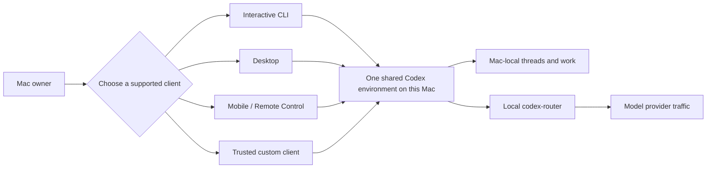
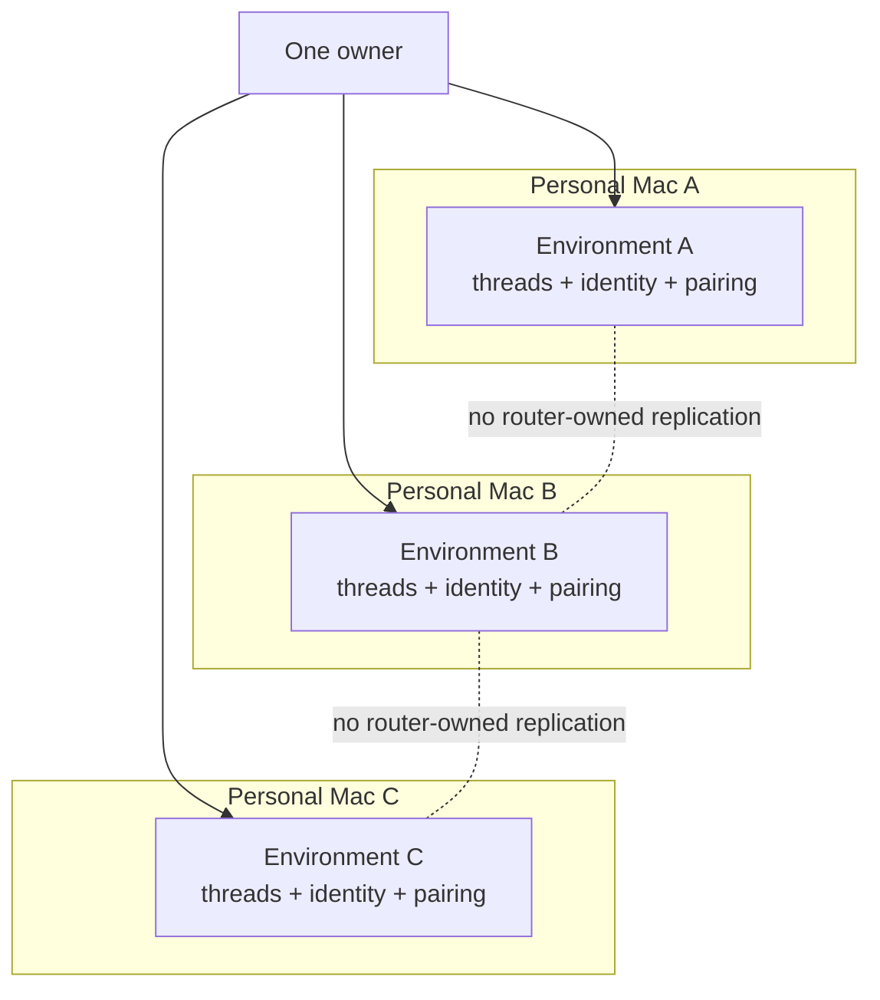
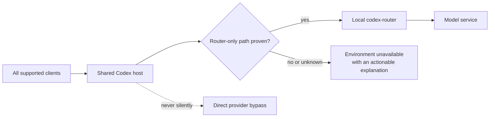
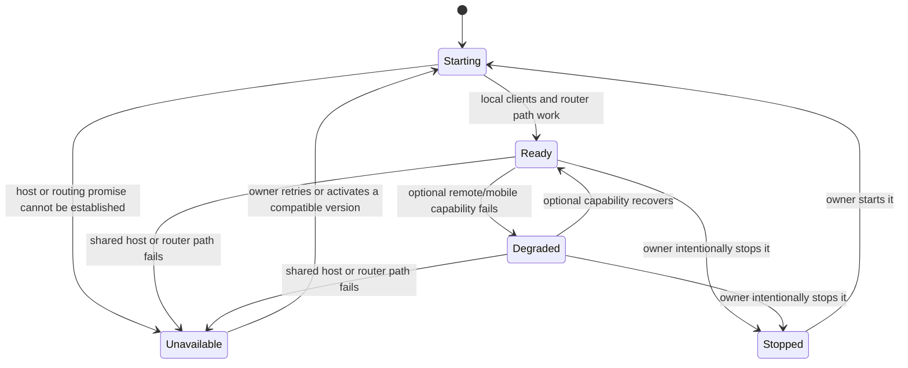

# Shared Codex Host V1 — User Requirements

Status: Proposed user requirements  
Date: 2026-07-31  
Audience: the owner of one or more trusted personal Macs  
Scope: user needs and observable outcomes; implementation choices belong in the sibling specification and program design

## The need

I use Codex from several surfaces: the interactive CLI, Codex Desktop, Codex
mobile/Remote Control, and trusted custom app-server clients. Today, those
surfaces do not give me one dependable, explicitly managed Codex environment on
each Mac. Some can start their own runtime, some integration behavior is
experimental, and the local router currently launches ordinary Codex CLI
processes rather than joining one shared host.

I want each trusted personal Mac to feel like one Codex environment. I should be
able to begin or resume work from a supported client, find the same Mac-local
threads from another supported client, and know that every model request from
that environment uses my local `codex-router` for account and quota routing.

This is not a request to merge my Macs into one distributed system. Each Mac is
an independent environment with its own runtime, threads, identity, pairing,
health, and updates.

## Who this is for

The V1 user is one trusted logged-in owner of explicitly approved personal
macOS computers. The owner may grant access to:

- the interactive Codex CLI;
- Codex Desktop, when the installed Desktop release supports the required local
  attachment behavior;
- Codex mobile/Remote Control;
- explicitly approved custom clients that speak the native Codex app-server
  protocol.

These clients are highly trusted. A connected client may be able to read files,
run tools or processes, answer approvals, and control threads. V1 does not
create a reduced-authority or partially trusted client tier.

## The experience I want

### One Mac, one environment

“One shared environment” means:

- the supported clients attach to the same running Codex host on that Mac;
- threads belong to that host and may be discovered or rejoined by another
  supported client when that client exposes the capability;
- a client disconnect does not create a second copy of a thread;
- the environment has one user-visible health and compatibility condition;
- every model request from the environment goes through the local router.

It does not mean every client must have identical UI or features. It also does
not promise uninterrupted live connections across a host restart. In V1, saved
threads survive a compatible restart, while clients may need to reconnect or be
relaunched.

### My Macs stay separate

Each Mac is set up, named, paired, diagnosed, stopped, restarted, and updated
independently. V1 does not copy runtime state, sessions, credentials, pairing,
or lifecycle state between Macs. Mobile must make the selected Mac environment
identifiable enough that I do not accidentally control the wrong one.

### The routing promise

The routing promise is fail-closed: a default profile or a cooperative client is
not enough. New threads, resumes, forks, and requests originating from CLI,
Desktop, mobile, or trusted custom clients must not be able to choose a path
that bypasses `codex-router`. If the installed Codex version cannot enforce
that promise, the environment is incompatible and must not claim to be ready.

The cost is intentional: model work may be blocked instead of silently using a
direct provider path.

### Understandable health

Ready means local supported clients can use the shared environment and the
router-only model path is proven compatible. Degraded means the core local
environment still works but an optional capability, such as mobile connectivity,
does not. Unavailable means using the environment would fail or would violate a
core promise. Status must tell me the condition, the blocking reason, and the
next useful action without exposing secrets.

## User requirements

### UR-01 — Independent environment per Mac

Each explicitly approved personal Mac must have at most one active shared Codex
environment for this product. Environments on different Macs remain independent
and require no cross-Mac router service or state replication.

### UR-02 — Shared supported-client experience

The interactive CLI, approved Desktop versions, mobile/Remote Control, and
explicitly trusted custom clients must join the same Mac-local Codex host rather
than silently creating competing hosts. A surface that cannot join must say so
clearly and must not pretend to share the environment.

### UR-03 — Thread continuity, with honest restart limits

Supported clients must operate on the host's shared threads. Durable threads
must remain available after a compatible restart. V1 may interrupt active
connections and in-flight work during restart; affected clients may require an
explicit reconnect or relaunch. The product must not claim zero-downtime or
seamless live handoff.

### UR-04 — Router-only model traffic

Every model request emitted by the shared environment must use the local
`codex-router`, including new, resumed, and forked threads and requests from
every supported client. Client input, saved thread metadata, user configuration,
or built-in provider defaults must not weaken this rule. Unknown enforcement is
failure, not readiness.

### UR-05 — Predictable availability

The environment must start predictably for the logged-in owner, recover from an
ordinary crash without creating competing active hosts, and support intentional
start, stop, and restart. An intentional stop must remain distinguishable from a
failure.

### UR-06 — Actionable, safe status

The owner must be able to learn whether the environment is starting, ready,
degraded, unavailable/incompatible, stopping, or intentionally stopped. The
result must identify the affected Mac environment, explain the primary problem,
and name a useful recovery action. It must not reveal credentials, prompts,
model traffic, pairing secrets, or other private content.

### UR-07 — Mobile identity and pairing continuity

Mobile/Remote Control pairing is per Mac. An ordinary compatible restart on the
same Mac must preserve the environment identity and existing enrollment when
Codex supports it. Explicit revocation, account changes, loss of Codex state, or
upstream invalidation may require pairing again and must be reported honestly.

### UR-08 — Local work survives remote degradation

A Remote Control relay or mobile connectivity problem must not, by itself,
prevent local CLI and other local trusted clients from using the environment.
The environment is degraded in that case. Failure of the shared host or the
router-only traffic guarantee makes it unavailable.

### UR-09 — Explicit trust for custom clients

Custom clients are included in V1 only when the owner explicitly approves them
and they use the native app-server contract supported by the installed Codex
version. V1 must make the high-authority trust consequence clear. It does not
promise per-client permissions, a public endpoint, or safe access for untrusted
software.

### UR-10 — Intentional updates and visible version drift

Installing newer Codex or router software must not silently replace the running
environment. The owner must be able to see when installed and running versions
differ and deliberately activate a compatible set. V1 does not require an
integrated downloader, background updater, zero-downtime upgrade, or automatic
rollback.

### UR-11 — Safe new and resumed work

Existing session discovery remains usable even when the shared host is down.
New work begins in the directory the user chose. Resumed work uses its valid
saved directory or requires an explicit replacement; it must not silently run in
an unrelated project. Search, filtering, useful context, and real conversation
preview remain governed by the existing Sessions product requirements.

### UR-12 — One-owner security boundary

The environment is private to the approved logged-in owner and is not public
network infrastructure. Secrets and private content must not appear in status,
deployment material, or routine diagnostics. V1 does not defend against the
same logged-in user or root after compromise and does not provide multi-user
RBAC, fleet PKI, or per-application sandboxing.

### UR-13 — Version-bounded compatibility

Sharing, Desktop attachment, mobile behavior, custom-client protocol behavior,
and router-only enforcement must be proven for the exact supported Codex and
client versions. An upgrade that has not passed those checks is not implicitly
compatible.

## Normal, degraded, and unavailable journeys

### Normal

I arrive at a Mac, see that its environment is ready, open a supported client,
start or resume work, and later find that thread through another supported
client. Model requests use the local router. Ordinary client disconnects do not
create competing copies of the host or thread.

### Degraded

The local host and router path work, but mobile cannot connect. Status names the
mobile/remote problem and keeps local work available. Recovery of the optional
capability returns the same environment to ready.

### Unavailable or incompatible

The host cannot become usable, another active owner is present, the supported
client cannot attach, or router-only egress cannot be enforced. The product
blocks affected work, identifies the failed promise, and gives a recovery
direction. It never falls back to a private competing runtime or direct model
provider without telling me.

## V1 boundaries

V1 does not provide:

- cross-Mac session, pairing, credential, or runtime replication;
- orchestration, roles, goals, scheduling, or prompt/thread rewriting;
- identical feature parity across all client interfaces;
- concurrent-edit or approval arbitration beyond the behavior of the pinned
  Codex version;
- a partially trusted raw-client tier or public app-server ingress;
- uninterrupted live connections across host restart;
- automatic installation, updating, activation, rollback, or a fleet manager;
- a replacement Codex protocol, Remote Control relay, pairing store, or session
  product.

## Feasibility gates discovered in current source

These are not optional refinements. They decide whether V1 can honestly satisfy
the requirements:

1. **Provider admission:** current Codex accepts per-thread provider selection
   and has no supported provider allowlist that pins the router. A supported
   upstream enforcement contract or another independently proven fail-closed
   boundary is required before UR-04 can be implemented.
2. **Desktop attachment:** current open-source Codex does not contain the old
   `CODEX_APP_SERVER_USE_LOCAL_DAEMON` mechanism, and public Desktop behavior
   does not establish attachment to an externally supervised local host. Each
   supported Desktop release needs real acceptance proof.
3. **CLI scope:** current interactive TUI can attach to a remote Unix endpoint;
   noninteractive commands do not all support that mode. “CLI” in V1 therefore
   means the interactive CLI unless a supported upstream contract expands it.
4. **Restart continuity:** current attached TUI exits when its app-server
   transport disconnects. V1 promises durable-thread recovery after relaunch,
   not a live connection that survives host restart.
5. **Experimental dependencies:** app-server daemon and direct Remote Control
   lifecycle/RPC surfaces are experimental and version-sensitive. V1 must pin
   and re-prove them rather than treat them as timeless contracts.

## Acceptance from a user's point of view

V1 is acceptable only when evidence from an approved Mac shows all of the
following for one pinned release set:

- interactive CLI and each admitted client attach to the same host instance;
- a thread started in one admitted client can be found or rejoined from another
  admitted client where that surface supports the action;
- controlled new, resume, and fork requests from every admitted client reach
  the local router and a direct-provider canary remains untouched;
- an explicit provider override and a persisted non-router provider cannot
  bypass the router;
- status distinguishes ready, optional remote degradation, incompatibility,
  failure, and intentional stop and gives a safe useful explanation;
- compatible restart preserves durable threads and the Mac's Remote Control
  environment/enrollment, while affected live clients reconnect honestly;
- revocation remains effective;
- updating installed software is visible and requires explicit activation;
- the same checks pass independently on each approved Mac without synchronized
  router-owned runtime state.

## Evidence basis and confidence

High-confidence current-source observations:

- router HEAD `31bb7a408225e69c5e98a36be6735c6f0b769553` has no shared-host
  control surface and currently launches ordinary Codex CLI processes;
- Codex HEAD `aea26afaee177d3fe40721ef261a29f89879d505` supports multiple
  app-server connections and shared thread subscriptions;
- the same Codex source permits per-thread provider choice and supplies no
  router-only provider-admission contract;
- the prior 610-line draft is an untracked proposal anchored to older source,
  not current product authority.

Medium or unresolved confidence:

- current closed-source Desktop attachment behavior;
- end-to-end mobile reconnect and revoke timing against the real backend;
- the acceptable enforcement owner for router-only provider admission;
- multi-client simultaneous mutation and approval behavior acceptable to the
  owner.

These unresolved points stay explicit so the specification cannot convert an
aspiration into a false current-capability claim.
