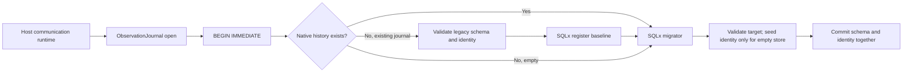

# Rust reliability improvements: program design

Contract: [Specification R1–R11](2026-09-09-sqlx-checked-queries-specification.md).
Scope: [Requirements U1–U10](2026-09-09-sqlx-checked-queries-requirements.md).

This design covers native SQLx migrations and checked queries,
targeted Proptest coverage, reproducible CI tool versions, and Nextest workflow
improvements. The test/tooling changes
are independent of the SQLx transition and do not change production behavior.

Current source baseline is `fead36b`. Rust 1.98.1 and the dev/test
`line-tables-only`, non-incremental build profiles are already on main; preserve
them rather than treating them as new work. The current CI schedules background
checks and waits for the build before launching both Nextest selections. Tool
pinning and test configuration must integrate with those dependencies.

## Target

Versioned SQL files are the schema authority. Runtime startup embeds and runs
those migrations through SQLx. Build preparation applies the same files to an
empty disposable database using SQLx tooling, then prepares committed query
metadata. Ordinary application builds use offline metadata. CI verifies its
freshness against a freshly migrated disposable database.

There is no separate schema package and no retained handwritten runtime upgrade
engine. SQL files can be applied before the application compiles, eliminating
the earlier schema-preparation dependency cycle.

```text
Versioned SQL files
  -> SQLx runtime migrator -> router database -> account operations
  -> SQLx preparation     -> disposable database -> query metadata
                                                    -> offline compiler
```

The first checked-query group remains `upsert_account`, `list_accounts`, and
`load_account` in the state store. Preserve SQL semantics, ordering, optional
results, integer conversions, and `parse_account_row` validation. Other fixed
queries remain explicitly outside first-group coverage. Dynamic SQL and migration
SQL remain runtime executed.

## Existing database transition

Current evidence: [startup](../../../crates/codex-router-state/src/sqlite.rs#L720)
performs migrations, additional schema-ensure operations, and verification.
[Version dispatch](../../../crates/codex-router-state/src/sqlite.rs#L2356)
accepts empty/version-zero and versions 7 through 13. Version 13 alone does not
identify complete physical schema: additional initialization is outside version
increments. Existing [migration tests](../../../crates/codex-router-state/src/lib.rs)
include preserved records, rollback, and contention scenarios.

SQLx 0.9 provides `Migrator::skip`, which records migration checksums without
executing their SQL. This can adopt a verified existing baseline using the native
API; manually fabricating SQLx history is unnecessary. It does not validate the
existing tables. Schema equivalence must be established before using it.

Proposed transition classification:

```text
Empty database -> execute native baseline -> SQLx owns history
Existing SQLx history -> validate checksums -> execute pending migrations
Legacy database -> validate actual schema and version
  exact baseline match -> adopt baseline via native skip -> pending migrations
  supported older shape -> explicit conversion required before baseline adoption
  unknown/inconsistent shape -> reject; do not reset or guess
```

A baseline describes the complete current schema, including tables, column types,
nullability, defaults, keys, indexes, and constraints. Validation must detect
meaningful differences rather than compare only table names or raw SQL text.
`CREATE TABLE IF NOT EXISTS` is not a schema validation mechanism.

After cutover, SQLx history owns upgrade decisions. Read-only status paths must
validate compatibility without creating history or running migrations. Legacy
`user_version` is transition input, not a second maintained migration history.
No backward compatibility with old executables is promised.

## Transition ownership and version mapping

The state package owns a bounded legacy-adoption entrypoint, not a second future
migration engine. It reads legacy shape only when SQLx history is absent. Its
conversion SQL lives in explicit legacy-import SQL assets; fresh databases never
run those assets. Future schema changes live exclusively in numbered SQLx
migrations. Existing handwritten `apply_v*` and `ensure_*` runtime paths are
removed at cutover.

| Legacy input | Conversion to the native baseline |
| --- | --- |
| Empty v0 | Execute native baseline directly. |
| Partially initialized v0 | Accept only a recognized prefix of the existing initialization; fill missing objects without replacing existing records. Unknown partial shapes fail. |
| v7 | Convert recognized old lease shape, preserving the existing legacy process ID and pressure defaults; normalize history fields, then apply policy and affinity additions. |
| v8–v9 | Normalize recognized history fields; apply policy and affinity additions. |
| v10 | Add routing policy table with final constraints and session affinities, plus recognized missing auxiliary objects. |
| v11 | Rebuild routing policy constraints from the old 1–10 percent range to 1–15 percent, preserving values; add session affinities. |
| v12 | Add session affinities and required indexes. |
| v13 | Normalize only recognized missing auxiliary objects/indexes; validate the complete baseline. |

For every row, inspect actual shape before choosing SQL. The legacy version
selects candidate shapes, not permission to run statements blindly. Conditional
column additions use finite source-backed variants, not arbitrary schema repair.
Preserve existing event/rollup default values from the original initialization.
An unknown shape of a router-owned table, conflicting constraint or trigger,
or unsupported version produces a diagnostic and no committed transition.
Unrelated tables and their rows remain untouched: the existing v10 preservation
test explicitly requires this. Do not reject an extra table merely because it
is absent from the router baseline. SQLite-owned internal objects are excluded
from application schema comparison.

Validation uses SQLite schema introspection for columns, defaults, keys, foreign
keys and indexes; known CHECK constraints require inspection of their definitions
and fixture proof. Do not build a general SQL-equivalence parser. Baseline and
legacy fixtures establish the accepted finite shapes. No application rows are
logged. Validation must finish before baseline adoption.

## Crash and concurrency behavior

Use one dedicated connection and a SQLx-managed `BEGIN IMMEDIATE` transaction
around inspection, legacy conversion, baseline adoption and pending native
migrations. The same connection is passed throughout; no pool reacquisition is
allowed inside this boundary. SQLx SQLite supports custom transaction begin and
nested transaction handling. Native migration transactions must remain enabled;
nontransactional migration files are excluded from this startup contract.

SQLx's own SQLite migration lock is a no-op. The outer SQLite writer transaction
therefore supplies exclusion, including against writers that do not know about
SQLx. A competing startup either obtains the writer transaction after the first
commits and re-inspects history, or fails through the existing SQLite busy/error
path. No new automatic retry loop is added.

```text
Acquire writer transaction
  -> inspect schema/history
  -> recognized legacy: convert -> validate -> SQLx skip one baseline
  -> fresh: execute baseline; native history: validate existing checksums
  -> execute pending native migrations -> validate target -> COMMIT
Any failure/cancellation before commit -> ROLLBACK; no adopted history survives
Crash after commit -> next startup sees native history; no legacy replay
```

This makes validation, conversion and adoption one atomic change, rather than
leaving a marker between steps. SQLx's `skip` remains bounded to the one baseline;
never mark future migrations as applied. Do not write SQLx checksum rows manually.
Unknown, dirty or checksum-mismatched native history fails without repair.

Read-only clients never create history or migrate. Without SQLx history they
retain existing legacy version/schema validation, including current v13 access.
With SQLx history they validate the supported migration set and required schema;
pending or incompatible native state fails without repair. The narrow weekly-floor
writer likewise preserves its current legacy validation until adoption, and uses
native compatibility validation afterward. Only writable state startup owns adoption. Old executables are not supported after cutover; no
production process replacement is authorized by this design.

## Legacy fixture inventory

All anchors below refer to [state tests](../../../crates/codex-router-state/src/lib.rs).

| Fixture/source | Required import behavior |
| --- | --- |
| `convert_current_fixture_to_v10` (line 82), preservation test (line 356) | Add policies and affinities; preserve account/quota/lease/history rows and unrelated sentinel table. |
| `convert_current_fixture_to_v11` (line 94), constraint test (line 458) | Preserve policy values while widening its CHECK range; add affinities. |
| `convert_current_fixture_to_v12` (line 117), affinity migration test (line 176) | Add affinity table/index without changing prior records. |
| `create_v8_database_with_current_active_lease` (line 4617), test (line 2386) | Preserve live lease pressure; do not fabricate historical session events. |
| `create_partial_v10_database_missing_active_session_columns` (line 4765), test (line 2425) | Add recognized interval and rollup fields with existing defaults. Create missing baseline objects empty while retaining these existing records; never synthesize account identities from leases. |
| `create_v10_database_missing_async_projection_tables` (line 4710), read-only test (line 1596) | A claimed current version with missing schema fails read-only validation without writes. |
| v2/v3/v6 fixture constructors (lines 4402–4616) | Used by synchronous fixture storage, not accepted by the production async version dispatcher. Preserve their historical tests without claiming production support for these versions. |

Native baseline SQL contains the complete current schema. Legacy-import SQL
assets own only needed deltas: old lease-table rebuild, history-column additions,
policy-table creation/rebuild, and affinity creation. Existing source provides
SQL for these operations; source-to-asset transcription must preserve constants,
copy columns, defaults, and transactions. Fixtures must become independent of
the new initializer where their purpose is to represent historical schema.

v7 and v9 lack dedicated constructors in this inspected fixture set. Their
accepted shapes need explicit fixtures derived from version-dispatch and migration
source. Do not manufacture a claim that those transitions are already tested.

## Remaining proof limits

The above is a structural choice grounded in SQLx 0.9 source. Its worker tracks
transaction depth and uses savepoints for nested default transactions, while
custom BEGIN is allowed only at depth zero. This supports an outer managed
BEGIN IMMEDIATE with ordinary nested migrator transactions, not raw untracked
BEGIN SQL. It is not executed SQLx integration proof. Implementation must establish that native run/skip on the
borrowed transaction connection preserves nesting, rollback and exclusion.
The per-object inventory below defines the admitted shape variants and import
operations. Their SQL transcription and fixture execution remain implementation
proof obligations. Version-zero partial initialization is not an empty database.

No production database has been accessed. Preserve current data in real fixture
transitions, including row identities and values, not only row counts. A schema
or value mismatch stops the transition rather than discarding data.

## Evidence required

R1–R3: real compiler rejection, offline build without schema access, and metadata
freshness pass/fail against native migrations. R4–R5: account behavior and exact
query inventory. R6: fresh initialization and every supported legacy shape,
record preservation, schema mismatch rejection, interrupted adoption recovery,
concurrent startup, and read-only startup without writes.

External anchors: installed SQLx 0.9 source, `sqlx-core/src/migrate/migrator.rs`
(`skip`, `run`) and `sqlx-sqlite/src/migrate.rs` (`apply`, `skip`, `lock`). The
external generated summary incorrectly reported no native skip API; direct
version-matched source takes precedence.

## Proptest: generated inputs at existing boundaries

The protocol crate owns decoder strategies and assertions in its existing test
surface. The selection crate owns its domain strategies. Proptest is a dev-only
dependency; no new production package, runtime scheduler, or generic test framework
is introduced. The workspace lockfile records the resolved dependency.

Current anchors: [frame tests](../../../crates/communication-protocol/tests/control_frame_decoding.rs)
and [selection examples](../../../crates/codex-router-selection/src/lib.rs).

```text
Existing: handwritten case -> real decoder/domain method -> expected result
Added: bounded generator -> same real method -> independent property assertion
          failure -> shrinking -> replay seed + minimal case -> failing Nextest result
```

For framing, generate lists of JSON objects and serialize them independently,
then split the valid byte stream at arbitrary positions, including inside UTF-8
characters. Concatenated decoded results must equal the original object list in
order. Limit total generated bytes and nesting; explicitly exercise limit-minus-one,
limit and limit-plus-one cases instead of relying on random discovery. Generate
invalid frames separately and assert terminal closure after errors and bounded
buffering. Do not assert identical delivery before an error for every chunking:
the current push API returns one Result for a batch, so mixed valid/invalid
batches require their own contract rather than an invented streaming guarantee.

For selection, begin with eligibility invariants: zero headroom is ineligible;
effective headroom never exceeds input; fresh candidates preserve headroom.
Generate boundary headroom and freshness combinations. Weighted selector tests
may assert that a result belongs to a nonempty supplied candidate set and that
an empty set returns None. More ambitious fairness properties require a defined
oracle and validation of the production call path; they are not inferred merely
from the existence of WeightedDeficitSelector. Do not change routing behavior to
satisfy a generated assumption.

Keep strategies beside the owning tests and configure bounded cases/input sizes
there. Use Proptest failure persistence and publish replay seeds on CI failure;
review and retain minimized regression cases in the repository. Preserve targeted
handwritten edge cases and real socket/SQLite/process tests. Generators use only
synthetic data and never invoke live accounts or paid model calls.

R7 proof is an actual generated run through production methods plus a controlled
invariant violation that fails and replays. Shrinking, persistence and replay
must work in the chosen Nextest environment. This is planned proof, not evidence
already obtained. Runtime and resource bounds must be calibrated during the
initial implementation; no speed claim is made.

## CI tools: one version declaration, enforced after cache restoration

Current [CI](../../../.github/workflows/ci.yml) accepts any existing executable
and otherwise installs an unversioned crate. The Rust compiler is already pinned;
this change addresses tool binaries, not compiler policy.

A single repository-owned machine-readable declaration contains exact Nextest,
cargo-deny and cargo-audit versions. One bootstrap entrypoint consumes it for CI
and local use. It installs into a dedicated tool directory rather than replacing
unrelated globally installed tools. CI invokes that directory explicitly or
prepends it to PATH and verifies the resolved executable's version.

```text
Version declaration -> bootstrap -> version check -> ready tools -> existing gates
Cache restoration --------^         mismatch -> exact installation -> recheck
                                    failure -> stop; no latest-version fallback
```

Tool cache identity includes declared versions and platform/architecture; it is
separate from compiled project artifacts. Cache identity is an optimization,
not proof: bootstrap checks actual versions even after a successful restoration.
A missing or mismatched binary is installed with an exact crate version and
locked dependencies. Failed installation or a second mismatch fails bootstrap.
No background updater or new daemon is added.

A contributor changes the declaration to upgrade a tool. That change invalidates
the applicable tool cache and must pass existing checks. Local bootstrap uses the
same declarations as CI. Advisory databases remain current; pinning an audit
executable must not freeze vulnerability information. These pins do not promise
bit-for-bit reproducible binaries or identical advisory results across dates.

R8 proof covers clean cache, matching cache, stale/wrong-version cache, and
unavailable pin behavior with actual tool-version observations. Preserve current
formatting, Clippy, Nextest, dependency checks and PTY harness. Current main no
longer contains the earlier workflow-lint job; do not describe it as an existing
passing gate. Validate any workflow changes with applicable workflow tooling.
Exact versions are selected against compiler/platform compatibility at planning;
no version numbers have been researched or approved by this design.

## Nextest: focused feedback with complete CI coverage

The repository currently invokes Nextest for the PTY harness and again for the
workspace, without a checked-in Nextest configuration. Keep Nextest as the test
runner; this work configures its use rather than adding another runner.

Repository-owned Nextest configuration owns local and CI execution policy.
Focused developer selections target the affected package or named test group;
the default full CI run retains the workspace test inventory and existing
feature-specific harness prerequisites. Organize selections by domain and real
resource needs, not by renaming every test or moving integration tests merely
to fit a category. SQLx transition tests and Proptest cases join their owning
packages and are included in complete runs.

```text
Developer -> focused selection -> Nextest -> existing real tests -> diagnostics
CI -> required builds/fixtures -> full selection -> Nextest -> complete result
                                         property case -> failure seed retained
```

CI collects the full failure report rather than stopping at the first failure.
Keep retries disabled for the added property and migration proof paths. Configure
slow-test reporting separately from termination limits; select limits from
existing explicit test deadlines and representative runtime evidence, with
headroom for CI. Do not impose one short timeout on process/PTY tests or raise
limits to conceal a hang. Exact measured limits remain an implementation input.

Use Nextest test groups to bound concurrency only where source or failures show
shared resources. Per-test temporary databases/sockets should remain parallel;
process tests are not automatically serialized just because they launch children.
A shared external/native resource needs an explicit group and limit before its
journey can join unattended runs. Paid/live model scenarios are not added to
normal Nextest execution by this design.

The existing harness is selected separately and also belongs to the workspace.
Do not remove either invocation merely as an optimization: first compare their
feature/build context and test lists. Any consolidation must preserve both the
harness-specific proof and full workspace coverage. Doc tests require separate
Cargo execution when present; Nextest results must not be described as doc-test
coverage.

R9 proof compares Nextest discovery and execution lists, demonstrates that focused
runs select the intended cases while CI remains complete, and observes failure,
slow-test and generated-case replay behavior. Existing runtime integration gates
remain authoritative. Native configuration syntax and selected-version support
must be verified before implementation. No timeout/concurrency values or speed
improvement are claimed as already established.

Mutation testing and coverage use separate tools integrated with the existing
test runner, as described below; neither is supplied merely by using Nextest.

## Error compatibility at the migration boundary

The state package translates schema/SQLx outcomes before they reach callers.
Keep existing domain error variants and weekly-floor UI mappings. A SQLx error
must not escape directly as a new public error type.

| Boundary / condition | StateStoreError result |
| --- | --- |
| Legacy unsupported numeric version | `UnsupportedSchemaVersion` with the observed legacy version. |
| Recognized legacy version, conflicting object shape | `Sqlite` with a static, redacted incompatible-schema diagnostic; rollback. |
| SQLx dirty history | `Sqlite` with static dirty-migration-history diagnostic; do not skip or repair. |
| SQLx checksum mismatch or unknown applied migration | `Sqlite` with static incompatible-migration-history diagnostic; do not ignore missing versions. |
| Writable initialization SQL failure or busy | Existing `Sqlite` classification and redaction; no new retry policy. |
| Read-only legacy non-current version | Existing `UnsupportedSchemaVersion` classification, no writes. |
| Read-only current legacy schema missing required object | Existing `MissingReadOnlySchemaObject` with static object name; retain validation order for existing cases. |
| Read-only valid current legacy schema | Open successfully using existing read-only validation; absence of SQLx history is not an error. |
| Read-only native history with pending migration | `Sqlite` with static writable-upgrade-required diagnostic; no history creation. |
| Read-only native current schema missing required object | `MissingReadOnlySchemaObject`; no repair. |
| Weekly-floor opener sees valid current legacy schema | Preserve current successful open without adopting history. |
| Weekly-floor opener sees old legacy version or pending/incompatible native schema | `WeeklyQuotaFloorSchemaUpgradeRequired`, preserving its existing user-facing category. |
| Weekly-floor mutation hits existing bounded contention path | `WeeklyQuotaFloorDatabaseBusy`; preserve its retry-message mapping. |
| Account/domain decode or credential concurrency failure | Existing `CorruptAccount`, policy-corruption, integer-validation and `AccountConcurrentModification` behavior remains in domain adapters. |

New history diagnostics describe genuinely new failure conditions, not replacement
messages for existing account or busy errors. They contain no database path,
account values, SQL parameter values or secret content. Native migration versions
must not be squeezed into the old legacy-version field to suggest an equivalent
`user_version`.

Current anchors: [state errors](../../../crates/codex-router-state/src/sqlite.rs#L594),
[weekly-floor open](../../../crates/codex-router-state/src/sqlite.rs#L2822),
[quota error mapping](../../../crates/codex-router-cli/src/quota/quota_status_command.rs#L96).
Read-only callers do not adopt history. Valid current legacy readers and the
narrow weekly-floor writer keep working until writable startup adopts it. The
absence/presence of SQLx history selects validation authority, not two upgrade
engines. Test both validation modes and verify that neither mutates schema/history.

## Preservation check within legacy adoption

After obtaining the writer transaction and before conversion, retain an in-memory
snapshot of the small critical account/policy/affinity row sets, keyed by their
existing primary keys. Compare the same values after conversion and before
commit: account ID, label, status, nullable active credential generation; weekly
floor policy values; affinity pins; previous-response owners including generation,
transport and timestamps; and session affinity identity/account/timestamp.
Missing tables in an admitted old shape represent empty sets, not reconstructed
records. Any difference aborts the transaction. No snapshots or row values are
written to logs or new durable files. Domain reads remain responsible for domain
validation; migration does not refresh credentials or normalize account status.

The secret store is outside this operation. Preserving account ID and credential
generation preserves the lookup key; it does not prove a preexisting token exists
or remains valid. Fixture proof uses synthetic secret material through the existing
auth resolver to verify unchanged lookup behavior without touching production
secrets. Other table preservation is proved with real fixture values and existing
migration contracts, including the unrelated sentinel table and lease/history
semantics; no cache/history deletion is authorized.

## Execution-proof coverage

These are required proof seams and outcomes, not completed test results. The
state package owns transition fixtures and migration execution; existing CLI,
auth and integration harnesses own consumer observations. All use disposable
state and synthetic credentials. No live production transition is a test fixture.

| Case | Input and real boundary | Required observation |
| --- | --- | --- |
| Fresh | Empty database, native baseline through SQLx | Complete schema, one valid baseline history row, working account round trip. |
| v0 partial | Each statement boundary of legacy fresh initialization | Existing values retained; completion or source-defined rejection; no silent reset. |
| v7 | Both lease-table shapes admitted by existing v8 upgrade logic | Legacy defaults applied only where absent; row identities and pressure semantics preserved. |
| v8/v9 | Known lease/history layouts and recognized missing auxiliary objects | Current lease survives; no invented historical events; complete target schema. |
| v10 | Full downgraded fixture and partial history-column fixture | Existing values/defaults preserved; missing objects created empty; no fabricated accounts. |
| v11 | Existing constrained policy fixture | All stored policy values preserved; wider constraint accepts/rejects correct boundaries. |
| v12/v13 | Missing affinities for v12; complete and recognized auxiliary omissions for v13 | Required additions only; existing account/policy/affinity records unchanged. |
| Rejection | Unknown version, conflicting owned-table shape, dirty or changed native history | Exact mapped error; no committed changes to data/schema/history. |
| Unrelated data | Existing sentinel table/rows alongside supported router schema | Unrelated objects and values untouched. |
| Reopen | Successful adoption followed by another writable open | No duplicate baseline registration or replayed legacy conversion. |

Historical fixtures must not be built by the new initializer then assumed to
represent all old states. Existing downgraded fixtures remain useful but are
supplemented with independent legacy DDL for missing variants. The v7/v9 fixtures
are new coverage to create, not existing proof. Statement-prefix generation is
bounded to the known legacy initialization source, not arbitrary malformed SQL.

### Native SQLx transaction proof

```text
Real test child -> dedicated SQLx connection -> managed BEGIN IMMEDIATE
  -> real legacy conversion + Migrator.skip/run -> checkpoint notification
Parent -> inject failure or terminate child -> independent SQLite reopen
       <- schema + exact rows + migration history + ability to acquire writer
```

Observe checkpoints after conversion, after baseline registration, after nested
migration release, and after outer commit. Before-commit failures must leave the
original schema/data/history; after-commit restart must see the complete native
state. A commit acknowledgement lost to cancellation is resolved by reopening
and inspecting native history, not by assuming rollback or replaying conversion.
Use explicit child/parent handshakes, not timing sleeps. Graceful cancellation,
unhandled process exit and competing processes are distinct cases.

A competing real SQLx opener must either wait and re-inspect committed history,
or return its mapped busy error without mutation. On release of the first writer,
a retry must complete without duplicate rows. The outer transaction must be
created through SQLx transaction management so nested migration transactions
use savepoints. Python SQLite experiments establish primitive behavior only;
they do not satisfy this integration gate.

### Consumer and tooling coverage

- Account fixture: preserve labels, enabled/disabled state, null and non-null
  credential generations; existing resolver finds the same synthetic credential.
- Policy/affinity fixture: compare complete keyed values, including timestamps
  and source transport; no deletion is authorized on the basis that data is a cache.
- Read-only and weekly-floor fixture: verify the error table and no database writes
  on open; after writable adoption, existing account/quota UI behavior is retained.
- Repository proof: retain required auth, routing, byte-preserving forwarding,
  host/session/communication and PTY gates. Compare failures with the unmodified
  baseline before assigning them to this change; unrelated fixes need separate scope.
- Checked-query proof: valid compile, bad column and incompatible mapping failures,
  missing metadata failure, offline compile with no schema access, and stale
  metadata rejection against a freshly migrated database.
- Proptest proof: real generated cases, a controlled failing invariant and replay
  of its minimized case/seed. It supplements handwritten tests, not concurrency proof.
- CI bootstrap proof: absent, correct and wrong-version cached binaries; exact
  resolved executable versions; installation failure stops rather than using latest.
- Nextest proof: discovered/executed inventory under each required feature context,
  focused selection correctness, full failure reports and measured slow-test policy.

## Read-only compatibility during adoption

Preserve current legacy read-only and weekly-floor access when their existing
version/schema checks pass. Missing SQLx history alone must not cause an outage.
Once history exists, native compatibility validation is authoritative and the
legacy version is no longer used for upgrade decisions. This transition preserves
consumer behavior without retaining the handwritten migration engine.

Proof must exercise valid v13 before and after adoption, invalid/missing schema,
older legacy versions, native pending/checksum-mismatched history, and unchanged
schema/history during non-migrating opens. Do not require old executable versions
to understand native history; that is outside the compatibility promise.

## Finite legacy object inventory

This table refines the version table; it is not a second set of alternatives.
An admitted database is a composition of these object variants subject to the
version guards below. Validate all owned objects before applying changes. Normal
column order differences caused by ALTER additions are acceptable; names, declared
types, nullability, defaults, key positions and constraints must match the listed
source definition. Missing versus explicit NULL defaults are equivalent; do not
silently weaken non-null or CHECK constraints.

Operation names below identify single-purpose legacy SQL assets, not new public
APIs. Baseline-create operations reuse the corresponding canonical migration
statement rather than maintaining another full schema definition.

| Owned object | Admitted shape and validation anchor in sqlite.rs | Conversion operation |
| --- | --- | --- |
| accounts | Current four columns in ASYNC_V1_SCHEMA_STATEMENTS | Keep unchanged, or create empty when missing in an admitted partial input. |
| quota_snapshots | Current eight columns including nullable reset_credits_available, same source | Keep, or create empty; missing column in an existing table is not a v7+ variant. |
| affinity_pins | Current two columns/key, same source | Keep or create empty. |
| selector_quota_windows | Current eight columns/composite key, same source | Keep or create empty. |
| quota_refresh_status | Current six columns/composite key, same source | Keep or create empty. |
| previous_response_affinity_owners | Current six columns/composite key, same source | Keep or create empty. |
| quota_history_observations | Exact ASYNC_QUOTA_HISTORY_SCHEMA_STATEMENTS table | Keep or create empty; preserve IDs and AUTOINCREMENT high-water state. |
| active_client_leases | Current ASYNC_ACTIVE_CLIENT_SCHEMA_STATEMENTS shape; v7 additionally admits the old route_band/reservation_id/account_id/acquired_unix_seconds projection with its historical key | Current: keep; absent: create empty; old v7: lease-v7-to-baseline rebuild from apply_v8 with process_run_id='legacy' and active_pressure=8. |
| route_band_account_states | Exact ASYNC_ROUTE_BAND_ACCOUNT_STATE_SCHEMA_STATEMENTS | Keep or create empty. |
| active_session_events | Baseline table or baseline without any subset of the four explicitly added interval/transport columns in ensure_active_session_history_schema | history-events-add-missing: logical_session_id TEXT NOT NULL DEFAULT '', session_started_unix_seconds INTEGER NOT NULL DEFAULT 0, session_ended_unix_seconds INTEGER, transport_kind TEXT NOT NULL DEFAULT 'unknown'; keep existing fields and IDs. |
| active_session_rollups | Baseline table or baseline missing either/both explicit completed_sessions and stale_purged_sessions additions | history-rollups-add-missing: add absent INTEGER NOT NULL DEFAULT 0 columns; preserve existing values. |
| account_routing_policies | Absent before v11; V11_ACCOUNT_ROUTING_POLICY_TABLE_SQL at v11; final V12 constraint at v12/v13 | Absent pre-v11: baseline policy create; v11: policy-v11-to-baseline rebuild using existing explicit two-column copy; v12/v13: keep. Missing at v11+ rejects. |
| session_account_affinities | Absent before v13; exact V13_SESSION_ACCOUNT_AFFINITY_TABLE_SQL at v13 | Pre-v13: create; v13: keep. Missing at v13 rejects as inconsistent rather than guessing completed history. |

Recognized optional history fields may occur at any of v7–v13 because existing
ensure logic runs independently of version increments. If history tables are
absent, create baseline tables rather than running column additions. Existing
fields must match either their direct-create or explicit ALTER-default form.
At v7 the old lease key/copy is accepted only when conversion is injective:
conflicting target keys reject, rather than reproducing INSERT OR IGNORE data
loss. Preserve record identity; do not invent completed history from leases.

Indexes are the named quota-history lookup, lease lookup, three history lookups,
and session-affinity lookup in the existing constants. For each: absent means
create; present means verify the same table, columns/order and uniqueness. A
conflicting same-name object rejects. Other indexes and unrelated tables stay
unchanged unless they depend on a rebuilt table; unexpected dependent triggers,
views or indexes on the two rebuild targets reject instead of silently dropping
them. SQLx internal bookkeeping is outside this legacy table set.

Version guards: v0 permits only prefixes of ASYNC_V1_SCHEMA_STATEMENTS before
its user_version update, with compatible existing records; finish those baseline
objects then continue. v7 selects the optional old-lease conversion; v8/v9 select
only current leases. v7–v10 require absent policy/affinity tables before additions;
v11 requires old policy and absent affinity; v12 requires final policy and absent
affinity; v13 requires both current tables. Interrupted transactional policy or
affinity changes roll back; leftover replacement tables or conflicting version/
shape combinations are not silently adopted.

Missing core tables in the known partial-v10 fixtures are created empty. This
preserves their usable existing data and establishes a complete baseline without
claiming that absent accounts ever existed. The missing-projection fixture must
be tested in both modes: writable completion and read-only rejection without
writes when required objects are missing. Existing unrelated sentinel values
must survive both schema classification and writable adoption.

Every table row requires fixture coverage for keep/create/rebuild/add/reject as
applicable; that coverage is not claimed to have been executed. Exercise independent object variations, their interactions in full
v7/v9 inputs, all v0 statement prefixes, and complete v10–v13 fixtures. Raw SQL
text formatting is not an acceptance discriminator. Constraint recognition is
limited to these known definitions; unfamiliar expressions reject rather than
requiring a general SQL parser.

## Automation storage: native migration ownership

Keep two migration directories, each owned and embedded by its existing storage
crate. Account migrations apply only to the account database. Automation migrations
apply only to automation.sqlite. No shared schema package, merged database or
cross-database transaction is introduced.

```text
codex-router-state -> account migration set -> state.sqlite

automation-storage -> automation migration set -> automation.sqlite
                       same SQL files -> disposable build/test database
```

Move the existing [automation_schema.sql](../../../crates/automation-storage/src/automation_schema.sql)
into the automation migration set as its baseline. Preserve its SQL semantics,
foreign keys (including deferred references), indexes and enabled boolean check.
Remove the inline user_version dispatcher from
[schema_initialization](../../../crates/automation-storage/src/schema_initialization.rs).
SQLx owns future migration history. This replaces bookkeeping, not the domain
schema or scheduling architecture.

`AutomationStore::open` continues to own connection setup and initialization.
Preserve foreign_keys=true, DELETE journal mode, FULL synchronous mode and the
one-second busy timeout from
[automation_connection](../../../crates/automation-storage/src/automation_connection.rs).
Run initialization on that connection inside the existing managed writer
transaction. Empty state executes the native baseline. Existing v1 state matching
the baseline adopts it using SQLx skip, with no domain-table rewrite. Existing
native history uses normal migration validation/run. Unknown version or incompatible
schema fails through existing UnsupportedVersion/InvalidSchema categories; SQL
execution failures remain Database errors. Dirty/checksum-mismatched migration
history maps to InvalidSchema. No extra historical converter is needed.

Keep the baseline match bounded to this single known SQL schema, including its
columns, keys, deferred foreign keys and indexes. SQLx's own bookkeeping table
is not an eleventh domain table or an invalid schema: replace the old exact-table
name check accordingly. Nonempty v0 remains invalid, as in the current initializer.
Adoption failure rolls back and reports an error; it does not delete/recreate the
file. Use the same native transaction proof seam already defined above.

Initialization makes no scheduling or native submission calls. It leaves all ten
domain tables' values untouched on v1 adoption, including JSON/BLOB bytes, nullable
fields and automation_events sequence/high-water state. In particular, preserve
operation receipts and uncertain effects so opening the database cannot authorize
a duplicate native submission. Preserve deadlines, timing watermarks, first-fire
evidence, captured destinations, worker outcomes and summaries. Existing service
recovery remains responsible for deciding what happens after a successful open.

Proof uses an independent v1 fixture from the current SQL asset and the real
AutomationStore entrypoint: fresh initialization, v1 adoption, repeat open,
rollback and concurrent open; compare domain values and foreign-key integrity.
Retain existing automation tests for operation replay, one-run occupancy,
thread ownership, summary recovery, wake timing and uncertain delivery recovery.
No live model call or production database is needed for migration proof.

The checked-query group remains the three account methods already selected;
automation queries remain runtime-checked in this first group. Its native migration
conversion is included independently. Do not point workspace-wide query preparation
at a database with the wrong schema: prepare the adopting account package against
its own database. Future checked automation queries require their own schema-bound
preparation invocation. No new query-conversion scope is implied here.

### Automation migration errors and rejection proof

Translate SQLx 0.9 MigrateError at the automation initializer boundary:

- Execute and ExecuteMigration retain their underlying sqlx::Error and map to
  StorageError::Database, preserving the availability/execution category.
- VersionMissing, VersionMismatch, VersionNotPresent, VersionTooOld, VersionTooNew
  and Dirty map to InvalidSchema. No history repair or ignore-missing mode follows.
- Source and unsupported-operation/configuration variants (ForceNotSupported,
  InvalidMixReversibleAndSimple, CreateSchemasNotSupported, SkipNotSupported)
  map to InvalidSchema: the installed migrator cannot establish a compatible
  schema. Embedded migration sources make runtime source resolution unnecessary,
  but failures still stop initialization without changing records.
- Future non-exhaustive variants conservatively map to InvalidSchema until an
  intentional SQLx upgrade classifies them. No retry is inferred from that fallback.
- UnsupportedVersion remains exclusively the observed legacy user_version case;
  it is not populated with an unrelated SQLx migration number.

This uses existing public error categories; InvalidSchema represents incompatible
schema or migration configuration, not permission to erase data. Diagnostics must
not expose stored instructions, receipt payloads, SQL parameters or filesystem
paths. Verify the StorageError observed at AutomationStore::open and the existing
service error projection for execution versus schema failures.

Build independent negative v1 fixtures: change a column type/nullability/default,
remove or weaken the enabled boolean CHECK, change a foreign-key target or its
deferral, and change/drop a required index. Also cover missing/extra domain tables
and conflicting SQLx history. Each incompatible fixture must return InvalidSchema;
an unsupported legacy version returns UnsupportedVersion. After failure, inspect
through a separate raw SQLite connection and verify unchanged domain values,
sqlite_sequence, user_version and migration history (including continued absence
when adoption never committed). Fixture DDL comes from the historical SQL source,
not from the validator's expected-schema representation. Positive tests alone
cannot establish that the validator does more than compare table names.

## Mutation testing and diagnostic coverage

Use cargo-mutants for bounded changed selection/protocol logic and cargo-llvm-cov
for package-level coverage, including state/automation migration tests. They are
developer or explicitly triggered diagnostic jobs, not additions to every ordinary
save/build or automatic whole-workspace gates. Existing required tests, real-path
proof and CI checks remain authoritative.

```text
Selected logic + relevant real tests -> cargo-mutants -> candidate assertion gaps
Selected package + instrumented tests -> cargo-llvm-cov -> unexecuted paths
                                     maintainer interprets findings against contracts
```

The owning package supplies the tests; no alternate model of production behavior
is introduced. Mutation runs start from a passing scoped baseline and use isolated
scratch changes. Report killed, surviving, unviable and timeout/error outcomes
separately. A survivor requires inspection for a meaningful observable behavior
change before becoming a missing-test finding; equivalent mutations do not justify
artificial assertions. Do not mutate generated metadata or migration history to
satisfy a score. Migration correctness remains observed through real database
transitions, rollback and record preservation.

Coverage reports identify package, targets/features and source revision. Preserve
line/region distinctions and explicitly state unavailable branch/doc-test coverage.
Child-process migration proof counts only when child binaries are instrumented
and their profiles collected; otherwise name that gap. Executed lines do not prove
assertion strength, concurrency safety or correct requirements.

Tool versions join the shared exact-version declaration when introduced. Coverage
uses compiler-compatible LLVM tooling; do not introduce nightly solely to obtain
optional report modes. Keep scratch/build output isolated and bounded, run these
jobs without competing full-workspace builds, and clean only owned artifacts.
Exact invocation, resource limits and version selection belong to planning.

R11 proof is one representative scoped run for each tool: observe a known broken
behavior detected by tests, inspect any survivors, and confirm coverage includes
the intended real execution path. Record tool failures and instrumentation gaps.
No minimum percentage or universal mutation-kill requirement is added. Findings
become scoped test improvements only when tied to an accepted behavior contract;
unrelated product defects remain separate work.

Diagnostic builds preserve SQLX_OFFLINE and include committed query metadata in
mutation scratch trees. Cargo's network-offline flag is not a substitute for
SQLx's build-time schema policy. Coverage instrumentation uses a dedicated target
so automatic coverage cleanup cannot remove ordinary build artifacts. For external
child tests, generate instrumentation environment once, build/run through normal
Cargo/Nextest with that environment, then collect using the coverage report path;
do not recursively invoke instrumenting wrappers in an already-instrumented shell.

## Complete production schema ownership

| Database owner | Startup migration entrypoint | Native migration set | Legacy entry boundary |
| --- | --- | --- | --- |
| Account state | `codex-router-state/src/account_migrations.rs::migrate` | `codex-router-state/migrations/` | Validated v0/v7–v13 conversion only while native history is absent. |
| Automation | `automation-storage/src/schema_initialization.rs::initialize` | `automation-storage/migrations/` | Validate existing v1, then register its baseline. |
| Lifecycle journal | `lifecycle-observation/src/journal_migrations.rs::initialize` | `lifecycle-observation/migrations/` | Validate the five-table legacy schema, metadata version and identity, then register its baseline. |



The journal retains DELETE journaling, FULL synchronous mode and its existing
busy timeout. The write transaction serializes startup before deciding whether
to adopt or initialize. The baseline contains the existing table definitions;
identity and zero checkpoint insertion remain domain initialization within that
same transaction. Existing stores are never reseeded. SQLx owns checksums and
future history; error mapping preserves `JournalError::Storage` for SQL execution
failures and `InvalidStorage` for incompatible history.

The exact legacy definitions come from the previous initializer and are checked
before adopting its baseline. Tests keep an independent legacy SQL fixture,
compare every domain table across adoption, reject schema/history corruption,
and exercise concurrent opens plus existing append/reopen/retention behavior.
The mutable `lifecycle-observation/src/journal_schema.sql` target must be updated
alongside any future schema change. Legacy validation continues to use the
immutable baseline; applied migration files remain immutable. A two-version
regression verifies later migration and reopen without changing the baseline
checksum. Build scripts in all three owners track their migrations directories
so stable Cargo builds notice newly added numbered migrations.

The account store retains bounded one-time conversion SQL, including finite
conditional additions, to preserve supported old data. This does not own future
upgrades. Its synchronous Rusqlite migration implementation is compiled only
for tests or the optional fixture feature. External Codex SQLite readers do not
create or migrate its schema. No other production schema initializer is excluded
from the SQLx ownership requirement.
