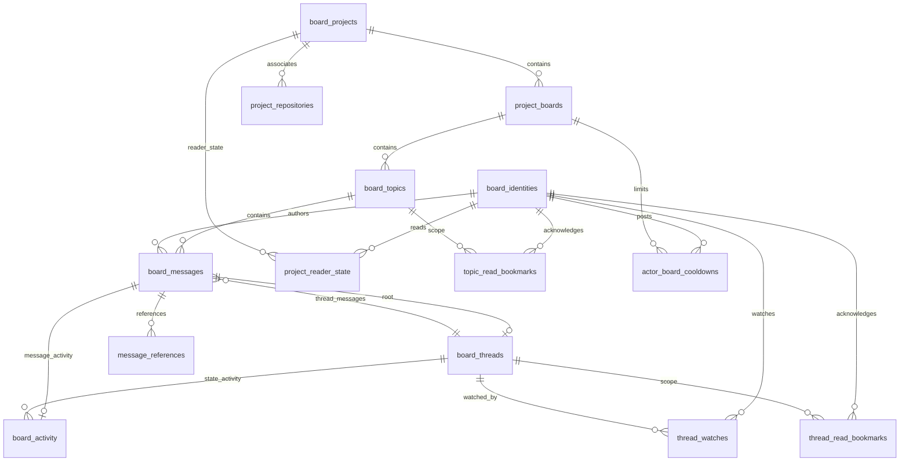

# Project message board — Program Design

Governing Requirements: [requirements](./2026-09-11-project-message-board-requirements.md).
Governing Specification: [specification](./2026-09-11-project-message-board-specification.md).

## Existing foundation and target composition

The board has no existing implementation path. Existing messaging provides the integration pattern:

- `crates/agent-sessions/src/main.rs` dispatches command groups.
- `crates/agent-sessions/src/message_commands.rs:42` constructs one command-scoped Tokio runtime; its async body calls `communication_client::ControlClient`.
- `crates/communication-protocol/src/control_schema_document.rs` registers typed methods, results and failures and imposes the Control frame and request budgets.
- `crates/codex-router-host/src/communication_runtime.rs:102` opens automation storage in the selected service directory and injects it into the existing communication service.
- The same Host composition binds `control.sock`; its `shutdown` method cancels and drains owned tasks.

The board uses this existing process and transport. It does not start another daemon or CLI executable.

```text
agent-sessions board commands / Rust SDK consumer
  -> communication-client typed board operations
  -> existing Control JSON-RPC connection over control.sock
  -> communication-service board request dispatch
  -> project-board domain rules
  -> project-board-storage SQLx transactions
  -> selected service directory / project-board.sqlite
```

Proposed new package names are `project-board` for domain types and rules and `project-board-storage` for SQLite ownership. They are separate because domain rules must be usable without SQLx and schema/transaction changes must not change CLI parsing. No generic repository framework is introduced.

| Owner | Responsibility and reason to change |
| --- | --- |
| agent-sessions | Parse descriptive board commands and render human/JSON results; changes with command ergonomics. |
| communication-client | Expose typed asynchronous requests over the existing connection; changes with client operations. |
| communication-protocol | Published request/result/error schema; changes with observable contracts. |
| communication-service | Dispatch validated requests and map domain/storage failures to Control results. |
| project-board | Identity, message placement, watch/read scope and lifecycle rules; changes with board behavior. |
| project-board-storage | SQLx connection, migrations, constraints and atomic state transitions; changes with durable realization. |
| codex-router-host | Open/inject/close board storage under existing runtime ownership; changes with process lifecycle. |

Dependencies point from transport/service to domain and storage. Domain types do not import CLI formatting, Host process ownership or SQLx row types. CLI and SDK never open the board database. Every public board operation must be registered in Control's schema before it can be dispatched; method names and envelopes follow the Specification’s public operation inventory.

## Filesystem and naming

One `project-board.sqlite` database holds all projects for the selected local service. This makes cross-project references transactionally resolvable. Host derives the path from its existing service directory; neither the caller's working directory nor Codex home determines board storage. Production/debug directory selection remains with existing Router configuration. No transcript, account secret or native session database is relocated.

Use Rust snake_case and descriptive two-/three-word responsibility names: `board_request_dispatch.rs`, `thread_watch_commands.rs`, `thread_state_changes.rs`, `project_unread_summary.rs`, and `board_schema_validation.rs` are candidate responsibilities, not a requirement to create all those files. Avoid catch-all `utils`, `manager` and generic service wrappers. Split by ownership before files exceed the repository's 600-line smell/900-line refactoring threshold. Migration SQL lives in the storage crate's `migrations/`; test fixtures remain beside permanent tests. Design documents stay in `docs/specs/`, working review material in `docs/wip/` or `tmp/`.

## Tokio and transaction ownership

CLI commands follow the existing command-scoped Tokio runtime; the Host reuses its running runtime. SQLx operations are awaited. No nested runtime, synchronous database driver, per-message OS thread, detached task, or sleeping cooldown loop is introduced. Cooldown failure returns the remaining delay immediately.

Reuse Control admission and frame budgets rather than adding unbounded queues. Board writes acquire the SQLx transaction, check lifecycle and relevant state, perform the change, then commit before returning success. No network request or model execution occurs while a database transaction is held. Resolve/post and archive/post races serialize at this boundary. If resolution commits first, the post fails; if the post commits first, resolution follows that committed message.

The storage connection lifecycle follows `automation_connection.rs`: explicit connection options, bounded lock wait and schema initialization before requests; migration foreign-key mode is managed as described below and enabled before serving. Connection/pool sizing must be bounded and justified by the read/write workload, not inferred from Tokio task count. Any later background task needs a concrete obligation, Host-owned cancellation, and a joined shutdown path matching `communication_runtime.rs:435`; unread summaries alone do not justify a polling daemon.

Cancellation before commit must leave no partial message/watch/activity update. A connection loss after commit cannot be reported as proof that the mutation failed. Interrupted writes follow the Specification: inspect current resource state; no automatic replay or durable receipt subsystem.

## Persisted model

The schema is introduced through a versioned SQLx migration. Tables represent projects, project repositories, boards, topics, messages, thread state, message references, watches, activity, scoped read bookmarks and project unread summaries (the derived has_unread column on project_reader_state). A single messages table stores both placements, with a discriminated domain type for topic placement versus thread placement. Topic names have a board-scoped uniqueness constraint. Top-level messages belong to topics; thread messages belong to one root top-level message. Messages carry actor identity kind/value, optional acting-for kind/value, immutable message content and authorship. References use a discriminated target kind (`message` or `thread`) and stable target ID. Archived state is stored only on boards.

Foreign keys preserve project, board, topic, thread, message, and cursor relationships. No delete cascade is permitted because deletion is outside the contract. SQLx checked-query support requires extending the existing tooling: `scripts/tooling/prepare-sqlx.py` currently migrates and prepares only `codex-router-state`. Board migrations need their own preparation database and package coverage in that workflow and its CI checks. Existing offline metadata does not validate the future board schema.

## Domain variants

The public domain uses discriminated unions for `Identity`, `ReferenceTarget`, `BoardState`, `ThreadState`, `ReadScope`, `InboxActivity`, and write outcomes. Invalid variants are rejected before repository calls. A target reference is global by stable ID; project/board/topic/thread location is resolved for clients following the reference and is never copied as authoritative message content.

## Write flows

1. Create or rename a topic: require an active board, validate actor identity, then commit the change in one transaction.
2. Add a top-level topic message: require an active board, allocate the next activity position, check the actor/board cooldown in the same write transaction, persist the message, then persist references.
3. Add a thread message: require an active board, validate the top-level root and references, allocate sequence, and commit without consuming the top-level cooldown. The first thread message starts the root’s thread; subsequent messages continue it. There is no separate thread creation or rename operation.
4. Archive board: in an immediate transaction, compare-and-set the board state with `UPDATE boards SET state=archived WHERE id=? AND state=active`. A write also checks `state=active` in the same immediate transaction. The first transaction to serialize wins; a losing write returns `archived_board`. Reads remain allowed.
5. Acknowledge inbox activity: validate the activity position against its exact topic/thread scope and the global activity checkpoint, then advance only that scope’s bookmark. Equal repeats succeed; backwards, wrong-scope or future acknowledgements fail. Raw message-range gaps are separate from acknowledgement validity. Archived boards continue accepting history reads and scoped acknowledgements.

## Read flows and indexes

Overview reads use project and activity-sequence indexes. Thread reads filter and order by the global activity position for one top-level root. `latest` reads use descending global activity sequence with an explicit newest-first response mode; `afterPosition` reads use the global activity position and return messages strictly after the supplied cursor; `range` reads use explicit inclusive sequence bounds. Every response includes its read mode and next cursor. Saved bookmark rows are keyed by typed reader identity and a discriminated topic/thread scope; the thread scope uses its root message ID. An activity position acknowledges only its stated scope. Listing never mutates cursors.

## Consistency and failures

Cooldown checks and sequence allocation occur in one immediate transaction, preventing concurrent top-level posts from bypassing policy. Unknown reference targets, archived-board writes, invalid identity variants, invalid topic names, invalid root IDs, invalid thread membership, and invalid pagination tokens or invalid acknowledgement positions return stable typed errors with concise actionable English messages and no partial message persistence. A failed transaction leaves no message or reference rows. A committed message remains readable after restart.

## Dependency rules and proof seams

The domain must not depend on CLI formatting or SQLx row types. Repositories must not enforce user-facing policy beyond transaction-safe invariants. Proof must exercise the service through public clients, verify migration/schema contracts, concurrent cooldown behavior, cross-project references, archived read-only behavior, restart persistence, ordered incremental reads, and explicit cursor advancement.

## Inbox eligibility and durable state

Message-only ordering cannot satisfy the Specification: resolving or reopening a thread must be discoverable without a new message. The realization must retain message activity and thread-state activity, watches keyed by actor identity and root message, independent scope bookmarks, and persisted per-project unread summaries (the derived has_unread column on project_reader_state). Summary state is derived, rebuildable state and must not become a second authority for messages or read positions.

Posting and its automatic-watch effect must commit together; a rejected post must not subscribe its caller. Resolving, reopening and posting must check board and thread state within the same serialized write boundary. Reading does not create a watch or advance a bookmark. No runtime session or transcript is stored in identity.

The watch record retains an active flag and an activity boundary captured atomically when a watch starts or resumes. Repeating an active watch preserves that boundary. A post creates or activates its author's watch in the same transaction; it never resets an existing active watch. A thread's unread predicate requires active watch membership, activity after the watch boundary and scoped read bookmark, and actor identity different from reader identity. Topic main-message unread eligibility uses the project first-use boundary, its own topic bookmark and the same actor exclusion, independently of thread watches.

Own activity is excluded by predicate, never by advancing the bookmark: otherwise a self-post could silently acknowledge earlier messages from others. Earlier unwatched history remains addressable and the watch response returns its range without marking it read. Resolve/unresolve state changes need persisted activity entries because message rows alone cannot reveal a reopened thread.

The per-project unread summary stores whether any eligible activity remains for the reader in the project. It must be rebuildable from authoritative activity, watch and bookmark state, with publication prevented from racing concurrent updates into a false-clear result. The activity-order and summary-maintenance mechanisms below realize this invariant.

## Migration and proof boundaries

`crates/lifecycle-observation/src/journal_migrations.rs:7` demonstrates native SQLx migration ownership and schema validation; its legacy-adoption branch is not needed for a new board database. Use versioned board migrations and `_sqlx_migrations`, with constraints checked at startup and failures surfaced without deleting or replacing existing data. Do not create a competing handwritten schema-version ledger or runtime table-creation path.

Board checked-query metadata must be prepared against a disposable database built from board migrations. Extend `scripts/tooling/prepare-sqlx.py` and the corresponding CI verification with the board package/database pair; its current account-only preparation cannot validate this schema. Normal builds consume checked metadata rather than inspect a live user database.

Required proof seams include fresh migration/reopen and incompatible-schema rejection; actual Control client request dispatch; frame-bounded listing; concurrent cooldown, resolution and archive races; post/watch atomicity; scope-isolated read acknowledgements; and unread-summary equivalence to authoritative activity/watch/bookmark state after restart. New source files, SQL migrations and proof implementation are deferred to the later implementation plan.

## Message and reference integrity

Use one messages table so every message reference resolves through one primary key. Message identity is UUIDv7 as requested; identity remains distinct from the committed activity position. A top-level row has a topic parent and no thread root. A thread-message row has a topic parent and a root message belonging to that same topic. Enforce the placement alternatives with Rust validated constructors and direct root foreign keys plus Rust transaction validation that the root is top-level and belongs to the same topic. A nested thread root is invalid.

Thread identity is its root message ID; thread lifecycle state is stored separately from message text. Watching a root does not require an existing thread-message row. No separate thread title, generic entity registry, or duplicated top-level/thread message store is introduced.

Reference target alternatives are message ID or thread-root ID. SQL uses nullable alternative columns; Rust requires exactly the column for the selected target kind; each column references the appropriate message/root key. The public API exposes a discriminated union, not nullable-column combinations. Both source and targets are validated within the insertion transaction, and all reference rows commit with their source message. Archived target content remains resolvable because references do not mutate the target board.

## Project-inbox initialization consistency

Persist project-reader initialization separately from the derived unread summary. The initialization boundary is authoritative; rebuilding the summary must never move it. First use captures that boundary in the same serialized write transaction as project-reader state creation. A competing activity commit is therefore either before the boundary (history) or after it (eligible new activity), never lost between initialization and publication.

Repeat initialization returns the existing boundary. It does not reset topic bookmarks or existing thread-watch boundaries. Prior watched-thread unread activity contributes to the project summary even when old main messages are excluded on first use. Main-message and watched-thread eligibility remain separate predicates.

The database-wide activity sequence supplies the project starting boundary, including boards created later.

## Activity ordering across projects and boards

Use a single `board_activity` table in `project-board.sqlite` with an integer primary key `activity_sequence`. The name refers to board-domain activity, not one board's private sequence. A singleton `activity_checkpoint` row allocates the next value inside the same `BEGIN IMMEDIATE` transaction as each activity insertion. Update the checkpoint with `UPDATE ... RETURNING`; insert activity and commit together. Rollback publishes neither a checkpoint increment nor activity. No wall-clock time or UUID ordering establishes commit order.

Activity rows carry project ID, board ID, topic ID, typed actor ID, and a constrained variant: main-message-created, thread-message-created, thread-resolved, or thread-unresolved. Message variants reference their message row; thread-state variants reference their root and resulting state. Rust validates variant payloads; foreign keys enforce relational targets. Activity contains references and state-transition metadata, not a duplicate message body or transcript. The message and its activity row are inserted in the same transaction.

One database-wide activity position orders messages and inbox activity. Pagination tokens and scoped acknowledgement types remain distinct from that numeric position. Saved topic/thread acknowledgement positions, project start boundaries and watch boundaries use activity positions. Raw-message pagination tokens cannot be supplied as inbox acknowledgements. Response mapping resolves a message to its activity position when clients explicitly acknowledge processed inbox activity.

A project inbox filters this one sequence by project and reader eligibility and returns eligible activity in ascending order for catch-up. Cross-project queries can use the same order without a vector of per-board cursors. Every page uses a fixed upper activity bound plus its last emitted activity and filter identity; later writes are excluded from that page chain and appear on a subsequent catch-up. Exact wire representation and page limits remain with the Specification.

First use and watch activation read the checkpoint under the same write transaction that records their boundaries. Subsequent activities have larger positions. New boards naturally fall after an existing project's start boundary. Watching an already active watch preserves its position. Watching/restarting an inactive watch captures the current checkpoint. A post with automatic watch captures its boundary before inserting the post activity; self-exclusion prevents that post from becoming unread for its author.

## Persisted unread-summary maintenance

`project_reader_state` is keyed by typed identity and project; it retains nullable main-message start position. A row created solely for a thread watch leaves main-message tracking uninitialized. First project-inbox use fills that position once without changing pre-existing watches. The same row stores the derived `has_unread` boolean; a separate 1:1 summary table is unnecessary. Topic/thread bookmarks and watch boundaries remain authoritative separate records.

The summary invariant is `has_unread = EXISTS(eligible unacknowledged activity)`:

- Main messages require initialized project tracking, activity after the project start and topic bookmark, and another actor.
- Thread messages/state changes require an active watch, activity after its watch boundary and thread bookmark, and another actor.
- Missing bookmarks mean no acknowledgement within that scope; they do not erase the project/watch starting boundary.
- Own activity is excluded independently, without advancing any bookmark.

Maintain the invariant synchronously in the existing write transaction, with set-based SQL and indexed EXISTS predicates. Do not enqueue asynchronous summary updates or create per-reader tasks.

| Mutation | Summary work before commit |
| --- | --- |
| Main message | Set true for initialized readers of that project other than the actor, where the activity is eligible. Readers already true need no value change. |
| Thread message or state change | Set true for active eligible watchers other than the actor. |
| Watch or unwatch | Recompute the affected identity/project summary from eligible activity; ensure its reader-state/summary rows exist. |
| First project inbox | Initialize the main boundary once and recompute without resetting watched-thread unread activity. |
| Scoped acknowledgement | Advance only that bookmark and recompute the affected identity/project summary; preserve other topics/threads. |
| Own post | Apply automatic watching if needed, but do not clear existing unread activity or acknowledge its scope. |

Index activity by `(project_id, activity_sequence)`, `(topic_id, activity_sequence)` for main messages, and `(root_message_id, activity_sequence)` for thread activity. Index watches by root plus active state and reader; bookmark keys enforce one row per identity and typed scope. Index summary by reader, unread flag and project for the requested fast all-project query. Summary queries read persisted booleans, not all messages. Full inbox reconstruction remains available for correctness verification.

This chooses additional work on writes in exchange for cheap, exact summary reads. Cost grows with initialized readers of a project or watchers of a thread; the database writer bears that cost. Measure this fan-out and lock duration with representative multi-agent workloads. If measurement shows unacceptable response or lock latency, revisit storage/indexing or explicitly negotiate asynchronous freshness; do not silently make summaries eventually consistent. No extra cache, queue, polling service or generic projection framework is required.

## Recovery and interleavings

Atomic updates make routine restart a reopen, not a full summary rebuild. For an explicit repair or schema migration that needs rebuilding, compute summary values from activity, watches and bookmarks in one write transaction and replace only derived summary values before commit. Preserve all start boundaries and acknowledgements. Readers see the previous committed state or the rebuilt committed state; a failed rebuild rolls back. A repair requiring a long write hold needs an explicit operational plan rather than automatic startup work.

```text
post / watch / acknowledge / resolve
  -> existing Control dispatch
  -> storage BEGIN IMMEDIATE
     validate lifecycle and inputs
     mutate authoritative rows and activity/checkpoint as applicable
     maintain affected project summaries
  -> COMMIT
  -> typed result through Control client
```

If a post commits before an acknowledgement, recomputation uses that activity and the supplied scope position; later activity remains unread. If acknowledgement commits first, the later post sets unread true. Unwatch and post serialize: an earlier post may be removed from inbox eligibility by unwatch; a later post never flags an inactive watcher. Rebuild and post serialize, so rebuilding cannot overwrite a newly committed true value with a stale false value. Reopening a resolved thread produces activity and updates watcher summaries even without a thread message. Board archival does not erase historical unread eligibility; it only blocks board-content and thread-state writes.

Proof must compare persisted summary values against an independently queried eligibility predicate after mixed multi-project operations, self-posts, watch restarts, scoped acknowledgements, reopen-without-message, transaction rollback and process restart. Include both serial orders of each listed race and activity in a newly created board after project initialization. No proof claim is made by this design text.

## Immutable message writes

Storage exposes insertion and reads for message content, with no update/delete operation in the domain, Control API or CLI. A correction is an ordinary new message plus reference rows committed together. No message-revision table, editable-current-content pointer, or content-edit event is required. Topic rename updates topic metadata only; it never rewrites root-message content.

## Setup and identity persistence

Projects, boards, topics and messages use UUIDv7 primary keys. Unique constraints enforce service/project/board name scope respectively. Descriptions are metadata columns. Project-repository links have a composite uniqueness constraint and detachment removes only that association, with no cascading content deletion. Board/project moves are not introduced by rename or detach.

Session actor keys retain service ID, endpoint ID and session ID; human actor keys retain the human ID. Store a canonical typed identity key with constraints for the variant payload and no transcript or runtime fields. Message authorship remains immutable. Name/description updates touch only the selected metadata row and must enforce the board archive guard when applicable.

Wire schema and client validation follow the existing Control enum conventions; there is no standalone protocol or second casing alias. Storage mappings explicitly convert domain variants to typed SQL columns with Rust variant validation. Bound encoded page output as well as row count before publishing a response. Read continuation and acknowledgement types are separate, preventing a newest-first page continuation from being mistaken for a read bookmark.

## Explicit relational schema

This is the proposed SQLite schema contract, embedded in the design—not an executable migration. All tables are STRICT. TEXT primary keys are explicitly NOT NULL. Omitted defaults are intentionally absent. Foreign keys use SQLite's default NO ACTION; no cascades delete history. Schema setup uses the migration-only connection sequence below; every connection serving requests has foreign keys enabled. Only boolean CHECK constraints are permitted, per AGENTS.md; enum membership, byte limits, numeric ranges and cross-field variants are validated in Rust on both write and row decoding.

Domain validation complements SQL constraints: resource IDs are canonical UUIDv7; endpoint/service IDs retain their existing protocol validation rather than imposing UUIDv7 on upstream IDs. Every name is trimmed, 1–256 UTF-8 bytes, and compared using BINARY collation; descriptions are 0–16384 bytes. Apply UTF-8 byte limits in Rust validated types, not SQL CHECKs. Keys below are storage names; wire fields follow the Specification.



The root/message-to-thread relationships are distinct: top-level messages have root_id NULL; thread messages point to an existing board_threads row. Only top-level messages may own a board_threads row. Every root container is inserted with its root message in one transaction. Activity references either a message or a thread-state transition; the diagram's optional message/activity edge reflects the latter case.

```sql
CREATE TABLE board_projects (
 project_id TEXT PRIMARY KEY NOT NULL,
 name TEXT NOT NULL,
 description TEXT NOT NULL
) STRICT;
CREATE TABLE project_repositories (
 project_id TEXT NOT NULL REFERENCES board_projects(project_id),
 repository_key TEXT NOT NULL, kind TEXT NOT NULL,
 origin TEXT, service_id TEXT, common_directory TEXT,
 PRIMARY KEY(project_id, repository_key)
) STRICT;
CREATE TABLE project_boards (
 board_id TEXT PRIMARY KEY NOT NULL,
 project_id TEXT NOT NULL REFERENCES board_projects(project_id),
 name TEXT NOT NULL,
 description TEXT NOT NULL,
 state TEXT NOT NULL
) STRICT;
CREATE TABLE board_topics (
 topic_id TEXT PRIMARY KEY NOT NULL,
 board_id TEXT NOT NULL REFERENCES project_boards(board_id),
 name TEXT NOT NULL,
 description TEXT NOT NULL
) STRICT;
CREATE TABLE board_identities (
 identity_key TEXT PRIMARY KEY NOT NULL, kind TEXT NOT NULL,
 service_id TEXT, endpoint_id TEXT, session_id TEXT, human_id TEXT
) STRICT;
CREATE UNIQUE INDEX identity_session_unique
 ON board_identities(service_id,endpoint_id,session_id);
CREATE UNIQUE INDEX identity_human_unique
 ON board_identities(human_id);
CREATE TABLE board_messages (
 message_id TEXT PRIMARY KEY NOT NULL,
 topic_id TEXT NOT NULL, board_id TEXT NOT NULL, root_id TEXT,
 actor_key TEXT NOT NULL REFERENCES board_identities(identity_key),
 acting_for_key TEXT REFERENCES board_identities(identity_key),
 text TEXT NOT NULL,
 FOREIGN KEY(topic_id,board_id) REFERENCES board_topics(topic_id,board_id),
 FOREIGN KEY(root_id) REFERENCES board_threads(root_id)
) STRICT;
CREATE TABLE board_threads (
 root_id TEXT PRIMARY KEY NOT NULL REFERENCES board_messages(message_id),
 state TEXT NOT NULL
) STRICT;
CREATE TABLE message_references (
 source_id TEXT NOT NULL REFERENCES board_messages(message_id),
 ordinal INTEGER NOT NULL, kind TEXT NOT NULL,
 target_message_id TEXT REFERENCES board_messages(message_id),
 target_root_id TEXT REFERENCES board_threads(root_id),
 PRIMARY KEY(source_id,ordinal)
) STRICT;
CREATE UNIQUE INDEX reference_message_unique ON message_references(source_id,target_message_id)
;
CREATE UNIQUE INDEX reference_thread_unique ON message_references(source_id,target_root_id)
;
CREATE TABLE activity_checkpoint (
 singleton INTEGER PRIMARY KEY,
 last_sequence INTEGER NOT NULL,
 cursor_key BLOB NOT NULL
) STRICT;
CREATE TABLE board_activity (
 activity_sequence INTEGER PRIMARY KEY,
 project_id TEXT NOT NULL, board_id TEXT NOT NULL, topic_id TEXT NOT NULL,
 root_id TEXT, kind TEXT NOT NULL,
 actor_key TEXT NOT NULL REFERENCES board_identities(identity_key),
 message_id TEXT,
 FOREIGN KEY(board_id,project_id) REFERENCES project_boards(board_id,project_id),
 FOREIGN KEY(topic_id,board_id) REFERENCES board_topics(topic_id,board_id),
 FOREIGN KEY(message_id,topic_id)
   REFERENCES board_messages(message_id,topic_id),
 FOREIGN KEY(root_id) REFERENCES board_threads(root_id)
) STRICT;
CREATE TABLE thread_watches (
 reader_key TEXT NOT NULL REFERENCES board_identities(identity_key),
 root_id TEXT NOT NULL REFERENCES board_threads(root_id),
 active INTEGER NOT NULL CHECK(active IN (0,1)),
 starts_after_activity INTEGER NOT NULL,
 PRIMARY KEY(reader_key,root_id)
) STRICT;
CREATE TABLE project_reader_state (
 reader_key TEXT NOT NULL REFERENCES board_identities(identity_key),
 project_id TEXT NOT NULL REFERENCES board_projects(project_id),
 main_start INTEGER,
 has_unread INTEGER NOT NULL CHECK(has_unread IN (0,1)),
 PRIMARY KEY(reader_key,project_id)
) STRICT;
CREATE TABLE topic_read_bookmarks (
 reader_key TEXT NOT NULL REFERENCES board_identities(identity_key),
 topic_id TEXT NOT NULL REFERENCES board_topics(topic_id),
 through_activity INTEGER NOT NULL REFERENCES board_activity(activity_sequence),
 PRIMARY KEY(reader_key,topic_id)
) STRICT;
CREATE TABLE thread_read_bookmarks (
 reader_key TEXT NOT NULL REFERENCES board_identities(identity_key),
 root_id TEXT NOT NULL REFERENCES board_threads(root_id),
 through_activity INTEGER NOT NULL REFERENCES board_activity(activity_sequence),
 PRIMARY KEY(reader_key,root_id)
) STRICT;
CREATE TABLE actor_board_cooldowns (
 actor_key TEXT NOT NULL REFERENCES board_identities(identity_key),
 board_id TEXT NOT NULL REFERENCES project_boards(board_id),
 last_post_at_ms INTEGER NOT NULL,
 PRIMARY KEY(actor_key,board_id)
) STRICT;

CREATE UNIQUE INDEX board_projects_name_unique ON board_projects(name);
CREATE UNIQUE INDEX project_boards_key_1 ON project_boards(project_id,name);
CREATE UNIQUE INDEX project_boards_key_2 ON project_boards(board_id,project_id);
CREATE UNIQUE INDEX board_topics_key_1 ON board_topics(board_id,name);
CREATE UNIQUE INDEX board_topics_key_2 ON board_topics(topic_id,board_id);
CREATE UNIQUE INDEX board_messages_key_1 ON board_messages(message_id,topic_id);
CREATE UNIQUE INDEX board_activity_message_id_unique ON board_activity(message_id);
```

### Query indexes

```sql
CREATE INDEX repositories_inverse ON project_repositories(repository_key,project_id);
CREATE INDEX boards_project_state ON project_boards(project_id,state,board_id);
CREATE INDEX activity_project_order ON board_activity(project_id,activity_sequence);
CREATE INDEX activity_board_order ON board_activity(board_id,activity_sequence);
CREATE INDEX activity_topic_main ON board_activity(topic_id,activity_sequence) WHERE root_id IS NULL;
CREATE INDEX activity_thread_order ON board_activity(root_id,activity_sequence) WHERE root_id IS NOT NULL;
CREATE INDEX watches_active_readers ON thread_watches(root_id,reader_key) WHERE active=1;
CREATE INDEX summary_reader_unread ON project_reader_state(reader_key,has_unread,project_id);


```

### Transaction-enforced relationships

Rust validates row-local enum/tag, length, range, and cross-field rules on incoming requests and stored-row decoding. The storage transaction also validates: root messages are top-level; thread-message and activity topic IDs match the topic derived from the root; message-created activity matches message placement and actor; acting_for_key refers to a human; bookmark activity is in its exact topic-main or root-thread scope; boundaries never exceed the committed checkpoint; UUID/version and identity-key canonicalization; active/unresolved guards; and aggregate equivalence. Foreign keys alone do not establish these claims. These invariants require integration tests against the real SQLx store.

The baseline SQLx migration inserts the activity_checkpoint seed `(1,0)` once; Rust startup does not separately seed it. A main-message transaction inserts the message with NULL root_id, then its thread container, then activity and references; thread-message insertion references an already-existing container. Every committed message must have exactly one message-created activity, guaranteed by uniqueness plus the single write path and same-transaction insertion. No SQL callback, generic event bus, receipt store, runtime identity registry or revision subsystem is introduced.

## Connection and query execution

Use one Host-owned SQLx SQLite connection guarded by a Tokio mutex for the initial store, matching the existing AutomationStore ownership pattern. This bounds active SQL execution and makes cancellation/close ownership explicit. Waiting requests stay under existing Control admission budgets; there is no additional unbounded queue. Hold the mutex only for database work and release it before encoding/network writes. Pure validation precedes acquisition; invariant checks repeat inside the transaction. SQLite busy timeout remains bounded for external contention.

The selected serialization trades maximum parallel read throughput for simple transaction/summary consistency. Measure read/write p95 and lock wait under expected agent concurrency. If a bounded read pool becomes necessary, preserve snapshot and summary invariants; do not add one speculatively. All database operations use SQLx async APIs. Host shutdown stops admission, drains requests, and explicitly closes the connection after users release it. No request owns the runtime or launches a private scheduler.

Extend checked-query preparation separately for account and board migration roots. Board query macros use only the board preparation database; no combined schema disguises accidental cross-domain queries. Validate foreign keys, indexes, boolean CHECK constraints, Rust row decoding and migration history on fresh/reopen/corrupted-schema scenarios. Preparation and verification use disposable tmp databases and never user state.

## Coverage and author verification

U1/U17/U28/U29/U30 map to setup methods, repository keys, Host store placement and metadata constraints. U2/U3/U6/U15/U18/U27 map to message placement, thread roots, references, topic metadata and immutable content. U4/U5/U12 map to typed identity/domain/wire validation. U7/U8/U9/U10/U14/U20 map to transactional lifecycle, cooldown, state activity and typed failures. U11/U16/U19/U21/U22/U24/U25/U26 map to ordered activity, scope bookmarks, initialization and watch eligibility. U23 maps to synchronous derived summary maintenance and rebuild proof. U13 maps to native migrations and separately prepared checked queries.


## Guidance and repository derivation owners

`agent-skills/agent-communication/SKILL.md` owns routing to board guidance, with detailed CLI journeys under its references directory. `docs/agent-guidance/agent-communication.md` owns human-readable public CLI guidance. The skill reference is the authoritative teaching home for owner permission before project/board creation (U30), automatic versus explicit watch behavior, inbox acknowledgement, historical ranges and cooldown thread alternatives; the human guidance links directly to that reference. This is a scoped future skill change under skills-creation, not another runtime service.

CLI repository discovery owns local Git execution and canonical common-directory discovery before entering the async request path. Extract the pure origin normalization routine from `crates/agent-sessions/src/session_commands/repository_identity.rs` into a shared domain module `project-board/src/repository_identity.rs`, preserving behavior and existing consumers. Client and service reuse that pure normalizer; the service validates canonical refs and selected serviceId but does not execute Git or probe arbitrary caller paths. Local refs are canonical caller-discovered paths scoped to this service, not authenticated filesystem claims.

Communication integration explicitly adds a store handle to `control_service_context.rs`, board-family dispatch in `control_connection.rs`, board-family overload responses in `control_overload_response.rs`, and methods/failure schemas in `control_schema_document.rs`. Host owns opening/injecting/closing the store. These additions preserve existing non-board paths.

## History and acknowledgement mappings

All message history selections and inbox ordering use the same activity position. Message responses derive activitySequence by joining the unique message-created activity row. Store only activity-to-message foreign keys, with a unique message_id on message-created activity; do not also store a cyclic message-to-activity link. Same-transaction insertion guarantees every committed message has its activity row.

Range guidance is returned in the exact MessageSelection/Scope types accepted by history reads. Message activity indexes serve every message-list scope and mode. Inbox continuation fixes an upper activity bound and re-evaluates eligibility; watch changes and scoped acknowledgements do not invalidate it. This supports fetch/acknowledge/continue without a restart loop. Storage owns ancestry checks and monotonic acknowledgement independently of pagination.

No operation-receipt table, method, ID, request retention or retry worker is included. Resource-ID uniqueness prevents duplicate creates; duplicate IDs yield resourceAlreadyExists. State writes may apply again after intervening changes, which is why clients inspect after uncertainty and never automatically replay.

## Change-tolerant validation and migration boundaries

Rust owns evolving value rules: Serde discriminated unions decode wire variants; fallible domain constructors validate IDs, sizes, ranges and variant payloads. SQLx rows remain raw storage DTOs until converted through these constructors. No unchecked cast, default enum fallback or silently ignored corrupt row is allowed. The error identifies the invalid stored resource without echoing content. SQLx checked queries verify SQL column/type compatibility, not these domain rules.

SQLite owns stable relations: primary keys, foreign keys, NOT NULL, unique indexes and boolean checks only. Enum/tag and state columns are ordinary TEXT. Named name-uniqueness indexes keep that policy separate from table definitions. Composite unique indexes used as FK parent keys are structural relationship constraints: they cannot be dropped or changed independently of their referencing foreign keys. Variant-specific indexes use nullable columns rather than a WHERE clause enumerating variant names. This avoids schema edits merely when a new supported tag uses the existing storage shape.

| Future change | Intended change boundary |
| --- | --- |
| Name/text bound or accepted enum value | Rust domain/wire validation and fixtures; no database CHECK migration. |
| New optional stored attribute | Explicit additive nullable column migration plus row mapping. |
| Query indexes or name-uniqueness policy | Named index migration; validate data conflicts. FK-parent unique indexes require coordinated relationship migration. |
| New relationship, primary-key shape, existing column type/nullability | May require a table rebuild; plan data-preserving copy and relational validation. |
| New variant requiring different payload fields | Review actual storage need; nullable additions where sufficient, structural migration otherwise. |

Do not weaken relational constraints or replace typed columns with arbitrary JSON merely to avoid all future migrations. New domain variants still require matching client/service versions; old readers reject unsupported values instead of pretending compatibility. No dual contract or generic migration framework is introduced.

Future SQLite table-rebuild migrations must preserve IDs, reference targets, activity positions, watches, bookmarks and summary equivalence; recreate named indexes; validate foreign keys and retained rows; and demonstrate rollback on failure using populated fixtures. The first board migration creates new tables and needs no legacy-data adoption. Schema migration/history and SQLx preparation remain mandatory. These changes reduce avoidable rebuilds; they do not promise every structural evolution is ALTER-only.

## Migration connection and rebuild protocol

Board storage initialization differs deliberately from the existing automation connection order. Open the unexposed board connection with foreign-key enforcement disabled, then begin the initialization write transaction and run native SQLx migrations. This is migration-only authority, before any request can access the store. A PRAGMA foreign_keys change inside an existing transaction is not effective and must not be used.

Before commit, run `PRAGMA foreign_key_check` and require zero violations, validate schema objects against the migration-owned expected definitions (including named indexes), and validate migration-specific retained-data invariants. Failure rolls back schema, data and SQLx migration history together. After commit, enable foreign keys outside any transaction, read the pragma back and require 1 before exposing the store to the service. On any failure close the connection and report boardUnavailable; never serve with enforcement off. Existing databases are not automatically rebuilt on ordinary reopen.

For a future required parent-table rebuild, the migration creates replacement tables, copies/transforms data with preserved IDs, replaces tables and recreates indexes under this pre-service transaction. It does not rename an old parent first and inadvertently retarget child references. SQLx migration savepoints do not change the outer transaction's ownership. Verify child references and rows before commit. This is a documented SQLx migration procedure, not a new migration framework.

Schema verification follows the repository's migration-owned schema-definition comparison pattern, covering column/nullability and FK/index definitions, boolean checks and STRICT mode. Future migrations update the expected target together with migration SQL. Migration tests must include a populated parent with real children, successful preservation, injected failure rollback, and an invalid-copy failure caught before commit. Python in-memory DDL checks are only syntax/design evidence; SQLx's bundled SQLite remains the runtime proof target.

Activity state results are derived from threadResolved/threadUnresolved kind in Rust; no resulting_state column duplicates that meaning. SQL state defaults are omitted: validated Rust insertion explicitly supplies the initial active/unresolved values. FK-parent indexes retained here are project_boards_key_2, board_topics_key_2, board_messages_key_1; changing them requires reviewing the referencing relationships.

## Migration proof contract

Implementation must prove the initializer using the workspace-pinned SQLx driver and bundled SQLite, following the real-store pattern in `crates/lifecycle-observation/tests/journal_migrations.rs`. Python/CLI SQLite probes cannot replace this gate. Fixtures belong to permanent storage tests; hypothetical upgrade SQL is test-only and must never enter production migrations merely to exercise rebuild mechanics.

| Scenario | Observable pass condition |
| --- | --- |
| Fresh database | Baseline tables/indexes and exactly one checkpoint seed exist; native SQLx history records success; exposed connection reports foreign_keys=1. |
| Populated reopen | IDs, content, references, thread state, watches, bookmarks, initial boundaries and unread flags are preserved; baseline and seed do not rerun. |
| Additive migration | New nullable column/index appears without loss of retained rows; schema target and migration history agree. |
| Parent rebuild with children | Test-only migration replaces a populated referenced table, preserving child relationships and named FK-parent indexes. Full foreign_key_check is empty; expected rows and domain reads match. |
| Failure after replacement begins | Inject failure before commit; reopen through a separate connection confirms original schema, rows, indexes and SQLx history were restored together. No partially migrated store is published. |
| Invalid copied relationship | Precommit foreign_key_check detects a broken child reference and initialization fails/rolls back. Successful SQL execution alone cannot bless invalid data. |
| Changed/failed migration history or unexpected schema | Reject without automatic repair or destruction; boardUnavailable is surfaced before any board request is admitted. |
| Rust-owned validation | With the schema unchanged, malformed enum/tag, range or variant payload rows cause invalidRecord during domain decoding; boolean values outside 0/1 are rejected by SQLite. |
| Foreign-key re-enable failure | Store remains unexposed and is closed; no request can use a migration-only connection. |

For fixture verification, compare actual semantic rows and schema objects before/after; do not infer preservation from counts or a successful migration exit alone. Domain reads must resolve cross-project references and recompute unread eligibility against stored has_unread values. Record the linked SQLite version in test evidence. SQLx offline preparation/check then uses the same native board migrations and confirms checked queries against the resulting schema.

This defines required implementation evidence, not already-executed runtime proof. The initial production migration only creates the new board schema. A future real table-rebuild migration additionally requires its own source-version populated fixtures; the test-only mechanism proof does not pre-certify future migration scripts.

### Direct thread relationship

`board_threads` stores only `root_id` and `state`. Its root_id references the root message primary key. Topic, board and project are derived through that message; there is no thread topic column or composite thread-parent index. Thread messages, activity, watches, bookmarks and references keep direct foreign keys to the thread root. Rust validates duplicated topic metadata on messages/activity against the root inside the write transaction and during row decoding. Other existing relationship keys remain unchanged.

### Cursor integrity material

The existing singleton activity_checkpoint also stores cursor_key BLOB. The baseline seeds it with randomblob(32); Rust validates its length and retains it with the owned store. HMAC-SHA256 authenticates canonical cursor query/bounds/position payloads using this key. No key leaves the service. A separate database has a separate key, invalidating foreign cursors; restart preserves cursors. No separate key store or identity service is introduced. The checkpoint seed is now (singleton=1,last_sequence=0,cursor_key=randomblob(32)); rebuild migrations preserve the key.
