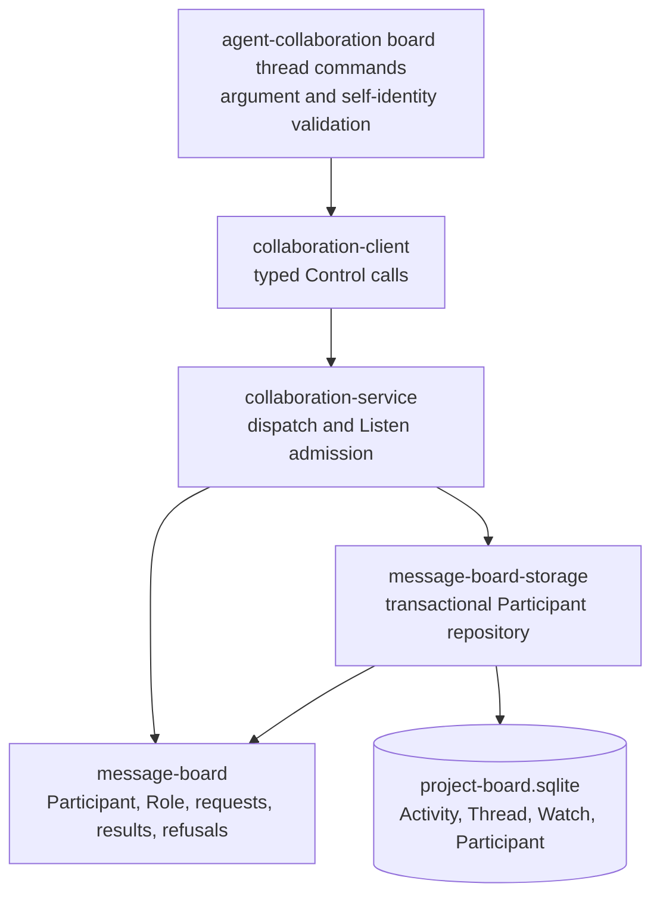
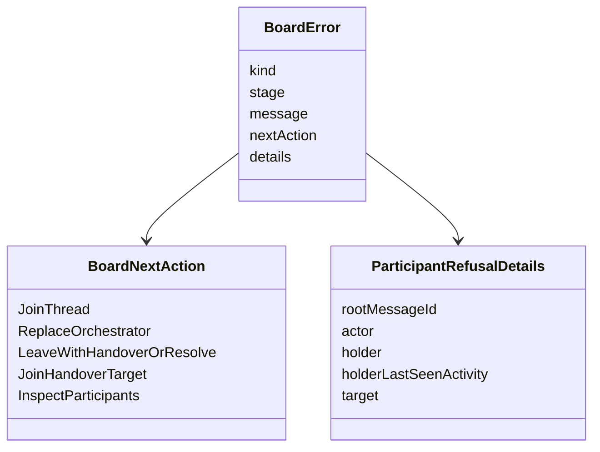
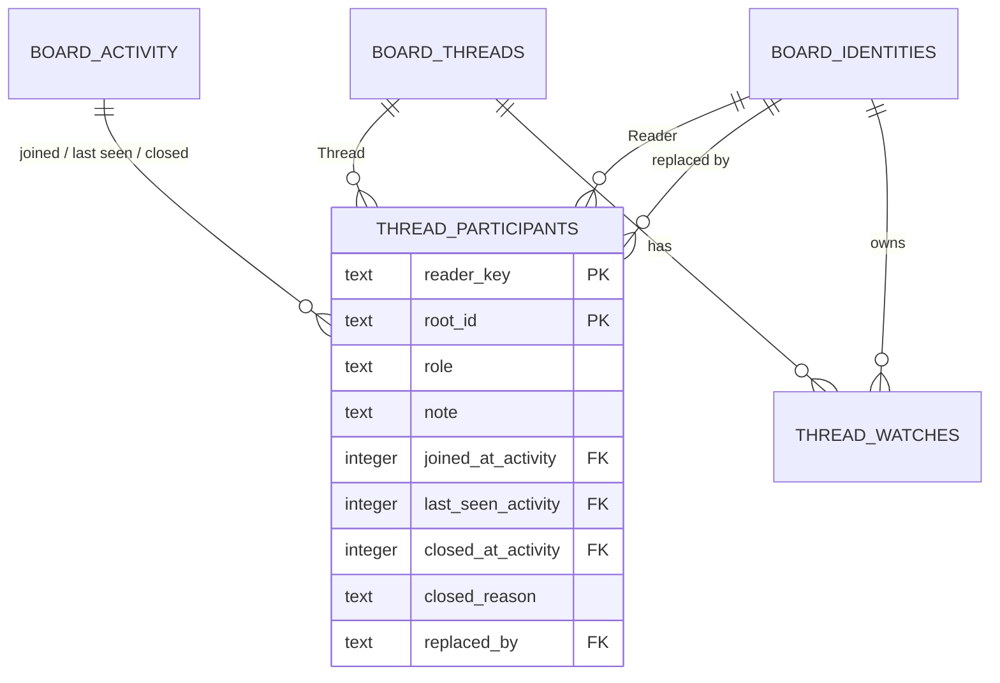
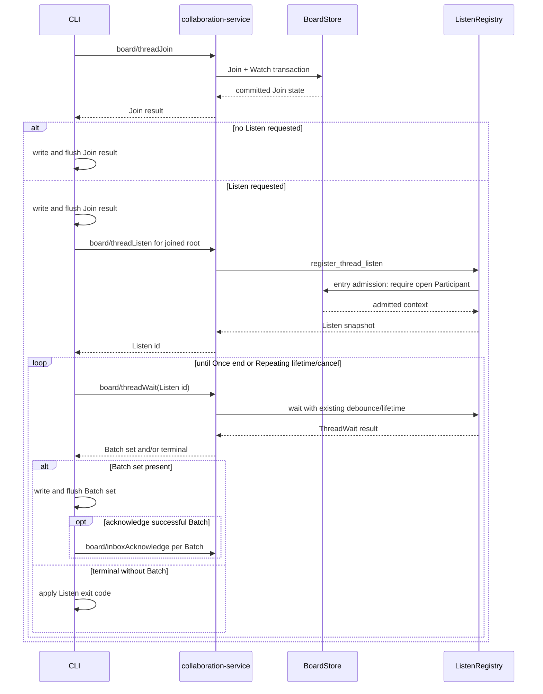
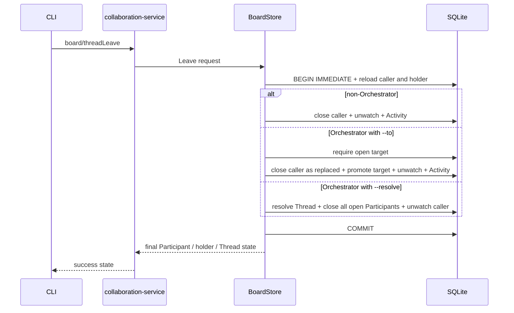
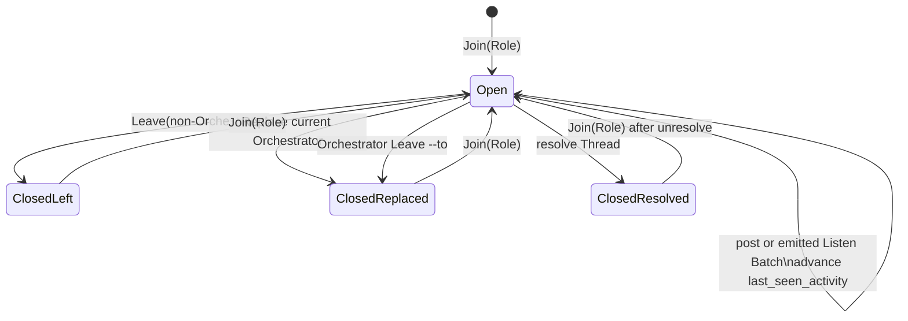
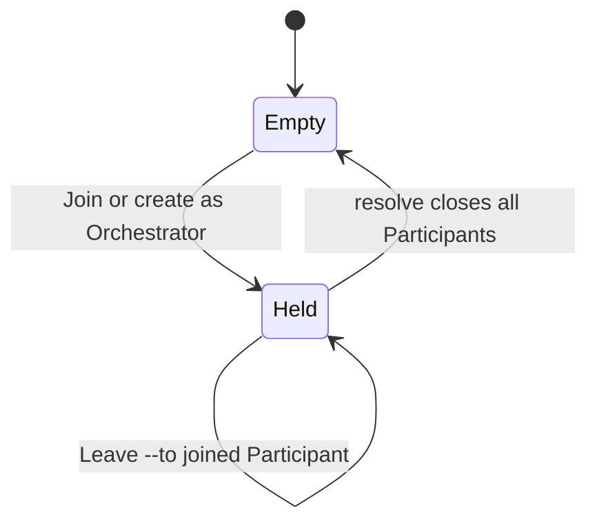
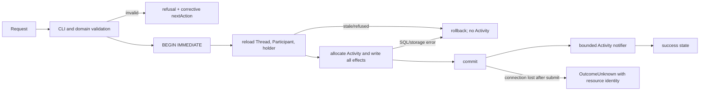

# Thread Participants — Program Design

## 1. Structural overview

This design realizes the observable contract in [`2026-09-14-thread-participants-specification.md`](./2026-09-14-thread-participants-specification.md), authorized by [`2026-09-14-thread-participants-requirements.md`](./2026-09-14-thread-participants-requirements.md). It extends the existing board layers and gives each rule one owner.



| Component | Responsibility | Consumers | Reason to change |
| --- | --- | --- | --- |
| `message-board` | Own exact Participant vocabulary, validated Role/closed reason/note types, request/result contracts, and refusal shapes. | storage, service, client, CLI | The board domain contract changes. |
| `message-board-storage` | Own migration, row decoding, Activity allocation, concurrency, and atomic Participant/Watch/Thread/message effects. | collaboration service | Persistence or transactional invariants change. |
| `collaboration-service` | Route new board methods and enforce the session Join gate at Listen registration entry. | Control clients | Board dispatch or long-poll admission changes. |
| `collaboration-client` and `collaboration-protocol` | Carry typed board calls and publish schemas within the existing Control envelope. | CLI and external callers | Wire projection changes. |
| `agent-collaboration` | Own exact CLI choices, `--actor self`, stdout/error rendering, and the Join-plus-Listen register/wait/stream composition. | agents and humans | Command ergonomics or process behavior changes. |
| board skill reference | Teach the complete Thread process and corrective commands. | Luna and other agents | Documented operator journey changes. |

No new service, worker, queue, endpoint, or delivery component is introduced.

## 2. Domain types and contracts

`message-board` adds:

- `ParticipantRole`: `Orchestrator | Advisor | Reviewer | Participant`;
- `ParticipantClosedReason`: `Left | Replaced | Resolved`;
- `ParticipantNote`: trimmed 1–16,384-byte validated text;
- `Participant`: identity, Role, note, Join/last-seen Activity sequences, optional close fields and `replaced_by`;
- `OrchestratorHolder`: identity and `last_seen_activity` projection;
- create, Join, Leave, and Participant-list request/result contracts;
- refusal-specific `BoardFailureKind`, `BoardNextAction`, and `BoardErrorDetails` variants.

The Rust constructors and custom deserializers reject unknown Role and closed-reason strings, invalid cross-field closed state, and invalid notes. Storage row decoding uses the same constructors, so corrupted persisted values become `InvalidRecord` rather than silently mapping to a fallback.

`Thread`, `ThreadShowResult`, and each record returned by `ThreadListResult` gain an optional Orchestrator holder. A `null` value means the seat is empty. The projection is computed from the current open Participant row and is not separately persisted.

Refusal guidance is structured rather than embedded only in English text:



The CLI combines the action variant and details into a copyable command template. Placeholders remain only for owner choices the system cannot make, such as `<role>` and `(--watch|--no-watch)`.

## 3. Storage model

One additive migration creates the STRICT `thread_participants` table and partial unique index from the governing shape. It contains relational constraints only: primary key, foreign keys, `NOT NULL`, and the unique Orchestrator index. Role and closed-reason set validation and their cross-field combinations belong to the Rust domain, following the repository rule against SQL enum `CHECK` constraints.



Cross-field row validity is:

| State | Required | Forbidden |
| --- | --- | --- |
| open | Role, Join and last-seen sequences | close sequence, closed reason, replaced-by |
| closed `left` | Role, all three sequences, reason | replaced-by |
| closed `replaced` | Role `orchestrator`, all sequences, reason, replaced-by | — |
| closed `resolved` | Role, all three sequences, reason | replaced-by |

Every stored sequence must refer to Activity on the same Thread. Decoding verifies this scope when a row is loaded; mutation queries establish it by using the Activity allocated inside the same transaction.

Participant lifecycle Activity kinds are `participantJoined`, `participantLeft`, and `orchestratorReplaced`. An Orchestrator Leave with `--to` is an explicit Replace and uses `orchestratorReplaced`; resolution reuses the existing `threadResolved` Activity. These kinds provide sequence and notification authority but are excluded from message history, Listen message eligibility, inbox unread publication, and acknowledgement validation. Inbox predicates explicitly admit `threadMessageCreated`, `threadResolved`, and `threadUnresolved`, replacing broad `kind <> 'mainMessageCreated'` conditions before the new kinds are admitted.

## 4. Transaction owners and concurrency

All state-changing paths use `BEGIN IMMEDIATE`, allocate any Activity sequence inside the transaction, validate stale preconditions after acquiring the write lock, and commit before notifying listeners.

| Operation | Reads under lock | Writes in the same commit |
| --- | --- | --- |
| create | Topic/Board state, actor, Orchestrator holder | root message, Thread, message Activity, optional Participant with Join Activity authority, explicit Watch state, unread summaries |
| Join | Thread/Board state, existing Participant, holder, named Replace holder | Join Activity, one upserted Participant, optional closed old holder, explicit Watch state, unread summaries |
| post reply | Thread/Board state, open Participant for session actor | message Activity and message, Participant `last_seen_activity`; no Watch mutation |
| Leave | caller Participant and Role | Leave/handover Activity, closed caller, optional promoted target, caller Watch deactivation, unread summaries |
| resolve | Thread, all open Participants, and current Orchestrator for a session actor | Thread-state Activity, resolved Thread, every open Participant closed at same sequence |
| Listen batch | selected Threads and session Participant gate, Watch/Delivered state, eligible messages | emitted-batch Delivered positions and corresponding Participant `last_seen_activity` in the existing selection transaction |

The partial unique index is the final storage guard for concurrent Orchestrator attempts. The repository catches that specific uniqueness failure, reloads the committed holder, and returns the domain refusal. It never exposes a raw SQL constraint error.

Replace and handover use compare-under-lock semantics. Before storage mutation, Join rejects a `--replace` identity equal to the joining identity. Under `BEGIN IMMEDIATE`, the named distinct current holder or handover target must still match; otherwise the transaction rolls back without Activity allocation or state changes.

Create uses one message Activity sequence as the root's creation authority and allocates a distinct Join Activity when it creates a Participant. This preserves the meaning of both activities and makes `joined_at_activity` explicit. The transaction commits both or neither. A role-less human create allocates only the message Activity.

Resolution uses its one Thread-state Activity sequence as `closed_at_activity` and `last_seen_activity` for every open Participant. It does not create one Activity per Participant.

## 5. Runtime call paths

### 5.1 Create, Join, and post

```mermaid
sequenceDiagram
    participant C as CLI
    participant S as collaboration-service
    participant B as BoardStore
    participant D as SQLite

    C->>C: validate actor, Role rules, Watch choice, text
    C->>S: board/threadCreate or board/threadJoin
    S->>B: typed request
    B->>D: BEGIN IMMEDIATE
    B->>D: validate Thread/holder + allocate Activity
    B->>D: write Participant + explicit Watch (+ root for create)
    B->>D: COMMIT
    B-->>S: Participant, holder, Watch state
    S-->>C: success state without nextAction

    C->>S: board/messagePost (Thread reply)
    S->>B: existing request
    B->>D: BEGIN IMMEDIATE
    B->>D: require open Participant for session actor
    B->>D: insert message Activity + update last_seen_activity
    B->>D: COMMIT
    S-->>C: message result; Watch unchanged

    C->>S: board/messagePost (topic placement)
    S->>B: existing request
    B->>D: BEGIN IMMEDIATE + decode actor identity
    alt session identity
      B-->>S: refusal with thread create nextAction; no mutation
    else human identity
      B->>D: insert root message + Thread + Activity; no Participant
      B->>D: COMMIT
      S-->>C: root message result
    end
```

The generic post repository loses its unconditional `activate_watch` call. It admits topic placement only for a human identity; a session identity is refused before cooldown or message mutation with the `thread create` nextAction. Thread create and Join become the only operations in this slice that apply a new explicit Watch choice. Existing explicit watch/unwatch commands remain personal Watch controls and never create a Participant.

### 5.2 Join with Listen and Listen gate



The service has one `register_thread_listen` entry admission call before registry ownership, Watch activation, Delivered-position initialization, or wait task creation. It resolves Watched or repeated root selection and checks every selected Thread for an open Participant when the Reader is a session. Humans bypass the Listen Join gate as required by the governing invariant. Any missing Participant rejects the whole Listen with all missing roots and no partial Listen effects.

Join-plus-Listen is a CLI composition over existing Control operations, not a new composed Control method. The CLI uses one connected client: it calls `board/threadJoin`, writes and flushes the committed Join result, then registers a roots selection containing only the joined Thread and enters the existing `board/threadWait` loop. Once and Repeating Batch output, terminal handling, exit codes, cancellation, and write-before-acknowledgement ordering remain owned by the existing Listen executor, extracted as an async helper that can run after Join.

Because the Join result is flushed before Listen registration or waiting, a later Listen refusal, transport failure, timeout, cancellation, stdout failure, or acknowledgement failure cannot obscure the known committed Join. It is reported as the subsequent Listen output or error and uses the existing Listen exit code. No partial-success Control envelope or new recovery protocol is added.

When a Batch is selected and Delivered positions advance, the same transaction sets the open Participant's `last_seen_activity` to the greater of its existing value and the Batch's `delivered_through`. Timeout, cancellation, errors, and filtered lifecycle-only wakeups change neither Delivered position nor Participant last-seen state.

### 5.3 Leave, handover, and resolve



The existing `board/threadResolve` path moves to the same repository owner used by Leave `--resolve`. Its authorization branches on the existing `Identity`: a session must be the open Orchestrator, while a human bypasses the Participant lookup and may resolve regardless of the current holder. Both branches use the same transaction to resolve the Thread and close every open Participant. This preserves human control of boards without weakening the session gate. `threadUnresolve` remains separate and changes no Participant.

## 6. Participant lifecycle state



Guards:

- `Open(Orchestrator) -> Open(non-Orchestrator)` by repeat Join is illegal.
- `Open(Orchestrator) -> ClosedLeft` without handover or resolution is illegal.
- Join as Orchestrator while another holder exists is illegal without exact Replace.
- Replace naming the joining identity is illegal; the same holder uses repeat Join without Replace.
- Join on a resolved Thread is refused; unresolve does not transition any Participant.
- Rejoin overwrites the single current row's lifecycle fields while Activity retains ordering evidence.

Orchestrator seat transitions are:



## 7. Self identity and CLI composition

`board_value_parsing` gains a self-actor input variant. Preparation first connects through `collaboration-client`, obtains the verified service id already used for the Control connection, then resolves exactly one supported environment variable:

1. only `CODEX_THREAD_ID`: session endpoint `<serviceId>/codex-local`;
2. only `CLAUDE_CODE_SESSION_ID`: session endpoint `<serviceId>/claude-local`;
3. neither or both: local validation error naming the variables;
4. explicit JSON: existing identity parser, independent of environment.

Because current command preparation happens before connection, the CLI splits preparation into syntax validation and service-bound identity finalization. This is a narrow phase boundary used by every new `--actor self` command; existing explicit identities follow the same finalized request type. No endpoint discovery call is added.

Clap represents every choice as `Option` or mutually exclusive flags, then preparation emits the exact omission error. Domain request types remain fully specified and contain no optional semantic choice. `--listen` is represented as a closed CLI variant and converted into the existing `ThreadListenMode` plus explicit acknowledgement boolean only after all members are present.

## 8. Read models and cursor framing

Participant list uses `PageRequest` and `Page<Participant>`. Its signed cursor binds operation `threadParticipants`, root id, and last emitted Reader identity key. The query reads candidates in identity-key order and admits records only while the complete encoded Control result remains within the shared response budget. It returns at most the requested limit and may return fewer, with `nextCursor` pointing before the first un-emitted candidate. The budget always admits at least one valid Participant because the domain bounds the note and identity fields below the frame maximum.

Thread show loads the holder in its existing transaction. Thread list left-joins the one open Orchestrator row and its identity data into each page query, avoiding per-Thread reads. Decoding validates the projected Role and Participant row. The partial unique index guarantees at most one joined holder.

Participant notes and identities are bounded at the domain boundary, and frame-aware page construction enforces the existing Control response budget before returning the page. A corrupt record that cannot fit within that budget becomes an invalid-record failure rather than an empty cursor loop or partial JSON frame.

## 9. Failure containment and recovery



- A refusal is deterministic and mutation-free.
- A storage failure rolls back every effect in that operation.
- Notification happens only after commit; dropped notification is covered by existing polling and does not roll back durable state.
- Create carries a client-generated root id for uncertain-outcome inspection.
- Join-plus-Listen flushes the committed Join result before a later Listen result or error.
- Corrupt Participant rows are attributed to the Thread/identity resource and rejected.

## 10. Cutover

The migration is additive and performs no backfill. Existing Threads therefore start with an empty Orchestrator seat and no Participants. The feature then cuts behavior over in one version:

- generic posting no longer activates Watches;
- a session topic-placement post is refused with a `thread create` nextAction; a human topic-placement post remains allowed and creates no Participant;
- session Thread post and Listen paths require an open Participant, and session resolve requires the open Orchestrator;
- human post, Listen, and resolve paths remain exempt from the Join gate;
- create and Join require explicit Watch choice and become the documented Thread entry path;
- current Watch, Delivered, Acknowledged, message, and Thread-state data remain intact;
- unresolve never synthesizes Participant state.

There is no compatibility path that infers Participants from old state.

## 11. Proof seams

| Obligation | Realization owner | Proof seam |
| --- | --- | --- |
| closed Role set and row validity | message-board constructors + storage decoder | domain round trips and injected invalid stored rows |
| one Orchestrator | partial unique index + conflict translation | concurrent Join/Replace and mutation-free self-Replace tests |
| atomic create/Join/Leave/Replace/resolve | BoardStore transaction owners | storage integration tests with reopen and rollback checks |
| no automatic Participant or Watch | post repository path | session topic-placement refusal, human topic-placement success, and post/read integration tests inspecting both tables |
| Join gate | post transaction, Listen entry admission, resolve owner | real Control-path tests covering session refusal and human post/Listen/resolve exemption |
| sequence-based presence | mutation and Batch-selection transactions | exact sequence assertions for every transition, including an older Batch after newer presence |
| refusal guidance | domain errors + CLI renderer | protocol schema/round-trip and CLI refusal journeys |
| holder projections | show/list queries | paged storage and CLI results |
| self identity | service-bound CLI finalization | isolated environment matrix plus real CLI call |
| Luna DX | skill reference and workspace-built CLI against scratch project | durable trace recording commands, refusals, next command, and outcomes |

The Luna proof uses the real Control path and a scratch project. It receives only the updated board skill reference and command surface. It records each refusal, the returned `nextAction`, its next command, and whether that command corrected the refusal without human help.

## 12. Requirements trace

| Requirements | Specification scenario | Design owner |
| --- | --- | --- |
| U1–U4, U10 | Participant/Role, create, Join, list | domain types; create/Join transactions; paged read model |
| U5, U12, U15 | explicit CLI choices and self actor | CLI syntax validation and service-bound finalization |
| U6 | single holder and exact Replace | partial unique index; compare-under-lock transaction |
| U7, U18 | post/Listen/resolve Join gate | post transaction; Listen entry; shared resolve owner |
| U8–U9 | Leave, handover, resolve | lifecycle transaction owner and state machine |
| U11 | sequence presence | Activity allocation and same-transaction last-seen updates |
| U13 | corrective refusals | typed Board error/action/details and CLI rendering |
| U14 | holder in show/list | holder projection queries |
| U16 | SQLite and SQLx conventions | additive STRICT migration, checked queries, Rust decoding |
| U17 | bounded board-only change | existing layers only; no new runtime component |
| U19 | agent-operable process | skill update and Luna real-path trace |
| U20 | design governance | independent three-artifact Advisor review followed by Fable review |

## 13. Structural tradeoffs and revisit signals

- One current Participant row per Reader/Thread makes current Participant state cheap and deterministic. It pays by keeping historical lifecycle detail in Activity sequence rather than duplicate Participant rows. Revisit only if consumers require full Role history as a first-class read model.
- Lifecycle Activity kinds preserve sequence authority without widening Listen Batch or inbox payloads. It pays by making Participant list the only detailed Participant view. Revisit if agents need Join, Leave, or Replace changes in unread feeds.
- Join-plus-Listen flushes Join state before entering the existing Listen loop. This keeps mutation and streaming ownership clear, at the cost of a Join result record before the first successful Batch. Revisit only if Control gains a transactional operation-composition contract.
- A service-bound self-resolution phase avoids guessed service ids and endpoint lookup. It pays with a two-phase CLI preparation boundary. Revisit if Control supplies authenticated caller identity.

The structural realization stays within the owner-selected board layers and reuses the existing transaction, Activity, Watch, Control, paging, and Listen machinery. It spends new complexity only on the Participant domain, its transaction owners, refusal details, and self-resolution boundary.
