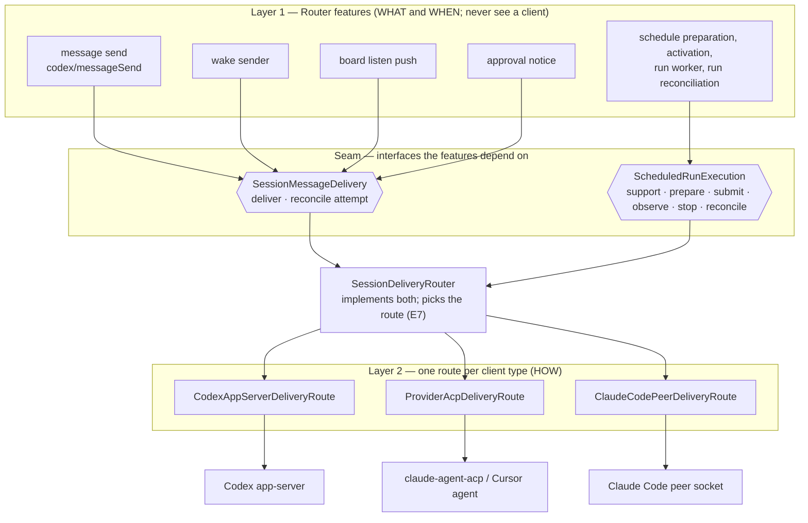
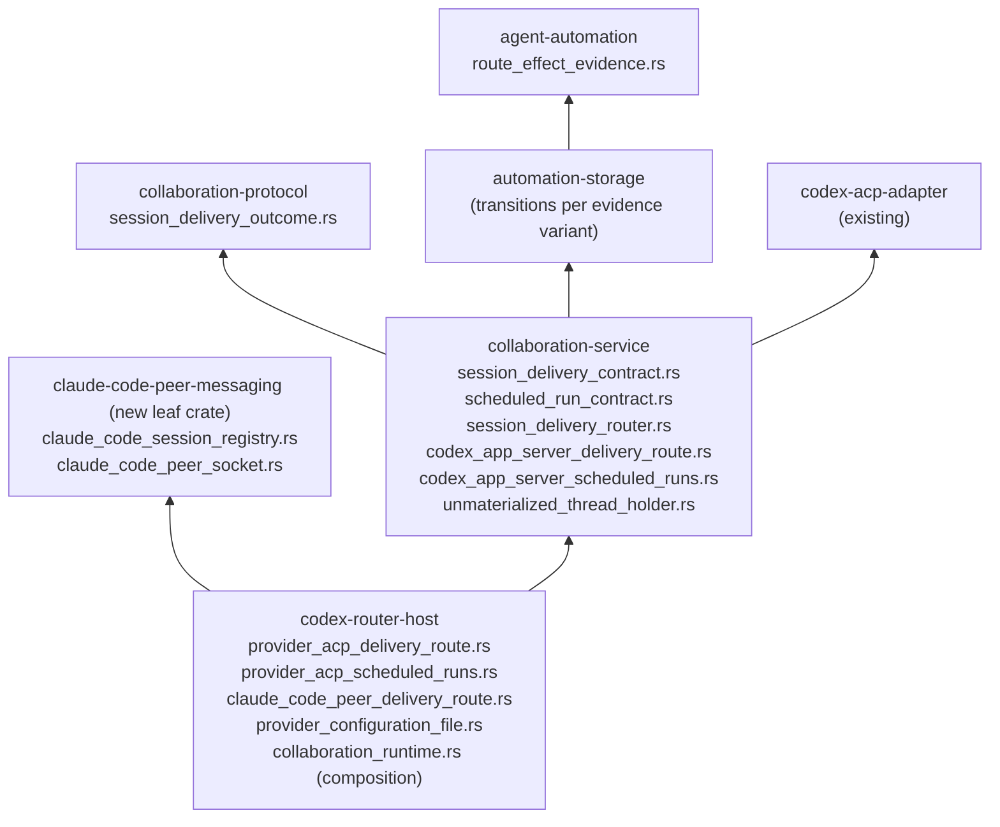
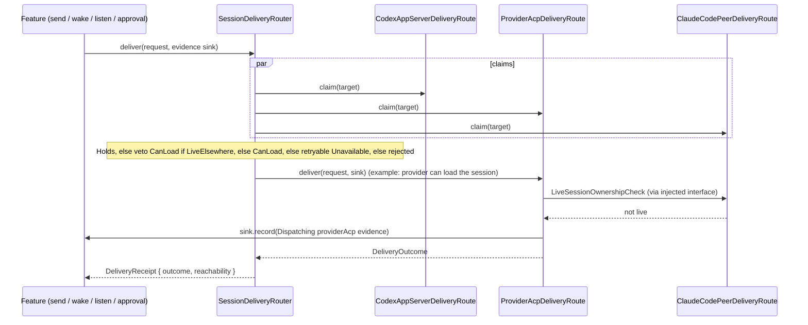
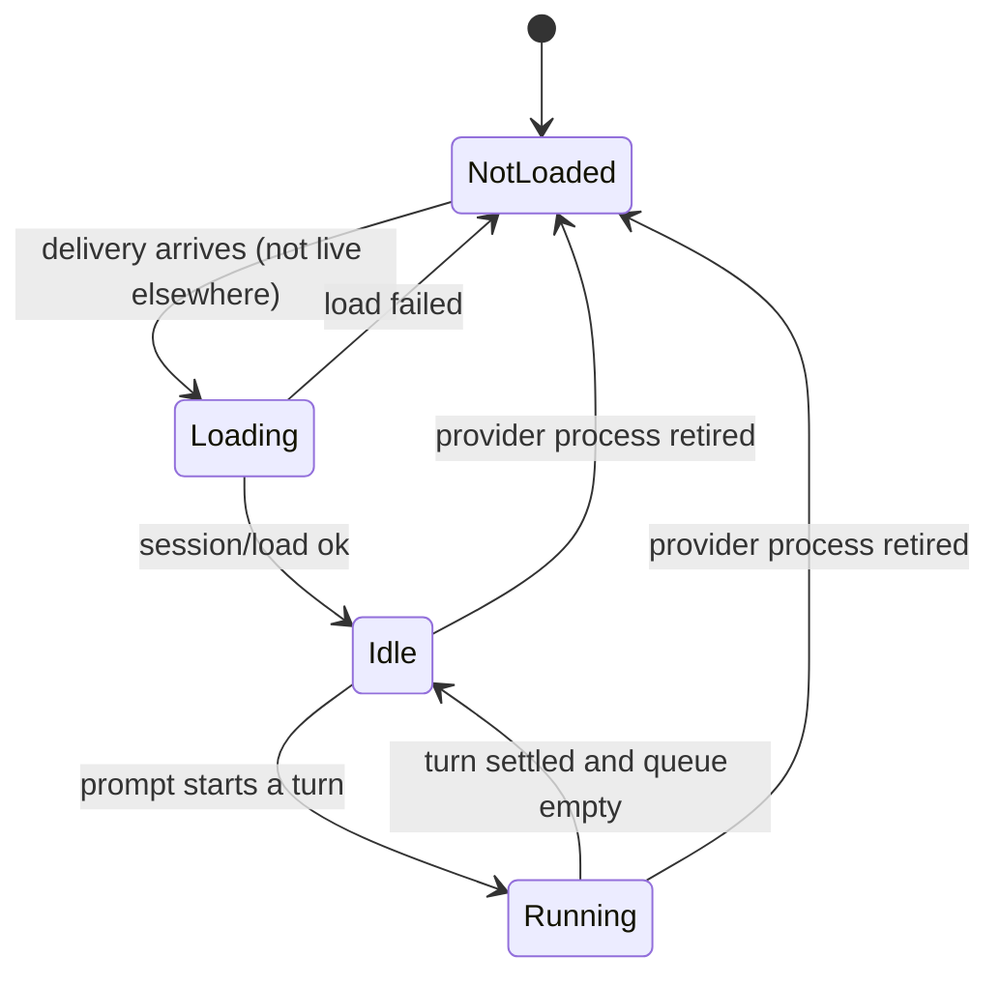
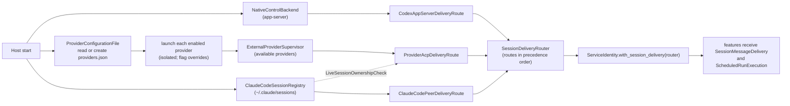
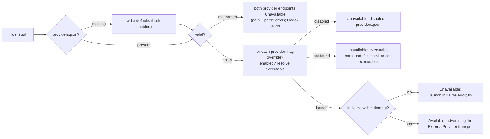

# Router provider delivery — Program Design

Realizes [specification.md](specification.md) (E1–E7; R1–R16, R19–R21, R26–R30; C1–C5; K1) for [requirements.md](requirements.md) (U1–U10).

## The crux

Today every Router feature that reaches a session builds a Codex app-server JSON-RPC request by hand and parses the raw `serde_json::Value` reply: message send (`native_control_dispatch.rs:35`), wakes (`wakeup_native_sender.rs:103`), board listen pushes (`session_delivery_sink.rs:56`), approval notices (`approval_broker.rs:476`). Scheduled runs prepare, activate, dispatch, observe, stop, and reconcile through native-only code (`schedule_preparation_dispatch.rs:157`, `schedule_activation.rs:74`, `scheduled_native_dispatch.rs`, `run_reconciliation.rs:15`). The records they persist are native-shaped too: run submission and completion require a native turn ID (`run_submission_outcomes.rs:38`), and wake reconciliation reads the native queue (`delivery_reconciliation.rs`). So **what** a feature wants (tell this session something, run this work) is welded to **how** Codex's app-server client does it, and every non-Codex target fails with `unsupportedCapability`.

The design splits the two with interfaces and injection:



- A feature holds only `Arc<dyn SessionMessageDelivery>` (or `Arc<dyn ScheduledRunExecution>`). It decides when to send and what to do with the outcome, and it persists whatever evidence the route reports. It never names an endpoint kind or a client.
- A route knows exactly one client. It never knows which feature is calling. It reports the client evidence it produced; it does not own the feature's records.
- The router knows neither features nor concrete clients. It holds a list of injected `Arc<dyn SessionDeliveryRoute>` and applies one selection rule.
- The Host is the only place that knows all concrete types, and it wires them together at start (`collaboration_runtime.rs`, where `with_native_backend` and `with_provider_conversation_backend` already inject `Arc<dyn …>` dependencies today).

## Alternatives considered

| Option | Shape | Decision |
|---|---|---|
| A. Patch each feature | Each feature branches on endpoint and calls each client itself. | Rejected: five copies of the reachability policy, and each new client touches every feature (violates U10). |
| **B. Features → one seam → per-client routes (selected)** | Features call a delivery interface; the router selects among injected routes. | One owner for reachability (E7) and outcome (E5); each side testable alone (K1). Cost: native-shaped receipts and stored evidence widen to per-route evidence. |
| C. Everything over ACP | Reach Codex through its ACP adapter too, so there is one client. | Rejected: loses the app-server's native steer/queue semantics, and Claude Code sessions Router did not start have no ACP entry at all. |
| D. One interface for schedules too | Schedules call `deliver` plus an optional settlement query. | Rejected: a run prepares a session, persists intent, dispatches, observes an exact execution, stops on timeout, and summarizes (`scheduled_native_dispatch.rs`, `native_thread_preparation.rs`, `summary_native_worker.rs`). Forcing that through `deliver` would hide a lifecycle behind a message call. Schedules get a second, per-client interface chosen by the same router. |

Queue placement for provider messages: a **Router-held per-session FIFO in the provider route (selected)**, rather than the Claude adapter's own prompt queueing. That gives one mechanism for Claude and Cursor and keeps one prompt per session under Router's approval model. Debt: queued-but-unstarted messages are lost if the Host stops, and the caller bears that (they see `queued`, not `started`). Owner accepted, 2026-09-24. Scheduled runs do not use this queue (see Scheduled runs).

Created-but-empty Codex conversations (R8): **hold the thread in the Codex route (selected)** rather than requiring a first message at create. Debt: held threads do not survive a Host restart, and delivery then reports `notSubmitted` "conversation was never started and the Host restarted; create it again". Owner accepted, 2026-09-24.

## Packages and modules

Dependency direction is unchanged: `agent-automation` and `collaboration-protocol` at the bottom, `automation-storage` over `agent-automation`, `collaboration-service` over those (and over `codex-acp-adapter` and `codex-native-integration`, as today), `codex-router-host` over the service. The service cannot see the host, so the service defines the interfaces and the host supplies the implementations that need host-owned processes. This is the pattern `ProviderConversationBackend` already uses.



| Crate | Module | Job | Reason to change |
|---|---|---|---|
| agent-automation | `route_effect_evidence.rs` | `RouteEffectEvidence`: the per-route evidence a wake attempt or run records (see Attempt and run evidence). The Codex variant is today's `NativeEffectEvidence`, unchanged. | A route's evidence changes |
| automation-storage | existing transition modules | Transitions validate the evidence variant they receive: native checks unchanged for `codexAppServer`, new checks for `providerAcp` and `claudeCodePeer`. No SQL schema change (evidence lives in existing JSON `TEXT` columns). | Legal run/attempt transitions change |
| collaboration-protocol | `session_delivery_outcome.rs` | E5 `DeliveryOutcome`, E7 `SessionReachability`, `DeliveryCorrelationId`. Attempt identity reuses the existing UUIDv7 `agent_automation::AttemptId` (no second attempt newtype). Wire types, because they appear in receipts, wake and run records, CLI, and MCP. Origin and mode reuse the existing `MessageContent` (`Agent{sender}` / `HumanUser` / `Router`) and `MessageDelivery` (`Auto` / `Queue` / `Steer`). | Outcome vocabulary changes |
| collaboration-service | `session_delivery_contract.rs` | `DeliveryRequest`, `DeliveryPrecondition`, `SessionMessageDelivery` (feature-facing), `SessionDeliveryRoute` (client-facing), `RouteClaim`, `AttemptEvidenceSink`. | Seam shape changes |
| | `scheduled_run_contract.rs` | `ScheduledRunExecution` (feature-facing), `ScheduledRunRoute` (client-facing), `ScheduleSupport`, `RunSettlement`, `RunEvidenceSink`. | Run lifecycle contract changes |
| | `session_delivery_router.rs` | `SessionDeliveryRouter`: route selection (E7); dispatch of recorded-evidence operations to the route that produced the evidence; implements both feature-facing interfaces. | Selection policy changes |
| | `codex_app_server_delivery_route.rs` | App-server route: today's `native_message_dispatch` returning a typed outcome, today's queue-evidence reconciliation (`delivery_reconciliation.rs`), and the held-thread check. | App-server protocol changes |
| | `codex_app_server_scheduled_runs.rs` | `ScheduledRunRoute` for Codex: today's native preparation, activation checks, dispatch, observation, stop, and run reconciliation moved behind the interface with unchanged behaviour. | Native run mechanics change |
| | `unmaterialized_thread_holder.rs` | Keeps ACP bindings of Codex threads created without a first turn (R8). | Codex materialization rules |
| codex-router-host | `provider_acp_delivery_route.rs` | Provider route: per-session actor, `_session/steering`, Router-held FIFO, load-on-demand with a live-elsewhere recheck, provider session records. Wraps the existing supervisor and runtime. | Provider ACP behaviour |
| | `provider_acp_scheduled_runs.rs` | `ScheduledRunRoute` for Claude/Cursor: create via the backend, submit only when idle, settle from `PromptCompleted`, stop via ACP cancel, reconcile from the provider operation store. | Provider run mechanics |
| | `claude_code_peer_delivery_route.rs` | Peer route: maps registry state and socket results to E5, applies the mode rules (R15 column), and implements the live-elsewhere check the provider route consults. | Peer delivery policy |
| | `provider_configuration_file.rs` | `providers.json` read, default creation, validation (E3, C1). | Config schema |
| | `collaboration_runtime.rs` (existing) | Composition: builds each route and injects the list into the service. | New client type |
| claude-code-peer-messaging (new) | `claude_code_session_registry.rs` | Reads `~/.claude/sessions/*.json` (injectable directory); returns a typed record per session: live or not (pid alive), status, peer protocol, socket path, auth key. Unknown formats are reported as "live, unsupported" when the pid is alive, never as absent. | Claude Code registry format |
| | `claude_code_peer_socket.rs` | Writes one auth line plus one `user` line to the socket with bounded connect/write timeouts; reports whether the full frame was written. | Claude Code wire format |
| collaboration-client, agent-collaboration, collaboration-mcp | existing conversation modules | One conversation surface (below). | Public surface |

Why the peer client is its own crate: it is the only code bound to Claude Code's private registry and socket format. If a Claude Code release changes that format, the damage stays in one small crate with its own tests, and the service and host stay the same.

Forbidden edges, checked in review and by a dependency test (K1):

- Feature modules (`native_control_dispatch`, `wakeup_native_sender`, `session_delivery_sink`, `approval_broker`, `scheduled_run_worker`, `schedule_preparation_dispatch`, `schedule_activation`, `run_reconciliation`, `delivery_reconciliation`'s caller) import nothing from route modules, `native_message_dispatch`, `codex_native_integration`, or the provider backend.
- Route modules import no feature module.
- Only `collaboration_runtime.rs` names concrete route types.

## Interfaces

Sketches; exact signatures belong to implementation. Futures follow the existing boxed-future style of `ProviderConversationFuture`.

```rust
// collaboration-service::session_delivery_contract
pub struct DeliveryRequest {
    pub target: SessionRef,
    pub message: MessageContent,            // carries origin: Agent{sender} | HumanUser | Router
    pub mode: MessageDelivery,              // Auto | Queue | Steer
    pub precondition: DeliveryPrecondition, // caller guard, enforced at route admission
    pub correlation: DeliveryCorrelationId, // E4: same across attempts
    pub attempt: AttemptId,         // fresh per attempt (R20)
}

/// The caller's existing guard, carried as data. Today's meanings are kept:
/// a direct send's supplied generation and a wake's strict guard reject a stale
/// endpoint before any I/O; an unpinned wake uses the current generation.
pub enum DeliveryPrecondition {
    Unpinned,
    EndpointGeneration(EndpointGenerationGuard), // Codex generation or provider binding generation
}

/// What features depend on. Implemented by SessionDeliveryRouter; tests use a fake.
pub trait SessionMessageDelivery: Send + Sync {
    fn deliver(&self, request: DeliveryRequest, evidence: &dyn AttemptEvidenceSink)
        -> DeliveryFuture<'_, DeliveryReceipt>;
    fn reconcile_attempt(&self, context: AttemptReconciliationContext)
        -> DeliveryFuture<'_, AttemptReconciliation>;
}

/// Supplied by the feature from its own attempt record. The route needs the original
/// request, not just its evidence: native reconciliation proves acceptance only by a
/// unique queue item whose text equals the rendered original message in queue mode.
pub struct AttemptReconciliationContext {
    pub target: SessionRef,
    pub message: MessageContent,
    pub mode: MessageDelivery,
    pub recorded: RouteEffectEvidence,
}

/// One implementation per client type. Injected by the Host.
pub trait SessionDeliveryRoute: Send + Sync {
    fn reachability(&self) -> SessionReachability; // codexAppServer | providerAcp | claudeCodePeer
    fn claim(&self, target: &SessionRef) -> DeliveryFuture<'_, RouteClaim>;
    fn deliver(&self, request: DeliveryRequest, evidence: &dyn AttemptEvidenceSink)
        -> DeliveryFuture<'_, DeliveryOutcome>;
    fn reconcile_attempt(&self, context: AttemptReconciliationContext)
        -> DeliveryFuture<'_, AttemptReconciliation>;
    fn scheduled_runs(&self) -> Option<Arc<dyn ScheduledRunRoute>> { None }
}

pub enum RouteClaim {
    NotMine,                                             // target's endpoint is not this route's client
    Holds,                                               // this route can deliver now
    CanLoad,                                             // provider only: loadable, not live elsewhere
    LiveElsewhere { writable: bool },                    // peer only: a live Claude Code process owns it
    Unavailable { reason: RouteUnavailableReason, retryable: bool },
}

/// Written by the route immediately before and after its client side effect;
/// the feature's implementation persists it (wake: its attempt record; direct send: nothing).
pub trait AttemptEvidenceSink: Send + Sync {
    fn record(&self, evidence: RouteEffectEvidence) -> DeliveryFuture<'_, ()>;
}

pub struct DeliveryReceipt { pub outcome: DeliveryOutcome, pub reachability: SessionReachability }
pub enum AttemptReconciliation { Accepted(DeliveryReceipt), KnownNotSubmitted, StillUnknown }
```

```rust
// collaboration-service::scheduled_run_contract
/// What schedule features depend on. Implemented by SessionDeliveryRouter.
pub trait ScheduledRunExecution: Send + Sync {
    fn support(&self, destination: &ScheduleDestination) -> DeliveryFuture<'_, ScheduleSupport>;
    fn prepare_existing_target(&self, target: &SessionRef, sink: &dyn RunEvidenceSink)
        -> DeliveryFuture<'_, PreparedTarget>;
    fn prepare_fresh_session(&self, request: FreshSessionRequest, sink: &dyn RunEvidenceSink)
        -> DeliveryFuture<'_, PreparedTarget>;
    fn submit_run(&self, run: ScheduledRunSubmission, sink: &dyn RunEvidenceSink)
        -> DeliveryFuture<'_, RunSubmission>;           // Started | NotStartedBusy | Rejected
    fn observe_settlement(&self, recorded: &RouteEffectEvidence) -> DeliveryFuture<'_, RunSettlement>;
    fn request_stop(&self, recorded: &RouteEffectEvidence) -> DeliveryFuture<'_, StopRequestOutcome>;
    fn reconcile_run(&self, recorded: &RouteEffectEvidence) -> DeliveryFuture<'_, RunReconciliation>;
}

pub struct ScheduleSupport { pub can_create: bool, pub can_stop: bool, pub settlement: SettlementEvidence }
pub enum SettlementEvidence { TurnCompletion, OperationSettlement, WriteOnly }

pub enum RunSettlement {
    Pending,
    Completed { summary_source: RunSummarySource },
    Stopped,
    WrittenWithoutCompletion,                        // peer route: finalize as peerMessageWritten
}
pub enum RunSummarySource { NativeTurn(NativeTurnRef), ProviderResponse(String), Unavailable { reason: String } }
```

`ScheduledRunRoute` has the same operations per client. Every operation after preparation takes the **recorded** `RouteEffectEvidence`, and the router sends it to the route whose variant it is, without re-running selection. A run therefore keeps its route, binding, and operation after reachability changes or a restart. Fresh-session preparation is routed by endpoint: each route reports the endpoints it can create on (`codex-local` for the app-server route; `claude-local`/`cursor-local` for the provider route; none for the peer route), so the router stays client-neutral.

## Attempt and run evidence

Stored records stay owned by `automation-storage`; the feature decides when to advance; the route reports what its client did; the store enforces legal transitions.

`RouteEffectEvidence` (agent-automation) replaces the native-only evidence field in wake attempts (`latest_attempt_json`, `effect_evidence_json`) and run records (`execution_evidence_json`):

| Variant | Recorded before the side effect | Recorded after | Settlement / stop / reconcile |
|---|---|---|---|
| `codexAppServer` | today's `NativeEffectEvidence` (target, generation, resume/allocation, `Dispatching`, client user message ID) | native turn/submission IDs | exactly today's native paths: turn completion, `InterruptTurn`, queue-list reconciliation (with the feature-supplied original mode and message, below) |
| `providerAcp` | binding reference and generation, attempt ID (the provider operation ID is derived from it), `Dispatching` | operation admitted | the provider operation store: `PromptCompleted` settles, ACP `cancel` stops, operation lookup reconciles (never replays) |
| `claudeCodePeer` | session ID, pid, `Dispatching` | `Written` once the full frame was written | none: written is final, there is no stop; an interrupted write stays `unknown` and is never replayed |

- Evidence references: `agent-automation` sits below `collaboration-protocol`, so `providerAcp` evidence holds its own validated references (binding ID validated like `ProviderBindingId`, generation as the existing generic generation type, and the attempt's `AttemptId`), not the protocol's full `ProviderBindingIdentity`. The provider route converts them at its boundary and resolves the full binding through the provider operation store.
- Before route selection: a wake attempt is claimed durably before any route is chosen (`delivery_claims.rs`), and a run is created `waiting` before any route is chosen (`schedule_evaluation.rs`). Their route evidence is therefore absent until the selected route's first sink write (the app-server route writes at today's `prepare_delivery` / `begin_run_preparation` points). Because every route records `Dispatching` before any client I/O, a crash while the evidence is absent is known not submitted. Completion requires evidence of the route that delivered.
- Compatibility: existing JSON with the native field decodes as `codexAppServer` unchanged, so no data migration. Native transition checks (`run_submission_outcomes.rs:38`, `run_stop_state.rs:24`, `run_completion_state.rs:32`) apply to that variant exactly as today; the other variants get their own checks in the same modules.
- Reconciliation inputs: the feature passes `AttemptReconciliationContext`, meaning the original target, message, and mode from its own attempt record plus the recorded evidence. The route keeps today's positive-evidence checks unchanged (`delivery_reconciliation.rs:29,48,136`): only a queue-mode original, and only a unique queue item whose text equals the rendered original message, recovers acceptance. A reused correlation with different text, duplicates, a missing entry, or a partial scan stays unknown. The route returns the result; the feature persists it.
- Pre-effect persistence: the route calls the sink with `Dispatching` evidence before touching its client, and the feature persists it in the same transaction discipline it uses today (`prepare_delivery`, `begin_run_preparation`). A crash after that point leaves an uncertain record that only the owning route's reconcile can resolve.
- Execution budget: admission still happens at actual dispatch (`run_dispatch_state.rs:29`), because provider runs submit only when the session is idle (below), never into a queue.
- Summaries: summary admission accepts any variant whose settlement is confirmed. `NativeTurn` keeps today's summary worker input (`summary_native_worker.rs:286`). `ProviderResponse` passes the settled response text to the summary worker in memory; provider output is not persisted (the provider store stays metadata-only). If the text is gone when the summary is due (`external_provider_supervisor.rs:855` reports it not retained, or the Host restarted), the source is `Unavailable { reason }` with that cause, and the run takes today's missing-source path (`summary_native_worker.rs:294`): the completed worker outcome is kept, the required summary is blocked, and fresh continuation waits for the existing explicit skip (`summary_recovery.rs:107`) or a successful recovery (R26). A peer run records no summary source and finalizes as `peerMessageWritten`.

## Route selection (E7)

`SessionDeliveryRouter` asks every injected route to `claim` the target and decides in this order:

1. The first route whose claim is `Holds` delivers.
2. If any route reports `LiveElsewhere`, no `CanLoad` claim may be used: `LiveElsewhere { writable: false }` (a live Claude Code process Router cannot message, for example an unknown peer protocol) gives `rejected` "session is live in a Claude Code process Router cannot message" (R28).
3. Otherwise the first route whose claim is `CanLoad` delivers.
4. Otherwise, if any route reports `Unavailable { retryable: true }`, the outcome is `notSubmitted { retryable: true }` with that reason, so existing wake and listen retry policy applies unchanged (R19; today's `wakeup_native_sender.rs:119`).
5. Otherwise `rejected` with the collected reasons and fixes (R12). All `NotMine` gives "no route serves this endpoint".

The Host injects `[CodexAppServer, ProviderAcp, ClaudeCodePeer]`. Each route's claims:

| Route | `Holds` | `CanLoad` | `LiveElsewhere` | `Unavailable` | `NotMine` |
|---|---|---|---|---|---|
| Codex app-server | admitted app-server, or thread held unmaterialized | — | — | app-server gate closed (retryable) | non-Codex endpoints |
| Provider ACP | session actor loaded | session record exists, provider available | — | provider starting or retired (retryable); disabled or not installed (not retryable) | `codex-local` |
| Claude Code peer | live record, peer protocol 1 | — | live record with unsupported protocol or format (`writable: false`) | — | not `claude-local`, or no live record |

Provider-held beats live peer (tier 1), live peer beats provider load (tiers 1–2), and only a session with no live registry record is ever provider-loaded.

Race between claim and effect: the provider route receives an injected `LiveSessionOwnershipCheck` (implemented over the peer registry by the peer route module) and re-runs it immediately before `session/load`. If the session became live elsewhere, the route returns `notSubmitted { retryable: true }` without loading. The chosen route also re-checks its own state on deliver. The router never falls through to another route within one attempt, so one attempt never becomes two deliveries. No cross-process lock is claimed: a Claude Code process that starts after the recheck is outside Router's control.



## Delivery receipts (E5, C4)

`DeliveryOutcome` is one tagged enum in the protocol: `started`, `steered`, `startedOrSteered`, `queued`, `peerMessageWritten`, `notSubmitted { retryable, reason }`, `rejected { reason }`, `unknown`. The receipt adds the reachability used and keeps client identifiers beside it: native turn/submission IDs from the app-server route, and the provider operation ID from the provider route. Native receipts map without losing strength, so today's `StartedOrSteered` stays `startedOrSteered`. Records written before this change keep their native receipt meaning.

Feature outcome handling, now written once per feature against E5 only:

| Feature | On `notSubmitted { retryable: true }` | On `unknown` / accepted | On `rejected` |
|---|---|---|---|
| message send | return to caller (R19) | return to caller | return to caller |
| wake | new attempt with a fresh `AttemptId` under the existing retry policy (R19, R20) | record; no further attempt; `unknown` goes to `reconcile_attempt` (R20) | record failure |
| board listen push | retry batch under the existing policy | record batch delivered | end the listen after repeated rejects (existing) |
| approval notice | deny the request (undeliverable) | wait for `approval decide` | deny |

## Codex app-server route

- Messages: `native_message_dispatch` stays the implementation but returns a typed `DeliveryOutcome` plus native IDs instead of a JSON-RPC `Value`, enforces `DeliveryPrecondition` exactly as it enforces generation today (`native_message_dispatch.rs:39`), and reports native evidence through the sink. `codex/messageSend` becomes a feature like the others: it parses params, calls `SessionMessageDelivery`, and renders the receipt into its existing response shape, so its wire behaviour is unchanged for Codex targets. Wake reconciliation (`delivery_reconciliation.rs`) moves into the route's `reconcile_attempt` unchanged.
- Held threads (R8): the route checks `UnmaterializedThreadHolder` first. A held thread is loaded and idle, so it gets native semantics through the held binding: `auto` starts the first turn (`started`), `queue` uses native queue add (`queued`), and `steer` is `notSubmitted` "no running turn".
- How threads get held: `session/new` runs `thread/start` (`session_creation.rs:313-326`), but the CLI exits and the ACP connection closes. `sessions.shutdown()` then drops the binding (`acp_connection_dispatch.rs:153`, `session_connection_registry.rs:183-198`), and upstream Codex refuses to resume or read an unmaterialized thread. On connection close, bindings whose thread has no turn move to the holder instead. A later `session/load` for a held thread adopts the held binding instead of calling `thread/resume`. The holder releases a binding once its first turn starts.
- Scheduled runs: `codex_app_server_scheduled_runs.rs` holds today's reusable-target preparation (`schedule_preparation_dispatch.rs:157`), activation checks (`schedule_activation.rs:74-104`: ReadThread, StartTurn, InterruptTurn), fresh-thread preparation, idle-wait dispatch, observation, stop (`begin_run_stop` → `InterruptTurn` → observe), and run reconciliation (`run_reconciliation.rs`), moved behind `ScheduledRunRoute` with unchanged behaviour.

## Provider ACP route (Claude, Cursor)

The route wraps `ExternalProviderSupervisor` and its runtime. Delivery is a new supervisor entry, separate from `ProviderConversationBackend`: that trait keeps the `conversation/*` operations (create, load, prompt, cancel, show, wait, reconcile), and delivery does not widen it. Each attempt's `AttemptId` becomes the provider operation ID. A supplied `DeliveryPrecondition` is checked against the binding generation before any I/O (`staleGeneration`).



| State | `auto` | `queue` | `steer` (Claude) | `steer` (Cursor) |
|---|---|---|---|---|
| NotLoaded | load, then as Idle | load, then as Idle | load, then as Idle | `rejected` "steer unsupported by Cursor" |
| Loading fails | `notSubmitted` (load reason); never create a replacement | same | same | — |
| Idle | Claude: steer returns `promptRequired`, so prompt → `started`. Cursor: prompt → `started` | enqueue and start at once → `queued` | `notSubmitted` "no running turn" | `rejected` "steer unsupported by Cursor" |
| Running | Claude: `_session/steering` → `steered`. Cursor: enqueue → `queued` | enqueue → `queued` | `_session/steering` → `steered` | `rejected` "steer unsupported by Cursor" |
| Running, turn settles with queue non-empty | next queued message starts as a new turn (stays Running) | | | |

- Capabilities: the runtime keeps `InitializeResponse._meta.steering.supported` in the admission record. Steer is an untyped `_session/steering` request (`UntypedMessage::new`) with `_meta.steering.idleBehavior = "promptRequired"`, handled inside `run_provider_session` like the existing prompt (`runtime.rs:989-1060`). The existing `LocalBusy` rejection of a second prompt (`runtime.rs:800, 1047`) is replaced by the table.
- Provider session records (target, cwd, access policy, creator, approver) are written when a create or load settles. They make `CanLoad` claims possible (R16) and supply the approver. They live in the provider operation store (SQLite, metadata only) under a new migration.
- Scheduled runs (`provider_acp_scheduled_runs.rs`):
  - Support: create, stop (ACP cancel), and `OperationSettlement`, from the binding's capabilities.
  - Preparation: a reusable target is validated against its session record (loadable, not live elsewhere); fresh-each-run creates through the backend, writing the session record.
  - Submission waits for idle, like the native path (`scheduled_native_dispatch.rs` returns without submitting while the thread is active): if the session is running, `submit_run` returns `NotStartedBusy` and the run worker tries again on its next tick. So a running session is never steered, the Router-held message queue is not used, and budget admission stays at actual dispatch (R26).
  - Completion: the operation's `PromptCompleted{stop_reason, response}` settles the run; `response` becomes `RunSummarySource::ProviderResponse`; no transcript is read.
  - Timeout: the route issues ACP `cancel` for the recorded operation. The existing `Stopping` phase shows the run as cancelling, and the run finalizes only when that operation settles, so it is never falsely finalized, and a late cancel can never reach a later prompt because it names the exact operation.
  - Reconciliation: the recorded operation ID is looked up in the provider operation store; nothing is replayed.

## Claude Code peer route (U8)

- Lookup: `claude-local/<id>` → the registry record with that `sessionId`, through `claude_code_session_registry`. Live with peer protocol 1 is `Holds`; live with anything else is `LiveElsewhere { writable: false }`; no live record is `NotMine` (R27, R28).
- Message: the route renders the existing origin framing (`render_message`) plus a reply line naming the sender SessionRef and `message_send` (R30). It then writes an auth line using the published key and `{"type":"user","message":{"role":"user","content":<text>}}` through `claude_code_peer_socket` (C5).
- Modes: `auto` writes. `steer` writes only when the registry status is `busy`, otherwise `notSubmitted` "no running turn". `queue` is `rejected` "queue unsupported for Claude Code sessions". A full write is `peerMessageWritten`. A connection refused before any byte is written is `notSubmitted { retryable: true }`; a write interrupted after bytes were sent is `unknown` (never replayed). There is no acknowledgement, and the receiver's own controls may hold or drop the message (R29).
- Scheduled runs: support is `WriteOnly` with no create and no stop; activation accepts only an existing live `claude-local` target. `submit_run` writes like `auto`, and settlement is `WrittenWithoutCompletion`: the run finalizes as `peerMessageWritten` with a summary stating that no completion evidence exists.
- Evidence: on 2026-09-24 a script's write of that line to this session's own socket (Claude Code 2.1.281) arrived mid-turn between tool calls. This is an unreviewed observation; the cross-session delivery and reply gate in the Specification's proof table remains required.
- Open fact to check in implementation: whether the Claude Code process that `claude-agent-acp` runs also appears in the registry. Selection makes either answer safe, because a provider-held session is claimed by the provider route in tier 1.

## Composition at Host start



- A provider that is unavailable still yields a route, and that route claims `Unavailable` with the endpoint's reason, fix, and retryability. So the router never special-cases missing providers.
- Tests compose the same router with fake routes (feature tests) or compose one real route with a fake client (route tests). This is the K1 proof seam.

## Provider enablement at Host start



- Host launch composition (`codex-router-cli` host command) merges file entries with command-line flags, and flags win per provider (R2). `executable: null` resolves on PATH. The replacement argv keeps only explicit flags, and the new Host re-reads the file.
- `start_with_external_providers` stops using `?` per provider (`collaboration_runtime.rs:300-306`). Each result becomes that endpoint's description.
- The endpoint rule (`control_service_context.rs:117-139`) allows an endpoint with an empty transport list only when its availability is `Unavailable`.
- If the provider-operations store fails, providers are still disabled, but they appear as `Unavailable` endpoints rather than failing the Host.

## One conversation surface

- Client: one `ConversationClient` looks at the endpoint's advertised transport. `Acp` (Codex) goes to the existing ACP flow. `ExternalProvider` (Claude, Cursor) goes to Control `conversation/*`, and create waits for settlement within the caller timeout and returns the target (R7).
- Operations: `create`, `prompt`, `load`, `cancel`, and `operation show|wait|reconcile`. `load` and `cancel` are the existing provider operations under the common name, with the same inputs and meaning: cancel names one exact active operation and binding generation, and detaching a wait never cancels. On `codex-local`, `load` uses the existing ACP `session/load` path; `cancel` is rejected with `unsupportedCapability` and the fix "use `turn interrupt` for a Codex session" (R6).
- Operation IDs for every create: the client supplies the operation ID (CLI-allocated when omitted). For Codex it travels in the ACP `session/new` `_meta.codexRouter.operationId`.
  - Binding: the provider operation store's binding identity gains a `codexAcp` variant (endpoint + ACP listener path) beside the external-provider variant. Codex create operations therefore share the record shape and table. The migration adds the variant, and existing rows keep theirs.
  - Recording: `collaboration-service` owns a `ConversationOperationRecorder` interface over the store and injects it into the Codex ACP adapter when the Codex ACP listener starts. The adapter gains no store dependency. It records at admission (before `thread/start`), at `sessionReady` (target), and at the terminal result or failure.
  - Lookup: `conversation/operationShow|Wait|Reconcile` read `codexAcp` records from the store. Wait observes the recorder's store notification. Reconcile reports `confirmed` when a target was recorded, otherwise `not_reconcilable`.
- `generation` becomes `Option` on create/load/prompt/cancel. The service fills it in when omitted and keeps `staleGeneration` when a supplied value is stale (`provider_conversation_dispatch.rs:120,173,226,279`).
- Cross-endpoint rule: `validate_conversation_create_request` (`acp_conversation.rs:768-786`) keeps the same-service checks and drops the endpoint-equality checks for `createdBy` and `approver` (R9).
- CLI: `conversation create|prompt|load|cancel` handle every endpoint, and `--operation-id` is optional (allocated and printed first). `conversation provider …` is removed, and `conversation operation show|wait|reconcile` is added.
- MCP: `conversation_create`, `conversation_prompt`, `conversation_create_and_prompt`, `conversation_load`, `conversation_cancel`, and `conversation_operation_show|wait|reconcile` dispatch by endpoint. The `provider_conversation_*` tools are removed. The `OperationId` validation error names UUIDv7 and a generator command.
- Error schema fix: `codex/sessionInspect` and `rename` error data gain the same `reason`, `nextAction` and `nativeCode` fields as `codex/messageSend` (`control_schema_document.rs:309-320,505-536`). Real native rejections then reach the caller instead of "Native control connection unavailable".

## Failure and concurrency

| Situation | Owner | Behaviour |
|---|---|---|
| Two deliveries race to one Claude/Cursor session | provider route session actor | Serialized; the second is steered (Claude) or queued. |
| A session becomes live in Claude Code between claim and provider load | provider route (`LiveSessionOwnershipCheck` before `session/load`) | `notSubmitted { retryable: true }`; no load. |
| A chosen route's state changes between claim and deliver | the chosen route | Re-checks on deliver; `notSubmitted { retryable: true }`. No fall-through to another route within one attempt. |
| App-server or provider temporarily unavailable | router tier 4 | `notSubmitted { retryable: true }`; existing wake/listen retry applies. |
| Same logical delivery retried | feature attempt record | A new attempt gets a fresh `AttemptId` only after the previous one is known-none; `unknown` goes to the owning route's `reconcile_attempt`; accepted stops retries (R20). |
| Crash after `Dispatching` evidence was recorded | owning route's reconcile, with the feature-supplied original mode and message | Native: today's queue-evidence reconciliation (unique exact-text queue match only). Provider: operation-store lookup. Peer: stays `unknown`. Never replayed. |
| Provider process exits | CollaborationRuntime | Endpoint `Unavailable` (existing retirement); sessions `NotLoaded`; queued messages dropped; in-flight runs settle as the operation store reports. |
| Provider output not retained, or Host restarted, before a provider run's summary | run worker + provider scheduled-run route | Summary source `Unavailable { reason }`; worker outcome kept, summary blocked with the cause, existing explicit skip or recovery required (R26). |
| Peer socket refuses before writing | peer route | `notSubmitted { retryable: true }`; the registry is re-read on the next attempt; never provider-loads a session that was live. |
| Peer write interrupted after bytes were sent | peer route | `unknown`; never replayed. |
| Registry format or peer protocol unknown for a live pid | peer registry reader | `LiveElsewhere { writable: false }`; no provider load (fail closed). |
| Host restart | — | Held unmaterialized threads and Router-held message queues are gone (accepted costs). |

## Trust

Attribution stays self-declared (U6). The peer route reads only the owner's own registry and published keys, which are owner-only files. The Host passes no new secrets, and auth key values are never logged.

## Requirement → design → proof

| Req | Realized by | Proof seam |
|---|---|---|
| R1–R5 | ProviderConfigurationFile, launch composition, CollaborationRuntime | Host tests with fixture providers (missing/malformed file, missing binary, failing init, flag override); debug Router run |
| R6–R11 | Conversation surface (create, prompt, load, cancel, operations), optional generation, validation change | CLI/MCP integration tests, including load and exact-operation cancel; MCP catalog test; Luna debug transcript |
| R8 | UnmaterializedThreadHolder + app-server route | Integration test: create, close connection, then message succeeds |
| R12 | Unavailable reasons, route claim reasons, error schema fix | Control/CLI tests on reason text; inspect rejection test |
| R13, R14, R19, R20 | Features → SessionMessageDelivery → router; `DeliveryPrecondition` | Feature tests with a fake `SessionMessageDelivery` (each E5 outcome; stale strict guard submits nothing; unpinned wake refreshes); router tests with fake routes (each tier, veto, retryable unavailable, all-`NotMine`); native reconcile tests: unique exact queue/text match recovers, reused correlation with different text, non-queue mode, duplicates, missing entry, and partial scan do not |
| R15, R16 | Provider ACP route | Route tests with a fixture ACP agent that advertises steering, reports busy, requires load, and fails load; Cursor steer rejected idle and running |
| R26 | Scheduled-run routes; `RouteEffectEvidence` transitions | Storage tests per evidence variant (legal/illegal transitions, old native JSON decodes); run worker tests with a fake `ScheduledRunExecution`; provider scheduled-run tests with the fixture agent (busy then idle, settle, cancel-then-settle, never-settles, output unavailable → summary blocked then explicit skip); crash-boundary tests keep uncertainty without replay |
| R27–R30, C5 | Peer route + claude-code-peer-messaging | Crate tests with a temp registry directory and a fake Unix socket (live, dead pid, unknown protocol, busy/idle, refused, interrupted write); router test: stored provider record + live unsupported peer → zero loads; manual owner run with a real Claude Code session |
| K1 | Interfaces + composition | The fake-based tests above, plus a dependency test that fails if a feature module imports a route or client module |
| R21 | whoami resolver (existing) | Existing tests |
