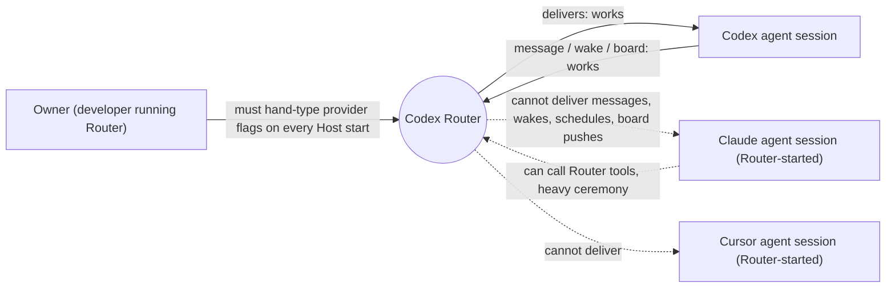

# Router provider delivery — Requirements

Owner: Shravan (product owner of Codex Router). Source: owner decisions in the 2026-09-23 design conversation, recorded on the Agent Router board thread `01a0d008-9863-78f2-9514-74f73fc811d1`. Observable contract: [specification.md](specification.md).

## Who is affected and what hurts today

| Class | Job | Current pain (evidence) |
|---|---|---|
| Owner | Run one Router that coordinates all his agents. | Claude and Cursor exist only when the Host is started with hand-typed `--claude-acp-executable` / `--cursor-acp-executable`; without them every provider call fails "backend unavailable" (observed 2026-09-23). |
| Owner's Claude Code sessions | Receive agent messages while the owner works. | No Router path reaches them (Claude Code has a peer-messaging socket per session, unused by Router). |
| Agent sessions (Codex, Claude, Cursor) | Create, prompt, and message peer agents; be woken; receive board activity. | Message send, wakes, schedules, and board listen push reach only Codex sessions (code survey 2026-09-23). A Claude session cannot create a Codex conversation as itself. Provider calls need operation IDs, generation, epoch, and several JSON flags; a Codex agent failed on them in practice. |

## Authorized needs

All rows are `authorized` by the owner in the 2026-09-23 conversation; priority is owner-assigned **must** unless noted.

| ID | Need / outcome | Why it matters |
|---|---|---|
| U1 | Everything goes through Codex Router: Codex, Claude, and Cursor sessions are peers that can create, prompt, and message each other, including across harnesses. | Router is the single coordination hub; a split world defeats it. |
| U2 | Wakes and schedules deliver a message that wakes the recipient, for all three agent kinds. | Timed follow-up and recurring work must reach any agent. |
| U3 | Boards push activity to listening sessions of all three kinds, not only long-poll. | Board threads are the shared work record; listeners must be notified. |
| U4 | Claude and Cursor are enabled automatically by default from a JSON config file the Host loads on start; that config enables all of U1–U3 for them. | Forgetting flags silently removed providers; enablement must be the default. |
| U5 | Agent-friendly surface: agents state intent (who, what, where); Router supplies internal plumbing; one conversation surface for every agent kind; errors say how to fix. | Agents failed on ceremony (UUIDv7, generation, epoch, split tool families). |
| U6 | Self-declared sender identity remains the contract. `whoami` only fills it from the harness and fails closed when it cannot. | Harness environment is not always available (owner, 2026-09-23). |
| U7 | Messages use the richest mid-turn behaviour each provider really supports (Claude steering), decided from provider research; never silently destroy a running turn. | Agents must be able to redirect peers mid-turn without losing work. |
| U8 | Router messages (and wakes, schedules, board pushes, approval notices) reach Claude Code sessions that Router did not start, such as the owner's own CLI session, through Claude Code's built-in cross-session peer messaging (owner, 2026-09-24: "https://code.claude.com/docs/en/cross-session-messaging this is what we need"). | The owner works in Claude Code alongside agents; peers must reach those sessions. |
| U9 | The work ships as one PR, proven with a Luna Operator against a debug Router before merge. | Owner delivery preference. |
| U10 | Router features (message send, wakes, schedules, board listen pushes, approval notices) are decoupled from the client that reaches a session. Features depend on one delivery interface; each client type (Codex app-server, provider ACP, Claude Code peer socket) is a separate implementation behind an interface, injected when the Host is composed (owner, 2026-09-24: "decoupling with agent-router features and what mechanism is used to send", "for different types of clients like app server, acp, this claude socket", "we use protocols/interfaces and injection"). | Adding or changing a client must not touch every feature; each side must be testable alone. |

## Boundary

- Reuse: the existing native Codex delivery, the external-ACP provider runtime and operation store, board/wake/schedule machinery, and the merged `whoami` resolver.
- May change: all workspace crates (including adding a crate), the `agent-collaboration` skill, and docs in this repository.
- Owner code conventions: responsibility-bearing modules and files have multi-word names; no single-word module names.
- Protected: Codex upstream, the Claude and Cursor adapters (consumed as-is), the owner's `~/.codex` configuration, and the production Router process (no restarts during development).

## Non-goals

- Relaying Claude Code permission prompts to Router.
- A Codex TUI façade for interacting with Router-owned sessions (app-server responses, live tool events, approvals, history). This is separate later work by another agent; this design only has to leave the Codex app-server route's native semantics intact for it.
- Session-bound MCP URLs or caller authentication; attribution stays self-declared.
- Interrupting a running Cursor turn to deliver a message.
- Installing Router as a background service.
- Reading provider transcripts or session files.
