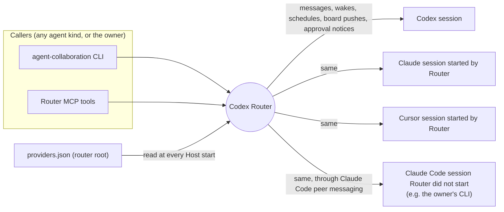
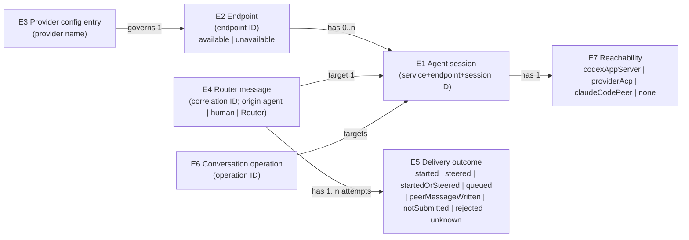

# Router provider delivery — Specification

Requirements: [requirements.md](requirements.md) (U1–U10). Structural realization: [program-design.md](program-design.md).

## What changes, in one picture



Router stays one opaque system here; how it routes is Program Design.

## Domain entities

| ID | Term | Identity rule | Relationships | Invariants | Observable states | Basis |
|---|---|---|---|---|---|
| E1 | Agent session | Service ID + endpoint ID + session ID (the existing SessionRef). A resumed or reloaded session is the same session; a fork or a newly created conversation is a different one. | Belongs to exactly one E2. Has at most one live E7 at a time. | A session never changes endpoint. | known, reachable, unreachable (see E7) | U1, U6 |
| E2 | Endpoint | Endpoint ID within one Router service: `codex-local`, `claude-local`, `cursor-local`. | Has 0..n E1. `claude-local` and `cursor-local` are governed by one E3 entry each. | Endpoint IDs are fixed; the provider kind of an endpoint never changes. | available, unavailable (with reason and fix) | U1, U4 |
| E3 | Provider configuration entry | Provider name (`claude` or `cursor`) within one router root's configuration file. | Governs exactly one E2. | An entry is either enabled or disabled; a disabled entry never launches a provider. | enabled, disabled | U4 |
| E4 | Router message | The caller-supplied or Router-allocated message correlation ID. A retry with the same ID is the same message. | Has exactly one origin — an agent sender E1, an explicit human, or Router itself (board activity, wake or schedule framing, approval notices) — exactly one target E1, and one requested delivery mode. | Content and sender are immutable once accepted for delivery. | submitted → one E5 outcome | U1, U6 |
| E5 | Delivery outcome | One per (E4, attempt); attempts of one E4 are distinct and immutable. A wake fire, schedule run, board-listen batch, or approval notice produces its own E4. | Belongs to one E4. | Reports the strongest mode actually evidenced, never the mode merely requested. | `started`, `steered`, `startedOrSteered` (endpoint cannot distinguish), `queued`, `peerMessageWritten` (written to a Claude Code session's peer socket; not an acceptance), `notSubmitted` (retryable or not), `rejected` (with reason), `unknown` | U1, U2, U3, U7 |
| E6 | Conversation operation | Caller-owned operation ID (UUIDv7). The same ID is the same operation; resubmitting it never repeats provider work. | Targets one E2 (create) or one E1 (prompt, load, cancel). | Outcome is inspectable by ID and never replayed automatically. | admitted, terminal (applied / failed), unknown | U5 |
| E7 | Session reachability | Derived per E1: which way Router can reach it now. | One per E1. | A `claude-local` session that Router's provider does not hold but that is live in Claude Code's local session registry belongs to that other Claude Code process; Router never loads it through its own provider while it is live there. | `codexAppServer` (Codex, through the app-server), `providerAcp` (Claude/Cursor session run by Router's provider over ACP), `claudeCodePeer` (live Claude Code session reached through its peer socket), `none` | U1, U8 |



## Normative requirements

### Provider enablement (U4)

- **R1** When the Host starts and the router root has no provider configuration file, the Host MUST create it with both `claude` and `cursor` enabled and then use it. (E3)
- **R2** When the Host starts, it MUST launch every enabled provider from the configuration file; a command-line provider flag MUST override that provider's entry for that start only. (E3, E2)
- **R3** If an enabled provider's executable cannot be found or its process fails to start or initialize, then the Host MUST keep running with Codex and every other provider available, and MUST report that endpoint `unavailable` with a reason and a concrete fix. (E2)
- **R4** If the configuration file is malformed, then the Host MUST start with Codex available, report both provider endpoints `unavailable` with the file path and parse error, and MUST NOT overwrite the file. (E3, E2)
- **R5** A disabled entry MUST report its endpoint `unavailable` with reason "disabled in providers.json". (E3, E2)

### One conversation surface (U1, U5)

- **R6** The conversation create and prompt operations MUST accept any available endpoint (Codex, Claude, Cursor) with the same inputs and result shape; the caller never chooses between provider-specific and Codex-specific operations. The existing provider load and cooperative cancel operations MUST remain available under the same conversation surface with unchanged meaning: cancel targets one exact active operation and binding generation, and detaching a wait never cancels. On an endpoint that does not support load or cancel, the operation MUST be rejected with `unsupportedCapability` and a fix. (E1, E2, E6)
- **R7** A create MUST return the created session's SessionRef when it completes within the caller's timeout. On timeout it MUST return the create's operation ID, which MUST be inspectable through the operation surface for every endpoint, including Codex. (E6, E1)
- **R8** A session created by the create operation MUST accept a subsequent prompt or message (create-then-message works for every endpoint). (E1)
- **R9** A caller session on one endpoint MUST be able to create and prompt a conversation on another endpoint as itself. (E1)
- **R10** Provider generation/epoch inputs MUST be optional; when omitted Router uses the current binding; when supplied and stale Router MUST reject with `staleGeneration`. (E6)
- **R11** Operation IDs stay caller-owned. The CLI MUST allocate one when omitted and print it before waiting. The MCP surface MUST require it for operations that can apply provider work, and its validation error MUST state the required format and how to generate one. (E6)
- **R12** Every "provider unavailable" error MUST name the endpoint and the fix. (E2)

### Delivery to every session (U1, U2, U3, U7)

- **R13** Message send, wake firing, board thread-listen pushes, and approval notices MUST deliver to any reachable E1 regardless of endpoint. Scheduled runs MUST deliver to Codex, Claude, Cursor, and `claudeCodePeer` sessions; a run delivered to a `claudeCodePeer` session finalizes as `peerMessageWritten` with no completion claim. (E1, E4, E5)
- **R14** Each delivery attempt MUST report an E5 outcome naming the strongest mode actually evidenced; when the endpoint cannot distinguish a new turn from a steer it MUST report `startedOrSteered`. (E5)
- **R26** A scheduled run on an existing Claude or Cursor session MUST wait while that session is running (never steer it), start when idle, complete from the provider's own prompt settlement, and on timeout request cancellation and finalize only when the provider operation settles; it MUST NOT read provider transcripts. Summaries follow the same destination policy as native runs: only fresh-each-run destinations require a summary, and provider and peer destinations are existing sessions, so their runs finish without one. (E1, E5)
- **R15** Delivery-mode behaviour per reachability MUST be:

| Requested mode | Codex (`codexAppServer`) | Claude (`providerAcp`) | Cursor (`providerAcp`) | Claude Code session (`claudeCodePeer`) |
|---|---|---|---|---|
| `auto` | unchanged: steer if active, else start; reported as native evidence allows (`started`, `steered`, or `startedOrSteered`) | steer if a turn runs, else start | start if idle, else queue until the turn ends | `peerMessageWritten` (read between tool calls if a turn runs; starts a turn if idle) |
| `queue` | unchanged | `queued` (starts at once when idle, otherwise after the current turn) | `queued` (same) | `rejected` "queue unsupported for Claude Code sessions" |
| `steer` | unchanged | `steered` into the running turn; if none runs, `notSubmitted` with reason "no running turn" | `rejected` with reason "steer unsupported by Cursor" | `peerMessageWritten` if the registry shows the session busy; otherwise `notSubmitted` "no running turn" |

- **R16** If the target E1 is a Claude or Cursor session not live elsewhere and not loaded in the running provider, then Router MUST load it and then deliver; if loading fails, the delivery MUST be `notSubmitted` with the load failure reason, and Router MUST NOT create a replacement session. A session that never started a turn cannot be loaded after a provider restart, because the provider persists nothing before the first prompt (owner-accepted cost, like held empty Codex threads). That load failure MUST be reported as `providerSessionNotFound` with the fix "create a new conversation", and it is permanent: no further attempts for that delivery. (E1, E5)
- **R27** Router MUST locate a `claudeCodePeer` session only through Claude Code's local session registry by session ID. If the registry entry is missing, its process is gone, or its peer protocol version is not one Router supports, the session MUST NOT be treated as `claudeCodePeer`-reachable (fail closed). The registry's session status (`busy`, `idle`, `waiting`, `shell`, an unknown value, or none) is advisory and MUST NOT make a live session unreachable. (E1, E7)
- **R28** If a `claude-local` session is live in Claude Code's registry and not held by Router's provider, Router MUST deliver through its peer socket and MUST NOT load it through Router's provider. (E7)
- **R29** A `peerMessageWritten` outcome MUST NOT be reported as accepted by the agent; the receiving Claude Code session's own inbound controls may hold or drop it. (E5)
- **R30** Every peer message MUST state its origin (agent sender SessionRef, human, or Router) and tell the receiving Claude to reply through Router's `message_send` as itself. (E4)
- **R31** Every permission request Router brokers (Claude and Cursor provider requests, and native Codex requests) MUST either reach its approver as an approval notice, visible in `approval list` and history and decidable with `approval decide`, or be refused with a visible, recorded reason and fix. Router MUST NOT cancel a permission request silently. For provider requests, the prompt sender approving its own helper's request (requester equals approver) is normal delegation and MUST be routed. For native Codex requests, a thread that is its own approver cannot be served; that request is refused with a recorded reason (`approverIsRequester`) and the fix "set a different approver". A provider session configured as its own approver (the blocked helper) cannot decide its own request; that request is refused with the fix "set a different approver". Timeouts, an unreachable approver, and unmappable option kinds are each recorded in approval history with their reason. A refusal that happens before an approver can be identified (no approval context, no broker, no native route) is recorded on the provider operation when one exists, and always as one payload-free warning; it never invents a requester or approver. (owner decision 2026-09-25) (E1, E5)
- **R19** If the target is busy and cannot take the delivery now, wake and board-listen deliveries MUST be retried under the existing retry policy; a direct message send MUST return the busy outcome to the caller. (E5)
- **R20** A new attempt for the same E4 MUST be made only after the previous attempt is known not to have submitted; an attempt whose outcome is `unknown` or accepted (including `queued`) MUST NOT be followed by another attempt. (E4, E5)

### Stale Host (owner decision 2026-09-25)

- **R32** The Host MUST detect when the executable at its launch path is no longer the build it is running, and report it: in `host status` (running and installed versions, and the fix `codex-router host restart`), in the MCP `initialize` instructions, and once in the Host log. The `agent-collaboration` CLI MUST warn once on stderr when its version differs from the Host's, without changing its stdout. The Host MUST NOT restart itself, because a restart interrupts routed sessions. (E1)

### Identity (U6)

- **R21** Router MUST keep accepting explicit self-declared SessionRefs everywhere a sender, creator, approver, or reader is required; harness-derived identity (`whoami`, `--actor self`) MUST fail closed when the harness variable is missing or several are set. (E1)

## Observable contracts

**C1 Provider configuration file** — `<router-root>/providers.json`, owner-editable:

```json
{
  "version": 1,
  "providers": {
    "claude": { "enabled": true, "executable": null, "arguments": [] },
    "cursor": { "enabled": true, "executable": null, "arguments": ["acp"] }
  }
}
```

`executable: null` means resolve `claude-agent-acp` (Claude) or `agent` (Cursor) on the Host's PATH at each start. Unknown keys are rejected as malformed (R4). Changes apply on the next Host start.

**C2 Endpoint catalog** — `claude-local` and `cursor-local` are always listed; `unavailable` carries `reason` and `fix` text (R3–R5, R12).

**C3 Conversation surface** — CLI `conversation create|prompt|load|cancel` and `conversation operation show|wait|reconcile`; MCP `conversation_create`, `conversation_prompt`, `conversation_create_and_prompt`, `conversation_load`, `conversation_cancel`, `conversation_operation_show|wait|reconcile`. `load` and `cancel` keep the former provider operations' inputs and meaning (R6). The former `conversation provider …` commands and `provider_conversation_*` tools no longer exist.

**C5 Claude Code peer messaging (external contract, Claude Code ≥ 2.1.224; observed on 2.1.281, peer protocol 1)** — each live session has a registry record naming its session ID, process ID, status (`busy`/`idle`), peer protocol, and peer socket path, plus a published peer auth key. A message is newline-delimited JSON: an optional `{"type":"auth","token":…}` line, then `{"type":"user","message":{"role":"user","content":…}}`. The receiver reads it between tool calls during a turn, or starts a turn when idle. No acknowledgement is returned.

**C4 Delivery receipt** — every message send, wake delivery attempt, run record, and listen delivery exposes one E5 outcome value from the set in E5 and the E7 reachability it was delivered through, plus reason for `notSubmitted` and `rejected`, and keeps the endpoint's own identifiers (native turn/submission IDs, provider operation ID) when present. New values are additive; records written before this change remain readable with their original meaning.

Compatibility: existing Codex delivery behaviour and receipts are unchanged. Existing wake and delivery records remain readable.

Undefined, deliberately: ordering between deliveries from different senders.

## Structural constraint (U10)

- **K1** Router features MUST reach sessions only through one delivery interface, and each client type (Codex app-server, provider ACP, Claude Code peer socket) MUST be a separately replaceable implementation composed into the Host. Observable consequence: every feature's behaviour is provable with a fake delivery interface, and every client implementation is provable without any feature. Realization and module naming are Program Design's.

## Cross-cutting obligations

- Security: attribution is self-declared, not authenticated (U6 non-goal). Peer sockets are restricted to the owner's OS user; Router uses only the local registry and the published auth key, never another user's sessions.
- Reliability: a provider failure never removes Codex or another provider (R3).
- Privacy: Router never reads provider transcripts (non-goal).
- Performance, accessibility: not applicable (no new latency or UI promise).

## Proof obligations

| Req | Evidence class |
|---|---|
| R1–R5 | Automated behaviour at Host start with fixture providers (missing file, malformed file, missing binary, failing provider, flag override); runtime evidence on the debug Router. |
| R6–R12 | Automated CLI/MCP behaviour tests, including load and exact-operation cancel (a detached wait does not cancel; a late cancel never reaches a later prompt); MCP catalog inspection showing removed tools absent; debug Router transcript creating and messaging Codex, Claude, and Cursor sessions, including cross-endpoint creation. |
| R13–R20, R26 | Automated behaviour per reachability × mode (R15 table) with provider fixtures that report busy, idle, not-loaded, and load failure; state inspection of delivery records; debug Router transcript of a wake and a board listen delivering to a Claude session. |
| R27–R30, C5 | Automated behaviour with a fake registry directory and a fake peer socket (live, gone, unknown protocol, each registry status including waiting, shell, and none); manual runtime evidence: a Codex agent messages the owner's live Claude Code session through Router and the message arrives mid-turn, and Claude replies via `message_send`. |
| R31 | Automated approval-broker and ACP fixture tests for every refusal path, including a same-provider fixture where session B keeps replying while A's approval is pending; debug Router runtime proof: a Cursor "Not in allowlist" request approved through `approval decide` (then `whoami` reports the Cursor session), and a Claude approval in default permission mode. |
| R32 | Automated observer tests (same file, replaced file with another version, missing, unreadable); injected Drift/Match MCP `initialize` tests; debug Router proof that replacing the launch executable shows drift in `host status` and MCP `initialize`, with one Host warning. |
| R21 | Existing and extended automated identity tests. |
| K1 | Feature tests run against a fake delivery interface; each client route has its own tests with a fake client; no feature module imports a client module (dependency check). |
| U9 | Luna Operator report against the debug Router; CI green. |
