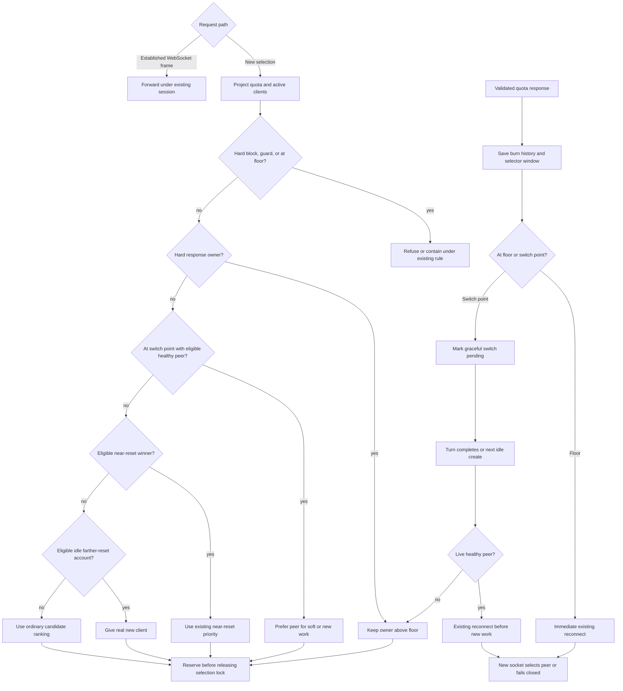

# Idle quota drain and floor protection program design

Date: 2026-09-25
Identity: `idle-quota-drain-program-design-2026-09-25`
Requirements: [Idle quota drain requirements](2026-09-25-idle-quota-drain-requirements.md)
Specification: [Idle quota drain specification](2026-09-25-idle-quota-drain-specification.md)

## Structural choice

Keep policy in the existing pure burn-down assessment. The state projection already supplies current active-client count, provider windows, candidate burn, and the configured floor to both runtime and quota/status; the proxy already serializes selection with reservation. Remove the near-zero retirement pass, and classify eligible idle accounts for a separate farther-reset priority after the existing near-reset tiers. Treat the configured floor as the hard stop and compute a graceful-switch point 300 basis points above it. Share those two predicates with selection, quota/status and the refresh-driven WebSocket reconnect check. The existing quota worker makes its provider call on a 180-second default cadence. This quota-policy scope needs no new store, scheduler, provider-call type, or reset-credit dependency.

The owner selected a 300-basis-point fixed switch margin. The 2026-09-26 correction makes it a best-effort transition band rather than a hard admission cutoff. The configured floor is the new hard zero. The margin provides room for whole-percent observations and refresh delay without claiming a bound on an individual request's consumption.

## Current and target path

| Existing owner/path | Target change and reason |
| --- | --- |
| `selection_projection.rs` reads selector windows, active counts, run-rate history and weekly floor. | Preserve inputs and active-count authority; reset-credit count remains absent. |
| `burn_down.rs::assess_account` computes quota availability, score and floor exclusion. | Keep hard exclusion at the configured floor; separately mark eligible accounts at/below the switch point for peer preference. Retain short-window and other hard checks. |
| `burn_down.rs::apply_near_zero_retirement` and `window_requires_near_zero_retirement` hold below 5% or within 30m projected runout. | Delete both triggers and the now-unused Retiring availability/reason throughout current status and selection. |
| `burn_down.rs::apply_initial_admission` handles idle unknown burn only inside 48h. | Keep its inside-48h precedence; admit otherwise eligible idle unknown-burn accounts beyond 48h into a new farther-reset idle tier. |
| `burn_down.rs::weekly_window_is_drain_pool_candidate` and `candidate_priority_cmp` rank near-reset known-burn accounts. | Preserve the 48h near-reset pool; add farther-reset idle comparison after near-reset comparisons but before ordinary far-reset ranking. |
| `account_selection.rs` validates hard/soft owner, selects from shared assessment, then reserves under one lock. | Above the floor, keep a hard owner even inside the switch band. For soft affinity and unowned work, prefer an eligible peer with no floor or above its own switch point when one exists; otherwise retain the existing eligible fallback. At/below the floor, refuse a hard owner and select a peer for fresh work. First idle admission becomes active before next selection. |
| `account_selection.rs` owns the proxy's live selector facts and admission lock. | Add a private read-only floor-switch peer assessor over those existing facts. It classifies a peer without calling `select_upstream_account`, reserving capacity, advancing weighted state, or publishing affinity. The WebSocket boundary consumes its closed result. |
| `quota_refresh_service.rs` detects a saved weekly floor reached and notifies WebSocket owners only after fallible history work. | Save validated burn-history observations and selector window, then request a graceful switch at `F+3` or the existing immediate floor reconnect at `F`, before unrelated snapshot and purge work. Quota refresh does not claim a persisted-only peer is live-routable. |
| `websocket.rs` revocation registry and forwarding pumps own the existing reconnect signal and active-turn reservation. | Give a switch-band socket a pending intent; after its terminal turn event or before an idle next `response.create`, check a live Router peer and reconnect only if safe. Keep the immediate cancellation path for `F`. Do not forward a next turn after deciding to reconnect. |
| Quota/status formatting and JSON project the shared assessment. | Show configured hard floor and switch point; remove unpublished effective-stop fields and dead retirement presentation; add `held_floor_switch` when a healthy peer takes priority, retain `preferred_idle_far_reset` elsewhere, and preserve degraded-load labeling. |
| `quota_background_refresh_worker.rs` starts cycles at the CLI default interval. | Change the default from 240 to 180 seconds; retain immediate startup, elapsed-work subtraction, explicit override, and error reporting. |

The diagram omits detailed provider-error containment and quota-confidence variants; those stay at their existing owners. The changed edges are hard floor exclusion, graceful peer preference, prompt refresh-driven socket reconnect, removal of retirement, and farther-reset idle ranking. A hard-owned continuation above the floor never enters new-assignment ranking; at/below the floor it fails and requires a fresh conversation. An established WebSocket frame does not re-enter selection; a refresh signal interrupts that forwarding path. Frames already in flight may race the signal.

## Two-stage floor owner

The existing `WeeklyQuotaFloorBasisPoints` remains the only persisted operator setting. A pure selection-policy function returns `None` when the floor is disabled and `min(10_000, floor_basis_points + 300)` for the switch point otherwise. The configured floor itself is the hard stop. `burn_down.rs::weekly_quota_floor_excludes` compares eligible weekly evidence to the configured floor, inclusive. A separate assessment fact marks an otherwise eligible account inside the switch band. Stale or missing required weekly evidence keeps the existing fail-closed behavior; the switch band never turns invalid evidence into eligibility.

The pure `assess_route_band` path first assesses every account's hard eligibility, retaining that full set for previous-response ownership and status. It then forms the new-work candidate universe with **one** S-ID-01 healthy-peer predicate: a candidate must have fresh eligible windows and credentials, pass the short-window and calculable 900-second runway guards (or the accepted one-client unknown-burn admission), and have no floor or stand above its own switch point. Runtime selection supplies queue, reservation and exhaustion facts before this assessment. **Only when an otherwise eligible account is in its switch band** and the healthy set is nonempty does that healthy set alone receive new/soft work; switch-band accounts and nonhealthy non-band accounts yield. With no switch-band account or no healthy peer, all above-floor eligible accounts retain the existing fallback and ranking. Run near-reset initial admission, farther-idle promotion and ordinary pool/ranking **on the chosen candidate universe**. Filtering only after those promotions is incorrect: a yielding near-reset account can suppress a healthy far-idle winner, or a yielding far-idle account can consume the sole promotion before being filtered. Reflect the candidate result back into the full assessment as `HeldFloorSwitch`/`held_floor_switch` for every yielding account, while leaving it hard-eligible above `F`. The proxy's serialized selection applies hard exclusions, preserves a hard previous-response owner above the floor, skips a yielding soft-affinity owner when the assessment has healthy peers, then selects and reserves from the assessment's candidates. This order avoids interpreting a preferred peer as permission to migrate a provider-bound `previous_response_id`. At/below the floor, a hard owner returns the existing unavailable-owner error; a new conversation without that ID can select an eligible peer. If no peer is eligible, selection fails closed.

`account_selection.rs` owns a private, cloneable runtime floor-switch peer assessor built from the proxy's existing read-only state store, route-band queue health, reservation book and runtime-exhaustion registry. Its one account/route-band query returns the closed result `SelectablePeer | NoPeer | AuthorityUnavailable`. It reads queue health without mutating it; clones the current reservation book under its lock and applies stale-age filtering to the clone; snapshots runtime exhaustions and filters expired entries without retaining/removing entries in the shared registry; uses `project_route_band_selection_inputs_with_active_counts_read_only`; excludes the source account; and applies the shared healthy-peer predicate and assessment. It never calls `select_upstream_account`, reserves an account, changes weighted deficits or account holds, writes SQLite, or publishes session/response affinity. A queued failure, failed projection, or poisoned runtime snapshot returns `AuthorityUnavailable`; a sound assessment with no safe peer returns `NoPeer`. The proxy passes this assessor to the WebSocket forwarding context through an internal interface, not through a provider or public wire contract. At a pending switch boundary, `SelectablePeer` permits reconnect, while `NoPeer` or `AuthorityUnavailable` retains the old socket above `F`; the hard-floor token bypasses this query. The subsequent fresh socket still runs actual selection, which remains authoritative if facts race between query and reconnect.

`quota_refresh_service.rs` first saves the validated burn-history observations used by the weekly runway guard, then the selector window. Before unrelated snapshot or purge work, it calls the existing observer with one of three redacted account-scoped intents: graceful switch at/below `F+3` while above `F`, immediate hard-floor reconnect at/below `F`, or clear a pending graceful switch after a successful saved observation above `F+3` **or with the floor disabled**. The worker does not decide peer health from the SQLite mirror. If a required history or selector write fails, the refresh reports failure and sends no new intent; the previous persisted selector evidence remains authoritative until a later successful refresh or the existing freshness guard rejects it. A floor edit alone does not signal an existing socket. The status projection retains the configured-floor fields and adds nullable `weekly_quota_switch_at_basis_points` and `weekly_quota_switch_at_percent`; the unpublished effective-stop fields are removed. Comparisons at both thresholds remain inclusive.

The proxy owns the live decision at a socket boundary. Extend its existing narrow floor notifier/revocation path with a pending graceful-switch intent distinct from the immediate hard-floor cancellation token. A pending intent never cancels an active turn. The two forwarding pumps share a per-socket decision/admission gate: after a terminal `response.completed` or `response.failed` is forwarded, the terminal path marks the turn idle and serializes its peer decision with admission of the next local `response.create`; a next-create path checks the pending intent **before** reserving or forwarding. A held peer check keeps next-create admission pending. Revalidate the current intent epoch, floor observation and turn-idle state before an early close; a newer admitted turn or a successful clear intent invalidates an older decision. A hard-floor cancellation bypasses this graceful gate and preempts even a held peer check. At that boundary the proxy checks current route-band queue health, process-local reservations, runtime exhaustion, and the shared selector assessment using fresh stored quota. A safe peer must pass existing short-window and calculable 900-second runway guards; mere `Reserve` availability is insufficient when its known runway fails. Unknown-burn peers use only the accepted one-client admission rule. If a live peer passes, send the existing Codex reconnect signal and close before further upstream work; otherwise retain the old socket above `F` and retry at the next idle boundary. At/below `F`, the original immediate token closes regardless of peer or active-turn state. The next fresh socket selects a peer if one is eligible, while a hard `previous_response_id` remains bound to its old owner and cannot cross accounts.

Neither threshold reserves provider capacity. Selection cannot retroactively stop an in-flight request or know its cost in advance. The fixed margin makes an earlier switch attempt possible but does not guarantee that quota remains at or above the floor between observations. No burn-dependent floor, persisted second setting, or new provider call is introduced.

## Idle assessment and ordering

After ordinary per-account assessment, classify an idle account using the authoritative active count already projected for its route band. It must be enabled, credentialed, unexcluded, fresh and Eligible for weekly and all reported short windows, above the configured floor when present, with a future weekly reset and no known failed guard. The switch-band peer preference applies after the existing near-reset and farther-idle eligibility facts are calculated; it cannot promote a blocked account. Preserve the existing 900-second boundary for cases where a candidate weekly runway can be calculated. Unknown, insufficient, stale or zero-burn forecasts can receive one real initial client without asserting that the guard was proven safe; quota freshness itself must still be fresh.

Inside 48 hours, retain current initial-admission and known-burn drain behavior. Outside 48 hours, classify eligible zero-client accounts as farther-reset idle candidates. When no near-reset account wins, compare all of these candidates independently of their ordinary `Usable` or `Reserve` availability. Rank them by earlier reset, lower positive remaining weekly percentage, higher burn confidence, and account identity. Promote only the winner to `Usable` with its ordinary `Some(weight)`, including zero, before selected-pool construction, and give it the distinct far-idle routing reason. A nonpreferred idle peer retains its ordinary availability and reason. The later candidate comparator places the promoted far-idle winner ahead of ordinary busy far-reset candidates. Do not promote unknown quota or a failed guard, and do not alter the winner's forecast or confidence.

The process-local reservation book changes under the existing selection lock before another request can assess an account as idle. On release, an account with still-insufficient burn may qualify again; this is one concurrent real client, not a permanent probe count. The CLI's read-only SQLite load mirror can lag runtime reservations. Keep the existing load-source/freshness indicators and clear preferred labels under degraded authority rather than promising instantaneous equality. Add `PreferredIdleFarResetAdmission` to the selector's reason enum with stable machine code `preferred_idle_far_reset`; update the existing human/JSON mappings and preferred-reason allowlist so degraded status does not falsely present it as authoritative.

## Continuation, failure, and cutover

Hard `previous_response_id` ownership remains ahead of soft affinity and new assignment while its account is above the configured floor. The switch band does not invalidate it; provider hard blocks and the floor still can. The proxy never redirects that ID to consume another account. Soft affinity may fall through to a healthy peer inside the switch band, or keep its owner when no peer exists. A validated refresh makes the graceful intent visible immediately after saving burn history and selector window, but delivery of an early reconnect waits for a safe socket boundary and live peer; the hard-floor intent uses the existing immediate signal. A CLI floor edit persists as today: new selection sees the changed policy, while already open sockets await the next successfully saved validated refresh for an intent.

Remove `AccountAvailability::Retiring`, `RoutingReason::RetiringNearZero`, their machine strings, display mappings, test fixtures, and tests that assert the deleted policy. Existing historical logs remain historical; no compatibility output is kept for a state the selector can no longer produce. Preserve the current provider-exhaustion, short-window, affinity, and quota-freshness paths. No migration is required because neither floor storage nor quota-window storage changes.

## Proof seams

| Obligation | Real observation seam |
| --- | --- |
| U-ID-01/02 | Pure assessment plus serialized proxy selection: 7% at 53h, 2% at 97h, known and unknown burn, first and concurrent second starts, release and re-evaluation. |
| U-ID-03 | Selector cases around former <5% and 30m retirement, including active and idle accounts; no current human/JSON retired reason. |
| U-ID-04 | At `F+3`, new and soft work selects a runtime-eligible healthy peer while hard continuation stays; with no peer, two switch-band accounts remain selectable. Prove a yielding near-reset or far-idle account cannot suppress a healthy far-idle winner. An active WebSocket turn finishes before the early reconnect; a pending idle next create is not forwarded when peer switching succeeds. A held peer query must not change reservation/affinity state or close a subsequently admitted turn; `AuthorityUnavailable`, runtime-quarantined, and known-<900s peers do not trigger an early reconnect, while a fresh socket actually chooses the peer. At `F`, every new selection excludes the account, hard continuation refuses, and immediate socket reconnect preempts a held peer query without depending on peer health. Retain required history/window writes, write-failure no-signal, held/failing snapshot or purge ordering, floor-edit effect, and nonreplayable/committed HTTP limits. Run the isolated debug Router with the real Codex client/Luna profile through a loopback upstream to confirm the reconnect creates a fresh request on the peer; if it keeps the old `previous_response_id`, report the unclosed integration gap rather than claiming a successful switch. |
| U-ID-05 | CLI/status projection and JSON for distinct far-idle and held-floor-switch reasons, configured hard floor and switch point, honest confidence, and degraded active-load authority. |
| U-ID-06 | Existing hard/soft affinity, reported short-window guard, usage-limit block and no reset-credit input regressions. |
| U-ID-07 | Worker startup and controlled-clock interval tests for an immediate first cycle, 180-second start-to-start target, elapsed work, and a slow-cycle overrun that never invents a fresh observation. |

Use fixture-owned SQLite, controlled clock, and loopback transport for cross-boundary proof. The implementation plan selects exact tests and commands; this design does not require live provider redemption, production state access, or replacement of the running Router.
