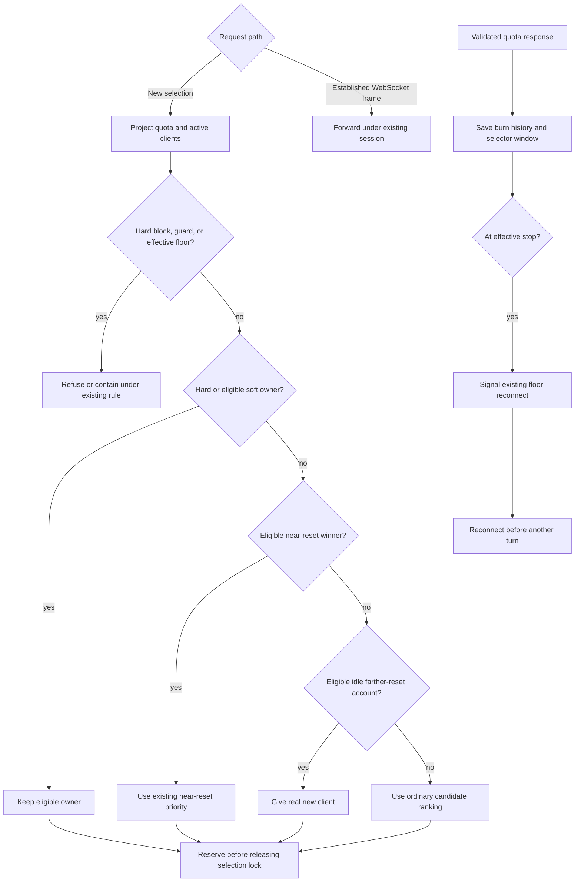

# Idle quota drain and floor protection program design

Date: 2026-09-25
Identity: `idle-quota-drain-program-design-2026-09-25`
Requirements: [Idle quota drain requirements](2026-09-25-idle-quota-drain-requirements.md)
Specification: [Idle quota drain specification](2026-09-25-idle-quota-drain-specification.md)

## Structural choice

Keep policy in the existing pure burn-down assessment. The state projection already supplies current active-client count, provider windows, candidate burn, and the configured floor to both runtime and quota/status; the proxy already serializes selection with reservation. Remove the near-zero retirement pass, and classify eligible idle accounts for a separate farther-reset priority after the existing near-reset tiers. Compute one effective floor stop from the configured floor and a fixed 300-basis-point cushion; share that computation with the selector and the existing refresh-driven floor reconnect check. The existing quota worker makes its existing provider call on a 180-second default cadence. This quota-policy scope needs no new store, scheduler, provider-call type, or reset-credit dependency.

The owner selected a 300-basis-point fixed cushion. It provides room for whole-percent observations and refresh delay without claiming a bound on an individual request's consumption. One shared policy constant keeps request admission and refresh-driven reconnect aligned.

## Current and target path

| Existing owner/path | Target change and reason |
| --- | --- |
| `selection_projection.rs` reads selector windows, active counts, run-rate history and weekly floor. | Preserve inputs and active-count authority; reset-credit count remains absent. |
| `burn_down.rs::assess_account` computes quota availability, score and floor exclusion. | Replace current-floor comparison with effective stop; retain hard and short-window checks. |
| `burn_down.rs::apply_near_zero_retirement` and `window_requires_near_zero_retirement` hold below 5% or within 30m projected runout. | Delete both triggers and the now-unused Retiring availability/reason throughout current status and selection. |
| `burn_down.rs::apply_initial_admission` handles idle unknown burn only inside 48h. | Keep its inside-48h precedence; admit otherwise eligible idle unknown-burn accounts beyond 48h into a new farther-reset idle tier. |
| `burn_down.rs::weekly_window_is_drain_pool_candidate` and `candidate_priority_cmp` rank near-reset known-burn accounts. | Preserve the 48h near-reset pool; add farther-reset idle comparison after near-reset comparisons but before ordinary far-reset ranking. |
| `account_selection.rs` validates hard/soft owner, selects from shared assessment, then reserves under one lock. | Keep precedence and reservation semantics. A floor-excluded hard owner still fails; first idle admission becomes active before next selection. |
| `quota_refresh_service.rs` detects a saved weekly floor reached and notifies WebSocket owners only after fallible history work. | Save the validated burn-history observations and selector window, then use the same effective-stop calculation to signal open WebSockets immediately, before unrelated snapshot and purge work. New selectors and open sockets thus act on the same persisted observation and runway evidence. |
| Quota/status formatting and JSON project the shared assessment. | Show configured floor and effective stop; remove the dead retirement presentation; add `preferred_idle_far_reset` while preserving degraded-load labeling. |
| `quota_background_refresh_worker.rs` starts cycles at the CLI default interval. | Change the default from 240 to 180 seconds; retain immediate startup, elapsed-work subtraction, explicit override, and error reporting. |

The diagram omits detailed provider-error containment and quota-confidence variants; those stay at their existing owners. The changed edges are floor exclusion at selection, prompt refresh-driven socket reconnect, removal of retirement, and farther-reset idle ranking. An owned continuation entering selection never enters new-assignment ranking. An established WebSocket frame does not re-enter selection; a refresh signal interrupts that forwarding path. Frames already in flight may race the signal.

## Effective floor owner

The existing `WeeklyQuotaFloorBasisPoints` remains the persisted operator setting. A pure effective-stop function in the selection policy returns `None` when the floor is disabled and `min(10_000, floor_basis_points + 300)` otherwise. `burn_down.rs::weekly_quota_floor_excludes` uses it on eligible weekly evidence. `quota_refresh_service.rs` first saves the validated burn-history observations used by the weekly runway guard, then the selector window, then uses the same effective-stop function on that response and calls the existing floor observer before awaiting unrelated snapshot or purge work. This makes the refreshed window and its runway evidence available to new selection when the reconnect signal reaches open WebSockets. If a required history or selector write fails, the refresh reports failure, does not signal, and leaves the previous persisted selector evidence subject to its existing freshness guard. The status projection derives the configured and effective fields from this one policy, serializing nullable `weekly_quota_effective_stop_basis_points` and `weekly_quota_effective_stop_percent` beside the existing floor fields. The comparison remains inclusive (`remaining <= effective stop`), and stale/missing weekly evidence keeps the current fail-closed floor behavior.

This is an admission/reconnect threshold, not a provider reservation. Selection cannot retroactively stop an in-flight request or know its cost in advance. The buffer is fixed because the owner chose fixed percentage points; no burn-dependent floor, persisted second setting, or new provider call is introduced.

## Idle assessment and ordering

After ordinary per-account assessment, classify an idle account using the authoritative active count already projected for its route band. It must be enabled, credentialed, unexcluded, fresh and Eligible for weekly and all reported short windows, above the effective floor when configured, with a future weekly reset and no known failed guard. Preserve the existing 900-second boundary for cases where a candidate weekly runway can be calculated. Unknown, insufficient, stale or zero-burn forecasts can receive one real initial client without asserting that the guard was proven safe; quota freshness itself must still be fresh.

Inside 48 hours, retain current initial-admission and known-burn drain behavior. Outside 48 hours, classify eligible zero-client accounts as farther-reset idle candidates. When no near-reset account wins, compare all of these candidates independently of their ordinary `Usable` or `Reserve` availability. Rank them by earlier reset, lower positive remaining weekly percentage, higher burn confidence, and account identity. Promote only the winner to `Usable` with its ordinary `Some(weight)`, including zero, before selected-pool construction, and give it the distinct far-idle routing reason. A nonpreferred idle peer retains its ordinary availability and reason. The later candidate comparator places the promoted far-idle winner ahead of ordinary busy far-reset candidates. Do not promote unknown quota or a failed guard, and do not alter the winner's forecast or confidence.

The process-local reservation book changes under the existing selection lock before another request can assess an account as idle. On release, an account with still-insufficient burn may qualify again; this is one concurrent real client, not a permanent probe count. The CLI's read-only SQLite load mirror can lag runtime reservations. Keep the existing load-source/freshness indicators and clear preferred labels under degraded authority rather than promising instantaneous equality. Add `PreferredIdleFarResetAdmission` to the selector's reason enum with stable machine code `preferred_idle_far_reset`; update the existing human/JSON mappings and preferred-reason allowlist so degraded status does not falsely present it as authoritative.

## Continuation, failure, and cutover

Hard `previous_response_id` ownership and eligible soft affinity remain ahead of new assignment. Removing retirement means those owners need only the remaining Usable/Reserve eligibility classes; provider hard blocks and effective-floor exclusion still make a hard owner unavailable. The proxy does not redirect a hard-owned continuation to consume a different account. Soft affinity may fall through under its existing contract when the old account is excluded. A validated refresh at/below effective stop invokes the existing floor-reconnect signal for active WebSockets immediately after saving its burn history and selector window and before unrelated fallible follow-on work; it does not create a per-frame quota read or new background worker. A CLI floor edit persists as today: new selection sees the changed policy, while already open sockets await the next successfully saved validated refresh for a corresponding signal.

Remove `AccountAvailability::Retiring`, `RoutingReason::RetiringNearZero`, their machine strings, display mappings, test fixtures, and tests that assert the deleted policy. Existing historical logs remain historical; no compatibility output is kept for a state the selector can no longer produce. Preserve the current provider-exhaustion, short-window, affinity, and quota-freshness paths. No migration is required because neither floor storage nor quota-window storage changes.

## Proof seams

| Obligation | Real observation seam |
| --- | --- |
| U-ID-01/02 | Pure assessment plus serialized proxy selection: 7% at 53h, 2% at 97h, known and unknown burn, first and concurrent second starts, release and re-evaluation. |
| U-ID-03 | Selector cases around former <5% and 30m retirement, including active and idle accounts; no current human/JSON retired reason. |
| U-ID-04 | Floor equality and one-point-above cases for configured `F` and `F+3`, no-floor case, hard-owner refusal, required history and selector-window writes before reconnect, write-failure no-signal, reconnect before held/failing snapshot or purge, and floor-edit effect on new selection versus an open socket. |
| U-ID-05 | CLI/status projection and JSON for distinct far-idle reason, configured/effective floor, honest confidence, and degraded active-load authority. |
| U-ID-06 | Existing hard/soft affinity, reported short-window guard, usage-limit block and no reset-credit input regressions. |
| U-ID-07 | Worker startup and controlled-clock interval tests for an immediate first cycle, 180-second start-to-start target, elapsed work, and a slow-cycle overrun that never invents a fresh observation. |

Use fixture-owned SQLite, controlled clock, and loopback transport for cross-boundary proof. The implementation plan selects exact tests and commands; this design does not require live provider redemption, production state access, or replacement of the running Router.
