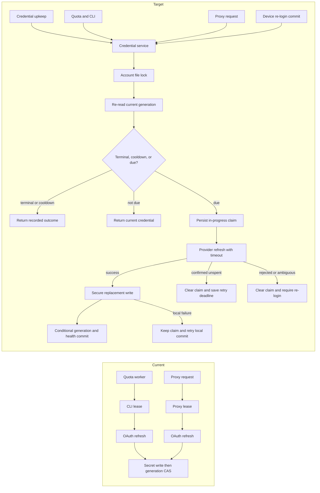

# Enabled OAuth credential upkeep program design

Date: 2026-09-25
Identity: `oauth-credential-upkeep-program-design-2026-09-25`
Requirements: [Requirements](2026-09-25-oauth-credential-upkeep-requirements.md)
Specification: [Specification](2026-09-25-oauth-credential-upkeep-specification.md)

## Current system and structural choice

The quota refresh worker visits enabled credentialed accounts irrespective of quota, but it is the only background caller. The async resolver refreshes only at recorded access expiry, and an absent expiry never triggers it. The proxy and CLI construct separate in-memory refresh registries. The provider refresh runs in `spawn_blocking` while a caller-held async lease guards it; cancellation can release that lease before the returned rotating token is persisted. The provider's classified HTTP failure is flattened to `RefreshUnavailable`, and quota 401 can disable the generation without a renewal attempt. These boundaries explain why merely changing the quota interval would not deliver the upkeep outcome.

Use one Router-owned credential-renewal path for request-time resolution, background upkeep, explicit quota work, and quota-401 recovery. Resolve the configured SQLite state database to its canonical filesystem path after opening it; derive a private credential-lock directory beside that canonical file. Every caller of the same state database, including custom `--state-db` paths and account commands, computes the same per-account operating-system lock identity regardless of its `--secret-root` spelling. The lock serializes refresh and credential activation across processes; every caller re-reads the active generation and durable maintenance state after taking it. If state or lock identity cannot be established, fail closed before provider use. A spawned renewal operation owned by the credential service, not the initiating request, retains authority through provider response, secure secret write, and conditional state activation. The provider client uses a 15-second request timeout. The kernel releases the file lock on process exit; a durable in-progress claim prevents old-token reuse after that release.

Add one generation-scoped, non-secret credential-maintenance row to Router state for last success, next attempt, state, classified failure, and an in-progress provider-use claim with its proven-unused successor generation. This state is distinct from quota evidence and routing enablement. Persist the claim before sending refresh bytes. The existing Router secret store remains the sole credential source. A dedicated enabled-account upkeep loop has a long-lived Tokio runtime, checks ordinary due credentials every 180 seconds and wakes earlier for short token deadlines, independently of the quota worker's enable switch. It processes accounts with bounded concurrency, so a slow/failing account cannot prevent another account's check. Proxy-originated operations run on the serving runtime under a credential-task supervisor; orderly in-process serving-runtime exit drains claimed work for at most 30 seconds and uses Tokio's bounded runtime shutdown instead of unbounded drop if a blocking task remains. The shipped Host-managed `serve` process exits on SIGTERM without invoking that drain; the pre-provider durable claim remains the cross-process safety boundary. Standalone CLI commands await completion. Host shutdown and restart policies remain unchanged. The requested 180-second quota observation default remains owned by the separate quota design.

## Ownership and call paths

| Owner | Responsibility and changed edge |
| --- | --- |
| `codex-router-auth` credential service | Own due-time calculation, typed OAuth outcomes, account-scoped cross-process lock, supervised refresh-and-commit operation, current-generation re-read, and recovery of an unresolved claim. All refresh entry points delegate here. |
| `codex-router-state` | Persist generation-scoped health, retry deadline, and pre-provider in-progress claim; conditionally activate a refreshed generation without changing enabled/disabled status; reject stale generation updates. |
| `codex-router-secret-store` | Preserve secret-only access and replacement-token writes; lock filename contains only a validated account ID or opaque hash. |
| Proxy credential adapter and serving runtime | Resolve credentials through the shared service and await the result; request cancellation does not own the provider operation or commit. An orderly in-process serving-runtime exit drains claimed tasks; external process termination may bypass that path. |
| CLI credential adapter and quota refresh service | Resolve through the shared service, keep the upkeep worker's runtime alive across cycles independently of quota probing, and pass rejected credential generation into coordinated quota-401 recovery. |
| Account login | Keep isolated temporary Codex device login. Acquire the same account lock only for Router-owned generation replacement, after the user completes login. Remove external auth-file account import branches. |
| CLI live diagnostics | Remove the single-file `--auth-json` entry while retaining `--profiles-root`; this diagnostic remains separate from managed-account upkeep. |

The current branches are independently locked before their shared database CAS; the proposed service serializes **before** the provider call. The diagram omits raw token contents and quota provider details. Device login's external user interaction occurs before its Router commit lock.

## Renewal and failure flow

The upkeep loop lists enabled accounts with active credentials. For each, it reads the current generation and maintenance row. Decision order under the file lock is: unresolved in-progress claim → recover or block; terminal `reauth_required`/`unrefreshable` → no provider call; future `next_attempt` retry deadline → no provider call; then ordinary due time. Ordinary due is the earlier of successful-renewal age plus four hours and the known expiry lead: 30 minutes for a longer-lived token, halfway through a token whose issued lifetime is at most 30 minutes. A missing last-success time is due now. The worker wakes at least every 180 seconds and earlier for a short token deadline. Request-time resolution delegates when known expiry is reached. A known expired access token cannot leave the resolver; an unknown-expiry token is marked as such and can reach the provider, with quota-401 recovery as the fallback. Existing known-valid access may continue during a safe transient proactive failure.

Before provider egress, scan successor credential slots under the account lock and choose one that is demonstrably unused; a secret read error cannot be treated as absence. Persist an in-progress claim for the current generation and that exact unused slot, then send the request. After a successful provider response, write the returned bundle, including a replacement refresh token when supplied, to the claimed secret slot, then conditionally activate that generation and clear the claim with a healthy maintenance row. If the provider omits a replacement refresh token, preserve the current refresh token as the existing client does. If secret or state persistence fails after provider success, retain the returned replacement in memory and retry local commit under the lock for at most 30 seconds; do not call the provider again. A later process finding an unresolved claim under the same lock checks only the claim's reserved slot and finishes activation if its bundle exists, otherwise marks that generation reauthentication-required before any provider reuse. Existing orphan slots from earlier failed writes are skipped when creating a claim and can never stand in for its response. A re-login commit uses the same lock, chooses an unused generation slot, and clears old health/claim. A stale operation may not overwrite that login or another renewal. The proxy's credential-task supervisor retains claimed operations after their requesting task disconnects and drains them for at most 30 seconds when its serving runtime exits in process; the independent upkeep worker owns one persistent runtime rather than the quota worker's per-cycle runtime. External SIGTERM can bypass that drain, and process death can still strand a claim and require re-login.

Classify provider rejection, explicit rate-limit/temporary responses, pre-send transport failure, ambiguous post-send/server failure, malformed success, and local write failure without retaining or logging response bodies. A safe failure clears the in-progress claim and stores a bounded retry deadline; other accounts continue. An explicit refresh-token rejection or ambiguous outcome clears the claim into terminal `reauth_required` and never retries the old token. If local state is unavailable after provider use, retry local commit or terminal disposition under the file lock for at most 30 seconds. When that budget ends, release the lock after the provider operation has ended; the previously persisted unresolved claim is the cross-process block. This bounded exit prevents failed accounts from occupying every upkeep slot indefinitely. A later recovery either commits the claim-owned staged bundle or marks re-login required; a response held only in memory is lost at process exit. A state-store failure emits a redacted diagnostic and fails closed for known-expired access. Process termination during the external rotation window cannot reconstruct a response that was never securely staged.

On a quota endpoint 401, pass the rejected credential generation to the shared service. Under the file lock, a newer current generation means reuse it without a second provider refresh; an unresolved claim, terminal health, or active retry deadline means return that recorded outcome. Only the same eligible generation may force one refresh independent of its ordinary due time. Retry quota once with the resulting current generation. Only a second 401 after successful renewal invokes the existing disable path for the generation actually retried. A safe transient refresh failure preserves the enabled account but records failed quota evidence; a terminal refresh rejection records reauthentication required. This separates access-token rejection from refresh-token rejection without changing quota exhaustion policy.

## Cutover and proof seams

Remove the external account import command, the account-login auth-file branch, and the single-file live quota flag, plus their parser options, help, current docs, and tests. Preserve the isolated device-login parser for its temporary auth file and preserve `live quota --profiles-root`. Existing saved generations remain readable; the maintenance row initializes on first check without moving secrets or reimporting accounts. No external Codex auth store is written.

| Obligation | Real observation seam |
| --- | --- |
| U-OU-01 | Serve startup with enabled exhausted idle accounts and quota probing disabled, controlled multi-day clock, loopback OAuth server, real state and secret stores; disabled peer makes no call. |
| U-OU-02 | Test-only provider-client injection through the actual proxy and CLI adapters, with a child test process sharing canonical SQLite/secret paths: concurrent callers prove one refresh; a held provider response and cancelled caller prove a committed replacement; orderly in-process runtime exit bounds a claimed task at 30 seconds; a real-state fixture with a pre-existing unresolved claim proves old-token reuse is blocked; overlapping device re-login proves generation winner. External process termination itself is not exercised by this fixture. No production endpoint override is introduced. |
| U-OU-03 | Loopback OAuth error/rotation responses and injected secret/state failures prove safe retry versus ambiguous terminal state, durable claim blocking a second process, an old orphan followed by a claim/crash cannot activate the orphan, claim-owned staged recovery, 30-second local failure bound, redacted status, and no known-expired token egress. |
| U-OU-04 | CLI parser/help and device-login journey prove explicit auth-file cutover with existing saved generation intact. |
| U-OU-05 | Loopback quota 401 carries rejected generation into the shared service; a concurrent newer generation is reused without another refresh, cooldown/terminal states are honored, and a second 401 disables only the retried generation. |

The file lock and health row are new credential-safety machinery justified by the owner's keep-alive outcome and the current multi-caller topology. They are independent of the quota selection design's no-new-store conclusion. No local test invokes the production OAuth endpoint or replaces the production Router process.
