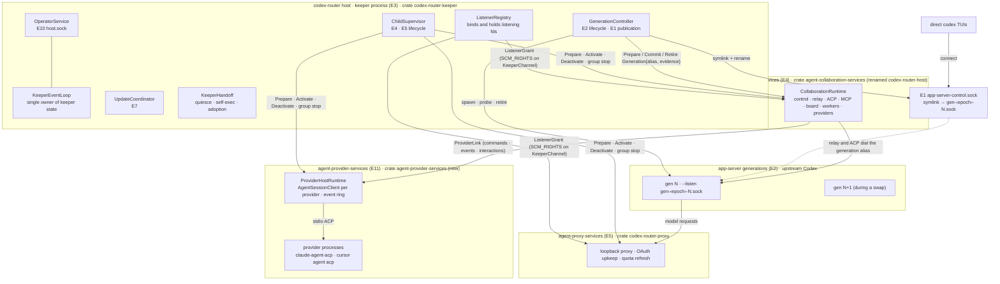
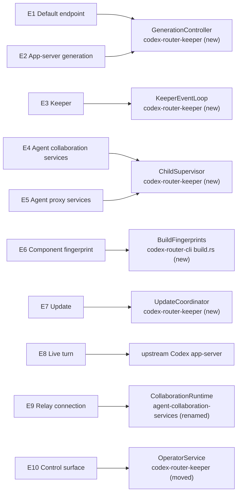
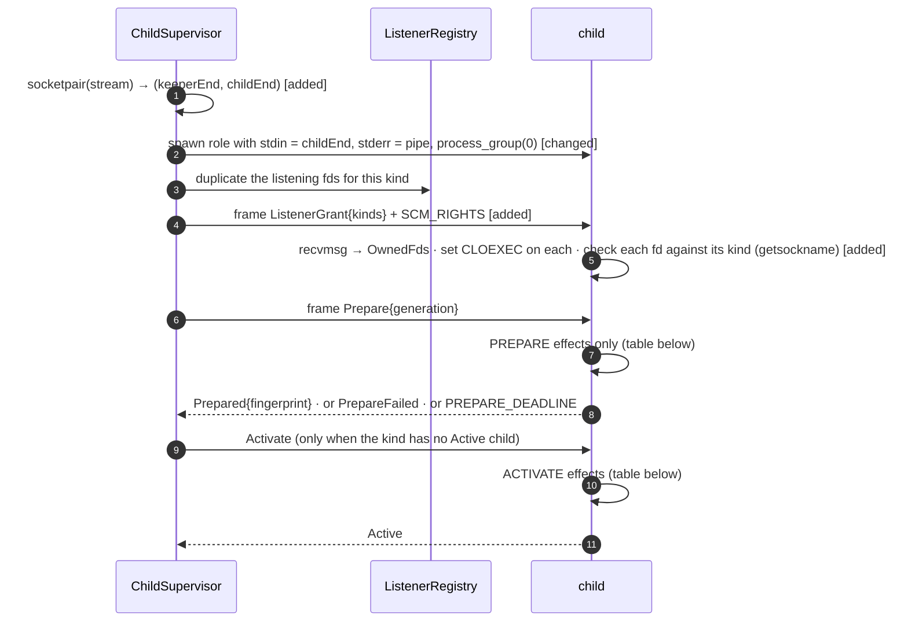
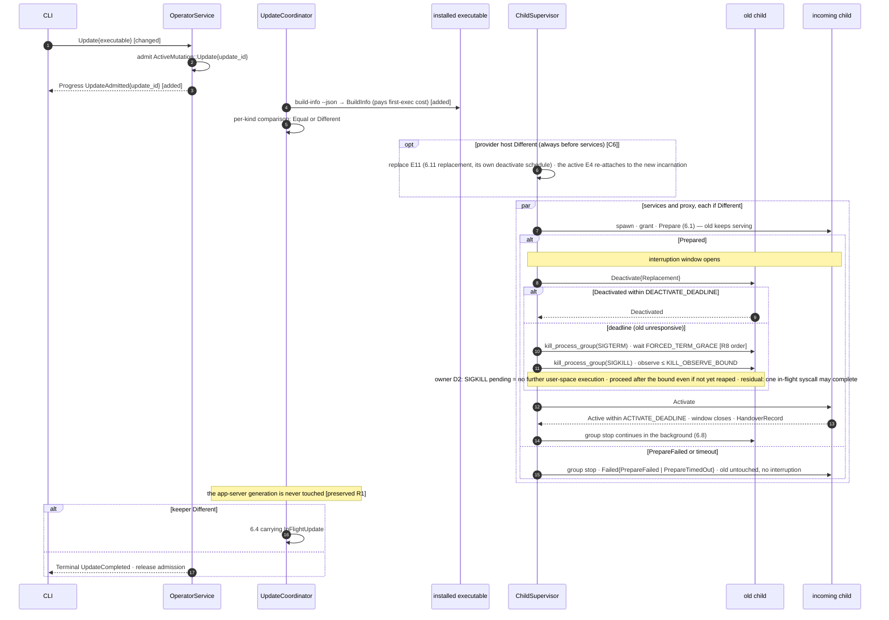
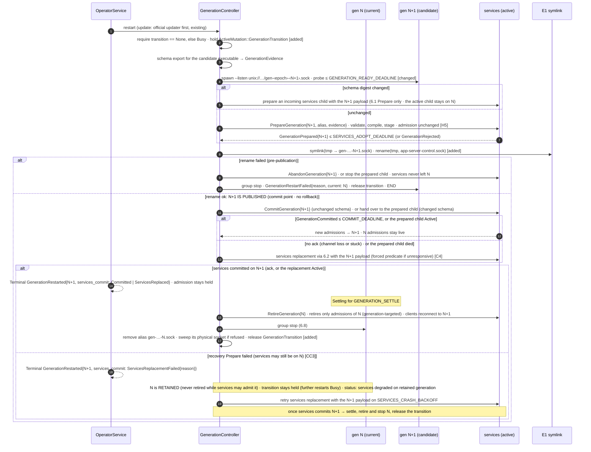
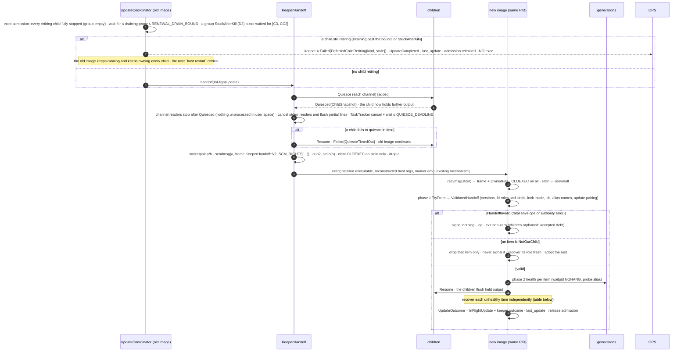
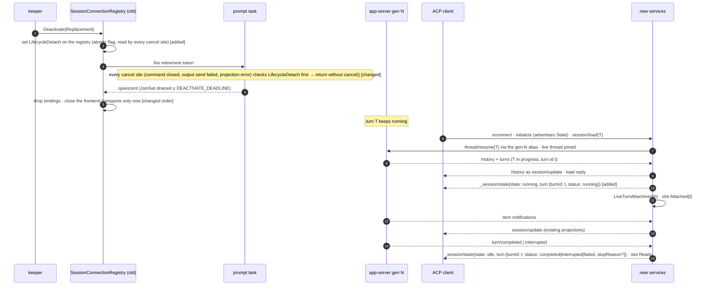
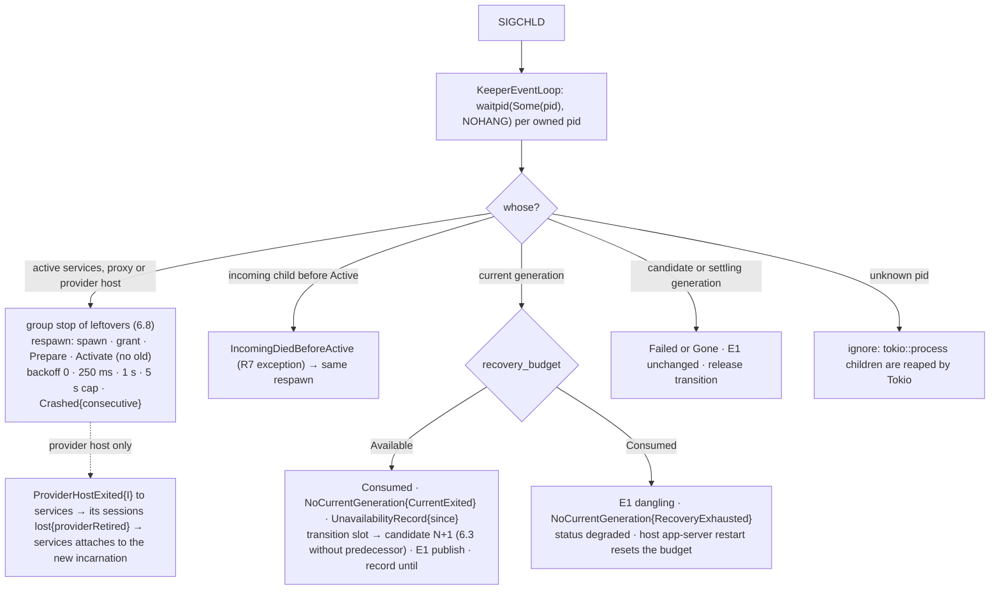
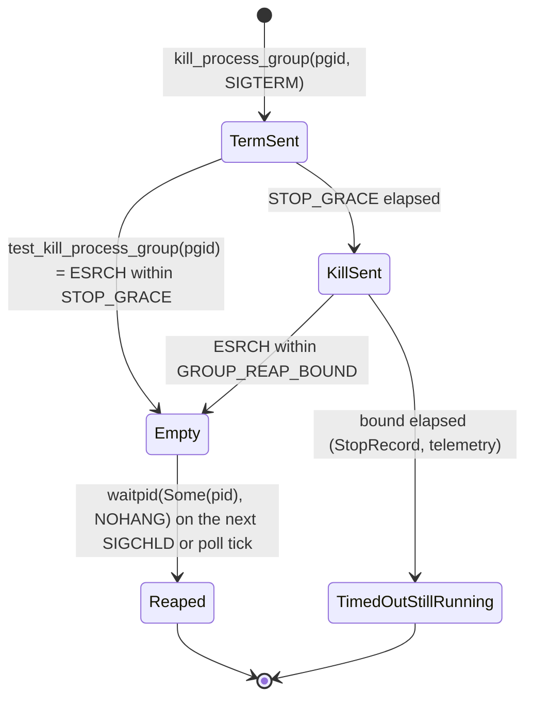
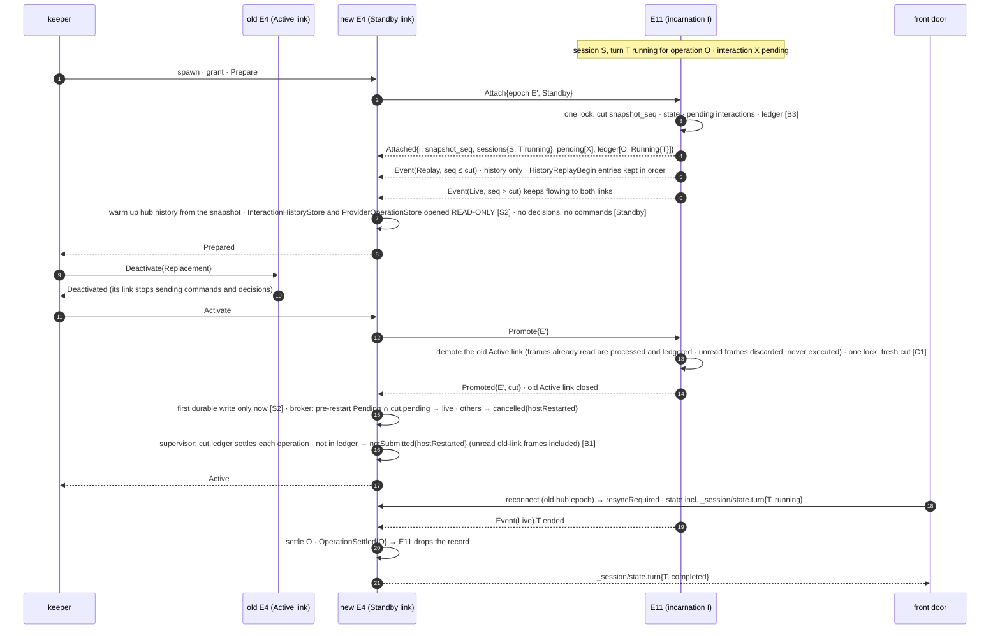

# Host controller — Program Design

Governing: [Requirements](requirements.md) U1–U7 → [Specification](specification.md)
E1–E10, R1–R15, V1–V10. This document is the How. Design prose uses the
Specification's entity terms. Code names appear in home and shape cells and in
code blocks. Current-code anchors are relative to the repository root at
`ad0b6b5`. Upstream anchors are Codex `rust-v0.157.1`. The cross-track contract
for R2 is the Router session protocol (RSP) `_session/state` element's `turn`
record, defined by the RSP track (coordination root `01a0dd96`).

## 1. The design in one picture



**What changes, in plain terms.**

- **One installed executable, three roles.**
  - `codex-router host` is the keeper.
  - `codex-router agent-collaboration-services` is the collaboration body, moved out of today's Host process.
  - `codex-router agent-proxy-services` replaces `codex-router serve`, with no alias.
  - `codex-router agent-provider-services` owns the external ACP provider processes
    (Claude, Cursor), so collaboration restarts don't end provider turns (owner P3).
- **The keeper binds every non-app-server listening endpoint once and never
  closes it.** Children receive duplicates over their KeeperChannel. During a
  replacement, connects wait in the kernel accept queue.
- **Children are replaced by prepare → deactivate → activate.** A new child
  prepares while the old one serves; the handover itself is two channel
  messages. A child that fails to prepare never touches the old one.
- **App-server generations are blue/green.**
  - Direct clients use E1, a symlink swapped atomically.
  - Services dial the exact generation alias it was told about, never E1.
  - The old generation stops after a 1 s settle, through the bounded group stop.
- **The keeper replaces itself by exec'ing in place.**
  - Its PID is unchanged, so every child stays its child.
  - Before exec, the keeper quiesces its child channels.
  - fds, child snapshots and any in-flight update cross the exec as one framed SCM_RIGHTS message on stdin.
- **Kept:**
  - collaboration behavior;
  - the Codex launch plan, schema export and readiness probe;
  - the operator framing and single-mutation admission;
  - the lock file;
  - private socket rules;
  - the existing launch-argument reconstruction (`foreground_launch.rs:194-222`).
- **Removed:**
  - child ownership inside the services process (`lifecycle_owner`);
  - whole-process stop-then-exec (`host_replacement_activation.rs`, `update_activation.rs:149-176`);
  - `serve` binding its own port;
  - `host router restart`;
  - the v1 lock-only handoff.

**What we pay:**

- three processes;
- KeeperChannel;
- the exact quiesce and handoff code;
- two rename cutovers;
- rustix's `net` feature;
- a `cargo_metadata` build-dependency.

**What would justify more:** turns having to survive app-server restarts, or
frequent keeper changes.

## 2. Alternatives

| Choice | Selected | Rejected, and why |
|---|---|---|
| E1 realization | Symlink to the per-generation alias, swapped by `rename(2)`. Codex already publishes `--listen` as a symlink (upstream `unix_socket.rs:49-110`). | **Keeper relays E1 bytes:** a keeper exec would then drop direct TUIs (U1, D1). **Generations on the conventional path:** `AddrInUse`, and drop-guard contention (`unix_socket.rs:227-279,338-366`). |
| Services' dial target | The generation alias named in `GenerationCurrent` | **E1:** the admitted generation and schema would not match the peer across a swap (review G5). |
| Retirement | Swap, **1 s settle**, group stop (owner) | **Stop at swap:** in-flight handshakes fall back to embedded (upstream `tui/src/lib.rs:559-585`). **10 s settle:** upstream timeout, not handshake time; the owner rejected it. |
| Child replacement | Prepare, then deactivate the old, then activate the new | **Stop-then-spawn:** the outage includes startup. **Two active children:** double accept, and workers that assume one runtime (W8 §F). |
| fd transfer | Framed SCM_RIGHTS over Unix stream sockets (`rustix::net::sendmsg`/`recvmsg`, safe; rustix 1.1.4 `send_recv/msg.rs:143-181,712,789`) | Raw fd numbers need `unsafe` (`unsafe_code = "forbid"`). `command-fds` does not cover self-exec, and its macOS support is unverified. `listenfd` handles listeners only (W7). |
| Keeper placement | Separate process (K2), self-exec (D1) | In-process re-adoption on every update (K1) |
| Reaping | `rustix::process::waitpid(Some(pid), NOHANG)` per owned PID on SIGCHLD | `tokio::process::Child` cannot survive exec. `waitpid(-1)` would steal Tokio's statuses. |
| Where provider processes live (owner P3) | A fourth keeper child, `agent-provider-services`, runs `acp-client-runtime` and owns the provider processes. It is replaced only when its fingerprint changes. | **P1:** providers stay in services, so every services restart ends their turns (`lost`). **P2:** hand provider stdio and live ACP connection state from old services to new, which is delicate mid-stream JSON-RPC adoption. |
| Provider process boundary | `acp-client-runtime`'s own three ports (`AgentSessionClient` commands, `SessionEventSink`, `InteractionPort`; agreed with RSP main) carried by ProviderLink | **`SessionCommandPort` / hub:** that is RSP PR 4's front-door port in the collaboration layer, composed over supervisor and delivery (W9 §4-5). Splitting there would move the hub and broker out of collaboration. |
| Proxy auth during handover | Existing cross-process refresh safety: per-account file lock plus a durable claim before egress (`codex-router-secret-store/src/account_credential_lock.rs:19-47`, `codex-router-auth/src/resolver/credential_renewal.rs:346-618`). Upkeep and quota workers start only at Activate. Deactivate lets an in-flight renewal finish before any stop signal. | A new refresh lease: redundant with #83. Killing the old proxy mid-renewal: leaves an `in_progress` claim with no successor, so the account becomes `reauth_required` (`credential_renewal.rs:389-436`). |
| Provider containment | Providers are their own groups (SDK `process_group(0)`, `acp_agent.rs:250-306`); they are services' graceful responsibility and exit on stdio EOF (Specification R8 scope) | Keeper-tracked provider pgids (`OwnedGroups`): not crash-atomic, and pgid reuse risks signalling the wrong group (review O1). Deleted. |

## 3. Where each entity lives



**Type conventions** (root `AGENTS.md`; the owner's Rust rules; `Cargo.toml`
`unsafe_code = "forbid"`; clippy relaxations for tests only):

- serde-tagged enums, camelCase on the wire, used consistently for both `serde` and `as_str()`;
- `human_phrase()` for CLI copy;
- newtypes with fallible constructors;
- wire types converted by `TryFrom` into domain types before any effect;
- `thiserror` errors, with rustix and IO errors mapped at the owning boundary;
- one Tokio runtime per process, owned by the role entrypoint;
- `Duration` for elapsed time, and `DateTime<Utc>` only for records;
- two-to-three-word module names.

| E | Semantic owner | Package or module home | Schema/type home | Shape at each boundary | Disposition | Convention |
|---|---|---|---|---|---|---|
| E1 Default endpoint | `GenerationController` | `codex-router-keeper` (new) | `codex_router_keeper_protocol::default_endpoint` (new) | A filesystem symlink `<CODEX_HOME>/app-server-control/app-server-control.sock` → relative `gen-<epoch8>-<N>.sock`. Clients see the unchanged Codex contract. | persisted (filesystem) | newtype |
| E2 App-server generation | `GenerationController` | `codex-router-keeper` (new); launch plan, schema export and probe moved from `codex-router-host::managed_app_server` to `codex-native-integration` (modified) | `codex_router_keeper_protocol::app_server_generation` (new) | Keeper → services: `PrepareGeneration{generation, alias, evidence}`, `CommitGeneration`, `AbandonGeneration`, `RetireGeneration`. Operator: `GenerationStatus`. Handoff: `HandoffGeneration`. | derived (memory; carried in handoff) | tagged enums, newtypes |
| E3 Keeper | `KeeperEventLoop` | `codex-router-keeper` (new); lock logic moved from `host_singleton_authority` | `codex_router_keeper_protocol::keeper_handoff` (new) | Self-exec: a `KeeperHandoff` frame with SCM_RIGHTS on stdin | derived | versioned tagged enum |
| E4 Agent collaboration services | `ChildSupervisor` (lifecycle); `CollaborationRuntime` (behavior) | `codex-router-keeper`; crate `agent-collaboration-services` (renamed from `codex-router-host`, minus lifecycle, operator and lock) | `codex_router_keeper_protocol::keeper_channel` (new) | KeeperChannel frames on the child's stdin socket | derived | tagged enums |
| E5 Agent proxy services | `ChildSupervisor` | `codex-router-keeper`; `codex-router-proxy` (modified: `LoopbackRouterRuntime::prepare`/`activate` replace `start` and `AsyncLoopbackServerRuntime::bind`, `server.rs:242,512-616`); upkeep and quota worker starts move from `codex-router-cli/src/lib.rs:263-291` into the role's Activate | `codex_router_keeper_protocol::keeper_channel` | KeeperChannel | derived | tagged enums |
| E11 Agent provider services | `ChildSupervisor` (lifecycle); `ProviderHostRuntime` (behavior) | `codex-router-keeper`; crate `agent-provider-services` (new): hosts one `acp_client_runtime::AgentSessionClient<LinkInteractionPort>` per provider with a `RingEventSink`; provider configuration reading (`providers.json`) moves here from `codex-router-host::provider_configuration_file` | `provider_link_protocol` crate (new; payloads are `session-event-model` types) | ProviderLink: length-prefixed JSON frames on a keeper-granted Unix socket (`ListenerKind::ProviderLink`), accepted by E11 and dialed by E4 | derived (provider sessions live in provider processes; the ring is memory) | tagged enums; RSP serde types |
| E6 Component fingerprint (kinds: keeper, services, proxy, provider) | `BuildFingerprints` | `codex-router-cli` `build.rs` (new) | `codex_router_keeper_protocol::component_fingerprint` (new) | `codex-router build-info --json` → `BuildInfo`. Channel: `ChildToKeeper::Prepared{fingerprint}`. | derived (compiled in) | newtype |
| E7 Update | `UpdateCoordinator` | `codex-router-keeper` | `codex_router_keeper_protocol::component_update` (new) | Operator: `Update` → `UpdateOutcome`; `AwaitUpdateResult`. Handoff: `InFlightUpdate`. | derived | tagged enums |
| E8 Live turn | upstream app-server | upstream | upstream; RSP `_session/state.turn` (RSP codec in `session-event-model`, RSP PR 3 slice 3.5) | Native `thread/resume` (upstream `thread_processor.rs:4211-4255`); ACP `_session/state{turn:{turnId,status,stopReason?,reason?}}` | persisted by Codex (rollout) | upstream / RSP |
| E9 Relay connection | `NativeRelayListener`, `AcpChannelListener` | `collaboration-service` (modified: granted listeners, generation alias dial); `codex-acp-adapter` (modified: lifecycle detach, `Attached` slot, `LiveTurnAttachment`) | existing | Unix WebSocket pass-through (existing); ACP JSON-RPC | derived | existing |
| E10 Control surface | `OperatorService` | `codex-router-keeper` (moved from `codex-router-host::operator_*`) | `codex_router_keeper_protocol::operator_protocol` (moved, modified) | `host.sock` versioned JSON lines (existing framing, `operator_messages.rs:87-164`) | derived | tagged enums |

**Design-only concepts and what they serve:**

| Concept | Serves |
|---|---|
| `KeeperEpoch` | E2 identity |
| `ListenerRegistry` | R4, R7, R12 |
| KeeperChannel | R1–R3, R5, R7 |
| `KeeperHandoff`, `ChildSnapshot` | R11, R13, R14 |
| `UpdateId`, `KeeperRestartId` | R10, R14 |
| `LiveTurnAttachment` | R2 |
| ProviderLink, `ProviderLinkClient`, `RingEventSink`, `LinkInteractionPort` | R16, R17, R18 |
| the generation transition slot | E2's at-most-two invariant, R5 |
| `codex-router-keeper-protocol` crate | E4, E5, E10: the single schema home for three processes and the CLI |

## 4. Shapes

All shapes live in `codex-router-keeper-protocol`.

```rust
// ---------- ids and validated values ----------
pub struct KeeperEpoch(Uuid);                  // fresh per keeper start; kept across self-exec
pub struct GenerationNumber(NonZeroU64);        // monotonic within one KeeperEpoch
pub struct GenerationId { pub epoch: KeeperEpoch, pub number: GenerationNumber }
pub struct ChildPid(rustix::process::Pid);      // ChildPid::new(i32) rejects <= 1
pub struct ChildPgid(rustix::process::Pid);     // group leader; ChildPgid::of_leader(ChildPid): equals pid by process_group(0)
pub struct UpdateId(Uuid);                      // UUIDv7, minted at admission
pub struct KeeperRestartId(Uuid);               // UUIDv7, minted at admission
pub struct ComponentFingerprint([u8; 32]);      // from_hex(&str) -> Result<_, FingerprintError>
pub struct DefaultEndpointPath(PathBuf);        // absolute; file name app-server-control.sock
pub struct GenerationAliasPath(PathBuf);        // sibling of E1; file name gen-<epoch8>-<N>.sock; built only from GenerationId

pub enum ComponentKind { Keeper, AgentCollaborationServices, AgentProxyServices, AgentProviderServices }
pub struct ComponentFingerprints {
    pub keeper: ComponentFingerprint,
    pub agent_collaboration_services: ComponentFingerprint,
    pub agent_proxy_services: ComponentFingerprint,
    pub agent_provider_services: ComponentFingerprint,
}
pub struct BuildInfo { pub package_version: semver::Version, pub fingerprints: ComponentFingerprints }

// ---------- generations ----------
#[serde(tag = "state", rename_all = "camelCase")]
pub enum GenerationState { Starting, Current, Settling, Retiring, Gone, Failed { reason: GenerationFailure } }
// Public status maps Settling and Retiring to the Specification's `retiring`.

pub enum GenerationFailure {
    SpawnFailed, ExitedBeforeReady, ReadinessTimedOut, VersionMismatch,
    SchemaExportFailed, AliasOccupied, ServicesDidNotAdopt, PublicationFailed,
}
pub struct GenerationEvidence {                 // reused publication boundary (collaboration_runtime.rs:516-547,631-661)
    pub executable: ExecutableIdentity,         // existing codex-native-integration type
    pub schema_digest: NativeSchemaDigest,      // existing
    pub schema_bundle_dir: PathBuf,             // keeper-private 0700 dir, content-addressed by digest
}

// ---------- KeeperChannel frames ----------
// Wire: u32 big-endian length, then that many bytes of JSON. A frame that carries fds is written
// with one sendmsg whose iov starts at the length prefix; the receiver reads every length prefix
// with recvmsg and ancillary space for MAX_FRAME_FDS, so rights bind to exactly one frame.
// Rejected: MSG_CTRUNC, rights on a frame kind that carries none, fd count != declared, length > MAX_FRAME_BYTES.

#[serde(tag = "type", rename_all = "camelCase")]
pub enum KeeperToChild {
    ListenerGrant { listeners: Vec<ListenerKind> }, // rights in list order
    Prepare { generation: Option<GenerationCurrentPayload> }, // services: always Some once a generation exists
    Activate,
    Deactivate { reason: DeactivateReason },
    PrepareGeneration(GenerationCurrentPayload),     // services: stage and validate; admission unchanged (H5)
    CommitGeneration { generation: GenerationId },   // services: new admissions → generation; earlier admissions stay live
    AbandonGeneration { generation: GenerationId },  // services: drop the staged generation
    RetireGeneration { generation: GenerationId },   // services: cancel only that generation's admissions
    NoCurrentGeneration { reason: NoGenerationReason }, // services only
    ProviderHostExited { incarnation: ProviderHostIncarnation }, // services only: authoritative E11 loss (H1)
    Quiesce,
    Resume,
}
pub struct GenerationCurrentPayload {
    pub generation: GenerationId,
    pub alias: GenerationAliasPath,
    pub evidence: GenerationEvidence,
}
pub enum ListenerKind { CollaborationControl, NativeRelay, AcpChannel, McpHttp, ProxyHttp, RouterSessionFace { provider: ProviderId }, ProviderLink }
// RouterSessionFace = RSP app-server face socket router-sessions/<provider>.sock (RSP PR 4, lane C)
pub enum DeactivateReason { Replacement, KeeperFullRestart, Shutdown }
pub enum NoGenerationReason { StartupPending, CurrentExited, RecoveryExhausted }

#[serde(tag = "type", rename_all = "camelCase")]
pub enum ChildToKeeper {
    Prepared { fingerprint: ComponentFingerprint },
    PrepareFailed { reason: PrepareFailure },
    Active,
    Deactivated,
    Drained,                                        // proxy: in-flight credential renewals finished after Deactivated
    GenerationPrepared { generation: GenerationId },
    GenerationCommitted { generation: GenerationId },
    GenerationRejected { generation: GenerationId, reason: EvidenceRejection },
    Quiesced(ChildSnapshot),                        // the child then holds output until Resume
    Degraded { component: ServicesComponent, reason: ServicesDegradation },
    Recovered { component: ServicesComponent },
    RequestListener { kind: ListenerKind },         // Prepare phase only; the keeper binds once, keeps it, and replies with ListenerGrant
}
pub struct ChildSnapshot {
    pub phase: ChildPhase,                          // Prepared | Active | Deactivating
    pub fingerprint: ComponentFingerprint,
    pub committed_generation: Option<GenerationId>,
    pub degraded: Vec<(ServicesComponent, ServicesDegradation)>,
}
pub enum ChildPhase { Prepared, Active, Deactivating }
pub enum PrepareFailure { StoreOpenFailed, SecretStoreUnavailable, ListenerGrantInvalid, SchemaEvidenceRejected, FrameInvalid }
pub enum EvidenceRejection { ExecutableMismatch, DigestMismatch, BundleUnreadable }
pub enum ServicesComponent { Board, Delivery, Automation, Schedules, Mcp, AcpChannel, NativeRelay, Providers }
pub enum ServicesDegradation { StoreUnavailable, SchemaMismatch, NoCurrentGeneration, ProviderUnavailable }

// ---------- updates (role-specific outcomes) ----------
#[serde(tag = "outcome", rename_all = "camelCase")]
pub enum KeeperUpdateOutcome {
    Unchanged,
    Replaced,
    ReplacedWithNewGeneration { generation: GenerationId }, // only once N+1 is Current
    Failed { reason: KeeperUpdateFailure },
}
pub enum KeeperUpdateFailure {
    BuildInfoUnreadable, QuiesceTimedOut, ExecFailed,
    DeferredChildRetiring { kind: ComponentKind, state: RetiringState }, // CC2: exec refused while an old child is still retiring
    AdoptionFallbackFailed { reason: GenerationFailure },
}

#[serde(tag = "outcome", rename_all = "camelCase")]
pub enum ChildUpdateOutcome {
    Unchanged,
    Replaced,
    Failed { reason: ChildUpdateFailure },
}
pub enum ChildUpdateFailure { PrepareFailed(PrepareFailure), PrepareTimedOut, ActivationFailed, AdoptionLost }

pub struct UpdateOutcome {
    pub update_id: UpdateId,
    pub keeper: KeeperUpdateOutcome,
    pub agent_collaboration_services: ChildUpdateOutcome,
    pub agent_proxy_services: ChildUpdateOutcome,
    pub agent_provider_services: ChildUpdateOutcome,
}

// ---------- operator surface (E10); framing unchanged; progress separate from terminal ----------
#[serde(tag = "request", rename_all = "camelCase")]
pub enum OperatorRequest {
    Status,
    Update { executable: InstalledExecutablePath },
    AwaitUpdateResult { update_id: UpdateId },
    RestartAppServer,
    UpdateCodex,
    RestartProxy,
    RestartKeeper,
    RestartProvider,
    AwaitKeeperRestart { restart_id: KeeperRestartId },
}
#[serde(tag = "frame", rename_all = "camelCase")]
pub enum OperatorFrame { Progress(OperatorProgress), Terminal(OperatorTerminal) }

#[serde(tag = "progress", rename_all = "camelCase")]
pub enum OperatorProgress {
    UpdateAdmitted { update_id: UpdateId },
    KeeperReExecuting { update_id: UpdateId },
    KeeperRestarting { restart_id: KeeperRestartId },
}

#[serde(tag = "terminal", rename_all = "camelCase")]
pub enum OperatorTerminal {
    Status(KeeperStatus),
    UpdateCompleted(UpdateOutcome),
    UpdateResultUnknown { update_id: UpdateId },
    GenerationRestarted { generation: GenerationId, services_commit: ServicesCommit },
    GenerationRestartFailed { reason: GenerationFailure, current: Option<GenerationId> },
    CodexUpdated { generation: GenerationId, from_version: String, to_version: String, services_commit: ServicesCommit },
    CodexUnchanged { version: String },
    CodexUpdateFailed { stage: CodexUpdateStage, reason: CodexUpdateFailure, current: Option<GenerationId> }, // existing update outcomes (codex_update_preparation.rs:122-208)
    ProxyRestarted,
    ProxyRestartFailed { reason: ChildUpdateFailure },
    ProviderRestarted,
    ProviderRestartFailed { reason: ChildUpdateFailure },
    KeeperRestarted { epoch: KeeperEpoch, readiness: HostReadiness }, // existing Ready | LocalReadyRemoteDegraded
    KeeperRestartResultUnknown { restart_id: KeeperRestartId },
    Busy { active: ActiveMutation },
    Failed { reason: OperatorFailure },
}
pub enum CodexUpdateStage { Preparation, Activation }
pub enum ServicesCommit { Committed, ServicesReplaced, ServicesReplacementFailed { reason: ChildUpdateFailure } } // C4: after publication there is no rollback

#[serde(tag = "kind", rename_all = "camelCase")]
pub enum ActiveMutation {
    Update { update_id: UpdateId },
    GenerationTransition { candidate: GenerationId }, // held until the predecessor's group is empty
    CodexUpdate,
    ProxyRestart,
    ProviderRestart,
    KeeperRestart { restart_id: KeeperRestartId },
}

pub struct KeeperStatus {
    pub keeper: KeeperSummary,           // epoch, fingerprint, image identity, started_at: DateTime<Utc>
    pub readiness: HostReadiness,        // existing classification
    pub remote_control: RemoteControlCondition, // existing (lifecycle_state.rs:195-228)
    pub generation: GenerationStatus,
    pub agent_collaboration_services: ChildStatus,
    pub agent_proxy_services: ChildStatus,
    pub agent_provider_services: ChildStatus,
    pub active_mutation: Option<ActiveMutation>,
    pub last_update: Option<UpdateOutcome>,
    pub last_stops: Vec<StopRecord>,     // bounded ring, newest first (R8 observability)
    pub last_handovers: Vec<HandoverRecord>, // bounded ring (R7 observability)
}
pub struct GenerationStatus {
    pub current: Option<GenerationSummary>,
    pub transition: Option<GenerationSummary>,
    pub last_unavailability: Option<UnavailabilityRecord>, // R4 crash window: since, until, reason
    pub recovery_budget: RecoveryBudget,                    // existing Available | Consumed
}
pub struct StopRecord { pub subject: StopSubject, pub result: GroupStopResult, pub at: DateTime<Utc> }
pub enum RetiringState { Draining, StuckAfterKill }
pub enum GroupStopResult { Graceful, Killed, TimedOutStillRunning, DrainOverrun }
// DrainOverrun: a responsive, deactivated proxy still settling a claimed renewal past RENEWAL_DRAIN_BOUND; it is never signalled (H4)
pub struct HandoverRecord { pub kind: ComponentKind, pub interruption: Duration, pub outcome: HandoverOutcome, pub at: DateTime<Utc> }
pub enum HandoverOutcome { WithinBudget, ExceededBudget, IncomingDiedBeforeActive } // the last is the owner-authorized R7 exception
pub enum ChildState { Starting, Prepared, Active, Deactivating, Stopping, Crashed { consecutive: u32, last_at: DateTime<Utc> } }
pub struct ChildStatus {
    pub state: ChildState,
    pub pid: Option<ChildPid>,
    pub fingerprint: Option<ComponentFingerprint>,
    pub degraded: Vec<(ServicesComponent, ServicesDegradation)>,
}

// ---------- self-exec handoff ----------
#[serde(tag = "version")]
pub enum KeeperHandoff {
    #[serde(rename = "2")]
    V2 {
        epoch: KeeperEpoch,
        next_generation: GenerationNumber,
        recovery_budget: RecoveryBudget,
        fds: Vec<HandoffFdRole>,                  // rights order; each role at most once, except Listener by kind
        current_generation: Option<HandoffGeneration>,
        settling_generation: Option<HandoffGeneration>,
        agent_collaboration_services: Option<HandoffChild>,
        agent_proxy_services: Option<HandoffChild>,
        agent_provider_services: Option<HandoffChild>,
        active_mutation: Option<ActiveMutation>,
        in_flight_update: Option<InFlightUpdate>, // required iff active_mutation is Update
        settle_remaining: Option<Duration>,       // monotonic remainder, never a wall-clock deadline
    },
}
pub enum HandoffFdRole {
    SingletonLock,
    OperatorListener,
    Listener { kind: ListenerKind },
    ChildChannel { kind: ComponentKind },
    ChildStderr { of: StderrOwner },
}
pub struct HandoffGeneration { pub id: GenerationId, pub pid: ChildPid, pub alias: GenerationAliasPath, pub evidence: GenerationEvidence }
pub struct HandoffChild { pub pid: ChildPid, pub snapshot: ChildSnapshot, pub held_output: Vec<ChildToKeeper> }
pub struct InFlightUpdate {
    pub update_id: UpdateId,
    pub target: BuildInfo,
    pub agent_collaboration_services: ChildUpdateOutcome,
    pub agent_proxy_services: ChildUpdateOutcome,
    pub agent_provider_services: ChildUpdateOutcome,
}

// Phase 1 domain type: authority validated; nothing signalled yet.
pub struct ValidatedHandoff { /* only from TryFrom<(KeeperHandoff, Vec<OwnedFd>)> */ }

#[derive(thiserror::Error)]
pub enum HandoffInvalid {                         // phase 1, FATAL envelope/authority errors: the new image signals nothing and exits
    #[error("unsupported handoff version")] UnsupportedVersion,
    #[error("fd roles do not match the received rights")] FdManifestMismatch,
    #[error("an fd has the wrong socket type or address for its role")] FdKindMismatch,
    #[error("singleton lock inode or device changed")] LockMismatch,
    #[error("identity or relationship invalid: {0}")] IdentityInvalid(IdentityDefect),
}
pub enum IdentityDefect {
    NonPositivePid, NextGenerationNotAfterCurrent, EpochMismatch,
    AliasNotOurs, OutcomeWithoutUpdate, UpdateWithoutOutcome,
}

// Phase 2: per-item health, each item independent.
// Phase 1 establishes ownership for every carried pid before any health check:
//   waitpid(Some(pid), NOHANG) = Ok(None) and getpgid(pid) = recorded pgid → owned, running
//   Ok(Some(status)) → owned, exited (reaped now)
//   Err(ECHILD) or pgid mismatch → ItemOwnership::NotOurChild: that item alone is dropped; its pid/pgid is NEVER signalled;
//     its role is recovered by a fresh instance (generation: 6.7 without predecessor; child: fresh spawn). Other items stay adopted.
//   Only HandoffInvalid (version, fd manifest/kind, lock, envelope relationships) is fatal.
// Phase 1 per-item ownership result, carried into phase 2 (never re-waited):
pub enum ItemOwnership {
    OwnedRunning,                    // waitpid NOHANG = Ok(None) and getpgid(pid) == recorded pgid
    OwnedExited(WaitStatus),         // Ok(Some(status)); the status is consumed here and carried forward
    NotOurChild,                     // ECHILD or pgid mismatch: item-local disqualification, NOT fatal (C7)
}
pub enum GenerationHealth { Healthy, Unverified, Exited }
pub enum ChildHealth { Healthy, ChannelBroken, Exited }
```

ProviderLink shapes live in the new `provider-link-protocol` crate. Every payload
type is RSP's, consumed and never forked:

- from `session-event-model`: `SessionEvent`, `SessionSettings`,
  `CapabilityReport`, `ApprovalRequest`, `QuestionRequest`, `QuestionResponse`,
  `PromptContent`, `InputId`, `TurnId`, `TurnOutcome`;
- `acp-client-runtime`'s results and outcomes are not serde types today. The link
  mirrors them (`LinkApprovalOutcome`, `AgentSessionCommandResult`,
  `LinkCommandError`, `LinkRefusalReason`) with exhaustive conversions that live
  only in the two endpoint crates. `provider-link-protocol` stays free of
  `acp-client-runtime` (C2).

Names follow RSP main's review (N1–N3).

```rust
// ---------- ProviderLink (E4 ⇄ E11): length-prefixed JSON frames, no fds ----------
pub struct ProviderHostIncarnation(Uuid); // minted at each E11 start; the only authority for "same provider host"
pub struct LinkEpoch(Uuid);               // minted by E4 per link connection
pub struct LinkRequestId(u64);            // per link connection, monotonic
pub struct InteractionId(Uuid);           // minted by E11; link-internal key, stable across E4 restarts
pub struct EventSeq(NonZeroU64);          // per provider, monotonic for one E11 incarnation
pub struct ProviderId(String);            // validated, from providers.json

pub enum LinkRole { Standby, Active }     // one Active link; any number of Standby links (≤ 2 in practice)

#[serde(tag = "type", rename_all = "camelCase")]
pub enum ServicesToProvider {
    Attach { epoch: LinkEpoch, role: LinkRole },        // first frame; Standby during E4 Prepare
    Promote { epoch: LinkEpoch },                       // Standby → Active; the previous Active link is demoted and closed
    Command { request_id: LinkRequestId, provider: ProviderId, command: AgentSessionCommand }, // Active only
    InteractionDecision { interaction_id: InteractionId, decision: LinkDecision },              // Active only; idempotent
    OperationSettled { operation: ProviderOperationRef },  // E4 has durably settled it; E11 may drop the ledger record
}

#[serde(tag = "command", rename_all = "camelCase")]
pub enum AgentSessionCommand {            // mirrors AgentSessionClient's command API
    Create { operation: ProviderOperationRef, cwd: WorkingDirectory, settings: SessionSettings },
    Load { operation: ProviderOperationRef, session_id: String, cwd: WorkingDirectory },
    Resume { operation: ProviderOperationRef, session_id: String, cwd: WorkingDirectory },
    Close { operation: ProviderOperationRef, session_id: String },
    SetSetting { session_id: String, setting: SessionSettingChange },
    Prompt { operation: ProviderOperationRef, session_id: String, input_id: InputId, content: PromptContent },
    Steer { operation: ProviderOperationRef, session_id: String, input_id: InputId, content: PromptContent },
    Cancel { session_id: String, target: ProviderOperationRef }, // targeted, as today (external_provider_supervisor.rs:801-840); sent only after the broker's cancelling mark (RSP R1)
}

#[serde(tag = "decision", rename_all = "camelCase")]
pub enum LinkDecision { Approval(LinkApprovalOutcome), Question(QuestionResponse) }

#[serde(tag = "type", rename_all = "camelCase")]
pub enum ProviderToServices {
    Attached(AttachSnapshot),               // cut atomically at snapshot_seq (B3)
    Promoted { epoch: LinkEpoch, cut: AttachSnapshot }, // fresh authoritative cut taken AFTER the old Active link is demoted (C1, S1)
    CommandResult { request_id: LinkRequestId, result: AgentSessionCommandResult },
    Event(LinkEvent),                       // one ordered FIFO per provider
    InteractionRequest(LinkInteractionRequest),
    InteractionWithdrawn { interaction_id: InteractionId, reason: InteractionWithdrawal },
    InteractionDecisionResult { interaction_id: InteractionId, result: DecisionApplication }, // B4
    RefusalRecorded { provider: ProviderId, session_id: String, operation: ProviderOperationRef, offer: LinkRefusedApprovalOffer }, // N3: the WHOLE refused offer (CC1)
    CancelAll { provider: ProviderId, session_id: String, reason: CancelAllReason },
    ModelCatalog { provider: ProviderId, catalog: ProviderModelCatalog },
    ProviderRetired { provider: ProviderId, reason: ProviderRetirement }, // also covers cancel_retired (N3)
}

pub struct AttachSnapshot {
    pub incarnation: ProviderHostIncarnation,
    pub snapshot_seq: BTreeMap<ProviderId, EventSeq>,  // per-provider cut
    pub providers: Vec<ProviderSnapshot>,
    pub pending_interactions: Vec<LinkInteractionRequest>, // COMPLETE at the cut: the reconciliation boundary (H1)
    pub operations: Vec<OperationRecord>,               // the ledger at the cut (B1)
}
pub struct ProviderSnapshot {
    pub provider: ProviderId,
    pub state: ProviderRuntimeState,                    // Ready | Retired{reason}
    pub sessions: Vec<SessionSnapshot>,
}
pub struct SessionSnapshot {
    pub session_id: String,
    pub settings: SessionSettings,
    pub capabilities: CapabilityReport,
    pub state: SessionStateSummary,                     // RSP state incl. running turn id
    pub history: HistoryAvailability,                   // Complete | TruncatedBefore{seq}, per session (leading gap)
}
pub struct OperationRecord {
    pub operation: ProviderOperationRef,
    pub state: OperationState,
}
#[serde(tag = "state", rename_all = "camelCase")]
pub enum OperationState {
    Accepted,                                           // recorded before execution; the effect may be in progress
    Running { turn_id: TurnId },
    Ended { turn_id: TurnId, outcome: TurnOutcome },
    Completed { result: AgentSessionCommandResult },    // non-turn commands (Create, Load, Resume, Close)
    Rejected { error: LinkCommandError },
}
#[serde(tag = "entry", rename_all = "camelCase")]
pub enum LinkEvent {
    HistoryReplayBegin { provider: ProviderId, seq: EventSeq, session_id: String }, // SessionEventSink::begin_history_replay (RSP R13)
    Session { provider: ProviderId, seq: EventSeq, session_id: String, event: SessionEvent, phase: EventPhase },
}
pub enum EventPhase { Replay, Live }                    // Replay: seq <= snapshot_seq, history only, never state
pub struct LinkInteractionRequest {                     // N2 (not session_event_model::PendingInteraction)
    pub interaction_id: InteractionId,
    pub provider: ProviderId,
    pub session_id: String,
    pub turn_id: TurnId,                                // RSP R1: late requests for a cancelling turn are recorded cancelled, never shown
    pub operation: ProviderOperationRef,
    pub request: LinkRequestedInteraction,              // Approval(ApprovalRequest) | Question(QuestionRequest); front-door ids are RSP request_id
}
pub enum DecisionApplication { Applied, AlreadySettled { reason: InteractionWithdrawal } }
pub enum InteractionWithdrawal { TurnCancelled, AgentCancelled, ProviderRetired }
pub enum ProviderRetirement { StdoutEof, ProcessExited, InitializeFailed }
// C2: acp-client-runtime's results are not serde wire types (provider_client_operations.rs:73-78,173-229,279-315;
// provider_client_contract.rs:101-182; provider_session_actor.rs:26-34; interaction_port.rs:11-30). The link defines
// serde MIRRORS with exhaustive From/TryFrom conversions in both endpoint crates, plus a round-trip test per variant:
#[serde(tag = "result", rename_all = "camelCase")]
pub enum AgentSessionCommandResult {
    Created { session_id: String, settings: SessionSettings, capabilities: CapabilityReport }, // ← ExternalProviderCreatedSession
    Loaded { settings: SessionSettings, capabilities: CapabilityReport },
    Resumed { settings: SessionSettings, capabilities: CapabilityReport },
    Closed,
    SettingApplied { effective: SessionSettings },
    PromptAccepted { turn_id: TurnId },                    // turn progress arrives as Events; the end is in the ledger
    Steered(LinkSteeringOutcome),                          // one-to-one mirror of ProviderSteeringOutcome
    CancelRequested { matched: bool },                     // false: the target operation's turn had already ended
    Failed(LinkCommandError),
}
pub enum LinkCommandError { /* one-to-one mirror of ExternalProviderRuntimeError's variants; each carries only serde data */ }
pub enum LinkApprovalOutcome { Selected { option_id: String, note: Option<String> }, Cancelled, Unavailable } // mirror of ApprovalPortOutcome (N1 meaning kept)
pub struct LinkRefusedApprovalOffer {                 // full mirror of acp-client-runtime RefusedApprovalOffer (interaction_port.rs:23-30)
    pub request_id: String,                            // the RSP approval request id: one operation can refuse several requests
    pub title: String,
    pub description: Option<String>,
    pub subject: Option<ApprovalSubject>,              // session-event-model type; None and Some both round-trip (M1)
    pub options: Vec<LinkOfferedOption>,               // the offered choices, as received
    pub reason: LinkRefusalReason,
}
pub enum LinkRefusalReason { /* mirror of the serde enum that replaces RefusedApprovalOffer.reason: &'static str (P3 owns that change, agreed with RSP) */ }
// E4 converts LinkRefusedApprovalOffer into the broker's existing RefusedTypedApproval record (acp_interaction_port.rs:234-251).
```

**Rules the types cannot express alone:**

- **Record before acting (B1).** E11 records every operation-bearing command in
  the ledger *before* executing it. A record is held until E4 sends
  `OperationSettled`, so its memory is bounded by un-acknowledged operations, not
  by the ring.
- **Non-blocking dispatch (H3).** The link reader never awaits a command's
  completion. Each command goes to its session actor, and replies correlate by
  `LinkRequestId`.
- **Link replacement kills old request ids.** Their truth comes from the ledger
  in the next `Attached`.
- **Decisions apply at most once.** `InteractionDecision` is idempotent per
  `InteractionId`, so a re-sent decision cannot apply twice.

Wire casing is camelCase throughout, for example `as_str()` of
`ReplacedWithNewGeneration` is `replacedWithNewGeneration`. The `human_phrase()`
of the same variant is "keeper replaced; app-server restarted because
re-adoption failed".

**Error enums** (`thiserror`), each mapping rustix and IO errors at its own
boundary:

| Enum | Owner |
|---|---|
| `GenerationError` | `GenerationController` |
| `ChildSupervisionError` | `ChildSupervisor` |
| `KeeperChannelError` | framing, on both sides |
| `HandoffInvalid`, `AdoptionError` | `KeeperHandoff` |
| `OperatorFailure` | `OperatorService` |

**Named durations** (in `codex_router_keeper::lifecycle_bounds`):

| Constant | Value | Role |
|---|---|---|
| `GENERATION_SETTLE` | 1 s | owner |
| `STOP_GRACE` | 1 s | |
| `GROUP_REAP_BOUND` | 2 s | background; not on any interruption path |
| `HANDOVER_BUDGET` | 1 s | |
| `DEACTIVATE_DEADLINE` | 250 ms | E4 and E5 |
| `PROVIDER_HOST_DEACTIVATE_DEADLINE` | `STOP_GRACE` + 2 s | E11 only: cancel running turns, wait `STOP_GRACE`, then the provider runtime's own group shutdown. E11 has no R7 bound (C6). |
| `ACTIVATE_DEADLINE` | 500 ms | |
| `QUIESCE_DEADLINE` | 250 ms | |
| `SERVICES_ADOPT_DEADLINE` | 2 s | `GenerationPrepared` before the E1 swap; off the client path |
| `COMMIT_DEADLINE` | 1 s | `GenerationCommitted` after publication; on miss, services is replaced with the N+1 payload (C4) |
| `PREPARE_DEADLINE` | 30 s | off the interruption path |
| `GENERATION_READY_DEADLINE` | 10 s | existing |
| `SERVICES_CRASH_BACKOFF` | 0, 250 ms, 1 s, 5 s cap | |
| `MAX_FRAME_BYTES` | 1 MiB | |
| `MAX_FRAME_FDS` | 64 | |
| `STANDBY_ATTACH_DEADLINE` | 10 s | E4 Prepare waits this long for a standby `Attached`; off the interruption path (H6) |
| `FORCED_TERM_GRACE` | 150 ms | forced handover path: group SIGTERM before SIGKILL (R8, H6) |
| `KILL_OBSERVE_BOUND` | 100 ms | forced path: observe up to this bound after SIGKILL, then Activate whether or not the group is reaped (owner D2) |
| `EVENT_RING_EVENTS` / `EVENT_RING_BYTES` | 4096 / 8 MiB per provider | E11 replay ring (RSP-recommended) |
| `RENEWAL_DRAIN_BOUND` | 45 s (15 s HTTP, `resolver.rs:295-296`, plus 30 s commit and disposition retries, `credential_renewal.rs:579-618`) | expected drain; never a kill deadline for a responsive proxy (H4) |

**Illegal states:**

| Illegal state | Kept out by | Class |
|---|---|---|
| More than two live generations | `GenerationController` has one `transition: Option<GenerationTransition>`, where `GenerationTransition` is `Candidate(LiveGeneration)` or `Settling(LiveGeneration)`, plus `current: Option<LiveGeneration>`. A new candidate needs `transition == None`. The transition is held as `ActiveMutation::GenerationTransition` until the predecessor's group is empty. | type and admission |
| Generation number reuse | `next_generation.advance()` only | type |
| Two Active children of one kind | slot `{ active, incoming }`. `Activate` goes out only after the old child's `Deactivated`, or after the forced predicate completes: group SIGTERM, `FORCED_TERM_GRACE`, group SIGKILL, `KILL_OBSERVE_BOUND` (owner D2: a pending SIGKILL means the process never runs user code again, so activation proceeds even if the group isn't reaped yet). | type and runtime guard |
| Acting on unvalidated handoff data | only `ValidatedHandoff` reaches supervisors, and phase 1 performs no signal, rename or spawn | type |
| A keeper-only outcome on a child | separate `KeeperUpdateOutcome` / `ChildUpdateOutcome` | type |
| Update in progress without a carried result | `IdentityDefect::UpdateWithoutOutcome` / `OutcomeWithoutUpdate` | runtime guard at the trusted entry |
| A received fd leaking into a later child | Every `recvmsg` of rights and its `fcntl_setfd(FD_CLOEXEC)` run under a process-wide **spawn gate** (an `RwLock`: receipt takes it for writing, every child spawn for reading). That covers role startup and later `RequestListener` grants on macOS, which has no `MSG_CMSG_CLOEXEC`. On Linux, `MSG_CMSG_CLOEXEC` is also set. | runtime guard |
| A child unlinking a keeper-owned socket path | Children build listeners only from granted fds (`from_std`), never from a path, so drop closes the fd and never unlinks. The RSP façade's `PrivateSocketListener` path binding (`router_session_app_server.rs:74-91`) moves to the keeper's `ListenerRegistry`. The keeper binds each façade path once, on the first `RequestListener`, and grants duplicates to every later incarnation. | type |
| An unsafe fd conversion | `unsafe_code = "forbid"`; fds arrive only as `OwnedFd` | lint |

## 5. Components

| Component | Owns | Consumers | Changes when |
|---|---|---|---|
| `KeeperEventLoop` | The only mutable keeper state: one Tokio task receiving `KeeperEvent`s (operator requests, SIGCHLD, channel frames, timers), with no shared mutex. Startup and shutdown order. A `TaskTracker` plus a `CancellationToken` for helper tasks (channel readers, stderr readers, probes). | all keeper components | the keeper's process model changes |
| `ListenerRegistry` | Binding each endpoint once (`host.sock`, `control.sock`, `codex-native.sock`, `codex-acp.sock`, MCP HTTP, proxy HTTP) under the existing private rules (`private_socket_listener.rs:13-45`, `host_singleton_authority.rs:107-125`); duplicates for grants and handoff | `ChildSupervisor`, `KeeperHandoff` | a new endpoint kind |
| `GenerationController` | E2 states and the transition slot; alias naming; E1 publication; settle and retire; schema export and evidence (moved from `managed_app_server.rs:75-116`); readiness probe (`:205-250`); recovery budget (policy moved from `lifecycle_owner.rs:606-674`); alias and physical-socket sweep | `UpdateCoordinator`, `OperatorService`, `ChildSupervisor` | Codex endpoint or lifecycle changes |
| `ChildSupervisor` | E4, E5 and E11 slots; spawn with a channel socket as stdin; `ListenerGrant`; prepare, deactivate, activate; the handover budget; crash respawn; stderr telemetry (existing behavior); group stop (6.8) | `UpdateCoordinator`, `OperatorService`, `GenerationController` (services preparation for schema changes) | the child launch contract changes |
| `UpdateCoordinator` | E7: `build-info`, fingerprint comparison, parallel child replacements, keeper replacement last, `InFlightUpdate`, `UpdateOutcome` | `OperatorService` | update policy changes |
| `KeeperHandoff` | Quiesce, the framed SCM_RIGHTS bundle, exec, receive, phase-1 validation, phase-2 health classification and recovery dispatch, and exec-failure resume | `UpdateCoordinator`, `KeeperEventLoop` startup | the handoff format changes |
| `OperatorService` | `host.sock` sessions, admission, status composition, bounded records (last update, stops, handovers) | CLI, Agent Studio | operator protocol changes |
| `KeeperChannelEndpoint` (child side, `codex_router_keeper_protocol::keeper_channel_endpoint`) | Framing, grant receipt with CLOEXEC, the child phase machine, the quiesce hold buffer | services and proxy role entrypoints | the channel protocol changes |
| `CollaborationRuntime` (moved into `agent-collaboration-services`) | Collaboration behavior, split into the effect classes in §6.1 | ACP, relay, control and MCP clients | collaboration features change |
| `SessionConnectionRegistry` + `LiveTurnAttachment` (`codex-acp-adapter`, modified and new) | Lifecycle detach without cancel (6.5); the `Attached{turn}` slot; the live-turn reader emitting `_session/state.turn` through the RSP codec | ACP clients | ACP projection or RSP profile changes |
| `ProviderHostRuntime` (new, crate `agent-provider-services`) | One `AgentSessionClient<LinkInteractionPort>` per configured provider (the process, stdio ACP connection, session actors: all RSP `acp-client-runtime`). `RingEventSink` keeps a bounded per-provider ring of **folded** events: `ItemUpdated` is folded per `item_id`, matching the hub's per-item folding and per-session locks (RSP review B1/M7), never raw cumulative chunks. It forwards to the link. `LinkInteractionPort` turns `request_approval` into `InteractionRequest` and awaits `InteractionDecision`, and keeps pending requests alive across link loss. `ProviderLinkServer` accepts one active link and supersedes an older link epoch. | E4's `ProviderLinkClient` | provider hosting or ACP client changes |
| `ProviderLinkClient` (new, in `agent-collaboration-services`) | Replaces in-process `ExternalProviderRuntime` ownership of `AgentSessionClient`. It implements the runtime API that `ExternalProviderSupervisor` and delivery routes already call, over ProviderLink. It republishes `Event`s to the session-event hub in order, feeds `InteractionRequest`s to the typed broker, and maps `ProviderRetired` to RSP R5 settlement. | `ExternalProviderSupervisor`, hub, broker | the link protocol changes |
| `LoopbackRouterRuntime` (`codex-router-proxy`, modified) | Proxy behavior, split into prepare and activate; runs on the role entrypoint's single Tokio runtime (no internal `block_on`, `server.rs:520-547` changed) | Codex app-server model calls | proxy features change |

**Dependency direction** (crate `Cargo.toml` edges plus a workspace dependency
test):

```text
codex-router-cli              → codex-router-keeper, agent-collaboration-services, codex-router-proxy, codex-router-keeper-protocol
codex-router-keeper           → codex-router-keeper-protocol, codex-native-integration
agent-collaboration-services  → codex-router-keeper-protocol, collaboration-service, codex-acp-adapter, …
codex-router-proxy            → codex-router-keeper-protocol, …
agent-provider-services       → acp-client-runtime, session-event-model, provider-link-protocol, codex-router-keeper-protocol
agent-collaboration-services  → provider-link-protocol (not acp-client-runtime once P3 lands)
provider-link-protocol        → session-event-model, serde, uuid (never acp-client-runtime; the conversions live in agent-provider-services and agent-collaboration-services)
codex-acp-adapter             → session-event-model (RSP codec), …
codex-router-keeper-protocol  → codex-native-integration (ExecutableIdentity, NativeSchemaDigest), serde, uuid, chrono, semver, rustix(net)
```

**Forbidden edges:**

- `codex-router-keeper` → `agent-collaboration-services`, `collaboration-*`, `codex-acp-adapter`, `codex-router-proxy`;
- `agent-collaboration-services` → `codex-router-keeper`;
- `codex-router-proxy` → `codex-router-keeper`;
- `agent-collaboration-services` → `acp-client-runtime`. Provider processes are
  reached only through ProviderLink.
- `agent-provider-services` → `collaboration-service`. The hub, broker and
  operation store stay on the collaboration side.

## 6. How each operation runs

Change markers used in the sequence views: `[added]`, `[changed]`,
`[removed]`, `[unchanged]`.

### 6.1 Spawn, grant, and what each phase may do (G11)



**Effect classes**, derived from the current startup (W8 §F; review G11 anchors):

| Effect | Services | Proxy | Phase |
|---|---|---|---|
| Open store connections; read configuration; compile payload schemas from `GenerationEvidence` (validated as today, `collaboration_runtime.rs:516-547,631-661`); build in-memory services | yes | open state DB and secret store; build the resolver factory (`credential_runtime.rs:152-185`, which does no refresh); build runtime state without actors | **Prepare** (concurrent with the old child, read-only) |
| Credential upkeep worker (`codex-router-cli/src/credential_upkeep_worker.rs:29-56,137-202`); background quota refresh and floor notifier (`quota/quota_background_refresh_worker.rs:95-185`, `server.rs:642`); runtime maintenance hints (`server.rs:613`) | — | yes (#83) | **Activate** only. Cross-process refresh safety comes from #83's file lock plus durable claim, but duplicate quota polls, maintenance and floor signals must not run in a Prepared process. |
| Lifecycle journal prepare and retention (`collaboration_runtime.rs:208-219`, `lifecycle_store.rs:174-185`); address book rebuild (`address_book_rebuild.rs:8-23`); automation configuration recovery (`:422-445`); service manifest publication; provider supervisor start; wake, schedule and retention workers; MCP, control, relay and ACP accept loops | yes | write and maintenance actors (`server.rs:553-603`); accept loop | **Activate** (exclusive; old child already Deactivated or killed) |
| Broker history writes (`approval-history.json`, `interaction-history.json`, RSP PR 3); session-event hub population (RSP PR 3, in memory) | yes | — | **Activate** only; single-writer across the Prepare overlap |
| Stop accepting; lifecycle-detach ACP (6.5); cancel and join workers (bounded); close ProviderLink (providers keep running in E11); flush the journal | yes | stop accepting; reply `Deactivated` at once; close renewal admission; cancel pre-claim renewals; await post-claim renewals to durable disposition (≤ `RENEWAL_DRAIN_BOUND`, never killed while responsive); reply `Drained` (see below) | **Deactivate** |
| ProviderLink standby attach, and warming hub history from `AttachSnapshot` (6.11) | yes | — | **Prepare**: read-only toward E11 and toward `InteractionHistoryStore` and `ProviderOperationStore`; the first write comes after `Promoted`. Old E4's `Deactivated` means both stores are flushed. (S2) |
| ProviderLink `Promote`; broker orphan reconciliation; ledger settlement | yes | — | **Activate** (message-sized, inside the window) |

The child role entrypoint owns the process's single Tokio runtime. The proxy's
internal runtime and `block_on` (`server.rs:520-547`) are removed in favor of
`async fn prepare` and `async fn activate` on the entrypoint runtime.

**Proxy Deactivate and `Drained`: a complete credential boundary (H4).** All
renewal producers first move onto the role's single runtime and one renewal
tracker. That covers request-path and 401 renewals
(`credential_runtime.rs:152-185`), the upkeep worker
(`credential_upkeep_worker.rs:137-202`, today on its own thread and runtime) and
the quota worker (`quota_background_refresh_worker.rs:115-139`, likewise).
Deactivate then runs these steps in order:

1. **Stop accepting**, and send `Deactivated`. The handover proceeds from here.
2. **Close renewal admission.** Any renewal not yet started is refused with
   `RenewalAdmissionClosed`. A request that needs one, such as a late 401 on an
   old stream, fails, and Codex retries it against the new proxy. Stop the
   upkeep and quota schedulers.
3. **Cancel renewals still waiting for the account lock.** They hold no durable
   claim yet, so cancelling is safe.
4. **Await every renewal already past its claim** until it reaches durable
   disposition. That means either the successor committed and activated, or the
   failure disposition was written (`credential_renewal.rs:346-618`). The bound
   comes from the source: `RENEWAL_DRAIN_BOUND` = 15 s HTTP timeout
   (`resolver.rs:295-296`) + 30 s commit/disposition retry budget, so 45 s.
5. **Send `Drained`.** Only then does the proxy's group stop (6.8) begin.

A responsive proxy is never signalled mid-rotation. If a cooperative drain
somehow passes `RENEWAL_DRAIN_BOUND`, the old proxy is **left running, already
deactivated**. No signal is sent, `StopRecord{DrainOverrun}` is recorded, and it
is stopped when it finally reports `Drained`. The only path that can interrupt a
renewal is the forced path for an unresponsive proxy (the Specification's
Credentials exception). The upkeep's own 30 s shutdown budget
(`credential_upkeep_worker.rs:32`) is subsumed by step 4.

**Activate cost is bounded by proof, not assumed.** The journal and address-book
rebuild are the heaviest activation effects. V8 measures activation with
realistic stored state. If it exceeds `ACTIVATE_DEADLINE`, that falsifies this
split and comes back as a design break; it is not silently tolerated.

### 6.2 Update: `codex-router host restart` (R1, R7, R9, R10, R14)

**Current path:** `RestartHost` → stop app-server → stop the router → exec
(`request_admission.rs:214-267`, `host_replacement_activation.rs:29-94`).
**Removed.**



- **Normal window:** Deactivated (typically ms) plus Activate. Activate carries
  no link attach, because that moved to Prepare. What remains is starting accept
  loops and workers, the journal and address-book activation (measured by V8),
  and for E4 the message-sized `Promote` and reconciliation.
- **The worst window, forced path:** 250 ms Deactivate deadline, then 150 ms
  SIGTERM grace, then ≤ 100 ms KILL observation, then ≤ 500 ms Activate, which is
  1000 ms, the whole `HANDOVER_BUDGET`.
- **A group that isn't empty 100 ms after SIGKILL** (a process stuck in an
  uninterruptible kernel wait) does not block the handover. Owner decision D2
  (2026-09-27) is "kill it and restart", and it is sound: once SIGKILL is pending,
  the kernel never returns that process to user space. So the new child
  activates after `KILL_OBSERVE_BOUND`, and R7 holds.
  - **Residual:** a syscall already in flight in the kernel, such as one write,
    may still complete. SQLite's journaling makes a single torn write
    recoverable.
  - **Recording:** the stuck group is reaped whenever the kernel releases it, and
    `StopRecord{TimedOutStillRunning}` records it.
- **Incoming child dies between Prepared and Active:** the old child is already
  deactivated, so this is the owner-authorized R7 exception. The crash path
  (6.7) runs, the result is `HandoverOutcome::IncomingDiedBeforeActive`, and the
  outcome is `Failed{ActivationFailed}`.
- **Parallelism:** the services and proxy replacements are independent. The
  keeper always goes last.

### 6.3 App-server restart, Codex update, and schema changes (R4, R5, R6, R8)

**Current path:** stop old, then spawn and probe
(`explicit_app_server_restart.rs:43-185`). **Reversed.**



**Failure branches.**

- Candidate not ready, services rejects the evidence (`GenerationRejected`),
  adoption times out, or the rename fails:
  1. group-stop the candidate;
  2. E1 is unchanged, services stays on N, N stays Current;
  3. `GenerationRestartFailed{reason, current: Some(N)}`;
  4. release the transition.
- A second restart during the settle gets `Busy{GenerationTransition}` (review
  G4).
- A services connection admitted on N before the commit keeps talking to N's
  alias with N's schemas. It ends at `RetireGeneration{N}` and reconnects to N+1.
  No mixed snapshot is possible (G5). A failure before the commit leaves services
  on N, because preparation never switched admission (H5).
- **`NativeGenerationGate` is modified, not unchanged.** Today it refuses
  activation while another admission exists and retires its only current token
  (`native_generation_gate.rs:43-91`). It becomes a generation-keyed gate:
  - `stage(g)`, `commit(g)` (new admissions go to g, and earlier admissions stay
    live) and `abandon(g)`;
  - `retire(g)`, which cancels only g's tokens and rejects a g that is current.

  Lane C's Codex route keeps calling `acquire`, which now returns the committed
  generation's snapshot. Agreed with RSP main in 6.5a.

### 6.4 Keeper self-replacement (R11, R13, R14)

**Current path:** only the lock crosses exec, and children are stopped
(`host_singleton_authority.rs:50-87`). **Changed.**



**Phase-2 recovery**, one row per item; every other item stays adopted:

| Item health | Recovery | Keeper outcome contribution |
|---|---|---|
| current generation `Healthy` | none | `Replaced` |
| current `Unverified` (alive, probe failed) | keep it Current (E1 unchanged); run 6.3 to N+1 | `ReplacedWithNewGeneration{N+1}` once N+1 is Current; `Failed{AdoptionFallbackFailed}` if N+1 fails (N stays) |
| current `Exited` | crash path (6.7) with the carried recovery budget | `Replaced` (the crash is recorded separately) |
| settling generation any | continue its settle from `settle_remaining`, then group stop | none |
| child `Healthy` | none | none |
| child `ChannelBroken` (alive) | replace via 6.2 without a Deactivate message: the forced predicate (group SIGTERM, grace, group SIGKILL, observe bound), then Activate a prepared replacement | that kind's outcome becomes `Failed{AdoptionLost}` if it was not already `Replaced` |
| child `Exited` | crash respawn (6.7) | same as above |

**Operator continuity.**

1. The old image sends `Progress KeeperReExecuting{update_id}`.
2. The CLI reconnects. The `host.sock` listener fd survived, so the connect
   queues instead of being refused.
3. The CLI sends `AwaitUpdateResult{update_id}` (`replacement_outcome.rs:215-305`,
   changed).
4. The answer is `UpdateCompleted`, or `UpdateResultUnknown` from a keeper that
   has no record of that update. The CLI never reports an unknown as success.

**Exec failure.** If `exec` returns, restore stdin (existing
`release_prepared_lock_after_exec_failure`), send `Resume` to the children,
restart the readers, and report `Failed{ExecFailed}`. The originals were never
closed, because only duplicates were sent.

### 6.5 Hosted-session replacement: ACP detach and live-turn rejoin (R2)

**Current behavior** (W8 §A; review G1 anchors):

- `sessions.shutdown()` sends Cancel, which becomes `InterruptTurn`
  (`session_connection_registry.rs:206-227`, `native_prompt_execution.rs:335-369`).
- A failed output send calls `pending.cancel()` directly
  (`prompt_connection_task.rs:96-110`).
- `session/load` installs Ready with no reader (`acp_connection_dispatch.rs:75-110`).

**Changed:**



- **Explicit cancel stays intact.** `session/cancel` while Busy or Attached sends
  `InterruptTurn`; `LifecycleDetach` is never set by a client action.
- **Real client disconnect.** While Busy (no lifecycle detach), it keeps today's
  cancel semantics. While Attached, it drops the attachment without
  interrupting, because the turn belonged to an earlier connection.
- **Native connection loss while Attached** (generation retiring or crashed):
  `turn.status = lost`, the RSP code for "outcome unknown", kept distinct from
  `failed`.
- **Clients without the State element** receive the history and content updates
  only (Specification R2).
- **Router conversation operations.** An in-flight `session/prompt` response is
  lost with the old connection (no durable record, W8 §A5). The caller reloads,
  and the `turn` record carries the outcome. No new store is added.
- **Sequencing with RSP.** The codec comes from RSP PR 3 lane B (slice 3.5).
  Emission sits behind RSP PR 4 lane C's per-session connection router, and our
  call site in the Codex route is agreed with lane C before implementation.

### 6.5a Codex admission after RSP PR 4

RSP lane C makes Codex admission **per Codex Session and lazy**. The ACP
connection router's Codex route acquires from the (generation-keyed, see 6.3) `NativeGenerationGate`
per session, and re-acquires after a retirement. This design keeps `acquire` as the route's call, and makes `retire`
generation-targeted (6.3). Its admission snapshot gains the generation alias
(G5), and the keeper's `PrepareGeneration` / `CommitGeneration` / `AbandonGeneration` / `RetireGeneration` drive the gate
instead of `lifecycle_owner`. `lifecycle_detach` and `LiveTurnAttachment` are
built on lane C's route shape, not today's per-connection registry.

The RSP session-event hub is in memory. A services restart empties it, and front
doors recover through `session/load` replay. The owner's session list survives
through the durable provider-operation store. This is RSP's accepted debt, and
this design does not change it.

### 6.6 Native relay (R2)

The relay is still a byte pass-through (`native_channel_relay.rs:64-94`). Its
admission snapshot now carries the committed generation's alias (`CommitGeneration`)
instead of the default path. On Deactivate or `RetireGeneration{N}` the relay
streams close, and the client's own reconnect sends `thread/resume{T}`: live on
a services-only replacement, cold on a generation change.

### 6.7 Crashes (R3, R4 exception)



If the current generation crashes while a transition is held, a candidate
already being prepared becomes the recovery candidate. Otherwise recovery waits
for the settling predecessor's group stop, so the two-live invariant holds.

### 6.8 Group stop (R8)



- **Current behavior:** TERM goes to the PID, and success means the direct child
  exited (`app_server_shutdown.rs:150-207`). **Changed** to group TERM plus
  group-empty.
- **Polling:** 20 ms ticks driven by the event loop's timers. Nothing blocks the
  executor.
- **Handover interaction:** a handover never waits for group-empty (6.2). It
  needs Deactivated, or the completed forced predicate (TERM, grace, KILL,
  observe bound; owner D2).
- **Scope:** groups the component creates itself (ACP providers, Codex tools)
  are the component's responsibility on graceful termination (Specification
  R8). Providers also see stdio EOF when services exits; V5 observes that.

### 6.9 Startup, full restart, and cutover (R13, R15)

```text
codex-router host
  → acquire singleton (HostInstance::acquire, moved) — AlreadyRunning if held
  → inspect E1: absent → ok · dangling → remove · live and not managed by this epoch → refuse (existing live-owner message)
  → ListenerRegistry binds all endpoints
  → ChildSupervisor: provider host (E11) prepare and activate FIRST (services' Prepare depends on it)
  → GenerationController: generation 1 (6.3 without predecessor)
  → services Prepare (its generation-1 payload plus a standby attach to E11) and proxy Prepare, in parallel
  → publish E1 · services and proxy Activate
  → OperatorService accepts on host.sock
```

`host keeper restart` (explicit full restart):

1. Admit `KeeperRestart{restart_id}`, then send `Progress KeeperRestarting`.
2. Deactivate the children and group-stop every child and generation.
3. Hand over only the lock, the operator listener, the child listeners, and the
   `restart_id`.
4. Exec, then start fresh (the same startup, with a new epoch).
5. The CLI's `AwaitKeeperRestart{restart_id}` gets `KeeperRestarted{epoch,
   readiness}` once readiness holds, or `KeeperRestartResultUnknown`.

**One-time cutover.**

- Stop the old single-process Host, wait for it to exit, then start the new
  version.
- A v1 handoff marker is rejected with the bootstrap instruction.
- `serve` and `host router restart` are gone.
- Untouched: router state, Codex state, credentials, Remote Control pairing.
- Rollback: reinstall the old version, then stop and start.

### 6.11 Provider host: collaboration restart with providers intact (R16, R17, R18)

**Current path** (W9 §1-3; main `b8d76af`):

- the Host process constructs `AgentSessionClient` in `ExternalProviderRuntime`;
- a Host restart ends the provider process;
- RSP R5 settles those sessions as `lost`.

**Changed:** the providers live in E11. E4 reaches them through ProviderLink.



**How truth is decided:**

| Question | Authority | Rule |
|---|---|---|
| Is the provider host the same? | `ProviderHostIncarnation` in `Attached`; the keeper's `KeeperToChild::ProviderHostExited{incarnation}` | A link drop alone proves nothing (H1, B2). E4 marks provider sessions `linkInterrupted`: prompts are refused with a typed error and interactions are held. Sessions become `lost{providerRetired}` only on `ProviderRetired`, on attach to a **different** incarnation, when that incarnation reports the session missing, or when the keeper reports `ProviderHostExited`. |
| Is an interaction still answerable? | the **`Promoted` cut**'s `pending_interactions`, the complete set after the old link is demoted. The standby snapshot is warm-up only. | A pre-restart Pending row that appears in that set stays live. Rows absent from it settle `cancelled{hostRestarted}`, and only once the snapshot is in hand. There is no timeout inference. RSP's staged history loader, which eagerly cancels pending rows (`interaction_history.rs:280-323` on `rsp/3`), is replaced by this deferred reconciliation (agreed with RSP main). |
| Did a decision land? | `InteractionDecisionResult` | E4 reports decide success only on `Applied`. If the link drops before the ack, the recorded decision is re-sent to the same `InteractionId` after re-attach; it's idempotent, so it applies at most once. If the interaction has meanwhile been withdrawn, the result is `AlreadySettled`. A persistent option such as "allow always" is never reported as applied without `Applied` (B4). |
| What happened to operation O? | E11's ledger in the **`Promoted` cut** | `Running` keeps O unresolved; `Ended`, `Completed` and `Rejected` settle O. An operation absent from the ledger never reached E11, so it settles `notSubmitted{hostRestarted}` and is **never re-sent**. Queued inputs held in E4 memory (`provider_acp_delivery_route.rs:54`) die with E4 and fall under that same rule. |
| Current state versus history | `snapshot_seq` | Replay events (seq ≤ cut) only rebuild item history. Live events (seq > cut) apply state. The FIFO order puts `HistoryReplayBegin` before its replayed updates, which honors the awaited `begin_history_replay` (RSP R13). |
| Transcript gap | `SessionSnapshot.history` | `TruncatedBefore` marks a leading gap for that session only, and front doors get `historyUnavailable` for that session. Terminal turn state never depends on the ring, because it lives in the ledger (H2). |
| A front door from before the restart | hub epoch | Every attach carrying an older hub epoch gets `resyncRequired`. That includes an abrupt E4 crash, where the old E4 never told anyone anything. |

**Cancel ordering (RSP R1).**

1. A cancel always starts in E4.
2. The broker marks turn T cancelling and settles its interactions.
3. Only then does `Command::Cancel{session, target: O}` cross the link.
4. E11's client sends ACP `session/cancel`, and its `turn_cancellation` answers
   any open permission request as `cancelled` to the agent
   (`approval_turn_cancellation.rs`).

A `LinkInteractionRequest` whose `turn_id` is already marked cancelling when it
reaches E4 is recorded `cancelled{turnCancelled}` and never presented.

**E11 lifecycle:**

- **Startup.** E11 starts before E4. E4's Prepare depends on its standby attach
  (6.9).
- **Replacement (R17, owner-accepted turn loss):**
  1. Prepare the new E11: read `providers.json`, no spawn, no accept.
  2. Deactivate the old E11. For every running turn it runs R1 settlement and
     sends `session/cancel`, waits `STOP_GRACE`, then calls the provider
     runtime's own shutdown (`acp-client-runtime` `provider_connection_task.rs:432-457`
     kills and waits its provider group). It does **not** just close stdio (H7).
     Turns that end in time finish `ended{cancelled}`; the rest end
     `lost{providerRetired}`.
  3. Activate the new E11: spawn providers, accept links.
  4. E4 attaches to the new incarnation, and sessions of the old incarnation
     settle as `lost`.
- **Crash (R18):** the keeper reaps it, sends `ProviderHostExited{I}` to E4, and
  respawns it (6.7). E4 attaches to the new incarnation.
- **Keeper exec:** the link runs directly between E4 and E11, so a keeper exec
  never touches it. E11 is quiesced and adopted like any child (6.4).
- **`host provider restart`:** replaces E11 regardless of its fingerprint. Its
  terminals are `ProviderRestarted` and `ProviderRestartFailed{reason}`.
- **`providers.json` changes** take effect on E11 replacement.

### 6.10 Build sequencing with RSP (agreed with RSP main, 2026-09-26)

- **Build now on main, integrate after RSP PR 4:**
  - the `codex-router-keeper` and `codex-router-keeper-protocol` crates;
  - `ListenerRegistry`, KeeperChannel framing and the SCM_RIGHTS handoff;
  - `GenerationController` with the blue/green E1 swap;
  - fingerprints.
- **Only after RSP PR 4 merges:**
  - the crate rename;
  - the CollaborationRuntime prepare/activate split, which splits the final
    PR 3 and PR 4 shape once;
  - granted-fd construction in `collaboration-service` and `codex-acp-adapter`;
  - generation-gate wiring;
  - `lifecycle_detach`, `Attached` and `LiveTurnAttachment`;
  - the provider host (6.11). This moves RSP's `AgentSessionClient` composition
    out of the collaboration process, so it lands after RSP PR 3 and PR 4, and the
    ProviderLink protocol gets reviewed by RSP main first (R1, R5, R16, R24, R25).

  The last group also needs RSP PR 3 lane B slice 3.5 (the `_session/state.turn`
  codec) and an agreed call site with lane C.

## 7. Fingerprint input contract (E6)

`BuildFingerprints` runs in `codex-router-cli`'s `build.rs`, using
`cargo_metadata` as a build-dependency, offline and locked.

| Role | Entry file | Crate closure |
|---|---|---|
| keeper | `codex-router-cli/src/role_entry/keeper_role.rs` | the full resolved dependency closure (normal, build, and proc-macro) of `codex-router-keeper` |
| agent-collaboration-services | `…/agent_collaboration_services_role.rs` | same, for `agent-collaboration-services` |
| agent-proxy-services | `…/agent_proxy_services_role.rs` | same, for `codex-router-proxy` |
| agent-provider-services | `…/agent_provider_services_role.rs` | same, for `agent-provider-services`, which includes RSP's `acp-client-runtime` and `session-event-model` |

**Inputs**, hashed in sorted relative order with the domain separator
`"codex-router-fingerprint/v1\0<role>\0"`:

1. The role entry file, plus the shared CLI dispatch (`main.rs` and `lib.rs`
   argument parsing) for every role.
2. For every **workspace** crate in the closure: **every file under the crate
   directory** except the exclusion list below. That covers `src/`, `build.rs`,
   `migrations/`, `legacy-migrations/` (`codex-router-state`'s `include_str!`
   assets, `account_migrations.rs:16-20`), `.sqlx/`, and any other
   `include_*!` assets. Its `Cargo.toml` is included with `package.version`
   removed.
3. For every **external** crate in the closure: `name`, `version`, `source`,
   `checksum` from `Cargo.lock`.
4. The toolchain channel (`rust-toolchain.toml`), the profile, and the enabled
   features.

**Exclusions** (explicit list): `tests/`, `benches/`, `examples/`, `docs/`,
`*.md`, and every `package.version`.

**Invalidation:** `cargo:rerun-if-changed` for every included file and
directory, plus `Cargo.lock` and `rust-toolchain.toml`. An input change
therefore rebuilds the CLI and refreshes the embedded fingerprints.

**Shared crates:** a crate in several closures moves every affected role, which
is deliberate.

**Accepted debt:** a colocated test edit inside `src/` moves the fingerprint.
Payer: one unnecessary restart.

## 8. State

| Owner | State | Transitions (guard) | Illegal handling |
|---|---|---|---|
| `GenerationController` | E2 plus the transition slot | `Starting → Current` (ready, services adopted, E1 renamed); `Current → Settling` (newer promoted); `Settling → Retiring` (`GENERATION_SETTLE`); `Retiring → Gone` (group empty, then release the transition); `Starting → Failed`; `Current → Gone` (crash) | A new candidate while the transition is `Some` → Busy |
| `ChildSupervisor` | E4, E5 slot | `Starting → Prepared → Active → Deactivating → Stopping → gone`; `Active → Crashed → Starting`; `Prepared → died` counts as `IncomingDiedBeforeActive` | Activate while another is Active: unrepresentable |
| child phase | runtime | `Granted → Prepared → Active → Deactivating`; `any → Quiesced → (Resume) → previous` | Activate before Prepared → `PrepareFailed{FrameInvalid}` |
| `OperatorService` | admission | `Idle → Mutating(ActiveMutation) → Idle`; `GenerationTransition` outlives its terminal reply until group-empty; `Update` carried across exec | a second mutation → `Busy{active}` |
| `ProviderHostRuntime` | link | `Unlinked → Linked(epoch)`; `Linked → Unlinked` (EOF: keep sessions, keep pending interactions, keep buffering); `Standby(e') → Active(e')` on Promote (the old Active link is demoted then closed); a new Attach never supersedes the Active link | frames from a demoted or closed link are dropped |
| broker (E4) | pre-restart Pending rows | `HeldForSnapshot → Live` (in `AttachSnapshot.pending_interactions`) \| `CancelledHostRestarted` (absent from that snapshot); held without limit while the link is interrupted (no timeout inference, H1) | answering a held row before reconciliation → the existing unavailable result |
| `SessionConnectionRegistry` | ACP slot | `Reserved → Ready → Busy` (prompt); `Ready → Attached{turn}` (load of a live turn); `Attached → Ready` (terminal state emitted) | a prompt while Attached → the existing busy error |

## 9. Failure and interleavings

| Case | Detection | Containment and recovery | Owner |
|---|---|---|---|
| Incoming child fails to prepare | `PrepareFailed` / deadline | stop the incoming; the old stays Active; no interruption | `ChildSupervisor` |
| Old child ignores Deactivate | `DEACTIVATE_DEADLINE` | forced predicate: group SIGTERM, 150 ms, group SIGKILL, 100 ms observe, then Activate (1 s worst case); reaping continues in the background (owner D2) | `ChildSupervisor` |
| Incoming dies before Active | SIGCHLD | R7 exception (owner); crash respawn; `HandoverRecord{IncomingDiedBeforeActive}` | `ChildSupervisor` |
| Services never adopts the candidate | `SERVICES_ADOPT_DEADLINE` / `GenerationRejected` | stop the candidate; no E1 change; `Failed{ServicesDidNotAdopt}` | `GenerationController` |
| A mixed generation and schema admission | prevented by construction | admission snapshot = `{generation, alias, schemas}` from one `GenerationCurrent` | services admission |
| Restart during the settle | admission | Busy | `OperatorService` |
| A child frame in flight at exec | quiesce barrier | readers stop only after `Quiesced`; held output flushes after `Resume` | `KeeperHandoff` |
| Exec returns | `exec` error | restore stdin, `Resume`, `Failed{ExecFailed}` | `KeeperHandoff` |
| Invalid handoff | phase 1 | no signals; exit; operator runs a full stop/start (accepted debt) | `KeeperHandoff` |
| New image dies after exec | the process is gone | children orphaned; next start refuses on a live E1 (accepted debt) | operator |
| Truncated or oversized frame, or wrong fd count | recvmsg flags and counts | reject the frame; the channel counts as broken for that child → child replacement | `KeeperChannelEndpoint` |
| Two services processes during Prepare | by design | Prepare is read-only (6.1 table); exclusive effects happen only at Activate | `CollaborationRuntime` |
| Same thread on N and N+1 during the settle | none (≤ 1 s) | accepted residual (owner) | none |
| Services commit not acknowledged after E1 publication | `COMMIT_DEADLINE` | services replacement with the N+1 payload; if that fails, N is retained, the transition stays held, replacement retries on backoff, and the result is `ServicesReplacementFailed` (CC3) | `GenerationController` |
| Keeper exec while an old child is still retiring | exec admission | `Failed{DeferredChildRetiring}`; no exec; the old image keeps ownership (CC2) | `UpdateCoordinator` |
| Old proxy mid-renewal at Deactivate | `Deactivated` then `Drained` | admission closed; pre-claim renewals cancelled; post-claim renewals reach durable disposition; stop starts only after `Drained` (overrun is recorded, never signalled) | `ChildSupervisor` |
| Unresponsive old proxy SIGKILLed mid-renewal | forced path | account may become `reauth_required` (existing recovery, `credential_renewal.rs:389-436`); recorded residual | operator |
| Ring overflow during a long E4 outage | `retained_from` greater than what the front door last saw | `ReplayComplete{TruncatedBefore}` → the front door gets `historyUnavailable` for the gap (RSP code) | `ProviderHostRuntime` |
| Provider stdout EOF while unlinked | E11's client retires the provider (#82 semantics) | `ProviderRetired` is sent on the next Attach snapshot as `Retired{reason}`; sessions are `lost` | `ProviderHostRuntime` |
| Remote Control with two live generations | *gap:* unverified | V2 gate runs with Remote Control enabled in an isolated non-production setup. **No fallback is pre-approved**: a conflict returns to design. | caller / V2 |

## 10. Cross-cutting

- **Trust.**
  - Existing owner-private permissions stay.
  - fds go only to the keeper's own children, spawned from the verified installed executable.
  - Handoff and channel frames travel only on anonymous socketpairs.
  - Each received fd is type-checked against its role and made CLOEXEC before any spawn.
  - The schema bundle directory is 0700.
  - No new network listener.
- **State.** No new persistent store; existing router, Codex and automation state
  and credentials are untouched.
- **Observability.**
  - Telemetry events:
    - `generation_promoted`
    - `generation_retired{forced}`
    - `child_handover{kind, interruption_ms, outcome}`
    - `child_crashed`
    - `keeper_quiesced`
    - `keeper_readopted{per_item}`
    - `update_completed`
    - `group_stop{subject, result}`
  - The bounded rings `last_stops` and `last_handovers` in `KeeperStatus`.
- **Performance (R7).**
  - The handover window is Deactivate plus Activate, at most 1000 ms on the forced path (250 + 150 + 100 + 500).
  - An E2 swap has zero interruption for new connects.
  - A keeper exec queues connects on inherited listeners, and first-exec cost is paid by `build-info`.
- **Async.**
  - A single event loop owns keeper state.
  - `TaskTracker` plus `CancellationToken` (tracking does not cancel on its own).
  - SIGCHLD through `tokio::signal::unix`, with per-PID `waitpid(Some, NOHANG)`.
  - Group polling on loop timers.
  - No `std::sync::Mutex` across `.await`.
  - One runtime per process, owned by the entrypoint.
  - The settle carried across exec as a `Duration` remainder, rebuilt as a monotonic timer.
- **Dependencies.**
  - rustix `net` feature (`Cargo.toml:69`);
  - `cargo_metadata` as a build-dependency;
  - `session-event-model` (RSP) for `codex-acp-adapter`.
- **Not applicable:** privacy and data lifecycle, accessibility.

## 11. How each requirement works and how we verify it

| U | R | E | owner | interface | shape and home | state | failure | proof |
|---|---|---|---|---|---|---|---|---|
| U1, U5 | R1: update replaces only changed children; generation and direct connections untouched | E2, E4, E5, E6, E7 | `UpdateCoordinator` | `Update` → 6.2 | `BuildInfo`, `UpdateOutcome`, `KeeperToChild` · keeper-protocol | child slot handover; E2 untouched | prepare failure: old child stays Active | V1 |
| U2 | R2: hosted session rejoins the same live turn and sees its outcome | E4, E8, E9 | `SessionConnectionRegistry` + `LiveTurnAttachment` | `lifecycle_detach`; `session/load` → `Attached`; `_session/state.turn` | ACP (existing) · codex-acp-adapter; `_session/state` · RSP session-event-model | `Ready → Attached → Ready` | detach never cancels; explicit cancel interrupts; native loss → `lost` | V1 (real ACP and relay; pinned Codex; blocked-output detach; no-content completion) |
| U5 | R3: services crash → automatic respawn | E3, E4 | `ChildSupervisor` | SIGCHLD → 6.7 | `ChildState::Crashed` · keeper-protocol | `Active → Crashed → Starting` | backoff cap 5 s | V6 (functional ACP after respawn) |
| U3 | R4: E1 always connectable; crash exception | E1, E2 | `GenerationController` | E1 symlink rename | `DefaultEndpointPath`, `GenerationAliasPath` · keeper-protocol | routed(N) | `UnavailabilityRecord` during a crash | V2 |
| U3 | R5: candidate first; services adopted; 1 s settle; no fallback caused by retirement | E2, E8 | `GenerationController` | 6.3 | `GenerationCurrentPayload`, `GenerationState` · keeper-protocol | transition slot `Candidate → Settling → None` | Busy during the settle; rejected evidence → Failed | V2 (real `codex` launched during a swap; handshake distribution) |
| U3, then U4 | R6: failed candidate leaves the old one current; truthful failure | E1, E2 | `GenerationController` | 6.3 failure branch | `GenerationFailure`, `GenerationRestartFailed` · keeper-protocol | `Starting → Failed` | E1 unchanged | V4 (including adoption fallback and an occupied transition) |
| U4 | R7: ≤ 1 s first-request unavailability; exception for incoming death | E1, E2, E4, E5, E10 | `ChildSupervisor` | prepare, deactivate, activate; `build-info` first | `KeeperToChild`, `HandoverRecord` · keeper-protocol | Deactivating → Active | forced path within budget; exception recorded | V8 (fresh image; ignoring old child; realistic stored state; schema-changing update) |
| U4 | R8: group TERM, ≤ 1 s, group KILL; done when the group is empty | E2, E4, E5 | `ChildSupervisor`, `GenerationController` | 6.8 | `ChildPgid`, `StopRecord` · keeper-protocol | 6.8 states | `TimedOutStillRunning` recorded | V5 (parent exits while a descendant lives; ignoring parent; provider EOF exit) |
| U6 | R9: proxy replaced only when its fingerprint changed; the port never refuses | E5, E6, E7 | `UpdateCoordinator`, `ChildSupervisor` | §7; 6.2 | `ComponentFingerprints`, `ListenerKind::ProxyHttp` · keeper-protocol | slot handover | in-flight model calls: Codex retries | V3 (legacy-migration, shared-crate and version-only edits; first HTTP response) |
| U6, then U4 | R10: truthful per-component outcome | E7 | `UpdateCoordinator` | `UpdateOutcome` | `KeeperUpdateOutcome`, `ChildUpdateOutcome` · keeper-protocol | admission `Mutating(Update)` | partial results listed | V7 |
| U1, U5 | R11: automatic keeper self-replacement with re-adoption | E2, E3, E6 | `KeeperHandoff` | 6.4 | `KeeperHandoff::V2`, `ValidatedHandoff`, `HandoffInvalid` · keeper-protocol | same PID; per-item recovery | quiesce timeout / exec failure → the old image continues; invalid → exit, no signals | V10 |
| U7 | R12: control surface available with complete status | E10 | `OperatorService` | `Status` | `KeeperStatus` · keeper-protocol | none: read | none: keeper-held listener | V9 (during prepare, handover, settle and exec) |
| U5, then U3 | R13: one keeper per state root, including across exec | E3 | `KeeperEventLoop` | `HostInstance::acquire` (moved); lock in the handoff | lock file (existing) | held continuously | `LockMismatch` → exit without signals | V10 (contender during exec) |
| then U4 | R14: terminal results; EOF never success | E7, E10 | `OperatorService` | `OperatorFrame`; `AwaitUpdateResult`; `AwaitKeeperRestart` | `OperatorTerminal` · keeper-protocol | none: request/response | `*ResultUnknown` never success | V7 (every command, including Codex no-change and full-restart failure) |
| U9 | R16: collaboration restart keeps provider turns; front doors see the same RSP Turn; pending interactions stay answerable; decisions apply at most once | E4, E11; RSP Session/Turn | `ProviderHostRuntime` + `ProviderLinkClient` | 6.11 standby Attach, `AttachSnapshot` cut, Promote, ledger, `InteractionDecisionResult` | `ServicesToProvider`, `ProviderToServices`, `AttachSnapshot`, `OperationRecord` · provider-link-protocol; `SessionEvent` · RSP session-event-model | link `Standby → Active`; broker `HeldForSnapshot → Live`; ledger `Accepted → Running → Ended → settled` | link drop → `linkInterrupted` (not lost); lost only on different incarnation, `ProviderRetired` or `ProviderHostExited`; ring truncation → per-session `historyUnavailable` | V11 |
| U9, U6 | R17: provider host replaced only when its fingerprint changed; replacement may end turns | E6, E7, E11 | `UpdateCoordinator`, `ChildSupervisor` | §7; 6.2 (E11 first); 6.11 replacement | `ComponentFingerprints.agent_provider_services`, `ChildUpdateOutcome` · keeper-protocol | slot handover | `session/cancel` then the runtime's group shutdown within `PROVIDER_HOST_DEACTIVATE_DEADLINE`; turns end `ended{cancelled}` or `lost{providerRetired}` | V11, V3 |
| U5, U9 | R18: provider host group stop and crash respawn | E11 | `ChildSupervisor` | 6.7, 6.8 | `StopRecord`, `ChildState` · keeper-protocol | `Active → Crashed → Starting` | sessions `lost`; E4 re-attaches | V5, V11 |
| then U5, then U6 | R15: one-time cutover; removals | E1, E3 | `KeeperEventLoop` startup | 6.9 | filesystem; CLI | none: startup | live foreign E1 refused; v1 handoff rejected | V7 |

**Accepted identities beyond obligation rows:**

- E1–E10: bound in §3.
- V1–V10: cited above.
- Non-goals held: no drain, no launchd, no upstream change, no automatic
  rollback, no production touch, no new store.
- U8: open, with no obligation.
- Accepted debts, each owner-confirmed or recorded with its payer:
  - orphans after a post-exec crash or an invalid handoff: operator;
  - test-edit fingerprint moves: one unnecessary restart;
  - same-thread settle overlap;
  - the R7 incoming-death exception.

## 12. Proof seams

| Seam | Real | Replaced | Observation |
|---|---|---|---|
| V1, V2, V10 (Codex behavior) | pinned Codex 0.157.1; the real ACP adapter and relay; a real `codex` TUI launched during swaps (debug log line `starting embedded app server` on fallback); an ACP client that advertises State | none | same turn id; `_session/state.turn` terminal status, including no-content completion; zero fallback lines; E1 and alias `readlink` |
| V2 Remote Control | the real app-server with Remote Control enabled, in an isolated non-production setup authorized by the owner | none | both generations' readiness and pairing through the settle; a gap is reported if no such setup exists |
| V3, V6, V7, V8, V9 | compiled CLI at temporary install paths (extending `compiled_cli_host_acceptance.rs:78-171`); the real keeper, services and proxy | the test app-server fixture (`:375-425`), extended to publish `--listen` as a symlink and hold a fake in-progress turn | pids and pgids, `KeeperStatus`, `HandoverRecord`, CLI frames, timestamped protocol requests (not raw connects) |
| Fingerprints | two builds differing in exactly one input class | none | the `build-info` diff and the resulting `UpdateOutcome` |
| Group stop (V5) | fixtures: parent ignores TERM; parent exits while a descendant lives; a provider-group child that exits on EOF | none | ESRCH within the bounds; `StopRecord` |
| V11 provider survival | real `claude-agent-acp` and Cursor `agent acp` (their own logins, isolated homes), real E4 and E11, front doors via ACP and the RSP app-server face | none | two refused approvals in one operation, recorded with their own request ids and offers (CC1); same E11 incarnation and provider pids across an E4 replacement and an abrupt E4 crash; same turn id reaching a terminal `_session/state.turn`, including a turn that ended while unlinked with its transcript evicted (settled from the ledger); a pending approval answerable after the restart; a decision in transit when the link drops (applied once, `InteractionDecisionResult`); a delayed standby attach with the provider alive (no false `lost`); a snapshot cut racing a settings change and a turn end (no double apply); per-session `TruncatedBefore`; a late interaction for a cancelling turn never presented; E11 replacement sends `session/cancel` and uses the runtime's group shutdown, checked with a provider wrapper that ignores stdin EOF |
| Auth during handover (V8) | the real proxy with #83 upkeep against a test OAuth endpoint (existing quota-reset harness patterns) | the provider token endpoint | no second refresh of a generation; a successful token response near the 15 s timeout followed by a delayed secret and DB commit completes before `Drained`; a failure-disposition retry completes; a late 401 on an old stream after `Deactivated` starts no renewal; simultaneous upkeep and quota renewals both settle; the account is not `reauth_required`; durable credential state is checked, not only request counts |
| Platforms | Linux CI (#82) and macOS | none | SCM_RIGHTS, CLOEXEC after receipt, process groups and the symlink swap exercised on both; Linux-only flags (`MSG_CMSG_CLOEXEC`) are not relied on |
| Generation publication (V2, V4, V7) | real keeper, fixture or pinned app-server, real services | none | rename failure after services staged N+1 (services stays on N); an N connection kept through promotion; retirement of N after N+1 is committed never drops N+1 admissions; commit-not-applied and commit-applied-but-ack-lost, each followed by a failed recovery Prepare (N retained, transition held, truthful `ServicesReplacementFailed`), for both `host app-server restart` and `update` |
| Exec admission (V7, V10) | real keeper with controlled stop observations | an uninterruptible wait is simulated by the stop-observation seam, not manufactured | `DeferredChildRetiring{Draining}` after the drain bound and `{StuckAfterKill}` immediately: terminal `UpdateCompleted`, admission released, no exec, ownership retained |
| Handoff (V10) | the real exec on macOS and Linux | none | child fd inventory (no leaked lock, listeners or channels), including after a later `RequestListener` grant; partial and oversized frames rejected; quiesce with held output; failed-exec resume; a manifest naming a live unrelated pid (`NotOurChild`) → never signalled, role restarted fresh |

Runtime evidence uses isolated debug roots, ports, Codex home and
`CODEX_ROUTER_DEBUG_APP_SERVER_SOCKET`. Production processes are never touched.
