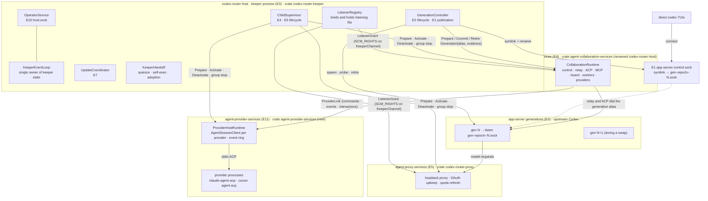
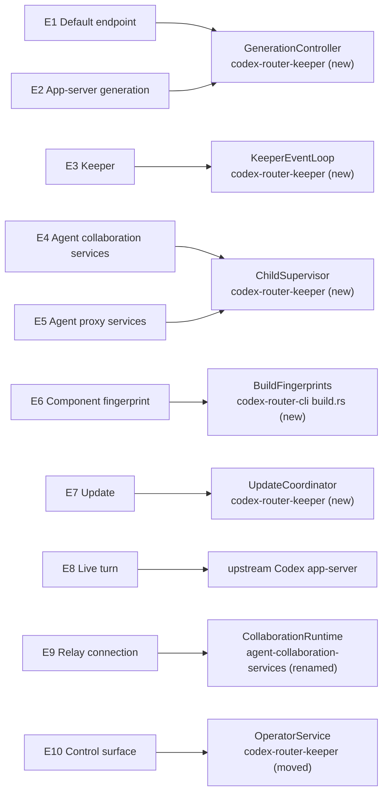
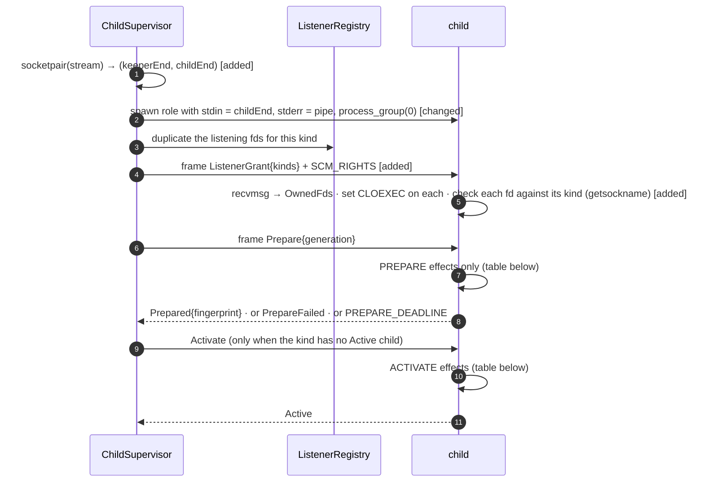
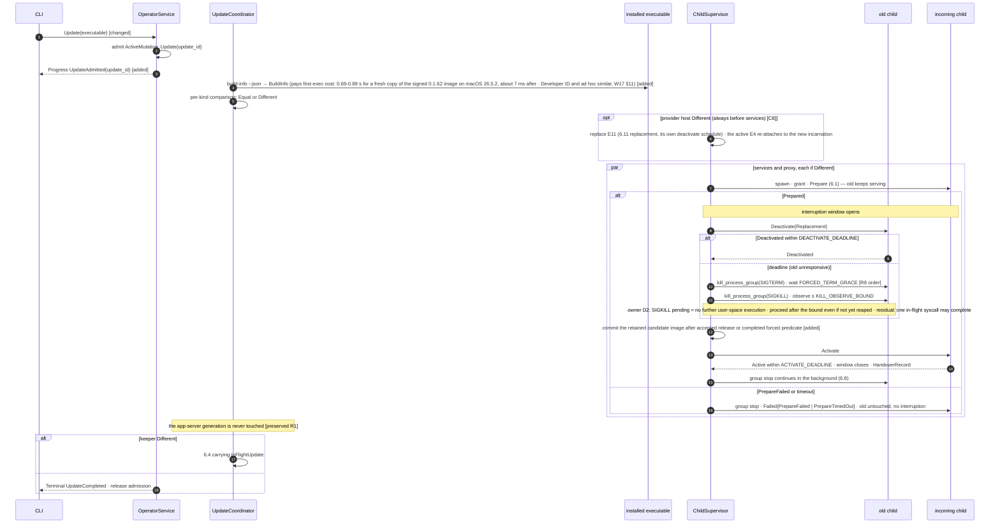
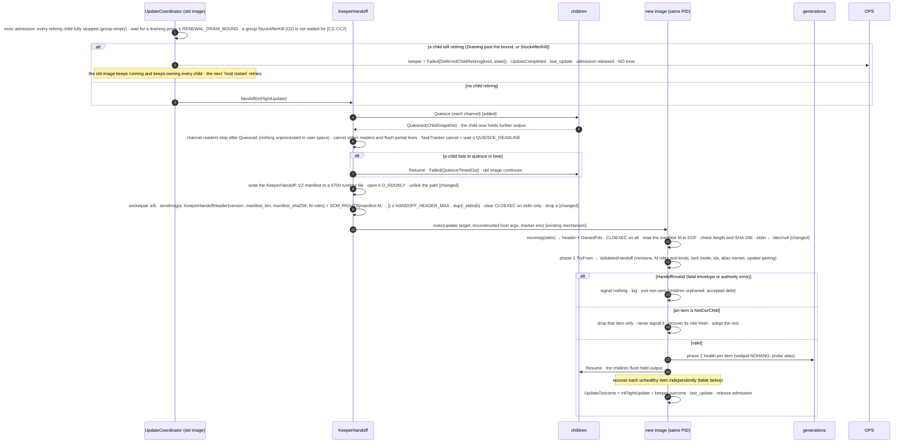
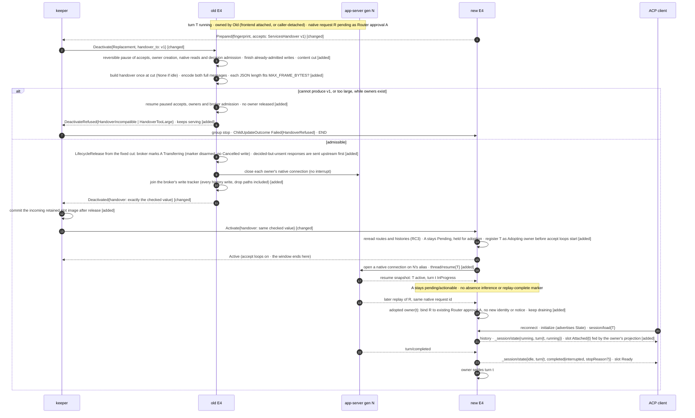
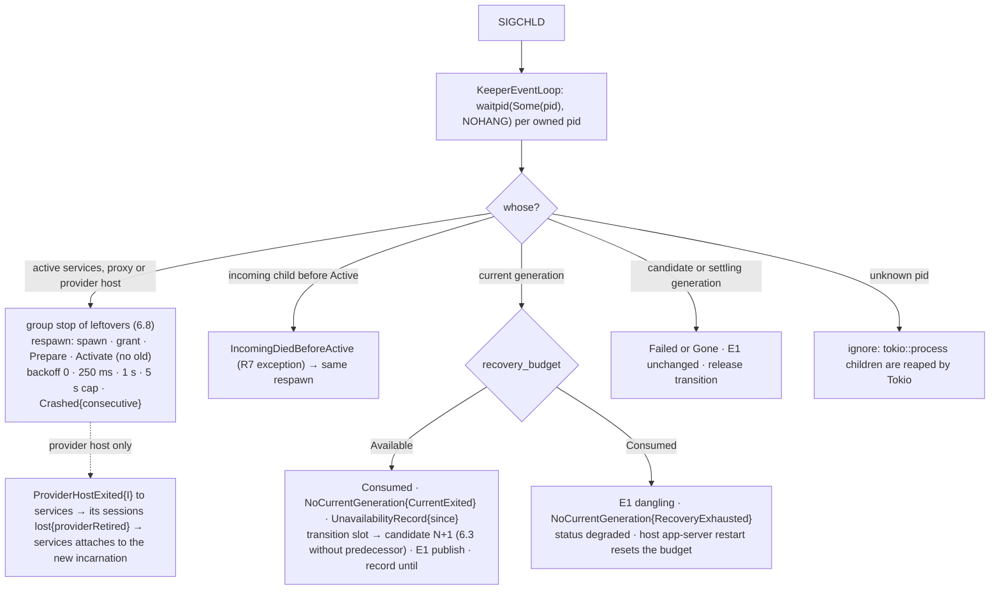
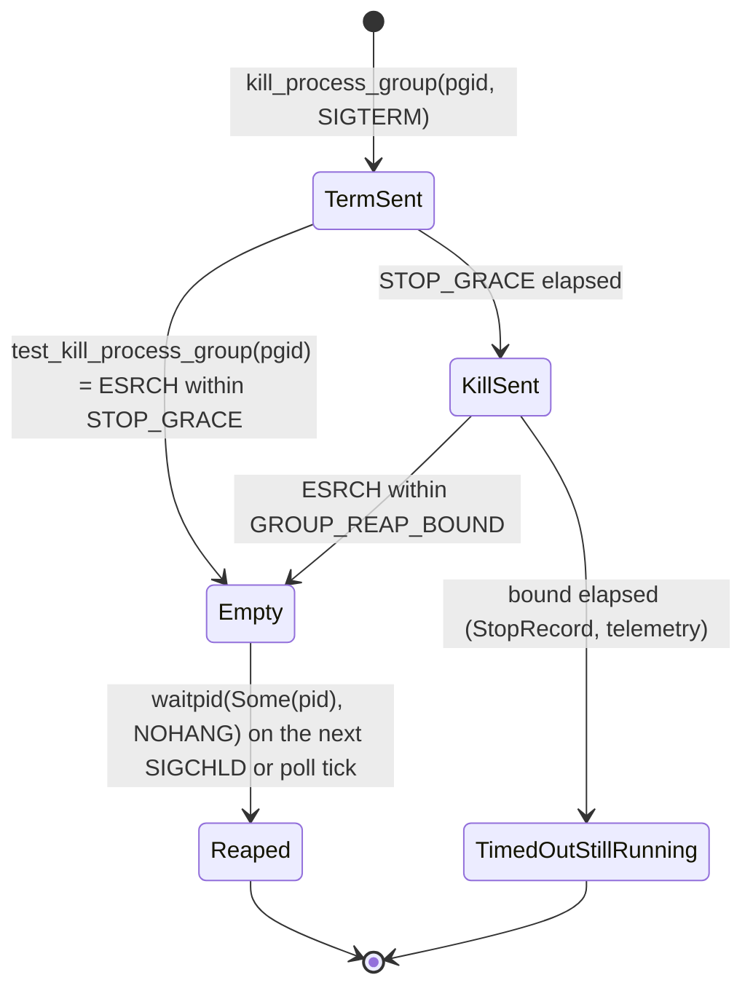
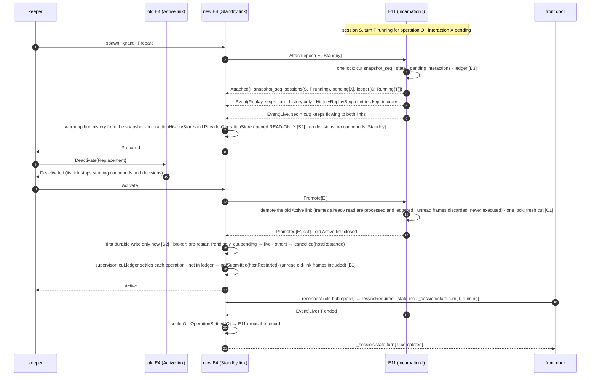

# Host controller — Program Design

Governing: [Requirements](requirements.md) U1–U9 → [Specification](specification.md)
E1–E11, R1–R19, V1–V12. This document is the How. Design prose uses the
Specification's entity terms. Code names appear in home and shape cells and in
code blocks. Current-code anchors are relative to the repository root at main
`9e947528` (re-anchored 2026-10-03 from `b8d76af` by Worker evidence W15–W19).
Upstream anchors are Codex `rust-v0.160.0`, the managed version at the
re-anchor (W18; unchanged from 0.157.1 except where noted). The cross-track contract
for R2 is the Router session protocol (RSP) `_session/state` element's `turn`
record, defined by the RSP track (coordination root `01a0dd96`).

## 1. The design in one picture



**What changes, in plain terms.**

- **One installed executable, three roles.**
  - `codex-router host` is the keeper.
  - `codex-router agent-collaboration-services` is the collaboration body, moved out of today's Host process.
  - `codex-router agent-proxy-services` replaces `codex-router serve`, with no alias.
  - `codex-router agent-provider-services` owns the external ACP provider processes
    (Claude, Cursor), so collaboration restarts don't end provider turns (owner P3).
- **The keeper binds every non-app-server listening endpoint once and never
  closes it.** Children receive duplicates over their KeeperChannel. During a
  replacement, connects wait in the kernel accept queue.
- **Children are replaced by prepare → deactivate → activate.** A new child
  prepares while the old one serves; the handover itself is two channel
  messages. A child that fails to prepare never touches the old one.
- **App-server generations are blue/green.**
  - Direct clients use E1, a symlink swapped atomically.
  - Services dial the exact generation alias it was told about, never E1.
  - The old generation stops after a 1 s settle, through the bounded group stop.
- **The keeper replaces itself by exec'ing in place.**
  - Its PID is unchanged, so every child stays its child.
  - Before exec, the keeper quiesces its child channels.
  - fds, child snapshots and any in-flight update cross the exec as one framed SCM_RIGHTS message on stdin.
- **Kept:**
  - collaboration behavior;
  - the Codex launch plan as it is projected today (#114, #116, #118): model-only routing profile, Router permission profiles, default `workspace-write` sandbox and direct network as root overrides, debug overrides after the shared ones (`app_server_launch.rs:22-37`, `router_profile_projection.rs:22-92`); schema export; the readiness probe;
  - the operator framing and single-mutation admission;
  - the lock file;
  - private socket rules;
  - the existing launch-argument reconstruction (`foreground_launch.rs:262-311`), which now also carries the owner Human identity and `--require-debug-isolation` for isolated launches (#94).
- **Removed:**
  - child ownership inside the services process (`lifecycle_owner`);
  - whole-process stop-then-exec (`host_replacement_activation.rs`, `update_activation.rs:149-176`);
  - `serve` binding its own port;
  - `host router restart`;
  - the v1 lock-only handoff.

**What we pay:**

- three processes;
- KeeperChannel;
- the exact quiesce and handoff code;
- two rename cutovers;
- rustix's `net` feature;
- a `cargo_metadata` build-dependency.

**What would justify more:** turns having to survive app-server restarts, or
frequent keeper changes.

## 2. Alternatives

| Choice | Selected | Rejected, and why |
|---|---|---|
| E1 realization | Symlink to the per-generation alias, swapped by `rename(2)`. Codex already publishes `--listen` as a symlink (upstream `unix_socket.rs:49-110`). | **Keeper relays E1 bytes:** a keeper exec would then drop direct TUIs (U1, D1). **Generations on the conventional path:** `AddrInUse`, and drop-guard contention (`unix_socket.rs:227-279,338-366`). |
| Services' dial target | The generation alias named in `GenerationCurrent` | **E1:** the admitted generation and schema would not match the peer across a swap (review G5). |
| Retirement | Swap, **1 s settle**, group stop (owner) | **Stop at swap:** in-flight handshakes fall back to embedded (upstream `tui/src/lib.rs:559-585`). **10 s settle:** upstream timeout, not handshake time; the owner rejected it. |
| Child replacement | Prepare, then deactivate the old, then activate the new | **Stop-then-spawn:** the outage includes startup. **Two active children:** double accept, and workers that assume one runtime (W8 §F). |
| fd transfer | Framed SCM_RIGHTS over Unix stream sockets (`rustix::net::sendmsg`/`recvmsg`, safe; rustix 1.1.4 `send_recv/msg.rs:143-181,712,789`) | Raw fd numbers need `unsafe` (`unsafe_code = "forbid"`). `command-fds` does not cover self-exec, and its macOS support is unverified. `listenfd` handles listeners only (W7). |
| Keeper placement | Separate process (K2), self-exec (D1) | In-process re-adoption on every update (K1) |
| Reaping | `rustix::process::waitpid(Some(pid), NOHANG)` per owned PID on SIGCHLD | `tokio::process::Child` cannot survive exec. `waitpid(-1)` would steal Tokio's statuses. |
| Where provider processes live (owner P3) | A fourth keeper child, `agent-provider-services`, runs `acp-client-runtime` and owns the provider processes. It is replaced only when its fingerprint changes. | **P1:** providers stay in services, so every services restart ends their turns (`lost`). **P2:** hand provider stdio and live ACP connection state from old services to new, which is delicate mid-stream JSON-RPC adoption. |
| Provider process boundary | `acp-client-runtime`'s own three ports (`AgentSessionClient` commands, `SessionEventSink`, `InteractionPort`; agreed with RSP main) carried by ProviderLink | **`SessionCommandPort` / hub:** that is RSP PR 4's front-door port in the collaboration layer, composed over supervisor and delivery (W9 §4-5). Splitting there would move the hub and broker out of collaboration. |
| Proxy auth during handover | Existing cross-process refresh safety: per-account file lock plus a durable `Refresh` claim before egress, for OpenAI and Claude alike (`codex-router-secret-store/src/account_credential_lock.rs:19-47`, unchanged; `codex-router-auth/src/resolver/credential_renewal.rs:414-773`, lock `:423-438`, claim then egress `:614-647`; provider dispatch `resolver.rs:308-355`). Upkeep and quota workers start only at Activate. Deactivate lets an in-flight renewal finish before any stop signal. | A new refresh lease: redundant with #83. Killing the old proxy mid-renewal: leaves a `Refresh` claim with no successor, so the account becomes `reauth_required` (`credential_renewal.rs:512-525`). `Login` claims belong to the CLI login commands (`credential_activation.rs:81-208`), not to E5, and recover differently (`credential_renewal.rs:527-545`). |
| Provider containment | Providers are their own groups (SDK `process_group(0)`, `acp_agent.rs:250-306`); they are services' graceful responsibility and exit on stdio EOF (Specification R8 scope) | Keeper-tracked provider pgids (`OwnedGroups`): not crash-atomic, and pgid reuse risks signalling the wrong group (review O1). Deleted. |

## 3. Where each entity lives



**Type conventions** (root `AGENTS.md`; the owner's Rust rules; `Cargo.toml`
`unsafe_code = "forbid"`; clippy relaxations for tests only):

- serde-tagged enums, camelCase on the wire, used consistently for both `serde` and `as_str()`;
- `human_phrase()` for CLI copy;
- newtypes with fallible constructors;
- wire types converted by `TryFrom` into domain types before any effect;
- `thiserror` errors, with rustix and IO errors mapped at the owning boundary;
- one Tokio runtime per process, owned by the role entrypoint;
- `Duration` for elapsed time, and `DateTime<Utc>` only for records;
- two-to-three-word module names.

| E | Semantic owner | Package or module home | Schema/type home | Shape at each boundary | Disposition | Convention |
|---|---|---|---|---|---|---|
| E1 Default endpoint | `GenerationController` | `codex-router-keeper` (new) | `codex_router_keeper_protocol::default_endpoint` (new) | A filesystem symlink `<CODEX_HOME>/app-server-control/app-server-control.sock` → relative `gen-<epoch8>-<N>.sock`. Clients see the unchanged Codex contract. | persisted (filesystem) | newtype |
| E2 App-server generation | `GenerationController` | `codex-router-keeper` (new); launch plan, schema export and probe moved from `codex-router-host::managed_app_server` to `codex-native-integration` (modified) | `codex_router_keeper_protocol::app_server_generation` (new) | Keeper → services: `PrepareGeneration{generation, alias, evidence}`, `CommitGeneration`, `AbandonGeneration`, `RetireGeneration`. Operator: `GenerationStatus`. Handoff: `HandoffGeneration`. | derived (memory; carried in handoff) | tagged enums, newtypes |
| E3 Keeper | `KeeperEventLoop` | `codex-router-keeper` (new); lock logic moved from `host_singleton_authority` | `codex_router_keeper_protocol::keeper_handoff` (new) | Self-exec: a `KeeperHandoff` frame with SCM_RIGHTS on stdin | derived | versioned tagged enum |
| E4 Agent collaboration services | `ChildSupervisor` (lifecycle); `CollaborationRuntime` (behavior) | `codex-router-keeper`; crate `agent-collaboration-services` (renamed from `codex-router-host`, minus lifecycle, operator and lock) | `codex_router_keeper_protocol::keeper_channel` (new) | KeeperChannel frames on the child's stdin socket | derived | tagged enums |
| E5 Agent proxy services | `ChildSupervisor` (lifecycle); `ProxyRoleRuntime` (behavior) | `codex-router-keeper`; crate `agent-proxy-services` (new role crate, mirroring E4 and E11): the role entrypoint plus the serve-owned modules that today live in `codex-router-cli` and so sit outside the proxy crate's closure: `credential_upkeep_worker.rs`, `quota/quota_background_refresh_worker.rs` and the `quota_refresh_service.rs` it drives, `credential_runtime.rs`, `token_reload_watcher.rs`, and the serve startup at `lib.rs:271-313`. `codex-router-cli` keeps its quota and account commands by depending on this crate. `codex-router-proxy` (modified: `LoopbackRouterRuntime::prepare`/`activate` replace `start`, `server.rs:600-612,646-766`, and `AsyncLoopbackServerRuntime::bind`, `:262-277`) | `codex_router_keeper_protocol::keeper_channel` | KeeperChannel | derived | tagged enums |
| E11 Agent provider services | `ChildSupervisor` (lifecycle); `ProviderHostRuntime` (behavior) | `codex-router-keeper`; crate `agent-provider-services` (new): hosts one `acp_client_runtime::AgentSessionClient<LinkInteractionPort>` per provider with a `RingEventSink`; provider configuration reading (`providers.json`) moves here from `codex-router-host::provider_configuration_file` | `provider_link_protocol` crate (new; payloads are `session-event-model` types) | ProviderLink: length-prefixed JSON frames on a keeper-granted Unix socket (`ListenerKind::ProviderLink`), accepted by E11 and dialed by E4 | derived (provider sessions live in provider processes; the ring is memory) | tagged enums; RSP serde types |
| E6 Component fingerprint (kinds: keeper, services, proxy, provider) | `BuildFingerprints` | `codex-router-cli` `build.rs` (new) | `codex_router_keeper_protocol::component_fingerprint` (new) | `codex-router build-info --json` → `BuildInfo`. Channel: `ChildToKeeper::Prepared{fingerprint}`. | derived (compiled in) | newtype |
| E7 Update | `UpdateCoordinator` | `codex-router-keeper` | `codex_router_keeper_protocol::component_update` (new) | Operator: `Update` → `UpdateOutcome`; `AwaitUpdateResult`. Handoff: `InFlightUpdate`. | derived | tagged enums |
| E8 Live turn | upstream app-server | upstream | upstream; RSP `_session/state.turn` (RSP codec in `session-event-model`, RSP PR 3 slice 3.5) | Native `thread/resume` (upstream `thread_processor.rs:4211-4255`); ACP `_session/state{turn:{turnId,status,stopReason?,reason?}}` | persisted by Codex (rollout) | upstream / RSP |
| E9 Relay connection | `NativeRelayListener`, `AcpChannelListener` | `collaboration-service` (modified: granted listeners, generation alias dial, `ServicesHandover` build and adoption); `codex-acp-adapter` (modified: `LifecycleRelease` for turn owners, adopted owners, the `Attached` slot, `LiveTurnAttachment`) | `agent_collaboration_services::services_handover` (new, versioned) | Unix WebSocket pass-through (existing); ACP JSON-RPC; `RoleHandover` body on KeeperChannel | derived | existing; versioned tagged enum |
| E10 Control surface | `OperatorService` | `codex-router-keeper` (moved from `codex-router-host::operator_*`) | `codex_router_keeper_protocol::operator_protocol` (moved, modified) | `host.sock` versioned JSON lines (existing framing, `operator_messages.rs:87-164`) | derived | tagged enums |

**Design-only concepts and what they serve:**

| Concept | Serves |
|---|---|
| `KeeperEpoch` | E2 identity |
| `ListenerRegistry` | R4, R7, R12 |
| KeeperChannel | R1–R3, R5, R7 |
| `KeeperHandoff`, `ChildSnapshot` | R11, R13, R14 |
| `UpdateId`, `KeeperRestartId` | R10, R14 |
| `LiveTurnAttachment`, turn owner and observer, `ServicesHandover`, `LifecycleRelease` | R2 |
| ProviderLink, `ProviderLinkClient`, `RingEventSink`, `LinkInteractionPort` | R16, R17, R18 |
| the generation transition slot | E2's at-most-two invariant, R5 |
| `codex-router-keeper-protocol` crate | E4, E5, E10: the single schema home for three processes and the CLI |

## 4. Shapes

All shapes live in `codex-router-keeper-protocol`.

```rust
// ---------- ids and validated values ----------
pub struct KeeperEpoch(Uuid);                  // fresh per keeper start; kept across self-exec
pub struct GenerationNumber(NonZeroU64);        // monotonic within one KeeperEpoch
pub struct GenerationId { pub epoch: KeeperEpoch, pub number: GenerationNumber }
pub struct ChildPid(rustix::process::Pid);      // ChildPid::new(i32) rejects <= 1
pub struct ChildPgid(rustix::process::Pid);     // group leader; ChildPgid::of_leader(ChildPid): equals pid by process_group(0)
pub struct UpdateId(Uuid);                      // UUIDv7, minted at admission
pub struct KeeperRestartId(Uuid);               // UUIDv7, minted at admission
pub struct ComponentFingerprint([u8; 32]);      // from_hex(&str) -> Result<_, FingerprintError>
pub struct DefaultEndpointPath(PathBuf);        // absolute; file name app-server-control.sock
pub struct GenerationAliasPath(PathBuf);        // sibling of E1; file name gen-<epoch8>-<N>.sock; built only from GenerationId

pub enum ComponentKind { Keeper, AgentCollaborationServices, AgentProxyServices, AgentProviderServices }
pub struct ComponentFingerprints {
    pub keeper: ComponentFingerprint,
    pub agent_collaboration_services: ComponentFingerprint,
    pub agent_proxy_services: ComponentFingerprint,
    pub agent_provider_services: ComponentFingerprint,
}
pub struct BuildInfo { pub package_version: semver::Version, pub fingerprints: ComponentFingerprints }

// ---------- generations ----------
#[serde(tag = "state", rename_all = "camelCase")]
pub enum GenerationState { Starting, Current, Settling, Retiring, Gone, Failed { reason: GenerationFailure } }
// Public status maps Settling and Retiring to the Specification's `retiring`.

pub enum GenerationFailure {
    SpawnFailed, ExitedBeforeReady, ReadinessTimedOut, VersionMismatch,
    SchemaExportFailed, AliasOccupied, ServicesDidNotAdopt, PublicationFailed,
}
pub struct GenerationEvidence {                 // reused publication boundary (collaboration_runtime.rs:719-750,834-865)
    pub executable: ExecutableIdentity,         // existing codex-native-integration type
    pub schema: GenerationSchemaAvailability,
}
#[serde(tag = "availability", rename_all = "camelCase")]
pub enum GenerationSchemaAvailability {
    Ready {
        schema_digest: NativeSchemaDigest,      // existing
        schema_bundle_dir: PathBuf,             // keeper-private 0700 dir, content-addressed by digest
    },
    Unavailable { reason: SchemaUnavailableReason }, // real generation/alias/executable; raw relay only
}
pub enum SchemaUnavailableReason { ExportFailed }
// TryFrom validates Ready's executable/digest/bundle together. Unavailable never manufactures a digest or bundle.
// Every GenerationCurrentPayload and HandoffGeneration carries this same schema state.

// ---------- KeeperChannel frames ----------
// Wire: u32 big-endian length, then that many bytes of JSON. A frame that carries fds is written
// with one sendmsg whose iov starts at the length prefix; the receiver reads every length prefix
// with recvmsg and ancillary space for MAX_FRAME_FDS, so rights bind to exactly one frame.
// Rejected: MSG_CTRUNC, rights on a frame kind that carries none, fd count != declared, length > MAX_FRAME_BYTES.

#[serde(tag = "type", rename_all = "camelCase")]
pub enum KeeperToChild {
    ListenerGrant { listeners: Vec<ListenerKind> }, // rights in list order
    Prepare { generation: Option<GenerationCurrentPayload>, mode: PrepareMode }, // services: generation always Some once one exists
    Activate { handover: Option<RoleHandover> },     // services: the outgoing child's ServicesHandover, relayed unread (6.5)
    Deactivate { reason: DeactivateReason, handover_to: Option<RoleHandoverVersion> }, // services: the incoming child's accepted version
    PrepareGeneration(GenerationCurrentPayload),     // services: stage and validate; admission unchanged (H5)
    CommitGeneration { generation: GenerationId },   // services: new admissions → generation; earlier admissions stay live
    AbandonGeneration { generation: GenerationId },  // services: drop the staged generation
    RetireGeneration { generation: GenerationId },   // services: cancel only that generation's admissions
    NoCurrentGeneration { reason: NoGenerationReason }, // services only
    ProviderHostExited { incarnation: ProviderHostIncarnation }, // services only: authoritative E11 loss (H1)
    Quiesce,
    Resume,
}
pub struct GenerationCurrentPayload {
    pub generation: GenerationId,
    pub alias: GenerationAliasPath,
    pub evidence: GenerationEvidence,
    pub server_display_name: Option<ServerDisplayName>, // preserves the existing optional validated readiness value (managed_app_server.rs:19-76,275-301), consumed by collaboration identity (collaboration_lifecycle.rs:25-57)
}
// Fresh: no other child of this kind is alive (fresh keeper start, crash respawn). Prepare may run the role's
//   bootstrap creators and one-time writes (6.1): credential key/marker/token/affinity creation, service identity
//   creation, proxy pooled-credential migration (today Host startup, startup_convergence.rs:23-31).
// Replacement: an Active child of this kind is serving. Prepare is non-mutating and creates nothing (6.1); it is
//   told the active child's reported degradations so it may match, never exceed, them.
pub enum PrepareMode { Fresh, Replacement { active_degraded: Vec<(ChildComponent, ChildDegradation)> } }
// Opaque to the keeper: a role-owned, versioned body passed from the outgoing child to the incoming one.
// serde_json::Value is right here because the keeper does not own this schema; agent-collaboration-services
// parses it with TryFrom into its own ServicesHandover::V1. The reversible content cut and version/size
// admission precede release (6.5). No owners at the cut means handover: None in both messages, with no
// versioned body to decode. A present body that fails validation is an invalid frame: the channel is broken
// and the existing child-replacement path applies (9), not an Unadoptable turn terminal.
pub struct RoleHandover { pub role: ComponentKind, pub version: RoleHandoverVersion, pub body: serde_json::Value }
// Freeze owner creation, native-event consumption and broker decision admission at one reversible cut;
// finish already-admitted registration/decision writes, then build the Option<RoleHandover> once. Before
// release, BOTH complete JSON messages (Deactivated{handover} and Activate{handover}) must pass the
// receiver's exact length predicate, including role/version and outer-envelope overhead. Release sends
// exactly that checked value; neither sender nor keeper rebuilds or mutates it. MAX_FRAME_BYTES bounds
// the JSON message, as above; checking the body alone or estimating overhead is insufficient.
pub struct RoleHandoverVersion(NonZeroU32);
pub enum DeactivateRefusal { HandoverIncompatible { produced: RoleHandoverVersion, wanted: RoleHandoverVersion }, HandoverTooLarge }
pub enum ListenerKind { CollaborationControl, NativeRelay, AcpChannel, McpHttp, ProxyHttp, RouterSessionFace { endpoint: EndpointId }, ProviderLink }
// RouterSessionFace = RSP app-server face socket router-sessions/<endpoint-id>.sock (e.g. claude-local.sock), bound today
// only when the provider has a model catalog AND the owner Human identity resolved (collaboration_runtime.rs:554-603);
// EndpointId is the existing collaboration endpoint id type
pub enum DeactivateReason { Replacement, KeeperFullRestart, Shutdown }
pub enum NoGenerationReason { StartupPending, CurrentExited, RecoveryExhausted }

#[serde(tag = "type", rename_all = "camelCase")]
pub enum ChildToKeeper {
    Prepared { fingerprint: ComponentFingerprint, accepts_handover: Option<RoleHandoverVersion> }, // services: exactly one accepted version
    PrepareFailed { reason: PrepareFailure },
    Active,
    Deactivated { handover: Option<RoleHandover> }, // services: released turn owners (6.5); None for other roles
    Drained,                                        // proxy: in-flight credential renewals finished after Deactivated
    GenerationPrepared { generation: GenerationId },
    GenerationCommitted { generation: GenerationId },
    GenerationRejected { generation: GenerationId, reason: EvidenceRejection },
    Quiesced(ChildSnapshot),                        // the child then holds output until Resume
    Degraded { component: ChildComponent, reason: ChildDegradation },
    Recovered { component: ChildComponent },
    DeactivateRefused { reason: DeactivateRefusal }, // services: handover inadmissible; the child keeps serving (6.5)
    RequestListener { kind: ListenerKind },         // Prepare phase only; the keeper binds once, keeps it, and replies with ListenerGrant
}
pub struct ChildSnapshot {
    pub phase: ChildPhase,                          // Prepared | Active | Deactivating
    pub fingerprint: ComponentFingerprint,
    pub committed_generation: Option<GenerationId>,
    pub degraded: Vec<(ChildComponent, ChildDegradation)>,
}
pub enum ChildPhase { Prepared, Active, Deactivating }
pub enum PrepareFailure {
    StoreOpenFailed,
    StoreSchemaNewerThanImage { store: StoreKind },  // the store has migrations this image doesn't know: never downgrade
    StoreMigrationHistoryInvalid { store: StoreKind, reason: MigrationHistoryDefect },
    SecretStoreUnavailable,                          // Replacement requires the encrypted store Ready; Fresh tolerates KeyUnavailable as today
    ListenerGrantInvalid, SchemaEvidenceRejected, FrameInvalid,
}
pub enum StoreKind { ProjectBoard, Automation, ProviderOperations, RouterState }
pub enum MigrationHistoryDefect { DirtyMigration, ChecksumMismatch, InvalidAppliedOrder, UnknownAppliedMigration }
// Store-owned, non-migrating preparation result; the role records this before Activate.
pub enum PreparedStoreSchema { Current, Pending { migrations: Vec<MigrationVersion> } }
pub struct MigrationVersion(NonZeroI64); // validated against this image's ordered migration set
pub enum EvidenceRejection { ExecutableMismatch, DigestMismatch, BundleUnreadable }
pub enum ChildComponent {                       // role-neutral (was ServicesComponent)
    Board, Delivery, Automation, Schedules, Mcp, AcpChannel, NativeRelay, Providers, CodexTurnAdoption, // E4
    PooledCredentials,                                                                                  // E5
}
pub enum ChildDegradation {
    StoreUnavailable, SchemaMismatch, SchemaUnavailable, NoCurrentGeneration, ProviderUnavailable,
    AdoptionPending { turns: u32 },             // 6.5: handed-over turns not yet adopted
    CredentialStoreUnavailable,                 // E5 serving with KeyUnavailable (encrypted_credential_store.rs:31-40)
}

// ---------- updates (role-specific outcomes) ----------
#[serde(tag = "outcome", rename_all = "camelCase")]
pub enum KeeperUpdateOutcome {
    Unchanged,
    Replaced,
    ReplacedWithNewGeneration { generation: GenerationId }, // only once N+1 is Current
    Failed { reason: KeeperUpdateFailure },
}
pub enum KeeperUpdateFailure {
    BuildInfoUnreadable, QuiesceTimedOut, ExecFailed,
    DeferredChildRetiring { kind: ComponentKind, state: RetiringState }, // CC2: exec refused while an old child is still retiring
    AdoptionFallbackFailed { reason: GenerationFailure },
}

#[serde(tag = "outcome", rename_all = "camelCase")]
pub enum ChildUpdateOutcome {
    Unchanged,
    Replaced,
    Failed { reason: ChildUpdateFailure },
}
pub enum ChildUpdateFailure { PrepareFailed(PrepareFailure), PrepareTimedOut, ActivationFailed, AdoptionLost, HandoverRefused(DeactivateRefusal) }

pub struct UpdateOutcome {
    pub update_id: UpdateId,
    pub keeper: KeeperUpdateOutcome,
    pub agent_collaboration_services: ChildUpdateOutcome,
    pub agent_proxy_services: ChildUpdateOutcome,
    pub agent_provider_services: ChildUpdateOutcome,
}

// ---------- operator surface (E10); framing unchanged; progress separate from terminal ----------
#[serde(tag = "request", rename_all = "camelCase")]
pub enum OperatorRequest {
    Status,
    Update { executable: InstalledExecutablePath },
    AwaitUpdateResult { update_id: UpdateId },
    RestartAppServer,
    UpdateCodex,
    RestartProxy,
    RestartKeeper,
    RestartProvider,
    AwaitKeeperRestart { restart_id: KeeperRestartId },
}
#[serde(tag = "frame", rename_all = "camelCase")]
pub enum OperatorFrame { Progress(OperatorProgress), Terminal(OperatorTerminal) }

#[serde(tag = "progress", rename_all = "camelCase")]
pub enum OperatorProgress {
    UpdateAdmitted { update_id: UpdateId },
    KeeperReExecuting { update_id: UpdateId },
    KeeperRestarting { restart_id: KeeperRestartId },
}

#[serde(tag = "terminal", rename_all = "camelCase")]
pub enum OperatorTerminal {
    Status(KeeperStatus),
    UpdateCompleted(UpdateOutcome),
    UpdateResultUnknown { update_id: UpdateId },
    GenerationRestarted { generation: GenerationId, services_commit: ServicesCommit, remote_control: RemoteControlCondition }, // C2: the current generation's condition AS OF this terminal (typically Disabled while the fence is pending); the later bounded enable updates KeeperStatus, not this reply
    GenerationRestartFailed { reason: GenerationFailure, current: Option<GenerationId> },
    CodexUpdated { generation: GenerationId, from_version: String, to_version: String, services_commit: ServicesCommit, remote_control: RemoteControlCondition }, // same as-of-terminal meaning (C2)
    CodexUnchanged { version: String },
    CodexUpdateFailed { stage: CodexUpdateStage, reason: CodexUpdateFailure, current: Option<GenerationId> }, // existing update outcomes (codex_update_preparation.rs:122-208)
    ProxyRestarted,
    ProxyRestartFailed { reason: ChildUpdateFailure },
    ProviderRestarted,
    ProviderRestartFailed { reason: ChildUpdateFailure },
    KeeperRestarted { epoch: KeeperEpoch, readiness: HostReadiness }, // existing Ready | LocalReadyRemoteDegraded
    KeeperRestartResultUnknown { restart_id: KeeperRestartId },
    Busy { active: ActiveMutation },
    Failed { reason: OperatorFailure },
}
pub enum CodexUpdateStage { Preparation, Activation }
pub enum ServicesCommit { Committed, ServicesReplaced, ServicesReplacementFailed { reason: ChildUpdateFailure } } // C4: after publication there is no rollback

#[serde(tag = "kind", rename_all = "camelCase")]
pub enum ActiveMutation {
    Update { update_id: UpdateId },
    GenerationTransition { candidate: GenerationId }, // held until the predecessor's group is empty
    CodexUpdate,
    ProxyRestart,
    ProviderRestart,
    KeeperRestart { restart_id: KeeperRestartId },
}

pub struct KeeperStatus {
    pub keeper: KeeperSummary,           // epoch, fingerprint, image identity, started_at: DateTime<Utc>
    pub readiness: HostReadiness,        // existing classification
    pub remote_control: RemoteControlCondition, // existing (lifecycle_state.rs:195-228)
    pub generation: GenerationStatus,
    pub agent_collaboration_services: ChildStatus,
    pub agent_proxy_services: ChildStatus,
    pub agent_provider_services: ChildStatus,
    pub active_mutation: Option<ActiveMutation>,
    pub last_update: Option<UpdateOutcome>,
    pub last_stops: Vec<StopRecord>,     // bounded ring, newest first (R8 observability)
    pub last_handovers: Vec<HandoverRecord>, // bounded ring (R7 observability)
    pub desktop_reconcile: Option<DesktopReconcile>, // R19: NotRunning | StartedAfterServer | Relaunched | QuitRefused | ReopenFailed | Inconclusive{reason} | SkippedIsolated
}
pub struct GenerationStatus {
    pub current: Option<GenerationSummary>,
    pub transition: Option<GenerationSummary>,
    pub last_unavailability: Option<UnavailabilityRecord>, // R4 crash window: since, until, reason
    pub recovery_budget: RecoveryBudget,                    // existing Available | Consumed
}
pub struct StopRecord { pub subject: StopSubject, pub result: GroupStopResult, pub at: DateTime<Utc> }
pub enum RetiringState { Draining, StuckAfterKill }
pub enum GroupStopResult { Graceful, Killed, TimedOutStillRunning, DrainOverrun }
// DrainOverrun: a responsive, deactivated proxy still settling a claimed renewal past RENEWAL_DRAIN_BOUND; it is never signalled (H4)
pub struct HandoverRecord { pub kind: ComponentKind, pub interruption: Duration, pub outcome: HandoverOutcome, pub at: DateTime<Utc> }
pub enum HandoverOutcome { WithinBudget, ExceededBudget, IncomingDiedBeforeActive } // the last is the owner-authorized R7 exception
pub enum ChildState { Starting, Prepared, Active, Deactivating, Stopping, Crashed { consecutive: u32, last_at: DateTime<Utc>, blocked: Option<RespawnBlock> } }
pub enum RespawnBlock { ImageUnavailable } // the retained slot image is missing or changed (6.7)
pub struct ChildStatus {
    pub state: ChildState,
    pub pid: Option<ChildPid>,
    pub fingerprint: Option<ComponentFingerprint>,
    pub degraded: Vec<(ChildComponent, ChildDegradation)>,
}

// ---------- self-exec handoff ----------
#[serde(tag = "version")]
pub enum KeeperHandoff {
    #[serde(rename = "2")]
    V2 {
        epoch: KeeperEpoch,
        launch_path: InstalledExecutablePath,     // default E7 target; carried, never re-derived (6.7)
        next_generation: GenerationNumber,
        recovery_budget: RecoveryBudget,
        current_generation: Option<HandoffGeneration>,
        settling_generation: Option<HandoffGeneration>,
        agent_collaboration_services: Option<HandoffChild>,
        agent_proxy_services: Option<HandoffChild>,
        agent_provider_services: Option<HandoffChild>,
        active_mutation: Option<ActiveMutation>,
        in_flight_update: Option<InFlightUpdate>, // required iff active_mutation is Update
        settle_remaining: Option<Duration>,       // monotonic remainder, never a wall-clock deadline
    },
}
// Sent alone on the pre-exec socketpair with every fd as SCM_RIGHTS; ≤ HANDOFF_HEADER_MAX including ancillary data.
pub struct KeeperHandoffHeader {
    pub version: HandoffVersion,                  // "2"
    pub manifest_len: u32,                        // ≤ MAX_FRAME_BYTES
    pub manifest_sha256: [u8; 32],
    pub fds: Vec<HandoffFdRole>,                  // rights order; exactly one Manifest
}
pub enum HandoffFdRole {
    Manifest,                                     // unlinked O_RDONLY file holding the KeeperHandoff::V2 JSON
    SingletonLock,
    OperatorListener,
    Listener { kind: ListenerKind },
    ChildChannel { kind: ComponentKind },
    ChildStderr { of: StderrOwner },
}
pub struct HandoffGeneration { pub id: GenerationId, pub pid: ChildPid, pub alias: GenerationAliasPath, pub evidence: GenerationEvidence }
pub struct HandoffChild { pub pid: ChildPid, pub snapshot: ChildSnapshot, pub held_output: Vec<ChildToKeeper>, pub image: SlotImage }
pub struct SlotImage { pub retained_path: PathBuf, pub file_sha256: [u8; 32], pub device: u64, pub inode: u64 } // the keeper-retained file a slot's children spawn from (6.7)
pub struct InFlightUpdate {
    pub update_id: UpdateId,
    pub target: BuildInfo,
    pub agent_collaboration_services: ChildUpdateOutcome,
    pub agent_proxy_services: ChildUpdateOutcome,
    pub agent_provider_services: ChildUpdateOutcome,
}

// Phase 1 domain type: authority validated; nothing signalled yet.
pub struct ValidatedHandoff { /* only from TryFrom<(KeeperHandoffHeader, KeeperHandoff, Vec<OwnedFd>)>: rights match header roles, manifest matches header digest */ }

#[derive(thiserror::Error)]
pub enum HandoffInvalid {                         // phase 1, FATAL envelope/authority errors: the new image signals nothing and exits
    #[error("unsupported handoff version")] UnsupportedVersion,
    #[error("fd roles do not match the received rights")] FdManifestMismatch,
    #[error("handoff manifest length or digest does not match its header")] ManifestMismatch,
    #[error("an fd has the wrong socket type or address for its role")] FdKindMismatch,
    #[error("singleton lock inode or device changed")] LockMismatch,
    #[error("identity or relationship invalid: {0}")] IdentityInvalid(IdentityDefect),
}
pub enum IdentityDefect {
    NonPositivePid, NextGenerationNotAfterCurrent, EpochMismatch,
    AliasNotOurs, OutcomeWithoutUpdate, UpdateWithoutOutcome,
}

// Phase 2: per-item health, each item independent.
// Phase 1 establishes ownership for every carried pid before any health check:
//   waitpid(Some(pid), NOHANG) = Ok(None) and getpgid(pid) = recorded pgid → owned, running
//   Ok(Some(status)) → owned, exited (reaped now)
//   Err(ECHILD) or pgid mismatch → ItemOwnership::NotOurChild: that item alone is dropped; its pid/pgid is NEVER signalled;
//     its role is recovered by a fresh instance (generation: 6.7 without predecessor; child: fresh spawn). Other items stay adopted.
//   Only HandoffInvalid (version, fd manifest/kind, lock, envelope relationships) is fatal.
// Phase 1 per-item ownership result, carried into phase 2 (never re-waited):
pub enum ItemOwnership {
    OwnedRunning,                    // waitpid NOHANG = Ok(None) and getpgid(pid) == recorded pgid
    OwnedExited(WaitStatus),         // Ok(Some(status)); the status is consumed here and carried forward
    NotOurChild,                     // ECHILD or pgid mismatch: item-local disqualification, NOT fatal (C7)
}
pub enum GenerationHealth { Healthy, Unverified, Exited }
pub enum ChildHealth { Healthy, ChannelBroken, Exited }
```

ProviderLink shapes live in the new `provider-link-protocol` crate. Every payload
type is RSP's, consumed and never forked:

- from `session-event-model`: `SessionEvent`, `SessionSettings`,
  `CapabilityReport`, `ApprovalRequest`, `QuestionRequest`, `QuestionResponse`,
  `PromptContent`, `InputId`, `TurnId`, `TurnOutcome`;
- `acp-client-runtime`'s results and outcomes are not serde types today. The link
  mirrors them (`LinkApprovalOutcome`, `AgentSessionCommandResult`,
  `LinkCommandError`, `LinkRefusalReason`) with exhaustive conversions that live
  only in the two endpoint crates. `provider-link-protocol` stays free of
  `acp-client-runtime` (C2).

Names follow RSP main's review (N1–N3).

```rust
// ---------- ProviderLink (E4 ⇄ E11): length-prefixed JSON frames, no fds ----------
pub struct ProviderHostIncarnation(Uuid); // minted at each E11 start; the only authority for "same provider host"
pub struct LinkEpoch(Uuid);               // minted by E4 per link connection
pub struct LinkRequestId(u64);            // per link connection, monotonic
pub struct InteractionId(Uuid);           // minted by E11; link-internal key, stable across E4 restarts
pub struct EventSeq(NonZeroU64);          // per provider, monotonic for one E11 incarnation
pub struct ProviderId(String);            // validated, from providers.json

pub enum LinkRole { Standby, Active }     // one Active link; any number of Standby links (≤ 2 in practice)

#[serde(tag = "type", rename_all = "camelCase")]
pub enum ServicesToProvider {
    Attach { epoch: LinkEpoch, role: LinkRole },        // first frame; Standby during E4 Prepare
    Promote { epoch: LinkEpoch },                       // Standby → Active; the previous Active link is demoted and closed
    Command { request_id: LinkRequestId, provider: ProviderId, command: AgentSessionCommand }, // Active only
    Query { request_id: LinkRequestId, provider: ProviderId, query: AgentSessionQuery },       // Active only; never ledgered
    InteractionDecision { interaction_id: InteractionId, decision: LinkDecision },              // Active only; idempotent
    OperationSettled { operation: ProviderOperationRef },  // E4 has durably settled it; E11 may drop the ledger record
}

// The link covers every AgentSessionClient method E4 calls today (acp-client-runtime
// agent_session_client/provider_client_operations.rs:43-449; approval_turn_cancellation.rs:105-112;
// provider_approval_dispatch.rs:15). Completeness is enforced by the forbidden edge
// agent-collaboration-services → acp-client-runtime: a call the link doesn't carry doesn't compile.
#[serde(tag = "command", rename_all = "camelCase")]
pub enum AgentSessionCommand {            // mutations
    Create { operation: ProviderOperationRef, cwd: WorkingDirectory, settings: SessionSettings },
    Load { operation: ProviderOperationRef, session_id: String, cwd: WorkingDirectory },
    Resume { operation: ProviderOperationRef, session_id: String, cwd: WorkingDirectory },
    Close { operation: ProviderOperationRef, session_id: String },
    SetSetting { session_id: String, setting: SessionSettingChange },
    AcceptSessionSettings { session_id: String },   // accept_session_settings (:80); not operation-bearing, like SetSetting
    Prompt { operation: ProviderOperationRef, session_id: String, input_id: InputId, content: PromptContent },
    Steer { operation: ProviderOperationRef, session_id: String, input_id: InputId, content: PromptContent },
    Cancel { session_id: String, target: ProviderOperationRef }, // targeted, as today (external_provider_supervisor.rs:978-1024); sent only after the broker's cancelling mark (RSP R1)
}

// Reads answered from E11's live state at the time of the query. E4 never caches them across a link:
// presence and LoadedOnly rechecks (provider_acp_session_loading.rs:93-125;
// provider_acp_delivery_route/session_delivery_route.rs:37-84) need the provider's current answer.
#[serde(tag = "query", rename_all = "camelCase")]
pub enum AgentSessionQuery {
    ListSessions { cwd: Option<WorkingDirectory> },            // list_sessions (:295)
    SessionActivity { session_id: String },                    // session_activity (:404)
    ActivePromptOperation { session_id: String },              // active_prompt_operation (:420)
    WaitSessionIdle { session_id: String, within: Duration },  // wait_session_idle (:435); bounded by the caller
    CapabilityReport { session_id: String },                   // capability_report (:47)
    SettingsCatalog { session_id: Option<String> },            // settings_catalog / last_settings_catalog (:58,69)
    SettingsUnresolved { session_id: String },                 // settings_unresolved (:73)
    ActiveApprovalOperation { session_id: String },            // active_approval_operation (:184)
    PermissionObservation,                                     // permission_observation (:142)
    ApprovalRefusalWarnings,                                   // approval_refusal_warnings (:176)
}
// Static per-provider facts travel in ProviderSnapshot, not as queries: admission() (:43) and the endpoint id
// (set_endpoint_id, :171). retirement() (:167) is ProviderRetired. Test-only methods (take_test_tool_calls,
// abort_owner_for_test) are not carried.

#[serde(tag = "decision", rename_all = "camelCase")]
pub enum LinkDecision { Approval(LinkApprovalOutcome), Question(QuestionResponse) }

#[serde(tag = "type", rename_all = "camelCase")]
pub enum ProviderToServices {
    Attached(AttachSnapshot),               // cut atomically at snapshot_seq (B3)
    Promoted { epoch: LinkEpoch, cut: AttachSnapshot }, // fresh authoritative cut taken AFTER the old Active link is demoted (C1, S1)
    CommandResult { request_id: LinkRequestId, result: AgentSessionCommandResult },
    QueryResult { request_id: LinkRequestId, result: AgentSessionQueryResult }, // one serde mirror variant per AgentSessionQuery, same exhaustive-conversion rule (C2)
    Event(LinkEvent),                       // one ordered FIFO per provider
    InteractionRequest(LinkInteractionRequest),
    InteractionWithdrawn { interaction_id: InteractionId, reason: InteractionWithdrawal },
    InteractionDecisionResult { interaction_id: InteractionId, result: DecisionApplication }, // B4
    RefusalRecorded { provider: ProviderId, session_id: String, operation: ProviderOperationRef, offer: LinkRefusedApprovalOffer }, // N3: the WHOLE refused offer (CC1)
    CancelAll { provider: ProviderId, session_id: String, reason: CancelAllReason },
    ModelCatalog { provider: ProviderId, catalog: ProviderModelCatalog },
    ProviderRetired { provider: ProviderId, reason: ProviderRetirement }, // also covers cancel_retired (N3)
}

pub struct AttachSnapshot {
    pub incarnation: ProviderHostIncarnation,
    pub snapshot_seq: BTreeMap<ProviderId, EventSeq>,  // per-provider cut
    pub providers: Vec<ProviderSnapshot>,
    pub pending_interactions: Vec<LinkInteractionRequest>, // COMPLETE at the cut: the reconciliation boundary (H1)
    pub operations: Vec<OperationRecord>,               // the ledger at the cut (B1)
}
pub struct ProviderSnapshot {
    pub provider: ProviderId,
    pub endpoint: EndpointId,                           // set_endpoint_id today; E11 derives it from providers.json
    pub admission: LinkProviderAdmission,               // mirror of ExternalProviderAdmission (provider_client_operations.rs:43)
    pub state: ProviderRuntimeState,                    // Ready | Retired{reason}
    pub sessions: Vec<SessionSnapshot>,
}
pub struct SessionSnapshot {
    pub session_id: String,
    pub settings: SessionSettings,
    pub capabilities: CapabilityReport,
    pub state: SessionStateSummary,                     // RSP state incl. running turn id
    pub history: HistoryAvailability,                   // Complete | TruncatedBefore{seq}, per session (leading gap)
}
pub struct OperationRecord {
    pub operation: ProviderOperationRef,
    pub state: OperationState,
}
#[serde(tag = "state", rename_all = "camelCase")]
pub enum OperationState {
    Accepted,                                           // recorded before execution; the effect may be in progress
    Running { turn_id: TurnId },
    Ended { turn_id: TurnId, outcome: TurnOutcome },
    Completed { result: AgentSessionCommandResult },    // non-turn commands (Create, Load, Resume, Close)
    Rejected { error: LinkCommandError },
}
#[serde(tag = "entry", rename_all = "camelCase")]
pub enum LinkEvent {
    HistoryReplayBegin { provider: ProviderId, seq: EventSeq, session_id: String }, // SessionEventSink::begin_history_replay (RSP R13)
    Session { provider: ProviderId, seq: EventSeq, session_id: String, event: SessionEvent, phase: EventPhase },
}
pub enum EventPhase { Replay, Live }                    // Replay: seq <= snapshot_seq, history only, never state
pub struct LinkInteractionRequest {                     // N2 (not session_event_model::PendingInteraction)
    pub interaction_id: InteractionId,
    pub provider: ProviderId,
    pub session_id: String,
    pub turn_id: TurnId,                                // RSP R1: late requests for a cancelling turn are recorded cancelled, never shown
    pub operation: ProviderOperationRef,
    pub request: LinkRequestedInteraction,              // Approval(ApprovalRequest) | Question(QuestionRequest); front-door ids are RSP request_id
}
pub enum DecisionApplication { Applied, AlreadySettled { reason: InteractionWithdrawal } }
pub enum InteractionWithdrawal { TurnCancelled, AgentCancelled, ProviderRetired }
pub enum ProviderRetirement { StdoutEof, ProcessExited, InitializeFailed }
// C2: acp-client-runtime's results are not serde wire types (provider_client_operations.rs:73-78,173-229,279-315;
// provider_client_contract.rs:101-182; provider_session_actor.rs:26-34; interaction_port.rs:11-30). The link defines
// serde MIRRORS with exhaustive From/TryFrom conversions in both endpoint crates, plus a round-trip test per variant:
#[serde(tag = "result", rename_all = "camelCase")]
pub enum AgentSessionCommandResult {
    Created { session_id: String, settings: SessionSettings, capabilities: CapabilityReport }, // ← ExternalProviderCreatedSession
    Loaded { settings: SessionSettings, capabilities: CapabilityReport },
    Resumed { settings: SessionSettings, capabilities: CapabilityReport },
    Closed,
    SettingApplied { effective: SessionSettings },
    PromptAccepted { turn_id: TurnId },                    // turn progress arrives as Events; the end is in the ledger
    Steered(LinkSteeringOutcome),                          // one-to-one mirror of ProviderSteeringOutcome
    CancelRequested { matched: bool },                     // false: the target operation's turn had already ended
    Failed(LinkCommandError),
}
pub enum LinkCommandError { /* one-to-one mirror of ExternalProviderRuntimeError's variants; each carries only serde data */ }
pub enum LinkApprovalOutcome { Selected { option_id: String, note: Option<String> }, Cancelled, Unavailable } // mirror of ApprovalPortOutcome (N1 meaning kept)
pub struct LinkRefusedApprovalOffer {                 // full mirror of acp-client-runtime RefusedApprovalOffer (interaction_port.rs:23-30)
    pub request_id: String,                            // the RSP approval request id: one operation can refuse several requests
    pub title: String,
    pub description: Option<String>,
    pub subject: Option<ApprovalSubject>,              // session-event-model type; None and Some both round-trip (M1)
    pub options: Vec<LinkOfferedOption>,               // the offered choices, as received
    pub reason: LinkRefusalReason,
}
pub enum LinkRefusalReason { /* mirror of the serde enum that replaces RefusedApprovalOffer.reason: &'static str (P3 owns that change, agreed with RSP) */ }
// E4 converts LinkRefusedApprovalOffer into the broker's existing RefusedTypedApproval record (acp_interaction_port.rs:284-324).
```

**Rules the types cannot express alone:**

- **Record before acting (B1).** E11 records every operation-bearing command in
  the ledger *before* executing it. A record is held until E4 sends
  `OperationSettled`, so its memory is bounded by un-acknowledged operations, not
  by the ring.
- **Non-blocking dispatch (H3).** The link reader never awaits a command's or
  a query's completion. Each goes to its session actor or a query task, and
  replies correlate by `LinkRequestId`. So a long `WaitSessionIdle` never holds
  up an `InteractionDecision` or a `Cancel` (round-trip and concurrency proof in
  V11).
- **Link replacement kills old request ids.** Their truth comes from the ledger
  in the next `Attached`.
- **Decisions apply at most once.** `InteractionDecision` is idempotent per
  `InteractionId`, so a re-sent decision cannot apply twice.

Wire casing is camelCase throughout, for example `as_str()` of
`ReplacedWithNewGeneration` is `replacedWithNewGeneration`. The `human_phrase()`
of the same variant is "keeper replaced; app-server restarted because
re-adoption failed".

**Error enums** (`thiserror`), each mapping rustix and IO errors at its own
boundary:

| Enum | Owner |
|---|---|
| `GenerationError` | `GenerationController` |
| `ChildSupervisionError` | `ChildSupervisor` |
| `KeeperChannelError` | framing, on both sides |
| `HandoffInvalid`, `AdoptionError` | `KeeperHandoff` |
| `OperatorFailure` | `OperatorService` |

**Named durations** (in `codex_router_keeper::lifecycle_bounds`):

| Constant | Value | Role |
|---|---|---|
| `GENERATION_SETTLE` | 1 s | owner |
| `STOP_GRACE` | 1 s | |
| `GROUP_REAP_BOUND` | 2 s | background; not on any interruption path |
| `HANDOVER_BUDGET` | 1 s | |
| `DEACTIVATE_DEADLINE` | 250 ms | E4 and E5 |
| `PROVIDER_HOST_DEACTIVATE_DEADLINE` | `STOP_GRACE` + 2 s | E11 only: cancel running turns, wait `STOP_GRACE`, then the provider runtime's own group shutdown. E11 has no R7 bound (C6). |
| `ACTIVATE_DEADLINE` | 500 ms | |
| `QUIESCE_DEADLINE` | 250 ms | |
| `SERVICES_ADOPT_DEADLINE` | 2 s | `GenerationPrepared` before the E1 swap; off the client path |
| `COMMIT_DEADLINE` | 1 s | `GenerationCommitted` after publication; on miss, services is replaced with the N+1 payload (C4) |
| `PREPARE_DEADLINE` | 30 s | off the interruption path |
| `GENERATION_READY_DEADLINE` | 10 s | existing |
| `SERVICES_CRASH_BACKOFF` | 0, 250 ms, 1 s, 5 s cap | |
| `MAX_FRAME_BYTES` | 1 MiB | |
| `MAX_FRAME_FDS` | 64 | |
| `HANDOFF_HEADER_MAX` | 4 KiB | the pre-exec header and its rights; below the 8 KiB macOS socketpair buffer (6.4) |
| `ADOPT_DEADLINE` | 5 s per resume attempt | incoming E4 adoption by `thread/resume`, after `Active` and off the interruption path. A missed attempt retries on `SERVICES_CRASH_BACKOFF`; responsibility is never dropped (6.5) |
| `STANDBY_ATTACH_DEADLINE` | 10 s | E4 Prepare waits this long for a standby `Attached`; off the interruption path (H6) |
| `FORCED_TERM_GRACE` | 150 ms | forced handover path: group SIGTERM before SIGKILL (R8, H6) |
| `KILL_OBSERVE_BOUND` | 100 ms | forced path: observe up to this bound after SIGKILL, then Activate whether or not the group is reaped (owner D2) |
| `EVENT_RING_EVENTS` / `EVENT_RING_BYTES` | 4096 / 8 MiB per provider | E11 replay ring (RSP-recommended) |
| `RENEWAL_DRAIN_BOUND` | 60 s: the slower provider's refresh HTTP timeout (Claude 30 s, `claude_oauth.rs:36,243-278`; OpenAI 15 s, `resolver.rs:381-383`) plus the branch-local 30 s persistence retry (failure disposition `credential_renewal.rs:667-695`, or successor commit `:709-761`) | expected drain; never a kill deadline for a responsive proxy (H4). Nominal, not an absolute bound: lock waits and pruning (`:763-770`) are outside it. |

**Illegal states:**

| Illegal state | Kept out by | Class |
|---|---|---|
| More than two live generations | `GenerationController` has one `transition: Option<GenerationTransition>`, where `GenerationTransition` is `Candidate(LiveGeneration)` or `Settling(LiveGeneration)`, plus `current: Option<LiveGeneration>`. A new candidate needs `transition == None`. The transition is held as `ActiveMutation::GenerationTransition` until the predecessor's group is empty. | type and admission |
| Generation number reuse | `next_generation.advance()` only | type |
| Two Active children of one kind | slot `{ active, incoming }`. `Activate` goes out only after the old child's `Deactivated`, or after the forced predicate completes: group SIGTERM, `FORCED_TERM_GRACE`, group SIGKILL, `KILL_OBSERVE_BOUND` (owner D2: a pending SIGKILL means the process never runs user code again, so activation proceeds even if the group isn't reaped yet). | type and runtime guard |
| Acting on unvalidated handoff data | only `ValidatedHandoff` reaches supervisors, and phase 1 performs no signal, rename or spawn | type |
| A keeper-only outcome on a child | separate `KeeperUpdateOutcome` / `ChildUpdateOutcome` | type |
| Update in progress without a carried result | `IdentityDefect::UpdateWithoutOutcome` / `OutcomeWithoutUpdate` | runtime guard at the trusted entry |
| A received fd leaking into a later child | Every `recvmsg` of rights and its `fcntl_setfd(FD_CLOEXEC)` run under a process-wide **spawn gate** (an `RwLock`: receipt takes it for writing, every child spawn for reading). That covers role startup and later `RequestListener` grants on macOS, which has no `MSG_CMSG_CLOEXEC`. On Linux, `MSG_CMSG_CLOEXEC` is also set. | runtime guard |
| A child unlinking a keeper-owned socket path | Children build listeners only from granted fds (`from_std`), never from a path, so drop closes the fd and never unlinks. The RSP façade's `PrivateSocketListener` path binding (`router_session_app_server.rs:76-93`) moves to the keeper's `ListenerRegistry`. The keeper binds each façade path once, on the first `RequestListener`, and grants duplicates to every later incarnation. | type |
| An unsafe fd conversion | `unsafe_code = "forbid"`; fds arrive only as `OwnedFd` | lint |

## 5. Components

| Component | Owns | Consumers | Changes when |
|---|---|---|---|
| `KeeperEventLoop` | The only mutable keeper state: one Tokio task receiving `KeeperEvent`s (operator requests, SIGCHLD, channel frames, timers), with no shared mutex. Startup and shutdown order. A `TaskTracker` plus a `CancellationToken` for helper tasks (channel readers, stderr readers, probes). | all keeper components | the keeper's process model changes |
| `ListenerRegistry` | Binding each endpoint once (`host.sock`, `control.sock`, `codex-native.sock`, `codex-acp.sock`, MCP HTTP, proxy HTTP) under the existing private rules (`private_socket_listener.rs:13-45`, `host_singleton_authority.rs:107-125`); duplicates for grants and handoff | `ChildSupervisor`, `KeeperHandoff` | a new endpoint kind |
| `GenerationController` | E2 states and the transition slot; alias naming; E1 publication; settle and retire; schema export and evidence (moved from `managed_app_server.rs:122-163`); readiness probe (`:252-313`, which now also carries the validated server display name); recovery budget (policy moved from `lifecycle_owner.rs:613-681`); alias and physical-socket sweep | `UpdateCoordinator`, `OperatorService`, `ChildSupervisor` | Codex endpoint or lifecycle changes |
| `ChildSupervisor` | E4, E5 and E11 slots; spawn with a channel socket as stdin; `ListenerGrant`; prepare, deactivate, activate; the handover budget; crash respawn; stderr telemetry (existing behavior); group stop (6.8) | `UpdateCoordinator`, `OperatorService`, `GenerationController` (services preparation for schema changes) | the child launch contract changes |
| `UpdateCoordinator` | E7: `build-info`, fingerprint comparison, parallel child replacements, keeper replacement last, `InFlightUpdate`, `UpdateOutcome` | `OperatorService` | update policy changes |
| `KeeperHandoff` | Quiesce, the framed SCM_RIGHTS bundle, exec, receive, phase-1 validation, phase-2 health classification and recovery dispatch, and exec-failure resume | `UpdateCoordinator`, `KeeperEventLoop` startup | the handoff format changes |
| `OperatorService` | `host.sock` sessions, admission, status composition, bounded records (last update, stops, handovers) | CLI, Agent Studio | operator protocol changes |
| `KeeperChannelEndpoint` (child side, `codex_router_keeper_protocol::keeper_channel_endpoint`) | Framing, grant receipt with CLOEXEC, the child phase machine, the quiesce hold buffer | services and proxy role entrypoints | the channel protocol changes |
| `CollaborationRuntime` (moved into `agent-collaboration-services`) | Collaboration behavior, split into the effect classes in §6.1 | ACP, relay, control and MCP clients | collaboration features change |
| `SessionConnectionRegistry` + `LiveTurnAttachment` (`codex-acp-adapter`, modified and new) | Turn owners (prompt task, detached drain, adopted owner) and `LifecycleRelease` without cancel (6.5); the `Attached{turn}` observer slot; `_session/state.turn` through the merged RSP codec | ACP clients; `ServicesHandover` | ACP projection or RSP profile changes |
| `ProviderHostRuntime` (new, crate `agent-provider-services`) | One `AgentSessionClient<LinkInteractionPort>` per configured provider (the process, stdio ACP connection, session actors: all RSP `acp-client-runtime`). `RingEventSink` keeps a bounded per-provider ring of **folded** events: `ItemUpdated` is folded per `item_id`, matching the hub's per-item folding and per-session locks (RSP review B1/M7), never raw cumulative chunks. It forwards to the link. `LinkInteractionPort` turns `request_approval` into `InteractionRequest` and awaits `InteractionDecision`, and keeps pending requests alive across link loss. `ProviderLinkServer` accepts one active link and supersedes an older link epoch. Provider process environment is configured against the proxy endpoint and the local Router token, as collaboration does today (`collaboration_lifecycle.rs:33-57`); E11 reads both in Prepare. | E4's `ProviderLinkClient` | provider hosting or ACP client changes |
| `ProviderLinkClient` (new, in `agent-collaboration-services`) | Replaces in-process `ExternalProviderRuntime` ownership of `AgentSessionClient` (`external_provider_runtime.rs:118-122,172-204`; composed by `provider_startup_composition.rs:55-113`). It implements the runtime API that `ExternalProviderSupervisor`, the provider ACP and app-server routes, the presence and LoadedOnly rechecks, and the queue paths already call, over ProviderLink commands and queries. It republishes `Event`s to the session-event hub in order, feeds `InteractionRequest`s to the typed broker, and maps `ProviderRetired` to RSP R5 settlement. | `ExternalProviderSupervisor`, hub, broker | the link protocol changes |
| `LoopbackRouterRuntime` (`codex-router-proxy`, modified) | Proxy behavior, split into prepare and activate; runs on the role entrypoint's single Tokio runtime (no internal `block_on`, `server.rs:656-680` changed). One listener serves both `/v1` (Responses, WebSocket) and `/anthropic/v1/messages` (`routes.rs:74-81`, `server.rs:704`). | Codex app-server model calls; Claude Code launched through Router (`claude_launch_target.rs:91-140`, #110); routed Claude ACP providers | proxy features change |
| `ProxyRoleRuntime` (new, crate `agent-proxy-services`) | The E5 role: owns `LoopbackRouterRuntime`, the one renewal tracker, and the serve-owned workers moved from `codex-router-cli` (credential upkeep, quota refresh and floor notifier, `LocalTokenReloadWatcher`), all on the role's single runtime. Deactivate and `Drained` (6.1). | `ChildSupervisor` | the proxy role's lifecycle or workers change |

**Dependency direction** (crate `Cargo.toml` edges plus a workspace dependency
test):

```text
codex-router-cli              → codex-router-keeper, agent-collaboration-services, agent-proxy-services, agent-provider-services, codex-router-keeper-protocol
codex-router-keeper           → codex-router-keeper-protocol, codex-native-integration
agent-collaboration-services  → codex-router-keeper-protocol, collaboration-service, codex-acp-adapter, …
agent-proxy-services          → codex-router-proxy, codex-router-keeper-protocol, codex-router-auth, codex-router-quota, codex-router-secret-store, codex-router-state
codex-router-proxy            → (no keeper or role crate), …
agent-provider-services       → acp-client-runtime, session-event-model, provider-link-protocol, codex-router-keeper-protocol
agent-collaboration-services  → provider-link-protocol (not acp-client-runtime once P3 lands)
provider-link-protocol        → session-event-model, serde, uuid (never acp-client-runtime; the conversions live in agent-provider-services and agent-collaboration-services)
codex-acp-adapter             → session-event-model (RSP codec), …
codex-router-keeper-protocol  → codex-native-integration (ExecutableIdentity, NativeSchemaDigest), serde, uuid, chrono, semver, rustix(net)
```

**Forbidden edges:**

- `codex-router-keeper` → `agent-collaboration-services`, `collaboration-*`, `codex-acp-adapter`, `codex-router-proxy`;
- `agent-collaboration-services` → `codex-router-keeper`;
- `agent-proxy-services` → `codex-router-keeper`;
- `codex-router-proxy` → `codex-router-keeper`, `codex-router-keeper-protocol`;
- `agent-collaboration-services` → `acp-client-runtime`. Provider processes are
  reached only through ProviderLink.
- `agent-provider-services` → `collaboration-service`. The hub, broker and
  operation store stay on the collaboration side.

## 6. How each operation runs

Change markers used in the sequence views: `[added]`, `[changed]`,
`[removed]`, `[unchanged]`.

### 6.1 Spawn, grant, and what each phase may do (G11)



**Effect classes**, derived from the current startup (W8 §F; review G11
anchors; re-derived at `9e947528` by W15–W17). Prepare under
`PrepareMode::Replacement` is **non-mutating**: it reads, validates and builds in
memory, and writes nothing another process reads. Today's `open` and `load`
helpers are not like that: each migrates, restores or rewrites as a side effect.
So the split below names the read half that Prepare calls and the write half
that moves to Activate.

| Effect | Services | Proxy | Phase |
|---|---|---|---|
| Read configuration; for `GenerationSchemaAvailability::Ready`, validate and compile payload schemas from `GenerationEvidence` (as today, `collaboration_runtime.rs:719-750,834-865`); for `Unavailable`, prepare raw-native admission and Codex ACP's `SchemaUnavailable` degradation without compiling schemas (6.3). Build in-memory services, including `SubscriptionDeliveryService::new` (`subscription_service.rs:73-101`, no spawn and no write); schema-dependent store construction waits for Activate when migrations are pending. | yes | build the resolver factory (`credential_runtime.rs:160-180`, which does no refresh); build runtime state without actors | **Prepare** |
| Open stores **without migrating**: connect, then compare the applied migration set with this image's. A store with migrations this image doesn't know → `PrepareFailed{StoreSchemaNewerThanImage}` (never downgrade). Pending migrations are recorded and run first thing at Activate. Today every opener migrates on open: board (`board_connection.rs:24-33`, `board_schema_migrations.rs:38-90`, including the #121 participant-history backfill), automation (`automation_connection.rs:101-110`) and provider operations (`provider_operation_store.rs:105-115`). Each gains a non-migrating open, and the migrating open stays for Activate. | yes | the state DB (`codex-router-state` migrations, including #110's claim purpose and #115's credit state), the same way | **Prepare** (read) / **Activate** (migrate) |
| Parse broker routes and histories **without rewriting them**, for validation and warm-up only. Today's `InteractionHistoryStore::load` rewrites every Pending row to `Cancelled{HostRestarted}` and upgrades undated rows, then persists (`interaction_history_store.rs:58-124`). It splits into a pure parse and a reconciliation write. The Prepare parse is **never authoritative**, because the old child keeps writing these whole-file stores until `Deactivated` (`interaction_broker.rs:595-619`, `interaction_history_store.rs:594-624`). At Activate, after the old child's write barrier and before the first mutation, the incoming child rereads routes and both histories, then reconciles them against the handover (6.5) and the `Promoted` cut (6.11) (RC3). The rule covers every whole-file JSON store; SQLite stores are read in transactions and need no reread. | yes | — | **Prepare** (parse) / **Activate** (reread, reconcile, write) |
| Secret store and local credentials | — | **`Replacement`: validate-only (RC5).** Read the existing Keychain data key with no create path. Read the existing store id and format-v2 marker with no publish. Read the existing local Router token and affinity secret. The ordinary opener is not used here, because it creates: `load_or_create_pooled_credential_data_key` (`encrypted_credential_store.rs:75-78`, `keychain_data_key.rs:166-184`), the v2 marker for an empty store (`encrypted_credential_store.rs:163-176`), the token (`local_router_token.rs:77-85`) and the affinity secret (`affinity_secret.rs:58-74`). A missing or unreadable prerequisite gives `PrepareFailed{SecretStoreUnavailable}`, and the old proxy keeps serving. The one exception: when the active proxy reported `Degraded{PooledCredentials, CredentialStoreUnavailable}`, the candidate may come up the same way, still creating nothing. A Keychain prompt or a locked keychain therefore fails the candidate, not the service. The read runs on `spawn_blocking` under `PREPARE_DEADLINE`, because it has no deadline of its own. **`Fresh`:** today's creators (token, key, marker, affinity secret) followed by pooled-credential migration (next row). | **Prepare** |
| Service identity and control schema | `Replacement`: load the existing service identity only (`service_identity_storage.rs:37-81` today loads or creates); absent → `PrepareFailed{StoreOpenFailed}`. `Fresh`: load or create. Control-schema publication (`control_schema_publication.rs:10-48`, called from `collaboration_runtime.rs:228,238-258`) writes files clients read, so it runs at **Activate**. | — | **Prepare** (identity) / **Activate** (schema publication) |
| Pooled-credential migration (legacy store → format v2; writes a marker and deletes legacy payloads, `credential_migration.rs:100-125,218-312`) | — | `Fresh` only. Today the Host runs it before spawning `serve` (`startup_convergence.rs:23-31`, `router_credential_migration.rs:15-55`) and on explicit router restart (`explicit_router_restart.rs:57-64`). Under `Replacement` it never runs: the ordinary opener reports an incomplete legacy store as unavailable (`encrypted_credential_store.rs:180-195`), which fails the candidate. | **Prepare (`Fresh`)** |
| Credential upkeep worker (both providers, `credential_upkeep_worker.rs:111-128,141-204,300-337`); background quota refresh, including Claude quota and its 401 recovery (`quota_background_refresh_worker.rs:93-188`, `quota_refresh_service.rs:152-215,316-355`); floor notifier (`server.rs:792-795`); runtime maintenance hints (`server.rs:763-765`); `LocalTokenReloadWatcher` (50 ms poll, `token_reload_watcher.rs:15-52`) | — | yes | **Activate** only. Cross-process refresh safety comes from #83's file lock plus durable claim. Duplicate quota polls, credit observations, maintenance and floor signals must not run in a Prepared process. |
| Apply pending migrations recorded at Prepare. **E4's stores** (board, automation, provider operations) have E4 as their only writer, so after `Deactivated` the migration is exclusive. **E5's state DB** has the explicit compatible-older-writer exception in owner decision A1. Today's CLI opening/migrating that shared DB (`codex-router-cli/src/account.rs:478,587` → `codex-router-state/src/sqlite.rs:279-300`) establishes multiple writer paths, not cross-version compatibility. The incoming migration must preserve the retiring proxy's claimed renewal and its joined response-side state-DB writes (affinity ownership and quota observations); V8 proves that overlap. E5's Activate migration therefore doesn't wait for `Drained` under this authorized exception. Replacement Prepare uses the preparation-specific schema inspection below, not the strict reporting `open_read_only`. The incoming image commits only after the outgoing child relinquishes service or the forced predicate completes, before Activate (6.7). So any later Activate failure, before or after a migration, recovers with the incoming, schema-capable image and never reactivates the outgoing one. | yes | yes | **Activate**, first step |
| Lifecycle journal prepare and retention (`collaboration_runtime.rs:259-270`, `lifecycle_store.rs:174-185`); address book rebuild (`address_book_rebuild.rs:8-23`); automation configuration recovery and manifest publication (`collaboration_runtime.rs:605-627`); provider supervisor start; wake, schedule and retention workers; MCP, control, relay, ACP and façade accept loops | yes | write and maintenance actors (`server.rs:709-723`); accept loop | **Activate** (exclusive; old child already Deactivated or killed) |
| `SubscriptionDeliveryService::start`. Subscription restore clears every window's in-flight markers under `BEGIN IMMEDIATE` (`thread_subscription_records.rs:469-503`). Direct-message restore settles interrupted pushes as `outcome_unknown`, never resending them (`direct_message_recovery.rs:65-88`). Then it spawns one owner per reader (`subscription_service.rs:103-143,270-306`), and those owners write and egress (`direct_message_push.rs:121-145`, `subscription_push.rs:178-205`). | yes | — | **Activate** only. Running it in a Prepared process would clear the Active child's in-flight state and start duplicate readers (W15 item 14). |
| Broker history reconciliation write and session-event hub population (in memory) | yes | — | **Activate** only; single-writer across the Prepare overlap |
| Reversibly pause admission and owner/native/decision mutation, finish already-admitted writes, then build and size-check the fixed handover at the content cut (6.5). On refusal resume the old runtime; on admission run `LifecycleRelease` at the broker boundary and send that same handover. Stop subscription reader owners (cancel and join, `subscription_service.rs:247-254`): a push already marked attempted whose egress hasn't returned is settled by the incoming child's restore as `outcome_unknown` and never resent, which is today's crash semantics. Cancel and join the other workers (bounded). Close ProviderLink (providers keep running in E11). Flush the journal. | yes | stop accepting; reply `Deactivated` at once; close renewal admission; cancel pre-claim renewals; join response-side tasks (Claude passive quota observation and affinity publication, compressed SSE completion; the existing `affinity_record_tasks` tracker, `claude_edge/server_pipeline.rs:196-228,408-431`, `response_completion.rs:65-79`); await post-claim renewals until they return (≤ `RENEWAL_DRAIN_BOUND`, never killed while responsive); reply `Drained` (see below) | **Deactivate** |
| ProviderLink standby attach, and warming hub history from `AttachSnapshot` (6.11) | yes | — | **Prepare**: read-only toward E11 and toward `InteractionHistoryStore` and `ProviderOperationStore`; the first write comes after `Promoted`. Old E4's `Deactivated` means both stores are flushed. (S2) |
| ProviderLink `Promote`; broker orphan reconciliation; ledger settlement | yes | — | **Activate** (message-sized, inside the window) |

**Preparation-specific schema inspection.** Each store owns its non-migrating
Prepare boundary. For the proxy state DB, `prepare_schema` opens an existing
database read-only, without creating a database/table, changing pragmas on disk,
backfilling or running migrations. It reuses migration-authority validation to
check the applied versions, successful/dirty status, ordering and checksums
against this image's migration set. A valid applied prefix returns
`PreparedStoreSchema::Pending{migrations}` with the nonempty ordered remainder; a
complete set also validates the current target's required schema objects through
the existing store checks and returns `Current`.
Unknown/newer applied versions and dirty, checksum-mismatched or invalid history
fail Prepare explicitly. The pending set is recorded, not executed.

The existing `AsyncSqliteStateStore::open_read_only` remains the strict
status/reporting opener. It intentionally rejects `NativeUpgradeRequired`
(`sqlite.rs:323-346`, `account_migrations.rs:172-180`) and is not used to prepare
an upgrade. A Pending preparation result does not promise that the latest
schema's typed queries can run on the older schema: their store construction
and schema-dependent reads wait until Activate applies the recorded migrations.
Configuration/schema validation that does not need those queries can still warm
during Prepare. Missing/degraded stores continue to follow the explicit
`PrepareMode` effect table. At Activate, revalidate the applied history, run the
image's own remaining migrations under the existing migration authority, then
open its typed store. E4 follows its exclusive write barrier; E5 follows A1's
explicit compatible-older-writer exception. No reporting behavior is weakened
and no second migration authority or writable Prepare path is introduced.

**Keeper startup effects** (fresh start only, before the singleton, as today):
`prepare_router_tool_locations` creates the shared tool directories in HOME on
a best-effort basis, in every launch mode (`foreground_launch.rs:101-113`,
`router_tool_locations.rs:13-144`). The production-only desktop launch policy
also runs here (`foreground_launch.rs:330-342`). Neither moves into a child.

The child role entrypoint owns the process's single Tokio runtime. The proxy's
internal runtime and `block_on` (`server.rs:656-680`) are removed in favor of
`async fn prepare` and `async fn activate` on the entrypoint runtime.

**Proxy Deactivate and `Drained`: a complete credential boundary (H4).** All
renewal producers first move onto the role's single runtime and one renewal
tracker in `ProxyRoleRuntime`. The producers at `9e947528` (W16 §3, §6):

- request-path and 401 renewals for OpenAI HTTP and WebSocket and for Claude
  (`credential_runtime.rs:160-221`; Claude resolve and 401 recovery at
  `claude_edge/server_pipeline.rs:453-460,700-724`);
- the upkeep worker for both providers (`credential_upkeep_worker.rs:141-204`,
  today on its own thread and runtime, building its own resolvers at
  `:312-317`);
- the quota worker, including Claude quota resolution and 401 recovery
  (`quota_background_refresh_worker.rs:115-158`, `quota_refresh_service.rs:213-215,316-355`;
  today on its own thread, with a runtime per cycle and its own resolver,
  `cli/credential_runtime.rs:71-88`).

`Login` claims are not E5's. The CLI's login commands exchange tokens first and
then claim and install a login generation under the same account lock
(`credential_activation.rs:81-208`). An E5 replacement neither drains nor
interrupts them. Deactivate then runs these steps in order:

1. **Stop accepting**, and send `Deactivated`. The handover proceeds from here.
2. **Close renewal admission.** Any renewal not yet started is refused with
   `RenewalAdmissionClosed`, which is new: today the tracker only closes
   (`credential_renewal.rs:37-40`). A request that needs one, such as a late 401
   on an old stream, fails, and its client resamples against the new proxy (W18
   §5). Stop the upkeep and quota schedulers and the token watcher.
3. **Cancel renewals still waiting for the account lock.** They hold no durable
   claim yet, so cancelling is safe. Today renewal work is spawned before it
   waits for the lock (`:283-301`), so this needs a pre-claim cancellation token.
4. **Await every renewal already past its claim** until its task returns. It
   returns in one of three ways:
   - the successor committed and activated;
   - the failure disposition was written (`:667-695`);
   - the branch's 30 s persistence retry ran out (`RefreshUnavailable`,
     `:758-759`). Then the durable `Refresh` claim stays authoritative, and the
     existing recovery applies at the next resolve (`:461-549`). This is
     today's behavior under a persistent local storage fault, not something the
     replacement causes.

   `RENEWAL_DRAIN_BOUND` = 60 s nominal: Claude's 30 s refresh timeout plus
   the 30 s branch retry (OpenAI: 15 s + 30 s).
5. **Join response-side tasks** (the `affinity_record_tasks` tracker), then
   **send `Drained`.** Only then does the proxy's group stop (6.8) begin.

A responsive proxy is never signalled mid-rotation. If a cooperative drain
somehow passes `RENEWAL_DRAIN_BOUND`, the old proxy is **left running, already
deactivated**. No signal is sent, `StopRecord{DrainOverrun}` is recorded, and it
is stopped when it finally reports `Drained`. The only path that can interrupt a
renewal is the forced path for an unresponsive proxy (the Specification's
Credentials exception). Today's two independent 30 s budgets, the factory drain
(`server.rs:761,984-991`) and the upkeep drop (`credential_upkeep_worker.rs:36`),
are subsumed by step 4.

**Keychain identity.** Each proxy process holds its own cached data key, and
overlapping old and new handles are compatible with the source (W16 §2).
Whether a candidate opens without a prompt depends on its code identity.
Release images carry the stable Developer ID identity (#120), and approvals
granted to it carry across upgrades. Debug images have a separate `.debug`
identity on purpose. A prompt only fails that candidate (above). V8 observes
it on a real signed install.

**Activate cost is bounded by proof, not assumed.** The journal and address-book
rebuild are the heaviest activation effects. V8 measures activation with
realistic stored state. If it exceeds `ACTIVATE_DEADLINE`, that falsifies this
split and comes back as a design break; it is not silently tolerated.

### 6.2 Update: `codex-router host restart` (R1, R7, R9, R10, R14)

**Current path:** `RestartHost` → stop app-server → stop the router → exec
(`request_admission.rs:214-267`, `host_replacement_activation.rs:29-94`).
**Removed.**



- **Normal window:** Deactivated (typically ms) plus Activate. Activate carries
  no link attach, because that moved to Prepare. What remains is starting accept
  loops and workers, pending migrations and typed-store construction, the journal
  and address-book activation, and for E4 the broker reread, message-sized
  `Promote` and reconciliation. V8 measures all of that inside the window.
- **The worst window, forced path:** 250 ms Deactivate deadline, then 150 ms
  SIGTERM grace, then ≤ 100 ms KILL observation, then ≤ 500 ms Activate, which is
  1000 ms, the whole `HANDOVER_BUDGET`.
- **A group that isn't empty 100 ms after SIGKILL** (a process stuck in an
  uninterruptible kernel wait) does not block the handover. Owner decision D2
  (2026-09-27) is "kill it and restart", and it is sound: once SIGKILL is pending,
  the kernel never returns that process to user space. So the new child
  activates after `KILL_OBSERVE_BOUND`, and R7 holds.
  - **Residual:** a syscall already in flight in the kernel, such as one write,
    may still complete. SQLite's journaling makes a single torn write
    recoverable.
  - **Recording:** the stuck group is reaped whenever the kernel releases it, and
    `StopRecord{TimedOutStillRunning}` records it.
- **Incoming child dies between Prepared and Active:** the old child is already
  deactivated, so this is the owner-authorized R7 exception. The crash path
  (6.7) runs, the result is `HandoverOutcome::IncomingDiedBeforeActive`, and the
  outcome is `Failed{ActivationFailed}`.
- **Parallelism:** the services and proxy replacements are independent. The
  keeper always goes last.

### 6.3 App-server restart, Codex update, and schema changes (R4, R5, R6, R8)

**Current path:** stop old, then spawn and probe
(`explicit_app_server_restart.rs:43-185`). **Reversed.**

```mermaid
sequenceDiagram
  autonumber
  participant OPS as OperatorService
  participant GC as GenerationController
  participant GN as gen N (current)
  participant GM as gen N+1 (candidate)
  participant SVC as services (active)
  participant FS as E1 symlink
  OPS->>GC: restart (update: official updater first, existing)
  GC->>GC: require transition == None, else Busy · hold ActiveMutation::GenerationTransition [added]
  GC->>GC: schema export for the candidate executable → GenerationEvidence
  GC->>GM: spawn --listen unix://…/gen-‹epoch›-‹N+1›.sock with Remote Control disabled (internal marker, no --remote-control) · local readiness probe ≤ GENERATION_READY_DEADLINE [changed]
  alt schema digest changed
    GC->>SVC: prepare an incoming services child with the N+1 payload (6.1 Prepare only · the active child stays on N)
  else unchanged
    GC->>SVC: PrepareGeneration{N+1, alias, evidence} · validate, compile, stage · admission unchanged [H5]
    SVC-->>GC: GenerationPrepared{N+1} ≤ SERVICES_ADOPT_DEADLINE (or GenerationRejected)
  end
  GC->>FS: symlink(tmp → gen-…-N+1.sock) · rename(tmp, app-server-control.sock) [added]
  alt rename failed (pre-publication)
    GC->>SVC: AbandonGeneration{N+1} · or stop the prepared child · services never left N
    GC->>GM: group stop · GenerationRestartFailed{reason, current: N} · release transition · END
  else rename ok: N+1 IS PUBLISHED (commit point · no rollback)
    GC->>SVC: CommitGeneration{N+1} (unchanged schema) · or hand over to the prepared child (changed schema)
    alt GenerationCommitted ≤ COMMIT_DEADLINE, or the prepared child Active
      SVC-->>GC: new admissions → N+1 · N admissions stay live
    else no ack (channel loss or stuck) · or the prepared child died
      GC->>SVC: services replacement via 6.2 with the N+1 payload (forced predicate if unresponsive) [C4]
    end
    alt services committed on N+1 (ack, or the replacement Active)
      OPS-->>OPS: Terminal GenerationRestarted{N+1, services_commit: Committed | ServicesReplaced} · admission stays held
      Note over GN: Settling for GENERATION_SETTLE
      GC->>GN: group stop (6.8) · N's Remote Control transport and its rollout writer locks end with the process [PR2 fence · W18 §4] [changed order]
      GC->>SVC: RetireGeneration{N} after N's group is empty · retires only N's admissions (generation-targeted; their native connections already closed with N) · their sessions re-admit on N+1 without racing N's writer lock
      opt resolved Remote Control launch policy = Enabled (production), after N's group is empty [C3]
        GC->>GM: remoteControl/enable {ephemeral: true} · observe ≤ REMOTE_CONTROL_OBSERVE_DEADLINE (10 s) → Connected | LocalReadyRemoteDegraded · updates KeeperStatus, not the earlier terminal [C2]
      end
      GC->>GC: remove alias gen-…-N.sock · sweep its physical socket if refused · release GenerationTransition [added]
    else recovery Prepare failed (services may still be on N) [CC3]
      OPS-->>OPS: Terminal GenerationRestarted{N+1, services_commit: ServicesReplacementFailed{reason}}
      Note over GC,GN: N is RETAINED (never retired while services may admit it) · transition stays held (further restarts Busy) · status: services degraded on retained generation
      GC->>SVC: retry services replacement with the N+1 payload on SERVICES_CRASH_BACKOFF
      Note over GC,SVC: once services commits N+1 → settle, retire and stop N, release the transition
    end
  end
```

**Failure branches.**

- Candidate not ready, services rejects the evidence (`GenerationRejected`),
  adoption times out, or the rename fails:
  1. group-stop the candidate;
  2. E1 is unchanged, services stays on N, N stays Current;
  3. `GenerationRestartFailed{reason, current: Some(N)}`;
  4. release the transition.
- A second restart during the settle gets `Busy{GenerationTransition}` (review
  G4).
- **Schema export failure.**
  - With a predecessor, the candidate fails: `Failed{SchemaExportFailed}`, and
    N stays current.
  - Without a live predecessor (fresh start or recovery of an exited current
    generation), today's raw-native degrade applies (`managed_app_server.rs:161`).
    Publish the actual `GenerationCurrentPayload`: generation, alias, executable
    identity and `GenerationSchemaAvailability::Unavailable{ExportFailed}`.
    Services commit that alias with no compiled schemas: raw native relay stays
    available, while schema-dependent Codex ACP reports
    `Degraded{AcpChannel, SchemaUnavailable}`. Provider routes remain independent.
  - A live-but-unverified R11 adoption fallback still has its live predecessor,
    including a predecessor that already has raw-only schema availability. It
    follows the first branch; export failure preserves that predecessor and E1.
  - `Ready` validates and compiles the digest/bundle as usual. `Unavailable` is
    carried through staging, commit, admission, status and `HandoffGeneration`,
    with the executable and alias intact. Re-adoption probes the real alias and
    retains this state; it never fabricates schema evidence or treats a present
    raw-native generation as `Prepare.generation = None`. A Ready/Unavailable
    change is a schema-availability change for services preparation.
  - The evidence directory is content-addressed by digest, so the moved code
    needs no `collaboration_service::new_service_uuid` (`:151`). That keeps the
    keeper → collaboration edge forbidden.
- A services connection admitted on N before the commit keeps talking to N's
  alias with N's schemas. It ends when N stops, is retired by
  `RetireGeneration{N}`, and re-admits on N+1. No mixed snapshot is possible
  (G5). A failure before the commit leaves services on N, because preparation
  never switched admission (H5).
- **One writer per thread across generations** (W18 §4). Codex's rollout writer
  lock is cross-process under one `CODEX_HOME` (upstream
  `rollout/src/writer_lock.rs:1-22`). While N is alive, N+1 refuses
  `thread/resume` of any thread N has loaded, with `-32600 thread <id> already has an
  active writer`. Router already classifies that as `heldByAnotherClient`
  (`message_effect_state.rs:54-72`). That is why `RetireGeneration{N}` waits
  for N's group to be empty. A direct client that resumes such a thread on
  N+1 during the settle gets the same refusal. Codex 0.160's TUI shows its
  read-only "open in another app" view with retry (upstream
  `tui/src/app/startup.rs:508-547`). This replaces the earlier "same thread on N
  and N+1" residual: two writers can't happen, and a resume during the settle is
  refused instead.
- **`NativeGenerationGate` is modified, not unchanged.** Today it refuses
  activation while another admission exists and retires its only current token
  (`native_generation_gate.rs:43-91`). It becomes a generation-keyed gate:
  - `stage(g)`, `commit(g)` (new admissions go to g, and earlier admissions stay
    live) and `abandon(g)`;
  - `retire(g)`, which cancels only g's tokens and rejects a g that is current.

  Lane C's Codex route keeps calling `acquire`, which now returns the committed
  generation's snapshot. Agreed with RSP main in 6.5a.

### 6.4 Keeper self-replacement (R11, R13, R14)

**Current path:** only the lock crosses exec, and children are stopped
(`host_singleton_authority.rs:50-87`). **Changed.**



**Why a header plus a manifest file.** Nothing reads the socketpair until after
exec, because the only reader is this same process. So everything written
before exec must fit the kernel buffer. A fresh AF_UNIX stream pair on macOS
buffers 8 KiB: the Sunclaw Lead's probe saw SO_SNDBUF = SO_RCVBUF = 8192, and a
nonblocking 1 MiB `sendmsg` with no reader returned 8192. A larger frame
would tear, or block forever.

- **The header** carries every fd as SCM_RIGHTS, including the manifest's, plus
  the fd roles, so the rights bind to one bounded frame. It is capped at
  `HANDOFF_HEADER_MAX` = 4 KiB, ancillary data included. A unit test checks the
  worst case: 64 fds and the longest role list.
- **The manifest** (child snapshots, held output, generations, the in-flight
  update) is bounded by `MAX_FRAME_BYTES` as before. It travels as an unlinked
  file, so it is never reachable by path.
- **The alternatives don't work.** A larger SO_SNDBUF isn't portable (Linux caps
  unprivileged sockets at `wmem_max`, about 208 KiB), a pipe has the same
  limit, and raw fd numbers across exec need `unsafe`.
- **Failure.** A length or digest mismatch is `HandoffInvalid::ManifestMismatch`,
  which is fatal and signals nothing.
- **Cleanup.** A keeper that dies between writing and unlinking leaves a
  `handoff-*.json` in its 0700 runtime directory. The next keeper start sweeps
  it.
- Ordinary KeeperChannel frames are unaffected: their peer reads concurrently
  and handles short writes (G6).

**Phase-2 recovery**, one row per item; every other item stays adopted:

| Item health | Recovery | Keeper outcome contribution |
|---|---|---|
| current generation `Healthy` | none | `Replaced` |
| current `Unverified` (alive, probe failed) | keep it Current (E1 unchanged); run 6.3 to N+1 | `ReplacedWithNewGeneration{N+1}` once N+1 is Current; `Failed{AdoptionFallbackFailed}` if N+1 fails (N stays) |
| current `Exited` | crash path (6.7) with the carried recovery budget | `Replaced` (the crash is recorded separately) |
| settling generation any | continue its settle from `settle_remaining`, then group stop | none |
| child `Healthy` | none | none |
| child `ChannelBroken` (alive) | replace via 6.2 without a Deactivate message: the forced predicate (group SIGTERM, grace, group SIGKILL, observe bound), then Activate a prepared replacement | that kind's outcome becomes `Failed{AdoptionLost}` if it was not already `Replaced` |
| child `Exited` | crash respawn (6.7) | same as above |

**Operator continuity.**

1. The old image sends `Progress KeeperReExecuting{update_id}`.
2. The CLI reconnects. The `host.sock` listener fd survived, so the connect
   queues instead of being refused.
3. The CLI sends `AwaitUpdateResult{update_id}` (`replacement_outcome.rs:215-305`,
   changed).
4. The answer is `UpdateCompleted`, or `UpdateResultUnknown` from a keeper that
   has no record of that update. The CLI never reports an unknown as success.

**Exec failure.** If `exec` returns, restore stdin (existing
`release_prepared_lock_after_exec_failure`), send `Resume` to the children,
restart the readers, and report `Failed{ExecFailed}`. The originals were never
closed, because only duplicates were sent.

### 6.5 Hosted-session replacement: turn handover and live-turn rejoin (R2)

**Current behavior** (re-anchored at `9e947528`; W15 §1-4, W17 §15):

- **Caller detach shipped (#88/#89).** Frontend EOF or a failed output send
  marks the slot `Detached`. The prompt task keeps draining the native turn, and
  it answers native approval requests through the broker
  (`prompt_connection_task.rs:100-130`, `native_prompt_execution.rs:163-278`).
  Connection shutdown moves the prompt joins onto the holder's Host-lifetime
  `TaskTracker`, which drains with no deadline
  (`session_connection_registry.rs:206-236`,
  `unmaterialized_thread_holder.rs:1-33`).
- **Approval identity is connection-local.** Each native approval gets a Router
  permission id built from `(thread, turn, a per-task counter)`
  (`native_prompt_execution.rs:180-190`). The broker mints a Router approval
  record with an armed `CancellationMarker`
  (`interaction_broker/native_approval.rs:119-157`). Dropping the waiting
  future spawns an **untracked** task that writes `Cancelled` history
  (`interaction_broker.rs:631-662`).
- **Explicit cancel** (`PromptCommand::Cancel`) still runs `pending.cancel()`,
  which becomes `InterruptTurn` (`native_prompt_execution.rs:360-395`). An
  unsupported native callback or a projection error also cancels the turn, even
  after detach (`prompt_connection_task.rs:131-142`).
- **Generation retirement ends the task** with "Native backend connection lost"
  (`:106-107`). So today a detached turn is served only until its E4 or its
  generation goes away.
- **`session/load` of an Active thread is refused** with `-32600`,
  `data.kind = "busy"` (`session_creation.rs:513-540`,
  `session_setup_task.rs:50-63`, asserted by `tests/prompt_detach.rs:300-328`).
  The Codex route emits no `_session/state`.

**Upstream facts this relies on** (W19, verified at `rust-v0.160.0`):

- Closing an app-server connection removes its subscriptions and never
  interrupts a turn (`message_processor.rs:864-899`,
  `thread_state.rs:606-630`).
- A loaded thread unloads only when it is inactive and has had no subscribers
  for `thread_unload_delay` (60 s by default). A running turn keeps it loaded
  (`thread_lifecycle.rs:20-81`).
- Pending thread-scoped server requests stay registered after their recipient
  closes. That covers command and file-change approval, `request_user_input`,
  MCP elicitation and permissions. A `thread/resume` re-sends them to the
  resuming connection with the **same native request id**, and that connection
  can answer them (`outgoing_message.rs:446-465,582-596`).
- The exception is a `UserVerification` elicitation. It is connection-owned and
  cancelled when its owner closes. Router treats it as an unsupported native
  callback today, which cancels the turn anyway.
- Several connections can subscribe to one loaded thread on one app-server. The
  cross-process writer lock (6.3) only matters between app-server processes.
- Resume returns a snapshot, including the active turn's id and status, plus
  every later notification. Notifications emitted while nobody was subscribed
  are not replayed (`outgoing_message.rs:199-209`).
- **A thread with no rollout can't be resumed**, even while it is loaded:
  "no rollout found for thread id" (`thread_processor.rs:4290-4299`; test
  `thread_resume_rejects_unmaterialized_thread`). Only materialized threads can
  be handed over (RC1).

**Two roles for one live Router turn:**

| Role | Who | Does | Never |
|---|---|---|---|
| **Turn owner**, exactly one per E4 per live turn that Router started | the prompt task while its frontend is attached; the same task once detached (#89); after an E4 replacement, an **adopted owner** in the incoming E4 | drains native events; answers native requests through the broker; settles the turn; holds an unmaterialized binding when the turn ends | runs in a Deactivated E4 |
| **Observer**, any number | an `Attached{turn}` ACP slot created by `session/load` of an Active thread | projects updates and `_session/state.turn` to its front door | answers a native request, cancels, or settles |

**Changed: an E4 replacement hands its turn owners to the incoming E4.**



**Admissibility before release (RC4).**

- The incoming E4 states in `Prepared` the one `ServicesHandover` version it
  accepts. The keeper passes that version to the outgoing E4 in `Deactivate`.
- Before releasing anything, the outgoing E4 establishes the reversible content
  cut below and builds its `Option<RoleHandover>` once. A present body must use
  exactly the accepted version, and **both final encoded JSON
  messages**—`ChildToKeeper::Deactivated{handover}` and
  `KeeperToChild::Activate{handover}`—satisfy each receiver's exact
  `MAX_FRAME_BYTES` predicate. Encode the complete role/version/outer envelopes;
  do not substitute the body's length or an estimated overhead. The length
  prefix declares those JSON bytes under §4's existing framing rule.
- If either check fails while it has owners, it resumes the paused accept loops,
  owners and broker admission, replies `DeactivateRefused`, and keeps serving.
  No connection was closed, marker disarmed or owner released. The keeper stops
  the candidate, and the outcome is
  `Failed{HandoverRefused{reason}}`.
- With no owners at the cut, send `Deactivated{handover: None}` and
  `Activate{handover: None}`. There is no versioned empty body to decode; the
  incoming child starts with no adoption owners, even across a handover-version
  bump. The same full-frame size predicate still applies.
- A present body must pass the incoming role's `TryFrom` validation. A malformed
  body is an invalid frame and broken channel under §9's existing replacement
  rule; it never produces an `unadoptable` terminal turn. Valid accepted
  handovers retain the adoption responsibility below.
- For a present body, versions must match exactly, with no compatibility shims.
  A release that
  changes the handover shape bumps the version. Its update then succeeds once
  no Router turn is live, or through `host keeper restart`, which carries the
  owner-accepted turn loss.

**One reversible content cut before release.** Pause the existing accept loops
and owner creation, each owner's native-event consumption, and the broker's
admission of decision records. Do not drop owners, native connections or waiting
futures, and do not disarm cancellation markers yet. Finish native-request
registration and decision/history writes already admitted before the pause;
then acknowledge one cut after which none of those paths mutates the owner set
or transferred interaction records. This is a reversible pause of the existing
release paths, not a second turn owner or persistent snapshot authority.

Build the handover once from that stable set, with decisions recorded before the
cut represented as `DecidedUnsent` where applicable. Encode and admit both exact
messages at this point. On refusal discard this candidate handover and resume
the paused paths; the outgoing child still owns and serves everything. On
admission keep the pause through release, send the checked handover value in
`Deactivated`, and forward that same value in `Activate`. No post-check rebuild,
added owner or changed decision can enlarge the message actually sent.

A native request still unread at the cut stays in the unchanged app-server's
pending-request set and can replay to the incoming owner. If it has no transferred
native-to-Router mapping, it follows ordinary new native-request registration in
the incoming broker, once; a mapped request always reuses its original Router
id. A decision not admitted before the cut is not recorded or acknowledged as
applied by the outgoing child. On refusal the paused path resumes; after release
the incoming broker accepts a decision on the original Router id and holds it
until adoption, as below. No uncertain decision is automatically re-sent.

**Release at the broker boundary (RC2).** After the checked content cut,
`LifecycleRelease` runs in this order and never awaits a turn:

1. Mark each in-flight Router interaction `Transferring`. That disarms its
   `CancellationMarker`, so no `Cancelled` write happens.
2. Send upstream any decision recorded before the cut but not yet written to the
   native connection. It's one write, already decided; the checked handover
   value is unchanged.
3. Close the owner's native connection, with no interrupt.
4. Close and join the broker's write tracker. Today's untracked drop task
   becomes a tracked write, and transferred records are skipped.

The reversible pause, in-flight registration/write barrier, encoding/admission
and irreversible release all share `DEACTIVATE_DEADLINE`; none adds a wait
outside the existing R7 interruption budget. Only then is `Deactivated` sent.
So no old-process history write happens after
`Deactivated`, and broker history keeps a single writer across the overlap
(6.1). Today's unbounded holder drain is never part of an E4 replacement; it
remains only in the full-stop shutdown path.

**Rebinding replayed requests (RC2).** The handover carries a native→Router
mapping for each owner's pending interactions:
`(thread, turn, native request id) → Router request id`, plus their state,
`Pending` or `DecidedUnsent{decision}`. After resume, the adopted owner matches
each mapped replayed native request by native request id. It awaits the **existing**
Router request, which the reread history still shows `Pending` and which the
broker holds live, as in 6.11's `HeldForSnapshot`. It mints no new identity
and sends no new notice.

- A decision made through the Router id while adoption is still in progress is
  accepted and held, then written upstream once the request is bound.
- A `DecidedUnsent` decision is written upstream as soon as it matches.
- Native resume sends its response before replaying individual pending requests
  (`thread_lifecycle.rs:760-782,807-809`), with no replay-complete marker or
  pending-request count. Missing from the observed replay, or an elapsed wait,
  establishes neither request resolution nor turn completion. Keep the
  transferred unresolved row pending with its original Router id; a delayed
  matching request can still bind and receive its held decision.
- A matching `serverRequest/resolved{threadId, requestId}` is positive request
  resolution evidence. Settle that interaction as withdrawn/resolved by the
  native request, without claiming its turn ended. A notification emitted while
  unsubscribed is not assumed observed. If it was missed, keep the row pending
  until later positive evidence.
- An authoritative snapshot or event that shows the **handed-over turn id**
  terminal settles that turn's remaining interactions as `withdrawn{turnEnded}`.
  Turn identity and terminal status are required; request resolution alone is
  insufficient. Generation loss keeps the existing generation-retirement
  settlement. No new native replay protocol or timeout inference is added.
- Pending rows not in any handover keep today's
  `Cancelled{HostRestarted}` reconciliation, now run at Activate (6.1).

**Adoption keeps responsibility until it ends (RC4).** Adoption runs after
`Active`, off the interruption path, but the owner is registered **before** the
accept loops start. So a front door's `session/load` finds a Router owner, and
its observer is fed by that owner. Each resume attempt is bounded by
`ADOPT_DEADLINE` and retried on `SERVICES_CRASH_BACKOFF` for as long as
generation N is current. Responsibility ends only in one of three ways:

- `adopted`: the owner serves the turn to its end.
- `endedInGap`: the snapshot shows the **handed-over turn id** finished. That
  turn settles from the snapshot, including a no-content end.
- `generationGone`: N stopped. That is the owner-accepted app-server-restart
  loss, so the turn is `lost`.

While adoption is pending, status shows services
`Degraded{component: CodexTurnAdoption}`. The old E4's group stop waits only
for its release and quiescence, never for adoption.

**The handover body (`ServicesHandover`, owned by
`agent-collaboration-services`):**

```rust
#[serde(tag = "version")]
enum ServicesHandover { #[serde(rename = "1")] V1 { generation: GenerationId, owners: Vec<HandedOverTurn> } }
struct HandedOverTurn {
    session_id: CodexThreadId,          // materialized threads only (RC1)
    turn_id: TurnId,                    // the live turn this owner served
    working_directory: AbsolutePath,
    mcp_configuration: Option<McpConfigurationRecord>,
    requested_access: Option<RequestedAccess>,
    approval_route: Option<ApprovalRouteRecord>,
    persisted_effort: Option<ReasoningEffort>,
    pending: Vec<TransferredInteraction>,
}
struct TransferredInteraction { native_request_id: NativeRequestId, router_request_id: RouterRequestId, state: TransferredState }
enum TransferredState { Pending, DecidedUnsent { decision: InteractionDecisionRecord } }
```

The incoming E4 validates the body with `TryFrom` into these types. It
**rebuilds** the rest from its own state:

- the native connection, fresh on N's alias;
- the payload schemas, from its admission snapshot for N, which must equal
  `generation`;
- the settings observation, from the validated resume response.

A `generation` different from the incoming's committed one means a concurrent
generation change, so the result is `generationGone`. The keeper relays the
body unread (`RoleHandover`).

**Unmaterialized held bindings are not handed over (RC1).** Upstream can't
resume a thread that has no rollout. So an E4 replacement drops a held
unfinished create, exactly as any Host restart does today. The creator's next
prompt on that session fails with the existing missing-thread error, and status
counts the dropped bindings. This is a recorded residual. No upstream change,
socket transfer or new persistence is introduced to avoid it.

**A handover across a generation change** (a schema-changing restart replaces
services with the N+1 payload, 6.3): threads on N can't be resumed on N+1 while
N lives, because of the writer lock, and N stops after the settle. They end
`generationGone`, inside the owner-accepted turn loss for app-server restarts.

**Crash is not handover.** An E4 that crashes hands nothing over. Its turns keep
running upstream with no owner, and their pending requests wait for the next
resume, as today after a Host crash.

**Observers.** `session/load` of an Active thread installs `Attached{turn}`
instead of refusing Busy. If this E4 owns or is adopting the turn, the observer
subscribes to the owner's projection in process, without a second native
subscription. Only when no Router owner exists, for example a turn a direct TUI
started, does it open its own native connection and `thread/resume`. Requests
replayed to it are left unanswered, because the originating client answers
them. When the turn ends, it emits the terminal `_session/state.turn` and
returns to Ready.

**Unchanged rules:**

- **Explicit cancel stays intact.** `session/cancel` from the owner's frontend,
  or from an observer of a turn this E4 owns, goes through the owner: the
  broker's cancelling mark, then `InterruptTurn`. `LifecycleRelease` is never
  set by a client action.
- **Real client disconnect** is the shipped caller detach (#88/#89). The owner
  keeps serving, and the observer simply ends.
- **Native connection loss while observing** (the generation retiring or
  crashed) gives `turn.status = lost`, kept distinct from `failed`.
- **Clients without the State element** receive the history and content updates
  only (Specification R2). `_session/state` uses the merged codec
  (`session_profile_codec.rs:370-445`): camelCase turn fields, snake_case state
  values, and `turn` omitted when absent.
- **Router conversation operations.** An in-flight `session/prompt` response is
  lost with the old frontend connection. The caller reloads, and the `turn`
  record carries the outcome. Codex creates already have a durable operation
  record (`codex_conversation_operation_recorder.rs:1-22`). No new store is
  added.
- **Sequencing with RSP.** The codec and lane C's route shape are merged
  (#86/#87). The Codex route's emission call site sits in
  `lazy_codex_session_route` (6.5a).

### 6.5a Codex admission after RSP PR 4

RSP lane C (#86/#87) shipped Codex admission as **lazy, per ACP-connection
route**. Each Codex route on an ACP connection holds at most one
`ActiveGeneration`. It acquires on the first admission request
(`session/new|load|resume|list`) when it has none, and every session it then
serves belongs to that generation until retirement. Retirement fails all of the
route's sessions and pending requests with "Codex generation retired"
(`lazy_codex_session_route.rs:45-165`). Provider sessions need no Codex
generation (`provider_face_composition.rs:31`).

This design keeps `acquire` as the route's call, and makes `retire`
generation-targeted (6.3). After `CommitGeneration{N+1}`, a route still on N
keeps all its sessions on N. Only a new route, or a route re-acquiring after
`RetireGeneration{N}`, lands on N+1. The admission snapshot gains the generation
alias (G5), and the keeper's `PrepareGeneration` / `CommitGeneration` /
`AbandonGeneration` / `RetireGeneration` drive the gate instead of
`lifecycle_owner`. Detached-turn handover and `LiveTurnAttachment` (6.5) are
built on this route shape.

The RSP session-event hub is in memory. A services restart empties it, and front
doors recover through `session/load` replay. The owner's list of **hosted**
sessions survives through the durable provider-operation store. This is RSP's
accepted debt, and this design does not change it. Interactive Claude Code
sessions (#92) are listed from the owner-local live registry plus process
liveness (`provider_session_inventory_dispatch.rs:189-253`,
`claude_code_session_registry.rs:91-169`). They are not E11 processes. E4 reads
that registry at request time and carries no state for it across a
replacement.

### 6.6 Native relay (R2)

The relay is still a byte pass-through (`native_channel_relay.rs:12-54,64-94`). Its
admission snapshot now carries the committed generation's alias (`CommitGeneration`)
instead of the default path. On Deactivate or `RetireGeneration{N}` the relay
streams close, and the client's own reconnect sends `thread/resume{T}`: live on
a services-only replacement, cold on a generation change.

### 6.7 Crashes (R3, R4 exception)



If the current generation crashes while a transition is held, a candidate
already being prepared becomes the recovery candidate. Otherwise recovery waits
for the settling predecessor's group stop, so the two-live invariant holds.

**Which image a child runs: a retained slot image (RC6).** Homebrew deletes an
upgraded formula's old keg as part of `brew upgrade`, unless
`HOMEBREW_NO_INSTALL_CLEANUP` is set (`brew help upgrade`; on the owner's Mac only
the current `Cellar/codex-router/<version>` exists). A keeper that respawned
from a Cellar path would fail after an upgrade. Respawning from the
`/opt/homebrew/bin` symlink would silently run new code in one role. Recovery
stays **slot-local**:

- **The launch path.** The keeper records its launch path at start, for example
  `/opt/homebrew/bin/codex-router`. It is the default E7 target and is carried
  across self-exec.
- **The slot image.** Each slot has a committed image for its active/recovery
  role and, during an E7, a separately retained candidate image for Prepare.
  Active/crash-recovery children spawn from the committed image; the incoming
  candidate spawns from its candidate reference. Those are explicit references
  to the same retained-image mechanism, not alternate recovery policies.
  - **Retention.** When a slot is pinned, the keeper **hard-links** the source
    file into its owner-private runtime directory
    `<router-root>/keeper/images/<sha256-of-file>/codex-router`. The inode
    survives `brew cleanup`, and the signature, code identity and assessed
    first-exec state are unchanged. On this Mac the Cellar and the Router root
    are on one volume (`stat` device 16777230). If `link` returns `EXDEV`, the
    keeper copies the file instead, then runs `build-info` on the copy off path
    to pay first-exec cost.
  - **When it's pinned:**
    - a fresh start pins every slot to the keeper's own image;
    - an E7 retains the update target for candidate Prepare without changing the
      committed slot image. Prepare failure or `DeactivateRefused` leaves the
      outgoing image committed;
    - after a valid `Deactivated` release, or completion of the authorized
      forced predicate, the slot commits the candidate image **before** sending
      `Activate`. An incoming crash or Activate failure, before or after a
      migration, therefore recovers with the incoming image (6.1);
    - sending `Deactivate` alone is not a commit point. A refused handover keeps
      the outgoing image/fingerprint paired with the outgoing child's snapshot;
    - a crash respawn reuses the slot image unchanged.
- **Garbage collection.** At keeper start and after each E7, retain every image
  referenced by a committed slot, a live/prepared candidate or a retiring child.
  Stop a refused candidate and release only its reference; keep the old committed
  reference. Remove an image only when none of those references remains.
- **What this buys.** A crash respawns exactly the code that slot was running,
  even after its keg is gone, and even mid-E7 with a deferred keeper exec (CC2).
  It never replaces another role, so R16's provider isolation holds. No crash
  ever triggers an E7. These are runtime files in the owner-private Router
  root: no state store, and nothing outlives the slots that use it.
- **Only failure:** a retained image that is missing or no longer matches its
  recorded identity, for example deleted by hand. Then the slot stays
  `Crashed{ImageUnavailable}`, status shows `host restart`, and the other roles
  keep running.

### 6.8 Group stop (R8)



- **Current behavior:** TERM goes to the PID, and success means the direct child
  exited (`app_server_shutdown.rs:150-207`). **Changed** to group TERM plus
  group-empty.
- **Polling:** 20 ms ticks driven by the event loop's timers. Nothing blocks the
  executor.
- **Handover interaction:** a handover never waits for group-empty (6.2). It
  needs Deactivated, or the completed forced predicate (TERM, grace, KILL,
  observe bound; owner D2).
- **Scope:** groups the component creates itself (ACP providers, Codex tools)
  are the component's responsibility on graceful termination (Specification
  R8). Providers also see stdio EOF when services exits; V5 observes that.

### 6.9a Desktop reconcile at fresh keeper start (R19, U8)

A keeper-owned startup step, `DesktopReconciler`, lives in
`codex-native-integration` next to the existing `desktop_launch_policy.rs`.

- **Effect gate (PR5).** It runs only in `OwnerProduction` launch mode, the same
  gate that already scopes desktop launch policy
  (`codex-router-cli/src/host_command/foreground_launch.rs:201-227,331-342`). In
  `IsolatedDebug` its target is a fixture-provided application identity, never
  the real bundle; that case records `SkippedIsolated`.
- **When it runs:** once, after generation 1 is `current` on a fresh keeper
  start. It never runs on self-exec re-adoption, updates, E2 swaps or child
  replacements.
- **Detection (PR4).** It finds the running application by bundle id
  `com.openai.codex` through macOS's running-application registry (launch
  services), not a path pattern. The trigger is **launch order**, which is
  exactly the owner's model: the app's launch time is compared with the moment
  generation 1 became current. It does not inspect which executable the desktop
  uses for its own app-server, since `CODEX_CLI_PATH` and bundle layouts vary.
- **Action:** a graceful quit through macOS (an Apple Event `quit` to the bundle
  id, so the app can save), then wait ≤ `DESKTOP_QUIT_BOUND` (10 s), then reopen
  it with `open -b com.openai.codex`. It never force-kills the app.
- **Result:** a closed enum shown in `KeeperStatus` and in telemetry. It records
  **what happened, not a claim about attachment**:
  - `NotRunning`;
  - `StartedAfterServer` (no action needed);
  - `Relaunched`;
  - `QuitRefused` (status tells the owner to relaunch by hand);
  - `ReopenFailed`;
  - `Inconclusive { reason }` (the registry was unavailable or the launch time
    unreadable; no action taken);
  - `SkippedIsolated`.

  Whether the iPhone then reaches the owner's app-server is verified by V12's
  real-app run (R19 rests on owner-observed behavior).

### 6.9 Startup, full restart, and cutover (R13, R15)

```text
codex-router host
  → prepare_router_tool_locations (best effort, every mode) · desktop launch policy (OwnerProduction only) — unchanged, before the singleton (6.1)
  → acquire singleton (HostInstance::acquire, moved) — AlreadyRunning if held
  → record the launch path (6.7)
  → inspect E1: absent → ok · dangling → remove · live and not managed by this epoch → refuse (existing live-owner message)
  → ListenerRegistry binds all endpoints · retain and pin every slot image (6.7)
  → ChildSupervisor: proxy Prepare{Fresh} (local token, Keychain key, store marker, affinity secret, pooled-credential migration, state DB) and Activate FIRST · as today, these prerequisites come before anything that reads them (startup_convergence.rs:23-31; RC7)
  → provider host (E11) Prepare{Fresh} (reads the token and proxy endpoint, claude_provider_launch_environment.rs:25-77) and Activate (services' Prepare depends on it)
  → GenerationController: generation 1 (6.3 without predecessor)
  → services Prepare{Fresh} (its generation-1 payload, including the server display name, plus a standby attach to E11)
  → publish E1 · services Activate
  → DesktopReconciler (6.9a, OwnerProduction only): relaunch the desktop app if it launched before generation 1 became current (R19)
  → OperatorService accepts on host.sock
```

`host keeper restart` (explicit full restart):

1. Admit `KeeperRestart{restart_id}`, then send `Progress KeeperRestarting`.
2. Deactivate the children and group-stop every child and generation.
3. Hand over only the lock, the operator listener, the child listeners, and the
   `restart_id`.
4. Exec, then start fresh (the same startup, with a new epoch).
5. The CLI's `AwaitKeeperRestart{restart_id}` gets `KeeperRestarted{epoch,
   readiness}` once readiness holds, or `KeeperRestartResultUnknown`.

**One-time cutover.**

- Stop the old single-process Host, wait for it to exit, then start the new
  version.
- A v1 handoff marker is rejected with the bootstrap instruction.
- `serve` and `host router restart` are gone.
- Untouched by the cutover itself: router state, Codex state, credentials,
  Remote Control pairing. The new code's own start-time writes (§10 State) are
  the same as any release's.
- Rollback: reinstall the old version, then stop and start. As with any release
  today, an older image refuses a store that a newer one has migrated, so
  rollback across a migration-bearing release is not supported.

### 6.11 Provider host: collaboration restart with providers intact (R16, R17, R18)

**Current path** (W9 §1-3; re-anchored at `9e947528`, W15 §7, §10):

- the Host process constructs `AgentSessionClient` in `ExternalProviderRuntime`
  (`external_provider_runtime.rs:118-122,172-204`, composed by
  `provider_startup_composition.rs:55-113`);
- a Host restart ends the provider process: supervisor shutdown cancels
  retirement and joins the runtime (`external_provider_supervisor.rs:410-425`);
- the connection task emits `TurnEnded{Lost{ProviderRetired}}` and `Unloaded`,
  then kills the provider group (`acp-client-runtime`
  `provider_connection_task.rs:647-679`), so RSP R5 settles those sessions as
  `lost`;
- on the next start the broker loader cancels every pending interaction
  (`interaction_history_store.rs:58-124`).

**Changed:** the providers live in E11. E4 reaches them through ProviderLink.



**How truth is decided:**

| Question | Authority | Rule |
|---|---|---|
| Is the provider host the same? | `ProviderHostIncarnation` in `Attached`; the keeper's `KeeperToChild::ProviderHostExited{incarnation}` | A link drop alone proves nothing (H1, B2). E4 marks provider sessions `linkInterrupted`: prompts are refused with a typed error and interactions are held. Sessions become `lost{providerRetired}` only on `ProviderRetired`, on attach to a **different** incarnation, when that incarnation reports the session missing, or when the keeper reports `ProviderHostExited`. |
| Is an interaction still answerable? | the **`Promoted` cut**'s `pending_interactions`, the complete set after the old link is demoted. The standby snapshot is warm-up only. | A pre-restart Pending row that appears in that set stays live. Rows absent from it settle `cancelled{hostRestarted}`, and only once the snapshot is in hand. There is no timeout inference. The merged loader eagerly cancels pending rows on load (`interaction_history_store.rs:58-124`). It is split into a read at Prepare and this deferred reconciliation at Activate (6.1; agreed with RSP main). |
| Did a decision land? | `InteractionDecisionResult` | E4 reports decide success only on `Applied`. If the link drops before the ack, the recorded decision is re-sent to the same `InteractionId` after re-attach; it's idempotent, so it applies at most once. If the interaction has meanwhile been withdrawn, the result is `AlreadySettled`. A persistent option such as "allow always" is never reported as applied without `Applied` (B4). |
| What happened to operation O? | E11's ledger in the **`Promoted` cut** | `Running` keeps O unresolved; `Ended`, `Completed` and `Rejected` settle O. An operation absent from the ledger never reached E11, so it settles `notSubmitted{hostRestarted}` and is **never re-sent**. Queued inputs held in E4 memory (`provider_acp_delivery_route.rs:84-97`, `provider_acp_message_fifo.rs:43-88`, `provider_queue_operation_registry.rs:18-49`) die with E4 and fall under that same rule. The durable `ProviderOperationStore` keeps metadata only, with no turn id (`provider_operation_store.rs:1-75`). It is not this ledger. |
| Current state versus history | `snapshot_seq` | Replay events (seq ≤ cut) only rebuild item history. Live events (seq > cut) apply state. The FIFO order puts `HistoryReplayBegin` before its replayed updates, which honors the awaited `begin_history_replay` (RSP R13). |
| Transcript gap | `SessionSnapshot.history` | `TruncatedBefore` marks a leading gap for that session only, and front doors get `historyUnavailable` for that session. Terminal turn state never depends on the ring, because it lives in the ledger (H2). |
| A front door from before the restart | hub epoch | Every attach carrying an older hub epoch gets `resyncRequired`. That includes an abrupt E4 crash, where the old E4 never told anyone anything. |

**Cancel ordering (RSP R1).**

1. A cancel always starts in E4.
2. The broker marks turn T cancelling and settles its interactions.
3. Only then does `Command::Cancel{session, target: O}` cross the link.
4. E11's client sends ACP `session/cancel`, and its `turn_cancellation` answers
   any open permission request as `cancelled` to the agent
   (`approval_turn_cancellation.rs`).

A `LinkInteractionRequest` whose `turn_id` is already marked cancelling when it
reaches E4 is recorded `cancelled{turnCancelled}` and never presented.

**E11 lifecycle:**

- **Startup.** E11 starts before E4. E4's Prepare depends on its standby attach
  (6.9).
- **Replacement (R17, owner-accepted turn loss):**
  1. Prepare the new E11: read `providers.json`, no spawn, no accept.
  2. Deactivate the old E11. For every running turn it runs R1 settlement and
     sends `session/cancel`, waits `STOP_GRACE`, then calls the provider
     runtime's own shutdown (`acp-client-runtime` `provider_connection_task.rs:647-679`
     kills and waits its provider group). It does **not** just close stdio (H7).
     Turns that end in time finish `ended{cancelled}`; the rest end
     `lost{providerRetired}`.
  3. Activate the new E11: spawn providers, accept links.
  4. E4 attaches to the new incarnation, and sessions of the old incarnation
     settle as `lost`.
- **Crash (R18):** the keeper reaps it, sends `ProviderHostExited{I}` to E4, and
  respawns it (6.7). E4 attaches to the new incarnation.
- **Keeper exec:** the link runs directly between E4 and E11, so a keeper exec
  never touches it. E11 is quiesced and adopted like any child (6.4).
- **`host provider restart`:** replaces E11 regardless of its fingerprint. Its
  terminals are `ProviderRestarted` and `ProviderRestartFailed{reason}`.
- **`providers.json` changes** take effect on E11 replacement.

### 6.10 Build sequencing with RSP (agreed with RSP main, 2026-09-26; updated 2026-10-03)

RSP PRs 3 and 4 merged (#86 and #87, then #88, #89, #92, #97, #99, #106, #108
and #112). The earlier "only after RSP PR 4" gate is satisfied, so every group
below can build on main:

- **Independent of collaboration internals:**
  - the `codex-router-keeper` and `codex-router-keeper-protocol` crates;
  - `ListenerRegistry`, KeeperChannel framing and the SCM_RIGHTS handoff;
  - `GenerationController` with the blue/green E1 swap;
  - fingerprints;
  - the `agent-proxy-services` role crate and the proxy prepare/activate split.
- **Collaboration and RSP-touching:**
  - the crate rename;
  - the CollaborationRuntime prepare/activate split, including the
    non-mutating opens (6.1);
  - granted-fd construction in `collaboration-service` and `codex-acp-adapter`;
  - generation-gate wiring;
  - turn owners, `LifecycleRelease`, `ServicesHandover`, `Attached` and
    `LiveTurnAttachment` (6.5);
  - the provider host (6.11). It moves RSP's `AgentSessionClient` composition
    out of the collaboration process. RSP main reviewed the ProviderLink
    protocol on 2026-09-27; this revision adds `Query`, `QueryResult` and the
    endpoint and admission fields of `ProviderSnapshot`, and they go back to
    RSP main before implementation.

## 7. Fingerprint input contract (E6)

`BuildFingerprints` runs in `codex-router-cli`'s `build.rs`, using
`cargo_metadata` as a build-dependency, offline and locked.

| Role | Entry file | Crate closure |
|---|---|---|
| keeper | `codex-router-cli/src/role_entry/keeper_role.rs` | the full resolved dependency closure (normal, build, and proc-macro) of `codex-router-keeper` |
| agent-collaboration-services | `…/agent_collaboration_services_role.rs` | same, for `agent-collaboration-services` |
| agent-proxy-services | `…/agent_proxy_services_role.rs` | same, for the `agent-proxy-services` role crate. That closure includes `codex-router-proxy` and the serve-owned workers moved out of `codex-router-cli` (§3 E5). Today they live in the CLI, outside the proxy crate's closure (W16 §11), and only moving them makes the proxy fingerprint cover what serve runs. External inputs now include `async-compression` (proxy) and AES-GCM, keyring and security-framework (secret-store). The new `codex-router-state` migrations (#110 claim purpose, Claude freshness, #115 credit) are included files. |
| agent-provider-services | `…/agent_provider_services_role.rs` | same, for `agent-provider-services`, which includes RSP's `acp-client-runtime` and `session-event-model` |

**Inputs**, hashed in sorted relative order with the domain separator
`"codex-router-fingerprint/v1\0<role>\0"`:

1. The role entry file, plus the shared CLI dispatch (`main.rs` and `lib.rs`
   argument parsing) for every role.
2. For every **workspace** crate in the closure: **every file under the crate
   directory** except the exclusion list below. That covers `src/`, `build.rs`,
   `migrations/`, `legacy-migrations/` (`codex-router-state`'s `include_str!`
   assets, `account_migrations.rs:17-21`), `.sqlx/`, and any other
   `include_*!` assets. Its `Cargo.toml` is included with `package.version`
   removed.
3. For every **external** crate in the closure: `name`, `version`, `source`,
   `checksum` from `Cargo.lock`.
4. The toolchain channel (`rust-toolchain.toml`), the profile, and the enabled
   features.

**Exclusions** (explicit list): `tests/`, `benches/`, `examples/`, `docs/`,
`*.md`, and every `package.version`.

**Invalidation:** `cargo:rerun-if-changed` for every included file and
directory, plus `Cargo.lock` and `rust-toolchain.toml`. An input change
therefore rebuilds the CLI and refreshes the embedded fingerprints.

**Shared crates:** a crate in several closures moves every affected role, which
is deliberate.

**Accepted debt:** a colocated test edit inside `src/` moves the fingerprint.
Payer: one unnecessary restart.

**Not an input: the final image.** Release signing (#120) runs after the build
(`release.yml:146-184`). It changes the Mach-O bytes and no fingerprint input
(W17 §12). Three identities stay distinct:

- the role fingerprint, which is what this section computes;
- the signer identity, `dev.shravansunder.<executable>` under team
  `974QD84WVC`, which owns Keychain approval;
- the managed Codex `ExecutableIdentity`, a whole-file hash,
  `native_executable_identity.rs:16-18,178-201`.

None stands in for another.

## 8. State

| Owner | State | Transitions (guard) | Illegal handling |
|---|---|---|---|
| `GenerationController` | E2 plus the transition slot | `Starting → Current` (ready, services adopted, E1 renamed); `Current → Settling` (newer promoted); `Settling → Retiring` (`GENERATION_SETTLE`); `Retiring → Gone` (group empty, then release the transition); `Starting → Failed`; `Current → Gone` (crash) | A new candidate while the transition is `Some` → Busy |
| `ChildSupervisor` | E4, E5 slot | `Starting → Prepared → Active → Deactivating → Stopping → gone`; `Deactivating → Active` on DeactivateRefused, with the committed image unchanged; candidate image commits only on accepted release or completed forced predicate, before Activate; `Active → Crashed → Starting`; `Prepared → died` counts as `IncomingDiedBeforeActive` | Activate while another is Active: unrepresentable |
| child phase | runtime | `Granted → Prepared → Active → Deactivating`; `any → Quiesced → (Resume) → previous` | Activate before Prepared → `PrepareFailed{FrameInvalid}` |
| `OperatorService` | admission | `Idle → Mutating(ActiveMutation) → Idle`; `GenerationTransition` outlives its terminal reply until group-empty; `Update` carried across exec | a second mutation → `Busy{active}` |
| `ProviderHostRuntime` | link | `Unlinked → Linked(epoch)`; `Linked → Unlinked` (EOF: keep sessions, keep pending interactions, keep buffering); `Standby(e') → Active(e')` on Promote (the old Active link is demoted then closed); a new Attach never supersedes the Active link | frames from a demoted or closed link are dropped |
| broker (E4) | pre-restart Pending rows, reread at Activate (RC3) | provider rows: `HeldForSnapshot → Live` (in `AttachSnapshot.pending_interactions`) \| `CancelledHostRestarted` (absent from that snapshot), held without limit while the link is interrupted (no timeout inference, H1). Codex rows: `HeldForAdoption → Bound` (matched by native request id on replay; a decision received meanwhile is held, then written upstream) \| `Withdrawn{NativeRequestResolved}` (observed matching serverRequest/resolved) \| `Withdrawn{TurnEnded}` (authoritative terminal evidence for the handed-over turn id) \| `CancelledHostRestarted` (in no handover). Missing or delayed replay never settles a row. Outgoing side: `Pending → Transferring` at `LifecycleRelease`, with no write | a Transferring row written by the old process after `Deactivated`: unrepresentable, because its write tracker was joined |
| `SessionConnectionRegistry` | ACP slot (today `Loading`, `Ready`, `Busy`, `Detached`, `session_connection_registry.rs:11-16`) | `Loading → Ready → Busy` (prompt); `Busy → Detached` (frontend gone, owner keeps serving, #89); `Loading → Attached{turn}` (load of an Active thread, replacing today's Busy refusal); `Attached → Ready` (terminal state emitted) | a prompt while Attached → the existing busy error |
| turn owner (E4) | per live Router turn | `Serving → Paused` (reversible content cut); `Paused → Serving` on refusal; `Paused → Released` (admitted fixed handover, then `LifecycleRelease`) → handed over; incoming: `Adopting → Serving` \| `EndedInGap` \| `GenerationGone`; `Serving → Settled` | a released owner answering a native request: unrepresentable (its native connection is closed) |

## 9. Failure and interleavings

| Case | Detection | Containment and recovery | Owner |
|---|---|---|---|
| Incoming child fails to prepare | `PrepareFailed` / deadline | stop the incoming; the old stays Active; no interruption | `ChildSupervisor` |
| Old child ignores Deactivate | `DEACTIVATE_DEADLINE` | forced predicate: group SIGTERM, 150 ms, group SIGKILL, 100 ms observe, then Activate (1 s worst case); reaping continues in the background (owner D2) | `ChildSupervisor` |
| Incoming dies before Active | SIGCHLD | R7 exception (owner); crash respawn; `HandoverRecord{IncomingDiedBeforeActive}` | `ChildSupervisor` |
| Services never adopts the candidate | `SERVICES_ADOPT_DEADLINE` / `GenerationRejected` | stop the candidate; no E1 change; `Failed{ServicesDidNotAdopt}` | `GenerationController` |
| A mixed generation and schema admission | prevented by construction | admission snapshot = `{generation, alias, schemas}` from one `GenerationCurrent` | services admission |
| Restart during the settle | admission | Busy | `OperatorService` |
| A child frame in flight at exec | quiesce barrier | readers stop only after `Quiesced`; held output flushes after `Resume` | `KeeperHandoff` |
| Exec returns | `exec` error | restore stdin, `Resume`, `Failed{ExecFailed}` | `KeeperHandoff` |
| Invalid handoff | phase 1 | no signals; exit; operator runs a full stop/start (accepted debt) | `KeeperHandoff` |
| New image dies after exec | the process is gone | children orphaned; next start refuses on a live E1 (accepted debt) | operator |
| Truncated or oversized frame, wrong fd count, or invalid present role-handover body | recvmsg flags/counts or role `TryFrom` validation | reject the frame; the channel counts as broken for that child → child replacement | `KeeperChannelEndpoint` |
| Two services processes during Prepare | by design | Prepare under `Replacement` is non-mutating (6.1): non-migrating store opens, broker histories parsed but not rewritten, `SubscriptionDeliveryService` built but not started. Every exclusive effect happens at Activate. | `CollaborationRuntime` |
| A store holds migrations the candidate doesn't know (downgrade) | Prepare's applied-set check | `PrepareFailed{StoreSchemaNewerThanImage}`; the old child stays Active; nothing migrated | the role |
| Activate fails after it applied migrations | `Active` missing or SIGCHLD | the outgoing image is never reactivated against a migrated store; the crash path respawns from the slot image (6.7) | `ChildSupervisor` |
| Candidate proxy's secret store not `Ready` (Keychain prompt, locked keychain, key unavailable) | Prepare under `Replacement` | `PrepareFailed{SecretStoreUnavailable}`; the old proxy keeps serving; the blocked Keychain call dies with the candidate | `ProxyRoleRuntime` |
| Homebrew removes a running slot's keg (`brew upgrade` cleanup) | none needed | the slot's retained hard-linked image keeps the inode; crash respawn is slot-local with the same code (6.7) | `ChildSupervisor` |
| A retained slot image is missing or changed | identity check before spawn | `Crashed{ImageUnavailable}`; the other roles keep running; status points to `host restart` | `ChildSupervisor` |
| A thread loaded on N is resumed on N+1 during the settle | upstream `-32600 … already has an active writer` (W18 §4) | refused while N lives: Router reports `heldByAnotherClient`, and the 0.160 TUI shows its read-only "open in another app" view with retry. Two writers can't happen. Services re-admission waits for N's group to be empty (6.3). Replaces the earlier owner-accepted overlap residual with a narrower one. | upstream; `GenerationController` ordering |
| Services commit not acknowledged after E1 publication | `COMMIT_DEADLINE` | services replacement with the N+1 payload; if that fails, N is retained, the transition stays held, replacement retries on backoff, and the result is `ServicesReplacementFailed` (CC3) | `GenerationController` |
| Keeper exec while an old child is still retiring | exec admission | `Failed{DeferredChildRetiring}`; no exec; the old image keeps ownership (CC2) | `UpdateCoordinator` |
| Incoming E4 can't accept the outgoing E4's handover version, or either full encoded handover message exceeds `MAX_FRAME_BYTES`, while turns are live | old E4 checks before release | `DeactivateRefused`; the old E4 keeps serving and owning its turns; the candidate is stopped; `Failed{HandoverRefused}`. It succeeds when idle, or through `host keeper restart` | `CollaborationRuntime`, `ChildSupervisor` |
| Adoption resume fails or times out | `ADOPT_DEADLINE` per attempt | retry on backoff while N is current; `Degraded{CodexTurnAdoption, AdoptionPending}`; ends only adopted, `endedInGap` or `generationGone` | `CollaborationRuntime` |
| Pre-exec handoff manifest truncated or tampered | header length and digest | `HandoffInvalid::ManifestMismatch`: fatal; no signals (6.4) | `KeeperHandoff` |
| Old proxy mid-renewal at Deactivate | `Deactivated` then `Drained` | admission closed; pre-claim renewals cancelled; post-claim renewals reach durable disposition; stop starts only after `Drained` (overrun is recorded, never signalled) | `ChildSupervisor` |
| Unresponsive old proxy SIGKILLed mid-renewal | forced path | a `Refresh` claim without a successor → the account may become `reauth_required` (existing recovery, `credential_renewal.rs:512-525`); recorded residual | operator |
| Ring overflow during a long E4 outage | `retained_from` greater than what the front door last saw | `ReplayComplete{TruncatedBefore}` → the front door gets `historyUnavailable` for the gap (RSP code) | `ProviderHostRuntime` |
| Provider stdout EOF while unlinked | E11's client retires the provider (#82 semantics) | `ProviderRetired` is sent on the next Attach snapshot as `Retired{reason}`; sessions are `lost` | `ProviderHostRuntime` |
| Remote Control with two live generations | prevented by a process-lifetime fence (PR2) | Every generation shares `installation_id` and the cached enrollment, and upstream has no duplicate-host arbitration (W14). A `Disabled` reply does not prove the transport has stopped (`remote_control/mod.rs:373-398`). So the candidate is launched with Remote Control **disabled** (no `--remote-control`, plus `CODEX_INTERNAL_APP_SERVER_REMOTE_CONTROL_DISABLED=1`; repo precedent `app_server_launch.rs:30-56`). Remote Control is enabled on N+1 only **after N's process group is empty**, at the end of the settle and group stop. Only one Remote Control transport can exist, and the cost is an iPhone gap of about the settle plus the stop. Enable is observed for the existing 10 s deadline (`host_configuration.rs:208-214`). If it doesn't connect, the result is the existing `LocalReadyRemoteDegraded` classification (`lifecycle_state.rs:248-257`), shown in status, while the upstream transport keeps retrying. There is **no** rollback to N after publication (PR3). Enable happens **only when the resolved Remote Control launch policy is Enabled**, which is the owner's production launch. A policy of Disabled (debug and isolated launches, `app_server_launch.rs:30-56`) keeps every generation disabled (C3). The terminal reply carries the condition as of the reply; the post-fence enable updates status. Under the CC3 branch, enable waits until services commits N+1 and N's group is empty, and never holds the original reply. The same rule applies to fresh generation 1, crash recovery and R11 adoption fallback. The internal marker is pinned to the verified Codex version and checked by V2. | `GenerationController` |

## 10. Cross-cutting

- **Trust.**
  - Existing owner-private permissions stay.
  - fds go only to the keeper's own children, spawned from their slot image (6.7). "Verified" means what it means today for `RestartHost`: an absolute path to a regular executable file (`request_admission.rs:392-404`), plus `build-info` for E7. Distribution signing is verified by the release and tap jobs (`release.yml:391-424`). The keeper adds no signature check (W17 §10).
  - Handoff and channel frames travel only on anonymous socketpairs.
  - Each received fd is type-checked against its role and made CLOEXEC before any spawn.
  - Retained slot images (6.7) live under the owner-private Router root, as hard links or copies of the signed executables the keeper was given. Nothing else is executed.
  - The schema bundle directory is 0700.
  - No new network listener.
- **State.** No new persistent store. The update mechanism itself writes
  nothing to router, Codex or automation state or to credentials. The only
  writes are the ones the incoming code makes on its own start, exactly as on a
  fresh start, at the activation boundary in 6.1. E4's writes are exclusive;
  E5's shared state DB retains A1's explicit compatible-older-writer exception:
  - schema migrations at Activate;
  - the proxy's pooled-credential migration, under `Fresh` only.
  Merged features add durable state that every replacement must respect (W15
  §14-16):
  - board subscriptions and their windows;
  - participant role history;
  - Router push records and their `outcome_unknown` recovery;
  - credential claim purposes;
  - credit observations.
- **Observability.**
  - Telemetry events:
    - `generation_promoted`
    - `generation_retired{forced}`
    - `child_handover{kind, interruption_ms, outcome}`
    - `child_crashed`
    - `keeper_quiesced`
    - `keeper_readopted{per_item}`
    - `update_completed`
    - `group_stop{subject, result}`
  - The bounded rings `last_stops` and `last_handovers` in `KeeperStatus`.
- **Performance (R7).**
  - The handover window is Deactivate plus Activate, at most 1000 ms on the forced path (250 + 150 + 100 + 500).
  - An E2 swap has zero interruption for new connects.
  - A keeper exec queues connects on inherited listeners, and first-exec cost is paid by `build-info` (about 0.7–0.9 s on a fresh signed copy, W17 §11; mechanism unattributed).
- **Async.**
  - A single event loop owns keeper state.
  - `TaskTracker` plus `CancellationToken` (tracking does not cancel on its own).
  - SIGCHLD through `tokio::signal::unix`, with per-PID `waitpid(Some, NOHANG)`.
  - Group polling on loop timers.
  - No `std::sync::Mutex` across `.await`.
  - One runtime per process, owned by the entrypoint.
  - The settle carried across exec as a `Duration` remainder, rebuilt as a monotonic timer.
- **Dependencies.**
  - rustix `net` feature (`Cargo.toml:69`);
  - `cargo_metadata` as a build-dependency;
  - `session-event-model` (RSP) for `codex-acp-adapter`.
- **Not applicable:** privacy and data lifecycle, accessibility.

## 11. How each requirement works and how we verify it

| U | R | E | owner | interface | shape and home | state | failure | proof |
|---|---|---|---|---|---|---|---|---|
| U1, U5 | R1: update replaces only changed children; generation and direct connections untouched | E2, E4, E5, E6, E7 | `UpdateCoordinator` | `Update` → 6.2 | `BuildInfo`, `UpdateOutcome`, `KeeperToChild` · keeper-protocol | child slot handover; E2 untouched | prepare failure: old child stays Active | V1 |
| U2 | R2: hosted session rejoins the same live turn and sees its outcome; detached turns keep being served across an E4 replacement | E4, E8, E9 | turn owner + broker + `SessionConnectionRegistry` + `LiveTurnAttachment` | `Prepared{accepts}` / `Deactivate{handover_to}` admissibility; `LifecycleRelease` at the broker boundary; `Deactivated{handover}` → `Activate{handover}`; reread; adoption by `thread/resume` and rebinding by native request id; `session/load` → `Attached`; `_session/state.turn` | `RoleHandover`, `DeactivateRefusal` · keeper-protocol; `ServicesHandover::V1` · agent-collaboration-services; ACP · codex-acp-adapter; `_session/state` · RSP session-event-model | owner `Serving → Released → Adopting → Serving`; broker `Transferring` / `HeldForAdoption → Bound`; slot `Loading → Attached → Ready` | inadmissible handover → refused before release; release never cancels and never writes; adoption retries until adopted, `endedInGap` or `generationGone`; native loss → `lost` | V1 (real ACP and relay; pinned Codex; blocked-output detach; no-content completion; handover cases below) |
| U5 | R3: services crash → automatic respawn of the same code | E3, E4 | `ChildSupervisor` | SIGCHLD → 6.7 | `ChildState::Crashed`, `SlotImage` · keeper-protocol | `Active → Crashed → Starting` from the retained slot image | backoff cap 5 s; `Crashed{ImageUnavailable}` only if the retained image is gone | V6 (functional ACP after respawn, including after the original keg is deleted) |
| U3 | R4: E1 always connectable; crash exception | E1, E2 | `GenerationController` | E1 symlink rename | `DefaultEndpointPath`, `GenerationAliasPath` · keeper-protocol | routed(N) | `UnavailabilityRecord` during a crash | V2 |
| U3 | R5: candidate first; services adopted; 1 s settle; no fallback caused by retirement | E2, E8 | `GenerationController` | 6.3 | `GenerationCurrentPayload`, `GenerationState` · keeper-protocol | transition slot `Candidate → Settling → None` | Busy during the settle; rejected evidence → Failed | V2 (real `codex` launched during a swap; handshake distribution) |
| U3, then U4 | R6: failed candidate leaves the old one current; truthful failure | E1, E2 | `GenerationController` | 6.3 failure branch | `GenerationFailure`, `GenerationRestartFailed` · keeper-protocol | `Starting → Failed` | E1 unchanged | V4 (including adoption fallback and an occupied transition) |
| U4 | R7: ≤ 1 s first-request unavailability; exception for incoming death | E1, E2, E4, E5, E10 | `ChildSupervisor` | prepare, deactivate, activate; `build-info` first | `KeeperToChild`, `HandoverRecord` · keeper-protocol | Deactivating → Active | forced path within budget; exception recorded | V8 (fresh image; ignoring old child; realistic stored state; schema-changing update) |
| U4 | R8: group TERM, ≤ 1 s, group KILL; done when the group is empty | E2, E4, E5 | `ChildSupervisor`, `GenerationController` | 6.8 | `ChildPgid`, `StopRecord` · keeper-protocol | 6.8 states | `TimedOutStillRunning` recorded | V5 (parent exits while a descendant lives; ignoring parent; provider EOF exit) |
| U6 | R9: proxy replaced only when its fingerprint changed; the port never refuses | E5, E6, E7 | `UpdateCoordinator`, `ChildSupervisor` | §7; 6.2 | `ComponentFingerprints`, `ListenerKind::ProxyHttp` · keeper-protocol | slot handover | in-flight model calls MAY fail. Codex resamples from turn history; it does not continue the stream (W18 §5). Claude Code and routed Claude providers (`/anthropic`) retry by their own policy. A new request always connects, because the keeper holds the port. | V3 (legacy-migration, shared-crate and version-only edits; first HTTP response on `/v1` and `/anthropic`) |
| U6, then U4 | R10: truthful per-component outcome | E7 | `UpdateCoordinator` | `UpdateOutcome` | `KeeperUpdateOutcome`, `ChildUpdateOutcome` · keeper-protocol | admission `Mutating(Update)` | partial results listed | V7 |
| U1, U5 | R11: automatic keeper self-replacement with re-adoption | E2, E3, E6 | `KeeperHandoff` | 6.4 | `KeeperHandoff::V2`, `ValidatedHandoff`, `HandoffInvalid` · keeper-protocol | same PID; per-item recovery | quiesce timeout / exec failure → the old image continues; invalid → exit, no signals | V10 |
| U7 | R12: control surface available with complete status | E10 | `OperatorService` | `Status` | `KeeperStatus` · keeper-protocol | none: read | none: keeper-held listener | V9 (during prepare, handover, settle and exec) |
| U5, then U3 | R13: one keeper per state root, including across exec | E3 | `KeeperEventLoop` | `HostInstance::acquire` (moved); lock in the handoff | lock file (existing) | held continuously | `LockMismatch` → exit without signals | V10 (contender during exec) |
| then U4 | R14: terminal results; EOF never success | E7, E10 | `OperatorService` | `OperatorFrame`; `AwaitUpdateResult`; `AwaitKeeperRestart` | `OperatorTerminal` · keeper-protocol | none: request/response | `*ResultUnknown` never success | V7 (every command, including Codex no-change and full-restart failure) |
| U9 | R16: collaboration restart keeps provider turns; front doors see the same RSP Turn; pending interactions stay answerable; decisions apply at most once | E4, E11; RSP Session/Turn | `ProviderHostRuntime` + `ProviderLinkClient` | 6.11 standby Attach, `AttachSnapshot` cut, Promote, ledger, `InteractionDecisionResult` | `ServicesToProvider`, `ProviderToServices`, `AttachSnapshot`, `OperationRecord` · provider-link-protocol; `SessionEvent` · RSP session-event-model | link `Standby → Active`; broker `HeldForSnapshot → Live`; ledger `Accepted → Running → Ended → settled` | link drop → `linkInterrupted` (not lost); lost only on different incarnation, `ProviderRetired` or `ProviderHostExited`; ring truncation → per-session `historyUnavailable` | V11 |
| U9, U6 | R17: provider host replaced only when its fingerprint changed; replacement may end turns | E6, E7, E11 | `UpdateCoordinator`, `ChildSupervisor` | §7; 6.2 (E11 first); 6.11 replacement | `ComponentFingerprints.agent_provider_services`, `ChildUpdateOutcome` · keeper-protocol | slot handover | `session/cancel` then the runtime's group shutdown within `PROVIDER_HOST_DEACTIVATE_DEADLINE`; turns end `ended{cancelled}` or `lost{providerRetired}` | V11, V3 |
| U5, U9 | R18: provider host group stop and crash respawn | E11 | `ChildSupervisor` | 6.7, 6.8 | `StopRecord`, `ChildState` · keeper-protocol | `Active → Crashed → Starting` | sessions `lost`; E4 re-attaches | V5, V11 |
| U8 | R19: a fresh keeper start in production mode relaunches a desktop app that launched before generation 1 | E1, E2, E3 | `DesktopReconciler` (keeper startup step) | 6.9a | `DesktopReconcile` · keeper-protocol; launch-services lookup by bundle id; Apple Event quit + `open -b` | runs once after generation 1 is current; `OwnerProduction` gate | quit refused → no force-kill; `Inconclusive` → no action; isolated → `SkippedIsolated` | V12 |
| then U5, then U6 | R15: one-time cutover; removals | E1, E3 | `KeeperEventLoop` startup | 6.9 | filesystem; CLI | none: startup | live foreign E1 refused; v1 handoff rejected | V7 |

**Accepted identities beyond obligation rows:**

- E1–E10: bound in §3.
- V1–V10: cited above.
- Non-goals held: no drain, no launchd, no upstream change, no automatic
  rollback, no production touch, no new store.
- U8: realized by R19; V12.
- Accepted debts, each owner-confirmed or recorded with its payer:
  - orphans after a post-exec crash or an invalid handoff: operator;
  - test-edit fingerprint moves: one unnecessary restart;
  - same-thread settle overlap, now narrower: a resume of a thread N holds is refused on N+1 until N stops (W18 §4; §9);
  - the R7 incoming-death exception.

## 12. Proof seams

| Seam | Real | Replaced | Observation |
|---|---|---|---|
| V1 turn handover | the pinned Codex app-server, real old and new E4 binaries, a real ACP client and a detached `conversation prompt` | none | across one E4 replacement: (a) a detached turn whose command approval was pending inside the broker wait at release: the original Router approval id stays actionable once, the replayed native request binds to it by native request id, no new notice or identity appears, and upstream gets one response; (b) a native request and a decision already admitted while acquiring the reversible pause both finish registration/writes before the content cut and appear in the same checked/sent body; a request arriving after the cut is never read/registered by the old owner and replays to the incoming owner for ordinary registration once; a decision submitted after the cut is never recorded/acknowledged by the old broker and stays answerable on the original Router id in the incoming broker; a decision racing release and one recorded but unsent at the cut are each applied exactly once; a replayed request delayed beyond the resume response and a scheduling gap keeps the original Router id pending/actionable, then binds; matching serverRequest/resolved settles only the request, while a missed notification causes no absence inference; (c) no old-process history write after `Deactivated`; (d) the old process adds a route and settles an approval after the candidate is Prepared: both survive the incoming child's first write (RC3); (e) a turn that ends in the gap, including a no-content end, settles `endedInGap` by the handed-over turn id; (f) a reconnect before adoption gets `Attached` fed by the adopting owner; a detached turn with no reconnect completes, and its approval is answered; (g) an unsupported handover version and a body that fits alone but makes either final Deactivated or Activate JSON envelope too large: refused before release and the old E4 keeps serving; boundary cases where both complete frames exactly satisfy the receiver predicate are admitted, and observed sent body/encoded lengths match the checked value even with post-cut arrivals; refusal resumes paused reads/admission without releasing an owner; an idle update across a handover-version bump sends None in both messages, succeeds within R7, and needs no old-version decoder; (h) an adoption resume timeout retries without losing responsibility; (i) a held unmaterialized binding is dropped and counted, not resumed (RC1) |
| V1, V2, V10 (Codex behavior) | the pinned managed Codex at implementation time (0.160.0 at the re-anchor; main's real-TUI acceptance tests still assert 0.157.1, `router_session_app_server_tui_tests.rs:6-32`, and are re-pinned with this work); the real ACP adapter and relay; a real `codex` TUI launched during swaps (debug log line `starting embedded app server` on fallback); an ACP client that advertises State | none | same turn id; `_session/state.turn` terminal status, including no-content completion; zero fallback lines; E1 and alias `readlink` |
| V2 Remote Control | the real app-server with Remote Control enabled, in an isolated non-production setup authorized by the owner | none | both generations' readiness and pairing through the settle; a gap is reported if no such setup exists |
| V3, V6, V7, V8, V9 | compiled CLI at temporary install paths (extending `compiled_cli_host_acceptance.rs:207-306`); the real keeper, services and proxy | the test app-server fixture (`:702-733`), extended to publish `--listen` as a symlink and hold a fake in-progress turn | pids and pgids, `KeeperStatus`, `HandoverRecord`, CLI frames, timestamped protocol requests (not raw connects) |
| Fingerprints | two builds differing in exactly one input class | none | the `build-info` diff and the resulting `UpdateOutcome` |
| Group stop (V5) | fixtures: parent ignores TERM; parent exits while a descendant lives; a provider-group child that exits on EOF | none | ESRCH within the bounds; `StopRecord` |
| V11 provider survival | real `claude-agent-acp` and Cursor `agent acp` (their own logins, isolated homes), real E4 and E11, front doors via ACP and the RSP app-server face | none | two refused approvals in one operation, recorded with their own request ids and offers (CC1); same E11 incarnation and provider pids across an E4 replacement and an abrupt E4 crash; same turn id reaching a terminal `_session/state.turn`, including a turn that ended while unlinked with its transcript evicted (settled from the ledger); a pending approval answerable after the restart; a decision in transit when the link drops (applied once, `InteractionDecisionResult`); a delayed standby attach with the provider alive (no false `lost`); a snapshot cut racing a settings change and a turn end (no double apply); per-session `TruncatedBefore`; a late interaction for a cancelling turn never presented; E11 replacement sends `session/cancel` and uses the runtime's group shutdown, checked with a provider wrapper that ignores stdin EOF |
| Auth during handover (V8) | the real proxy with #83 upkeep and the Claude edge against test OAuth endpoints for both providers (existing quota-reset harness patterns) | the provider token endpoints | no second refresh of a generation; a successful token response near each provider's timeout (Claude 30 s, OpenAI 15 s) followed by a delayed secret and DB commit completes before `Drained`; a CLI login claim running across the replacement is neither drained nor interrupted; a candidate whose secret store isn't `Ready` fails Prepare while the old proxy serves; on a real signed install (owner-authorized, non-production root), the candidate opens the store without a Keychain prompt; a failure-disposition retry completes; a late 401 on an old stream after `Deactivated` starts no renewal; simultaneous upkeep and quota renewals both settle; the account is not `reauth_required`; durable credential state is checked, not only request counts |
| Platforms | Linux CI (#82) and macOS | none | SCM_RIGHTS, CLOEXEC after receipt, process groups and the symlink swap exercised on both; Linux-only flags (`MSG_CMSG_CLOEXEC`) are not relied on |
| Generation publication (V2, V4, V7) | real keeper, fixture or pinned app-server, real services | none | rename failure after services staged N+1 (services stays on N); an N connection kept through promotion; retirement of N after N+1 is committed never drops N+1 admissions; commit-not-applied and commit-applied-but-ack-lost, each followed by a failed recovery Prepare (N retained, transition held, truthful `ServicesReplacementFailed`), for both `host app-server restart` and `update` |
| Schema availability (V2, V4, V10) | real keeper/services and the schema-export failure seam | export failure only | fresh start or recovery of an exited generation publishes the real generation/alias/executable with Unavailable schema, raw native relay answers, Codex ACP reports SchemaUnavailable, and self-exec re-adopts the same raw-only state without invented digest/bundle. With any live predecessor, including live-but-unverified R11 fallback, export failure keeps that predecessor and E1 unchanged |
| Exec admission (V7, V10) | real keeper with controlled stop observations | an uninterruptible wait is simulated by the stop-observation seam, not manufactured | `DeferredChildRetiring{Draining}` after the drain bound and `{StuckAfterKill}` immediately: terminal `UpdateCompleted`, admission released, no exec, ownership retained |
| Handoff (V10) | the real exec on macOS and Linux | none | child fd inventory (no leaked lock, listeners or channels), including after a later `RequestListener` grant; partial and oversized frames rejected; quiesce with held output; failed-exec resume; a manifest naming a live unrelated pid (`NotOurChild`) → never signalled, role restarted fresh ; the pre-exec header plus manifest file carrying a near-`MAX_FRAME_BYTES` manifest and 64 fds on macOS and Linux; a truncated manifest and a digest mismatch (`ManifestMismatch`, no signals); a stale `handoff-*.json` swept at the next start |
| Prepare effects (RC5, RC3, V8) | real candidate E4 and E5 binaries against a snapshot of the shared state root (isolated debug root) | none | under `Replacement` with complete, missing and degraded prerequisites, then a forced Prepare failure: the snapshot is byte-identical. That covers the Keychain item (isolated keychain), store marker, token, affinity secret, service identity, control schema, histories and SQLite schema. Under `Fresh`, the creators run once |
| Migration-bearing activation (V8) | real E4 and E5 with an **unapplied** migration over representative data: the #121 participant-history backfill over a realistic board, and a state-DB migration while the old proxy is mid-renewal under A1 | none | a valid older native schema reaches Prepared with its pending set and byte-identical DB/schema; dirty, checksum-mismatched and newer applied history fail without writes; activation time including the migration and the broker reread, against `ACTIVATE_DEADLINE`. A measured overrun is a design break returned to the owner, never a quietly raised deadline. The old proxy finishes its claimed renewal and joined response-side state-DB writes against the migrated schema: delay an affinity ownership record and passive quota observation across activation, then observe both durably committed before Drained and the continuation request using the recorded affinity. An already-migrated DB is not accepted as this proof |
| Fresh startup order (RC7) | an empty isolated Router root with Claude configured | none | the token exists before E11 Prepare reads it; E11 becomes ready and E4 attaches; the existing-root and Keychain-unavailable cases stay distinct |
| Slot images (RC6) | real keeper on macOS with a fixture "keg" directory removed after pinning | none | crash respawn of E4 after its source file is deleted runs the same code from the retained hard link; E11 and its provider pids are unchanged; no E7 runs; after version or full-frame-size DeactivateRefused and image collection, crashing the still-active E4 respawns its outgoing image A; after accepted release, a candidate B crash before Active or after migration respawns B; a deferred keeper exec (CC2) carries matching image/fingerprint/snapshot and respawns the committed image; `EXDEV` takes the copy path; images are collected only after committed/candidate/retiring references are gone |

Runtime evidence uses isolated debug roots, ports, Codex home and
`CODEX_ROUTER_DEBUG_APP_SERVER_SOCKET`. Production processes are never touched.
