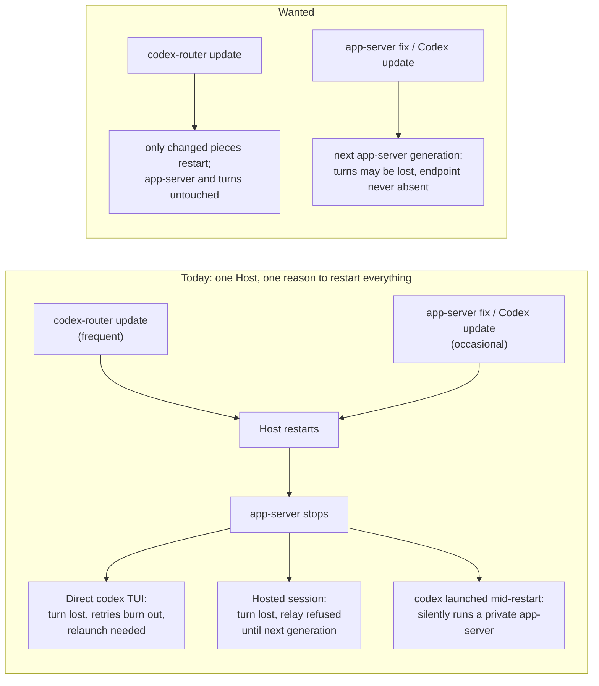

# Host controller — Requirements

## Purpose and boundary

The codex-router Host is one process that does too many things. It holds the
singleton lock, runs the collaboration runtime (board, delivery, MCP, relays,
provider children), supervises the local router proxy (`serve`), and launches
the managed Codex app-server that owns the default Codex endpoint. Any Host code
change therefore restarts app-server, and every client's live session goes with
it. While app-server restarts, the default endpoint disappears, and a `codex`
launched in that window silently runs its own private app-server instead of
joining the shared one.

This change separates the parts that must stay up from the parts that change
often. A Host update must leave app-server and its live turns alone. An
app-server restart may lose in-flight turns, but the default endpoint must stay
connectable throughout. Every restart must be fast.

The scope covers:

- Host process topology and lifecycle ownership;
- the default Codex endpoint and managed app-server generations;
- `agent-proxy-services` (today's router proxy, `serve`) restart policy;
- Host operator commands and their terminal results;
- a stable control surface for a future Agent Studio process.

It does not cover:

- Agent Studio's own features;
- upstream Codex changes;
- the Codex desktop app's own behavior.

Authority: owner decisions on 2026-09-26, recorded on the Agent Router board
thread `01a0df5c-92ff-7bb9-838a-4ff4bf4cc8b4` (messages `01a0df64`, `01a0df90`,
`01a0dfe0`). Where this document and
[2026-09-13 host restart requirements](../2026-09-13-host-restart/requirements.md)
disagree, this document supersedes. Rows of that document not listed as
superseded below remain in force.

## Who is affected

| Class | Job | Current pain (evidence) |
| --- | --- | --- |
| Direct Codex TUI user | Runs `codex` or `codex --remote unix://` against the shared app-server. | A Host update stops app-server. Upstream reconnect gives up after about 15 s and asks for a relaunch (`tui/src/app/reconnect.rs`, `chatwidget/reconnect.rs` at rust-v0.157.1). |
| Hosted session user | Works through agent-collaboration sessions relayed by the Host. | An app-server-only restart cancels every relay, and new relays are refused until the next generation is ready (`native_generation_gate.rs:84-93`, `backend_publication.rs:65-102`). |
| Newly launched `codex` | Joins the shared app-server with no flags. | A missing or refused default socket silently selects an embedded private app-server, with only a debug log (`tui/src/lib.rs:507-603` at rust-v0.157.1). |
| Owner/operator | Updates codex-router and Codex and restarts pieces. | Every update is a whole-Host event; `serve` stop has a 10 s grace with no forced stop (`owned_router.rs:10-28`). |
| Agent Studio (future) | Talks to the broker and message routers. | No surface outlives a Host restart. |

## Authorized needs

All rows marked `authorized` are normative-eligible.

| ID | Affected class | Need and reason | Authority | Priority |
| --- | --- | --- | --- | --- |
| U1 | Direct Codex TUI user | A codex-router update must not stop app-server or interrupt a live session or turn. Updates are frequent; losing work on each is the main pain. | authorized (owner, 2026-09-26: "host updates shouldn't hit appserver") | must |
| U2 | Hosted session user | Across a codex-router update, a hosted session must be able to rejoin its still-running turn, not lose it. | authorized (same decision; worst-hit clients include hosted sessions) | must |
| U3 | All Codex clients | App-server restarts and updates may lose in-flight turns, but the default Codex endpoint must remain connectable throughout. A reconnecting client must succeed on its first attempt, and a newly launched `codex` must never fall back to a private app-server because of a restart. | authorized (owner: losing turns on app-server restart "is fine"; K2 decision) | must |
| U4 | Owner/operator; all clients | Every restart must be fast. Stopping a process is SIGTERM, then a short grace, then a forced kill. | authorized (owner: "all restarts should be fast"; "SIGTERM then SIGKILL quickly after that") | must |
| U5 | Owner/operator; maintainers | Separate a small, rarely changing keeper that owns the endpoints, singleton, and app-server generations from `agent-collaboration-services` and `agent-proxy-services`, which restart freely. | authorized (owner chose K2, "separate keeper process") | must |
| U6 | Owner/operator; Codex clients | `agent-proxy-services` (today's `serve`) restarts on an update only when proxy code changed, decided by a simple fingerprint. | authorized (owner: "serve should restart if proxy code changes… hash or something simple") | must |
| U7 | Agent Studio (future) | A stable control surface that stays available across Host-service and app-server restarts. | authorized (owner problem statement; K2 decision places the control surface on the keeper) | should |
| U9 | Hosted session user on Claude or Cursor (via Router) | A codex-router update that does not change provider-hosting code must not end live Claude or Cursor turns. The provider host restarts only when its own code changes. | authorized (owner decision P3, 2026-09-27) | must |
| U8 | Owner using the Codex iPhone app | The iPhone app must reach the owner's shared app-server through Remote Control while the Codex desktop app is running. Today the desktop's private app-server enables Remote Control for the same installation identity, and the iPhone cannot reach the owner's server until the desktop app is killed. Ideally the desktop app would also use the shared app-server. | authorized need (owner, 2026-09-27/28); partly outside Router's control (see Open) | should |

### Kept from 2026-09-13

- **U3 (then):** exclusive singleton ownership and preserved effective
  configuration.
- **U4 (then):** a terminal success, busy, or actionable failure result.
- **U6 (then):** hard command cutover with no shim.

### Superseded from 2026-09-13

- R1's "Host-owned children MUST be settled before replacement activates" no
  longer applies to app-server or an unchanged `agent-proxy-services` (U1, U2, U6).
- The one-time bootstrap (then U5) recurs once for the move to the keeper.

## Limits and non-goals

- **Not promised:** in-flight turns surviving an app-server restart or update
  (U3), and live relay connections surviving a Host-services restart. Rejoining
  the running turn is sufficient.
- **No drain:** `agent-proxy-services` is not drained. When it does restart, requests that are
  mid-stream rely on Codex's own retry.
- **Provider host (owner decision P3, 2026-09-27):** Claude and Cursor
  provider processes move to `agent-provider-services`, a keeper child that
  restarts only on its own fingerprint change. Replacing it may still end live
  provider turns, the same trade as the proxy.
- **Names (owner, 2026-09-26):** the collaboration body is
  `agent-collaboration-services`, and the proxy is `agent-proxy-services`.
- **Keeper updates are automatic.** A keeper update also leaves app-server
  running. Only a failed re-adoption falls back to a new app-server generation
  (owner decision D1, 2026-09-26).
- **No new infrastructure:** no launchd or system service, no public
  process-control surface, no automatic rollback, no binary download.
- **No upstream Codex changes.** The design follows Codex 0.157.1 endpoint
  behavior.
- **Agent Studio is out of scope** beyond the existence and stability of the
  control surface (U7).
- **Validation stays isolated:** use isolated debug runtimes only. The
  production Host, router, and app-server are never stopped or replaced for
  acceptance.

## Open

- **U8, desktop app and Remote Control.** Established facts:
  - The desktop app (26.924.22138, codex 0.158.0-alpha.2.1) always runs a
    private stdio app-server. Its daemon-reuse branch needs no config overrides,
    and a local host always adds the `codex-app-tools` override (W12), so no
    user setting can make it attach to the shared socket.
  - At launch it sends `remoteControl/enable` to that private app-server (desktop
    log, 2026-09-27 20:40:42 EDT).
  - Every app-server on `~/.codex` shares `installation_id`, and the Remote
    Control enrollment is cached in `state_5.sqlite` (W14). Upstream has no
    duplicate-host arbitration, and the cloud's behavior with two live hosts is
    not observable from the client.
  - Remaining owner-side test: turn off Remote Control in the desktop app, if
    such a setting exists, and confirm the iPhone then reaches the shared
    app-server.
  - A desktop that ignores that, or has no setting, needs an upstream change,
    which is outside this design's goal boundary.

Further owner confirmations on 2026-09-26, after design review:

- **R8 scope.** Stopping a component guarantees that its own process group is
  empty. Processes it places in other groups, such as Codex tool subprocesses or
  ACP providers, are the component's own responsibility.
- **Same-thread overlap.** During the 1 s settle, a thread may be opened on the
  new app-server while it is still running on the old one. This is accepted as a
  rare residual.
- **R7 exception.** If an incoming child dies between being prepared and being
  active, that one replacement follows the crash path and may exceed 1 s.

The owner confirmed this goal boundary on 2026-09-26 and set "fast" (U4) as a
hard target of about 1 s, measured on a warm binary.
