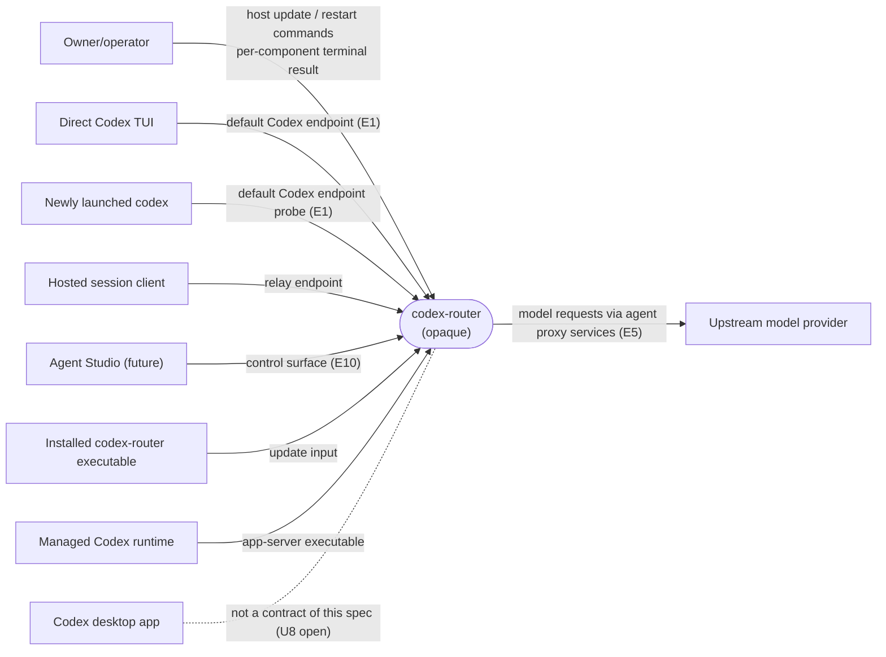
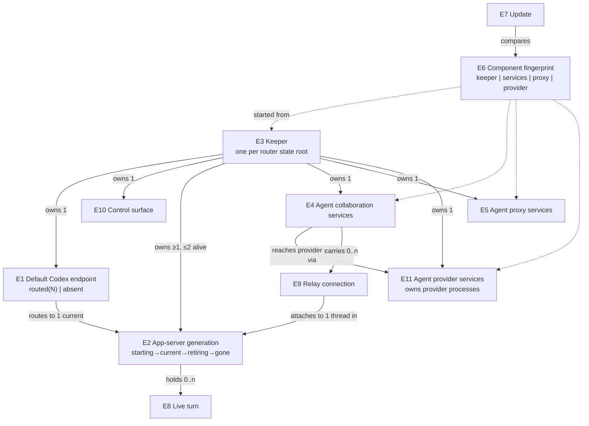

# Host controller — Specification

Governing needs: [Requirements U1–U7](requirements.md). This document defines
what operators, Codex clients and Agent Studio can observe. How the keeper
realizes it (endpoint mechanics, descriptor handling, process wiring) belongs to
Program Design.

## What changes for each consumer

## Entities

| ID | Term | Identity rule | Relationships | Invariants | Observable states |
| --- | --- | --- | --- | --- | --- |
| E1 | Default Codex endpoint | One per Codex home: the conventional app-server control socket pathname that upstream `codex` probes and `--remote unix://` resolves to. Two paths are the same endpoint only if they are that pathname for the same Codex home. | Routes to exactly one current E2 at a time. Owned by one E3. | While E3 runs and an E2 is current, a connect to E1 never fails with "no such file" or "connection refused" (R4 and its crash exception). | `routed(generation N)`; `absent` (E3 not running). |
| E2 | App-server generation | One managed app-server process started for one generation number. Numbers increase within one E3 lifetime; a restart or update always creates a new generation and never revives an old one. | Belongs to one E3. Holds zero or more E8. At most one generation is `current`. | At most two generations are alive at once (`current` plus one `starting` or `retiring`). | `starting → current → retiring → gone`; `starting → failed`. |
| E3 | Keeper | The single process that holds the singleton for one router state root. A second start against the same root is not a second keeper; it is refused. | Owns E1, E10, all E2, one E4, one E5, one E11. | Survives every E4, E5 and E11 replacement and every E2 swap. Its own replacement keeps the same process identity and re-adopts the running E2, E4, E5 and E11 (R11). | `starting`, `running`, `stopping`. |
| E4 | Agent collaboration services | One incarnation of `codex-router agent-collaboration-services`, the restartable collaboration body: the collaboration runtime, board and delivery, relays, MCP, the provider session front doors, the session-event hub, the interaction broker and the durable provider operation records. It does not own provider processes; E11 does. A new incarnation begins at each start. | Child of one E3. Serves the relay endpoint, MCP and collaboration endpoints. Holds zero or more E9. Reaches provider sessions only through E11. | Its start, stop or crash never changes which E2 is current. | `starting`, `ready`, `stopping`, `crashed`. |
| E5 | Agent proxy services | One incarnation of `codex-router agent-proxy-services` (formerly `serve`), the local model proxy that app-server generations send model requests to. | Child of one E3. Has one E6 of kind `proxy`. | The proxy port accepts connections at all times while E3 runs, including during a replacement. | `starting`, `ready`, `stopping`. |
| E6 | Component fingerprint | A value derived from a component's code, per kind (`keeper`, `services`, `proxy`, `provider`). Two executables whose fingerprints of a kind are equal have the same behavior for that kind; a version-only or metadata-only change leaves it equal. | Each installed executable carries one fingerprint per kind. Each running E3, E4, E5 and E11 reports the fingerprint it was started from. | Readable from an installed executable without activating it. | Single value; `equal` or `different` when compared. |
| E7 | Update | One operator request to activate the codex-router executable currently installed at the invoking path. | Compares the E6 of the running E3/E4/E5/E11 with the installed executable's. Produces one outcome per component kind. | Never stops the current E2, except the R11 fallback. | Per component: `unchanged`, `replaced`, `failed`; keeper additionally `replaced-with-new-generation` when re-adoption failed. |
| E8 | Live turn | One in-progress Codex turn, identified by thread and turn id, inside one E2. | Belongs to exactly one E2; never moves between generations. | Survives E4 and E5 replacement. Its E2 retiring may end it. | `in-progress → completed | interrupted | failed`. |
| E9 | Relay connection | One hosted-session client connection carried by E4 to the current E2. | Belongs to one E4 incarnation. Attaches to one thread in one E2. | Ends when its E4 incarnation ends; the thread and E8 it attached to do not. | `open`, `closed`. |
| E10 | Control surface | The keeper's owner-private operator and Agent Studio endpoint for one router state root. | Owned by E3. Reports E2, E4, E5 and E11 state and each E6. | Available whenever E3 is `running`, independent of E4 and E2 state. | `available`; `absent` (E3 not running). |
| E11 | Agent provider services | One incarnation of `codex-router agent-provider-services`, the process that owns external ACP provider processes (Claude, Cursor) and their sessions. A new incarnation begins at each start. | Child of one E3. Has one E6 of kind `provider`. Serves provider sessions to E4. | Its start or stop never changes E2. An E4 replacement never stops it or its provider processes. | `starting`, `ready`, `stopping`, `crashed`. |

## Obligations

### Codex updates never touch app-server

**R1.** When an E7 finds the `services` E6 different, E3 MUST replace E4 with a
new incarnation started from the installed executable, and the current E2 MUST
remain the same process, with the same generation and process identity before
and after. Connections to E1 that were open before the update MUST remain open.
Basis: U1, U5.

**R2.** If an E4 replacement closes an E9, then a hosted-session client that
reconnects MUST be able to resume its thread and observe the same E8 (same turn
id) still `in-progress` or reaching `completed`, not `interrupted`. The E4
replacement itself MUST NOT interrupt the E8.

For ACP clients, "observe" means the Router session state extension's `turn`
record: the turn id while running, and its terminal status when it ends, even
when it ends with no further content. Clients that did not negotiate that
extension receive the resumed history and any further content updates only.
Basis: U2; contract owner: Router session protocol track.

**R3.** If E4 crashes, then E3 MUST start a new E4 incarnation without operator
action. The current E2, E1 routing and E10 availability MUST be unaffected.
Basis: U5.

### The default endpoint is always connectable

**R4.** While E3 is `running`, every connect to E1 MUST succeed. This holds
during E2 restart and update, during E4 and E5 replacement, and during E3's own
startup once the first E2 is `current`. A connect MUST NOT fail with "no such
file" or "connection refused". Basis: U3.

If the current E2 exits unexpectedly, R4 does not hold until E3's recovery
generation is `current`. E3 MUST start that generation without operator action
under the existing recovery budget. It MUST record the crash and the resulting
unavailability, and `host status` MUST show both. Basis: U3, U5.

**R5.** When an app-server restart or update is requested, a new E2 MUST reach
`starting` while the previous generation stays `current`. Only after the new
generation is ready MAY E1 route to it and the previous generation enter
`retiring`. E8 in the retiring generation MAY end `interrupted`. A client whose
first connection reached the previous generation before E1 was re-routed MUST be
able to complete its connection handshake before that generation is stopped. A
retirement MUST NOT be the cause of a newly launched `codex` running its own
private app-server. Basis: U3.

**R6.** If a new E2 enters `failed`, then the previous E2 MUST remain `current`,
E1 routing MUST be unchanged, and the command MUST report failure. Basis: U3, U4
(then).

### Every restart is fast

**R7.** During any E2 swap, E4 replacement or E5 replacement, the interval in
which a client connecting to the affected endpoint (E1, the relay endpoint, E10
or the proxy port) cannot complete its protocol's first request/response MUST
NOT exceed 1 s. For E7 this bound MUST hold for a freshly installed executable.
Any first-execution cost of a new executable MUST be paid before the
interruption interval begins. Basis: U4 (owner hard target of about 1 s).

If the incoming E4 or E5 exits between becoming prepared and becoming active,
that replacement follows the R3 crash path. R7 does not hold for that single
replacement. The event MUST be recorded and shown by `host status`. Basis: owner
decision 2026-09-26.

If an old E4 or E5 does not respond to deactivation, it is stopped by group
SIGTERM, a short grace, then group SIGKILL, and the replacement proceeds without
waiting for the old group to be reaped. A pending SIGKILL guarantees the old
process runs no further user code. R7 therefore holds even when the old process
is stuck in an uninterruptible kernel wait. The eventual reap is recorded. Basis:
owner decision D2, 2026-09-27 ("kill it and restart").

**R8.** Stopping an E2, E4 or E5 MUST send a graceful termination request to the
component's process group, wait at most 1 s, and then forcibly terminate every
process still in that group. The stop is complete only when the group is empty,
not merely when the component's main process has exited. Processes that the
component itself places in other process groups (for example Codex tool
subprocesses) are that component's responsibility on its own graceful
termination. A component that ignores the termination request MUST be gone,
with its group, within that bound plus the reap bound. This replaces the current 10 s proxy grace with no forced stop. Basis: U4.

### Agent proxy services restart only when their code changed

**R9.** When an E7 finds the `proxy` E6 equal, the running E5 MUST remain the
same process. When it finds it different, E3 MUST replace E5, subject to R7 and
R4-equivalent continuity on the proxy port: no connect to the proxy port is
refused during the replacement. Model requests in flight in the old E5 MAY fail;
their recovery is the client's own retry. Basis: U6.

**R10.** The E7 result MUST report, for each component kind, `unchanged`,
`replaced` or `failed`, and MUST NOT report `replaced` for a component whose
running code did not change. For E4 and E5 that means a new process; for E3, a
new executable image in the same process. Basis: U6, U4 (then).

### The keeper changes only explicitly

**R11.** When an E7 finds the `keeper` E6 different, E3 MUST replace itself with
the installed executable while keeping its process identity and the singleton
(R13). It MUST re-adopt the current E2, which stays the same process and
generation, plus E1 routing, E10, E4, E5 and E11. E8 in the current E2 MUST survive, as
in R1.

If re-adoption fails, then the new E3 MUST start a new E2 generation (R5), and
E7 MUST report the keeper as `replaced-with-new-generation`. Only this fallback
may end E8 as `interrupted`.

`codex-router host keeper restart` remains as an explicit full restart. It stops
all E2, and it MUST say so before running.

Basis: U1, U5, owner decision D1 (2026-09-26, automatic).

### Provider turns survive collaboration restarts

**R16.** When an E4 replacement or E4 crash happens, E11 and its provider
processes MUST keep running. A provider session's in-progress turn (the RSP
Session and Turn entities, identified by RSP `sessionId` and `turnId`; not E8,
which is a Codex turn) MUST continue.
A front-door client that reconnects and loads that session MUST observe the same
turn through the Router session state extension's `turn` record: its id while
running, and its terminal status when it ends. Basis: U9.

An E4 restart with the provider connection intact is not the end of a turn, and
MUST NOT be reported as `lost`:

- Pending approvals and questions from those sessions MUST stay answerable after
  the restart. They are re-registered, not settled as `hostRestarted`.
- Only sessions whose provider connection actually ended are settled as
  `hostRestarted` or `lost`.
- Front doors attached before the restart MUST be told to re-synchronize
  (`resyncRequired`).
- On re-attach they receive each session's current settings, capabilities and
  state, including a running turn's id.
- Transcript items from the restart window MUST be replayed to them, as long as
  the window fits a bounded per-provider buffer. Past that bound they get
  `historyUnavailable` for the gap.

Contract owner for these codes: Router session protocol track.

**R17.** When an E7 finds the `provider` E6 equal, the running E11 MUST remain
the same process. When it is different, E3 MUST replace E11. That replacement
MAY end live provider turns, which front doors observe as `lost`. The E7 result
reports E11 like any other child (R10). Basis: U9, U6.

**R18.** E11 is stopped by R8's group stop and restarted after a crash like R3.
Its crash ends live provider turns as `lost`. Basis: U5, U9.

### Agent Studio has a stable surface

**R12.** While E3 is `running`, E10 MUST be `available` across every E2 swap and
every E4, E5 and E11 replacement. It MUST report the current E2 generation, E4, E5
and E11 state, and each running component's E6. Basis: U7.

### Carried forward from 2026-09-13

**R13.** Exactly one E3 MAY hold a router state root. A second start MUST fail
with the existing busy/actionable result. Handoffs MUST NOT open a window in
which a second E3 could acquire it. Basis: U3 (then), U5.

**R14.** Operator commands MUST end in a terminal success, busy or actionable
failure result. Connection loss alone MUST NOT be reported as success. Basis:
U4 (then).

**R15.** Moving from the single-process Host to E3 is a one-time cutover with the
documented stop → wait → start procedure. `codex-router serve` and
`host router restart` are removed; there is no alias. There MUST be no compatibility shim
and no PID discovery or signalling. Basis: U5 (then), U6 (then).

## Operator command contract

| Command | Observable job | Result |
| --- | --- | --- |
| `codex-router host` | Start E3, the first E2, E4 and E5. | Existing readiness classifications. |
| `codex-router host restart` | Run E7 against the installed executable (R1, R9–R11). | Per component: `unchanged`, `replaced` or `failed`; keeper `replaced-with-new-generation` on fallback. |
| `codex-router host app-server restart` | New E2 generation, no update (R5, R6). | Success with the new generation number, or failure with the old generation still current. |
| `codex-router host app-server update` | Managed Codex update, then a new E2 generation if the runtime changed. | Existing update outcomes plus the generation result. |
| `codex-router host provider restart` | Replace E11 regardless of E6 (explicit override). Live provider turns end `lost`. | `replaced` or `failed`. |
| `codex-router host proxy restart` | Replace E5 regardless of E6 (explicit override). Replaces `host router restart` with no alias. | `replaced` or `failed`. |
| `codex-router host status` | Read E10. | E2 generation and state, E4/E5 state, E6 per component. |
| `codex-router host keeper restart` | Explicit full restart of E3 and all E2 (R11). Never implied by `host restart`. | States before running that all E2 generations stop; then the existing terminal readiness result. |

## Failure and partial results

- **No running keeper:** every command except `host` fails with the existing
  instruction to start `codex-router host`.
- **Concurrent lifecycle mutation:** the existing single-mutation admission
  holds; the second request gets a bounded busy result.
- **E7 partial success:** components are replaced independently. A failure in
  one does not roll back another, and the result lists each outcome (R10). A
  failed E4 replacement leaves E3 retrying per R3. A failed E5 replacement
  leaves the proxy port accepting per R9 and reports `failed`.
- **New E2 fails:** covered by R6.
- **Explicitly undefined:** which in-flight model requests fail during an E5
  replacement, and how clients render reconnects. The bounds in R7 and the
  continuity in R4 and R9 still constrain both.

## Cross-cutting obligations

- **Trust boundary.** E1, E10, the relay endpoint and the singleton stay
  owner-private and local, with the same permissions as today. No public
  process-control surface is added.
- **Credentials.** An E5 replacement MUST NOT spend a refresh token twice.
  It MUST NOT cause an account to require re-authentication. The one exception
  is an old E5 that does not respond to deactivation and has to be killed, and
  that exception is recorded.
- **State.** No update, restart or cutover resets or migrates router state,
  Codex session state, credentials or Remote Control pairing.
- **Observability.** Each E2 swap, E4 or E5 replacement, forced termination
  (R8) and E7 outcome is recorded with the generation or incarnation and
  fingerprint involved, readable through `host status` and existing telemetry.
- **Upstream compatibility.** Behavior is specified against Codex 0.157.1's
  default-endpoint probe and reconnect. An upstream change to the conventional
  path or probe is a compatibility event that reopens R4.
- **Not applicable:** accessibility and UI, since there is no new visual
  surface.

## Coverage and proof

| U | E | Problem | Outcome | R | Proof |
| --- | --- | --- | --- | --- | --- |
| U1 | E2 E3 E4 E6 E7 E8 | A codex-router update stops app-server | App-server identity and direct connections unchanged, including across keeper replacement | R1, R11 | V1, V10 |
| U2 | E4 E8 E9 | Hosted sessions lose their turn on update | Relay reconnect rejoins the same live turn | R2 | V1 |
| U3 | E1 E2 E8 | Endpoint disappears; new `codex` silently goes embedded | Endpoint always connectable; blue/green generations | R4, R5, R6 | V2, V4 |
| U4 | E1 E2 E4 E5 E10 | Restarts slow; 10 s grace with no forced stop | Client-visible interruption ≤ 1 s; bounded stop | R7, R8 | V2, V5, V8 |
| U5 | E3 E4 E10 | One process, every change restarts everything | Keeper survives service churn and crashes | R1, R3, R13, R15 | V1, V6, V7 |
| U6 | E5 E6 E7 | Proxy restarts on unrelated changes | Proxy replaced only on fingerprint change | R9, R10 | V3, V7 |
| U7 | E10 | No surface outlives a restart | Control surface stays available | R12 | V9 |
| U9 | E4 E11 E6 | Claude and Cursor turns are lost on every update | Provider host survives collaboration restarts; replaced only on its own fingerprint change | R16, R17, R18 | V11 |

Proof obligations. All runtime evidence uses an isolated debug keeper, state
root and Codex home. Production processes are never touched.

- **V1, cross-process runtime:** with one direct app-server client and one
  hosted relay client each holding an in-progress turn, run E7 with a changed
  `services` fingerprint. Observe:
  - the same E2 process and generation;
  - the direct connection is not closed;
  - the relay client resumes and observes the same turn id completing.
- **V2, continuous connect probe:** probe E1 at a fixed high rate through
  E2 restart, E2 update, E4 replacement and E5 replacement. Expect:
  - zero "no such file" or "refused" results;
  - the longest first-request/response unavailability is ≤ 1 s.
- **V3, fingerprint runtime:**
  - E7 with an equal `proxy` fingerprint leaves the E5 process unchanged.
  - With a different fingerprint, the E5 process changes, TCP probes of the
    proxy port see zero refusals, and the first request succeeds within 1 s.
- **V4, failure injection:** a new E2 that cannot become ready leaves the old
  generation current and E1 routing unchanged, and the command reports failure.
- **V5, stop bound:** a component that ignores the graceful request is gone
  within 1 s plus the reap bound, for each of E2, E4 and E5.
- **V6, crash isolation:** forcibly end E4. E3 starts a new incarnation, and the
  E2 process, E1 and E10 are unchanged.
- **V7, CLI transcript:** command parsing and help match the command table.
  E7 results list per-component outcomes, including a changed keeper fingerprint.
- **V8, timing:** measure R7 for E7 using a freshly installed executable at a
  new path, distinct from the running one.
- **V10, keeper self-replacement:** run E7 with a changed `keeper`
  fingerprint while an in-progress turn is held. Observe the same keeper process
  identity, the same E2 process and generation, and the turn completing.
  Separately, force re-adoption to fail and observe a new E2 generation and the
  `replaced-with-new-generation` result.
- **V11, provider survival:** with real `claude-agent-acp` and a Cursor
  `agent acp` provider each holding an in-progress turn, run E7 with a changed
  `services` fingerprint and an equal `provider` fingerprint. Observe:
  - the same E11 and provider process identities;
  - a front door reloading each session and observing the same turn id reach a
    terminal status.

  Then change the `provider` fingerprint and observe the replacement and `lost`.
- **V9, control surface:** E10 answers throughout V1, V2 and V6 and reports the
  generation and fingerprint changes.

## Open decisions

- **U8, desktop app.** No obligation until the owner's observation is known.
