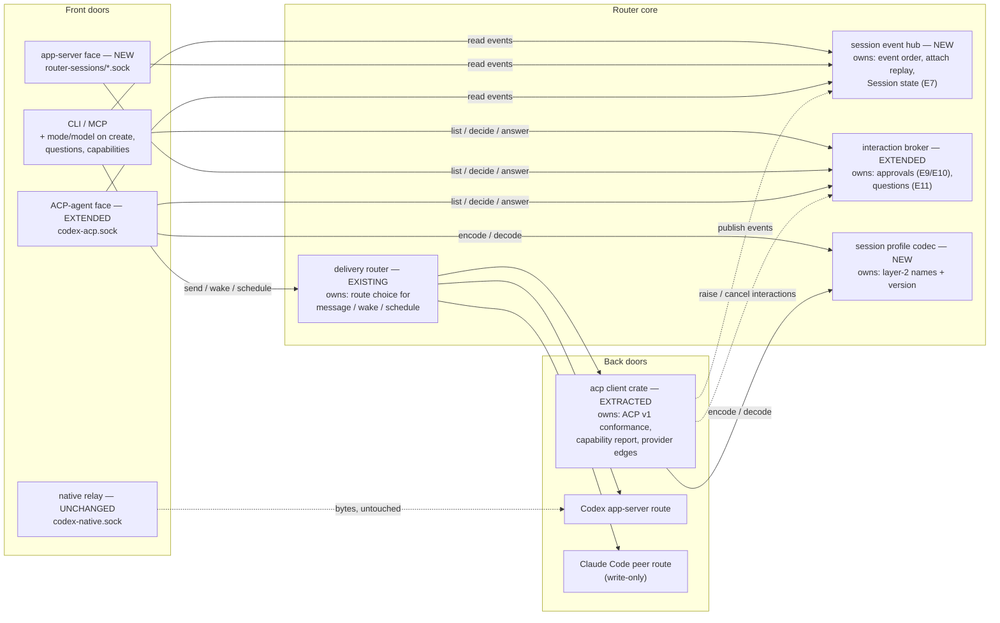
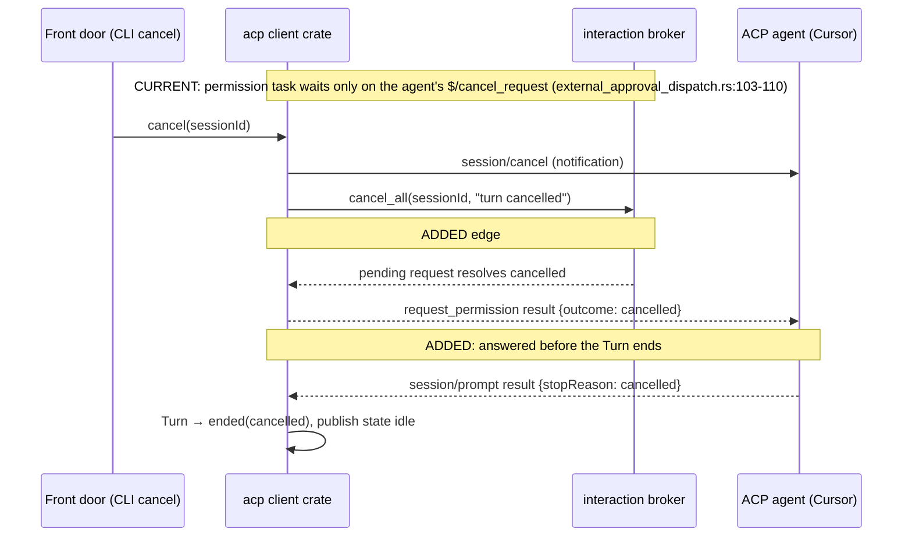
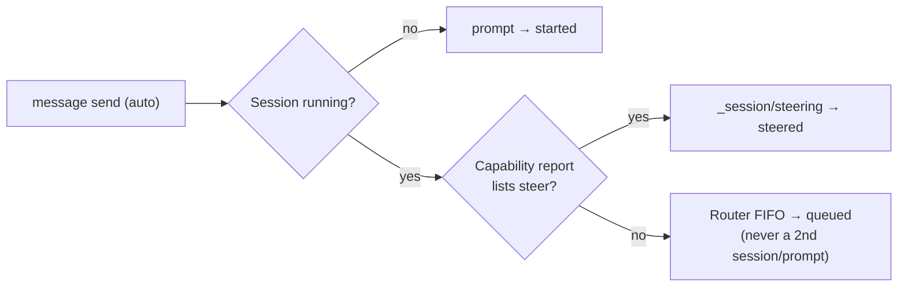
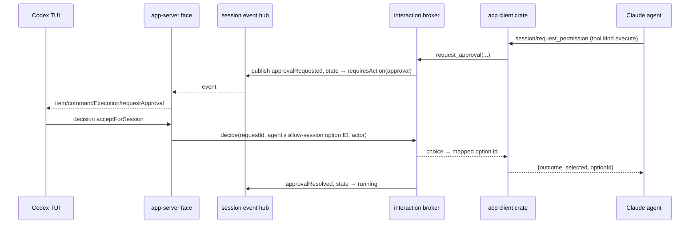
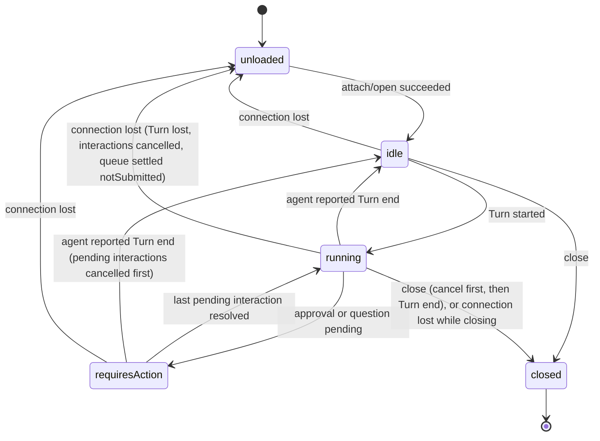

# Router session protocol: Program Design

How Router realizes [specification.md](specification.md) (E1–E15, R1–R30), traced to [requirements.md](requirements.md) (U1–U9). The current-system anchors are codex-router `main` at `335cfc5` (release 0.1.38).

## Overview

One new idea carries the design: a **session event model** in the middle of Router. Every Router-owned ACP provider session publishes typed session events (Turn boundaries, Items, state changes, approval and question requests) into one **session event hub**. Every front door reads from that hub. The ACP client moves into its own crate, speaks ACP v1 by the book, and turns layer-3 provider extensions into those events. The layer-2 session profile is one codec module, shared by the client side and the new agent side.

Codex sessions keep their existing front doors: the Codex TUI through the transparent relay, and ACP clients through the existing `codex-acp-adapter`. The hub is added for Router-owned **ACP provider** sessions (Claude, Cursor), because those are the ones with no front door but the CLI today. The peer route stays write-only (R29).

## Current system

| Behaviour | Current path (at 335cfc5) | Owner today | Problem for the Specification |
|---|---|---|---|
| ACP connection, requests, updates | `external_provider_runtime.rs` (1,286 lines) + `provider_prompt_observation.rs` + `provider_session_actor.rs` in `codex-router-host` | host crate | mixed into the Host; conformance gaps (spec R1, R3–R6, R8–R11); only SDK consumer |
| Steer or queue decision | `provider_acp_delivery_route.rs:99-101` `is_cursor` (`endpoint_id == "cursor-local"`), used at `:172`, `:228`, `:321`, `:332` | delivery route | decided by endpoint name (R8, R10) |
| Permission request | `external_approval_dispatch.rs` (spawned task per request) → `ServiceApprovalBroker::request_external` | broker | not cancelled when Router sends `session/cancel` (`:103-110`, R1); only once-scope choices selectable (R17) |
| Unknown requests | SDK default for session-scoped requests with no live session: queued forever; load replay drops requests | SDK + runtime | R3 |
| Update decoding | SDK typed enums; unknown `sessionUpdate` fails the prompt (`FrameDecodeFailure`) | runtime | R4 |
| Output to consumers | provider operation store keeps metadata; output only through `conversation operation wait` results | supervisor | no live Item stream (R24–R27) |
| Codex TUI front door | `codex-native.sock` → `NativeRelayListener` → `connect_native_relay` (byte relay to the Codex app-server; `native_relay_listener.rs:26-48`) | collaboration-service | Codex only; transparent by design |
| ACP-agent front door | `codex-acp.sock` → `AcpChannelListener` → `codex-acp-adapter` (ACP → Codex runtime) | collaboration-service | Codex only (R28) |

Degree of constraint: **compatibility-bound**. The 0.1.38 CLI, MCP, delivery and receipt contracts must hold (R30), and the Codex relay stays transparent.

## Structural choices

| Crux | Chosen | Rejected alternative | Why | Falsifier (reopen if) |
|---|---|---|---|---|
| Where the Codex TUI reaches provider sessions | a **separate app-server endpoint per provider** (`router-sessions/claude.sock`, `router-sessions/cursor.sock`) serving only Router-owned provider sessions | an intercepting relay on `codex-native.sock` that merges provider threads into Codex's thread list | the relay's transparency is what keeps Codex fidelity; interception would put every Codex TUI session at risk to serve two providers | the owner requires Codex and provider sessions in one TUI thread list |
| Where session output lives | an **in-memory session event hub** per loaded provider session, with history from the agent's own replay | a Router transcript store | the Specification forbids a Router transcript store (R25); every back door in scope can replay | a back door with no replay is added |
| Codex sessions and the hub | Codex sessions **stay on their existing front doors** (relay, `codex-acp-adapter`) | routing Codex through the hub too | Codex already has faithful front doors; 19 Codex item types would be lossy through the shared model | a front door needs Codex and provider sessions in one stream |
| ACP client placement | **extract** to its own crate behind one interface, after the conformance fixes land in place | fix only in place / rewrite before fixing | the fixes are small and releasable (U9); extraction then moves tested behaviour | the fixes can't land without restructuring first |
| Profile wire names | de facto `_session/steering`; other elements `_session/…` requests and notifications; Router identity under `_meta.router`; v2-draft names for values | `_router/*` for everything | owner decision 2026-09-26 (R21) | — |

Accepted debt:
- Codex sessions don't appear on `router-sessions/<provider>.sock`. The payer is the owner, who uses the relay for Codex and the new socket for Claude and Cursor.
- The hub's replay window is in memory; after a Host restart, attach relies on the agent's load replay.

## Components and ownership

| Component | Home | Owns (single source of truth) | Consumers | Changes when |
|---|---|---|---|---|
| **acp client crate** (`acp-client-runtime`) | new crate, extracted from `codex-router-host` | one ACP connection per provider process; ACP v1 client conformance (R1–R7); the per-Session Capability report (E13, R8); layer-3 translation (R23); turning `session/update` into session events | delivery router, provider supervisor | the ACP spec, or a provider's extensions, change |
| **session event model** (`session-event-model`) | new crate, pure types, no IO | the typed vocabulary: session event, Item (E8), Turn end, Session state (E7), Capability report (E13), Approval choice (E10), Question fields (E11) | every other component | a new Item kind or state is specified |
| **session event hub** | `collaboration-service`, new module `session_event_hub.rs` | per-Session event sequence numbers, the attach snapshot, fan-out, and the current Session state for loaded provider Sessions | app-server face, ACP-agent face, CLI/MCP observe | attach or replay semantics change |
| **interaction broker** | `collaboration-service`, extending `approval_broker*` into `interaction_broker*`; approval history stays in `approval-history.json` in its current shape, and new data (Questions, choice scope) goes in a separate `interaction-history.json` (F9) | Approval requests and Questions: routing to the Approver, pending set, decisions, history (R16–R19); cancel-all-for-Session (R1) | acp client (raise, cancel), front doors (list, decide, answer) | approval or question policy changes |
| **session profile codec** (`session_profile_codec.rs`) | `session-event-model` crate | layer-2 wire names, shapes, version; encode and decode both directions (R20–R22) | acp client, ACP-agent face | the profile version changes |
| **app-server face** (`router_session_app_server.rs` + `app_server_item_translation.rs`) | `collaboration-service` | the translation between session events and Codex app-server threads, turns, items, approvals and user-input requests, for Router-owned provider Sessions only (R27) | Codex TUI | the Codex app-server protocol changes |
| **ACP-agent face** (existing `AcpChannelListener`, gaining a provider path) | `collaboration-service`; see "The ACP-agent face, concretely" | serving ACP v1 + profile to ACP clients; Codex Sessions via `codex-acp-adapter` (unchanged), provider Sessions via the hub and broker (R28) | ACP clients | ACP or profile changes |
| **delivery router and routes** (PR #79) | unchanged owner | route selection for messages, wakes, schedules; now reads the Capability report instead of endpoint names (R8–R10) | features | delivery semantics change |

**Dependency rules** (enforced by the existing dependency-boundary test style, extended):
- `session-event-model` depends on nothing Router-specific.
- The acp client crate depends on `session-event-model` and the ACP SDK only. It reaches the hub and broker through two injected ports (below) and never imports `collaboration-service`.
- Front doors depend on the hub and broker ports, never on the acp client crate.
- No module outside the acp client crate names an ACP SDK type. No feature or route decision branches on an endpoint ID string; only composition code maps endpoint IDs to their back doors and sockets (a static rule, with composition as its named exception).

## Interfaces

**`AgentSessionClient`**, owned by the acp client crate and consumed by the delivery route and the supervisor. It replaces direct calls into `ExternalProviderRuntime`:

| Operation | Guarantee | Errors |
|---|---|---|
| `open(target, cwd, mcp, settings?)` → Session + Capability report + applied settings | `session/new`; then, before any prompt, applies each requested setting through `session/set_config_option` (or `session/set_mode` when the agent offers modes but no mode config option), re-reading the options after each change because one selection can change the others (R14) | `invalidSetting{advertised}` (the Session is closed again when the agent supports close); `createdWithoutSettings{applied, failed}` when setup fails part-way, and the Session refuses prompts until resolved; typed ACP errors (R7) |
| `attach(sessionId)` | if the Session is already loaded in this connection: nothing to send (the hub serves it). Otherwise `session/load` when advertised: the replay is published to the hub as history and completes before live Items. Otherwise `session/resume` when advertised: no history, and the hub marks it `historyUnavailable` (R9, R13, R25). Agent requests during load are handled normally; only unimplemented ones get `-32601` (R3) | `unsupported{load, resume}`, `sessionNotFound` (from `session/load` of an unknown session), `resourceNotFound` |
| `prompt(sessionId, content)` → Turn handle | only when the Session is idle and its settings are resolved (R10, R14); text and resource links always accepted, image, audio and embedded resources only when advertised (R11) | `busy`, `settingsUnresolved`, `unsupportedContent{type}` |
| `steer(sessionId, content)` | only when the Capability report lists `steer` and a Turn is observed running. Sends `_session/steering` and always adds `_meta.steering.idleBehavior: promptRequired`: Claude's adapter honours it, and a peer that doesn't know it ignores `_meta`, so it is never assumed to hold. Every outcome maps truthfully: `injected` → steered; `startedNewTurn` → started (a new Turn); `promptRequired` → the delivery falls back to `prompt`; `failed` → `notSubmitted{steerFailed}` (R10). Both surveyed adapters advertise only `_meta.steering.supported: true`, which reveals no idle contract, so none is inferred | `steerUnsupported` |
| `cancel(sessionId, reason)` | sends `session/cancel`; tells the broker to cancel every pending interaction of the Session, answered as permission `cancelled` or elicitation `{action: cancel}` (R1); late updates are still accepted; the Turn stays `running` until the agent's prompt result (R5), or ends `lost` if the connection ends first | — |
| `close(sessionId)` / `list()` | only if advertised (R13); close cancels a running Turn first | `unsupported` |
| `set_setting` | `session/set_config_option` (or legacy `session/set_mode`); values must be currently offered (R14, R15) | `invalidSetting{advertised}` |

**Ports injected into the acp client crate:**
- `SessionEventSink.publish(sessionId, event)`: the hub assigns the sequence number. The sink never blocks the SDK dispatcher: it is a non-blocking, bounded per-Session channel. On overflow the Session is failed as `outputOverflow` and cancelled, never silently dropped.
- `InteractionPort.request_approval(...)` / `request_question(...)` → a future resolving to a choice, answer, decline or cancel; `cancel_all(sessionId, reason)`. This keeps PR #79's spawned-task pattern: the SDK dispatcher is never blocked (A1).

**`SessionCommandPort`**, owned by `collaboration-service` and injected into every front door (F11). It is the only way a front door acts on a provider Session: `create(endpoint, settings, actor)`, `prompt`, `steer`, `queue_add` / `queue_list` / `queue_cancel`, `cancel`, `close`, and `set_setting`, each carrying the acting identity: the typed Identity Router uses for board actors, either a Session (`SessionRef`) or `Human { human_id }`. The host composes it over the delivery router and the provider supervisor. Front doors never import the acp client crate.

**Provider settings catalog**, owned by the provider supervisor (in memory). For each provider it keeps the config options and modes that provider last advertised in any `session/new|load|resume` response. It exists so the app-server face can answer `model/list` before any Session exists on a new connection. With no Session seen yet, it answers one entry, `provider default`, meaning the agent's own default. It is derived data, never persisted, and refreshed by every new Session response (F3).

**`SessionEventHub`**, owned by `collaboration-service`:
- `attach(sessionId)` → (snapshot of events since load, receiver of later events). The snapshot and the subscription are taken atomically, so there is no gap and no duplicate (R25).
- `state(sessionId)` → Session state (R19).
- Late subscribers receive pending approvals and questions again, as part of the snapshot (R25).

**The session profile on the wire** (R20–R22). The codec is the only home of these names:

| Element | Direction | Wire form | Result / payload | Mirrors |
|---|---|---|---|---|
| advertisement | both | `initialize` `_meta.sessionProfile = {version: 1, elements: [...]}`; Router also reads the agent's `_meta.steering.supported` | — | — |
| steer | client → agent (and client → Router's ACP-agent face) | request `_session/steering {sessionId, prompt: ContentBlock[], _meta?: {steering: {idleBehavior: "promptRequired"}}}` | `{outcome: "injected" | "startedNewTurn" | "promptRequired" | "failed", reason?}`: Router accepts the union and maps each outcome | shared by both adapters: the method plus `injected`/`startedNewTurn`. Claude's adapter adds `promptRequired` (opt-in idle behaviour); codex-acp adds `failed`. Advertisement is `_meta.steering.supported: true` in `initialize`. Router's ACP-agent face advertises the same flag and honours `promptRequired` |
| queue | client → Router's ACP-agent face | requests `_session/queue/add {sessionId, prompt}` → `{inputId, position}`; `_session/queue/list {sessionId}` → `{items: [{inputId, position, preview}]}`; `_session/queue/cancel {sessionId, inputId}` → `{cancelled: true}` or error `-32002` (no such queued item: it already started or was cancelled) | not advertised: a client must not send these; Router answers `-32601` | OpenCode inbox, Codex `thread/queue` |
| state | Router → client | notification `_session/state {sessionId, state: "running" | "idle" | "requires_action" | "lost", requiresAction?: "approval" | "question", stopReason?, reason?}` | not advertised by the client: Router does not send it; the client infers state from the prompt result as in plain ACP | ACP v2 draft `state_update` (`lost` is a Router addition for R5) |
| approval choice | both | on each `request_permission` option: `_meta.sessionProfile.choice = {effect: "allow" | "decline" | "abort", scope: "once" | "session" | "persistent", where?}` (the option ID stays the agent's own); on the request: `_meta.sessionProfile.prompt = {title, description?}` and optional `_meta.sessionProfile.subject`, a tagged union `{type: "tool_call", toolCall: {toolCallId, ...}}` or `{type: "command", command, cwd (absolute), toolCallId?, terminalId?}` | absent: a peer treats options by their ACP kind only, with no scope beyond `once`/`always` | ACP v2 permission requests (`rfds/v2/permission-requests.mdx`): `title` and `description` outside the optional `subject`, discriminators `tool_call` (carrying the tool-call update under `toolCall`) and `command` |
| identity | both | Router → client: `_meta.router = {sessionRef, approver, origin?}` on new/load/resume responses, where `approver` is the typed identity (a SessionRef, or `{kind: "human", humanId}`). Client → Router: `_meta.router.endpoint` on `session/new` selects the back door (default `codex-local`); `_meta.router.actor` in `initialize` declares the connection's acting identity (a SessionRef, or `{kind: "human", humanId}`) | absent: Router uses `codex-local` and treats the connection as having no actor (it may read but not decide) | Router-only |
| capabilities | Router → client | `_meta.sessionProfile.capabilities` on new/load/resume responses (E13 features) | — | — |

The `state` notification uses its own extension method, not a new `sessionUpdate` kind, because ACP v1's `sessionUpdate` enum is closed. A strict v1 client would fail on an unknown kind, the same failure Router fixes for itself in R4.

## Key flows

**1. Router cancels a turn that has a pending approval (R1, R5).** This path changes.

**2. Delivery chooses steer, queue or prompt (R8, R10).** Changed edge: the `is_cursor` endpoint-name branch (`provider_acp_delivery_route.rs:99-101`) is **removed**, and the Capability report is read instead.

**3. The Codex TUI answers a Claude approval (R16, R27).** Proposed-only; no predecessor.

## The app-server face, concretely (R27)

Evidence: the Codex TUI's `--remote` client at `openai/codex` main `e72da2b538` (report: `tmp/design-review/2026-09-26-acp-conformance/codex-tui-remote-requirements.md`). The TUI never checks that its server is OpenAI or Codex. It is strict about transport, IDs and JSON shapes.

| Constraint (from the TUI) | How the face meets it |
|---|---|
| **WebSocket** over the Unix socket (HTTP upgrade to `ws://localhost/rpc`, text frames, no `"jsonrpc"` field) (`app-server-client/src/remote.rs`) | `router-sessions/<provider>.sock` serves WebSocket framing, not JSON lines; one connection per TUI |
| Thread IDs must be UUIDs, or picker rows are skipped and a resume fails (`tui/src/resume_picker.rs:2032`) | Claude and Cursor session IDs are UUIDs today; a non-UUID provider ID gets a stable UUIDv5 alias under a Router namespace, and the face translates both ways |
| Every thread needs an absolute `cwd` | from the provider session record (PR #79) |
| `ThreadItem` has no fallback type; an unknown type breaks `thread/resume` | the translator emits only known item types: an Item with no TUI equivalent becomes `agentMessage` text (a `plan` becomes `turn/plan/updated`; a generic tool call becomes `mcpToolCall`), never an unknown type (Specification: "a generic item with its text, never dropped") |
| Fatal at startup if they fail: `initialize` (10 s), `account/read`, `model/list` (≥ 1 model), `configRequirements/read`, `thread/start`/`thread/resume`, `thread/list` | implemented: `account/read` → `{account: null, requiresOpenaiAuth: false}`; `model/list` → the provider settings catalog (the models that provider last advertised, or the single `provider default` entry when none has been seen); `configRequirements/read` → `{requirements: null}`. `provider default` means **no model override**: when it comes back on `thread/start` or `turn/start`, Router sends no model setting to the agent. After setup, the thread reports the model the agent actually selected (the current value of its model config option) |
| `config/read` must be exactly `-32601`; soft methods (`collaborationMode/list`, `hooks/list`, `skills/list` → `{data: []}`) | explicit answers; every other method gets `-32601` |
| Title generation starts a hidden ephemeral `thread/start` | ephemeral starts are rejected, so they never spawn agent sessions |
| History: `historyMode` legacy with turns inline; `excludeTurns` may be ignored | `thread/resume` and `thread/read` return turns from the hub. Live Turns carry their real boundaries and status. Replayed history is grouped into historical Turns (E4): one per replayed user message, status `completed`, with no claim about the original stop reason and no attempt to tell a steered Input from a new Turn |
| Steer and interrupt rely on `turn/started` carrying the in-progress turn; interrupted turns end `turn/completed` status `interrupted` | the translator maps the Turn lifecycle (E4) exactly; interrupt calls `AgentSessionClient.cancel` (flow 1) |
| Reasoning deltas render only after `item/started` for a `reasoning` item | the translator always opens an Item before its deltas |
| No protocol version negotiation; coupling is through JSON shapes | the face is tested against a pinned Codex TUI version; a newer TUI is a named upgrade step |

Methods implemented: `initialize` (+ `initialized`), `account/read`, `model/list`, `configRequirements/read`, `thread/start`, `thread/list`, `thread/read`, `thread/resume`, `turn/start`, `turn/steer`, `turn/interrupt`.

Notifications emitted: `turn/started`, `turn/completed`, `item/started`, `item/completed`, `item/agentMessage/delta`, the reasoning deltas, `item/commandExecution/outputDelta`, `turn/plan/updated`, `thread/tokenUsage/updated`, `error`, `serverRequest/resolved`.

**Approval requests (F4).** The face keeps the agent's exact option IDs and chooses a prompt per request:

| Offered options | TUI prompt | Decision → selected agent option |
|---|---|---|
| tool kind `execute`, and the offered options map one-to-one onto the command prompt's decisions (allow once → `accept`, allow for the session → `acceptForSession`, reject once → `decline`) | `item/commandExecution/requestApproval`, with `availableDecisions` exactly the mapped offered options plus `cancel` | `accept`, `acceptForSession`, `decline` → the matching offered option ID; `cancel` → abort (Turn cancelled, request answered `cancelled`) |
| tool kind `edit`, `delete` or `move`, and the offered options are exactly allow once and allow for the session (the file prompt offers Accept, AcceptForSession and Cancel, with no decline) | `item/fileChange/requestApproval` | `accept` → allow-once option; `acceptForSession` → allow-session option; `cancel` → abort |
| anything else, including any offered reject option on a file change, persistent options, generic tool kinds, or options with no scope | `mcpServer/elicitation/request` form with one required single-choice field listing every offered option by its label, with persistence disclosed (for example "Always allow — adds to Cursor's allowlist") | the chosen value is exactly the agent's option ID. Dismissing the form (decline or cancel) selects **no** option: the request is answered `cancelled`, never mapped to one of several reject options |

`item/permissions/requestApproval` is **not** used. It is Codex's filesystem and network grant request, not a generic approval.

**Questions (F5).** A Question's form goes to `mcpServer/elicitation/request` in form mode, keeping field types (string, number, boolean, enum), required fields, and the accept, decline and cancel actions; the reply is forwarded unchanged as the ACP elicitation response. `item/tool/requestUserInput` is used only for a provider question that is itself a set of simple text or single-choice prompts (for example Cursor `cursor/ask_question`). Its reply maps back as: answers given → `accept` with them; submitted with no answer → `decline`, the user's skip, sent to Cursor as `cursor/ask_question`'s `outcome: skipped` (the `__ask_question_skip__` option ID belongs only to Cursor's permission-request fallback); the turn interrupted → `cancel`. A form the TUI can't render is shown as `unsupportedHere` ("answer with `agent-collaboration question answer` or another front door"). It stays pending, is never answered on the user's behalf, and the proof records which form shapes the pinned TUI renders.

**Deciding (F11).** Approver and actor use the typed identity Router already has for board actors: a Session (`SessionRef`) or `Human { human_id }` (`message-board/src/board_identity.rs:154-158`). Each `router-sessions/<provider>.sock` is configured with the owner's `human_id`, and that is the connection's actor. Sessions created through the TUI face record it as their Approver. The interaction broker compares actor and Approver as typed identities. Existing SessionRef callers are unchanged: a SessionRef is the Session variant. Records whose Approver is a human go only in `interaction-history.json`; `approval-history.json` keeps SessionRef-only records in its frozen shape (F9). A pending interaction whose Approver is a different identity is shown read-only.

`thread/start` from the TUI creates a new provider Session on the endpoint the connection was opened for. The socket path carries the endpoint: `router-sessions/claude.sock` and `router-sessions/cursor.sock`. So `model/list` and the creation defaults are that provider's.

## The ACP-agent face, concretely (R28)

Current path: `codex-acp.sock` → `AcpChannelListener` admits each connection through a Codex generation (`acp_channel_listener.rs:50-56`) and hands it to `codex-acp-adapter`, which owns a native Codex connection (`acp_connection_dispatch.rs:19-65`).

Proposed:
- **Admission.** The listener admits a connection without requiring a Codex generation. Codex admission is taken per Codex Session, not per connection, so a provider Session keeps working while Codex is unavailable.
- **Initialize.** The connection-level `initialize` response advertises ACP v1 plus the profile elements Router supports. Per-Session capabilities come on each `session/new|load|resume` response as `_meta.sessionProfile.capabilities`, because one connection can hold Sessions from different back doors.
- **Session creation.** `session/new` reads `_meta.router.endpoint`:
  - absent or `codex-local`: the existing `codex-acp-adapter` path, unchanged;
  - a provider endpoint: `SessionCommandPort.create`.
- **Existing Sessions.** Existing Sessions are named by SessionRef in `session/load`'s `_meta.router.sessionRef`; a bare session ID is resolved on the endpoint that created it.
- **Commands and output.** `session/prompt`, `_session/steering`, `session/cancel` and `_session/queue/*` for a provider Session go to `SessionCommandPort`; its output comes from the hub.
- **Actor.** The connection's actor is `_meta.router.actor` from `initialize`, self-declared, as SessionRefs are everywhere in Router (PR #79). Approval and question requests for a Session are sent to this connection only when the actor is that Session's Approver. Otherwise they are visible through `_session/state` as `requires_action`, with no decision path.
- **Unchanged path:** Codex Sessions through `codex-acp-adapter`.

## Session state

Owner: the session event hub. It derives state from back-door events and broker events and never stores it independently.

Illegal transitions, and how each is handled:
- `idle` → `requiresAction` is legal only if an agent request arrives with no Turn; it is recorded, and the request is answered normally.
- A Turn end is never inferred from a timeout (R5).
- A second prompt while `running` is refused at `AgentSessionClient.prompt` (`busy`).

## Failure, concurrency, recovery

| Failure | Detection | Containment and recovery | Owner | Proof seam |
|---|---|---|---|---|
| Agent sends an unknown request or update kind | codec parse | reply `-32601`, or record an `unknown` Item; the Turn continues (R3, R4) | acp client | fixture agent |
| Agent request for an unknown Session, or an unimplemented request during load replay | the SDK's session-scoped handler has no match | a connection-level fallback handler answers `-32601` (replaces the SDK's queue-forever default); implemented requests during replay (for example a permission request) are handled normally | acp client | fixture agent |
| Approval pending when the Turn is cancelled | `cancel` call | `cancel_all` resolves every pending interaction as `cancelled`, answered before the Turn ends | broker + acp client | flow 1 fixture |
| Slow front door | bounded hub channel per subscriber | a lagging subscriber is dropped with `resyncRequired` and re-attaches through a snapshot; the agent is never slowed | hub | multi-attach test |
| Event sink overflow | bounded per-Session channel full | the running Turn is cancelled (R5) with `localCause: outputOverflow`; it ends with the agent's own stop reason (normally `cancelled`) plus that local cause, or `lost` if the connection ends first; never silent | acp client | fixture flood test |
| Host restart | process start | the hub is empty; attach re-loads through the agent's replay (R25); the Router queue is lost (accepted cost) | hub | live E2E |
| Provider process exits | connection closed | every running Turn on that connection ends `lost{providerRetired}`; pending interactions are cancelled with that reason; each Session's Router-queued Inputs settle `notSubmitted{providerRetired}` and are never sent to a later connection; a Session that was closing ends `closed`, every other affected Session returns to `unloaded` (attachable after the provider restarts); the endpoint becomes unavailable with its reason (PR #79) | acp client + hub + broker | fixture that kills the agent mid-Turn with an interaction pending, and one while closing |

**Concurrency:**
- Inputs from several front doors enter the existing per-Session actor mailbox, so they are handled in arrival order (R26).
- Approvals run in spawned tasks, never on the dispatcher (A1, R19).
- Hub attach is atomic under a per-Session lock, which is held only for the snapshot copy and never across I/O.

## Cross-cutting realization

- **Privacy:** the acp client crate keeps PR #79's sanitized error mapping. Agent payloads reach only a front door rendering to its attached user, never logs.
- **Security:**
  - the broker rejects an Approver equal to the requesting Session (E12);
  - a `persistent` choice carries its `where` so every front door can disclose it before the choice (R17);
  - no `fs` or `terminal` capability is advertised, so agents can't ask Router to touch files (R6).
- **Compatibility:** CLI and MCP get additive fields only (mode, model, effort; question list and answer; capabilities; resume, close, list). The native relay is untouched. The profile is versioned in `initialize`.
- **Observability:** Session state and the Capability report are readable on every front door (R12, R15). Hub lag drops are logged with the Session ID only.

## How each requirement is realized and verified

| Requirements | Realized by | Proof seam |
|---|---|---|
| R1, R2, R5 | acp client `cancel` + broker `cancel_all` (flow 1) | scripted ACP fixture agent: pending permission answered `cancelled` before `stopReason: cancelled`; fails at 335cfc5 |
| R3, R4 | connection fallback handler; tolerant codec | fixture: unknown request, unknown session, request during replay, unknown update kind |
| R6, R7 | `initialize` builder; error mapping | fixture captures the `initialize` params; error-code table test |
| R8–R12 | Capability report; `is_cursor` removed; content check | fixtures advertising different capability sets; a static rule rejecting endpoint-ID string comparisons outside composition |
| R13–R15 | `AgentSessionClient` lifecycle and config operations; CLI/MCP additions | fixture + live Claude and Cursor on the debug Router |
| R16–R19 | interaction broker (approvals + questions), hub state | fixture per option kind and elicitation; live Cursor allowlist and Claude default-mode approvals; A1 concurrency test |
| R20–R23 | session profile codec; provider edge translation | codec round-trip tests; fixtures for Cursor `cursor/*` and Claude `_auth/*` translation |
| R24–R26 | session event hub | two-subscriber attach tests (identical sequences; no gap or duplicate); arrival-order test |
| R27 | app-server face | live Codex TUI against `router-sessions/<provider>.sock` driving Claude and Cursor Sessions |
| R28 | ACP-agent face extension | scripted ACP client fixture driving a provider Session and a Codex Session |
| R29, R30 | peer route unchanged; full suite | existing peer tests; PR #79 E2E journeys re-run |

Every automated case must be shown failing before its change (U8). Planning decides the test files and order.

## Cutover

Phases, each a releasable PR (U9). Planning owns the exact slices.
1. **Conformance in place:** R1–R5, R7–R11 and the non-elicitation parts of R6, fixed inside `codex-router-host` with the fixture harness. Elicitation is **not** advertised yet (F8). Authority stays with the current runtime.
2. **Extraction:** the acp client crate and `session-event-model` take over. The host keeps only composition. Behaviour is identical; the phase-1 tests move with the code.
3. **Hub, broker extension, profile, lifecycle, modes:** R12–R26 on the new crate. This phase starts advertising `elicitation: {form: {}}`, together with the question path that answers it (R6, R18).
4. **Façades:** the app-server face (`router-sessions/<provider>.sock`) and the ACP-agent face extension (R27, R28).

Rollback in any phase is to the previous release, with this persisted-data rule (F9): `approval-history.json` keeps exactly its 0.1.38 record shape. The 0.1.38 reader rejects unknown fields (`approval_contract.rs:74-92`, `deny_unknown_fields`) and fails closed on load (`approval_broker.rs:190-197`), so nothing new is ever written into it. Questions and choice scopes go in a separate `interaction-history.json`, keyed by request ID. A rolled-back release never opens that file, so it loses the view of question history but not the data, and its approval history still loads. Proof: the 0.1.38 reader loads a history file written by the new release.
