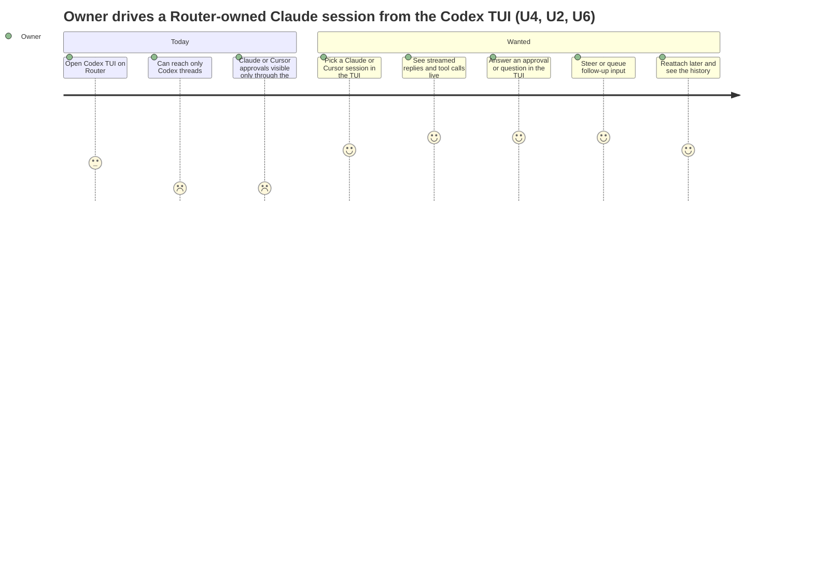

# Router session protocol: Requirements

Router already reaches Codex, Claude, Cursor and live Claude Code sessions (provider delivery, PR #79, release 0.1.38). It does so without Router's ACP client having been checked against the ACP specification, and each kind of UI can drive only its own kind of agent. These requirements cover the next step: Router speaks standard ACP fully, adds one generic extension language for what ACP lacks, and lets any supported UI drive any Router-owned session, including its approvals and questions.

Specification: [specification.md](specification.md).

## Who is affected

| Class | Who | Their job here |
|---|---|---|
| Owner | Shravan, operating Router and its agents | Drive Codex, Claude and Cursor sessions from the UI of choice, see what they do, and answer their approvals and questions |
| Orchestrating agents | Codex, Claude and Cursor sessions coordinating through Router's CLI and MCP | Create, prompt, steer and queue work in other sessions and read truthful results |
| UI clients | the Codex TUI (app-server protocol) and ACP clients (Zed-style editors) | Render a session faithfully: turns, items, tool events, approvals, questions, history |
| Agent back doors | Codex app-server; Claude (`claude-agent-acp`) and Cursor (`agent acp`) over ACP; live Claude Code sessions through the peer socket | Receive standard, well-formed protocol traffic |

## Needs

Authority for every row: owner statements in the design conversation on 2026-09-25 and 2026-09-26 (recorded on coordination root `01a0dd96-ff30-71c0-957c-a43b243d4892`). All rows are `authorized`. Priority is assigned by the owner through the requested sequence: U1, U2 and U9 first; then U3, U6 and U7; then U4 and U5.

| ID | Need | Why it matters | Owner evidence |
|---|---|---|---|
| U1 | Router is a fully conformant ACP v1 client: it follows every client rule of the specification and uses the standard methods instead of hand-rolled variants | "follow the standards, it'll help us get there"; the review showed spec rules broken (for example pending permissions not answered on cancel) | 2026-09-25 "debug this against the ACP protocol … the basis for a lot of things"; 2026-09-26 split layer 1 "ACP with the standard" |
| U2 | Claude and Cursor sessions work reliably through Router, and every permission request they raise reaches a person or agent who can answer it; nothing is silently refused or lost | Cursor's `whoami` was silently cancelled; approvals are the basis of trust | 2026-09-25 "for all approvals"; 2026-09-26 "make both agents work in a way where they would show the permissions" |
| U3 | What ACP lacks but every UI needs is covered by one generic extension language designed across Claude Code, Codex, Cursor, OpenCode v2 and pi; it reuses de facto names (steering) and follows the ACP v2 drafts where they exist | Avoid per-vendor special cases in Router and in every UI | 2026-09-26 "extensions … made generic so we really design a language for our extensions well"; "de facto steering is great"; "some things are going to be part of v2" |
| U4 | The Codex TUI can drive a Router-owned Claude or Cursor session end to end: replies, live tool events, approvals, questions, history | The owner wants one UI for every agent ("the Codex TUI façade") | 2026-09-24 "Later Codex TUI façade: interact with a Router-owned session, app-server responses, live tool events, approvals, history"; 2026-09-26 scope "everything incl. façades" |
| U5 | An ACP client can drive any Router-owned session, including Codex sessions | The same generic session model serves both UI protocols | 2026-09-26 scope "everything incl. façades" (option text: "ACP-agent façades") |
| U6 | Agents can ask the user a structured question (elicitation), and the question is routed to whoever answers, like an approval; Router does not act as an editor for agent file or terminal work | Questions are common to all five systems; client-side file and terminal delegation is used by none | 2026-09-26 "I don't want fs/terminal … elicitation seems way more useful and is great" |
| U7 | A conversation can be created with a chosen mode and model | Claude defaults to automatic approval and Cursor to its allowlist; the owner wants to choose | 2026-09-25 decision "Per-session mode and model at conversation create: Yes" |
| U8 | Every behaviour is proven by tests that exercise real behaviour and are validated to fail without the change, plus live checks against real Claude and Cursor | "make the tests also worthwhile and useful and make sure we validate them" | 2026-09-26 |
| U9 | What works in release 0.1.38 keeps working at each step; the work ships in increments that are each releasable | 0.1.38 is deployed and relied on; "merge in a stable fashion and then go to the next one" | 2026-09-25 |

## Stakeholder constraints

- Reviewers: design review by an OpenAI Astra (high) reviewer; Claude reviewers are Opus 5.5 and never Fable. Implementation by Luna (xhigh) or Sol (medium) implementers, as the agent-management skill selects.
- Owner-accepted costs from PR #79 remain: Router-held queued input is lost on a Host restart; never-prompted provider sessions cannot be loaded after a provider restart.

## Boundary

**In scope:**
- Router's ACP client: conformance, capability-driven behaviour, session lifecycle, modes and configuration, approvals, questions;
- the generic extension language;
- a normalized session model that every front door and back door translates to and from;
- two new front doors: an app-server face for Router-owned Claude and Cursor sessions (for the Codex TUI), and an ACP-agent face for any Router-owned session;
- CLI and MCP additions for mode and model on create, and for questions.

**Protected:**
- the Codex app-server back door's native semantics;
- the existing CLI and MCP contracts, which change only additively or through hard cutovers named in the Specification;
- the production Router, which is never restarted by the work.

**Non-goals:**
- client-side file-system and terminal capabilities (`fs/*`, `terminal/*`);
- reading output from, or showing approvals of, live Claude Code sessions reached through the peer socket (it stays write-only);
- adding OpenCode or pi as back doors in this cycle (they inform the extension language only; Q1);
- cross-machine or remote sessions;
- contributing the extension language upstream to ACP;
- provider login flows (a logged-out provider is reported, not repaired).

## Settled scope question

- **Q1 (owner, 2026-09-26):** OpenCode and pi inform the extension language only; they do not become back doors in this cycle. Adding one later is a new provider entry plus conformance proof, with no change to the extension language.
