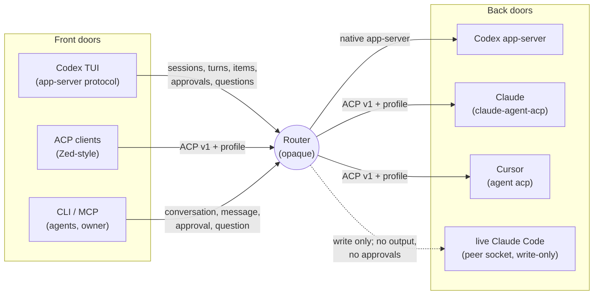
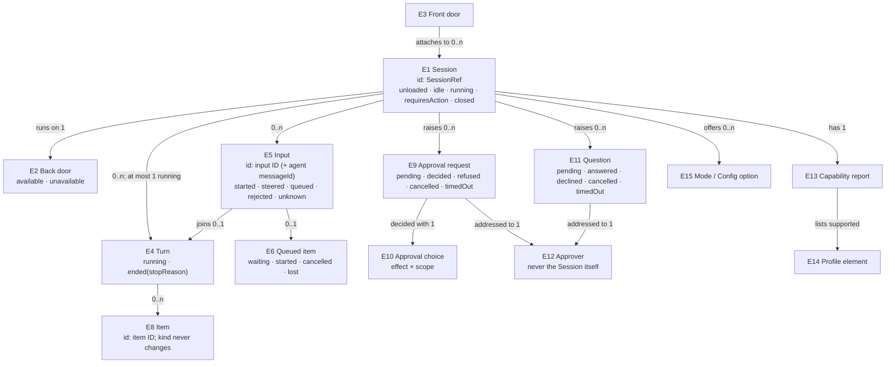

# Router session protocol: Specification

What must be observably true for Router to be a conformant ACP client, to speak one generic extension language, and to let any supported UI drive any Router-owned session. Needs U1–U9 are in [requirements.md](requirements.md).

Sources:
- the ACP specification, stable v1 (repository `agentclientprotocol/agent-client-protocol`, schema line v1, crate 1.9.1, HEAD 2026-09-25), plus its v2 draft RFDs;
- the Codex app-server protocol v2 (`openai/codex` main, 2026-09-26);
- the surveys of Claude Code, Codex, Cursor, OpenCode v2 and pi.

Where this document says "the ACP spec", it means stable v1.

## The picture

Router sits between UI front doors and agent back doors. Today each front door reaches only its own kind of back door. After this work, every front door reaches every Router-owned session through one shared session model.

Three layers govern every wire interaction (the owner's split, 2026-09-26):

| Layer | Contents | Rule |
|---|---|---|
| **1. ACP v1** | everything the ACP spec defines | Router conforms fully, as both client and agent |
| **2. Session profile** | steer, queue, session state, approval scope and effect, routing identity, capability report | defined once in this document; reuses de facto names; mirrors ACP v2 drafts |
| **3. Provider edges** | vendor extensions (Claude `_auth/*`, Cursor `cursor/*`, Codex item types, and so on) | translated into layers 1 and 2 at the back door; never exposed as generic |

## Domain entities

| ID | Term | Identity rule | Relationships | Invariants | Observable states | Canonicalizes | Basis |
|---|---|---|---|---|---|---|---|
| E1 | **Session** | its SessionRef: service ID, endpoint ID, and session ID. The same agent conversation reached through two front doors is one Session | runs on exactly one Back door; has 0..n Turns, Items, Inputs, Approval requests, Questions; has one Capability report | never changes endpoint; never replaced by a new Session on failure (a replacement is a different Session) | `unloaded`, `idle`, `running`, `requiresAction`, `closed` (see E7) | "conversation", "thread" (Codex), "session" (ACP) | U4, U5, PR #79 |
| E2 | **Back door** | the agent-facing connection kind of an endpoint: `codexAppServer`, `providerAcp` (per provider), `claudeCodePeer` | serves 0..n Sessions | a peer back door is write-only | `available`, `unavailable{reason, fix}` | "route", "reachability", "provider" | PR #79 |
| E3 | **Front door** | a client-facing surface: CLI, MCP, app-server face, ACP-agent face | attaches to 0..n Sessions | a front door never changes a Session's endpoint | n/a (a surface, not stateful) | "façade", "UI" | U4, U5 |
| E4 | **Turn** | the agent's work between accepting an Input that starts work and reporting an end; one Turn per start, even when steered Inputs join it | belongs to one Session; contains 0..n Items; ends with one Stop reason | at most one running Turn per Session | `running`, `ended{stopReason}` (confirmed by the agent's prompt result; stop reasons are the ACP set `end_turn`, `max_tokens`, `max_turn_requests`, `refusal`, `cancelled`, plus `unknown(value)`), `lost{reason}` (the connection to the agent ended before it confirmed; the outcome of the work is unknown). An ended Turn may also carry a `localCause` (for example `outputOverflow`) naming why Router cancelled it, kept separate from the agent's stop reason. A **historical Turn** rebuilt from `session/load` replay starts at each replayed user message and has stop reason `unknown(replayed)`, because replay carries no prompt results; replay cannot tell a steered Input from a new Turn | "prompt turn", "run" | ACP spec prompt-turn |
| E5 | **Input** | one user or agent message offered to a Session; identified by the input ID Router assigns on acceptance, and by the agent's message ID once the agent reports it | belongs to one Session; at most one Queued item; joins at most one Turn | an accepted Input is delivered at most once | `offered`, `started` (opened a Turn), `steered` (joined the running Turn), `queued`, `rejected{reason}`, `unknown` | "message", "prompt", "delivery" | PR #79 receipts; v2 `messageId` |
| E6 | **Queued item** | one queued Input, identified by its input ID | belongs to one Session; ordered FIFO within the Session | runs only when the Session is idle; never runs twice | `waiting`, `started`, `cancelled`, `lost` (Host restart before it ran) | "follow-up", "queue item", "inbox item" | U3, surveys (pi `followUp`, OpenCode inbox, Codex `thread/queue`, Claude `later`) |
| E7 | **Session state** | a Session's current state at one moment | one per Session | `requiresAction` implies at least one pending Approval request or Question | `unloaded`, `idle`, `running`, `requiresAction{approval | question}`, `authenticationRequired` (the agent refused this Session's work with an authentication error, R7; cleared by the next accepted Input), `closed`; a Session whose Turn is `lost` returns to `unloaded` and can be attached again | "status", "settled", "state_update" | U3, ACP v2 draft `state_update` |
| E8 | **Item** | one unit of Session output or history, identified by its item ID within the Session (the agent's message ID or tool call ID where it has one; otherwise assigned by Router) | belongs to one Session and at most one Turn | an Item's kind never changes; updates to an Item are keyed by its ID | kinds: `userMessage`, `agentMessage`, `agentThought`, `toolCall{kind, status}`, `plan`, `usage`, `modeChange`, `configChange`, `sessionInfo`, `notice`, `unknown(kind)`; tool call status `pending`, `inProgress`, `completed`, `failed` | "session/update", "ThreadItem", "part" | ACP spec updates, surveys |
| E9 | **Approval request** | one request by a Session's agent for permission to act, identified by its request ID | raised by one Session (the requester); addressed to one Approver; relates to at most one tool call Item | answered at most once; never silently dropped | `pending`, `decided{choice}`, `refused{reason}`, `cancelled{reason}`, `timedOut` | "permission request", "approval" | U2, R31 of PR #79 |
| E10 | **Approval choice** | the pair (effect, scope) an approver selects | belongs to one decided Approval request | `persistent` scope names where the grant is stored | effect `allow`, `decline` (turn continues), `abort` (turn is interrupted); scope `once`, `session`, `persistent{where}` | ACP option kinds `allow_once/always`, `reject_once/always`; Codex decisions; Claude rule destinations | U2, U3, surveys |
| E11 | **Question** | one structured question from a Session's agent to the user, identified by its request ID | raised by one Session; addressed to one Approver | answered at most once | `pending`, `answered{content}`, `declined`, `cancelled`, `timedOut` | "elicitation", "form", "ask_question", "requestUserInput" | U6, ACP spec elicitation |
| E12 | **Approver** | the identity designated to answer a Session's Approval requests and Questions: a SessionRef, or a human user (the typed identity Router already uses for board actors) | designated per Session at creation; defaults to the creator | a Session cannot be the Approver of its own Approval requests or Questions | n/a | "approver" | PR #79 |
| E13 | **Capability report** | the set of features one Session supports, derived from what its agent advertised and what its Back door supports | one per Session | never claims a feature the agent did not advertise | features: `load` (with history replay), `resume` (no replay), `close`, `list`, `steer` (support only; the advertisement reveals no idle behaviour), `queue{native | router}`, `cancelQueued`, `modes`, `configOptions`, `elicitation`, `usage`, and the optional prompt content types `image`, `audio`, `embeddedContext` (text and resource links are always accepted, per the ACP spec); plus the agent connection's `authStatus` (`kind`, `label`; `loggedOut`; `notReported`) when the agent pushes it (R23), shared by every Session on that connection | "capabilities" | U1, U3 |
| E14 | **Profile element** | one named layer-2 extension, identified by its name and profile version | used by 0..n Sessions | never collides with an ACP v1 method or field name | `supported`, `unsupported` per Session | "extension", "_meta" | U3 |
| E15 | **Mode** and **Config option** | a named setting a Session's agent advertises (for example a permission mode, a model, a reasoning effort), identified by its option ID | offered by one Session's agent | a value can only be one the agent advertised | current value per Session | "mode", "model", "effort" | U7, ACP spec config options |

## Requirements

Each requirement is written over the entities above; each group heading names the needs (U) it serves.

### A. ACP v1 client conformance (U1, U2)

- **R1** When Router sends `session/cancel` for a Session, then for every pending Approval request (E9) and Question (E11) of that Session, Router MUST answer the agent before the Turn ends: an Approval request with the permission outcome `cancelled` (ACP spec prompt-turn: "The Client MUST respond to all pending session/request_permission requests with the cancelled outcome"), and a Question with the elicitation action `cancel` (a Router policy serving U6). Each is recorded as `cancelled{reason: turn cancelled}`. Router keeps accepting the agent's updates until the prompt result arrives.
- **R2** When the agent sends `$/cancel_request` for an Approval request or Question, Router MUST still answer the original request (result or error `-32800`) and record it as `cancelled{reason: agent withdrew}`; an interaction already decided keeps its decision (answered at most once).
- **R3** If the agent sends a request Router does not implement, then Router MUST answer with JSON-RPC error `-32601`, including requests naming an unknown session and requests without a session. A request Router does implement is handled normally even while a Session is loading history. An elicitation in a mode Router does not support gets `-32602`. Router MUST never leave an agent request unanswered.
- **R4** If a `session/update` carries an update kind or informational enum value Router does not recognize, then Router MUST keep the Session usable: record the Item as `unknown(kind)`, continue the Turn, and never fail the Turn while the agent keeps working. An unrecognized stop reason in a prompt result is recorded as `unknown(value)`. A malformed message of a known kind is a protocol error for that message, not an unknown kind. (A Router robustness policy beyond ACP v1, which has a closed update union; it follows the ACP v2 draft on open enums.)
- **R5** If Router must abandon a running Turn (a limit, a front-door cancel, or shutdown), then Router MUST send `session/cancel` and keep the Turn `running` until the agent reports its end; it MUST NOT report the Session idle before that. If the connection to the agent ends first (the provider process exits or is retired), then the Turn ends `lost{reason}`: pending interactions are cancelled with that reason, queued Inputs of the Session settle `notSubmitted{reason}` and are never sent to a later connection automatically, a Session that was closing ends `closed`, and every other affected Session returns to `unloaded`.
- **R6** Router MUST send `clientInfo` (name `codex-router`, its version) and exact client capabilities in `initialize`: no `fs`, no `terminal`, `auth.terminal` false, and `elicitation: {form: {}}` only once Questions can be routed and answered end to end (R18); before that, elicitation is not advertised.
- **R7** Router MUST map JSON-RPC and ACP error codes to typed outcomes without exposing agent-supplied message or data text: `-32000` → `authenticationRequired`, `-32002` → `resourceNotFound` (specialized to `sessionNotFound` only where the operation's own contract says the missing resource is the session, as for `session/load` of an unknown session), `-32601` → `unsupported`, `-32602` → `invalidParams`, `-32800` → `cancelled`, others → `providerRejected{code}`.

### B. Capability-driven behaviour (U1, U3)

- **R8** Router MUST build each Session's Capability report (E13) only from what its agent advertised in `initialize` and `session/new|load|resume` responses (including `agentCapabilities`, `sessionCapabilities`, `promptCapabilities`, `configOptions`, `modes`, and the `_meta.steering` extension), plus what the Back door supports. It MUST NOT decide a feature from the endpoint name.
- **R9** Where the agent does not advertise `loadSession`, Router MUST NOT send `session/load`; a delivery that needs a load MUST be `notSubmitted{unsupported: load}`.
- **R10** Where the agent does not advertise steering, a steer request MUST be rejected `steerUnsupported`, and an `auto` delivery to a running Session MUST be queued (E6) instead. A second `session/prompt` MUST NOT be sent to a running Session, because some agents cancel the running Turn when they receive one. Where the agent steers, each of its steer outcomes MUST map truthfully: `injected` → `steered`; `startedNewTurn` → `started`; `promptRequired` → the Input is prompted normally; `failed` → `notSubmitted{steerFailed}`. Router MAY ask for `promptRequired` idle behaviour on every steer, but MUST NOT assume any agent honours it: a `startedNewTurn` outcome is always reported as `started`.
- **R11** A prompt MUST contain only content the agent accepts: text and resource links always (the ACP baseline), and image, audio and embedded resources only where the agent advertised them in `promptCapabilities`. Other content MUST be rejected before sending with `unsupportedContent{type}`.
- **R12** Every front door MUST be able to read a Session's Capability report.

### C. Session lifecycle, modes and configuration (U1, U5, U7)

- **R13** Where the agent advertises them, Router MUST support `session/resume`, `session/close` and `session/list` for its Sessions, and expose resume, close and list on every front door. Closing a Session MUST end its Turn first (as in R5) and mark it `closed`.
- **R14** `conversation create` on CLI and MCP MUST accept an optional mode and an optional model, and an effort where the agent offers one. The agent's options are only known once the Session exists, so Router MUST apply them right after `session/new`, before any prompt, preferring `session/set_config_option` (mode and model as config options, as the ACP spec prefers) and using `session/set_mode` only when the agent offers modes but no mode config option. A value the agent does not offer MUST fail the create with `invalidSetting{advertised}`; if setup fails after the Session exists, the create reports `createdWithoutSettings{applied, failed}` and the Session accepts no prompt until the caller applies or accepts its settings. A Session never runs a prompt under settings other than the ones reported.
- **R15** A Session's current mode and config values MUST be observable on every front door and kept current from `current_mode_update` and `config_option_update`.

### D. Approvals and questions (U2, U6)

- **R16** Every Approval request (E9) MUST reach its Approver as a pending approval on every front door that Approver uses (CLI `approval list`, MCP, the app-server face as a native approval prompt, the ACP-agent face as `session/request_permission`), or be refused with a recorded reason. Router MUST NOT answer an Approval request on its own, except for the refusals listed in PR #79's R31 and in R1 and R2.
- **R17** An Approver MUST be able to choose every Approval choice (E10) the agent offered, including `allow` with scope `session` or `persistent` and `decline` versus `abort`, where the agent's options express them. When a `persistent` choice changes the agent's own configuration (Cursor's allowlist, a Claude settings rule), the pending approval MUST say so before the Approver chooses.
- **R18** Every Question (E11) MUST reach its Approver like an Approval request, with its fields and their types, and the answer, decline or cancel MUST be returned to the agent in the ACP spec's elicitation response shape. Only the Approver's own action produces a decline or cancel. A front door that cannot render a Question shows it as `unsupportedHere`, and the Question stays pending for a front door that can; it is never answered on the Approver's behalf. Where a Back door expresses questions in its own form (Cursor `cursor/ask_question`, Codex `requestUserInput`), Router MUST translate them to and from Questions.
- **R19** While a Session has a pending Approval request or Question, its Session state (E7) MUST be `requiresAction` on every front door. Other Sessions MUST keep making progress; a pending approval MUST NOT stall any other Session.

### E. Session profile, layer 2 (U3)

- **R20** The profile MUST define, once, these elements (E14), each with its wire name, request and result shape, errors, and ACP v2 alignment:
  - `steer`: deliver an Input into the running Turn at its next step boundary;
  - `queue`: add, list and cancel Queued items;
  - `state`: the Session state notification;
  - approval scope and effect metadata;
  - routing identity metadata: SessionRef, Approver, origin;
  - the capability report.
- **R21** Profile names MUST follow these rules:
  - reuse a de facto name when two or more independent agents already share it: `_session/steering`, whose shared outcomes are `injected` and `startedNewTurn` (Claude's adapter adds `promptRequired`; the Codex ACP adapter adds `failed`);
  - otherwise use the same `_session/` form;
  - mirror ACP v2 draft shapes where one exists (`messageId`; `state_update` states `running`, `idle`, `requires_action`; permission `title` and `subject`);
  - put Router-only identity under `_meta.router`.
- **R22** Router MUST advertise the profile version and the elements it supports in `initialize._meta` on both its client and agent faces, and MUST detect each peer's support from what that peer advertises. An element a peer does not support MUST degrade as that element's own definition states (for steering, R10), never silently.
- **R23** Provider edge extensions (layer 3) MUST be translated into layer 1 or layer 2 at the Back door; a front door MUST never receive a provider-specific method name. Examples: Claude `_auth/status_update` (connection-scoped, pushed only on change) becomes the provider connection's **auth status** in its Capability report (E13): `kind` and `label` only (account email, organization, plan and vendor extras are dropped), with `kind: none` reported as `loggedOut` and silence as `notReported`; it never changes any Session's state by itself, and a Session enters `authenticationRequired` only when the agent refuses that Session's work with an authentication error (R7); Cursor `cursor/create_plan` and `cursor/update_todos` become a `plan` Item.

### F. One session model on every front door (U4, U5)

- **R24** Every front door attached to a Session MUST observe the same Items in the same order, with the same item IDs, and the same Turn boundaries and Session state.
- **R25** When a front door attaches to an existing Session, Router MUST give it the Session's history followed by live Items, with no gap and no duplicate at the boundary. Sources: for a Session already loaded in Router, the Items Router has seen since it was loaded; for a cold Session, the agent's `session/load` replay, completed before live Items begin, and grouped into historical Turns as E4 defines. `session/resume` restores a Session without history (as the ACP spec defines), so a Session reachable only by resume attaches with live Items only and reports `historyUnavailable`. Router keeps no transcript store of its own. Pending Approval requests and Questions MUST be presented again on attach.
- **R26** Inputs from several front doors to one Session MUST be accepted in arrival order, and each MUST get its own outcome.

### G. Front doors: façades (U4, U5)

- **R27** The app-server face MUST let the Codex TUI list, open, prompt, steer, interrupt and read the history of Router-owned Claude and Cursor Sessions. It MUST render:
  - agent messages, thoughts, tool calls and plans as the TUI's native items;
  - an Approval request as the TUI's native approval prompt for its kind when every option the agent offered maps exactly onto that prompt's decisions; otherwise as the TUI's native form prompt listing every offered option, so no offered choice is lost and none is invented;
  - a Question as the TUI's native form prompt, keeping typed fields and distinct answer, decline and cancel.
  An approval or question can be decided in the TUI only when the TUI connection's actor is the Session's Approver; otherwise the TUI shows it without decision controls.
- **R28** The ACP-agent face MUST let an ACP client drive any Router-owned Session, including Codex Sessions, speaking ACP v1 plus the profile. The client chooses the endpoint when it creates a Session (Codex when it doesn't choose, as today) and names existing Sessions by SessionRef. A provider Session stays usable when Codex is unavailable. Capabilities reported for each Session are exactly its Capability report. The connection declares its actor, and decisions follow the Approver rule of R16.
- **R29** A Session reached through the Claude Code peer back door MUST be listed as write-only on every front door. Router MUST offer only message send for such a Session and report `outputUnavailable` for anything else.

### H. Carried-over guarantees (U2, U9)

- **R30** Everything that holds in release 0.1.38 MUST keep holding:
  - PR #79's delivery receipts, wakes, schedules, board pushes, peer route and approval refusals (R31 of PR #79);
  - the stale-build warning;
  - privacy of agent payloads in logs and user-facing text.

## Observable contracts

| Surface | Consumer | What they rely on | Failure and edge behaviour | Undefined (not promised) |
|---|---|---|---|---|
| **ACP client face** (Router → agents) | Claude, Cursor, future ACP agents | R1–R11; one answer to every request; no second prompt to a running Session | an agent error surfaces as a typed outcome (R7); an unknown kind never breaks a Turn (R4) | ordering between separate Sessions; retries of a failed `initialize` beyond one Host start |
| **ACP-agent face** (clients → Router) | ACP clients | ACP v1 as an agent, plus the profile; the capability report is truthful | an unsupported feature returns `-32601` or a typed rejection; never a hang | fs and terminal requests (not provided) |
| **app-server face** | Codex TUI | Sessions appear as threads; Items as native items; approvals and questions as native prompts | a Claude or Cursor feature the TUI can't render appears as a generic item with its text, never dropped | Codex-only features on non-Codex Sessions (review mode, compaction commands) |
| **CLI and MCP** | owner, agents | existing contracts, plus mode, model and effort on create; question list and answer; capability report; resume, close and list | a mode or model the agent doesn't offer fails the create with the valid values; a partial setup is reported as `createdWithoutSettings` and blocks prompting until resolved | changes to existing command names (none planned) |
| **Session profile** | all profile-speaking peers | named elements with versioned shapes (R20–R22) | an unknown element is ignored with a typed "unsupported" | elements outside R20 |

Negative space, which a capable implementer might assume but must not build:
- no client-side `fs/*` or `terminal/*`;
- no output or approvals from live Claude Code peer Sessions;
- no automatic retry of an Input whose outcome is `unknown`;
- no cross-machine Sessions;
- no guarantee that a `persistent` approval is reversible through Router;
- no queue persistence across a Host restart (an owner-accepted cost).

## Cross-cutting obligations

- **Reliability:** every agent request gets exactly one answer (R3); no Session's pending approval blocks another Session (R19); a Turn is reported ended only from the agent's own prompt result, or `lost` when the connection ended first (R5).
- **Privacy:** agent-supplied payloads (account data, error data, tool output) never appear in logs or user-facing reasons beyond what a front door explicitly renders to its attached user (carried from PR #79 A7).
- **Security:** an approval decision is never inferred; the Approver of a Session is never that Session (E12); a `persistent` grant is disclosed before choosing (R17).
- **Compatibility:** the existing CLI, MCP and delivery contracts continue (R30); the profile is versioned (R22).
- **Observability:** each Session's state and capability report are readable on every front door (R12, R15, R19).
- **Performance and resource use (owner, 2026-09-26: "I wanted Rust to be efficient, not to burn resources"):** an idle Host (no running Turn, providers connected and idle) MUST use near-zero CPU. No task may re-poll a stream or future that has ended or keeps returning ready without a new event; a connection whose input has ended is retired (R5), never spun on. Otherwise no latency target was set; PR #79's frame limits remain.

## Proof obligations

| Requirements | Evidence class | What must be observed |
|---|---|---|
| R1–R7 | automated behaviour against a scripted ACP agent fixture, one case per spec rule; each case must fail against 0.1.38 and pass after | the exact wire exchange (for example, pending permission answered `cancelled` before the Turn ends) |
| R8–R12 | automated behaviour with fixture agents advertising different capability sets; a static check that no behaviour branches on endpoint names | a delivery outcome that follows the advertised capability |
| R13–R15 | automated behaviour plus a live debug-Router transcript against real Claude and Cursor | resume, close, list; a created Session with the requested mode and model visible |
| R16–R19 | automated behaviour; live transcripts of a Cursor allowlist approval and a Claude default-mode approval through each front door; a question answered through CLI and the app-server face | the pending prompt, the choice, the agent's resulting action, and another Session progressing meanwhile |
| R20–R23 | a written profile document with a conformance fixture per element; a round-trip test through both faces | wire names and shapes as specified; degradation as R10 |
| R24–R26 | automated multi-attach tests with two front doors on one Session | identical Item sequences, replay without gap or duplicate, arrival-order inputs |
| R27 | a live Codex TUI session driving a Router-owned Claude Session and a Cursor Session (recorded screens or terminal transcript) | streamed reply, tool call, an approval answered in the TUI, reattached history |
| R28 | a live ACP client (or a scripted ACP client fixture) driving a Codex Session through the ACP-agent face | the same Items and approvals as through the CLI |
| R29–R30 | the full existing suite and the PR #79 E2E journeys, re-run | no regression |

Every automated test above must be shown failing without its change before it counts (U8).
