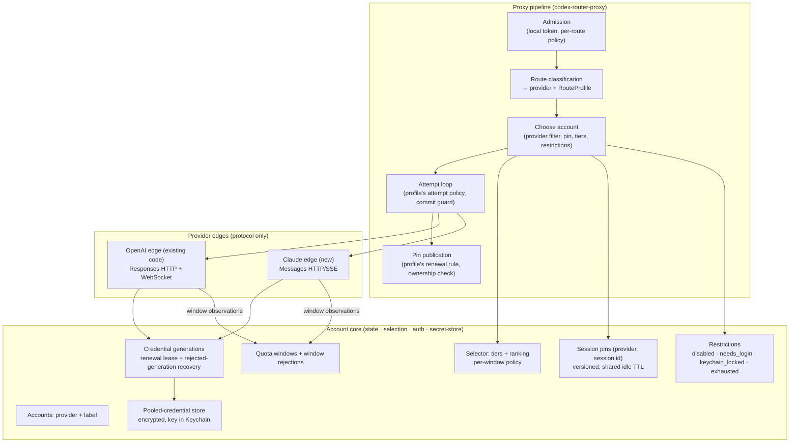
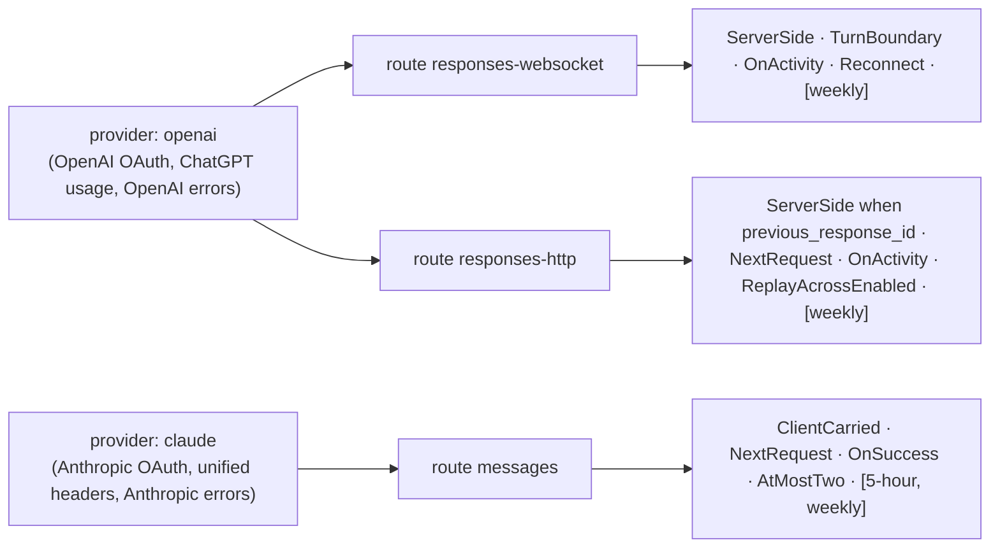
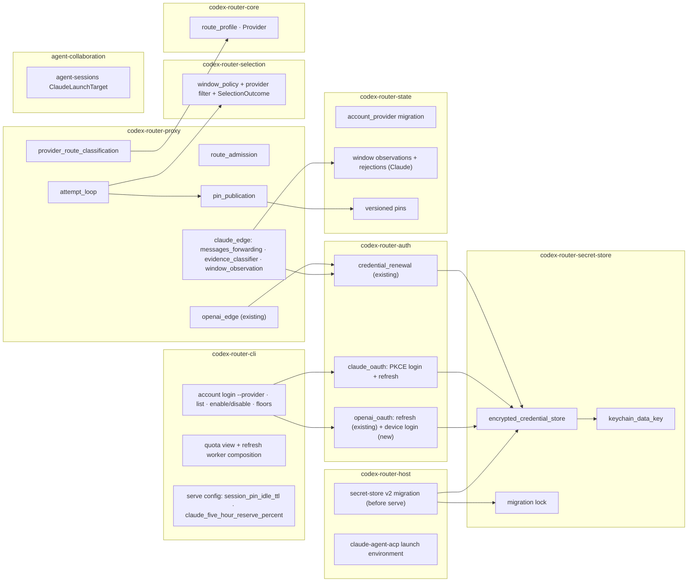
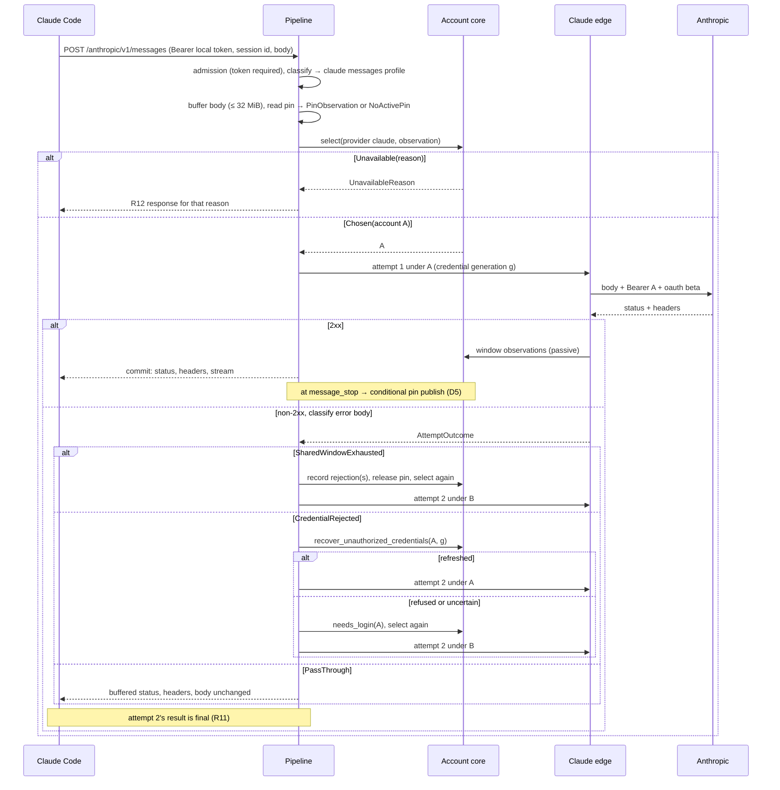
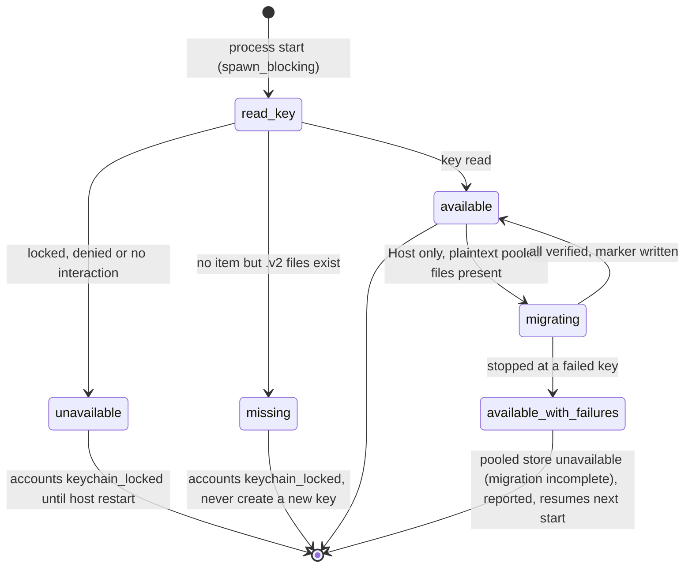

# Claude OAuth account routing — Program Design

Governing artifacts: [requirements.md](requirements.md) (U1–U13) and [specification.md](specification.md)
(E1–E9, R1–R25). This document is the structural How: which parts of codex-router change, what each part
owns, how a Claude request flows, and where each rule is proved. Source anchors refer to `origin/main`
at `7227ff4`. The evidence maps (`codex-proxy-map.md`, `codex-proxy-map-2.md`, research reports) are in
`tmp/design-workflows/2026-09-28-claude-oauth-routing/`. Round-1 review findings G1–G12 are recorded in
`tmp/design-review/2026-09-28-claude-oauth-routing/design-review-round1.md`; this revision answers them.

## 1. The shape

Three layers. The account core decides using **route profiles**, which are typed trait properties per
route. It never branches on a provider's name. Each provider's edge owns its protocol.



### Provider → routes → profiles



```rust
// codex-router-core::route_profile (new module; compile-time constants per route)
pub struct RouteProfile {
    pub provider: Provider,               // Openai | Claude — used only to filter candidate accounts
    pub continuation: ContinuationModel,  // ServerSide { hard_pin: HardPinKey } | ClientCarried
    pub switch_point: SwitchPoint,        // TurnBoundary | NextRequest
    pub pin_renewal: PinRenewal,          // OnActivity | OnSuccess
    pub attempt_policy: AttemptPolicy,    // ReplayAcrossEnabled | AtMostTwo | Reconnect
    pub windows: &'static [WindowPolicy], // WindowKind + switch rule (see D6)
}
```

The profiles for today's two Codex routes encode exactly today's behaviour (R21). Owner-tunable numbers
live in `serve` config, not in profiles: `session_pin_idle_ttl` (default 75 min, R4) and
`claude_five_hour_reserve_percent` (default 95, R6). Weekly floors stay per account
(`account set-weekly-floor`).

| Layer | Owns | Must not know |
| --- | --- | --- |
| Pipeline | admission, route → (provider, profile), the attempt loop and commit guard, pin publication | wire formats, error bodies, endpoints |
| Account core | accounts and provider, restrictions, windows and window rejections, selection, pins, credential generations, pooled-credential encryption | HTTP, WebSocket, provider endpoints, route names |
| Edge | the route's wire contract, credential header application, response → `AttemptOutcome`, quota fetch/parse, OAuth login/refresh client | selection policy, other providers |

**Dependency rule.** Core crates (`codex-router-core`, `-state`, `-selection`, `-auth`,
`-secret-store`) never depend on edge modules. Edges live in `codex-router-proxy` (request path) and
implement core-defined traits for quota fetching and OAuth (`QuotaFetcher`, `CredentialRefreshClient`,
`AccountLoginFlow`), which `codex-router-cli` composes. The pipeline talks to edges through the closed
`ProviderEdge` enum in `codex-router-proxy` (D3). This resolves the round-1 contradiction (G9).

## 2. Current system and what changes

| Today (anchor) | Change |
| --- | --- |
| Exact Codex route match, no prefix (`routes.rs:69-91`, `server.rs:1451-1474`) | Classification first maps a path prefix to (provider, route, profile): `POST /anthropic/v1/messages` → Claude `messages`; every other `/anthropic/*` path → rejected (D12); everything else → today's Codex classification, unchanged. |
| `accounts` has no provider (`account_baseline.sql:1-6`) | Migration adds `provider`; existing rows `openai` (D1, R19). |
| Pins keyed by session id only; last_seen renewed at selection and on forwarded WS frames (`session_account_affinity_cache.rs:15-17, 102-129, 213-245`) | Pins keyed by (provider, session id) with a version; TTL from config; renewal per profile (Codex: on activity, unchanged; Claude: on success with an ownership check, D5). |
| `RouteBand` names Codex routes (`core/routes.rs:8-44`) | Kept for OpenAI; Claude windows are stored under a Claude band `claude_messages`. The band column is a string and gains no constraint (D1, G8). |
| Selector reserve/early-switch policy is window-length based and weekly-floor specific (`burn_down.rs:49-59, 1305-1318, 1658-1670, 1739-1757`) | Adds an explicit per-window policy input; the OpenAI inputs reproduce today's decisions exactly (D6). |
| Quota success write deletes and replaces all windows and route-band state (`sqlite.rs:1411-1464`) | Unchanged for OpenAI. Claude observations go through a new per-window upsert with observation ordering and a rejection table (D9). |
| Pooled OAuth bundles in plaintext 0600 files, `openai_*` keys (`account_tokens.rs:19-27`) | Pooled credentials encrypted under a Keychain-held key, with provider-scoped keys. The local token and affinity secret are not pooled credentials and stay as they are (D7). |
| OpenAI login runs Codex in a temp `CODEX_HOME` and reads `auth.json` (`account.rs:404-473`) | Router-native OpenAI device-code login; no child process writes tokens (D8). |
| Retry budget = enabled accounts; replay ≤ 2 MiB complete JSON; 64 KiB precommit probe (`server.rs:1374-1437, 1721-1804, 1880-1918`) | Unchanged for OpenAI. Claude uses its own replay buffer and commit point (D4). |
| Local token gate on only with `--require-local-token` (`cli/lib.rs:249-272`, `local_auth.rs:80-130`) | The Claude route always requires the local token, independent of that flag (D11). |
| Host's `claude-agent-acp` gets no environment (`collaboration_runtime.rs:54-72`) | The Host fills the existing environment vector (D10). |
| `agent-sessions` launches Codex only (`session_command_dispatch.rs:490-555`) | Gains a Claude launch target (D10). |

## 3. Design decisions

**D1 — Provider is part of account identity (owner: storage option A).** Migration
`2026MMDD0001_account_provider.sql`:
- adds `accounts.provider TEXT NOT NULL`, backfills `'openai'`, and makes it NOT NULL through the SQLite
  table-rebuild pattern inside the migration's transaction;
- adds `provider` to `session_account_affinities` (backfill `'openai'`) with the key
  `(provider, session_id)`, plus a `pin_version INTEGER NOT NULL DEFAULT 0` column (D5).

No CHECK on provider values, per the repository rule (`AGENTS.md:69-77`). Provider membership is a Rust
`Provider` enum parsed on every row decode; an unknown value fails closed with a field-tagged
`CorruptAccount { field: "provider" }` (G8). Labels stay unique across providers because account ids are
label-derived (`acct_<label>`). `account login` refuses a label that belongs to a different account or a
different provider. Logging in again to the same account (same label, same provider) is the existing
re-login path and stays allowed; it activates a new credential generation (R21; clears `needs_login`).

**D2 — One listener, route prefix.** `/anthropic` on the existing `serve` listener. One process owns the
account core's in-memory state (pins, runtime exclusions). A second listener in the same process would
also work; a prefix is simpler for Claude Code's `ANTHROPIC_BASE_URL`.

**D3 — Closed edge enum.** `ProviderEdge::{OpenAi(OpenAiEdge), Claude(ClaudeEdge)}` in
`codex-router-proxy`. The operations:
- `classify_route`;
- `prepare_upstream(request, credential) -> UpstreamRequest`;
- `classify_outcome(status, headers, error_body) -> AttemptOutcome`;
- `observe(headers) -> Vec<WindowObservation>`.

The OpenAI variant wraps today's code paths without behaviour change.

**D4 — Attempt policy and replay (G5).** The pipeline runs the loop the route profile names.
- `ReplayAcrossEnabled` (Codex HTTP) keeps today's code: the 2 MiB complete-JSON replay, the 64 KiB
  precommit probe, and a budget equal to the number of enabled accounts.
- `AtMostTwo` (Claude): the Claude edge buffers the whole request body before attempt 1, bounded by
  32 MiB, which is Anthropic's documented Messages request limit. A larger body is rejected by Router with
  413 before any attempt, as Anthropic would reject it.

  **Commit point:** Router forwards nothing to the client until attempt 1's status is known.
  - 2xx: status and headers go to the client and the stream flows; the attempt is **committed**.
  - Non-2xx: Router reads the error body up to 64 KiB.
    - If the whole body fits, the classifier sees the complete body.
    - If the body is longer, the classifier gets headers plus an explicitly **incomplete** prefix. With
      incomplete evidence it may still return `SharedWindowExhausted` (the unified headers carry that
      evidence), but it never returns `CredentialRejected` (that needs the body); anything else becomes
      `PassThrough(MalformedEvidence)`.
    - On pass-through, the client gets the status, the headers, the buffered prefix and then the unread
      remainder of the upstream body streamed unchanged, so nothing is truncated.
    - On a second attempt, the unread remainder of attempt 1's body is discarded by closing that upstream
      response.
  - Nothing after commit triggers a second attempt (R7, R11).

  Attempt 2 sends the same buffered request body. Its result is always final (R11) and follows the same
  commit and pass-through rules.

**D5 — Pins: shared TTL, per-profile renewal, versioned ownership (G1, G3).**
- `OnActivity` (Codex routes): today's triggers (selection publication, forwarded `response.create`),
  unchanged apart from the TTL value (R4 as corrected, R21).
- `OnSuccess` (Claude): every session key has one pin row that persists across expiry and release,
  carrying a monotonically increasing `pin_version` and an `account` that is `NULL` when no pin is active.
  Expiry is computed from `last_seen`.
  - **Observation.** At admission the pipeline reads `PinObservation { active_account: Option<AccountId>,
    version }`. An expired row reads as `active_account: None` with its stored version. A missing row reads
    as version 0.
  - **Every change bumps the version**, and every change is compare-and-set on the observed version:
    create, release (R5 and R8/R9) and publication.
  - **Success** is a 2xx whose SSE stream reaches `message_stop` (or, for a non-stream request, a
    complete 2xx body). A 2xx stream that ends in an `error` event, or is cut off, is not a success.
  - **Publication on success** (one SQLite statement), with the stored version still equal to the
    observed version:
    - observed `None` → set the attempt's account (version + 1);
    - observed `Some(A)` and the attempt ran on A, not expired → renew `last_seen` (version unchanged);
    - any other case → no change.

    If the stored version has moved on, nothing changes. So a late success can never resurrect an expired
    or released pin, or steal one another request created in between (R3a; Specification "Behaviour at
    the edges").
  - **Attempt 2's authority depends on the recovery branch.**
    - **R9, refresh succeeded:** attempt 2 runs on the **same** account A, never another, and keeps
      attempt 1's observation. On success it renews (if A was pinned at that version) or creates the
      pin on A (if it observed no pin and the version is unchanged). A pin created meanwhile by another
      request just means no change.
    - **R8 exhaustion, or R9 refused or uncertain:** A is no longer eligible, so the pipeline releases the
      pin by compare-and-set from its observation (`Some(A), v` → `None, v + 1`) and takes the returned
      `None, v + 1` as attempt 2's authority. If that release loses the race, it re-reads the pin:
      - an active pin on an eligible account C → attempt 2 runs on C with that observation;
      - otherwise → attempt 2 selects afresh with the fresh observation.

      Attempt 1's observation is discarded, so stale first-attempt authority can never publish.
    - In both branches the two-attempt cap and the eligibility checks apply.

  - **Admission release under contention (R5; Lead decision 2026-10-01, found in P6s):** when the observed pin is a
    Reserve account that R5 releases (a Preferred candidate exists), admission releases it by compare-and-set. If
    that loses and the re-read pin is also releasable, admission tries **one** more compare-and-set release; if
    that loses too, it selects afresh with the latest observation (publication may then make no change, so R5 can
    lag by one request under contention). Bounded: at most two release attempts per admission. The returned
    observation is always the latest read.

**D6 — Selection: one selector, explicit per-window policy (G6).** `codex-router-selection` gains
`WindowPolicy { kind, rule }` with:
- `rule = LegacyOpenAi` — reproduces today's decisions exactly: the long-window reserve thresholds,
  short-window survival guard, `HeldFloorSwitch` early switch and last-resort pool;
- `rule = NearFullReserve { percent }` — Claude 5-hour: used ≥ percent → reserve tier;
- `rule = WeeklyFloor { early_switch_bps: 300 }` — Claude weekly: the same floor semantics as OpenAI's
  weekly floor (hard floor excludes; floor+3 pp → reserve; a configured floor excludes an account with no
  fresh weekly observation).

Candidates are filtered by `profile.provider` before assessment. The selector returns:

```rust
enum SelectionOutcome {
  Chosen { account, tier: Tier, reason: ChoiceReason },   // Tier: Preferred | Reserve | Unknown | LastResort(openai only)
  Unavailable(UnavailableReason),                          // ordered per R12
}
enum UnavailableReason { NoneConfiguredOrEnabled, KeyUnreadable, AllNeedLogin { accounts }, AllExhausted { earliest_headroom: Option<Timestamp> }, HeldByFloors { accounts } }
```

R5's reserve release: a pinned Claude account in `Reserve` is released only when some candidate would be
`Preferred`. The OpenAI profiles get `LegacyOpenAi`; their decision tests stay green unmodified (R21).

**D7 — Pooled credentials encrypted under one Keychain key (owner: option A; G2, G7).**

*What is encrypted:* only pooled account credential bundles, of both providers (U13). The local router
token and the affinity HMAC secret stay in the hardened file store. They are not pooled credentials, and
keeping them readable without the key lets the Claude route authenticate even when the key is locked
(G2).

*Envelope:* file `<key>.v2`, JSON `{ "format": 2, "nonce": base64(12 bytes), "ciphertext":
base64(AES-256-GCM(plaintext, aad = key name)) }`, written via temp file and rename.

*Data key:* 32 random bytes in the login Keychain through `keyring-core` +
`apple-native-keyring-store`. Service is `codex-router`; account is `pooled-credential-key:<store id>`,
where the store id is a random UUID written once to `<router-root>/secrets/store-id` (plaintext, not
secret).
- *Creation authority:* one procedure, run only while holding the store's **exclusive** lock
  (`<router-root>/secrets/.store.lock`, flock):
  1. if `store-id` is absent, write a new UUID via temp file, fsync and rename;
  2. read the Keychain item for that store id;
  3. if the item is absent and **no `.v2` file exists**, create it with add-if-absent (on a duplicate,
     read the existing item).

  The rule "create only when no ciphertext exists" also covers a crash between steps 1 and 3: the next
  start finds `store-id`, no key and no ciphertext, and creates the key. The exclusive lock means two
  processes can never publish different store ids.
- *Missing key while `.v2` files exist* → `KeyMissing`, the same user-visible state as `keychain_locked`.
  Router never creates a replacement key, because that would strand the tokens.

*Who reads the key:* every process that touches pooled credentials reads the key once at its own start,
in `spawn_blocking`, and holds it in memory, zeroized on drop:
- `serve`: the request path, the upkeep worker and background quota refresh;
- standalone CLI commands that resolve pooled credentials: `account login`, `quota refresh`;
- the Host only for the migration (below).

All processes run the same binary, so one owner "Always Allow" after an upgrade covers every later read.
The first read happens at `host restart`.

*Key unreadable at start:*
- that process marks the whole store `KeyUnavailable`;
- `serve` still starts: the Claude route answers R12 reason 2; the Codex routes answer their existing
  credential-unavailable response (R21 exception, U13);
- CLI commands fail with a clear "Keychain locked" error;
- no automatic retry (R25); recovery is the owner's `host restart` (R23).

*Migration v2 (R24; G7):* runs in the Host before it starts `serve`, holding the exclusive store lock
(`.store.lock`). Every other writer of pooled credentials (`account login`, credential renewal) takes the
same lock in shared mode, so none can race the conversion. For each pooled key:
- plaintext only → write `.v2` (temp + rename), decrypt it back and compare, then delete the plaintext;
- `.v2` and plaintext both present (crash) → verify that `.v2` decrypts to the plaintext, then delete the
  plaintext; if it doesn't match, keep both and report.

When every key is done, write `format-v2.marker`.

On the first key that is unexpected or fails verification, conversion **stops** (R24):
- keys not yet converted keep their plaintext files;
- the Host reports which accounts were not converted;
- R22 is not claimed until the conversion completes, and no account's credential health changes: no
  `needs_login` is set, because the credential itself hasn't been rejected.

*No runtime plaintext reads:* only the migration runner reads legacy plaintext files. Normal
pooled-credential reads are v2-only. While the marker is absent (migration incomplete), the pooled store
reports `StoreUnavailable(MigrationIncomplete { accounts })`:
- `serve` starts; the Claude route answers R12 reason 2, whose message names the incomplete migration
  (Specification R12 and R24, as amended);
- the Codex routes give their credential-unavailable response;
- `account list` and `quota` name the unconverted accounts.

No credential health changes. The plaintext sources stay in place for repair, and the next Host start
resumes the conversion. This keeps a single read path (hard cutover).

*Downgrade:* D1's state migration ships in the same release. An older binary refuses the database
because of the unknown migration version (`account_migrations.rs:141-155`) before touching credentials.
Older `token` commands only touch the local token, which is unchanged. The proof includes this ordering.

**D8 — Router-native logins; no token ever written in plaintext (G10).**
- *Claude:* authorization code with PKCE; authorize at `claude.ai/oauth/authorize`, exchange at
  `platform.claude.com/v1/oauth/token`, with Anthropic's hosted callback and the owner pasting the
  `code#state`. The client id is a named constant (Anthropic's public Claude Code client) with an
  override. Refresh: the `refresh_token` grant, using the returned `refresh_token` when present and
  keeping the old one otherwise.
- *OpenAI:* implement the device-code protocol exactly as upstream Codex does
  (`openai/codex login/src/device_code_auth.rs:62-107, 165-231`):
  1. `POST /api/accounts/deviceauth/usercode`;
  2. show the code and URL;
  3. poll `/api/accounts/deviceauth/token` until the owner approves, the code expires or the owner
     cancels;
  4. receive the authorization code and PKCE verifier;
  5. exchange at the token endpoint the existing refresh client already uses;
  6. validate the id token claims Router uses today;
  7. activate an encrypted generation.

  *Rejected alternative:* Codex's strict keyring mode in a temp home. Tokens would land in a Codex-owned
  Keychain item that Router must then read and delete across a Codex ACL, which means prompts at login
  plus an item Router doesn't own. It doesn't meet U13's "one Router key" and can't be cleaned up
  reliably. *Reopen if* OpenAI changes the device-auth endpoints.

Both flows keep tokens in memory and hand them to the existing auth coordinator, which activates them.
- `codex-router-auth` stays the one owner of generation activation: `CredentialActivation::activate_login`
  for a new login, and the existing renewal path for refreshes (`credential_renewal.rs:575-608`).
- The coordinator claims the generation in SQLite, calls `EncryptedCredentialStore::write_staged(key,
  bundle)` (which only encrypts and writes the envelope), and then activates the claimed generation in
  SQLite.
- The encrypted store never touches SQLite.

**D9 — Claude quota observations and exhaustion are transactional (G4).** A new store API in
`codex-router-state`, used only by the Claude profile's windows:
- `record_window_observation(account, window_kind, remaining, reset, observation_started_at)`: a
  per-window upsert. It never deletes other windows. A row is written only if its
  `observation_started_at` is newer than the stored one.
- `record_window_rejection(account, window_kind, rejected_at, reported_reset)`: inserts into
  `account_window_rejections(account_id, window_kind, rejected_at, reported_reset)`. Rejections
  accumulate, one per window.
- `record_window_rejection` is an upsert per (account, window): it keeps the **latest** `rejected_at` and
  that rejection's `reported_reset`, so concurrent duplicate rejections of the same window cannot move the
  barrier backwards.
- A rejection row is deleted inside the same transaction as an observation of the same window only when
  all three hold:
  - `observation_started_at > rejected_at`;
  - the headroom is positive;
  - the observation is still fresh when it is applied (`applied_at - observation_started_at <=` the
    freshness interval).

  A slow poll that started after the rejection but lands stale therefore cannot clear it (R8a;
  Specification "stale cannot clear"). The account is `exhausted` while any rejection row exists.

Sources:
- passive: every Claude response's unified headers produce observations timestamped at request start;
- active: the refresh worker polls `/api/oauth/usage` for accounts idle longer than the refresh interval,
  timestamped at poll start.

Restarts keep the rejection rows. The R12 hint is the minimum, over exhausted accounts, of the maximum
`reported_reset` among each account's rejection rows, omitted if any is unknown. OpenAI keeps its
existing writer.

**D10 — Clients (G11).**
- *Hosted sessions (R15):* the Host builds the `claude-agent-acp` launch with environment
  `ANTHROPIC_BASE_URL=http://127.0.0.1:<port>/anthropic` and `ANTHROPIC_AUTH_TOKEN=<local token>`, read
  from the unencrypted local-token file, through the existing `ExternalProviderLaunch.environment`
  vector.
- *agent-sessions (R13–R14):* a `ClaudeLaunchTarget`:
  - lists active Claude sessions (the existing `claude-local` discovery) and stored Claude transcripts
    under `~/.claude/projects` (transcript metadata only, not login stores);
  - launches `claude` or `claude --resume <id>` with the same two environment variables for that child
    only;
  - preflights `GET /healthz`, and fails with a clear message if Router is down (R14).

- *Endpoint discovery (Lead decision 2026-09-30, filling a gap found in PR7-impl):* the Host writes an
  additive `routerProxyEndpoint` (from `HostConfig::router_endpoint()`, so a custom `--port` is honoured) into the
  service directory's `service.json`, alongside the existing runtime handoff fields. `agent-sessions` reads it
  from its service directory; if it is absent it fails with a clear message ("Router proxy endpoint not
  published; restart the Router Host") and never falls back to a default port.

- *Claude upstream destination (Lead decision 2026-09-30, gap found in PR6/PR7):* the Claude edge uses its own
  provider-specific upstream endpoint, fixed to `https://api.anthropic.com` in release builds (no runtime override,
  so pooled OAuth tokens can never be redirected). For acceptance only, a Claude upstream override exists in debug
  builds (`cfg(debug_assertions)`) and only with debug isolation required: a debug-only `serve` flag, passed by the
  isolated debug Host from a debug-only environment variable (same pattern as
  `CODEX_ROUTER_DEBUG_APP_SERVER_SOCKET`). Proof: a release-build test shows the override is absent/rejected.

**D10b — Claude evidence classifier (R10a).** A pure function
`classify(status, headers, body_prefix) -> AttemptOutcome`:

```rust
enum AttemptOutcome {
  Success,                                               // 2xx (success confirmed at stream end, D5)
  SharedWindowExhausted { windows: Vec<WindowKind>, resets: Vec<Option<Timestamp>> },
  CredentialRejected,
  PassThrough(PassThroughReason),
  NoResponse(TransportFailure),
}
enum PassThroughReason { Overloaded, ServerError, RateThrottled, ModelOrOverageLimit, RequestRejected, UnattributedLimit, MalformedEvidence }
```

- `SharedWindowExhausted` requires a unified status of `rejected` whose representative claim names the
  5-hour or 7-day window.
- `CredentialRejected` requires an `authentication_error` whose message identifies an invalid or expired
  OAuth token.
- Everything else is `PassThrough`, including a 401 caused by missing capability headers.

Fixtures are captured, provenance-tagged response examples (§9).

**D11 — Admission for the Claude route (G2).** A per-route admission policy: the Claude route always
requires the local token; the Codex routes keep `--require-local-token` behaviour.

*Token provisioning:* there is exactly one creator. The existing `initialize` reads and then writes
with no lock (`cli/src/token.rs:66-98`), so two concurrent callers could each create a different token.
- Creation moves to `ensure_local_token`, which holds an exclusive lock
  (`<router-root>/secrets/.token.lock`, flock), re-reads inside the lock, and creates the token only if it
  is still absent. An existing token is never replaced.
- Only the process that starts the router calls it: the Host as its first startup step, before it starts
  `serve` and before it builds the `claude-agent-acp` environment; or a standalone `serve` at its start.
- `agent-sessions` never creates a token. It waits for Router readiness (`/healthz`), then reads the
  token; if the token is absent it fails with "Router is not ready" (R14). `serve` then loads the token whenever the Claude edge is
enabled, and uses the existing reload watcher. Codex's optional-auth behaviour is unchanged: with
`--require-local-token` off, Codex requests still don't need it. A previously tokenless installation is a
proof case. Rotation rejects the old token
(existing policy), so routed Claude sessions must be relaunched after `token rotate`; `agent-sessions`
tells the owner so. The Claude edge strips the client's `Authorization`, sets `Bearer <account access
token>`, and appends `oauth-2025-04-20` to `anthropic-beta`, keeping the client's values (R16).

**D12 — No catch-all forwarding (G12).** Only `POST /anthropic/v1/messages` is routed. Any other
`/anthropic/*` request gets 404 with a body naming the path as unsupported by Router, and no upstream
call. If real-client acceptance shows Claude Code needs another path (for example
`/v1/messages/count_tokens`), that path returns through spec-design as an added route.

## 4. Components and ownership



## 5. Entity bindings (G9)

| Entity | Home and type | Persisted as | Validation |
| --- | --- | --- | --- |
| E1 Provider | `codex_router_core::Provider` enum (`Openai`, `Claude`) | `accounts.provider`, `session_account_affinities.provider` (TEXT) | parsed on decode; unknown → `CorruptAccount { field }` |
| E2 Account | existing `AccountId` newtype (`acct_<label>`) + `Provider` | `accounts` row | label uniqueness at `account login`; provider immutable |
| Restrictions | `AccountRestrictions { disabled, needs_login: Option<NeedsLoginReason>, exhausted: bool }` plus process-wide `KeyAvailability` | `accounts.status`; credential generation state; `account_window_rejections`; `KeyAvailability` in memory | each set/cleared only by its own event (Specification E2 table) |
| E3 Account credential | existing generation model, activated only by the `codex-router-auth` coordinator; `CredentialBundle::{OpenAi(..), Claude { access, refresh, expires_at }}` | `.v2` envelopes written by `EncryptedCredentialStore::write_staged`, key `<provider>_credential_bundle.<account>.<generation>`; generation state in SQLite | envelope format 2; AAD = key name |
| E4 Quota window | `WindowObservation { account, kind: WindowKind, remaining_bps, reset_at, observation_started_at }` | OpenAI: existing tables; Claude: per-window upsert rows | stale beyond the refresh interval |
| E5 Client session | `SessionKey { provider, session_id: SessionId }`; Claude reads `x-claude-code-session-id` | pin row key | non-empty; absent → no session |
| E6 Session pin | `Pin { key, account: Option<AccountId>, pin_version, last_seen }`; `PinObservation { active_account, version }` | `session_account_affinities` (row persists across expiry and release) | every change is compare-and-set on the version (D5) |
| E7 Routed request | `RoutedRequest { profile, session, buffered_body (Claude), attempts: ArrayVec<Attempt, 2> }` | not persisted | Claude body ≤ 32 MiB |
| E9 Attempt | `Attempt { account, credential_generation, pin_observation, committed: bool, outcome: AttemptOutcome }` | observability log only | — |
| E8 Routed launch | `ClaudeLaunch { session: Option<SessionId>, cwd, env: [base_url, auth_token] }` | not persisted | Router health preflight |

## 6. Flows

### A Claude request



### Keychain and migration at start



## 7. Failure, concurrency and consistency

| Situation | Behaviour | Why it holds |
| --- | --- | --- |
| Two requests hit an exhausted account | each records its rejection (idempotent per window) and makes its own attempt 2 | rejections keyed by (account, window) |
| Two requests trigger a refresh of one account | the existing lease makes one refresh; the other gets its result | `credential_renewal.rs:204-260` |
| Refresh times out after the token may be spent | `needs_login`; no reuse | existing ambiguous-outcome handling (`credential_renewal.rs:524-568`) |
| A poll started before a rejection finishes after it | cannot delete the rejection | `observation_started_at > rejected_at` rule (D9) |
| Partial passive observation races a full poll | per-window upsert keeps the newest per window | per-window rows, ordered by start time |
| Late success after the pin expired or was released | no change | versioned conditional publish (D5) |
| Overlapping first requests of a new session | the first success creates the pin; later successes on other accounts don't move it | same |
| An error after commit | passed through, no second attempt | commit flag set before the first byte is forwarded |
| Key unreadable at start | the process serves R12 reason 2 / credential-unavailable; no store access | `KeyAvailability` checked before any pooled read |
| Crash during migration | resume verifies existing `.v2` against plaintext before deleting | per-key idempotent transition (D7) |
| `account login` during migration | waits on the store lock | shared/exclusive flock (D7) |
| Two processes start on a fresh store | one publishes the store id and key; the other reads them | exclusive store lock + create-only-without-ciphertext (D7) |
| Token rotation with routed sessions running | their requests get 401 Old; relaunch through `agent-sessions` | existing rotation policy (D11) |

## 8. Migrations and cutover

1. **State:** `account_provider` migration (D1). Proof: copied pre-change database, every row
   `openai`, invalid provider value fails decode.
2. **Secrets:** v2 migration in the Host before `serve` starts (D7). Proof: crash at each boundary,
   corrupt input, concurrent login, missing key with ciphertext.
3. **Code:** the OpenAI profiles reproduce today's behaviour; the existing Codex suites are the guard
   (R21).

The release notes state that downgrade is blocked by the state migration and that routed Claude sessions
must be relaunched after token rotation.

## 9. Requirement realization and proof

| R | Owner | Interface / state | Proof (seam) |
| --- | --- | --- | --- |
| R1 | selection + restrictions | `SelectionOutcome::Chosen` over the provider-filtered candidates | selector unit tests |
| R2, R3a, R4, R5 | pin_publication + versioned pins | `PinObservation`, conditional publish, TTL config | unit tests + attempt-loop tests (late success, overlap, release, expiry, both renewal rules) |
| R3, R6 | window_policy | `WindowPolicy`, tiers | selector tests incl. every `LegacyOpenAi` branch unchanged |
| R7, R11 | attempt_loop | commit flag, `AtMostTwo` | loop tests with a scripted edge (error after commit, attempt-2 failure) |
| R8, R8a | claude_edge + window rejections | `SharedWindowExhausted`, rejection rows | fake-upstream integration + state tests (poll races, two windows, restart) |
| R9 | attempt_loop + `recover_unauthorized_credentials` | rejected generation | fake-upstream + fake OAuth (refreshed / refused / timeout) |
| R10, R10a, R10b | evidence_classifier | `AttemptOutcome`, `PassThroughReason` | fixtures from documented or captured responses with provenance, including a capability-header 401, overage-only, model-only and a bare 429 |
| R12 | selection + pipeline | `UnavailableReason` (ordered) | integration per reason; **real Claude Code** shows its usage-limit message for `AllExhausted` |
| R13, R14 | agent-sessions ClaudeLaunchTarget | `ClaudeLaunch` | **real Claude Code** launched new and resumed via `agent-sessions` against an isolated Router and fake upstream; plain `claude` config byte-compare; Router-down preflight |
| R15 | Host launch environment | `ExternalProviderLaunch.environment` | **real `claude-agent-acp`** in an isolated Host reaching the fake upstream through the pool |
| R16 | claude_edge | header application | fake upstream records the body and headers |
| R17 | claude_oauth, openai_oauth | login flows | fake OAuth servers (PKCE paste; device code: issue, poll, expiry, cancel, exchange) |
| R18 | login flows; `KeychainAccess` | no native-store access | **Files:** tests run under a `sandbox-exec` profile denying reads of `~/.codex/auth.json` and `~/.claude/.credentials.json`; a denied read is logged by the sandbox and the test asserts the log is empty, not just a green exit. **Keychain:** every Keychain call in Router goes through one `KeychainAccess` interface whose production implementation only accepts Router's own service (`codex-router`) and refuses any other service name with an error. A unit test proves the refusal, a crate-level test proves no other Keychain API is referenced (a grep over the Security framework calls), and integration tests use a recording implementation that asserts only Router's item was queried. |
| R19, R20 | state migration, CLI | provider column, mixed-provider views | migration test; CLI tests (duplicate label refused, stale / unknown) |
| R21 | OpenAI profiles | `LegacyOpenAi`, `ReplayAcrossEnabled`, `OnActivity` | existing Codex suites unmodified except the TTL value |
| R22, R22a | encrypted_credential_store, keychain_data_key | envelope, data key | a temporary keychain file; filesystem write tracing during login, refresh and migration (including child processes and deleted files); an unrelated test binary cannot read the key and cannot decrypt the files |
| R23, R25 | key availability | `KeyAvailability` | locked or denied temporary keychain → `keychain_locked`, no plaintext fallback, recovery on restart without login; no prompt during refresh |
| R24 | Host migration | per-key transition + lock | crash matrix, corrupt input, concurrent login, missing key |
| Security, privacy, observability | pipeline + edges | redaction, loopback bind, per-attempt log | credential-pattern scans of logs and outputs; loopback test; log schema test |
| End-to-end | all | — | owner-gated: two real Claude accounts, routed Claude Code via `agent-sessions`, forced switch |

## 10. Open items

- **Auxiliary Claude Code paths:** unsupported until real-client acceptance shows a need (D12); any
  addition returns through spec-design.
- **API-key-mode side effects:** with `ANTHROPIC_AUTH_TOKEN`, Claude Code may treat the session as API
  billing in its UI. This is a hypothesis to observe in acceptance, not an accepted outcome.
- **Subscription system-prompt requirement:** Claude Code sends its own system prompt; Router never
  changes it (R16). Confirmed in acceptance.
- **Deferred:** Developer ID signing; the codex-router → agent-router rename.
