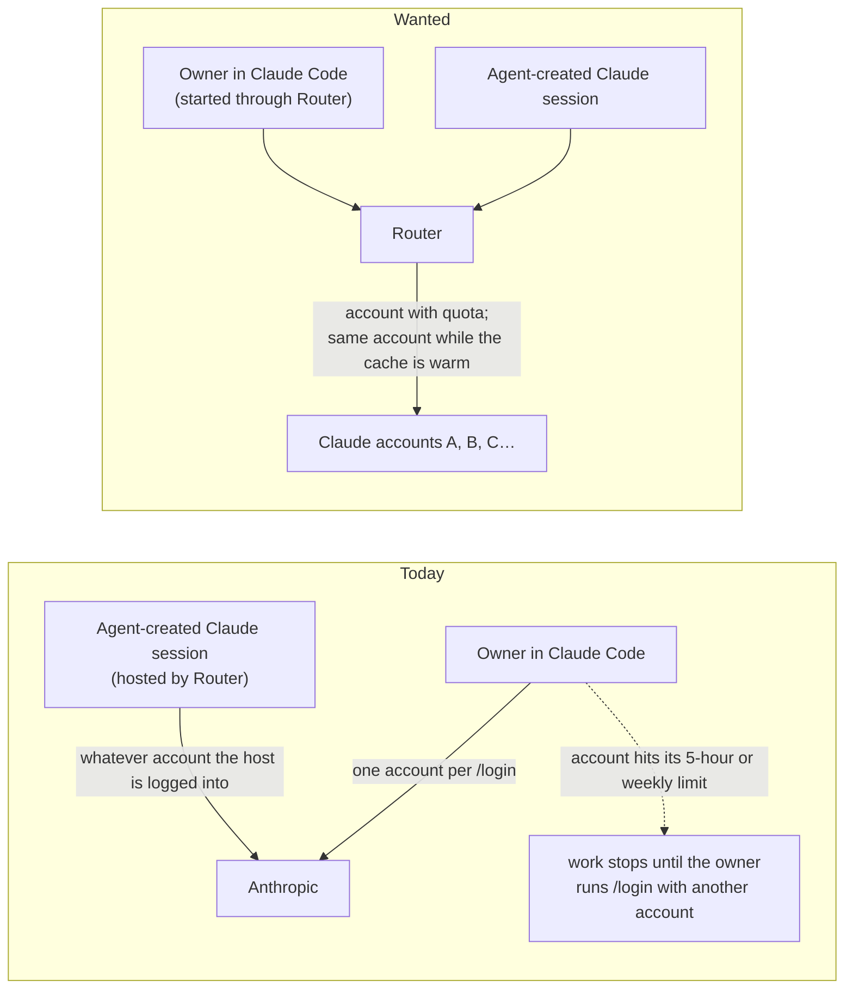

# Claude OAuth account routing — Requirements

## Purpose and boundary

The owner runs Claude Code on several Claude subscription accounts and switches between them by hand
(`/login`) when one runs out. codex-router already solves this for Codex: its local proxy picks the
OpenAI account that has quota and keeps a session on one account while that is cheap. This change
brings the same behaviour to Claude Code and to the Claude sessions Router hosts, through the same
Router.

The scope covers:

- Claude Code model traffic sent through Router, for sessions the owner starts through Router and for
  Claude sessions Router hosts for agents;
- choosing a Claude subscription account with quota, keeping a session on it for prompt-cache reuse, and
  moving it when the account runs low;
- adding, refreshing and managing Claude accounts in Router;
- one account model for OpenAI and Claude accounts.

It does not cover Anthropic's own product behaviour, Cursor, or API-key (Console) billing.

Authority: owner decisions on 2026-09-28 in the codex-router Main session, recorded on the Agent Router
board, topic "Claude OAuth account routing" (`01a0e7d1-7199`), root `01a0e7d1-71a5`, messages
`01a0e7d6-dbe5` (policy risk accepted, architecture) and `01a0e7fc-949d` (the eight decisions below).
Evidence is in `tmp/design-workflows/2026-09-28-claude-oauth-routing/`.

## Who is affected

| Class | Job | Current pain (evidence) |
| --- | --- | --- |
| Owner as Claude Code user | Works in interactive Claude Code sessions for hours. | Each session is bound to one account; when its 5-hour or weekly limit is reached the owner must `/login` to another account by hand and loses the prompt cache. Owner statement, 2026-09-28. |
| Agents using Router-hosted Claude sessions | Run Claude work that Router creates and prompts. | They use whatever single account the host is logged into, so one busy account throttles every agent. |
| Owner as Router operator | Adds accounts, sets floors, reads quota. | Router manages only OpenAI accounts; Claude accounts are outside its account list and quota view. |
| Codex users of Router | Use Codex through Router's account pool. | No pain; they are affected because the account model and the session-pin idle time change (U9, U4). |

## Authorized needs

All rows are `authorized` and normative-eligible. U10, U11 and the non-goals were proposed by Main and
approved by the owner on 2026-09-28.

| ID | Affected class | Need and reason | Authority | Priority |
| --- | --- | --- | --- | --- |
| U1 | Owner as Claude Code user; agents | A Claude Code request through Router automatically uses a Claude subscription account that has quota, so work does not stop when one account runs out. | authorized (owner: "automatically switches to the OAuth account that has quota") | must |
| U2 | Owner as Claude Code user; agents | A session stays on the account it started on while that account has quota, so the prompt cache stays warm. This is the same soft stickiness Codex uses. | authorized (owner: "stickiness to still exist for the same mechanism", only for cache) | must |
| U3 | Owner as Claude Code user; agents | When the session's account nears its 5-hour limit (configurable near-full threshold) or its weekly floor, the next request moves the session to another account with quota. | authorized (owner answer: "yes to near full threshold") | must |
| U4 | All Router users (Claude and Codex) | A session idle for longer than 75 minutes is re-assigned to the best account on its next request. The idle time is the same for Claude and Codex going forward and is configurable. | authorized (owner: "maybe 75 min for both then going forward") | must |
| U5 | Owner as Claude Code user; agents | Failures caused by the account (quota exhausted, login no longer valid) are handled by Router. Provider-server limits and transient errors are passed to the client unchanged so the client retries. Router keeps logic unrelated to accounts out of the proxy. | authorized (owner: "if its server or their own limits then we should let client retry; if its oauth or usage or account limit we do in server") | must |
| U6 | Owner as Claude Code user | Routing is opt-in per launch, and starting or resuming a routed Claude Code session is easy from `agent-sessions`. Plain `claude` keeps talking to Anthropic directly. | authorized (owner: "per launch is only fine if it's easy to start a session from the agent-sessions") | must |
| U7 | Agents using Router-hosted Claude sessions | Claude sessions Router hosts use the same account pool. | authorized (owner answer: "Yes") | must |
| U8 | Owner as Router operator | Claude accounts enter Router through Router's own OAuth login; Router owns and keeps their tokens fresh. Router does not import the owner's Claude Code login. | authorized (owner answer: "Router's own login") | must |
| U9 | Owner as Router operator; Codex users | One account model for both providers: every account names its provider, and existing accounts are explicitly migrated to OpenAI. | authorized (owner: "a but we need to update existing ones to openai with an explicit migration … we should have a provider column") | must |
| U10 | Owner as Router operator | Claude accounts are managed and their 5-hour and weekly quota are visible through the same account and quota commands as OpenAI accounts. | authorized (owner approved the Requirements, 2026-09-28: "it looks good the requirements") | should |
| U11 | Owner as Claude Code user | When no Claude account has quota, Claude Code receives Anthropic's own limit response, so it shows its normal limit message. | authorized (owner approved the Requirements, 2026-09-28) | should |
| U12 | Owner | Pooling several Claude subscriptions through a local proxy is acceptable; the owner accepts the terms-of-service risk. | authorized (owner: "its fine, like that ben davis guy and lots of projects do it") | must |
| U13 | Owner as Router operator | Pooled account tokens (OpenAI and Claude, access and refresh) are protected at rest so other local programs running as the owner cannot read them: one macOS Keychain item holds a key that encrypts Router's token files. Existing plaintext token files are migrated and removed. One Keychain "Always Allow" per upgrade, at the owner-run Host restart, is acceptable. | authorized (owner answer 2026-09-28: "A: Keychain key encrypts files"; owner: "agent-router stores codex oauth in plain text not keyring") | must |

## Limits and non-goals

Non-goals (owner-approved 2026-09-28):

- **API-key (Console) accounts.** Only Claude subscription OAuth accounts are pooled.
- **Cursor.** Cursor traffic is not routed.
- **Cross-provider fallback.** A Claude request is never answered by an OpenAI account, or the reverse.
- **Routing by model.** Router does not choose or change models.
- **Request rewriting beyond login.** Router replaces only what identifies the account (the login
  credential and the headers the provider requires for it). It does not rewrite prompts or disguise
  clients.
- **Other people's accounts.** Every pooled account belongs to the owner.
- **Importing the owner's Claude Code login** (U8).
- **Developer ID signing and the codex-router → agent-router rename.** Both are later, separate changes.

Constraints that are not open:

- **No global switch-over.** Unrouted `claude` keeps working unchanged (U6).
- **Production safety.** Validation uses isolated debug runtimes; the production Host is not stopped or
  replaced for acceptance.

## Unresolved hypotheses

These are evidence gaps, not owner decisions. They shape the Specification's failure behaviour and the
Program Design, and are recorded so they are not mistaken for facts:

- **Refresh-token rotation.** Anthropic does not document whether a subscription refresh token is
  single-use. Open-source proxies use the returned token when present and keep the old one otherwise.
- **Quota signal schema.** The 5-hour and weekly usage headers (`anthropic-ratelimit-unified-*`) and the
  usage endpoint are observed by community tools, not published contracts.
- **Other requests Claude Code makes.** There is no authoritative inventory of Claude Code's non-model
  requests (profile, usage, telemetry) or of how it behaves when the account in use differs from the one
  it believes it is logged in to.
- **Prompt-cache lifetime for subscriptions.** The published cache lifetime is 5 minutes or 1 hour; how
  long a subscription account's cache really survives is unknown, which is why the owner chose 75 minutes
  (U4).
