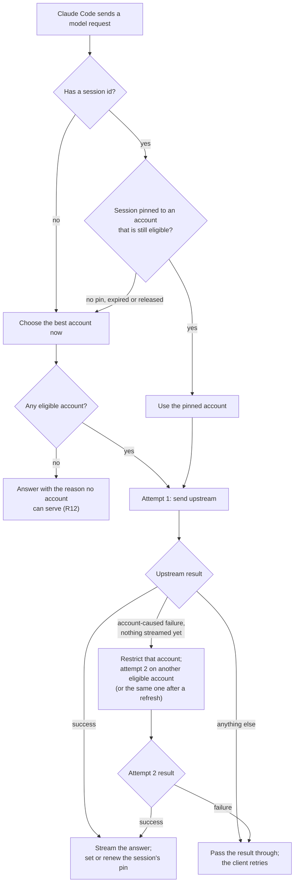
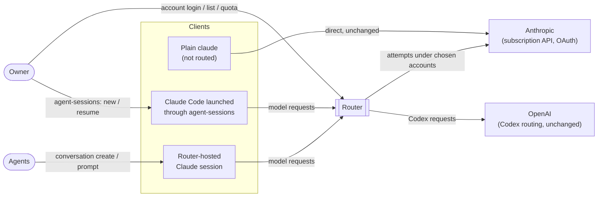
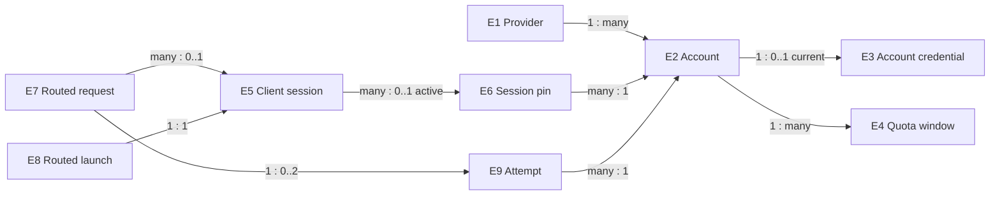
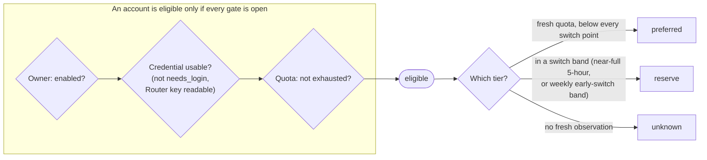
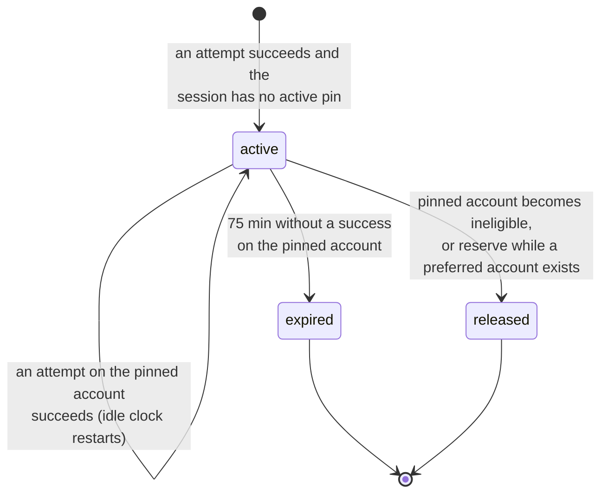
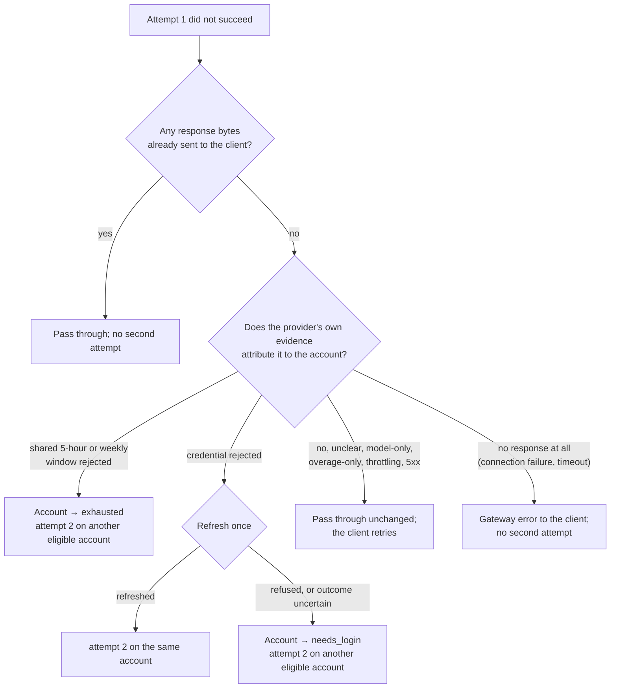
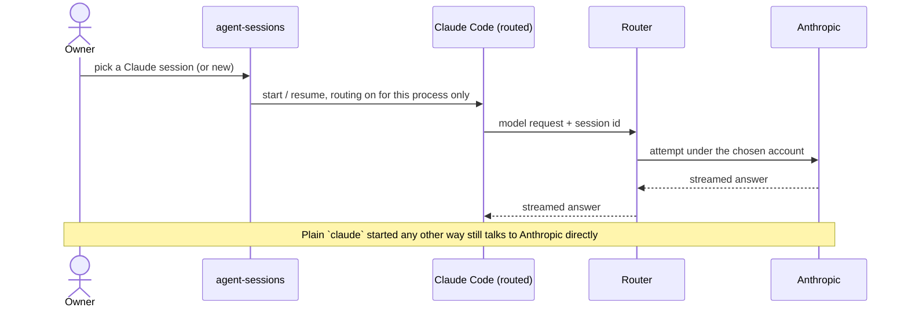
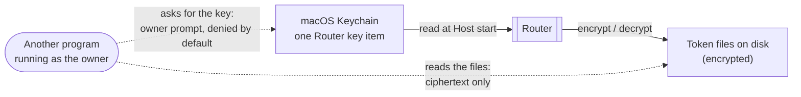

# Claude OAuth account routing — Specification

Governing needs: [requirements.md](requirements.md) (U1–U13). This document states what must be
observably true. How Router realizes it belongs to the Program Design.

**Scope of the routing rules.** R1–R12 describe routing for `claude` accounts. OpenAI (Codex) routing
keeps its current behaviour, with three authorized exceptions: the session-pin idle time (R4), the
provider label (R19) and token protection at rest (R22–R25). See R21.

## At a glance: what happens to one Claude request

This is the whole behaviour in one picture; the sections below make each box precise.



## Context

Router is one opaque system in this view.



Only Claude model requests (the Messages API) are promised the routing behaviour below. Claude Code's
other requests (profile, usage, telemetry, token counting) are not promised account routing; the full
inventory of those requests is an open question in the Requirements.

## Entities



| ID | Term | What makes it one thing | Basis |
| --- | --- | --- | --- |
| E1 | Provider | One per upstream service whose accounts Router pools: `openai`, `claude`. | U9 |
| E2 | Account | Its label, which is unique across all providers. It belongs to exactly one provider. | U8, U9, U10 |
| E3 | Account credential | The token pair Router obtained for one account through Router's own login. A refresh replaces it as that account's current credential. | U8 |
| E4 | Quota window | One per account per window kind: `claude` has a 5-hour and a weekly window; `openai` has the windows OpenAI reports (weekly today). | U3, U10 |
| E5 | Client session | The client's own session identity: Claude Code's documented `x-claude-code-session-id` header, or Codex's existing session identity. A request without one belongs to no session. | U2 |
| E6 | Session pin | The link from one Claude session to the account that last served it, used to keep the session on that account. | U2, U4 |
| E7 | Routed request | One client model request, from receipt until Router finishes answering it. It has zero attempts (answered under R12), one, or two. | U1, U5 |
| E9 | Attempt | One upstream send of a routed request under one account. | U5 |
| E8 | Routed launch | One Claude Code process that `agent-sessions` started or resumed with routing on. | U6 |

Invariants:

- A provider never serves another provider's requests (E1).
- An account's provider never changes, and every account that existed before this change has provider
  `openai`. Adding an account whose label is already used by any provider is refused (E2).
- A credential comes only from Router's own login for that provider, never from the owner's Claude Code
  or Codex login, and never appears in logs, CLI output or other tools' config (E3).
- Missing or stale quota is shown as missing or stale, never as 0 % or 100 % (E4).
- Router never invents a session identity for a request that has none (E5).
- A pin is soft: it never overrides eligibility (E6).
- Each attempt reaches the provider carrying the client's request unchanged apart from the account
  credential and the headers the provider requires for it (E9).
- A routed launch changes nothing outside the process it starts (E8).

### When an account can serve (E2)

An account's ability to serve is the combination of independent restrictions. Each restriction is set
and cleared only by its own event, so clearing one never clears another.



| Restriction | Set by | Cleared by | Scope |
| --- | --- | --- | --- |
| `disabled` | owner `account disable` | owner `account enable` | one account |
| `needs_login` | the provider definitively refuses the credential, or a refresh outcome is uncertain (R9) | a successful owner login for that account | one account |
| `keychain_locked` | Router cannot read its key at Host start (R23) | the key becomes readable (R23) | all accounts |
| `exhausted` | the provider rejects the account's own usage window (R8) | a quota observation taken after the rejection shows headroom in every window that was rejected (R8a) | one account |

Tiers apply only to eligible accounts and decide order, not eligibility (R3).

### Session pin lifecycle (E6, Claude)



After `expired` or `released`, the next request is routed as if the session had no pin. Router never
moves a session back to an earlier account just because that account recovered.

## Normative requirements

### Selecting and keeping a Claude account

- **R1.** Each attempt of a `claude` request MUST be sent under exactly one eligible `claude` account.
  (U1)
- **R2.** A request whose session has an `active` pin MUST make its first attempt on the pinned account
  while that account is eligible and not released under R5. Only R8 and R9 may send a second attempt
  elsewhere. (U2)
- **R3.** When a request has no `active` pin, Router MUST choose among eligible accounts in tier order —
  preferred, then reserve, then unknown — and within a tier by the same ranking OpenAI selection uses
  today (reset-aware remaining quota, then load). An account at or past a configured hard floor is not
  eligible. When a weekly floor is configured for an account, that account MUST NOT be chosen while its
  weekly window has no fresh observation, as OpenAI selection does today. (U1, U3, U9)
- **R3a.** A success on an attempt MUST set the session's pin to that attempt's account when the session
  has no `active` pin, and MUST renew the pin when that account is the pinned one. A success on an
  account other than the pinned one MUST NOT move an `active` pin. (U2)
- **R4.** A pin MUST expire after 75 minutes of idleness by default. The duration MUST be configurable,
  and one setting governs both providers. What counts as activity differs by provider: a Claude pin's
  idle clock restarts only on a success on its account (R3a); a Codex pin keeps today's activity
  triggers (R21). (U4, U2)
- **R5.** A Claude pin MUST be released when its account becomes ineligible, and when its account enters
  the reserve tier while a preferred account exists. A pinned account in the reserve tier with no
  preferred alternative keeps its pin. (U2, U3)
- **R6.** A `claude` account MUST enter the reserve tier when its 5-hour use reaches the configured
  near-full threshold (default 95 %), or when its weekly remaining share reaches its weekly early-switch
  point under the floor rules OpenAI accounts use. (U3)
- **R7.** A switch MUST take effect at the next request. An attempt already streaming MUST NOT be cut
  off because its account entered the reserve tier. (U3, U5)

### Failures

Router owns only failures caused by the account, and only before anything reaches the client.
Everything else belongs to the client.



- **R8.** When the provider's evidence attributes a rejection of a request's **first** attempt to the
  account's shared 5-hour or weekly usage window (R10a), and no response bytes have reached the client, Router MUST set `exhausted` on
  that account, release a pin that names it, and send one more attempt on another eligible account. (U5)
- **R8a.** An `exhausted` account MUST become eligible again only when a quota observation taken after
  the rejection shows headroom in every window that was rejected. A reset time reported by the provider
  schedules when Router next observes; it does not restore eligibility by itself. An observation that
  started before the rejection MUST NOT clear it. (U1, U5)
- **R9.** When the provider's evidence attributes a rejection of a request's **first** attempt to the
  account's credential (R10a), and no response bytes have reached the client, Router MUST refresh that
  credential once:
  - refreshed → one more attempt on the same account;
  - the provider refuses the refresh, or its outcome is uncertain (timeout, or a refresh that may have
    consumed the old token without a confirmed new one) → set `needs_login` on the account and send one
    more attempt on another eligible account. (U5, U8)
- **R10.** Everything not attributed to the account under R10a MUST be passed to the client unchanged and
  MUST NOT get a second attempt from Router: provider overload and server errors, request-rate
  throttling, model-specific or overage-only limits, and any response whose attribution is absent,
  malformed or contradictory. (U5)
- **R10a.** Router MUST treat a rejection as account-caused only on the provider's explicit evidence:
  for exhaustion, evidence that the account's shared 5-hour or weekly window is rejected; for
  credentials, evidence that the credential itself is invalid or expired. A status code alone is not
  evidence. (U5)
- **R10b.** When an attempt gets no response at all (connection failure or timeout), Router MUST answer
  the client with a gateway error that says the provider could not be reached, and MUST NOT send a second
  attempt. (U5)
- **R11.** A routed request MUST have at most two attempts, and R8/R9 recovery applies only to the first.
  When the second attempt fails, Router MUST pass the provider's response to the client unchanged (or
  answer under R10b if there was no response) and MUST NOT refresh or send a third attempt. The failure
  still updates its account: an attributed usage-window rejection sets `exhausted`, and an attributed
  credential rejection sets `needs_login`. (U5)
- **R12.** When no eligible `claude` account exists for an attempt, Router MUST answer with the first
  reason below that holds, considering only `claude` accounts:
  1. no account exists or every one is disabled → an error saying no Claude account is configured or
     enabled;
  2. the Router key is unreadable, or the pooled-credential conversion (R24) is incomplete → an error
     saying Router cannot unlock its credentials, naming which of the two applies;
  3. every enabled account is `needs_login` → an error naming the accounts that need `account login`;
  4. every enabled account with a usable credential is `exhausted` (at least one such account exists) →
     a usage-limit response that Claude Code shows as its usage-limit message. If the attempt that just
     failed received the provider's own usage-limit response, that response is what the client gets. The
     reset hint is the earliest time any of these accounts is expected to have headroom in all of its
     rejected windows (R8a), and is omitted when unknown;
  5. otherwise — the remaining usable accounts are held by a hard floor or are waiting for a fresh weekly
     observation under a configured floor (R3) → an error naming those accounts and why they are held.

  None of these may send an attempt under an ineligible account. (U11, U5, U13)

| Situation | Account after | Router action | Client sees |
| --- | --- | --- | --- |
| Attempt succeeds | unchanged; pin set or renewed (R3a) | forward | the provider's response |
| Shared window rejected, nothing streamed | `exhausted` | attempt 2 elsewhere | attempt 2's result, or R12 |
| Credential rejected, refresh succeeds | unchanged | attempt 2 on the same account | attempt 2's result |
| Credential rejected, refresh refused or uncertain | `needs_login` | attempt 2 elsewhere | attempt 2's result, or R12 |
| Account enters reserve while streaming | reserve | finish the stream; R5 applies at the next request | the full response |
| Overload, 5xx, throttling, model-only or overage-only limit, unclear evidence | unchanged | none | the provider's response, unchanged |
| No response (connection failure, timeout) | unchanged | none | a gateway error naming the provider as unreachable |
| Anything after bytes reached the client | per its class | none | the rest of that response, unchanged |
| Attempt 2 fails | per its class | none | that failure |

### Clients



- **R13.** `agent-sessions` MUST list Claude Code sessions, and MUST start a new Claude Code session or
  resume a listed one with routing on. (U6)
- **R14.** A routed launch MUST affect only the process it starts. Running `claude` without Router MUST
  behave exactly as before this change. If Router is not running, a routed launch MUST fail visibly
  rather than silently use the owner's direct login. (U6)
- **R15.** Claude sessions that Router hosts for agents MUST send their model requests through the same
  pool under R1–R12. (U7)
- **R16.** Router MUST forward each attempt unchanged except for the account credential and the headers
  the provider requires for that credential type. It MUST NOT rewrite prompts, models or other content.
  (U5, non-goal "request rewriting")

### Accounts and quota

- **R17.** The owner MUST be able to add a `claude` account through Router's own browser login, and
  Router MUST keep its credential fresh without owner action while the provider allows refresh. (U8)
- **R18.** Router MUST NOT read, copy or modify the owner's Claude Code or Codex login stores. (U8)
- **R19.** After the upgrade, every account that existed before MUST be listed with provider `openai`,
  its label, enablement, floor, credential and quota history unchanged. An explicit, versioned migration
  MUST make this change and MUST fail closed on unexpected data. (U9)
- **R20.** `account list`, `enable`, `disable` and floor settings MUST work for `claude` accounts by
  label, exactly as they do for OpenAI accounts. `quota` MUST show each `claude` account's 5-hour and
  weekly use, reset times, freshness and restrictions alongside the OpenAI accounts, together with the
  account a new Claude session would get next. (U10)
- **R21.** OpenAI routing MUST behave as it does today — including when a pin is set, previous-response
  ownership, concurrent selection and its retry budget — except for the pin idle time (R4), the provider
  label (R19) and token protection at rest (R22–R25). (U4, U9, U13)

Illustrative `quota` view (layout is not normative; the content is):

```text
PROVIDER  ACCOUNT   5-HOUR          WEEKLY          TIER / RESTRICTION   FRESH
claude    work      62% · 1h40m     31% · 4d        preferred            20s ago
claude    personal  96% · 0h12m     55% · 2d        reserve              20s ago
claude    spare     —               —               needs_login          —
openai    main      —               44% · 3d        preferred            2m ago
next claude session → work
```

### Token protection at rest



- **R22.** Every pooled account credential of either provider (access and refresh token) MUST exist on
  disk only in encrypted form, under a key held in one macOS Keychain item Router owns. This holds for
  every write in a credential's life — login, refresh and migration — including temporary files and
  files written by any child process Router starts for them. The only exception is a legacy plaintext
  file that has not yet been migrated (R24). (U13)
- **R22a.** Another program running as the owner MUST NOT obtain the key without an explicit owner
  authorization, and MUST NOT recover any token from Router's files without the key. (U13)
- **R23.** When the Host starts and cannot read the key (Keychain locked, access denied, or no
  interaction possible), the Host MUST still start, every account MUST show `keychain_locked`, and
  Router MUST NOT fall back to plaintext or another store. The key becoming readable — detected when the
  owner runs `codex-router host restart`, or by a later automatic retry — MUST clear only
  `keychain_locked`, leaving every other restriction as it was, and MUST NOT require a login. (U13)
- **R24.** Existing plaintext token files MUST be converted by an explicit, versioned migration that
  confirms each converted credential reads back before deleting its plaintext file. On unexpected data
  it MUST stop, leave the unconverted plaintext files in place, and report which accounts were not
  converted; R22 is not claimed until the migration has completed. While it is incomplete the Host MUST
  still start, no pooled credential may be read from a plaintext file outside the conversion itself,
  Claude requests are answered under R12 reason 2, and Codex requests get their existing
  credential-unavailable response. No account's credential restrictions change because of it. After a
  completed migration no plaintext token file remains. (U13)
- **R25.** Token refresh while the Host runs MUST NOT raise a Keychain prompt. (U13, U8)

### Behaviour at the edges

- A request with no session identity goes to the best eligible account at that moment and creates no
  pin.
- Overlapping requests of one session each follow R2 and R3a on their own; a success on a non-pinned
  account never moves an active pin, and a late success cannot revive an expired or released pin.
- Quota older than the refresh interval is `stale` and shown as stale. A stale observation cannot set or
  clear `exhausted`, and it places the account in the unknown tier for any window it covers.
- Adding, disabling or enabling an account applies to the next choice Router makes, without restarting
  Router.

## Cross-cutting obligations

| Quality | Obligation | Basis |
| --- | --- | --- |
| Security | Credentials never appear in logs, CLI output, board messages or error bodies; at rest they follow R22–R25. The routing endpoint accepts connections only from this machine. | U8, U13 |
| Privacy | Router keeps no request or response content for routing; it keeps only session identities, account choices and quota facts. | U5 ("keep non-account logic out") |
| Observability | For each routed request Router records which account served each attempt, whether a pin or a fresh choice decided it, and any second attempt with its failure class, without secrets or content. | U5, U10 |
| Compatibility | Existing Codex profiles, accounts and commands keep working (R19–R21). | U9 |
| Accessibility | Not applicable: CLI text only, following existing command conventions. | — |

## Proof obligations

| Requirement | Evidence |
| --- | --- |
| R1–R7, R3a (selection, tiers, pins) | Deterministic tests over quota windows, floors, tiers and pin states: 75-minute expiry; release on reserve only when a preferred account exists; a single reserve account keeps serving; unknown tier; weekly floor with stale evidence; overlapping requests completing out of order; no switch-back. |
| R8–R12 (failures, attempts) | Integration tests against a fake Anthropic upstream for every row of the failure table, including attempt 2 failing, a refresh that times out, a response that errors after streaming starts, and each R12 reason. The fixtures MUST be built from documented or observed provider responses with their provenance recorded (shared-window rejection, overage-only, model-only, bare 429, credential rejection, capability-header 401). |
| R12 (client display) | A real Claude Code run against Router with every account exhausted shows Claude Code's own usage-limit message; the other R12 reasons show their error text. |
| R13–R14 (routed launch) | End-to-end test that `agent-sessions` new/resume launches Claude Code with routing on, that plain `claude` configuration is byte-for-byte unchanged afterwards, and that a routed launch with Router stopped fails visibly. |
| R15 (hosted sessions) | Isolated-Host test in which a Router-hosted Claude session's model request reaches the fake upstream through the pool. |
| R16 (no rewriting) | Integration test comparing the body and non-credential headers received upstream with those the client sent. |
| R17–R18 (login and refresh) | Tests against a fake OAuth server, including refresh-token rotation, definitive refusal and an uncertain outcome, plus a check that the owner's Claude Code and Codex login stores are not read or changed. |
| R19–R20 (migration, commands) | Migration test on a copy of a pre-change database: every row keeps its values and gains provider `openai`; unexpected data fails closed. CLI tests with mixed-provider accounts, a refused duplicate label, and `stale` / `unknown` windows. |
| R21 (Codex unchanged) | Existing Codex routing and delivery suites pass, including previous-response ownership, concurrent selection and the retry budget, with only the idle-time, label and credential-protection expectations updated. |
| R22–R25 (token protection) | Tests in an isolated test Keychain and a private working root: every file written at any point during login, refresh and migration — including temporary files, deleted files and files written by child processes — is observed while the operation runs and contains no plaintext token; an unrelated same-user executable cannot read the key without an authorization and cannot decrypt the files; a locked or denied key yields `keychain_locked` with no plaintext fallback, and unlocking clears only that restriction without a login; migration confirms read-back before deleting and fails closed, leaving the unconverted files and a report. |
| R22–R25 (upgrade behaviour) | Pre-release: two differently built binaries against one isolated test Keychain show that a new build needs one authorization, given at Host start, and that refresh then runs without prompts. After release: on the owner's Homebrew install, the owner-run `host restart` after an upgrade shows a single prompt. Neither replaces production without the owner. |
| Security and privacy | Credential-pattern scans of logs and outputs in the integration tests; a loopback-only binding test. |
| End-to-end on real accounts | After the owner logs in at least two Claude accounts: a routed Claude Code session answers a prompt, and a forced switch keeps the session working. Owner-gated; never run against production without the owner. |
