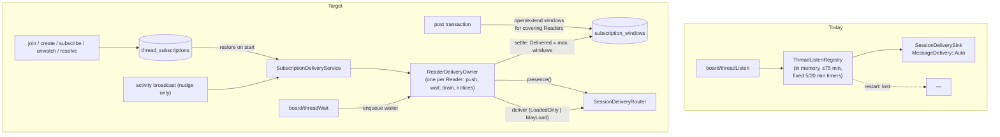
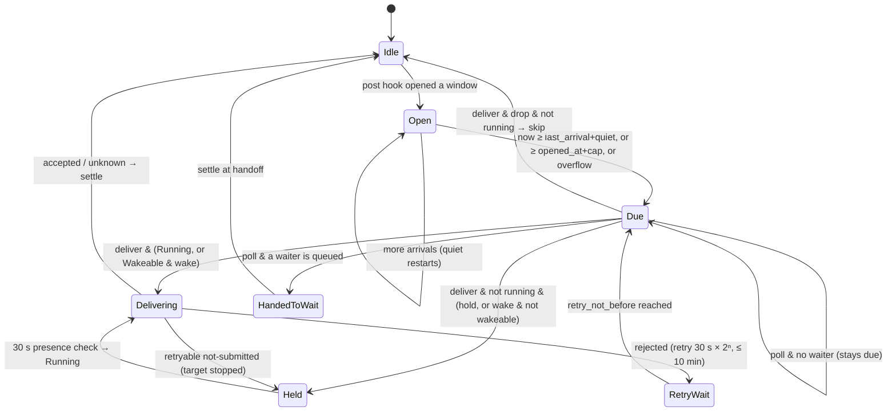

# Thread subscriptions — Program Design

Realizes [specification.md](specification.md) (revision 2: R1–R26) for [requirements.md](requirements.md) (U1–U8).
Current-system map: `tmp/design-workflows/2026-09-28-thread-subscriptions/thread-listen-system-map.md`.
Source anchors are at `origin/main` 62ced2e. Revision 2 applies review round 1 (TS1–TS11).

## 1. What changes, in one picture



**Kept:**
- Participant, Watch, Delivered and Acknowledged records, with Acknowledged never touched by
  subscriptions;
- the BatchSet selector internals and their budgets;
- the activity broadcast;
- the SessionDeliveryRouter with its three injected routes;
- Router-authored message rendering.

**Gone, in a hard cutover:**
- ThreadListenRegistry, its dispatch and its session-delivery driver;
- `ThreadListenBatchSet`, `ListenId`, `listenEnd` and heartbeats;
- the `board/threadListen*` RPCs, CLI commands and MCP tools;
- `join --listen`;
- the fixed debounce and lifetime constants.

## 2. Components and ownership

| Component (crate · module) | Owns | Reason to change |
| --- | --- | --- |
| `message-board` · `thread_subscriptions.rs` (new; replaces the listen types in `thread_listening.rs`) | domain + wire types (§6): `SubscriptionScope`, `SubscriptionMode`, `WhenIdle`, `BatchTiming`, `SubscriptionLifetime`, `SubscriptionPolicy`, `SubscriptionState {Active, Draining, Ended(EndReason)}`, `ThreadSubscription`, `SubscriptionBatch` + `BatchId`, the R4 bounds | the subscription contract |
| `message-board-storage` · migration `…_thread_subscriptions.sql` | `thread_subscriptions`, `subscription_windows`, R24 backfill | persistence |
| `message-board-storage` · `thread_subscription_records.rs` (new) | subscribe/unsubscribe/renew/end/drain writes; watch invariant; effective coverage (E4) | subscription lifecycle |
| `message-board-storage` · `subscription_window_records.rs` (new) | open/extend windows inside the post transaction; due query; selection over due roots (reusing the selector from `thread_listen_records.rs`); **settle** (monotonic Delivered, window update); hold and back-off marks; drop skip | timing and positions |
| `message-board-storage` edits: `participant_records.rs` (join/leave/replace/resolve), `thread_records.rs` (unwatch), `message_write_operations.rs` (post, create) | call the records above inside the existing transactions | lifecycle hooks |
| `collaboration-service` · `session_delivery_contract.rs`, `session_delivery_router.rs` | `RoutePresence`, `TargetPresence`, `SessionDeliveryRoute::presence`, `LoadPolicy` on `DeliveryRequest`, presence aggregation | target-state vocabulary |
| routes: `codex_app_server_delivery_route.rs` + `native_message_dispatch.rs`; host `provider_acp_route_claim.rs`, `provider_acp_session_loading.rs`, `provider_acp_delivery_route.rs`; `claude_code_peer_delivery_route.rs` | per-kind presence (Spec E10), LoadedOnly refusal at the effect point | route behaviour |
| `collaboration-service` · `subscription_delivery/` (new): `subscription_delivery_service.rs`, `reader_delivery_owner.rs`, `subscription_batch_message.rs`, `subscription_clock.rs` | owner lifecycle, restore and shutdown; the per-Reader actor; rendering; UTC clock seam | delivery timing and policy |
| `collaboration-protocol`, `collaboration-client` | the §6 control methods; `board/threadListen*` removed | wire contract |
| `agent-collaboration` CLI, `collaboration-mcp` | `board thread subscribe|unsubscribe|subscriptions|wait`; `join` defaults to watch; tools with the same names | user surface |
| `agent-skills/agent-collaboration` | skill text | teaching |

Dependency direction is unchanged: storage ← service ← protocol/client ← CLI/MCP. Routes know nothing
about subscriptions.

## 3. Storage

```sql
CREATE TABLE thread_subscriptions (
 reader_key TEXT NOT NULL REFERENCES board_identities(identity_key),
 scope_kind TEXT NOT NULL,            -- 'thread' | 'topic'
 scope_id   TEXT NOT NULL,            -- root_id | topic_id
 mode TEXT NOT NULL,                  -- 'deliver' | 'poll' | 'off'
 when_idle TEXT NOT NULL,             -- 'hold' | 'wake' | 'drop'
 quiet_seconds INTEGER NOT NULL,
 cap_seconds INTEGER NOT NULL,
 lifetime_seconds INTEGER NOT NULL,
 renewed_at TEXT NOT NULL,            -- RFC 3339 UTC
 expires_at TEXT NOT NULL,            -- RFC 3339 UTC
 state TEXT NOT NULL,                 -- 'active' | 'draining' | 'ended'
 end_reason TEXT, ended_at TEXT,      -- set iff state = 'ended'
 last_outcome TEXT,                   -- JSON of a domain type
 generation INTEGER NOT NULL,         -- +1 on every create/update/reactivate/end/drain
 PRIMARY KEY(reader_key, scope_kind, scope_id)
) STRICT;

CREATE TABLE subscription_windows (
 reader_key TEXT NOT NULL REFERENCES board_identities(identity_key),
 root_id TEXT NOT NULL REFERENCES board_threads(root_id),
 opened_at TEXT NOT NULL,             -- UTC; cap counts from here
 last_arrival_at TEXT NOT NULL,       -- UTC; quiet counts from here
 overflow INTEGER NOT NULL,           -- 0/1: residual from a budget-cut Batch → due now
 held_since TEXT,                     -- UTC; set when the owner holds
 retry_not_before TEXT,               -- UTC; back-off deadline
 retry_attempts INTEGER NOT NULL,
 window_id TEXT NOT NULL,             -- UUIDv7, new each time the row is created
 in_flight_through INTEGER,           -- set while a selected Batch for this root is in flight
 residual_opened_at TEXT,             -- UTC of the first arrival after in_flight_through
 PRIMARY KEY(reader_key, root_id)
) STRICT;
```

Enums, bounds and cross-field rules are enforced in Rust constructors, following repo rules (SQL CHECK
only for booleans). Rows are read through `query_as!` into private row structs. An unknown value fails
that row closed as `CorruptSubscription { field }`.

### Watch invariant and effective coverage (E3, E4)

- Creating, updating or reactivating a Subscription activates the Watch for its scope in the same
  transaction: a Thread Watch for a root, a Topic Watch for a topic. The existing watch writes are
  `thread_records.rs:56-114,195-270`.
- `unwatch` ends the scope's Subscription (`cancelled`) in the same transaction.
- `join` without `--watch/--no-watch` now defaults to watch. That is a CLI and argument change; the storage
  request keeps an explicit bool.
- **Covering Subscription for (Reader, root)** is decided in this order:
  1. the Reader's Thread row for that root, if one exists in any state; an ended row covers nothing;
  2. otherwise the Reader's active Topic row for the root's topic;
  3. otherwise nothing.

  A Thread row, once it exists, therefore excludes the root from Topic coverage for good, unless a
  rejoin or subscribe reactivates it.
- **The selector and the inbox both need a *Thread* Watch per root.**
  - The existing selector requires an active Thread Watch (`thread_listen_records.rs:94-112`), and so do
    inbox replies (`inbox_records.rs:120-130`). A Topic Watch alone is not enough.
  - A Topic Subscription therefore materializes per-root Thread Watches, exactly as today's Topic listen
    expansion does (`thread_listen_records.rs:49-73`):
    - on topic subscribe or reactivate, for every existing root in the topic not shadowed by a Thread row;
    - in the post and create hooks, for a root the Reader newly covers through the Topic. The watch starts
      just before that post, so the post is visible.
  - This applies in every mode, including off, so the inbox shows Topic activity.
  - The inbox query itself is unchanged.

### Lifecycle hooks, each inside the existing transaction

| Event | Subscription effect |
| --- | --- |
| join with watch (session Reader) / create with role | upsert Thread row: create with the default or join-supplied Policy, or reactivate an ended row keeping its Policy; renew; activate the Watch (already done by join) |
| join `--no-watch` | if a Thread row for that root is active or draining → `ended(cancelled)` and delete its window, in the same transaction that deactivates the Watch (`participant_records.rs:27-55`); otherwise no change |
| subscribe | upsert with a partial Policy patch; renew; activate the Watch; Thread scope requires an open Participant |
| unsubscribe | `ended(cancelled)`; delete the Reader's windows for the covered roots; Watch unchanged |
| unwatch | `ended(cancelled)` for that scope; delete windows |
| leave / replacement | `ended(left)` / `ended(replaced)`; delete windows |
| resolve | Thread rows on the root: mode off → `ended(resolved)`; otherwise → `draining` |
| post by actor A in root R | for every Reader ≠ A with an active or draining covering Subscription: ensure the Thread Watch when covered by Topic (any mode); if mode ≠ off, upsert the window (new row: fresh `window_id`, `opened_at` = `last_arrival_at` = now; existing row: `last_arrival_at` = now, and if `in_flight_through` is set and `residual_opened_at` is null, `residual_opened_at` = now); renew A's covering row for R |

The post hook is what makes timing durable (R23) and makes poll-only Readers work without a background
task. It costs one small upsert per covering Reader per post. The storage write APIs take `now`
from the caller, which is the service's `SubscriptionClock`. Board activity has no timestamps of its own,
so the windows carry them.

**R24 backfill, in the same migration.** Insert a default active Thread row for each Participant that is
open, has a session identity, whose thread is unresolved, and whose Watch is active. Set:
- `renewed_at` = now and `expires_at` = now + 24 h;
- Delivered = max(existing Delivered, latest activity in that root), so there is no history flood.

### Settle and skip (the only position writers)

- **Selection marks in flight.** `select_batch` stores `in_flight_through` = the selected through on each
  selected window. It returns a `BatchSettlement` carrying each root's `window_id` and through, plus the
  covering subscription's `generation`.
- `settle_batch(reader, BatchSettlement { roots: [(root, window_id, through, truncated)],
  subscription_generations, outcome })`, in one transaction:
  - Delivered = `max(current, through)` for each root. This is monotonic; today's
    `thread_listen_delivery_position.rs:49-55` assigns rather than taking the max.
  - Participant last-seen advances as today.
  - Windows are **fenced by `window_id`**: only a window whose `window_id` still matches is touched. A
    replacement window created after a cancel or re-subscribe has a new id and is left alone.
  - For each matching window:
    - no pending remains after `through` → delete it;
    - `truncated` → keep it with `overflow = 1`, due now (R8);
    - otherwise, for new arrivals during flight → `opened_at` = `residual_opened_at` (the first residual
      arrival, so an elapsed cap stays elapsed), keep `last_arrival_at`, and clear `held_since` and retry.
    - In every case, clear `in_flight_through` and `residual_opened_at`.
  - `last_outcome` is stored only on subscription rows whose `generation` still matches.
- Drop skip uses the same operation with through = latest pending.
- **Late settlement after cancel, re-subscribe or mode change** therefore changes only the global
  Delivered cursor, which is allowed because the Batch was passed. It cannot modify replacement windows or
  outcomes, and pending is always recomputed from Delivered.
- **After a crash while in flight**, restart clears `in_flight_through` and `residual_opened_at` and keeps
  the original `opened_at`. The whole pending range is re-selected (the one allowed duplicate), with an
  elapsed cap still elapsed.

## 4. Presence and load policy (routes)

```rust
pub enum RoutePresence { NotMine, Running, Wakeable, LiveElsewhere { detail: Option<String> }, Unreachable { reason: String } }
pub enum TargetPresence { Running, Wakeable, Unreachable { reason: String } }
pub enum LoadPolicy { MayLoad, LoadedOnly }   // on DeliveryRequest; every existing caller passes MayLoad
```

| Route | `presence(target)` (side-effect free) | `LoadedOnly` enforcement (at the effect point) |
| --- | --- | --- |
| Codex app-server | endpoint mismatch → `NotMine`; backend gate down → `Unreachable`; `thread/read` status `notLoaded` → `Wakeable`; `idle`/`active` → `Running`; missing → `Unreachable` | in `native_message_dispatch.rs` deliver: after reading status, `notLoaded` → retryable NotSubmitted `notLoaded`; never resume |
| Provider ACP | loaded → `Running`; otherwise run the pure pre-checks factored out of `provider_acp_session_loading.rs:52-85` (stored record, `supports_load`, ownership not live elsewhere): all pass → `Wakeable`; live elsewhere → `LiveElsewhere`; else `Unreachable`/`NotMine` | in `provider_acp_delivery_route.rs` under the session lock (`:203-220`): when the re-claim is `CanLoad` and the policy is LoadedOnly → retryable NotSubmitted `notLoaded`, before `ensure_provider_session_loaded` (`:264`) |
| Claude Code peer | writable live peer → `Running`; live but unsupported → `LiveElsewhere`; absent → `NotMine` | never loads |

`SessionDeliveryRouter::presence` asks all routes concurrently and aggregates:
1. any `Running` → Running;
2. else any `LiveElsewhere` → Unreachable("live elsewhere");
3. else any `Wakeable` → Wakeable;
4. else Unreachable, with the joined reasons.

A Claude terminal session is not an ACP provider session, so it has no provider record. ACP answers
`NotMine`, and the target stays non-wakeable (Spec E10).

`deliver_once` additionally skips the `CanLoad` branch under LoadedOnly. The route-level check above is
the real guard against the Holds→unloaded race.

## 5. Delivery service and owner



**`SubscriptionDeliveryService`** replaces `thread_listens` in `control_service_context.rs:215-243`.
- On start (board attached) it:
  1. ends expired rows;
  2. spawns one `ReaderDeliveryOwner` per Reader with any active or draining row, in any mode. For off-only
     Readers, the owner only keeps the expiry deadline;
  3. each owner **rescans**: every covered root with pending activity (sequence > Delivered) but no window
     gets a window opened at now. This covers the backfill, a lagged broadcast, or anything else a missing
     window would otherwise hide.
- Owners run on a `TaskTracker` and drain on shutdown.
- Control handlers call `service.reconcile_reader(reader)` after any write that touches that Reader's
  rows. The owner reloads its state from storage and holds no independent copy of Policy.

**`ReaderDeliveryOwner`** is a single Tokio task per Reader, fed by an mpsc of commands: nudge, reconcile,
wait-request and shutdown. It is the only thing that selects or settles for its Reader, which realizes
R8's "never two in flight" across push, wait, drain and notices.
- **Sleep set:** the earliest of
  - each window's quiet deadline, cap deadline and `retry_not_before`;
  - each row's `expires_at`;
  - the 30 s presence tick while any window is held;
  - pending waiter deadlines.
- **Wake-ups** come from that set, from activity-broadcast nudges (the post hook already wrote the window,
  so the owner just recomputes) and from commands.
- **On due:** select a Batch over the due roots with the existing budgets, then act by Policy (see the
  diagram). Deliveries use `MessageDelivery::Auto`, with `LoadPolicy::MayLoad` only for wake with a
  Wakeable target and `LoadedOnly` otherwise. The board store lock is held only for the select and settle
  calls, never across the route await.
- **Outcome mapping:**
  - `Started | Steered | StartedOrSteered | Queued | PeerMessageWritten` → settle;
  - `Unknown` → settle, with the evidence in `last_outcome` (R16);
  - `Rejected` → record the retry deadline and attempts on the windows;
  - retryable `NotSubmitted` → mark held.
- **Settle failure after acceptance:** retry the settle (back-off 1 s → 30 s) before any new selection.
  Never re-deliver. Only a crash can re-deliver (R16).
- **Poll:** `board/threadWait` sends a wait-request (filter, deadline) to the Reader's owner, spawning the
  owner if needed, and awaits a oneshot. The owner hands over the next due poll-mode Batch matching the
  filter, settling at handoff, or empty at the deadline. Waits renew the covered rows. Concurrent waits
  queue in FIFO order inside the owner, so no two ever receive the same Batch.
- **Draining (R20):** a draining row delivers like an active one. When it has no window and no pending
  activity, the owner ends it `resolved`. Restart restores draining rows like active ones.
- **Expiry (R18, R21):** at `expires_at` the owner ends the row `expired` and deletes its windows. For
  mode deliver with a Running target, it sends one best-effort notice.
- **Mode change / end during flight (R19):** the in-flight Batch settles normally, then the owner reloads.
  The next selection uses the new state.

**Notice = push record (owner decisions 2026-09-30: neutral notice, then "direct to push records"):**
- the owner builds a `subscription-activity` push record through the push-format `PushRecordStore`
  ([push-format program design](../2026-09-30-router-push-format/program-design.md) §3, §5): ranges from
  storage's `PendingRootNotice {root_id, topic_id, from, through, message_count}`, plus the held-since and
  draining facts; at most 20 roots per Batch;
- it delivers the record's one 🧵 line (`render_push_line`) as a `PreparedPush` with the push id as the
  delivery correlation id; expiry uses a `subscription-expiry` record;
- there is no subscription-specific renderer. No peer-authored text (bodies, titles, authors) reaches the line.

## 6. Wire contract

| Method | Request | Result |
| --- | --- | --- |
| `board/threadSubscribe` | `{ actor, scope: {kind:"thread", rootMessageId} \| {kind:"topic", topicId}, policy: { mode?, whenIdle?, quietSeconds?, capSeconds?, lifetimeSeconds? } }` | `ThreadSubscriptionView` |
| `board/threadUnsubscribe` | `{ actor, scope }` | `ThreadSubscriptionView` (ended) |
| `board/threadSubscriptions` | `{ actor }` | `{ subscriptions: [ThreadSubscriptionView] }` |
| `board/threadWait` | `{ actor, filter: {kind:"all"} \| {kind:"roots", rootMessageIds} \| {kind:"topic", topicId}, maxWaitSeconds ≤ 1500 }` | `{ batch: SubscriptionBatch \| null }` |

- **`ThreadSubscriptionView`** is assembled by the service. It combines the storage `ThreadSubscriptionRecord` (defined in `message-board`, with no presence) and the owner's last presence observation. Its fields are: `{ scope, policy, state, endReason?, expiresAt, pendingCount,
  presence, heldSince?, nextRetryAt?, lastOutcome? }`.
- **`board/threadWait` result (Lead decision 2026-09-30, Sidekick triad: human Readers have no SessionRef):** a typed
  union. `Notice { pushId, line, held, heldSince?, draining, roots }` for a session Reader — always backed by a stored
  subscription-activity push record; `Ranges { held, heldSince?, draining, roots: [PendingRootNotice] }` for a human
  Reader — nothing is stored, because nothing is pushed to a human. Both carry no message bodies.
- **`SubscriptionNotice`** (the session variant above; notice-only per the owner decision): `{ pushId (UUIDv7, the stored subscription-activity record), line, held: bool, heldSince?, draining: bool, roots: [PendingRootNotice] }`. It carries no message bodies; `show <link>` expands the ranges.
- The existing response byte budget moves from the listen dispatcher (`thread_listen_dispatch.rs:34-51`)
  to the wait handler.
- `join` requests keep an explicit watch bool and add optional `mode` and `whenIdle`.

## 7. Cutover (hard; lands in one PR)

**Deleted:**
- `thread_listen_registry*.rs`, `thread_listen_dispatch.rs` and `thread_listen_session_delivery.rs`;
- the listen CLI (`board_thread_listen_execution.rs` and the listen arguments and preparation);
- the MCP listen, show and cancel tools and their descriptions and snapshot entries;
- `THREAD_LISTEN_*`, `ThreadListenBatchSet`, `ListenId`, `ThreadListenEnd` and the heartbeat types;
- `prepare_thread_listen` and `--from`.

**Selector code:** moves from `thread_listen_records.rs` into `subscription_window_records.rs`.

**Delivery-matrix consumers**, rewritten to subscription producers:
- `agent-collaboration/tests/delivery_matrix/support.rs:114-125`, which expects a Batch then `listenEnd`
  and will expect one Batch message;
- `acp_target.rs:72-82`;
- `delivery_matrix_debug_acceptance.rs:618-711`.

**Schema digest:** it changes, so an old CLI against a new Host gets the existing mismatch error.

## 8. Failure, concurrency and consistency

| Case | Handling |
| --- | --- |
| two Batches for one Reader | impossible: one owner per Reader selects and settles |
| concurrent waits | FIFO inside the owner |
| late settlement after cancel, re-subscribe or mode change | Delivered takes the max; windows are fenced by `window_id` and outcomes by `generation`; pending is recomputed from Delivered |
| arrival during flight | the post hook records `residual_opened_at` (first residual arrival); settle opens the residual window at that time, so the cap counts from the first residual arrival |
| overflow | `overflow = 1` → due immediately |
| crash after accept, before settle | re-selected after restart: the one allowed duplicate |
| settle write fails | retry settle only |
| Holds→unloaded race under hold | the route refuses at the effect point (§4) → held |
| lagged or missed broadcast | the owner recomputes from storage on every wake; rescan on start and on reconcile |
| board lock | held only around storage calls |
| corrupt row | fails that row closed; other rows continue |

## 9. Proof seams

| Spec | Seam | Real vs fake |
| --- | --- | --- |
| R1–R5, R18–R20 (storage), R24, E3/E4, the post hook, settle | `message-board-storage/tests/thread_subscriptions.rs` over real SQLite, including a seeded pre-migration DB for backfill | all real |
| R7, R8, R10–R17, R19–R21, R23 | owner tests with `tokio::time::pause`, an injected `SubscriptionClock`, real SQLite, and a scripted `SessionMessageDelivery` + presence double per outcome | only the route is scripted; its contract is proved by the route tests |
| R23 restart | integration: drop the service mid-quiet and after the cap, reopen on the same DB file | real |
| E10, LoadedOnly | route tests per kind, including the ACP Holds→unloaded race, ACP without load support, and LiveElsewhere precedence; router aggregation | existing Codex app-server JSON fake and ACP/peer fixtures |
| R9–R12, U8 | delivery-matrix `boardSubscription` cells: Codex running / notLoaded under hold (no resume) / notLoaded under wake; ACP loaded / loadable; Claude peer connected, and disconnected→post→reconnected | real app-server, scripted ACP provider, Claude fixture peer |
| S9 | inbox integration: drop then push leaves both unread | real |
| R13, R25, R6 | CLI integration and MCP contract/snapshot tests; removed tools absent | real service |
| Owner acceptance | production check after release | real |

## 10. Implementation decisions (Lead, 2026-10-01)

- **Empty-board topic watches (owner decision, option A).** The released `topic_watches.starts_after_activity`
  foreign key to `board_activity` made the before-first boundary 0 unstorable, so a Topic subscription (and the
  existing `watch_topic`) on a board with no activity failed. A new migration rebuilds `topic_watches` without that
  one foreign key; every row, the primary key, the reader and topic foreign keys, `STRICT` and the `active` boolean
  CHECK are kept, and Rust validates the boundary (minimum 0) on write and decode.
- **Runtime wiring.** `control_service_context` holds the S1 `SubscriptionDeliveryService` (constructed whenever
  automation storage opens, with the board passed as `BoardAvailability`) in place of the listen registry; the four
  Control handlers call it and run `reconcile_reader` after subscribe and unsubscribe writes.
- **View presence.** `ThreadSubscriptionView.presence` comes from a fresh, side-effect-free, per-target-bounded
  presence probe at request time; the owner retains no presence sample, so no cache or second owner is added.
- **Wait cutover.** The subscription wait types landed first under distinct names; the `board/threadWait` binding,
  its client method and CLI/MCP callers move in the same commit that deletes the listen wait.
