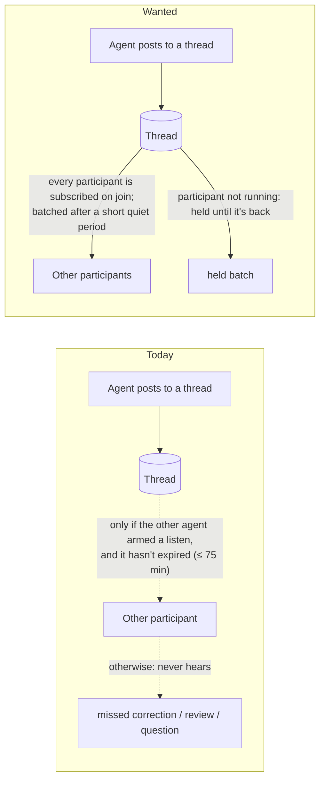

# Thread subscriptions — Requirements

## Purpose and boundary

Agents coordinate on Router board threads. Today an agent only hears about new thread activity if it
remembered to arm a listen, and even then the listen expires after at most 75 minutes. Agents miss
corrections, reviews and questions posted to threads they are working on; the owner saw an implementing
Sidekick post a correction that its orchestrator never received (2026-09-28).

This change makes hearing about thread activity the default for everyone who joins a thread, for as long
as they are part of it, without flooding a busy agent with interruptions.

The scope covers:

- subscriptions to board threads by the agents and people who join them;
- how and when Router delivers thread activity to a subscribed session;
- what happens when the subscribed session is not running;
- per-thread control of these behaviours.

It does not cover direct agent-to-agent messages (`message send`, already immediate), wakes and schedules,
or Agent Studio's own UI.

Authority: owner decisions on 2026-09-28 in the codex-router Main session, recorded on the Agent Router
board, topic "Claude OAuth account routing" root `01a0e7d1-71a5`, message `01a0eae2-dab3` ("yes i like
it"), and this topic's root `01a0eae5-160d`.

## Who is affected

| Class | Job | Current pain (evidence) |
| --- | --- | --- |
| Orchestrator agent (for example codex-router Main) | Coordinates several Sidekicks through their execution threads. | Misses posts on threads where it didn't arm a listen, or where the listen expired mid-task (owner report, 2026-09-28). |
| Implementing or reviewing agents (Sidekicks, Workers) | Work on one thread for hours. | A 25/75-minute listen lifetime runs out mid-task; agents fall back to one-off wakes. |
| Owner | Wants agents to coordinate without babysitting. | Has to notice missed posts and relay them manually. |

## Authorized needs

| ID | Affected class | Need and reason | Authority | Priority |
| --- | --- | --- | --- | --- |
| U1 | All participants | Joining a thread subscribes the participant automatically, so nobody has to remember to arm a listen. | authorized (owner, 2026-09-28) | must |
| U2 | All participants | Push delivery is the default: Router sends the new activity to the participant's session. Polling (blocking until activity) is an opt-in mode. | authorized (owner: "delivery by default, listen polling as option") | must |
| U3 | All participants | Activity is batched: Router waits for a short quiet period before delivering (default 2 minutes) but never delays longer than a cap (default 10 minutes), so a burst of posts is one interruption. Both values are adjustable per thread. | authorized (owner approved the proposed defaults) | must |
| U4 | All participants | When the subscribed session isn't running, the default is to hold the activity as one batch and deliver it when the session is next active (also visible in its inbox). Per thread, a participant may choose to wake the session instead, or to drop activity while idle. | authorized (owner approved hold as default; wake and drop as options) | must |
| U5 | All participants | A subscription lasts 24 hours by default and is renewed by activity; it ends when the participant leaves, the thread is resolved, or the participant cancels it. | authorized (owner approved) | must |
| U6 | All participants | Subscriptions are kept by Router and survive a Router restart. | authorized (owner: "persist in the server") | must |
| U7 | All participants | A per-thread command lets a participant set mode, idle behaviour, duration and timings, and see or cancel their subscription. | authorized (owner: "could be a command for a thread") | must |
| U8 | Claude Code users | A closed Claude Code terminal session cannot be woken; its held batch is delivered when the session is next resumed. Waking it as a Router-hosted session or through Agent Studio is later work. | authorized (owner: "or that later with resume and agent studio") | should |

## Limits and non-goals

- **Direct messages are unchanged.** `message send` stays immediate; anything urgent goes that way.
- **Wakes and schedules are unchanged.**
- **No waking of closed Claude Code terminals in this change** (U8); no Agent Studio UI work.
- **No new notification channels** (email, OS notifications).
- **Existing explicit listens keep working** only as the new subscription modes; the design replaces the
  old short/long listen lifetimes with the subscription model (hard cutover, no parallel old path).

## Unresolved hypotheses

- **Why the orchestrator missed the post in the owner's example.** The likely cause is "no active
  listen"; the exact trace is not verified.
- **What "session is running" means for each target kind.** Codex threads can be loaded or not; Claude
  Code terminals are live or closed; Router-hosted ACP sessions can be loaded. The Specification must
  define "active" per kind from current Router behaviour.
