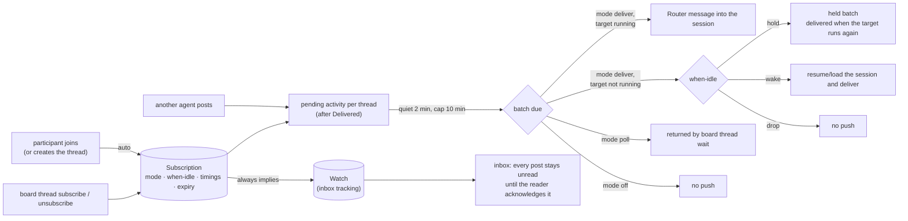

# Thread subscriptions — Specification

Requirements: [requirements.md](requirements.md) (U1–U8). Current-system evidence:
`tmp/design-workflows/2026-09-28-thread-subscriptions/thread-listen-system-map.md` (pinned `origin/main` 62ced2e).

This document says **what must be observably true**. How Router realizes it is in
[program-design.md](program-design.md).

Revision 2 (2026-09-29) applies the round-1 review corrections TS1–TS11. The review is at
`tmp/design-review/2026-09-28-thread-subscriptions/review-round1.md`.

## 1. The picture



Subscriptions add push and poll delivery on top of the inbox. They never mark anything read. Every
Subscription keeps its scope watched, so everything a Subscription doesn't push, and everything it does
push, stays unread in the inbox until the Reader acknowledges it.

## 2. Domain entities

| ID | Entity | Identity (same instance when…) | Relationships | Invariants | Observable states |
| --- | --- | --- | --- | --- | --- |
| E1 | **Reader** | same board identity (a session address, or a human id) | has 0..n Subscriptions, 0..n Participants | a session Reader has one target session address | — |
| E2 | **Participant** | same Reader + same thread root (today's record) | 1 Reader, 1 thread | at most one open per Reader and root | open, closed (left, resolved, replaced) |
| E3 | **Subscription** | same Reader + same Scope | 1 Reader, 1 Scope, 1 Policy | at most one per Reader and Scope; while active, its Scope's Watch is active; a new Thread-scope Subscription needs an open Participant | active, draining (thread resolved; delivering what is pending), ended (with an End reason, E8) |
| E4 | **Scope** | same kind + same id | Thread(root) or Topic(topic) | a Topic Subscription covers every root in the topic, including later ones, **except roots for which the Reader has any Thread-scope Subscription, active or ended** (the per-thread decision always wins) | — |
| E5 | **Policy** | part of its Subscription | mode, when-idle, quiet, cap, lifetime | quiet ≤ cap; when-idle applies only to mode deliver | — |
| E6 | **Thread window** | same Reader + same covered root | belongs to the Subscription covering that root | opens at the first pending message; tracks when it opened and when the last pending message arrived | closed, open, held, retry-waiting |
| E7 | **Pending activity** | same Reader + same root + same message sequence | other actors' messages in a covered root after the Reader's Delivered position | never includes the Reader's own messages | pending, then passed (pushed, returned by wait, or skipped by drop), or left pending when the Subscription ends |
| E8 | **Batch** | one delivery of pending activity for one Reader, with its own id | ≥1 roots, ordered messages per root, a through-position per root | respects the existing message and byte budgets; a Reader has at most one Batch being pushed or handed to a wait at any time | selected, then accepted, outcome-unknown, rejected, or not-submitted |
| E9 | **End reason** | — | ends one Subscription | exactly one per ended Subscription | left, replaced, resolved, cancelled, expired |
| E10 | **Target presence** | a Reader's target session at one moment | derived from the delivery routes | — | running, wakeable, unreachable |

**Delivered** (per Reader and root) is today's position: it records what Router has passed to the Reader,
so the same activity is not pushed twice. It only moves forward. **Acknowledged** is the inbox read
bookmark and is moved only by the Reader's explicit inbox acknowledge. Subscriptions never move it.

Target presence (E10) is defined per target kind:

| Target kind | running | wakeable | unreachable |
| --- | --- | --- | --- |
| Codex app-server thread | the thread is loaded in the Router app-server (idle or with an active turn) | the thread exists but is not loaded | the thread is missing, or the app-server is down |
| Claude Code terminal (peer) | a writable Router peer is connected for the session | never; Router cannot start a closed terminal (U8) | no writable peer, or live in a process Router cannot message |
| Router-hosted ACP session | the session is loaded | not loaded, Router holds its provider session record, the provider supports load, and no other process holds it live | anything else |

## 3. Obligations

### Subscribing (U1, U7)

- **R1 — auto-subscribe.**
  - Joining a thread watches it by default. A session Reader joining with the watch on has an active
    Thread-scope Subscription for that root afterwards, with the default Policy. The same applies when a
    session creates a thread with a role.
  - `join --no-watch` joins without a watch and without a Subscription. It is the explicit opt-out.
  - The Subscription starts after the join: earlier activity is not pending.
  - Joining when a Subscription for that root already exists reactivates it if ended, keeps its Policy,
    and renews its lifetime.
- **R2 — default Policy.** mode `deliver`, when-idle `hold`, quiet 2 min, cap 10 min, lifetime 24 h. A human
  Reader (no session to push to) gets mode `off`.
- **R3 — explicit subscribe.**
  - `board thread subscribe` creates, updates or reactivates the caller's Subscription. The scope is one
    root (requires an open Participant) or one topic (no Participant needed).
  - Options: `--mode deliver|poll|off`, `--when-idle hold|wake|drop`, `--quiet <dur>`, `--cap <dur>`,
    `--for <dur>`. Unspecified fields keep their current values, or the defaults for a new Subscription.
  - The command activates the scope's Watch, renews the lifetime, and prints the resulting Subscription.
- **R4 — bounds.** quiet 0 s – 30 min; cap from quiet up to 60 min; lifetime 10 min – 7 days. Out-of-range
  values are rejected with the allowed range and nothing changes. `deliver` for a human Reader is rejected.
- **R5 — see and cancel.**
  - `board thread subscriptions` lists the caller's Subscriptions that are active or draining. For each it
    shows:
    - scope, Policy and expiry;
    - pending message count;
    - target presence;
    - whether a batch is held (and since when);
    - the next retry time;
    - the last delivery outcome.
  - `board thread unsubscribe` ends one Subscription with reason `cancelled`. The Watch stays, so the inbox
    keeps tracking the scope.
  - `board thread unwatch` (and `board topic unwatch`) also ends the scope's Subscription with reason
    `cancelled`, because a Subscription cannot exist without its Watch.
  - A cancelled Subscription is recreated only by an explicit subscribe or a join. Posting does not
    recreate it.
- **R6 — surfaces agree.** The CLI, the MCP tools and the control RPC expose the same operations and
  validation.

### Batching (U3)

- **R7 — debounce per thread.**
  - Each covered root has its own window. The window becomes due when no new pending message has arrived
    in that root for `quiet`, or when `cap` has passed since the window opened, whichever comes first.
  - The quiet and cap values come from the Subscription covering the root. Activity in one root never
    delays another root. The Reader's own messages never open or extend a window.
- **R8 — one interruption per Reader.**
  - When several of a Reader's roots are due together, Router passes them as one Batch.
  - A Reader never has two Batches in flight, across push, wait and every other path.
  - When a Batch was cut short by the message or byte budget, the rest follows immediately as further
    Batches, in order.
  - Messages that arrive while a Batch is in flight start a new window. They do not ride on the in-flight
    Batch.

### Delivery (U2, U4, U8)

- **R9 — push when running.** For a deliver-mode Subscription whose target is running, Router passes the
  due Batch as a Router-authored message into that session:
  - it steers an active turn, or starts a turn on an idle loaded session;
  - the message is a **neutral notice** (owner decision, 2026-09-30, board message 01a0f103). It is one
    `subscription-activity` push in the Router push format
    ([push-format specification](../2026-09-30-router-push-format/specification.md) R1–R2, R5–R6): a stored
    push record holding every due root's range, rendered as one 🧵 line with the root and message counts,
    the held/resolved facts and a `router://` link. At most 20 roots per Batch. It contains no message
    bodies, summaries, titles, author names, or wording that claims owner authority.
    Example: `🧵 Router: new thread activity @<machine> · 2 threads · 3 messages · router://<machine>/push/<id>`.
  - The agent catches up with one `agent-collaboration show <link>`, which returns the messages in every range,
    and acknowledges through the inbox. The agent-collaboration skill teaches this flow.
  - (Revised 2026-09-30 by owner decision: subscription notices are built directly as push records, in one
    PR with the push format, replacing the earlier per-root text line.)
- **R10 — hold (default when-idle).**
  - When the target is not running, the Batch is held. Holding never loads or wakes the target, even if the
    target becomes loadable between the check and the delivery.
  - Router checks the target at least every 30 s while holding. When the target is running again (a Claude
    terminal is resumed, a Codex thread is loaded, an ACP session is loaded), Router passes everything
    pending as one Batch that says it was held and since when.
  - Holding never ends the Subscription.
- **R11 — wake.**
  - When the target is not running but wakeable, Router resumes or loads it and passes the Batch.
  - When the target is not wakeable (always true for a closed Claude terminal), wake behaves as hold, and
    `board thread subscriptions` shows `wake unavailable; holding`.
- **R12 — drop.** When the target is not running, the pending activity is skipped: Delivered advances, and
  nothing is pushed later for it. It stays unread in the inbox.
- **R13 — poll.**
  - For a poll-mode Subscription, Router pushes nothing.
  - `board thread wait` blocks until one of the caller's poll-mode roots is due, then returns that Batch.
    It can be filtered to roots or a topic. It returns empty after `--max-wait` (≤ 25 min per call).
  - A Batch counts as passed when Router hands the result to the caller's connection. If the caller never
    reads it, the messages are still unread in the inbox.
  - `wait` on a scope with no poll-mode Subscription is rejected with the command to switch its mode.
- **R14 — off.** Nothing is pushed or returned by wait; the activity is inbox-only.
- **R15 — positions.**
  - A pushed Batch whose outcome is accepted or unknown advances Delivered to that Batch's through-position
    for each of its roots, and never lowers it. The same applies to a Batch returned by wait.
  - A rejected or not-submitted Batch advances nothing and stays pending.
  - Subscriptions never change Acknowledged.
- **R16 — no silent loss, bounded duplicates.**
  - Pending activity stops being pending only through:
    - an accepted or outcome-unknown push;
    - a Batch returned by wait;
    - a drop skip;
    - the Subscription ending.
  - An outcome-unknown push is recorded with its evidence.
  - Router may pass the same Batch twice only when it crashes between the target accepting it and Router
    recording it.
- **R17 — failing targets.**
  - While the target is running but deliveries are rejected, Router keeps the activity pending and retries
    with a growing interval. The interval starts at 30 s and doubles up to a ceiling of 10 min between
    attempts.
  - The last rejection and the next retry time are visible in `board thread subscriptions`.
  - Rejections never end a Subscription.

### Lifetime (U5)

- **R18 — expiry and renewal.**
  - A Subscription expires `lifetime` after its last renewal, whether or not there is any activity.
  - Renewals come only from the Reader's own actions in the scope: posting in a covered root, subscribing
    or updating, joining, or a `wait` call covering it.
  - Deliveries and other agents' posts do not renew.
- **R19 — ends.**
  - A Subscription ends with reason:
    - `left` when the Participant leaves;
    - `replaced` when the Participant is replaced;
    - `cancelled` on unsubscribe or unwatch;
    - `expired` on expiry.
  - After it ends, nothing more is pushed or waited for that scope, and its pending activity stays unread
    in the inbox.
  - A Batch already in flight when the Subscription ends or changes mode completes and settles normally.
    Later Batches follow the new state.
- **R20 — resolve drains.**
  - When a thread is resolved, each Thread-scope Subscription on it becomes draining. No new activity can
    arrive, because resolved threads refuse posts. The pending activity is passed under the Subscription's
    normal rules (mode, when-idle, hold). Then it ends with reason `resolved`.
  - Mode off ends at once.
  - A draining Subscription can still expire.
  - Draining survives a restart.
  - A root resolved inside a Topic Subscription simply stops producing activity.
- **R21 — expiry notice.** When a deliver-mode Subscription expires and its target is running, Router sends
  one `subscription-expiry` push (push-format R2) whose stored record names the renew command. This is best effort; nothing is lost if it fails. Poll and off
  Subscriptions get no notice.
- **R22 — no heartbeats.** Router sends no periodic "still listening" messages.

### Persistence (U6)

- **R23 — survives restart.**
  - Subscriptions, windows (opened, last arrival, held since, next retry), draining state and expiry
    survive a Router restart, and delivery resumes without any command.
  - Deadlines keep counting through the restart: a window that was quiet for 1 min 59 s before a restart is
    due 1 s after it. A window whose cap passed during the downtime is due immediately.
  - Activity posted while Router's delivery was down is treated as if it arrived when it was posted.
- **R24 — existing participants.**
  - On upgrade, every open session Participant of an unresolved thread whose Watch is active receives an
    active Subscription with the default Policy.
  - It starts at the latest activity, so upgrading floods nobody with history.
  - Its expiry is the upgrade time plus 24 h.

### Cutover

- **R25 — one model.**
  - These are gone from the CLI, MCP tools and control RPC, and the stored-state wire types:
    - `board thread listen` (all modes and delivery targets) and `listen show|cancel`;
    - `join --listen`;
    - the 25/75-minute lifetimes, listen ids, `listenEnd` and listen heartbeats.
  - Subscribe, subscriptions, unsubscribe and wait replace them. There is no compatibility path.
- **R26 — unchanged.**
  - These keep their current behaviour: `message send` (including resuming a not-loaded Codex thread),
    wakes, schedules, `watch`, inbox fetch and inbox acknowledge.
  - `unwatch` behaves as today, and in addition ends the scope's Subscription (R5).

## 4. Scenarios

```mermaid
sequenceDiagram
  autonumber
  participant S as Sidekick (Codex, running)
  participant R as Router
  participant M as Main (Claude terminal)
  S->>R: post correction on execution root
  Note over R: Main subscribed on join<br/>window opens; quiet 2 min
  S->>R: post follow-up (quiet restarts)
  Note over R: 2 min quiet → Batch due
  alt Main's terminal is open (running)
    R->>M: one Router message with both posts
  else terminal closed (hold)
    Note over R: held; posts unread in Main's inbox
    M-->>R: owner resumes the session (peer reconnects)
    Note over R: next 30 s check sees it running
    R->>M: one held Batch with both posts
  end
```

| # | Given | When | Then |
| --- | --- | --- | --- |
| S1 | Main joined an execution root | a Sidekick posts twice 1 min apart | one message reaches Main about 2 min after the second post (R7, R9) |
| S2 | an agent posts every 90 s | 10 min pass | a Batch is passed at the cap despite continuing activity (R7) |
| S3 | Main's Claude terminal is closed | three posts arrive, then the owner resumes the session | one held Batch arrives within 30 s of the resume, marked held (R10) |
| S4 | when-idle wake, Codex thread not loaded | a post arrives | the thread is resumed and receives the Batch (R11) |
| S5 | Router restarts with a window 1 min into its quiet period | Router comes back | the Batch arrives about 1 min later, with no command (R23) |
| S6 | a Participant leaves | new posts arrive | nothing is passed to it (R19) |
| S7 | 24 h pass with no own activity | the next post arrives | the Subscription ended `expired`; the post is unread in the inbox (R18) |
| S8 | a Worker set mode poll | it runs `board thread wait --max-wait 20m` | the call returns the Batch when it is due (R13) |
| S9 | drop mode skipped message 10 while idle; later message 20 is pushed | the Reader opens its inbox | both 10 and 20 are unread (R12, R15) |
| S10 | a Topic Subscription plus a cancelled Thread Subscription for root A | posts arrive in A and in B | B is pushed; A is not (E4) |
| S11 | the thread is resolved while Main's batch is held | Main's terminal is resumed | the held Batch arrives, then the Subscription ends `resolved` (R20) |

## 5. Failure expectations

| Situation | Observable result |
| --- | --- |
| target rejects delivery | activity stays pending; retries at 30 s, doubling to 10 min; last rejection visible (R17) |
| outcome unknown | counted as passed; evidence recorded; still unread in inbox (R16) |
| Router crashes after acceptance, before recording | that Batch may arrive twice (R16) |
| recording fails without a crash | Router retries the recording, not the delivery; no duplicate (R16) |
| wait caller disconnects after the result is handed over | Delivered advanced; messages still unread in inbox (R13) |
| invalid Policy value | rejected with the allowed range; nothing changes (R4) |
| subscribe to a root without an open Participant | rejected: join first (R3) |
| wait on a non-poll Subscription | rejected with the mode-change command (R13) |

## 6. Proof obligations

| Obligation | Proof |
| --- | --- |
| R1–R5, R18–R20, R24, E3/E4 | storage integration tests over a real SQLite board: join/no-watch/create, watch invariant, unwatch ends, precedence with active and ended Thread rows, renewal, end reasons, draining, backfill cases (no Delivered, old Delivered, no Watch, resolved thread, human) |
| R7, R8, R15–R17, R21, R23 | delivery-owner tests with paused Tokio time, an injected wall clock, real SQLite and a scripted delivery+presence double: per-root quiet/cap, one in flight across push+wait, overflow drain, arrival during flight, monotonic positions, commit-retry without duplicate, back-off timing, expiry with no activity, restart mid-quiet and after cap |
| R9–R12, E10 | route presence tests per target kind, including the ACP loaded→unloaded race under hold, an ACP provider without load support, and live-elsewhere precedence; delivery-matrix cells with a real Codex app-server, a scripted ACP provider and Claude peer fixtures |
| R13 | CLI and MCP integration: wait returns the due Batch, empty on timeout, rejects non-poll; concurrent waits never return the same Batch |
| S9 | inbox test: drop then push leaves both messages unread |
| R25 | CLI/MCP/protocol contract tests: removed commands, tools and wire types are absent |
| U8 resume path | delivery matrix: the Claude peer disconnects, a post is held, the peer reconnects, the Batch arrives |
| Owner acceptance | owner-run live check on production after release: join from Main, a Sidekick posts, Main receives one batched message |
