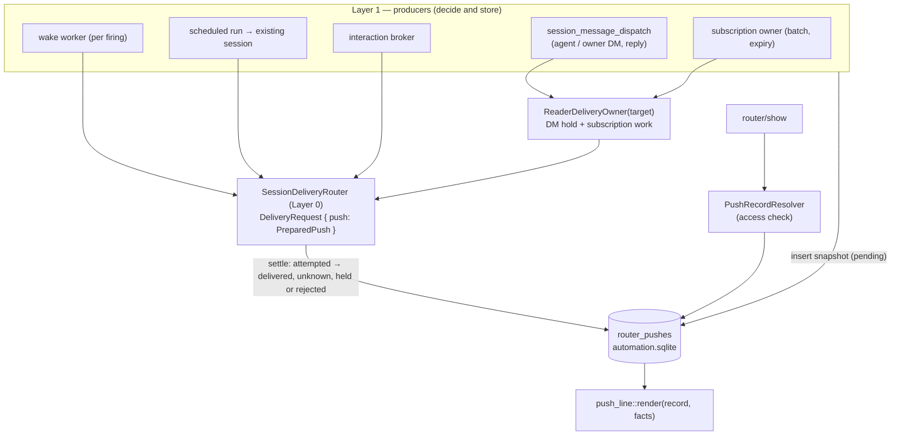

# Router push format — Program Design

Realizes [specification.md](specification.md) rev 2 (R1–R21) for [requirements.md](requirements.md).
Evidence: `tmp/design-workflows/2026-09-30-router-push-format/push-surface-map.md` (main 5f6df3a, #104 95fa5d1).
Revision 2 applies Advisor findings PF2–PF13 (PF1 rejected by owner decision).

**Sequencing (revised 2026-09-30, owner decision):** this ships in **one PR together with**
thread-subscriptions delivery. `TargetPresenceProbe` and `LoadPolicy` are on main (#106);
`ReaderDeliveryOwner` is built in that same PR and emits subscription notices directly as push records, so
there is no interim subscription renderer.

## 1. One idea: every push is a stored record, and Layer 0 carries a prepared push



- **Producers own storage.** Adapters (Codex, ACP, peer) never store anything; they deliver the prepared
  line as text.
- **Layer 0 carries `PreparedPush { push_id, line, load_policy }`,** in place of `MessageContent` plus
  header context, for every push path.
- **Task input keeps its own path.** Fresh-session schedule runs, the summary worker and `conversation
  prompt` still send their text as input (R16).

## 2. Components

| Component | Owns | Change |
| --- | --- | --- |
| `collaboration-protocol` · `push_line.rs` | `PushKind`, `PushOrigin`, `RouterLink` (`router://<machine>/push/<id>`), `PushHeaderFacts`, `render_push_line` with the R1–R3 escaping and budget rules, `parse_push_line_header` (display only) | new |
| `collaboration-protocol` · `message_content.rs` | `MessageContent` stays the **send input**; the Agent and Router envelope renderers and parsers are deleted | cutover |
| `automation-storage` · migration + `push_records.rs` | `router_pushes` table; insert, settle, hold, list-by-target, inbox and history for DMs, prune; drops `latest_agent_senders` | new |
| `automation-storage` · retention | 30-day prune, in bounded batches with each prune independent, of: `router_pushes`; whole `mailbox_deliveries` rows that are settled, over 30 days old and not referenced by any `wakeup_definitions` pending pointer; whole `operation_receipts` rows older than 30 days. This makes the idempotency window explicitly 30 days; the replay comparison over exact canonical bytes (`local_operation_receipts.rs:21-25`, `external_operation_receipts.rs:44-49`) is unchanged for retained rows, and a later replay of a pruned id is admitted as a new operation | extend |
| `interaction_history.rs` | add `created_at` to each entry; entries without one are stamped with the upgrade time on first load; prune entries over 30 days | extend |
| `collaboration-service` · `push_record_resolver.rs` | `router/show`: load the record, apply R10, mark read per R11, expand subscription ranges through the existing board range read | new |
| `collaboration-service` · `machine_identity.rs` | machine id = service id; label from the Remote Control name, else the host name (escaped, bounded); written to `service.json` | new |
| producers | `session_message_dispatch` / `session_message_reply_dispatch` (DM, reply by id, owner DMs); `wakeup_delivery_sender` (one record per firing, existing delivery mode); `scheduled_native_dispatch`, `provider_acp_run_dispatch` and `provider_delivery_submission` (existing-session runs become pushes; fresh runs keep task input); `interaction_broker`; the subscription owner (batch and expiry records) | cutover |
| `ReaderDeliveryOwner` (subscriptions) | started for a target with **either** active or draining subscriptions **or** pending or held DM records. On restore it scans both; it ends when both are empty. Commands add `DmQueued(push_id)`. DM holds use `LoadedOnly`; one push in flight per target across DMs and subscription batches | extend |
| `codex_queue_reconciliation.rs` | matches by `clientUserMessageId == push_id` + target + route; drops content comparison | cutover |
| `session_display_text.rs` (agent-collaboration), `session_inventory_dispatch`, client `session_catalog` | titles from `parse_push_line_header`, never the preview; fall back to an endpoint label | cutover |
| peer route, `provider_prompt_contents.rs`, client `acp_conversation.rs` | deliver `PreparedPush.line`; no rendering or guidance text | cutover |
| CLI / MCP | `show`, `message inbox`, `message history --with`, `message reply <id>`; `--expect-sender` removed; `--from` behaviour follows U13 once researched | surface |
| `agent-skills/agent-collaboration` | the catch-up habit, via the skills-creation gate | teach |

## 3. Storage

```sql
CREATE TABLE router_pushes (
  push_id            TEXT PRIMARY KEY,         -- UUIDv7; the link id and delivery correlation id
  kind               TEXT NOT NULL,            -- PushKind (Rust enum)
  origin_kind        TEXT NOT NULL,            -- session | owner | router
  origin_service_id  TEXT, origin_endpoint_id TEXT, origin_session_id TEXT,   -- set iff origin_kind = session
  origin_router_ref  TEXT,                     -- wake id / schedule+run id / interaction id / subscription scope
  target_service_id  TEXT NOT NULL, target_endpoint_id TEXT NOT NULL, target_session_id TEXT NOT NULL,
  reply_to_push_id   TEXT REFERENCES router_pushes(push_id) ON DELETE SET NULL,
  header_facts_json  TEXT NOT NULL,            -- serialized PushHeaderFacts (domain type)
  body               TEXT,                     -- snapshot; NULL for subscription-activity
  ranges_json        TEXT,                     -- subscription-activity: [{root,from,through}] + held/draining
  delivery_state     TEXT NOT NULL,            -- pending | attempted | held | delivered | outcome_unknown | rejected
  last_outcome_json  TEXT,
  created_at         TEXT NOT NULL,            -- UTC; retention origin
  settled_at         TEXT,
  read_at            TEXT                      -- DMs only; set by the target's show
) STRICT;
CREATE INDEX router_pushes_target_state ON router_pushes(target_service_id, target_endpoint_id, target_session_id, delivery_state, created_at);
CREATE INDEX router_pushes_created ON router_pushes(created_at);
DROP TABLE latest_agent_senders;
```

- **Validation lives in Rust.** Kind, origin and state enums, the pairing of origin with its fields, and body
  vs ranges per kind are all checked in constructors (AGENTS.md); rows are read through `query_as!` into
  private rows.
- **DM delivery state lives on the record.** `mailbox_deliveries` stays wake-only and unchanged (PF3). A wake
  firing inserts its push record in the same transaction as its existing mailbox row, on the same connection.
- **Connection policy follows the existing automation store**: DELETE journal, FULL sync, 1 s busy timeout.
  A DM insert that hits `SQLITE_BUSY` retries with bounded back-off, up to 5 s, then errors. Settle writes
  retry until they succeed and never re-push. Prunes run in batches of 500 rows. Using a separate pool only
  avoids the `AutomationStore` mutex; it doesn't give DMs an independent writer (PF12).

## 4. The line (R1–R3)

- **Preview, in this order:** take the first 100 scalars of the body, escape them, then append `(+N)`
  counting the body scalars not shown.
- **Budget:** assemble the line; while it is over 1024 bytes, trim the machine label, then the name, then the
  schedule name, then the preview (each to a shorter form ending in `…`). The link and the kind emoji are
  never trimmed.
- **Owner DMs:** the same one-line compact form with the `🧑 Owner (unverified)` header. There is no multi-line
  exception until owner verification exists (R13).

## 5. Flows

```mermaid
sequenceDiagram
  autonumber
  participant C as Caller (CLI/MCP)
  participant D as session_message_dispatch
  participant DB as automation.sqlite
  participant O as ReaderDeliveryOwner(target)
  participant R as SessionDeliveryRouter
  participant T as Target session
  C->>D: message send --to T "…"
  D->>DB: INSERT router_pushes (pending)
  D->>O: DmQueued(push_id)  (spawn the owner if absent)
  O->>DB: state = attempted
  O->>R: deliver PreparedPush (LoadedOnly, correlation = push_id)
  alt accepted
    R->>T: ✉️ … · "preview" · router://…/push/id
    O->>DB: delivered (retry the write on failure; never re-push)
  else not running / retryable not-submitted
    O->>DB: held (30 s presence tick)
  else unknown
    O->>DB: outcome_unknown + evidence
  end
  D-->>C: sent ✉️ id → T · delivered | held
```

- **Restart:** the owner restores targets that have pending or held records and resubmits only those.
  `attempted` rows with no outcome settle as `outcome_unknown` and are not re-sent (R15).
- **Wake firing:** insert the push record and the mailbox row in one transaction, then deliver through
  Layer 0 with the wake's **own** mode and `MayLoad`. It is not held (R14).
- **Schedule to an existing session:** record, then Layer 0 with the schedule's existing mode. Fresh or fork
  runs: unchanged task input (R16), including `developerInstructions` as today.
- **Approval or question:** the broker inserts the record (the interaction id is the origin reference) and
  delivers it; `approval decide` stays the action path.
- **Subscription batch:** the owner inserts one record with every selected range plus the held and draining
  facts, then pushes one 🧵 line. Delivered and Acknowledged semantics are unchanged; the record is only the
  link target (PF4).

## 6. Access (R10–R11)

The resolver compares the caller's reported session identity (U13, owner decision A: CLI harness env, the MCP
request's sender; `--from` test-only) with `origin_*` and `target_*`. It is a confusion guard, not
authentication; the follow-up caller-authentication design replaces the reported identity with an
authenticated request context. **There is no owner bypass yet**: a self-declared
human or a missing session identity is treated as neither participant. Owner access arrives with owner
verification. This runs inside the service-directory boundary, where
every client is the same OS user. It prevents confusion and casual misuse, and it is not authentication.
Only a `show` by the target on a DM sets `read_at`.

## 7. Failure and consistency

| Case | Handling |
| --- | --- |
| insert busy | bounded retry, then error; nothing pushed |
| crash after insert, before attempt | resubmitted on restore |
| crash after attempt, before settle | settles `outcome_unknown`; not re-sent |
| settle write fails after acceptance | retry the write only |
| a DM expires while held | deleted at 30 days; the link reports expired; history omits it |
| Codex queue reconciliation | `clientUserMessageId == push_id`, target and route must match, unique by construction |

## 8. Cutover

**Every renderer call becomes a PreparedPush or stays task input:**

| Caller | After |
| --- | --- |
| `scheduled_native_dispatch.rs:50` | existing session → push; fresh → task input |
| host `provider_delivery_submission.rs:34` | push |
| `provider_prompt_contents.rs:28` | push (line as text); conversation prompts are task input |
| `provider_acp_run_dispatch.rs:94` | existing-session run → push |
| client `acp_conversation.rs:738-744` | caller prompt → task input; no envelope |
| `session_display_text.rs:66-85` | header parser |

**Deleted:**
- the envelope renderers and parsers, and their exported helpers;
- `latest_agent_senders` and `--expect-sender`;
- the peer guidance text.

The control schema digest changes.

## 9. Slices (one PR, one worktree, run one after another)

| Slice | Content | Contract handed to the next slice |
| --- | --- | --- |
| A — line | `push_line.rs` (kinds, origin, link, facts, render + budget + escaping, header parser) + machine identity + whoami; property tests | `render_push_line`, `RouterLink`, `PushHeaderFacts` |
| B — records | `router_pushes` migration + repository + retention (push, mailbox bodies, interaction history) + resolver + access + `router/show` + CLI/MCP (show, inbox, history, reply by id) + DM send store-first (without holds yet) | `PushRecordStore`, `PreparedPush`, `router/show` |
| C — delivery | Layer 0 `PreparedPush` cutover for every caller in §8; wake, schedule and broker records; subscription batch and expiry records; DM holds in `ReaderDeliveryOwner`; queue reconciliation; titles; deletions; delivery matrix; skill text (gated) | — |

Slice C is the largest. If it proves too big for one Luna xhigh, split it inside the same PR into C1
(producers and Layer 0) and C2 (owner holds, reconciliation, titles, deletions and matrix).

## 10. Proof seams

| Spec | Seam |
| --- | --- |
| R1–R4 | `push_line` property tests |
| R5–R11, R14–R15, R17 | real-SQLite integration: injected clock, busy injection, response loss, settle failure, restart, cross-session reads |
| R12–R13, R16, R18–R19 | CLI/MCP integration |
| R20–R21 | queue reconciliation and title tests; a symbol search showing removed renderers are gone |
| S1–S10 | delivery matrix: real Codex app-server, ACP fixture, Claude peer fixture |

## 11. Implementation decisions (Lead, 2026-10-01)

- **DM delivery intent is stored.** DM-kind push records persist the caller's delivery mode (`auto | queue | steer`) and
  an optional generation guard (`CodexGeneration`); non-DM records carry neither. Both are decoded through domain
  types and fail closed. A steer or guarded DM to a target that is not running is rejected at send time (steer needs
  a running turn; a guard names a generation that cannot be satisfied later) and nothing is held. On restore the
  owner delivers with the stored mode and pinned precondition; a steer or guarded record that meets not-running, a
  generation mismatch or a race settles `rejected`, never `held`. Auto DMs may be held. Claude Code peer endpoints
  reject Queue with `QueueUnsupported` whether the terminal is open or closed, and the CLI recommends resending
  with `--delivery auto`; other endpoints retain their Queue support and hold behavior.
- **DMs do not depend on the board.** The `ReaderDeliveryOwner` service starts whenever automation storage opens and
  takes the board as `BoardAvailability::{Available, Unavailable}`; with the board unavailable, DM holds still work
  and subscription operations return a board-unavailable error.
- **Restart discovery.** Restore finds targets with pending or held DM-kind records; DM-kind `attempted` records
  without an outcome settle `outcome_unknown` and are not re-sent.
- **Fresh-run envelope remains task input (R16, owner decision).**
  `crates/collaboration-service/src/scheduled_run_worker.rs:836-844` continues to prepend the existing task-input
  context to a fresh schedule run. That envelope is not a push, creates no push record, and stays unchanged.
