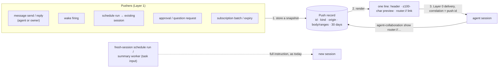

# Router push format — Specification

Requirements: [requirements.md](requirements.md) (U1–U13, plus the owner decisions and scope call there).
Evidence: `tmp/design-workflows/2026-09-30-router-push-format/push-surface-map.md` (main 5f6df3a, #104 95fa5d1).
[program-design.md](program-design.md) says how.

Revision 2 applies the Advisor's round-1 findings PF1–PF13
(`tmp/design-review/2026-09-30-router-push-format/advisor-review-round1.md`). PF1 is rejected because the
owner explicitly decided that fresh runs carry the full instruction.

## 1. The picture



**Push vs task input.** A push interrupts a session that is already working, and it is always a stored record
plus one line. Task input starts a brand-new session whose whole job is that input: fresh-session schedule
runs, and the summary worker's read-only thread. Task input is delivered in full, as today (owner decision).

## 2. Domain entities

| ID | Entity | Identity | Relationships | Invariants | Observable states |
| --- | --- | --- | --- | --- | --- |
| E1 | **Machine** | one Router instance (its service id) | owns its push records | stable id; label = the Remote Control name, else the host name | — |
| E2 | **Push record** | same machine + push id (UUIDv7) | 1 Machine, 1 target session, 0..1 reply-to (DMs), 1 origin (E3) | **snapshot**: the body or ranges are copied at creation and never change; stored before any delivery attempt | pending → attempted → delivered, held, rejected or outcome-unknown; expired (deleted after 30 days) |
| E3 | **Origin** | — | who caused the push | `session(ref)` (agent, identity as Router knows it), `owner(unverified)`, or `router(kind)` (wake, schedule, broker, subscription) | — |
| E4 | **Push kind** | — | classifies E2 | `dm`, `wake`, `schedule-run`, `approval`, `question`, `subscription-activity`, `subscription-expiry` | — |
| E5 | **Router link** | `router://<machine-id>/push/<push-id>` | names exactly one E2 | the link is a locator inside the owner's OS-user trust boundary, not a bearer capability | resolvable, expired, foreign |
| E6 | **Push line** | rendered from one E2 | — | one line, ≤ 1024 UTF-8 bytes; the link is always complete | — |
| E7 | **Thread range** | root id + from/through activity | belongs to a subscription-activity E2 | 1..=20 per record | — |

## 3. Obligations

### The line (U1, U4, U8)

- **R1 — shape.**
  ```
  <kind emoji> <header facts> · "<preview>"[ (+N)] · router://<machine-id>/push/<push-id>
  ```
  - The preview is the first 100 Unicode scalar values of the body, **counted before escaping**.
  - `(+N)` counts the body scalars not shown.
  - A body of 100 or fewer shows whole, with no `(+N)`.
  - Subscription kinds have **no preview** (neutral, U8).
- **R2 — header facts** (emoji by default):

  | Kind | Line |
  | --- | --- |
  | dm (agent) | `✉️ <role emoji> <name> (<endpoint>/<8-char id>) @<machine> → you · "<preview>" · <link>` |
  | dm (owner, unverified) | `🧑 Owner (unverified) @<machine> → you · "<preview>" · <link>`. This is the compact path until owner verification exists (R13) |
  | wake | `⏰ Router wake @<machine> · "<preview>" · <link>` |
  | schedule-run (existing session) | `🗓 Router schedule "<name>" @<machine> · run <8-char id> · "<preview>" · <link>` |
  | approval / question | `❓ Router approval\|question @<machine> · <requester name> asks · "<preview>" · <link>` |
  | subscription-activity | `🧵 Router: new thread activity @<machine> · <roots> threads · <n> messages[ · held since <time>][ · thread resolved] · <link>` |
  | subscription-expiry | `🧵 Router: subscription expired @<machine> · <scope> · <link>` |

  An unknown name falls back to `<endpoint emoji> <endpoint>/<8-char id>`. Schedules have no stored display name
  today, so the schedule line uses the schedule's 8-char id in place of `"<name>"`
  (`🗓 Router schedule <8-char schedule id> @<machine> · run <8-char id> · "<preview>" · <link>`); instruction text
  is never promoted into the header (Lead decision 2026-09-30; a schedule name field is a tracked follow-up).
- **R3 — escaping and budget.**
  - Every variable field (name, machine label, schedule name, preview) is escaped: `\` → `\\`, `"` → `\"`,
    CR/LF/U+2028/U+2029 → `⏎`, other control characters → `\u{…}`. The ` · ` separator appears only
    between fields.
  - If a line would exceed 1024 bytes, Router trims display fields in this order until it fits, each
    trimmed field ending in `…`: machine label, name, schedule name, preview. The link and the kind emoji are
    never trimmed.
  - A long label never causes a send to be rejected.
- **R4 — no envelopes.** No push contains `Self-declared sender:`, `Intended recipient:`, JSON, batch sets,
  listen-end or heartbeat records. The recipient is never named.

### Records and fetching (U2, U3, U6, U7)

- **R5 — store first, snapshot.** Before any delivery attempt, Router stores a push record with the full
  body, or for subscription-activity the list of thread ranges plus the held and draining facts. If the store
  fails, no push is attempted and the caller gets an error.
- **R6 — one fetch.** `agent-collaboration show <link>` (and MCP `router_show`) returns the record:
  - kind and origin (sender shown as Router knows it, marked unverified where it is);
  - time and reply-to;
  - the body, or for subscription-activity the messages in every range, read from the board.

  Expired or unknown ids give `not found (expired after 30 days, or never existed)`.
- **R7 — retention (30 days).** Router deletes 30 days after creation:
  - push records of every kind, including held or undelivered ones;
  - interaction-history entries (they gain a creation time; existing undated entries count as created at
    upgrade);
  - `mailbox_deliveries` rows, deleted whole once settled and 30 days old, never while a wake still
    references them as pending;
  - whole `operation_receipts` rows older than 30 days. The idempotency window is 30 days: an operation id
    replayed after that is treated as a new operation.

  Excluded by the Lead scope call: `workflow_runs.captured_inputs_json` (run history) and board threads.

  A wake definition that fires later creates a **new** record for that firing, so definition age never
  affects push expiry. Board threads and reusable definitions (schedules, instruction documents, wake
  definitions) are not push content and keep their own lifetimes (Lead scope call, recorded in the
  Requirements).
- **R8 — DMs off the board.** Sending or reading a DM creates, changes or lists nothing in board projects,
  topics, threads or the board inbox.
- **R9 — DM inbox.**
  - `message inbox` lists the caller's unread DMs in push-line form.
  - `message history --with <session>` lists retained DMs between the caller and that session.
  - Expired DMs are simply absent.

### Access and read state (U11, U13)

- **R10 — who may read.**
  - A DM record: its origin session or its target session. Anyone else gets `not permitted`.
  - Other kinds: the target session.
  - Owner access (U11) arrives with owner verification. A self-declared human or an absent session
    identity is not the owner.
  - "Caller" is the session identity the client reports (harness environment for the CLI; the request's
    sender for MCP). `--from` is removed from normal use (tests only). This is a **confusion guard** inside the
    owner's one-OS-user trust boundary, **not authentication**. Authenticated caller context is the tracked
    follow-up design (U13).
- **R11 — read marking.** Only the target session's `show` marks a DM read. The sender's or the owner's
  `show` never changes read state.

### Replying (U9)

- **R12 — reply by id only.**
  - `message reply <push id | link> "<text>"` sends a DM to that record's origin session, with reply-to
    set, and the result names the recipient.
  - A reply with no id is rejected, showing the required syntax.
  - Replying to a non-DM record, or to an owner-origin DM, is rejected, naming the right command (for
    example `approval decide` or a thread post).

### Delivery (U10)

- **R13 — owner messages.** An owner-origin DM (`--human-user`) is self-declared, so it uses the compact
  push under `🧑 Owner (unverified)` and carries no authority beyond its text. Full-body delivery for
  **proven** owner messages (U12) arrives with the owner-verification follow-up; nothing in this design grants
  it on the self-declared flag.
- **R14 — hold for DMs only.**
  - A DM whose target isn't running is held and delivered when the target is next running, using the
    subscriptions presence and hold rules. The result says `held`.
  - Wakes and schedule runs keep their existing delivery mode and load behaviour: Auto may resume an
    unloaded Codex thread, exactly as today.
- **R15 — delivery outcomes.**
  - The push id is the delivery correlation id, which makes it unique per attempt target.
  - `outcome-unknown` counts as passed and is recorded.
  - A failure to record an accepted delivery retries the record write, never the push.
  - Only pending and held records are submitted again after a restart. An attempted record whose outcome
    was never recorded settles as outcome-unknown and is not re-sent.
- **R16 — task input (owner decision).** A fresh-session schedule run and the summary worker's read-only
  thread receive their full instruction as today. They are not pushes and create no push record.
- **R17 — sizes.** DM bodies are capped at 64 KB; a longer send is rejected with the limit.

### Machines and links (U5)

- **R18 — machine identity.** `agent-collaboration whoami` shows the machine id and label.
- **R19 — foreign links.** `show` on another machine's link returns
  `lives on <label or id>; cross-machine fetch not available yet`.

### Cutover and consumers

- **R20 — ids, not text, for correctness.**
  - Queue reconciliation matches on the push id as `clientUserMessageId`, and still checks target and route.
  - Reply uses record ids.
  - Session titles (display only) may read the header grammar, never the preview, and fall back to an
    endpoint label.
- **R21 — hard cutover.** Removed:
  - the Agent and Router envelope renderers and parsers;
  - #104's `latest_agent_senders` and `--expect-sender`;
  - the peer reply-guidance text;
  - every direct renderer call in push paths.

  Conversation prompts that the caller sends to its own conversation (`conversation prompt`) are task input
  and unchanged.

## 4. Scenarios

| # | Given | When | Then |
| --- | --- | --- | --- |
| S1 | Main sends a Sidekick "S1 is green" | it arrives | one line: `✉️ ✳️ Main (claude-local/8d47f947) @Sunbook-Pro-M4 → you · "S1 is green" · router://…/push/…` |
| S2 | a 1,340-char receipt | it arrives | 100 scalars, `(+1240)`, the link; `show` returns everything |
| S3 | the recipient's terminal is closed | a DM is sent | the result says `held`; the DM arrives on resume |
| S4 | the Sidekick got DMs from A then B | `message reply <A's id> "done"` | A receives it; `message reply "done"` with no id is rejected |
| S5 | a subscription batch covers 2 threads, held | the owner resumes the session | one 🧵 line, 2 threads, `held since …`; one `show` returns both ranges |
| S6 | a wake to an unloaded Codex thread | it fires | Auto resumes the thread as today; the push is one ⏰ line |
| S7 | a record is 31 days old | `show` | not found (expired) |
| S8 | a third session `show`s A→B's DM | — | `not permitted` |
| S9 | you send with `--human-user` | it arrives | the compact `🧑 Owner (unverified)` line with a preview and the link |
| S10 | any push | inspect the session input | no JSON, no envelope lines |

## 5. Failure expectations

| Situation | Result |
| --- | --- |
| record store fails | no push; error (R5) |
| outcome unknown | recorded; counted as passed; not re-sent (R15) |
| settle write fails after acceptance | the write is retried; no re-push (R15) |
| over-budget line | display fields trimmed; the link is kept (R3) |
| foreign or expired link | clear error (R6, R19) |
| a non-participant reads a DM | not permitted (R10) |

## 6. Proof obligations

| Obligation | Proof |
| --- | --- |
| R1–R4 | renderer property tests: multibyte names and bodies, quotes, backslashes, CR/LF/U+2028, long labels, the 1024-byte bound, every kind |
| R5–R9, R14–R15, R17 | real-SQLite integration with an injected clock: store-first, snapshot immutability, 30-day deletion across push records, interaction history and mailbox bodies, a new firing of an old wake definition, hold then deliver, unknown outcome, settle-retry, restart resubmission rules |
| R10–R12 | CLI/MCP integration: participant, owner and third-party reads, read marking, reply by id, no-id rejection |
| R13, R16 | an unverified owner DM uses the compact `🧑 Owner (unverified)` line with a preview and link; a fresh schedule and the summary thread get full task input with no push record |
| R18–R21 | whoami; foreign link; queue reconciliation by push id; titles; a contract search showing no removed renderer or parser remains |
| S1–S10 | delivery matrix over a real Codex app-server, the ACP fixture and the Claude peer fixture, asserting the exact first line |
