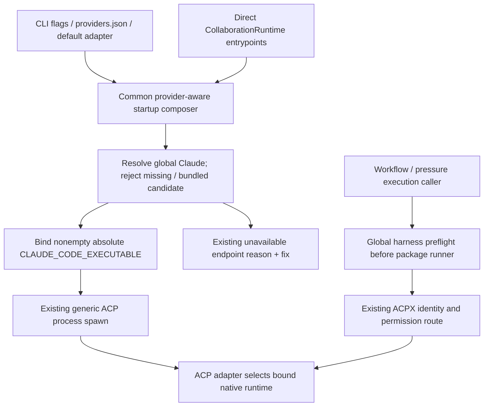
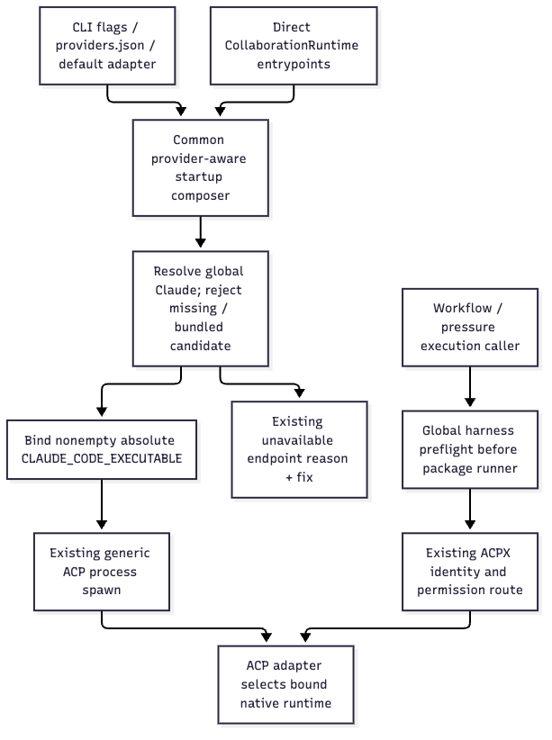

# Bind global runtimes at their existing launch owners

Realizes [Specification](global-harness-specification.md) RG1–RG5 for [Requirements](requirements.md) U36. Keep adapter transport ownership, provider operation ownership and conversation persistence unchanged.

## Owners, homes and shapes

| Entity | Existing owner and home | Boundary shape / modification |
| --- | --- | --- |
| EG1 Harness executable | Provider-aware Router startup composition; orchestration launcher before ACPX/package dispatch | Private validated absolute executable path. Claude uses existing `CLAUDE_CODE_EXECUTABLE`; Codex pressure execution uses its existing executable override. No new wire or stored-domain format. |
| EG2 Adapter launch | `codex-router-host::provider_startup_composition` selects policy; `acp-client-runtime::ExternalProviderLaunch` and SDK spawn consume executable/args/env | Existing launch struct and environment vector; bind the global path before generic spawn. Existing `ExternalProviderStartup::Unavailable` and endpoint reason/fix report missing dependency. |
| EG3 Relationship | Existing ACPX record/native identity and Router provider session/operation owners | Existing ids, cwd, command/argv and lifecycle. Ambient env is a spawn input, not live-runtime identity evidence; retain held relationships until the correct cold launch is established. |

## Current and proposed edges

| Current edge | Proposed disposition |
| --- | --- |
| CLI adapter selection: explicit flags, enabled providers.json, PATH defaults | Keep selection and malformed/disabled handling. Adapter selection does not select native Claude. |
| Host lifecycle proxy environment composition | Keep URL/token behavior; do not make this the sole global-harness hook because direct CollaborationRuntime callers bypass it. |
| Common `compose_provider_startup` → provider runtime initialization | For Claude, resolve global executable and replace duplicate/inherited native selection with the validated absolute path before spawn; failed resolution becomes existing provider-unavailable reason/fix. Preserve independent providers. |
| Generic extracted ACP runtime → SDK process spawn | Keep generic: it has no ProviderKind and must not invent Claude policy. It forwards the already-bound environment. |
| Adapter0.81.2 `claudeCliPath` | Use supported nonempty override. No vendor/cache patch or new package installation. Existing package fallback is not reached when the owner binds the global executable. |
| ACPX orchestrator default | Preflight the global harness before invoking the existing package runner; carry selection across every lifecycle call. Preserve record/native ids and command/argv identity. Check cold/live state through supported operations; a live adapter cannot be repinned by ambient env alone. |
| Codex pressure runner deletes CODEX_PATH | Replace that default with explicit global resolution while preserving the adapter sandbox pin and per-run isolation. A missing global harness stops before adapter startup. |

The resolver checks the effective owning launch search path, captures an executable absolute path, and rejects project-local/transient package search entries and known SDK native-package targets. Explicit test environments may supply a fixture global search directory; they do not mutate the process-global environment. No global-path registry, installation manager, new retry, process supervisor or SDK fork is needed.

## Why these two launch boundaries

The observed ACPX review did not pass through production Router startup. A Router-only patch cannot correct its caller. Conversely, adding an environment variable to one review command does not fix all Router startup entrypoints or establish a permanent orchestration default. Each existing owning boundary applies one selection rule; the generic transport remains reusable.

Binding at the common Router composer closes the production/direct-start bypass without moving provider policy into the generic ACP client. The orchestration contract must precede a package runner's PATH changes and cover every lifecycle invocation. Correct selection is independent of auth state; do not change account/security settings to make a runtime-version mismatch disappear.

## Preservation and evidence seams

Use actual process launches for selected file/version and no-fallback assertions. A scripted external adapter can reproduce its documented executable-variable contract while Router startup, runtime spawn and nested executable are real; pair it with the actual installed adapter's nested CLI version probe. State the scripted-adapter assumption and do not count it as authenticated provider completion. Missing-global proof includes a present bundled alternative and explicit absence of adapter dispatch.

Existing ACPX session environment/agent-process env can override ambient values, and an already-running queue owner retains spawn-time state. Supported state inspection must establish the intended cold launch/effective executable selection; never kill an unknown process or create a replacement relationship to bypass a mismatch. Managed policy and explicit runtime configuration are not edited by this correction; actual provenance must verify the selected runtime rather than infer it from a caller-only variable.

| R | Entity | Owner / interface | Shape and state | Failure | Proof |
| --- | --- | --- | --- | --- | --- |
| RG1 | EG1–EG2 | Common provider startup / orchestration preflight | Captured global path → existing environment → real process | Missing/wrong candidate cannot silently select SDK | VG1, VG3 |
| RG2 | EG1–EG2 | Existing endpoint availability / caller failure | Existing unavailable reason/fix, no dispatch | Fail closed; preserve other providers | VG1 |
| RG3 | EG1–EG3 | Existing provider protocol and session owners | Existing parameters, ids, permissions/auth | Preserve existing failure semantics | VG2 |
| RG4 | EG1–EG3 | Actual spawn/provenance observer; supported ACPX state | Executed path/version versus adapter/version and warm state | No config-only or env-only false claim | VG1–VG3 |
| RG5 | EG1–EG2 | Existing Codex/Cursor launch owners and pressure runner | Global executable override / installed native path | Missing global stops; no bundled substitute | VG4 |

Current-source anchors and exact primary package paths are retained in the private research ledger. No public endpoint field, database migration, permission mode or lifecycle ownership changes are introduced.
