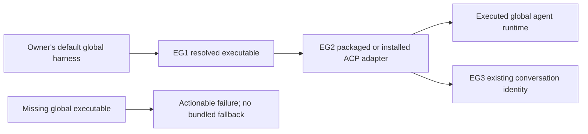

# Global harness selection

Governing [Requirements](requirements.md): U36 and operational limits. A packaged ACP adapter is transport software; it is not authority to choose a different installed agent runtime.

## Consumer problem and entities

The owner installed a global Claude CLI, but the ACP review route selected the adapter SDK's optional native binary. Adapter version, harness version, authentication state and review completion are separate observations. Selecting the wrong executable does not establish the cause of an authentication failure.

| Entity | Identity and relationships | Invariants and observations |
| --- | --- | --- |
| EG1 Harness executable | One resolved installed executable for a launch. An updated executable is a different launch identity. | Global command selection resolves an absolute executable path; SDK-bundled and project-local candidates do not supply the default. Version/provenance describe the executed file, not the adapter. |
| EG2 Adapter launch | One transport-process lifetime, using one EG1 when the adapter delegates to an agent. | Adapter packaging may use existing supported package runners; actual nested agent execution must use the selected global harness. |
| EG3 Conversation relationship | Existing provider/native conversation identity across requests and idle time. | Reuse retains identity. A changed caller environment does not prove an already-running EG2 changed executables. |

## Obligations

- **RG1 (U36; EG1–EG2):** Default launches MUST select the globally installed harness. Claude's ACP bridge MUST receive a nonempty absolute executable selection rather than fall through to its SDK optional runtime. Router defaults, explicit adapter flags/configurations and supported direct runtime entrypoints MUST retain this rule. Adapter packages remain permitted.
- **RG2 (U36; EG1–EG2):** When the global executable is unavailable, the owning launcher MUST fail with actionable global-installation guidance and MUST NOT invoke a bundled substitute. Disabled providers retain their existing disposition; one unavailable provider retains existing isolation from other providers.
- **RG3 (U36; EG1–EG3):** Protocol shapes, permission modes, settings/model/effort selection, conversation identities and authentication/security configuration MUST retain their established behavior. This correction does not log in, copy credentials, install unrecognized software, mutate global configuration or replace production processes. Locked development dependencies and the repository's required validation tools may be materialized locally for proof without changing the lockfile or global configuration.
- **RG4 (U36; EG1–EG3):** Proof MUST observe actual executed executable identity/path/version and the missing-global no-fallback case. Adapter `--version`, an environment snapshot or accepted prompt alone is insufficient. Reuse of an already-running adapter MUST NOT be reported as repinned merely because the caller changed its environment.
- **RG5 (U36; EG1–EG2):** Other affected default harness callers MUST preserve global selection. The existing managed Codex runtime and direct Cursor ACP command are not replaced by SDK runtimes. The Codex pressure runner MUST NOT erase global executable selection and silently accept its adapter's bundled default.

## Failure and proof boundary

Resolve the normal host command before a package runner can change its search path. Preserve a captured global executable for that launch; a later global installation update is resolved by the next launch. Reject empty/missing selection and SDK-bundled candidates rather than treating them as an acceptable installation. Authentication and model failures remain their existing outcomes after correct executable selection.

| Proof | Required observation |
| --- | --- |
| VG1 / RG1–RG2 | A real nested process chooses the fixture global executable while a bundled alternative exists; identity/path/version match. With the global executable absent, no adapter/runtime fallback runs and the existing unavailable result contains actionable guidance. |
| VG2 / RG3 | Existing provider lifecycle/protocol/permission cases remain included; no identity replacement or authentication/configuration mutation. |
| VG3 / RG4 | Actual installed adapter forwards to the selected installed global CLI; deliberately missing nonempty override fails instead of reporting the bundled version. Existing warm process provenance and spawn-time environment remain distinct. |
| VG4 / RG5 | Codex orchestration default selects its global executable without removing the override; pinned adapter sandbox behavior stays. Existing global managed-Codex and direct Cursor boundaries are accounted for. |

Native provider/model work is never exercised through production as feature proof. Existing isolated fixtures may stand in for external components only at their named transport boundary; report those limits. A successful version probe does not claim review or authentication success.

Source basis: exact Claude adapter0.81.2 `claudeCliPath`, query options and nested spawn; ACPX0.19.4 command/env/reuse rules; Router provider startup composition and generic SDK spawn; ai-tools pressure-runner executable environment. The owner global-only requirement governs when older defaults contradict it.
