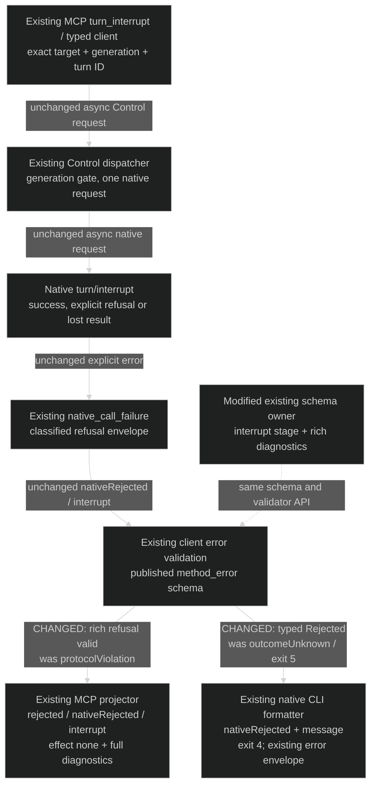
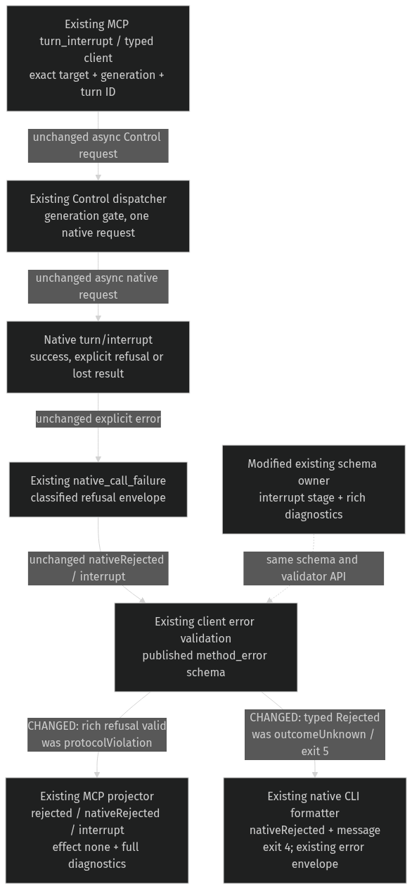

# Exact turn interruption — align the existing schema owner

Realizes [Specification](interrupt-specification.md) RI1–RI4 for [Requirements](requirements.md) U2. This repair aligns the existing Control schema with the native refusal already emitted by the service. It introduces no runtime owner or stored state.

## Ownership and the changed return path

The native Control dispatcher owns dispatch and refusal classification. The published Control schema owns which method-specific error envelopes are valid. The client owns validation before exposing a typed result. MCP uses `operation_failure_from_client_error`; the native CLI separately uses `native_session_commands` → `endpoint_commands::report_failure`. Each preserves its existing presentation contract.

## Entity bindings and boundary shapes

| Entity | Semantic owner | Package/module home | Schema/type home | Shape across boundaries | Lifetime / convention |
| --- | --- | --- | --- | --- | --- |
| EI1 Exact turn | Existing generation gate and native runtime | `collaboration-service::NativeGenerationGate`, native Control dispatcher (existing) | `collaboration-protocol::NativeInterruptParams`, `CodexGeneration`, `SessionRef`, `NonEmptyText` (existing) | Control request: target + generation + turnId, all required. Native request: threadId + turnId, required; generation is checked before dispatch. | Request-local references to existing runtime state; validated newtypes and closed Serde structs. |
| EI2 Interruption request | Existing Control client / dispatcher | `collaboration-client::ControlConnection`, `collaboration-service::native_control_dispatch` (existing) | Existing Control envelope and `NativeInterruptParams` | JSON-RPC request: jsonrpc=2.0, correlated id, method=codex/turnInterrupt, params as EI1. Exactly one native request; no replay. | Derived per call; existing typed parameters and frame limits. |
| EI3 Interruption outcome | Existing native dispatcher for truth; schema owner for validity; client for typed result; MCP projector and native CLI formatter for distinct presentation | `collaboration-service::native_control_dispatch` (existing); `collaboration-protocol::control_schema_document` (modified); `collaboration-client::operation_error`, MCP (existing); `agent-collaboration::native_session_commands` / `endpoint_commands::report_failure` (existing) | Existing `NativeInterruptResult`, `method_error`, `ClientError`, `AdapterOperationFailure`; existing CLI failure envelope | Success: target + generation + turnId + kind=interruptCompleted. Service refusal: closed envelope below. Client: Rejected { code, data } or existing Protocol/transport errors. MCP refusal: kind=rejected, serviceKind=nativeRejected, stage=interrupt, effect=none, data=original diagnostics. CLI machine refusal: kind=error, error={kind:nativeRejected,message}; human stderr=message; exit 4. | Derived response; no persistence. Existing Serde enums, method-specific JSON Schema and CLI formatter. |

The rich refusal envelope retains the existing emitter's shape:

| Field | Type and presence | Constraint / owner |
| --- | --- | --- |
| jsonrpc / id | Required version 2.0 and existing correlated request ID | Existing Control envelope |
| error.code | Required integer, -32050 | Existing service error branch |
| error.message | Required nonempty string | Existing 1,024-byte/character bounds |
| error.data.kind / stage | Required nativeRejected / interrupt | Method-specific schema |
| error.data.message | Required nonempty string | Existing 1,024-byte/character bounds |
| error.data.reason | Required closed enum | childThread, busy, heldByAnotherClient, notResumable, permissionDenied, unsupportedCapability, unknown |
| error.data.nextAction | Required closed enum | inspectTarget, useDeliverySteer, messageFromHoldingCodexClient, requestApproval, correctRequest, retryLater |
| error.data.nativeCode | Optional integer; absent rather than null | Existing emitter supplies it for unclassified native errors |

No extra properties are permitted in the service refusal branch. Existing JSON-RPC standard errors and general method failures retain their existing branches; this repair does not tighten unrelated envelopes.

## Schema realization and alternatives

Extend `method_error`'s existing rich-native-diagnostics method selection to `codex/turnInterrupt`. Select the rich refusal stage explicitly by method: inspect, rename or interrupt. Remove `nativeRejected` from that method's general three-field branch so a refusal cannot bypass required reason/nextAction. Keep rename's `nameMismatch` branch exclusive to rename. Preserve the reason/action sets, optional integer nativeCode, `additionalProperties: false`, message bounds and `control_error_is_valid`'s additional byte checks.

This is the smallest existing-boundary repair. Removing diagnostics from the dispatcher would discard useful information the owner needs; accepting arbitrary extra fields would weaken the shared contract. Neither solves RI1 and RI2 together. A new error type, recovery task, migration or second schema owner is unnecessary. Maintainers pay for one additional method/stage case and its boundary proofs. Revisit only if a real valid native refusal cannot be represented by the existing diagnostic contract; do not infer new policy from such a counterexample.

## Current and proposed edge comparison

| Edge / authority | Current | Proposed / disposition |
| --- | --- | --- |
| MCP `turn_interrupt` → `ControlClient::interrupt_turn` → `ControlConnection::call` | Exact typed request; async Control IO | Intentionally unchanged; RI3 |
| Service `dispatch_native` → gate → `request_validated(InterruptTurn)` | Checks generation; sends threadId and turnId once | Intentionally unchanged; RI3 |
| Native refusal → `native_call_failure` → Control response | Rich nativeRejected/interrupt data | Intentionally unchanged; RI1 |
| `control_schema_document::method_error` → `control_error_is_valid` | Rich branch only for inspect/rename; interrupt rejects the emitted fields | Changed: interrupt's rich branch accepts its exact stage and diagnostics; RI1–RI2 |
| Client `exchange` → typed `Rejected` → `operation_failure_from_client_error` → MCP | Invalid method error becomes Protocol; MCP reports protocolViolation/effect unknown | Changed result edge for valid interrupt refusal: existing projector reports rejected/nativeRejected/interrupt/effect none with original data. Invalid responses retain existing projection; RI1–RI2 |
| Client `interrupt_turn` → `native_session_commands` → `endpoint_commands::report_failure` → CLI process output | Protocol after mutation_started becomes outcomeUnknown/exit 5 | Changed result edge for valid interrupt refusal: existing Rejected arm reports nativeRejected/message/exit 4. Existing machine error envelope and human stderr remain; no richer CLI fields; RI1 |
| Success, stale generation, transport loss, inspect/rename | Existing success/guard/uncertainty/diagnostic behavior | Intentionally unchanged; RI3–RI4 |

Decisive sources at 7a8cbd89: native_control_dispatch's `dispatch_native` and `native_call_failure`; control_schema_document's interrupt registration and `method_error`; control_error_validation's byte guard and per-method compiled catalogue; collaboration-client/control_connection's `interrupt_turn` and `exchange`; collaboration-client/operation_error's rejection projection; collaboration-mcp/mcp_server's `turn_interrupt`. Existing service native-control and inspect/rename schema tests cover adjacent behavior but omit this interrupt refusal connection.

## Failure, concurrency and trust

Schema generation and validation are pure policy changes. No new concurrent task, cancellation branch, write, retry or lifetime is introduced. Existing per-method validator caching remains derived from the one published schema; normal service publication supplies its updated digest. No manual production schema refresh is part of testing.

Malformed or over-limit refusal data is rejected at the existing client validation boundary (schema plus UTF-8 byte guard). A valid native refusal propagates without asserting interruption success: the existing MCP projector's native-control-refusal rule reports effect none, and the native CLI's existing Rejected arm reports exit 4. Existing generation checks contain stale calls before native dispatch. A lost post-dispatch result retains unknown effect; neither the client nor this correction resubmits it. No new auth, secret handling, persistence, availability policy or performance target is introduced.

## Proof seams and coverage

The serializer, schema generator, actual validator, Control client, public MCP handler and native CLI binary must be real. An isolated native WebSocket peer may substitute for external Codex to produce explicit bounded refusals and observe the exact request; it does not substitute for any part of the error propagation under test. Exercise the real service dispatcher between that peer and the client, the real MCP transport/handler for its public result, and the CLI process for machine/human output and exit status. A hand-written Control error proves consumer behavior only and cannot by itself establish emitter/schema agreement.

| U | R / scenario | E | Owner | Interface | Shape and home | State | Failure | Proof |
| --- | --- | --- | --- | --- | --- | --- | --- | --- |
| U2 | RI1 valid native refusal | EI2, EI3 | Existing dispatcher, schema owner, MCP projector and native CLI formatter | native_call_failure → validator → client Rejected; operation_failure_from_client_error → MCP; native_session_commands → report_failure → CLI | Rich nativeRejected envelope in control_schema_document; MCP rejected/nativeRejected/interrupt/none/data; CLI error/nativeRejected/message/exit 4 | Explicit refusal → rejected, no effect; CLI refusal exit 4 | Must not become MCP Protocol or CLI outcomeUnknown for emitted valid fields | Actual emitted data validates; real native peer → dispatcher → client/MCP preserves diagnostics/effect none; real CLI verifies machine/human output and exit 4 |
| U2 | RI2 malformed refusal | EI3 | Existing schema owner and client validator | method_error / control_error_is_valid | Closed rich branch in collaboration-protocol | Invalid response → Protocol | Missing/extra/wrong/over-byte-limit data fails closed | Actual schema and byte validator positives and single-defect negatives |
| U2 | RI3 exact turn and truthful effect | EI1, EI2, EI3 | Existing generation gate / native dispatcher / client | interrupt_turn / request_validated | NativeInterruptParams/Result; existing unknown-effect envelope | Guarded, accepted, refused or unknown | Stale generation cannot dispatch; lost result cannot claim success | Native request and receipt identities; no-dispatch stale case; single dispatch and unknown after loss |
| U2 | RI4 adjacent method isolation | EI3 | Existing schema owner | method_error / per-method validator | Inspect/rename branches and rename-only mismatch | Existing valid diagnostics remain valid | Interrupt data cannot leak into unrelated methods | Actual inspect/rename regression and cross-method negative validation |

EI1–EI3 and VI1–VI4 are covered by the binding and proof tables. Other U rows remain in the milestone backlog and are neither superseded nor closed by this design. The remaining uncertainty is executable agreement and transport proof, not a missing structural owner.
