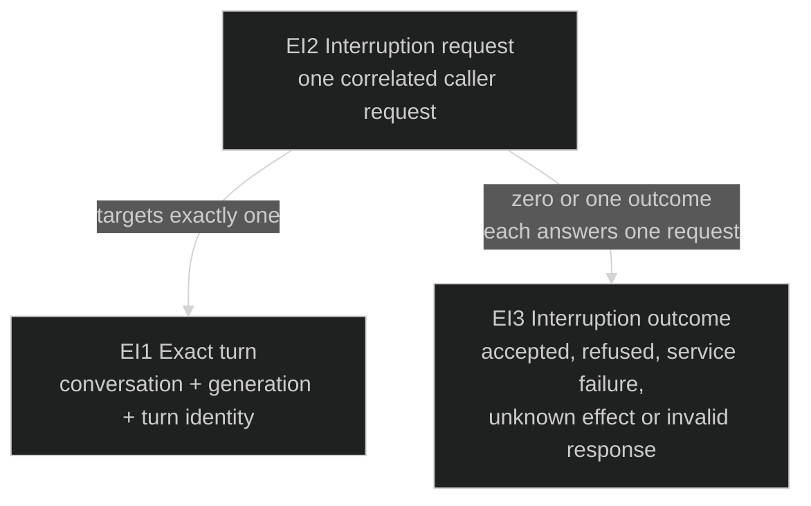
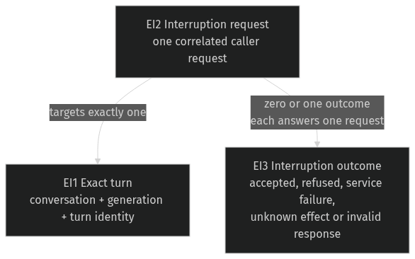

# Exact turn interruption — rejection diagnostics

Governing [Requirements](requirements.md): U2 and the operational limits. [Program Design](interrupt-program-design.md) realizes this bounded error-path correction. The existing native interruption contract remains authoritative for target identity, generation fencing, success and unknown effects.

## What the caller needs to know

The owner or an agent selects an exact turn and asks Router to interrupt it. An explicit native refusal should remain distinguishable from an unknown outcome. Current source converts an otherwise valid classified interrupt refusal to `protocolViolation` with unknown effect through MCP; the native CLI reports `outcomeUnknown` and exits 5. This source-level contradiction has not yet been reproduced in a compiled runtime.

| Observation | Current source path | Required observation |
| --- | --- | --- |
| Native explicitly refuses the selected interruption | MCP reports protocolViolation / unknown effect; CLI reports outcomeUnknown / exit 5 | Typed client/MCP retain the classified refusal; MCP reports no effect. CLI reports nativeRejected / message / exit 4 |
| Native accepts interruption | Receipt identifies the selected turn and generation | Same receipt; acceptance does not assert observed cessation |
| Response becomes unreadable or is lost after dispatch | Unknown effect remains distinguishable | Same truthful uncertainty; no automatic replay |

## Domain entities

| ID | Term and identity | Relationships | Invariants / observable states | Basis |
| --- | --- | --- | --- | --- |
| EI1 | Exact turn: one conversation, backend generation and native turn identity. A later turn or generation is a different instance. | One conversation; zero or more caller interruption requests. | Requesting interruption never authorizes stopping a different turn; existing generation guards remain. | U2; existing native contract |
| EI2 | Interruption request: one caller's correlated request directed at one EI1. A separately submitted request is a different instance. | Exactly one EI1; at most one corresponding EI3. | Submitted, accepted, refused or outcome unknown; receipt alone is not cessation evidence. | U2; existing native contract |
| EI3 | Interruption outcome: the response correlated to EI2, including a refusal's diagnostics when present. | Exactly one EI2. | Accepted, classified refusal, other existing service failure, unknown effect or invalid response. These meanings must remain distinct. | U2; existing failure contract |

## Observable obligations

- **RI1 (U2; EI2–EI3):** An explicit native refusal with valid existing diagnostics MUST reach the typed client and MCP as a rejection, retaining its stage, message, classified reason, next action and optional native code. MCP MUST report `kind: rejected`, `serviceKind: nativeRejected`, `stage: interrupt` and `effect: none`. The native CLI MUST retain its existing refusal output: `nativeRejected` and the native message with exit code 4. The CLI's machine envelope remains `kind: error` with `error.kind` and `error.message`; human output is the message on stderr. A valid refusal MUST NOT become MCP's protocol violation or the CLI's unknown-outcome/exit-5 result solely because interruption has rich diagnostics.
- **RI2 (U2; EI3):** The refusal contract MUST remain closed: required diagnostics cannot be missing, unrelated fields or unsupported stage/reason/action values cannot be admitted, and existing nonempty text and UTF-8 byte limits remain enforced. Invalid responses remain distinguishable from valid refusals.
- **RI3 (U2; EI1–EI3):** The change MUST preserve exact target/turn identity and generation guards, successful receipts, truthful unknown-effect handling after dispatch and no automatic replay. Native refusal does not claim successful interruption; success does not claim observed cessation.
- **RI4 (U2; EI3):** Native inspection and rename MUST retain their existing diagnostic contracts, including rename mismatch outcomes. Interruption diagnostics MUST NOT become valid for an unrelated method.

The existing CLI, typed client and MCP surfaces consume the same refusal truth through different presentation contracts. Full diagnostic data is retained by the typed client and MCP; this correction does not add richer fields to the CLI's existing failure envelope. It defines no new refusal reason, corrective action, parameter, stored record or retry behavior. The managed app-server path that discards a supplied turn identity is a separate U2 investigation; this bounded correction does not close that finding or the full milestone.

## Examples and proof obligations

| ID | Obligation | Evidence that distinguishes pass from fail |
| --- | --- | --- |
| VI1 | RI1 | A real native refusal crosses Router's actual service serialization and error validation, then the typed client, MCP and real CLI boundaries. MCP reports rejected/nativeRejected/interrupt/none and the original bounded diagnostics. CLI JSON reports error/nativeRejected/message with exit 4; human stderr retains the message and exit 4. Include classified and unknown-code refusals; neither surface reports its current misleading failure. |
| VI2 | RI2 | Actual published validation accepts well-formed interrupt refusals and rejects missing reason/action, extra fields, wrong stage, unsupported reason/action, invalid code types and over-limit UTF-8 text. |
| VI3 | RI3 | Exact turn/generation assertions on the dispatched request and success receipt; stale-generation refusal prevents native dispatch; post-dispatch loss stays unknown and is not replayed. |
| VI4 | RI4 | Current inspect/rename cases remain valid, rename mismatch remains rename-only, and unrelated method validation rejects rich interruption diagnostics. |

Automated real service/client/MCP interactions can establish the affected runnable behavior; direct serializer/validator tests alone cannot prove propagation. All runtime evidence uses isolated debug state and endpoints. Production Router is outside the proof boundary.

Source basis: `collaboration-service::native_control_dispatch` emits rich `nativeRejected` diagnostics; `collaboration-protocol::control_schema_document::method_error` currently permits that branch only for inspect/rename; `collaboration-client::ClientConnection::exchange` rejects invalid method errors before exposing a rejection. Native CLI presentation lives in `native_session_commands` → `endpoint_commands::report_failure`; MCP uses `operation_failure_from_client_error`, whose existing interrupt-refusal rule reports no effect. These are observational causes, not new product obligations.
