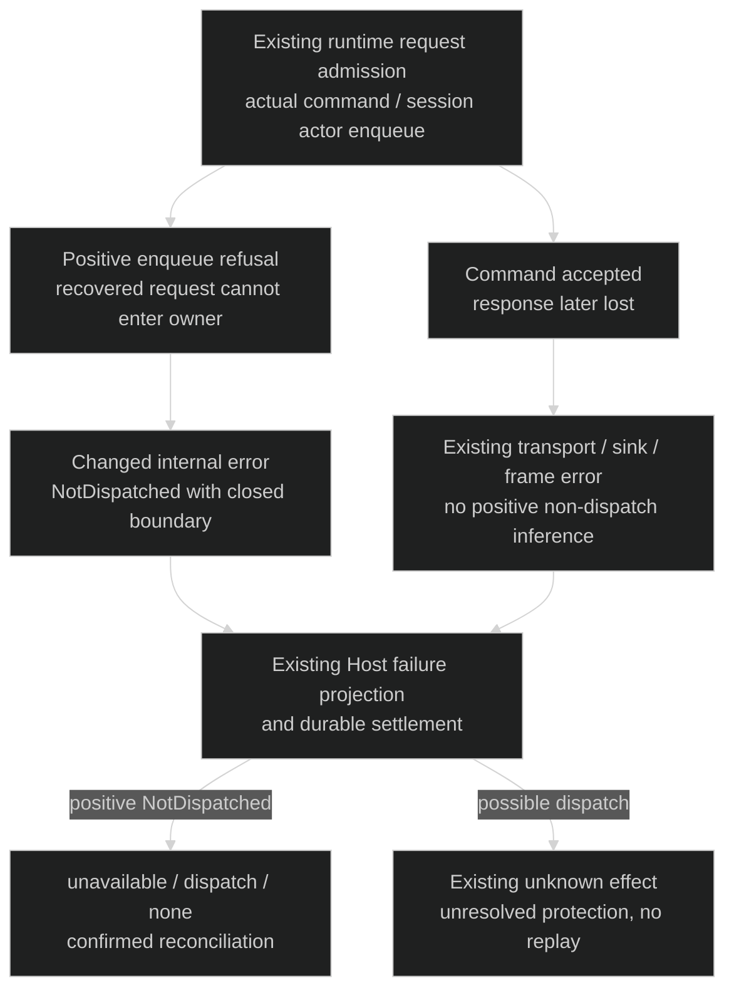
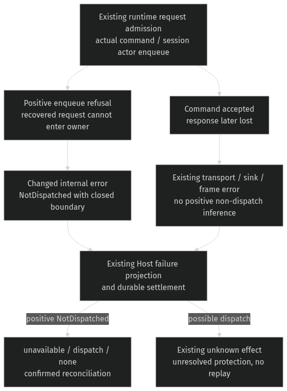

# Provider retirement — keep no-dispatch evidence at its existing owner

Realizes [Specification](provider-failure-specification.md) RP1–RP3 for [Requirements](requirements.md) U1. Runtime enqueue outcomes are the authority for positive non-dispatch; Host remains the public failure projector and operation settlement owner. Retain conservative may-have-dispatched bookkeeping until a stronger actual terminal result exists.

## The distinguishing return edge

## Bindings and shape

| Entity | Semantic owner | Package/module home | Schema/type home | Boundary shape | Lifetime / convention |
| --- | --- | --- | --- | --- | --- |
| EP1 Provider binding | Existing runtime lifecycle and Host binding owner | `acp-client-runtime::AgentSessionClient`, Host external provider supervisor/startup composition (existing) | Existing binding identity/generation/retirement types | Existing endpoint + provider binding/generation references | Existing runtime state; validated identities and cancellation token |
| EP2 Provider operation | Existing Host supervisor and operation store | `codex-router-host::external_provider_supervisor`, `collaboration-service::ProviderOperationStore` (existing) | Existing OperationId, ConversationOperationFailure and terminal record | Existing operationId, optional target, failure kind/stage/effect, reconciliation | Existing persisted record; no migration/new journal |
| EP3 Dispatch evidence | Existing runtime command/session enqueue owner | `acp-client-runtime::agent_session_client`, `provider_connection_task` (modified error return only) | `ExternalProviderRuntimeError` gains internal `NotDispatched { boundary: ProviderCommandAdmissionBoundary }`; closed boundary enum `ConnectionActor` / `SessionActor` | Runtime→Host: typed positive refusal versus existing TransportFailure/SinkClosed/frame failure. Host→public: existing unavailable/dispatch/none fields | Derived per operation; no new persisted or wire type; Rust payload enum |

The new internal variant is constructed only when the actual request enqueue returns its request unaccepted. A successful enqueue followed by reply-receiver closure continues to use the existing uncertain transport class. The session actor forwarding failure must return the typed failure through its recovered reply sender, not drop that sender and force the caller to guess from EOF. Existing LocalBusy/settings/not-found validation failures keep their established no-effect classifications.

Use the actual extracted `acp-client-runtime` owner. The Host `external_provider_runtime` wrapper delegates into it; the similarly named old helper file is not the active production prompt path. Consumers of the internal runtime error are audited at integration so settings or other operations cannot accidentally treat a positive non-dispatch variant as unknown, or reinterpret a post-dispatch error as none.

## Current and proposed path

| Edge | Current source reality | Target disposition |
| --- | --- | --- |
| Host binding lookup → runtime | Already-observed retirement is refused with unavailable/binding/none; retirement can race after the check | Intentionally unchanged; do not infer effect from the later token |
| Host admission/store → runtime work | Conservatively marks may-have-dispatched before runtime work | Intentionally unchanged; positive terminal evidence is stronger |
| Runtime command enqueue refusal → Host | Same generic transport class as a lost reply | Changed: typed NotDispatched with ConnectionActor boundary |
| Runtime session enqueue refusal → caller/Host | Emits optional NotSubmitted observation, drops recovered reply; caller sees transport loss | Changed: send typed NotDispatched with SessionActor boundary through the recovered reply; keep truthful existing dispatch observation |
| Successful enqueue → lost reply or accepted turn retirement | Generic transport/sink/frame error | Intentionally unchanged; uncertainty and no replay |
| Typed positive refusal → Host failure/settlement | No distinct positive variant exists | Changed: existing unavailable/dispatch/none and confirmed terminal reconciliation |
| Initialization and lifecycle retirement/process cleanup | Existing startup errors, retirement notifications and child cleanup | Intentionally unchanged; no stronger liveness promise |

Current source anchors at 7a8cbd89: provider_client_operations create/restore and retired_operation_error; provider_prompt_dispatch failed enqueue versus lost receiver; provider_connection_task session enqueue failure; provider_session_actor Submitted observation; Host external_provider_runtime forwarding; external_provider_supervisor runtime_binding/prepare_operation/finish; provider_operation_failure prompt/general projections. [Source ledger](../../../tmp/practices-research/2026-10-03-provider-dispatch-truth/research-ledger.md) records the precise inspected lines and executable gaps.

## Failure and consistency

No new process supervision, startup handshake, task, retry, clock or store is introduced. A process can exit at any moment after admission; rejecting initialization solely because a later lifetime ended would not carry the per-operation dispatch fact and would leave the race after the check. Changing every TransportFailure to no effect would falsely certify submitted work. The typed return at the actual admission boundary is the smallest repair that satisfies both RP1 and RP2; maintainers pay for one internal payload variant and its consumers.

Host's existing failure settlement chooses confirmed reconciliation for none effect and unresolved for unknown effect. Preserve that rule and verify actual operation-store transitions/eligibility; the conservative early dispatch marker does not justify leaving a positively unsubmitted operation blocked. An operation result is not a replay authorization. Do not erase historical uncertainty or automatically retry after either result.

## Proof and trace

The enqueue result, runtime client, real subprocess protocol, Host projection and operation store must be real. A scripted isolated ACP provider may stand in for external Claude/Cursor through the existing provider fixture seam; gates force startup/command/response order rather than sleeping. A narrow permanent admission pause is acceptable only if it exposes an actual existing boundary; it cannot fabricate a Submitted/NotSubmitted result or turn an absent event into evidence. Pair every no-effect case with post-acceptance loss. Use synthetic values only and reap every owned child.

| U | R / scenario | E | Owner | Interface | Shape and home | State | Failure | Proof |
| --- | --- | --- | --- | --- | --- | --- | --- | --- |
| U1 | RP1 positive non-dispatch after startup | EP1–EP3 | Existing runtime admission and Host projector | Actual enqueue result → runtime failure → Host result | Internal NotDispatched in acp-client-runtime; existing unavailable/dispatch/none carrier | Admitted request positively refused | Retirement cannot erase no-dispatch evidence | Gated real create/restore/prompt races and public result identity |
| U1 | RP2 possible dispatch / lost outcome | EP2, EP3 | Existing runtime result and Host projector | Successful enqueue → lost reply/turn end | Existing transport/sink/frame classes and unknown-effect carrier | Possibly dispatched → unresolved | No absence-based none-effect claim or replay | Paired accepted-work loss, one submission, actual unknown result |
| U1 | RP3 durable certainty and cleanup | EP1–EP3 | Existing Host settlement/store and runtime lifecycle | finish / record_terminal / retirement cleanup | Existing effect/reconciliation/operation identities | Confirmed none versus unresolved unknown | False blocker removed only with positive evidence; true uncertainty protected | Durable state/next eligibility and owned subprocess-reaping observations |

EP1–EP3 and VP1–VP3 are covered by these bindings/seams. Compile/runtime reproduction and the exact original startup failure journey remain unverified. No public kind or storage format change is needed; a counterexample that needs one returns to the Lead before implementation.
