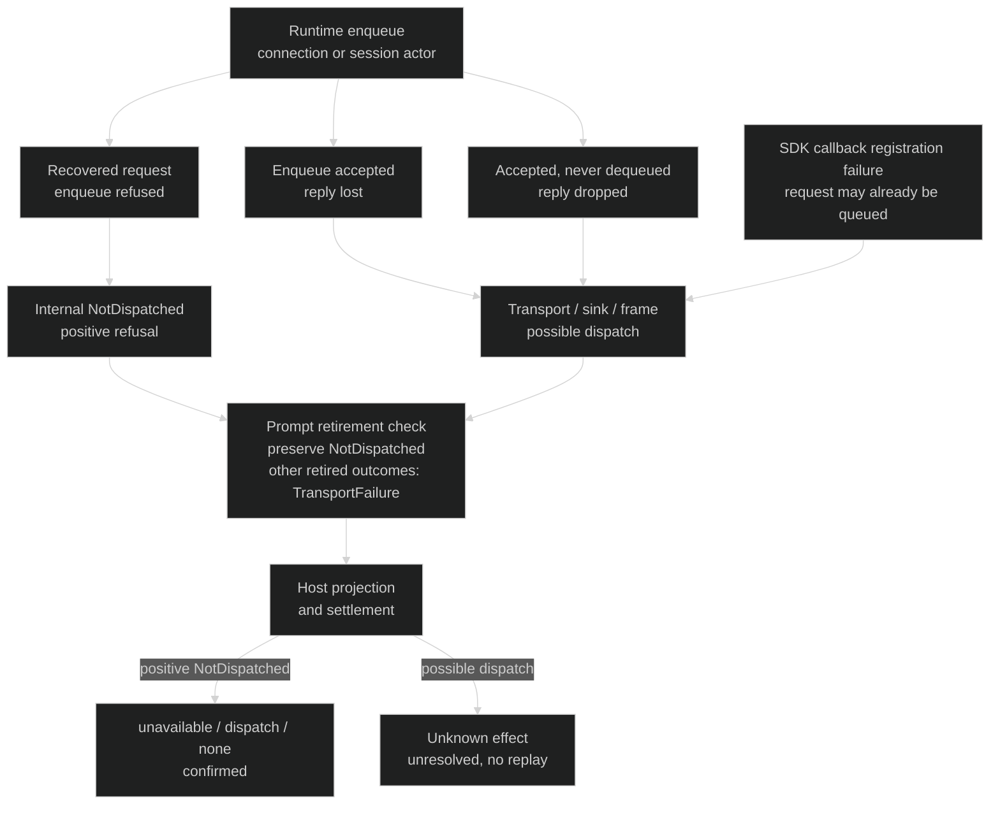

# Provider retirement — keep no-dispatch evidence at its existing owner

Realizes [Specification](provider-failure-specification.md) RP1–RP3 for [Requirements](requirements.md) U1. Runtime enqueue outcomes are the authority for positive non-dispatch; Host remains the public failure projector and operation settlement owner. Retain conservative may-have-dispatched bookkeeping until a stronger actual terminal result exists.

## The distinguishing return edge

## Bindings and shape

| Entity | Semantic owner | Package/module home | Schema/type home | Boundary shape | Lifetime / convention |
| --- | --- | --- | --- | --- | --- |
| EP1 Provider binding | Existing runtime lifecycle and Host binding owner | `acp-client-runtime::AgentSessionClient`, Host external provider supervisor/startup composition (existing) | Existing binding identity/generation/retirement types | Existing endpoint + provider binding/generation references | Existing runtime state; validated identities and cancellation token |
| EP2 Provider operation | Existing Host supervisor and operation store | `codex-router-host::external_provider_supervisor`, `collaboration-service::ProviderOperationStore` (existing) | Existing OperationId, ConversationOperationFailure and terminal record | Existing operationId, optional target, failure kind/stage/effect, reconciliation | Existing persisted record; no migration/new journal |
| EP3 Dispatch evidence | Existing runtime command/session enqueue owner | `acp-client-runtime::agent_session_client`, `provider_connection_task` (modified error return only) | `ExternalProviderRuntimeError` gains internal unit variant `NotDispatched`; no unused boundary payload or additional enum | Runtime→Host: typed positive refusal versus existing TransportFailure/SinkClosed/frame failure. Host→public: existing unavailable/dispatch/none fields | Derived per operation; no new persisted or wire type; Rust payload enum |

The new internal variant is constructed only when the actual request enqueue returns its request unaccepted. A successful enqueue followed by reply-receiver closure continues to use the existing uncertain transport class. The session actor forwarding failure must return the typed failure through its recovered reply sender, not drop that sender and force the caller to guess from EOF. Existing LocalBusy/settings/not-found validation failures keep their established no-effect classifications.

Use the actual extracted `acp-client-runtime` owner. The Host `external_provider_runtime` wrapper delegates into it; the similarly named old helper file is not the active production prompt path. The producer and consumer sets below are closed for this bounded startup/create/restore/prompt correction; planning must not expand them by changing every generic transport mapping. Other operation families retain their existing classes unless they receive this typed result through a listed shared consumer.

## Current and proposed path

| Edge | Current source reality | Target disposition |
| --- | --- | --- |
| Host binding lookup → runtime | Already-observed retirement is refused with unavailable/binding/none; retirement can race after the check | Intentionally unchanged; do not infer effect from the later token |
| Host admission/store → runtime work | Conservatively marks may-have-dispatched before runtime work | Intentionally unchanged; positive terminal evidence is stronger |
| Runtime command enqueue refusal → Host | Same generic transport class as a lost reply | Changed at the listed create/restore/prompt sites only: typed NotDispatched |
| Runtime session enqueue refusal → caller/Host | Emits optional NotSubmitted observation, drops recovered reply; caller sees transport loss | Changed at Prompt forwarding only: recover reply regardless of optional dispatch observer, send typed NotDispatched through it, and keep truthful NotSubmitted observation |
| Successful enqueue → lost reply or accepted turn retirement | Generic transport/sink/frame error | Intentionally unchanged; uncertainty and no replay |
| Prompt result → approval-context retirement override | After prompt_content returns, provider_approval_dispatch:66–77 replaces every result with TransportFailure when binding retirement is cancelled | Changed: preserve only the new positive NotDispatched; keep the existing override for possible-dispatch outcomes, including successful prompt followed by retirement |
| Accepted connection command → owner retires before dequeuing | Send succeeded while command_rx remained alive; response sender later drops | Intentionally uncertain. Neither a cancelled retirement token nor absence of dequeuing proves non-dispatch to the caller. Some immediate startup crashes can land here. |
| Prompt serialization → SDK fluent request/response registration | Serialization failure emits NotSubmitted before the SDK call; on_receiving_result registration failure can occur after outgoing enqueue | Distinguish them. Do not construct NotDispatched from callback registration errors or the advisory NotSubmitted observation. Existing serialization/preflight classifiers remain unchanged; this cut adds no new serializer policy. |
| Typed positive refusal → Host failure/settlement | No distinct positive variant exists | Changed: existing unavailable/dispatch/none and confirmed terminal reconciliation |
| Initialization and lifecycle retirement/process cleanup | Existing startup errors, retirement notifications and child cleanup | Intentionally unchanged; no stronger liveness promise |

Current source anchors at 7a8cbd89: provider_client_operations create/restore and retired_operation_error; provider_prompt_dispatch failed enqueue versus lost receiver; provider_connection_task session enqueue failure; provider_session_actor Submitted observation; Host external_provider_runtime forwarding; external_provider_supervisor runtime_binding/prepare_operation/finish; provider_operation_failure prompt/general projections. [Source ledger](../../../tmp/practices-research/2026-10-03-provider-dispatch-truth/research-ledger.md) records the precise inspected lines and executable gaps.

## Closed producers and consumers

| Actual producer / operation family | Disposition |
| --- | --- |
| agent_session_client/provider_client_operations.rs::create_session_with_settings and restore_session (used by load/resume) | A failed connection commands.send returns NotDispatched. Its later reply-channel error stays retired_operation_error; successful enqueue is not positive non-dispatch. |
| agent_session_client/provider_prompt_dispatch.rs::prompt_content | Failed connection Prompt enqueue returns NotDispatched and sends the existing optional NotSubmitted observation. Reply loss remains prompt_transport_failure. |
| agent_session_client/provider_connection_task.rs Prompt→ProviderSessionCommand::Prompt | Failed session actor enqueue recovers and resolves the reply as NotDispatched, whether dispatch observer is Some or None. Keep optional NotSubmitted observation. |
| SetSetting, List, Close, Steer, InspectSession, InspectActiveOperation, WaitSessionIdle connection commands; cancellation commands in approval_turn_cancellation | No new constructor in this cut; existing errors and session-forwarding results remain. Cancellation already settles pending approvals before its enqueue, so failure of that enqueue cannot certify the complete cancellation operation had no provider effects. Read queries are not durable EP2 mutations. Do not infer none from their generic errors. |
| provider_session_actor.rs Prompt serializer failure / on_receiving_result failure | No new constructor. The serializer is a distinct local preflight owner; callback-task registration failure is not positive non-dispatch after the SDK outgoing queue. Neither observation is a substitute for the listed recovered enqueue facts. |

The closed changed set is the existing create/restore/prompt path explicitly investigated for U1, not a blanket transport-error reinterpretation. Existing LocalBusy/settings/not-found validation keeps its current classification. Other families and serializer classifications are preserved, not claimed fixed by this bounded admission correction.

| Consumer | Required handling |
| --- | --- |
| agent_session_client/provider_approval_dispatch::prompt_acp_blocks_with_approval_context and both Host callers provider_prompt_contents/provider_delivery_submission | Let a returned NotDispatched survive binding retirement. Preserve the post-dispatch retirement override and all existing response barriers/refusal context. |
| external_provider_supervisor/provider_operation_failure::runtime_failure and prompt_runtime_failure | Explicit NotDispatched→existing unavailable/dispatch/none with unchanged target/operation identity. Generic transport, SDK registration, sink/frame failures stay uncertain. |
| external_provider_supervisor::finish / existing ProviderOperationStore | Existing terminal None→Confirmed settlement removes false blocking uncertainty. No store format/migration, historical uncertainty rewrite or new lifecycle owner. |
| provider_acp_session_loading | Explicit safe unavailable message for this variant when restore returns it; no raw variant/internal-source Display leakage. |
| provider_settings_control / provider_session_command_port | Preserve existing Unavailable / ProviderFailure carriers for the new unit variant if reached through shared calls; no new producer, field, retry or settings-gate policy. All other wildcard mappings retain their meanings. |
| provider_acp_delivery_route/session_delivery_route and provider_acp_scheduled_runs/provider_acp_run_observation | Existing Terminal/None reconciliation is KnownNotSubmitted. Preserve those established worker eligibility/retry rules; this is not an explicit caller replay nor a new retry inside runtime/Host. Unknown effects still cannot be automatically replayed. |

## Failure and consistency

No new process supervision, startup handshake, task, retry, clock or store is introduced. A process can exit at any moment after admission; rejecting initialization solely because a later lifetime ended would not carry the per-operation dispatch fact and would leave the race after the check. Changing every TransportFailure to no effect would falsely certify submitted work. The typed return at the actual admission boundary is the smallest repair that satisfies both RP1 and RP2; maintainers pay for one internal payload variant and its consumers.

Host's existing failure settlement chooses confirmed reconciliation for none effect and unresolved for unknown effect. Preserve that rule and verify actual operation-store transitions/eligibility; the conservative early dispatch marker does not justify leaving a positively unsubmitted operation blocked. A caller-facing operation result is not a blanket replay authorization. Do not erase historical uncertainty or add runtime/Host retries. Preserve the already-existing delivery/run worker policy for positively KnownNotSubmitted reconciliation; never turn Unknown into eligibility by absence alone.

## Proof and trace

The enqueue result, runtime client, real subprocess protocol, Host projection and operation store must be real. A scripted isolated ACP provider may stand in for external Claude/Cursor through the existing provider fixture seam; gates force startup/command/response order rather than sleeping. A narrow permanent admission pause is acceptable only if it exposes an actual existing boundary; it cannot fabricate a Submitted/NotSubmitted result or turn an absent event into evidence. The VP1 create/restore/prompt gate is the actual connection sender's closed-receiver boundary (commands.closed()/is_closed), after the Host has passed its binding check and before its enqueue. Token retirement alone is too early: command_rx can still accept buffered work while teardown drains. In the production-order prompt case, verify binding retirement is cancelled before that closed-receiver refusal; abort_owner_for_test alone is not sufficient. Also cover SDK EOF/error ordering which may drop foreground before wrapper retirement. No polling sleep or manufactured dispatch result can replace this actual boundary. Pair every no-effect case with post-acceptance loss. Use synthetic values only and reap every owned child.

| U | R / scenario | E | Owner | Interface | Shape and home | State | Failure | Proof |
| --- | --- | --- | --- | --- | --- | --- | --- | --- |
| U1 | RP1 positive non-dispatch after startup | EP1–EP3 | Existing runtime admission and Host projector | Actual enqueue result → preserved prompt retirement edge → Host result | Internal NotDispatched in acp-client-runtime; existing unavailable/dispatch/none carrier | Admitted request positively refused | Retirement cannot erase no-dispatch evidence | Gated actual receiver-closed create/restore/prompt refusal with retirement-before-refusal, optional observer absent/present, and public result identity |
| U1 | RP2 possible dispatch / lost outcome | EP2, EP3 | Existing runtime result and Host projector | Successful enqueue → lost reply/turn end | Existing transport/sink/frame classes and unknown-effect carrier | Possibly dispatched → unresolved | No absence-based none-effect claim or replay | Paired accepted/buffered work and SDK callback-registration loss; no absence-based none, one submission and actual unknown result |
| U1 | RP3 durable certainty and cleanup | EP1–EP3 | Existing Host settlement/store and runtime lifecycle | finish / record_terminal / retirement cleanup | Existing effect/reconciliation/operation identities | Confirmed none versus unresolved unknown | False blocker removed only with positive evidence; true uncertainty protected | Durable state/next eligibility and owned subprocess-reaping observations |

EP1–EP3 and VP1–VP3 are covered by these bindings/seams. Compile/runtime reproduction and the exact original startup failure journey remain unverified. No public kind or storage format change is needed; a counterexample that needs one returns to the Lead before implementation.
