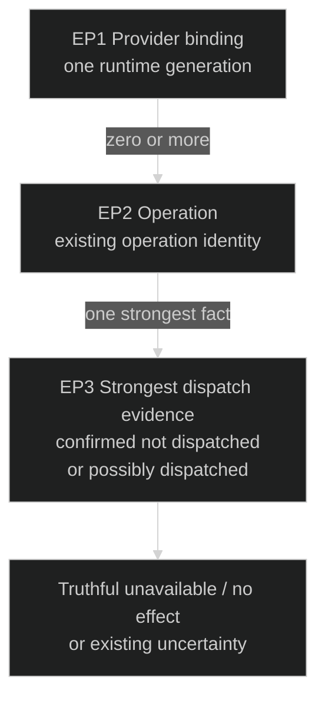
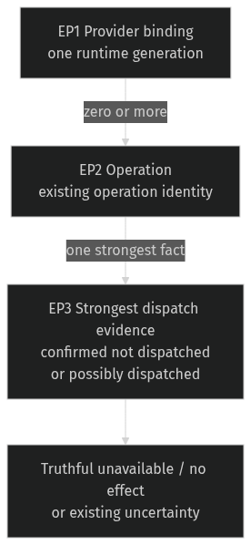

# Provider retirement — preserve known dispatch truth

Governing [Requirements](requirements.md): U1 and operational limits. [Program Design](provider-failure-program-design.md) realizes this bounded operation-failure correction. The initial report of a provider crashing just after startup remains runtime-unverified; current code establishes one concrete failure-classification gap that the reproduction must exercise.

## What the caller must be able to tell

A provider can acknowledge initialization and then exit before the caller's first operation is accepted. Router must distinguish a request positively refused before provider work from a request that may have reached the provider but lost its response. The current runtime uses the same transport error for a failed internal command enqueue and a lost result receiver; Host then reports unknown effect for both. An unknown outcome incorrectly blocks recovery when Router actually knows no request entered the dispatch owner.

| Fact about this operation | Required public result |
| --- | --- |
| Positive evidence that the request could not enter provider dispatch | Existing `unavailable` / `dispatch` / `none` failure; no successful provider effect claimed |
| Command accepted, then outcome becomes unobservable | Existing truthful unknown-effect failure; no automatic replay |
| Retirement observed before operation binding/admission | Existing unavailable/no-effect refusal remains |

An initialization acknowledgement is a momentary observation, not a promise that the provider will stay alive. This correction does not turn missing submission evidence or a later retirement token into proof of no effect.

## Entities

| ID | Term and identity | Relationships | Invariants / states | Basis |
| --- | --- | --- | --- | --- |
| EP1 | Provider binding: the existing endpoint/provider generation for one runtime lifetime. A restarted runtime is a different binding. | Zero or more EP2. | Available or retired; an earlier availability observation does not prevent later retirement. | U1; existing binding contract |
| EP2 | Provider operation: one existing operation identity admitted for EP1. Reinspection of that identity is the same operation. | One EP1; one strongest EP3; optional existing target. | Admitted, possibly dispatched, then terminal or unresolved; identity/target remain inspectable. | U1; existing durable operation contract |
| EP3 | Dispatch evidence: the strongest positively observed submission fact for EP2. | Exactly one EP2. | Confirmed not dispatched versus possibly dispatched. Missing evidence cannot prove non-dispatch. | U1; truthful effect contract |

## Obligations and proof

- **RP1 (U1; EP1–EP3):** A failed operation with positive evidence of non-dispatch MUST report existing `unavailable`, `dispatch`, `none` meaning through its public operation result, preserving existing operation/target identity. Provider retirement immediately after successful initialization MUST NOT erase that evidence.
- **RP2 (U1; EP2–EP3):** After a request may have entered provider dispatch, unobservable response/turn end MUST retain existing truthful unknown effect and no automatic replay. Absence of a submission event, availability snapshot or later retirement MUST NOT be used to downgrade uncertainty to no effect.
- **RP3 (U1; EP1–EP3):** Confirmed non-dispatch MUST settle existing operation bookkeeping as confirmed no effect, so it does not leave false blocking uncertainty. Actual unresolved operations retain their protection. Initialization errors, existing retirement cleanup and fixture process reaping MUST retain their current meanings.

| Proof | Covers | Observation |
| --- | --- | --- |
| VP1 | RP1 | An isolated provider initializes, then a gated crash/actor-close race positively prevents create/restore/prompt dispatch. Real runtime and Host result report unavailable/dispatch/none with the same operation identity. |
| VP2 | RP2 | A paired gated provider accepts work and then loses response/turn-end observability, including existing sink/transport/frame failure paths. Public result remains unknown; exactly one submission, no retry. |
| VP3 | RP3 | Inspect durable terminal effect/reconciliation and subsequent operation eligibility after positive non-dispatch; contrast a truly unresolved operation. All owned subprocesses are reaped; original startup/end-of-stream regressions retain meaning. |

Tests must establish the positive failure boundary rather than infer non-dispatch from elapsed time or an absent message. Source observations alone do not close the original startup-crash report. All runnable proof is isolated debug/test work; production Router and owner state are protected.
