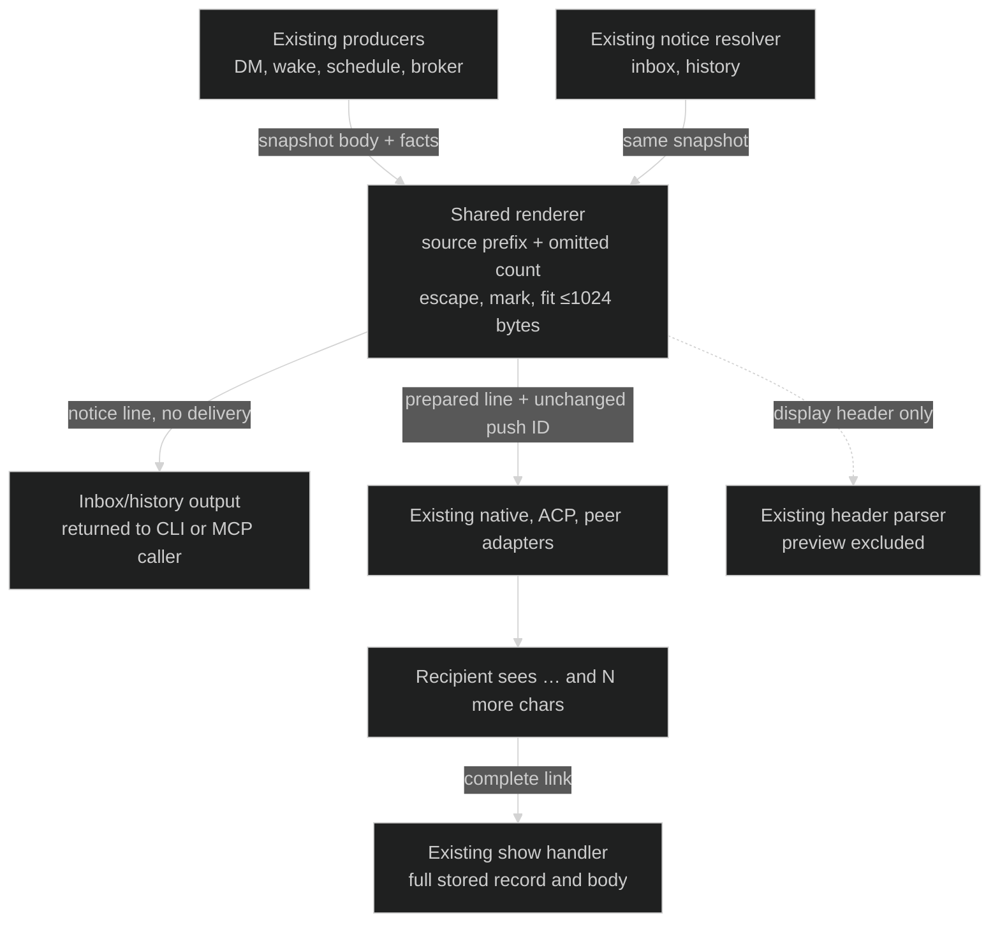
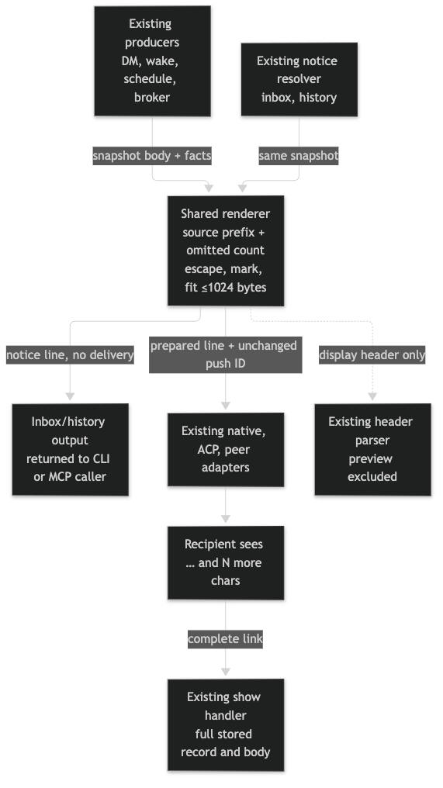

# Obvious push truncation — Program Design

Realizes [push-specification.md](push-specification.md) R1–R5 for [requirements.md](requirements.md) U6. The owner explicitly names `crates/collaboration-protocol/src/push_line_render.rs` and says the rendered line is the shared contract for every push surface. The realization keeps that named renderer and existing consumers.

## Existing ownership and bindings

| Entity | Semantic owner | Code and shape home | Boundary shape / lifetime | Convention |
| --- | --- | --- | --- | --- |
| E1 Push | Existing push producer and snapshot store | `collaboration-protocol::PushRecord`, `automation-storage` | Existing snapshot: push identity, origin, target, body `Option<String>`, header facts; persisted. No format change. | Existing validated identities and Serde enums. |
| E2 Preview | Shared push renderer | `collaboration-protocol::push_line`, private `DisplayLimits` in `push_line_render.rs` | `PushLineInput.body: Option<String>` to returned `String`; derived per rendering, never persisted separately. | Rust `chars()` source-scalar prefix; escaping owned here. |
| E3 Omitted count | Shared push renderer | Existing `total_scalars`, `shown_scalars`, `omitted_scalars` local arithmetic | Derived `usize`; included as literal display text only. | Saturating subtraction; source counts, no byte or grapheme conversion. |
| E4 Push link | Existing link model | `collaboration-protocol::RouterLink` in `push_line.rs` | Machine and Push identities; complete string in every delivery; existing persisted identity remains authoritative. | Validated newtypes. |

## Current and proposed path

Current producer path: `SubscriptionPushStore::deliver_direct_message`, called by the existing reader actor, builds `PushLineInput` from the stored record, calls `render_push_line`, wraps its output in `PreparedPush`, and delivers through the existing Layer 0 router. Wake/schedule/broker/subscription producers call the same renderer. `push_record_resolver::line_for` re-renders stored snapshots for inbox/history. The separate `show` handler returns `PushRecordShowResult { link, record, activity_ranges }`, including the full stored body; it calls no renderer. Adapter delivery and push identity correlation are unchanged. The display-only title consumer calls `parse_push_line_header`, which discards everything at ` · "` before interpreting header facts.

The current renderer sets the initial preview limit to `min(body.chars().count(), 100)`. It adds an ellipsis only if byte-budget fitting shortens that initial limit, so a 100-scalar preview of a longer body lacks the marker. It appends bare `(+N)`. `render_push_line` repeatedly assembles the whole candidate while fitting display fields in the existing order.

The proposed renderer compares the selected visible source length with the **full body** length for the marker, removes the obsolete `preview_initial` comparison/state, and renders `(+N more chars)`. The existing whole-line assembly and fitting algorithm automatically include the extra marker and unit in the byte budget. No producer, adapter, storage or public request schema gains policy or new state.

## Interfaces, state and failure

`render_push_line(&PushLineInput) -> Result<String, PushLineError>` remains the sole renderer interface. Existing closed errors are `OriginKindMismatch`, `MissingBody`, `UnexpectedBody`, `InvalidHeaderFacts`, and `FixedLineExceedsBudget`. This change adds none. The rendering operation remains synchronous, pure and deterministic; it writes no record and dispatches no input.

`escaped_prefix` retains ownership of adding a display ellipsis and escaping the final visible field. It receives `append_ellipsis = shown_scalars < total_scalars`; its existing guard prevents a marker for an intact source. `omitted_scalars = total_scalars.saturating_sub(shown_scalars)` remains the count authority. Quotes, slashes, controls and field separators use the same escaping.

Budget fitting, trimming order, fixed kind/link protection, empty body handling, bodyless subscription validation, header parsing and correlation remain existing contracts. The larger suffix can shorten display fields slightly sooner; recipients bear that small display cost and gain an unambiguous remainder. If the fixed header/link cannot fit, the existing closed error remains. There is no retry or compatibility layer.

The current validated shapes do not reach preview fitting at the production byte limit. After machine/name fitting, the largest fixed header plus the 100-scalar preview fits within a conservative 858-byte bound including the new suffix: each escaped source scalar contributes at most six bytes, endpoint identity is bounded, the sender ID is short, and the canonical link is 87 bytes. Large valid labels can force header trimming; proof observes that actual path while retaining an independently checked body prefix, marker and count. No lowered-budget test seam is introduced.

## Why this structure

One existing renderer already serves all consumers. A surface-specific change would duplicate the same contract and allow divergence; changing source counting to bytes or graphemes would alter the owner's established unit. Neither is needed for U6. The retained renderer is the smallest realization of the owner-named boundary. Revisit only if a current consumer actually parses suffix text for correctness; current header consumer does not. New persistence, dispatch controls or new renderer interfaces fail the deletion test for this need.

## Realization and proof seams

| U / R / E | Owner and interface | Shape/home | State/failure | Observation |
| --- | --- | --- | --- | --- |
| U6 / R1 / E1–E3 | Shared renderer / `render_push_line` | Derived preview in `push_line_render.rs` | Full versus shortened; existing closed errors | Exact 101-scalar literal output; large valid headers retain the correct marker and prefix. |
| U6 / R2 / E2–E3 | Shared renderer / `escaped_prefix` and count arithmetic | Source scalars to literal ` (+N more chars)` | Positive count only; ellipsis outside count | Unicode/escape-heavy source oracle and one-char remainder. |
| U6 / R3 / E1–E4 | Shared renderer / existing input validation | Existing optional body and kind | Empty/intact body; bodyless subscriptions | Boundary case table and bodyless kind tests. |
| U6 / R4 / E1–E4 | Shared renderer / existing budget fitter; show handler for full body | Existing `String`, complete `RouterLink`, snapshot body | ≤1024 bytes or existing fixed-budget error | Actual header-fitting output bytes, independent prefix/count/link checks and full stored fetch. |
| U6 / R5 / E1–E4 | Existing producers/adapters/resolver and header parser | Existing `PreparedPush` plus unchanged correlation identity | Existing delivery outcomes and title parsing | Producer/adapter integration and delivery matrix literal assertions; consumer search. |

Current decisive sources: `push_line_render.rs:169–181, 210–217, 293–373`; `push_line.rs:9–11, 253–289`; `push_line_tests.rs:151–158, 342–369`; `agent-collaboration/tests/push_delivery_matrix.rs:85–110`; `collaboration-service/src/subscription_delivery/direct_message_push.rs:101–142`; `collaboration-service/src/push_record_resolver.rs:23–38`; `agent-collaboration/src/session_commands/session_display_text.rs:66–82`. These anchor the existing ownership and changed edge; the omitted-count suffix has no new semantic consumer.
