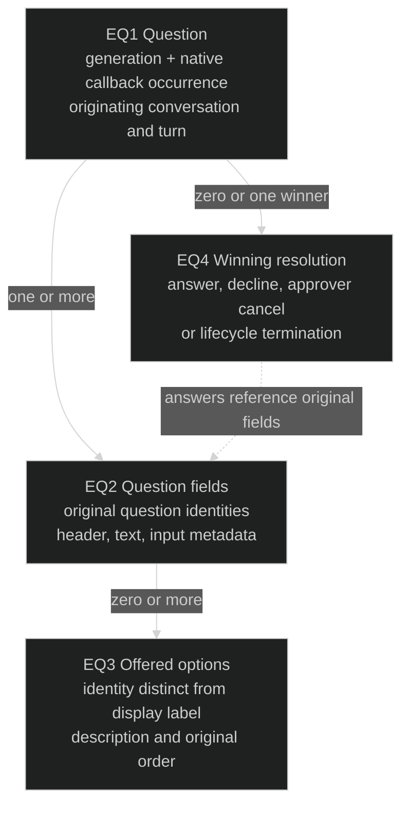
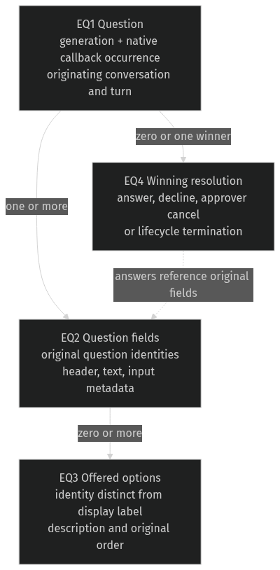

# Managed Codex questions — observable contract

Governing [Requirements](requirements.md): U3, the owner's shared Question model extension, and operational limits. The existing [session-protocol Specification](../2026-09-26-router-session-protocol/specification.md) governs provider-neutral interaction routing where applicable. Current tagged native source is Codex `rust-v0.160.0`, peeled commit `a956835d020762cb2b570053af06f643a11c0ecc`; the evidence ledger is a source pointer, not executable proof.

## The approver's job

A managed Codex turn can ask its existing designated approver to choose an offered answer or enter other text. Today a native user-input question is treated as an unsupported callback and the turn is cancelled, so the approver never gets a usable question. The owner chose to extend the shared Question model to carry native Other/free text and secret-input metadata rather than omit those question shapes.

| Moment | Current source-supported pain | Required observable difference |
| --- | --- | --- |
| Codex asks during its managed turn | Question becomes an unsupported callback; turn is cancelled | Existing approver can inspect the faithful shared Question and answer it |
| Approver selects an option or Other text | Native question never reaches the broker | Shared answer intent is distinct; the original offered label or entered text reaches the originating native question |
| Native question ends or another eligible native client resolves it | Bridge does not yet exist | Obsolete question stops accepting answers; no answer is delivered to a later turn |

The listed current failures are source observations, not yet compiled reproductions. The scope preserves #123's final-reply behavior and existing ordinary Question consumers.

## Domain entities

| ID | Term / same-instance rule | Relationships | Invariants / observable states | Basis |
| --- | --- | --- | --- | --- |
| EQ1 | Question: one native callback occurrence within its backend generation and managed conversation/turn. Replay of that occurrence is the same Question; reuse in another generation is different. | One originating turn and existing designated approver; one or more EQ2; zero or one winning EQ4. | Pending or terminal. Frontend disconnect alone does not mean cancellation. A turn-ending transition or native resolution ends answerability. | U3; tagged native identity/lifetime |
| EQ2 | Question field: one original question identity within EQ1. The same field identity in another Question is different. | Exactly one EQ1; zero or more EQ3. | Original header, question text, offered-answer/text-entry meaning and secret-input metadata survive translation. | U3; owner extension |
| EQ3 | Offered option: one original option occurrence belonging to EQ2. Display text is not its Router identity. | Exactly one EQ2. | Label, description and order remain faithful; a selection refers only to an offered option of that field. | U3; typed shared-choice contract |
| EQ4 | Question resolution: the winning answer, decline, approver cancellation or lifecycle termination of EQ1. A later competing response is not another winning resolution. | Exactly one EQ1; answers identify original EQ2 and offered EQ3 where selected. | Single winner. Broker decision, callback write and native consumption are different observations. Cancellation cause is distinguishable from an intentional decline. | U3; existing at-most-once answers and tagged cancellation |

## Obligations

- **RQ1 (U3; EQ1–EQ3):** A supported valid managed native Question MUST reach its existing designated approver through the shared Question path. Original question identities, headers, question text, option labels/descriptions/order, Other/free-text permission, secret-input metadata and native blocking metadata MUST be retained. No field may be silently flattened to a less expressive shape.
- **RQ2 (U3; EQ1–EQ4):** An authorized answer MUST map each field back to the original native question identity. Offered-option selection and Other text MUST remain unambiguous in the shared Question input, validation and recorded answer even when the text equals an option label or identity. Native delivery MUST preserve the original offered label or exact Other text using the native answer-string contract. Unknown fields/options, mixed conflicting shared representations and disallowed Other text MUST be rejected before native submission; a rejected answer leaves the pending Question answerable. Equal Other text alone MUST NOT be rejected merely because it equals an offered label.
- **RQ3 (U3; EQ1, EQ4):** Answer and decline MUST produce their native answer meanings; explicit approver cancellation MUST request interruption only of the Question's originating turn. Lifecycle cancellation MUST retain its cause and MUST NOT be converted into an approver-requested native interrupt or a synthetic empty/skip answer.
- **RQ4 (U3; EQ1, EQ4):** There MUST be at most one winning broker resolution. Question replay in the same generation MUST NOT create a second answerable Question. Native resolution, originating-turn completion/abort, backend retirement and cancellation during admission MUST stop answerability and prevent a response to a later turn/generation. Frontend detach alone MUST NOT be inferred to end an ordinary native Question.
- **RQ5 (U3; EQ1, EQ4):** Waiting for an approver answer MUST NOT itself prevent observation of native updates, callback-resolution events, originating-turn transitions or cancellation, including when another callback is pending. Both native blocking flag values preserve this responsiveness within the existing transport/output bounds. A nonblocking flag does not promise free-running model execution. This does not select a new transport backpressure policy for the separate U28 investigation.
- **RQ6 (U3; EQ1–EQ4):** Every participating front door MUST preserve the shared Question's answer meaning and required metadata or explicitly present the Question as pending/unsupported on that surface with the existing usable answer route. It MUST NOT silently downgrade a secret-input field or Other-enabled choice to a plain offered-only form. This obligation does not add a Human approver, new answer storage or a new privacy/retention guarantee.
- **RQ7 (U3; EQ1, EQ4):** Managed questions MUST preserve existing prompt update and final-reply selection, final availability/effect reporting and unrelated approval routing. The broker MUST preserve validated answer delivery before later history persistence: a history-write failure cannot retract an already delivered answer or restore its answer eligibility. An already closed receiver retains the existing requester-unavailable cancellation behavior. A broker answer or socket write MUST NOT be reported as proof that the native tool consumed it. Ambiguous submission MUST NOT be blindly replayed. Positive native replay of the same original Question under its unchanged backend generation, conversation, turn and callback identity MAY receive the exact same recorded decision; this MUST NOT reopen answer eligibility or create another broker winner. Missing replay MUST NOT be treated as native consumption or withdrawal.

The tagged native reply represents answers as strings, with no selected-option or Other marker. Selecting an offered label and entering identical Other text therefore produce identical native values. Shared typed intent remains distinguishable; native intent-kind distinction is not supplied by this contract. Optional upstream retained-context enrichment matches answer strings to offered labels and cannot recover that distinction. Router MUST NOT invent a native encoding or claim native category consumption from these strings.

The typed shared extension and the precise native translation belong in the Program Design. Existing actor checks remain authoritative; this feature neither authenticates reported actors nor broadens who may answer. Proof fixtures use synthetic values only and never production credentials or owner state.

## Proof obligations

| ID | Covers | Observation needed |
| --- | --- | --- |
| VQ1 | RQ1, RQ6 | A managed native callback reaches the actual broker and designated approver notice/list surface, preserving multiple field identities, descriptions/order, Other, secret and blocking metadata. Supported front doors preserve them; unsupported ones explicitly retain the pending route. |
| VQ2 | RQ2–RQ3 | Real authorized answer, decline and approver-cancel journeys return correct native callback content or exact-turn interrupt. Selecting an offered label and entering equal Other text retain different shared intent and deliver their identical literal native strings. Invalid actor/field/option/disallowed Other/conflicting shared payloads do not resolve or submit the Question. |
| VQ3 | RQ4–RQ5 | Deterministic admission/answer/withdrawal/cancellation interleavings; generation change, duplicate replay and concurrent native resolution; native reader continues processing while awaiting the approver. No stale callback write or second winning resolution. |
| VQ4 | RQ7 | An answered-question managed turn still streams updates and yields #123's correct final reply. Callback write without native resolution is not consumed-answer proof. An uncertain write alone causes no resend; positive replay of the original Question permits only its exact recorded decision, with no second broker winner. Changed generation/conversation/turn/callback identity prevents that response, and missing replay proves neither consumption nor withdrawal. Existing ordinary Question and approval regressions retain their meaning, including delivered answer despite later history-write failure and requester-unavailable behavior when the receiver closed. |

Direct typed/schema cases establish shape validation only. Lifetime, at-most-once and prompt/final-reply behavior need real broker/adapter interactions; actual native integration proof must exercise the installed tagged native contract on an isolated debug setup when Rust is available. The source ledger alone is not that proof.
