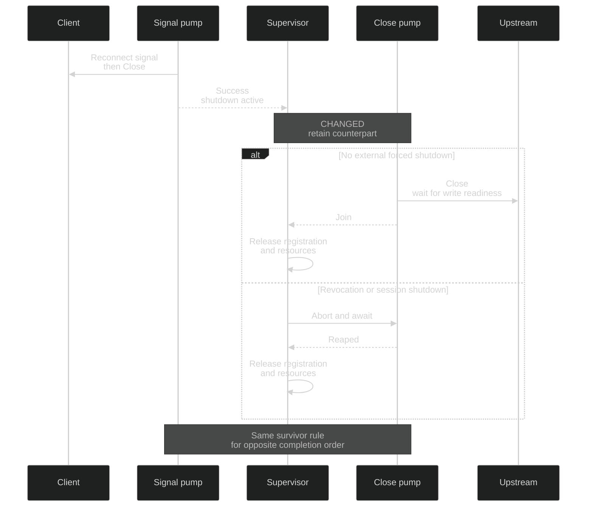

# Floor reconnect — symmetric cancellation-aware pump supervision

Realizes [Specification](websocket-close-specification.md) RW1–RW3 for [Requirements](requirements.md) U4. Retain the two existing pumps and their supervisor; change the supervisor's completion decision, not transport ownership or reconnect policy.

## How the required outputs survive completion order

The client-facing pump emits the existing reconnect signal and closes the client sink. The upstream-facing pump closes the upstream sink. Both set or observe the existing tunnel shutdown token. The supervisor owns both task handles and must preserve the remaining successful reconnect cleanup in either completion order, while still observing external forced shutdown.

## Bindings and interfaces

| Entity | Semantic owner | Module/package home | Schema/type home | Boundary shape | Lifetime / convention |
| --- | --- | --- | --- | --- | --- |
| EW1 Tunnel | Existing duplex forwarding owner | `codex-router-proxy::websocket::duplex_forwarding` (existing) | Existing forwarding context, session registration and cancellation tokens | Local/upstream WebSocket streams; completion `Result<(), WebSocketTunnelError>` | Runtime only; RAII registration and owned JoinHandles |
| EW2 Direction | Its existing pump; supervisor owns its join/abort | Existing `pump_local_to_upstream`, `pump_upstream_to_local` (unchanged), `supervise_websocket_pumps` (modified) | Existing `JoinHandle<Result<(), WebSocketTunnelError>>` and tungstenite Message | Peer signal is existing text Message; Close is existing Close Message/close flush; task output is closed Result | Runtime only; Tokio task/stream ownership |
| EW3 Termination intent | Existing cancellation sources; supervisor decides survivor retention | Existing quota/early reconnect and tunnel/outer cancellation sources; supervisor (modified decision) | Existing CancellationToken values, existing WebSocketTunnelError | Reconnect shutdown token versus explicit revocation/session-shutdown tokens; no new wire field or stored reason | Existing runtime signals; no new enum/tag, persistence or task owner |

`supervise_websocket_pumps` keeps its current inputs and Result output. Pump dispatch, signal production, sink close, reservation retirement and registration-drop ownership remain in their current modules. A small private helper may express the repeated survivor wait/abort rule inside the supervisor owner; it adds no public interface, task or state.

## The completion rule

| First observation | Supervisor action | Result authority |
| --- | --- | --- |
| Revocation or session shutdown | Abort and await both owned pumps | Existing forced-shutdown result |
| Direction finishes with error | Abort and await counterpart | Existing flattened first error |
| Direction finishes successfully with no tunnel shutdown intent | Abort and await counterpart | Existing successful ordinary completion |
| Direction finishes successfully with tunnel shutdown intent | Await counterpart while also selecting revocation/session shutdown | Remaining pump's flattened result, or existing forced-shutdown result |

The final row applies symmetrically. External cancellation during that row aborts and awaits only the surviving handle; the first handle has already been consumed. No ended handle/future is repeatedly polled. Existing cancelled-join normalization remains authoritative.

The token represents the established tunnel cleanup intent, including existing quota-error reconnect paths; do not narrow it to one test trigger or add a second floor policy. Successful first completion alone is insufficient to preserve an ordinary non-reconnect stream indefinitely.

## Current and proposed edges

| Current source edge | Proposed disposition | Why |
| --- | --- | --- |
| `forward_duplex_until_complete` splits streams, starts two pumps, awaits supervisor, drops registration | Intentionally unchanged | Singular task/resource ownership, RW2–RW3 |
| Both floor branches cancel tunnel token, then client-facing pump sends signal/Close and upstream-facing pump closes upstream | Intentionally unchanged | Preserve real output order/content, RW1/RW3 |
| Local-first successful shutdown awaits client-facing counterpart without watching outer cancellation | Changed: same retained cleanup with revocation/session-shutdown branches active | RW2 |
| Client-facing-first completion unconditionally aborts upstream-facing counterpart | Changed: apply the same error/shutdown-intent survivor rule as local-first | RW1–RW2 |
| Ordinary completion/error aborts and joins remaining work | Intentionally unchanged | RW3 |

Decisive current sources at 7a8cbd89: `websocket::duplex_forwarding` supervisor at :139–172; local floor/shutdown close at :204–218; client floor signal/Close at :283–302; quota-error shutdown and close-after-send paths at :335–337/:420–423; `transport_cleanup::close_websocket_sink_best_effort` at :42–52. Existing floor-switch supervisor cases deliberately exercise local-first completion only. They are useful preserved regressions, not upstream-first delivery evidence.

## Why this realization

The existing supervisor already retains successful local-first reconnect cleanup, so the symmetric rule supplies the missing output without a new scheduler, close protocol or grace-period policy. Watching existing outer cancellation inside the survivor wait keeps the established forced-shutdown boundary effective. Delaying or removing the client's reconnect signal would change the contract; leaving the unconditional abort loses upstream Close. Maintainers pay for one shared completion rule and deterministic interleaving proof. Revisit only for an established Close deadline requirement or a counterexample that the existing tunnel token does not represent cleanup intent; neither is inferred here.

## Failure, trust and proof seams

Peer IO can fail or remain unready. Existing close-error normalization and pump Result remain the authority. This design guarantees required cleanup is not prematurely aborted solely by successful counterpart completion; it does not assert delivery after peer failure or after explicit forced termination. No retries, frame replay, process changes, account/state copies, secret handling or new storage are introduced.

Real supervisor, pumps, Message encoding and close writes must participate in delivery proof. A controlled AsyncRead/AsyncWrite readiness gate around an isolated real duplex stream can force the order; it cannot fake successful Close delivery or return a manufactured pump result. Verify peer-observed frames after releasing readiness. A supervisor-only synthetic JoinHandle case supplements cancellation-decision proof but is not actual peer-output proof. Keep time bounds around the harness, not sleeps that choose pump ordering.

| U | R / scenario | E | Owner | Interface | Shape and home | State | Failure | Proof |
| --- | --- | --- | --- | --- | --- | --- | --- | --- |
| U4 | RW1 either completion order | EW1–EW3 | Existing supervisor and pump output owners | supervise_websocket_pumps / existing pumps | JoinHandle Result and Message in websocket owner | Reconnect cleanup; retain survivor | First successful finish cannot abort required other output | Gated real Close/signal peer observation in both orders |
| U4 | RW2 forced termination while draining | EW1–EW3 | Existing supervisor | CancellationToken branches plus abort/await | Existing revocation/session-shutdown tokens and handles | Draining → forced termination → both joined | No live owned pump after completion | Hold actual close readiness, cancel externally, observe joins and released registration/reservation |
| U4 | RW3 preservation | EW1–EW3 | Existing forwarding/supervisor/signal/cleanup owners | Existing normal completion and error branches | Existing Message and WebSocketTunnelError | Ordinary completion/error or reconnect cleanup | No replay/new signal/error reclassification | Existing real normal/error/reconnect integration results and counters |

EW1–EW3 and VW1–VW3 are covered by these bindings and seams. Other U rows remain open. Executable close-race reproduction, full peer delivery and repeated CI evidence remain unverified until the pinned toolchain/debug proof is available.
