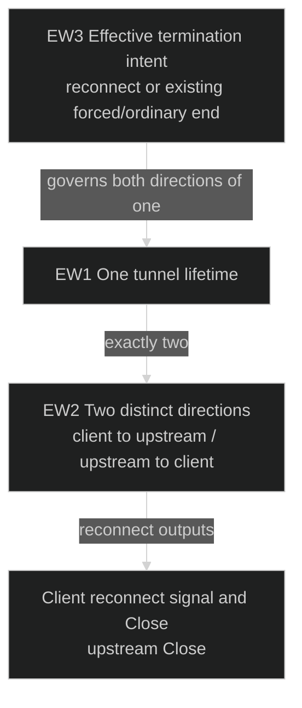
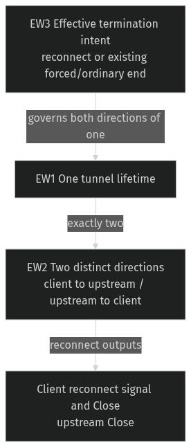

# Floor reconnect — preserve both peer outputs

Governing [Requirements](requirements.md): U4 and operational limits. [Program Design](websocket-close-program-design.md) realizes the existing reconnect/Close contract. The reported repeat in #123 CI strengthens the source finding; it is not a current local reproduction.

## The two peers' observations

Floor reconnect asks the client to reconnect and closes the upstream side of its existing WebSocket tunnel. Both outputs belong to one reconnect. Today, if the client-facing pump finishes first, the supervisor aborts the upstream-facing pump while its Close may still be waiting to write. Local-first completion already preserves the other direction. Peer scheduling should not decide which required output survives.

| Situation | Required observation |
| --- | --- |
| Reconnect completes with functioning peers, in either pump order | Client sees the existing reconnect signal/close and upstream sees Close |
| Peer write is held temporarily | Finishing one direction does not cancel the other required cleanup |
| Explicit revocation or session shutdown while cleanup waits | Existing forced shutdown remains effective; cleanup cannot hold the session open against it |
| Ordinary completion/error without reconnect shutdown intent | Existing termination/error behavior remains |

## Entities

| ID | Term and identity | Relationships | Invariants / states | Basis |
| --- | --- | --- | --- | --- |
| EW1 | Tunnel: one paired client/upstream WebSocket connection lifetime. A reconnected connection is a different Tunnel. | Exactly two EW2; zero or one effective EW3. | Forwarding, reconnect cleanup or terminated. No surviving forwarding work after termination. | U4; existing tunnel lifetime |
| EW2 | Direction: one source-to-destination direction in EW1. Opposite directions are distinct. | Exactly one EW1; one source and one destination peer. | Running, completing or completed/failed. Reconnect cleanup produces that direction's required peer output. | U4; two pump contract |
| EW3 | Termination intent: the reconnect, explicit revocation, session shutdown or ordinary end/error that terminates EW1. | One EW1; governs its two EW2. | Reconnect preserves both peer outputs while cleanup progresses; external forced shutdown may terminate remaining work. | U4; existing cancellation contracts |

## Observable obligations

- **RW1 (U4; EW1–EW3):** During reconnect cleanup, successful completion of either Direction MUST preserve its counterpart's required output. With functioning peers, both existing client reconnect/Close and upstream Close MUST be observed regardless of which Direction completes first.
- **RW2 (U4; EW1–EW3):** Explicit revocation and session shutdown MUST remain effective while the remaining Direction is completing cleanup. Neither Direction nor its join may outlive completed forced termination.
- **RW3 (U4; EW1–EW3):** Normal completion without reconnect cleanup, transport-error projection, existing reconnect payload/counting and tunnel/reservation cleanup MUST retain their existing behavior. This correction MUST NOT replay frames, add a reconnect or claim a full peer Close acknowledgement from task completion alone.

This correction adds no timeout budget or retry policy. The existing sink close depends on peer write readiness; no new deadline is promised when a peer remains blocked and no forced termination is requested. Isolated harness deadlines are proof limits, not product Close grace periods.

| Proof | Covers | Observation |
| --- | --- | --- |
| VW1 | RW1 | Gate actual upstream Close writing so client-facing completion occurs first, then release it and observe upstream Close plus the exact client signal/Close. Repeat inverse order; include existing hard/early floor and quota-error reconnect triggers. |
| VW2 | RW2 | While the surviving actual cleanup is held, revoke or shut down the session. Verify both owned tasks are settled/reaped, no extra peer frames and session/reservation cleanup completes. |
| VW3 | RW3 | Existing ordinary Close/error cases retain their results; real reconnect integration retains payload/counters and releases the tunnel's resources. |

All proof uses isolated streams or debug endpoints and owned fixture tasks. Production Router is never probed or restarted. Source proof alone does not establish frame delivery or CI flake closure.
