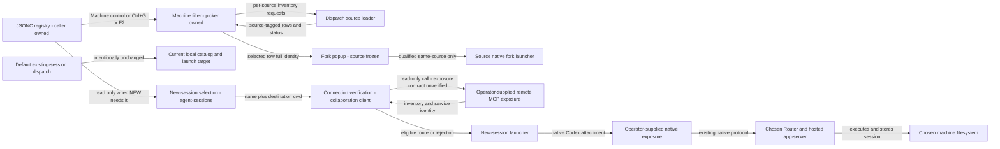
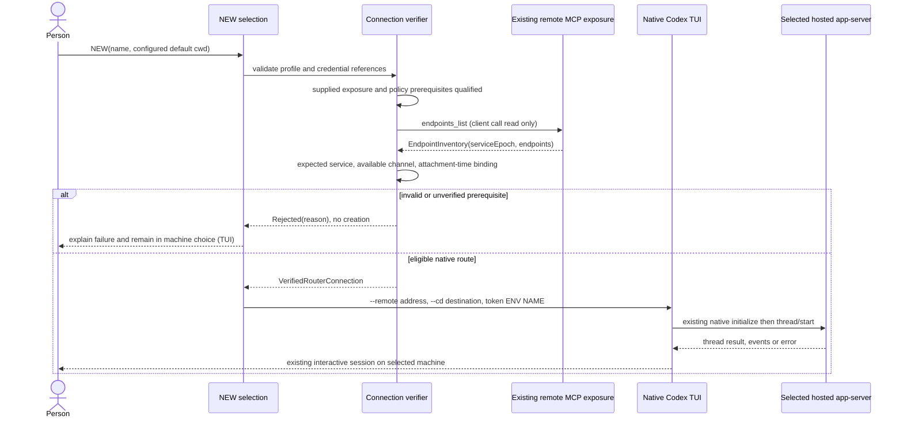
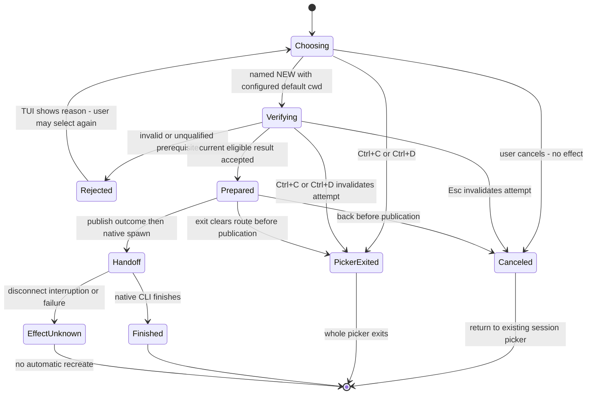

# Named Router registry, machine filtering and source-routed actions

The [Specification](2026-10-03-router-selector-specification.md) fixes placement: NEW executes on the selected machine. The structure is a client registry, invocation-local machine filter, concrete NEW destination choice, and source-aware launch eligibility boundary. Default existing-session dispatch retains its current launch target and local catalog; explicit machine-scoped and All views preserve a separate source context for every row. The selected Router owns execution, policy enforcement and session state. Requested permission/model settings cross the native client/server boundary; remote Host defaults alone are not necessarily authoritative.

The explicit fork extension adds a source-affine popup; machine filtering and All browsing select rows without rewriting their source identity. It does not reuse NEW placement as a global target. Alt+Enter captures the selected source session; only its same-Router/home fork is eligible. Other configured machines remain visibly unsupported because no cross-machine native history portability has been proved.



The operator-supplied exposure boxes are external prerequisites, not new components built by this feature. The registry does not configure them. Read-only discovery and a native URL alone do not prove that those boxes lead to the same Router; see **Identity binding** below.

## Entity homes and boundary shapes

Rust enums, validated newtypes and Serde camelCase shapes follow existing protocol conventions. Validation occurs at the registry and remote-response boundaries, not through database CHECK constraints. This feature adds no SQLite table or session migration.

| Entity | Semantic owner | Home / schema convention | Shape and lifetime |
| --- | --- | --- | --- |
| E1 Named Router connection | Registry reader | `agent-collaboration` connection-selection module, new; JSONC DTO plus validated `RouterConnectionName`/`RouterConnectionProfile` | Registry `version`, ordered `routers` list; name and expected service identity; remote locators; credential references; optional destination cwd. Persisted client preference; never persisted health/capability truth. |
| E2 Router service | Router service; client owns comparison to expected identity | Existing `UuidIdentity`, `ControlInitializationResult` and `EndpointInventory` in `collaboration-protocol`; new client `VerifiedRouterConnection`/`EndpointBinding` | Stable `serviceId`; live `serviceEpoch`; validated endpoint inventory. Derived per creation/source-view invocation; attachment identity remains an external prerequisite. Epoch is never a registry pin. |
| E3 Provider endpoint | Selected Router's endpoint catalog | Existing `EndpointRef`, `EndpointDescription`, `ChannelDescription`, `ProviderCapabilities`; launcher eligibility in client module, new | Exact service/endpoint plus current availability, channel and capability evidence. A configured native inventory consumer requires exactly one qualified endpoint; ambiguity rejects. Discovery truth stays remote; no local capability list overrides it. |
| E4 New-session placement | New-session selection; launcher owns handoff | `agent-collaboration` new-session action module, new; `NewSessionDestination`/`PreparedNewSessionLaunch` enums and process-local `NewAttemptGeneration` | One current `Default` or `Named { profile, destinationCwd }`; chooser/preparation result carries attempt generation; placement immutable after handoff. Derived/transient, absent from existing-session runner state; no persisted attempt ID. |
| E5 Session | Source provider/app-server or local Codex home | Existing `SessionRef`, `SessionPickerIdentity::{LocalCodex,HostedCodex,HostedProvider}` and native thread identity; new `SessionActionSelection` wrapper | Hosted rows carry actual service/endpoint/session reference through resume/fork actions; legacy local rows retain local source-home context. No local affinity store or history copy. Known refs never collapse to bare IDs across machine contexts. |
| E6 Credential reference | Existing credential owner; launcher only consumes reference | New registry `CredentialReference::Environment { variable }`, referencing existing env sources | Name only in config/argv; resolved value only in process memory/environment for the selected surface. Optional when the pre-existing exposure requires none. No guessed identity or credential source. |
| E7 Fork placement | Fork selection; source launcher owns effect | New fork-action module in `agent-collaboration`; `CapturedForkSource`, `PreparedForkLaunch`, process-local `ForkAttemptGeneration` | Frozen source row identity plus routing context and source metadata; same-source destination or rejected other-machine choice. `PreparedForkLaunch::{SameHostedSource,SameLocalSource}` only; no cross-machine variant. Derived for one action, never stored. |
| E8 Machine session view | Existing picker/controller's source-view owner | Existing picker module enhanced; `PickerMachineFilter::{Default,Single,All}` plus per-source `PickerSourceContext::{DefaultHosted,LocalCodex,ConfiguredHosted}`; `SourceInventoryRequest/Result`, `SourceViewGeneration`, view-tagged `SourceContinuation`; existing `NativeSessionListParams/Result/Summary`, exact row identities | One active filter/query generation and one source-owned state per selected source; local query only on default/local, remote rows only from their source inventory. Publication requires source/endpoint/view/scope/sourceFilter/query/includeEmptySessions/generation match. Cache/continuation lifetime is scoped to source/query; All is a transient presentation combining source-tagged rows, with no persisted merged catalog or global default write. |

### Registry shape

The registry is a separate client preference, proposed as `routers.jsonc` under the existing installed/debug Router root. It does not merge into `providers.json`, Router server configuration or Codex profile files. Installed and debug clients retain their existing separate roots. No new arbitrary registry-path override is added. The path is a client preference location, not a new runtime state owner.

```jsonc
{
  "version": 1,
  "routers": [
    {
      "name": "Sunbook",
      "connection": {
        "kind": "remote",
        "serviceId": "11111111-1111-4111-8111-111111111111",
        "mcpUrl": "https://sunbook.example.invalid:443/mcp",
        "credential": { "kind": "environment", "variable": "ROUTER_SUNBOOK_AUTH" },
        "nativeCodex": {
          "address": "wss://sunbook.example.invalid:443/",
          "credential": { "kind": "environment", "variable": "ROUTER_SUNBOOK_NATIVE_AUTH" }
        }
      },
      "defaultRemoteCwd": "/workspace/project"
    }
  ]
}
```

This is a shape example, not a configured/live destination. `Sunbook` is the machine label from configuration; the example.invalid URLs are placeholders, not measured endpoints. Remote `mcpUrl` and optional native address identify pre-existing exposure surfaces. The only named profile kind in this slice is `remote`; arbitrary local `serviceDirectory` profiles are not added. The current default is a synthetic choice using today's installed/debug discovery, not a registry entry and not a changed global default. Names are unique and nonempty; typed shapes reject arbitrary local selectors, unknown fields and inline token fields. Version/shape mismatch is an error, never a compatibility shim. The proposed JSONC grammar accepts line/block comments and trailing commas; semantic validation rejects duplicate names or ambiguous duplicate object members. Reading does not rewrite the human-owned file or its comments. The HTTP credential reference is conditional on the supplied exposure's documented presentation mechanism; the example does not select an auth scheme.

Upstream Codex `0.160.0` accepts only a root native WebSocket URL with an explicit port and no query/fragment. URLs with userinfo are rejected by the registry even if an upstream parser accepts them. Paths such as `/native/codex` cannot be projected directly to this client. Existing authentication constraints are preserved: `--remote-auth-token-env` requires `wss://` or loopback `ws://`; the selector does not reinterpret Tailscale encryption as an exception.

## NEW owns the choice; existing actions do not

The current source path is `agent-sessions → run_sessions_command → sessions_launch_target → ProcessSessionsCommandRunner`; picker outcomes select new/resume/fork after that target exists. NEW calls `resolve_public_native`, then launches Codex with `--remote unix://...`. Source anchors: `session_command_dispatch.rs:84–134,249–309,527–595`, `session_launch_selection.rs:158–215`, `native_endpoint_selector.rs:9–75`, `native_session_launch.rs:305–317`.

| Edge | Proposed delta and ownership |
| --- | --- |
| CLI/default picker → existing list/id/last/resume | **Intentionally unchanged:** current default catalog and source routing remain authoritative; no global target change. Explicit source-view navigation is a separate user action. |
| Main Alt+Enter → fork popup → same-source fork | **Changed by U7:** same shortcut and underlying source-native operation, with explicit source/destination confirmation before effect; no cross-machine route. |
| CLI `--new` without choice → default launcher | **Intentionally unchanged:** no added remote probe, prompt or config dependency. |
| Machine control/Ctrl+G/F2 → source selection → per-source loading | **Added by U8:** no predecessor; picker owns invocation-local filter, dispatch owns source reads. All projects source-tagged rows/status; action identity and saved default stay unchanged. |
| Picker Enter/Ctrl+N/click Start new → machine choice | **Added:** a secondary, content-sized choice when configured names exist; main picker state is retained for Esc/back and no existing session-row identity is rewritten. With no configured names, keep direct default NEW. |
| Named NEW → connection verifier | **Added:** registry profile, configured destination cwd and provider launch intent; read-only discovery precedes any creation. |
| Eligible NEW → native launcher | **Changed for named remote only:** URL and credential-reference projection replace Unix-path projection for this creation action. Default remains the same existing route. |
| Native launcher → remote session side effect | **Existing upstream protocol over a new configured locator:** first remote `thread/start` creates the session on that app-server. The selector does not separately call create and then create again through the TUI. |
| Launcher → error/exit | **Added classification:** pre-handoff rejection versus post-handoff uncertain effect; no automatic NEW retry or fallback. |

The machine choice is a named NEW stage inside the existing picker render lifetime, owned by NEW selection. `PickerMachineFilter::Single` preselects that source's named profile; `Default` and `All` preselect the existing default, and All is never a prepared destination. This invocation-local preselection does not mutate `SessionsLaunchTarget` or a persisted default. Retain the existing main-picker model while that stage is visible; do not create a generic navigation framework or a second copy of search/filter/focus. Explicit `--local` bypasses this stage and its registry entirely, preserving direct local Codex. Missing/valid-empty registry retains direct default; existing invalid/unreadable registry presents only the default row and its bounded config error. Existing resume/fork outcomes preserve current default behavior while retaining full source IDs through the action boundary. Existing action outcomes carry full source identity/context and action metadata; NEW carries a prepared destination: proposed `PreparedNewSessionLaunch::Default` or `Remote { connection: VerifiedRouterConnection, destinationCwd: AbsoluteRemoteCwd }`. A raw registry profile is not a prepared remote route. The verification boundary asynchronously returns a prepared remote route or a bounded rejection to the NEW stage. On rejection, the stage displays the reason and stays available; on success/default selection, the existing render loop returns the NEW outcome and the launcher takes over.

The NEW stage alone owns key input while visible; do not let today's main-picker search/reload/filter handlers, Ctrl+N or Alt+Enter act through it. Choosing accepts Up/Down, Enter and Esc; Ctrl+C/Ctrl+D still exit the entire picker. Verifying shows `Checking <name>`, locks focus and ignores repeated Enter. Each async preparation receives a monotonically changing process-local `NewAttemptGeneration` and returns `{ attemptGeneration, outcome: Verified | Rejected }` to the NEW owner; the verifier cannot launch or write `selected_outcome`. Esc/back/exit invalidates the current attempt before changing stage and discards its snapshot/references; cancel the read-only client attachment when supported, but safety does not depend on successful cancellation. A callback may produce a prepared route only while the stage is still Verifying for that exact generation/destination; any stale, canceled or superseded result is dropped. The owner checks that guard and transitions to Prepared in one exclusive state update. Prepared is still pre-spawn and has no session effect. An exit/back event processed before outcome publication invalidates/clears the pending route. Whole-picker exit clears any action outcome before the render-loop exit decision, rather than relying on today's selected-outcome-before-cancel precedence. Once the outcome is published, the launcher owns handoff; spawn failure still has no effect, and post-spawn uncertainty applies. Current source already has async UI work and exits when `selected_outcome` is set (`picker_component.rs:204–221,333–343`), so guarding that assignment is the effect boundary.

The native-argv boundary rejects conflicting passthrough `--remote`/`--remote-auth-token-env` selectors for named NEW rather than letting them replace the verified destination. This is a named-route invariant, not a change to unselected/default passthrough behavior. Policy/profile projection remains conditional on the supplied permitted-projection contract; this design does not manufacture it through a new override.



The native TUI process is local; execution, filesystem access and stored thread are remote. Do not add the invoking checkout as a remote runtime workspace root, canonicalize destination cwd locally, generate a Codex home on the caller, or configure remote execution to use the caller's loopback model proxy.

Upstream remote NEW is not a Host-default-only operation. At `app_server_session.rs:2021–2073`, remote mode omits a permission-profile identifier but computes an optional sandbox value from the caller's effective local profile, sends approval policy/reviewer, model and an explicitly selected model provider, and forwards session-flag configuration. `:1808–1832` includes permissions, network, sandbox-workspace, shell-environment and feature settings among the forwarded session flags. The additional primary `provider_selection.rs:8–23` shows an explicit provider is forwarded when its winning config layer is session flags or a named user profile. Current repo `SessionLaunch::arguments` always adds a Router profile, which defines a model provider. These facts contradict any claim that simply changing `--remote` leaves all defaults to the selected Host.

Today's default Hosted NEW already uses `--remote unix://...`, so it follows the same upstream remote request mode and forwards these caller-side settings to the local Router app-server. The unresolved issue is whether that existing projection is permitted for execution on the selected *other* machine. Only the provider identifier is forwarded in the cited native request; `model_providers`/its loopback base URL are not in the forwarded session-flag key list. The selected server resolves that provider identifier in its own configuration; no remote Host's configuration has been inspected here. Removing permission keys from a named profile is insufficient to establish policy compatibility, because approval and effective sandbox values are derived/sent independently of those profile keys.

Consequently remote NEW policy/profile compatibility is a blocking prerequisite, not a silently chosen new policy. The design does not decide that Sunclaw's local settings may override the remote Host, suppress settings with undocumented flags, or add a permissions-rewriting layer. A supplied existing remote-launch contract must establish the permitted projection before this native path is eligible. The selector introduces no registry permission/model defaults or security change. Current local/default launch behavior remains exactly as before.


*Source-grounded terminal visual language: selected yellow text, grey borders, compact details and separate bottom shortcuts. The NEW-only owner keeps the main picker state for Esc/back. The new screen has no current UI; this is an illustration, not evidence that a remote route is ready.*

## Verification and launch contracts

`discover_named_router(profile)` is asynchronous and makes only a read-only client call. The synthetic default retains `ControlClient::connect` and manifest-to-connection checks. Named remote profiles conditionally use the existing advertised MCP `endpoints_list` contract through an independently supplied HTTP exposure; the loopback MCP listener itself is not already a remote endpoint. The returned inventory must be well-shaped, internally service-consistent, and contain the configured expected stable service and the endpoint required by the launch intent. Discovery has a proposed 30-second total connect/query budget, following the current control connection's timeout scale; no background retry is added. Compare live epoch/generation consistently within discovery and reject changed snapshots; this does not close the gap between discovery and a later native connection.

The result is a closed internal Rust enum: `Verified { connection }` or `Rejected { reason }`. Rejection reasons are `InvalidRegistry`, `UnknownName`, `MissingCredential`, `Unreachable`, `InvalidDiscovery`, `WrongService`, `UnavailableEndpoint`, `UnverifiedCapability`, `UnsupportedLauncher`, `MissingDestinationCwd`, `ConflictingArguments`, `UnverifiedDiscoveryExposure`, `UnverifiedAttachmentBinding`, `UnverifiedPolicyProjection`, `IncompatibleNativeAddress`, or `UnsupportedNativeAuthTransport`. The identity and profile fields are validated newtypes; callers cannot construct `VerifiedRouterConnection` directly from a name or URL. Current source/evidence cannot construct the remote Verified case; it would reject named remote NEW under this proposed contract. No such selector is implemented today.

`launch_new(destination, intent)` is synchronous process handoff around the existing native CLI; verification runs first. Internal outcome is `Canceled`, `Rejected { reason }`, `Exited { status, effect: UnknownAfterHandoff }`, or `SpawnFailed { effect: None }`. A native CLI exit does not provide a service-scoped SessionRef to this wrapper; none is invented. If a future existing provider route returns one, validate its service/endpoint before displaying it. Any richer remote-provider creation route must reuse that provider's existing typed inputs, actor/access policy and operation semantics; it cannot be inferred from a provider name.

HTTP and native credentials may be different references. Conditional HTTP resolution keeps the value in memory and presents it only by the mechanism documented by the supplied exposure; no bearer/header/tailnet identity convention is invented here. Without that contract, reject `UnverifiedDiscoveryExposure` before credential emission. Native CLI argv gets the documented `--remote-auth-token-env` and the environment-variable **name** only. Diagnostics display connection name and bounded error reason, not credential values, URLs containing auth material or raw remote bodies. No credential is read in this design-only run.

### Remote discovery exposure is an external prerequisite

The repo MCP listener enforces loopback bind, loopback/localhost Host handling and origin validation (`mcp_http_listener.rs:43–98`); it has no remote credential/authentication layer. Exposing its HTTP endpoint also potentially exposes mutation tools, even though this client's `endpoints_list` call is read-only. Required properties of the already-supplied exposure contract are: accepted Host/Origin handling without modifying listener protections; the exact existing credential presentation/authorization mechanism, if required; which tools/principals the exposure permits; and delivery of a service-consistent current endpoint inventory. These are prerequisite properties, not instructions to rewrite headers, add auth, expose all tools or configure a gateway. None is established by mere Tailscale reachability.

### Identity binding is an external prerequisite

The remote inventory reports endpoint service identity. Native Codex initialization reports server version, Codex home and platform metadata, **not Router service identity**. Therefore checking service A over MCP and then opening an independently configured native URL does not prove that native URL belongs to A.

The exposure owner must establish the actual native attachment's binding to the configured stable service identity and selected endpoint. Minimum pass properties: the evidence identifies that service/endpoint rather than just a hostname; it applies to the connection used for creation; it is checkable at attachment time, or the MCP/native connections provably share an authenticated origin bound to that installation; it is re-established on every attachment and covers any endpoint-generation dependence through the session-creating `thread/start` on that attachment. Spawning the native CLI is earlier than native initialize and that create effect. A preflight-only check cannot detect replacement between the last discovery and native connect, because native metadata has neither Router service ID nor epoch.

This must be inspectable evidence from the already-provided exposure contract; an entry name, matching hostname, user-set boolean or successful HTTP health probe is not evidence. The current repo's `ServiceManifest` has no remote native address/binding contract, and its native channel contains an owner-local socket selector. Consequently **the generic remote verifier cannot discharge this prerequisite from current source**. `UnverifiedAttachmentBinding` prevents creation until a concrete existing exposure contract supplies that verifiable binding. Designing or deploying a new gateway, identity protocol, certificate system or listener is outside this slice.

This is a deliberate capability gap, not a stand-in treated as runtime proof. If the existing supplied exposure has no such contract, this design cannot become implementation-ready by merely adding JSONC fields. The registry and NEW-only ownership boundary remain useful; the parent must supply the actual exposure contract or separately authorize a broader transport/identity design.

### Provider truth is preserved

Native Codex eligibility requires an available advertised `NativeCodex` channel plus a qualified native exposure. External provider `create` support remains exactly what its catalog advertises (`supported`, `unsupported`, `unverified` with evidence); it does not imply a remote terminal attachment. There is currently no documented remote interactive carrier for the direct local Claude launcher or Cursor in this source path. Mark launcher availability separately and reject this UI's unsupported remote launch without changing catalog capability state or silently using a local model proxy. No new provider adapter or fabricated remote actor is proposed.

## Transient state and failures

The registry is read when the NEW step needs configured machine choices and kept as an immutable validated snapshot for that chooser. The NEW owner retains main-picker search/filter/focus rather than cloning it into another owner; Esc/back returns to that state. Machine focus starts at current/default; other rows are configured names with Not checked. Moving focus has no remote effect. After explicit Enter on a named row, its discovery snapshot lives for that attempt only. Pre-handoff rejection leaves the chooser available for an explicit user re-selection. No health cache, watcher, broker, synchronized selection state or global preference write is added. Once native handoff occurs, placement is immutable; post-handoff uncertainty cannot return to auto-create or a substitute route. Separate explicit user launches may intentionally create separate sessions; there is no cross-invocation idempotency store.

| State / failure | Owner and result |
| --- | --- |
| Choosing → canceled | NEW selection returns to main picker with prior search/filter/focus; no credential discovery or creation. |
| Verifying → back/exit | NEW owner invalidates attempt before leaving; cancel read-only client attachment; stale result cannot set NEW outcome. No session handoff occurred. |
| Invalid registry/arguments/cwd input | Registry reader/NEW validation rejects before handoff. Existing commands remain independent. |
| Discovery timeout, malformed result, wrong identity, unavailable capability | Connection verifier rejects; no local or alternate-Router fallback. |
| Discovery exposure/auth, attachment binding or policy projection unqualified; client transport incompatible | Connection verifier rejects the proposed route before handoff; operator-supplied prerequisites remain unverified. |
| Credential missing | Selected client boundary rejects before launching; no auth repair/enrollment. |
| Cwd valid syntactically but absent/untrusted remotely | Native destination's existing path/trust/permission behavior reports failure; the client does not create directories or weaken policy. |
| Epoch changes during discovery | Discard/reject the live snapshot; user may initiate a fresh action. No automatic discovery/NEW retry or stored service-pin change. This cannot detect a subsequent native-side replacement; attachment-time binding must close that gap. |
| Native spawn failure | Launcher reports no handoff/effect. |
| Native disconnect, interruption or nonzero exit after spawn | Report unknown creation effect; no automatic replay, compensation, deletion or alternate placement. Provider-owned session state remains authoritative. |



A malicious registry, mixed-service inventory, inline credential, conflicting action, or unverified attachment is rejected at the trusted entry. Type/interface guards prevent a named destination from inhabiting an existing-session action. The operator owns exposure/auth; the registry reader owns config validation; the connection verifier owns the eligibility decision; the selected provider owns execution/access/session persistence. No component has authority to change another layer's policy.

## Machine filter, source contexts and source-affine fork

The existing picker/controller owns `PickerMachineFilter::{Default,Single { source },All}` and `SourceViewGeneration`. Each `source` is a `PickerSourceContext`, never All. The pure header/list/shortcut views render a focusable/clickable **Machine: <selection>** control and source labels using iocraft siblings and spacing. Tab/Shift+Tab changes focus between Machine control and the list; Enter/click on the control, Control+G and F2 open the same selector; selector input is exclusive. Default Enter, Alt+Enter, Ctrl+N and F1 keep their meanings. Crossterm 0.29 maps legacy byte `0x0d` to unmodified Enter (`src/event/sys/unix/parse.rs:92–94`); it cannot be intercepted as Ctrl+M. Iocraft 0.8.3 enables only `REPORT_EVENT_TYPES` (`src/terminal.rs:424–430`), so the existing input mode does not provide distinct Ctrl+M. Select Ctrl+G instead: crossterm maps byte 0x07 to Control+G (`parse.rs:106–109`), and the current picker leaves it unassigned. Footer/help never advertise Ctrl+M. This preserves iocraft's existing terminal-mode push/pop ownership and ordinary Enter, Esc and Alt+Enter encoding; no new terminal protocol is enabled.

The selector offers Default, All and validated configured names; no registry means Default only. Explicit local mode has no remote filter. Selection/cancellation retains the main model and prior query/focus; empty-search Esc from a nondefault view returns to the retained default view after help/search precedence. The control itself always offers Default. A failed/canceled individual-source request leaves the previous view intact. All uses independent per-source status and may display available sources with an explicit partial/unavailable header; an unavailable source is never an empty successful page. Alias profiles resolving to the same qualified service/endpoint share one inventory; Single keeps the chosen alias/profile for header and NEW preselection, while All uses the first validated registry name plus an “also: <aliases>” suffix. Row identity remains the returned full reference, never that label; distinct endpoints/services keep distinct rows even with equal native IDs. No source result changes a saved target or creates sessions.

The picker-local shapes for E8/R10 are closed variants in the picker source-state module (new), not wire or stored session schemas:

```text
PickerMachineFilter = Default | Single { source: PickerSourceContext } | All
PickerSourceContext = DefaultHosted { defaultContext }
  | LocalCodex { codexHome }
  | ConfiguredHosted { profile }
SourceInventoryState =
  Loading { sourceContext, requestGeneration }
  | Ready { sourceContext, endpoint, rows, progress, requestGeneration }
  | Rejected { sourceContext, reason: SourceInventoryRejection, requestGeneration }
```

The projection stores these states keyed by source context for the current filter generation. Rendered source labels/status, combined fetched rows and NEW preselection are derived from that state; they are not synchronized second copies. An All filter is never placed in `PickerSourceContext` or `SessionActionSelection`. Failed-source prior rows are not presented as current successful inventory; available sources retain their own rows. The action owner freezes the selected row's actual context and metadata before verification.

### Reload scheduling and preview isolation

Current reload is a latest-value `watch` port with one worker (`picker_component.rs:89–117,391–412`); its synchronous loader builds a runtime under a shared inventory mutex (`session_command_dispatch.rs:324–358`). Sending individual All-source requests on that port would overwrite them. Cut over the existing port to one complete `MachineViewReloadRequest { machineFilter, selectedSources, query, requestGeneration }` per view change. A watch replacement supersedes the whole older view generation, never a sibling-source request within the same generation.

The picker controller owns one async reload worker in the picker's existing Tokio runtime. It receives the complete snapshot, schedules its per-source `SourceInventoryRequest`s with at most four in flight, and returns completions over a bounded `mpsc` result channel of capacity four. Unstarted work stays in that worker's source queue; no unbounded spawned tasks or per-source watch send are allowed. `SourceInventoryLoader` is an async callback returning a `Send` future of `SourceInventoryResult`, declared in the picker source-request module and implemented by dispatch. It removes the synchronous Fn/nested-runtime/shared-mutex serialization boundary. Local catalog blocking IO uses `spawn_blocking`; remote client IO uses the existing picker runtime. Each source loader owns its remembered inventory metadata across reads, preserving the existing default `PickerRuntimeInventory` behavior. The controller permits at most one in-flight read per source; these source-local owners do not share a global inventory mutex. Result publication never carries remembered rows into another source or upgrades a stale runtime status. New snapshot/cancel drops or cancels older futures and closes their publisher; full source/filter/query/generation guards still reject late completion. The default three-second timer sends a default snapshot only while Default is active and is suspended in Single/All and modal source/action stages. This is one reload pipeline, not a parallel legacy loader.

Preview request/cache/publication keys use `SessionSourceIdentity` plus view generation, retaining full hosted service/endpoint/session identity or local Codex home identity. Default attribution uses its default context, not bare native ID. Current `BTreeMap<String,...>` and bare-ID `ConversationPreviewLoadRequest` (`picker_component.rs:155–156,204–223,418–437`) cut over together. A configured remote row has no caller-local `SessionHistorySource`; it may use an actual source-provided preview in its inventory or show history unavailable. No new remote history API is added. Only default/local sources may load their own rollout. A completion must match its captured source/key/generation before cache insertion or display, so equal native IDs on different machines never share content. Refresh, query and machine changes invalidate older preview work.

The dispatch-owned source loader receives one `SourceInventoryRequest` per source, not a synthesized All endpoint. `PickerSourceContext` identifies the request's actual source. Existing `NativeSessionListParams` carries exact `EndpointRef`, supported view, source filter, query, bounded page size and opaque continuation. The result endpoint and each summary must match that request's source. **Stored pages have `generation: None`**; runtime generation checks cannot be imposed on Stored pages. Source scope, query, metadata and cursors stay source-owned in individual and All views. Caller-local checkout roots and catalog lookups never fill remote records.

The picker owns the transient All projection, source status and publication. It accepts a result only for the active filter generation and a currently selected source, then updates that source's rows/status in one exclusive state update. The dispatcher validates observed service/endpoint/generation and returns rows; it cannot set picker outcomes. The existing model's sorting applies to fetched rows, not a claimed globally complete ordering across unexhausted catalogs. All starts with one bounded page per distinct source; additional pages use each source's continuation and fetched-page work budget independently. At most four read-only source requests run concurrently; the controller schedules pending sources fairly and reports loading/suspended/complete per source. No background polling or automatic retry across remote sources is added. Explicit refresh or query changes invalidate prior results and continuations; default/local automatic refresh remains unchanged when that default view is active. A canceled All load invalidates every constituent result before returning to the prior view.

```mermaid
sequenceDiagram
  actor Person
  participant Picker as Picker filter and publication owner
  participant Loader as Dispatch source loader
  participant Source as Each selected Router inventory
  participant Action as Source action dispatcher
  Person->>Picker: Machine control / Ctrl+G / F2
  Person->>Picker: choose All or one machine
  Picker->>Loader: SourceInventoryRequest per actual source, generation
  Loader->>Source: NativeSessionListParams with EndpointRef and opaque cursor
  Source-->>Loader: NativeSessionListResult, source-bound rows / failure
  Loader-->>Picker: SourceInventoryResult for that source
  alt current generation and source membership
    Picker->>Picker: publish source rows and status; label every row
  else canceled or superseded
    Picker->>Picker: discard result; no action effect
  end
  Person->>Picker: resume / fork selected row
  Picker-->>Action: SessionActionSelection with actual source; All is not a route
```

Alt+Enter captures a `CapturedForkSource { rowIdentity: SessionSourceIdentity, routingContext: PickerSourceContext, actionMetadata }` before opening the popup. Hosted rows preserve their actual `SessionRef`; local stored rows retain local home/current-default routing context rather than claiming an unrecorded original Router. For default-hosted local catalog rows, the inventory projection owner must preserve a `DefaultAttributed` tag unless an actual inventory observation establishes `ObservedHosted`; `with_hosted_codex` cannot erase that distinction. Do not reinterpret an attributed/bare ID on a named remote server. For explicit local Codex, use its existing local source home. The source displayed in the popup is immutable even when destination focus changes.

**Provenance boundary:** the current `with_hosted_codex`/inventory refresh stamps stored local rows with a default endpoint using a bare ID (`picker_runtime_inventory.rs:326–345`, `session_catalog_records.rs:142–149`). Thus `HostedCodex(SessionRef)` alone is not evidence that the row was actually observed on that Router. The A2 `SessionSourceIdentity` construction rule now preserves observed-hosted, local-home and default-attributed cases; U3 preserves default-attributed rows' existing default resume/fork semantics; attribution never qualifies them for a configured-source route. Existing unhosted local provenance must not be rewritten. Configured-source rows must not use the current bare-ID local metadata join or `selected_model_choice` local fallback (`picker_runtime_inventory.rs:60–62`, `session_command_dispatch.rs:310–322`); no caller-local record may fill a remote row's model/source data.

**Loader boundary:** `session_picker_record_loader` is currently owned by dispatch and captures one context/service directory (`session_command_dispatch.rs:324–358`). The A2 section below binds the source-parameterized request/result, cursor/epoch consistency and source-scoped response/cancellation rules at that owning interface. The owner-selected Machine control/filter path uses Ctrl+G because the suggested Ctrl+M is ambiguous; F2/visible access resolves the terminal-key ambiguity. All composes per-source requests without a persisted catalog or global target write.

### Source-contract integration

The existing protocol already owns full routing identity: `EndpointRef { service_id, endpoint_id }`, `SessionRef { endpoint, session_id }`, and picker identities `SessionPickerIdentity::{LocalCodex, HostedCodex(SessionRef), HostedProvider(SessionRef)}`. The current defect is at the picker action boundary: `SessionsPickerOutcome::{ResumeSession, ForkSession}` carry bare `String` IDs (`picker_actions.rs:21–26`), and dispatch consumes those strings (`session_command_dispatch.rs:291–322`). The target action boundary reuses the existing identity types and carries source context; it does not define a second SessionRef or persisted identity schema:

```text
SessionActionSelection {
  sourceIdentity: SessionSourceIdentity,
  sourceContext: PickerSourceContext,
  actionMetadata: SourceActionMetadata,
}

SessionSourceIdentity =
  ObservedHosted { identity: SessionPickerIdentity::HostedCodex(SessionRef), metadata }
  | ObservedProvider { identity: SessionPickerIdentity::HostedProvider(SessionRef), metadata }
  | LocalHome { identity: SessionPickerIdentity::LocalCodex(sessionId), codexHome, metadata }
  | DefaultAttributed { identity: SessionPickerIdentity::LocalCodex(sessionId), endpointAttribution, metadata }

SessionsPickerOutcome =
  ResumeSession(SessionActionSelection)
  | ForkSession(CapturedForkSource)
  | StartNewSession(PreparedNewSessionLaunch)
  | TerminalTooNarrow
```

`ObservedHosted` and `ObservedProvider` selections preserve the full returned `SessionRef`. `LocalHome` retains the local Codex home and session ID. `DefaultAttributed` remains a distinct default-catalog attribution whose default-only action path preserves established behavior; it never becomes a remote provenance claim. The inventory projection owner constructs these variants; it must not promote every `LocalCodex` row to `HostedCodex` merely because a default endpoint exists. No configured source may reinterpret a bare or default-attributed ID on another service.

Source identity owns provenance/source metadata (the row's origin, endpoint and observed source facts). `SessionActionSelection.actionMetadata` owns action-time values such as stored model choice and effective cwd/policy inputs. The two are intentionally separate; neither duplicates or overrides the other's source of truth.

The source-view owner and dispatch loader use this closed request/result boundary. It is source-scoped; the All projection invokes the same boundary independently for each source:

```text
SourceInventoryRequest {
  sourceContext: PickerSourceContext,
  endpointSelector: ConfiguredOrDefaultEndpointSelector,
  view: Stored | Loaded | Active,
  scope: SourceOwnedScope,
  sourceFilter: Interactive | Subagents | All,
  includeEmptySessions: bool,
  query: SourceSupportedQuery,
  continuation: SourceContinuation | None,
  requestGeneration: SourceViewGeneration,
  cancellation: ReadOnlyRequestCancellation,
}

SourceInventoryResult =
  Ready { sourceContext, endpoint, page, progress, requestGeneration }
  | Rejected { sourceContext, requestGeneration, reason }
  | Canceled { sourceContext, requestGeneration }

SourceInventoryRejection =
  SourceUnavailable | InvalidInventory | WrongService | WrongEndpoint
  | UnsupportedViewOrScope | UnsupportedQuery
  | EndpointUnavailable | EndpointUnqualified | AmbiguousEndpoint
  | InvalidContinuation | StaleSnapshot | TransportFailure
```

`SourceViewGeneration` is picker-local and prevents a stale or canceled result from replacing the active source/query. It cannot change the saved/default NEW target or publish an action outcome. Cancellation is best effort; the generation check is authoritative. Configured sources use explicit refresh/query actions, including within All; they do not inherit default three-second polling.

The endpoint selector must bind one qualified configured service to exactly one available native endpoint for this inventory consumer. Its closed result is:

```text
EndpointBinding =
  Bound { serviceIdentity, endpoint, generationOrStoredContext }
  | Rejected { reason: WrongService | EndpointUnavailable | EndpointUnqualified | AmbiguousEndpoint | StaleSnapshot }
```

Zero endpoints rejects with `EndpointUnavailable`/`EndpointUnqualified`; multiple eligible endpoints reject with `AmbiguousEndpoint`; the first endpoint is never chosen by ordering. This is inventory routing, not proof that a later native `thread/start` or `thread/fork` attaches to the same Router; that attachment binding remains an external prerequisite.

Stored and runtime continuations remain view-specific while the wire cursor stays opaque:

```text
SourceContinuation =
  Stored { opaqueServerCursor, endpoint, source, scope, query, includeEmptySessions, requestGeneration }
  | Runtime { opaqueServerCursor, endpoint, view, observedGeneration, source, scope, query, includeEmptySessions, requestGeneration }

InventoryPageProgress =
  Complete
  | MoreAvailable { continuation: SourceContinuation }
  | SuspendedWithContinuation { continuation: SourceContinuation }
```

Stored continuations carry no live generation, native runtime cursor or invented snapshot guarantee. Loaded/Active continuations retain the observed generation and rely on the server's existing expiry/generation validation. The client preserves opaque cursors; a changed full request tuple `(sourceContext, endpoint, view, scope, sourceFilter, query, includeEmptySessions, requestGeneration)` invalidates publication. Sparse Stored pages can legitimately return a continuation after filtering; page count is not exhaustion. Keyset updates may omit rows until a fresh query. Stored search uses the existing SQL name/title `NOCASE` contract; runtime search has its existing Unicode matching behavior, so cross-view equality is not promised.

These shapes apply to the approved machine selection/filter and preserve U3 defaults. All adds only picker-local composition; its requests, continuations, observation checks and actions retain one actual source each. Rejection is pre-handoff safety, never evidence that remote success is delivered.

The internal picker/action interface therefore cuts over to source-carrying values: `ResumeSession(SessionActionSelection)`, `ForkSession(CapturedForkSource)` and `StartNewSession(PreparedNewSessionLaunch)`. Default/local branches interpret those values through their established context; configured-source branches use the returned hosted reference. Capturing full identity changes no stored session format and does not manufacture historical Router provenance for legacy local records.

The default destination is the source Router/endpoint, or same local source home for local Codex. Destination comparison is identity-based, not a machine-label comparison: another service/endpoint on the same physical computer is not automatically the same source. Configured names for other machines are visible but disabled with `CrossMachineForkUnproved`; focus can reveal the reason, Enter creates nothing. No native state portability/export/import/transport is demonstrated, so there is no cross-machine prepared-launch variant, no rollout copy and no migration. A label or matching session UUID on another machine is never positive portability evidence.

Fork eligibility is a closed result: `ReadySameSource { prepared }` or `Rejected { reason }`, where reasons include `SourceIdentityUnqualified`, `WrongSource`, `SourceMissing`, `SourceUnavailable`, `ProviderForkRouteUnqualified`, `CrossMachineForkUnproved`, `StaleSourceGeneration`, and the existing exposure/binding/profile rejection reasons. Fork-route support is separate from provider `create` capability. Current `ProviderCapabilityName` has no generic fork member; current provider picker rows are excluded by `picker_model.rs:285–299`. Do not fabricate a provider fork capability or deny its advertised create support. Native Codex uses its documented existing fork route; other provider adapters remain unqualified until an actual supported contract is demonstrated.

The Fork owner revalidates the captured source and its native fork route; only it produces `PreparedForkLaunch::SameHostedSource { source: SessionRef, verifiedSourceRoute, sourceModelChoice, sourceCwd }` or `SameLocalSource { localIdentity, sourceHome, modelChoice }`. Default/local paths preserve the current fork argument and stored-model semantics. In a new remote source context, cwd/model metadata comes from that source or an explicit source-interpreted override, never a caller-local record or inferred path. The source launcher uses the existing native `fork <source-session-id>` contract on that exact route. Current source evidence: `session_command_dispatch.rs:572–594` applies the remote-resume profile guard and public native resolution before fork; `native_session_launch.rs:240–261` projects fork with stored model choice; pinned upstream `app_server_session.rs:811–1022,2152–2194` owns native fork. Native binding and permitted fork policy/profile projection must cover the actual session-creating `thread/fork`, just as NEW's binding covers `thread/start`.

The directory policies are not identical: today's default fork injects the invoking cwd unless overridden, while the proposed remote-context fork uses source directory metadata. The popup must expose the actual effective fork directory and its origin before confirmation; the current illustration omits that field. U3 requires retaining this visible asymmetry: default/local keeps established invoking-cwd/override behavior, configured-source uses qualified source cwd and rejects missing metadata. No unified default or policy change is introduced. Upstream has an `InheritSaved` remote-fork permission branch (`app_server_session.rs:958–965`), but that conditional branch alone does not establish every CLI startup policy path; permitted fork projection remains qualified, not assumed equivalent to NEW.

The fork popup owns keyboard input exactly like the NEW stage: Up/Down, Enter, Esc, Ctrl+C/D only; main shortcuts cannot act through it. During source verification it shows the captured source name, locks destination and ignores repeated Enter. Its process-local attempt generation is tagged to action kind, source identity and source-view generation. The worker only returns a result; it cannot launch or set an outcome. Abandon/back/exit invalidates it before stage changes; only the still-current owner may atomically accept Prepared and publish a fork outcome. Whole-picker exit clears pending outcomes. Pre-publication cancellation creates no fork; after native handoff, transport/client failure is effect-unknown with no automatic retry/deletion/alternate destination. Preserve captured query settings on back; restore focus by full source identity if still present, otherwise use the existing unavailable/focus fallback. Background refresh cannot mutate the captured fork source or apply another source's rows while a modal action owns it.

The invocation has three concrete action stages (source browsing, NEW choice, fork popup), not a generic wizard or navigation subsystem. Each has a tagged generation/result and single input owner. The existing main model is retained while a stage is open. Native/source mutation begins only from a prepared creation/fork outcome; source browsing remains read-only.

```mermaid
sequenceDiagram
  actor Person
  participant View as Machine-filtered or All session view
  participant Popup as Fork popup owner
  participant Client as Verified source client
  participant Host as Source Router app-server
  Person->>View: Alt+Enter on source row
  View->>Popup: captured full source identity and routing context
  Popup-->>Person: source fixed; same-source destination selected
  alt another configured machine
    Person->>Popup: Enter on disabled destination
    Popup-->>Person: state portability unproved - no fork
  else same source
    Person->>Popup: Enter fork
    Popup->>Client: qualify captured source and existing fork route
    Client-->>Popup: current tagged ReadySameSource or rejection
    Popup->>Popup: active attempt guard then Prepared
    Popup->>Host: existing native thread/fork on source attachment
    Host-->>Person: new fork or failure/unknown effect
  end
```

For NEW/fork/source switching, a test substitution can prove key ownership and stale-result rejection. Same-source fork and remote inventory proof must use real source responses and native effects; substitutes do not establish source history, attachment identity or portability. Remote success still needs the external exposure/auth/binding/permitted-projection contracts. The default/local existing fork path is source-backed, not newly run in this design-only task.


*The popup freezes source identity; changing destination focus cannot relocate it. Dimmed background bindings are inactive while the popup owns input. No real remote route, fork effect or portable state is claimed.*

## Alternatives and the cost of the selected structure

| Structure | Gain | Cost / payer | Disposition |
| --- | --- | --- | --- |
| NEW-only registry + existing native remote CLI | Preserves current terminal behavior and existing action routing; no relay/affinity store/new server protocol. | Operator must supply bound exposure; client must verify eligibility and remote config/cwd semantics. | Selected conditional design |
| General remote SDK create, then attach | Returns typed SessionRef and existing provider operation state. | Needs remote actor/access inputs, provider-specific setting contracts and attachment; creates before attachment and introduces partial success. | Not selected for this bounded interactive slice |
| SSH launcher on selected machine | Reuses remote-side local discovery and terminal process placement. | Requires an explicitly supplied SSH command/credential/host policy and remote executable contract, none established here; changes the selected connection surface. | Credible separate direction, not inferred from Tailscale reachability |
| Local Unix relay to arbitrary remote native | Can adapt root/path/auth limitations. | Adds a lifecycle/process/transport owner and still needs bound identity; does not make the missing proof disappear. | Rejected unnecessary mechanism without a demonstrated constraint |

Revisit the native choice if the supplied endpoint uses a non-root native path, client version lacks the documented flags, the provider lacks an interactive carrier, or the exposure contract cannot bind identity. Do not silently build a relay or new gateway in response.

## Requirement realization and proof boundaries

| U | R | E | Owner | Interface | Shape and home | State | Failure | Proof |
| --- | --- | --- | --- | --- | --- | --- | --- | --- |
| U1,U3,U4 | R1 named config | E1,E2,E6 | Registry reader | read named profile | Registry DTO and validated profile, client module | configured → validated | invalid/duplicate/inline credential rejected | real JSONC read/diagnostic seam |
| U2,U3,U8 | R2 concrete machine choice | E4,E5,E8 | NEW selection | choose and prepare destination | NewSessionDestination/PreparedNewSessionLaunch/NewAttemptGeneration, agent-sessions | choosing → verifying → prepared/canceled; rejected TUI returns choosing | conflicts rejected; inactive attempt results ignored | picker input ownership + async late-result/no-handoff seam; existing target unchanged |
| U3,U8 | R3 defaults | E1,E4,E5,E8 | Existing dispatcher | existing default launch | SessionsLaunchTarget, existing launcher | default unchanged | unused registry cannot interfere | default/local/debug command projection and real local route |
| U2,U3 | R4 execution/cwd | E4,E5 | Native launcher and selected app-server | remote native thread/start | native CLI argv and upstream ThreadStartParams | handed off → remote thread | destination rejects path/policy; no local validation | gap: remote policy/profile projection and exposure prerequisites prevent real two-machine success proof |
| U4,U5 | R5 identity/capabilities | E2,E3,E4 | Connection verifier | discover and qualify route | existing EndpointInventory/ChannelDescription; VerifiedRouterConnection, client | unverified → eligible only with actual binding | mismatch/unsupported/exposure/policy/binding rejected | gap: discovery exposure/auth contract, attachment-time identity binding, policy projection and other provider launch contracts absent |
| U4,U6 | R6 references | E1,E6 | Registry reader and selected client boundary | consume reference | CredentialReference, registry; native env-name argument | reference resolved for one action | missing/auth-transport conflict rejected | captured argv/config/output + memory-bound client use |
| U2,U3 | R7 uncertainty/affinity | E2,E3,E4,E5 | Native launcher; provider owns session | classify handoff outcome | closed LaunchOutcome, client; existing session identities | handoff → unknown/finished | no replay/fallback/delete | gap: post-handoff remote failure proof cannot run until exposure/binding/policy prerequisites are qualified |
| U6 | R8 scope | E1–E8 | Selector design boundary | consume supplied exposure | existing external surfaces; isolated feature delivery | protected state unchanged | no auth/network repair path | source/write-set and isolated runtime-state inspection |
| U3,U5,U7,U8 | R9 source-affine fork popup | E2,E3,E5,E7 | Fork selection and source launcher | `SessionActionSelection`/`CapturedForkSource` with existing `SessionPickerIdentity`, source context, `EndpointBinding` and `ForkAttemptGeneration` | Existing `SessionRef` plus source-carrying action shape; `PreparedForkLaunch` remains transient | choosing → verifying → Prepared → source fork | wrong source, unqualified provenance, cross-machine/provider failure, stale result rejected; effect unknown after handoff | source identity/cwd/cancel/stale-result seam specified; actual remote binding and permitted policy projection remain unverified integration gaps |
| U3,U4,U5,U7,U8 | R10 machine selection and All view | E1,E2,E3,E5,E8 | Existing picker source-view owner plus dispatch loader owner | `SourceInventoryRequest`/`SourceInventoryResult`, `EndpointBinding`, `SourceViewGeneration`, opaque `SourceContinuation` | Existing `NativeSessionListParams`/`Result` wire shapes; picker-local source request/result envelope; no persisted cursor/schema | source selection → loading → displaying/return; publication requires full source/query generation tuple | wrong-source/canceled/stale/invalid continuation rejected; failed Single retains prior view; All shows source-specific partial failures | per-source loader, All projection/duplicate-ID isolation, cursor consistency, query projection and stale-result seams specified; remote exposure/auth/attachment proof remains external |

U1–U8 and E1–E8 each remain represented in these rows and the binding table. R1–R3, R6 and R8 have a specified structural realization; their runtime proof has not been run. R4, R5, R7, R9 and R10 retain required remote outcomes with explicit integration/proof gaps; rejection alone does not fulfill them. Source/loader/cursor/provenance and All composition seams are structurally named; actual remote attachment/policy qualification remains an integration gap. V1–V10 map to the respective R rows; no missing remote evidence is promoted to success.

Use real registry parsing and real command/picker dispatch at the cheap seam. A substituted discovery response can prove rejection/classification; it cannot prove remote identity binding or execution placement. Real two-machine proof must include selected service/endpoint evidence, a fresh remote session and first execution reporting remote cwd/machine, remote session-state observation, unchanged existing-session behavior and no duplicate create after a forced post-handoff failure. No exact test commands/files or implementation sequence belong in this design.

## Source anchors and remaining feasibility gaps

Initial source baseline: `7a8cbd8943e6fb2dac23bcde7069203925003918`; picker/action/default-fork paths re-inspected after published decomposition at `41671e86ba9927b29cafc562ad98a0f0dea84e8f`. Historical anchors must be resolved against the decomposed owners during planning. Decisive existing files are the launcher paths above; `collaboration-client/service_discovery.rs:12–56`; `collaboration-protocol/control_initialization.rs:28–36`, `endpoint_identity.rs:86–110`, `endpoint_description.rs:99–130`, `provider_conversation_contract.rs:75–109`; `collaboration-mcp/mcp_server.rs:238–250` and `mcp_http_listener.rs:43–98`. Prefix bare launcher files with `crates/agent-collaboration/src/`; other crate-relative anchors use `crates/`.

Upstream source is `openai/codex` tag `rust-v0.160.0`, commit `a956835d020762cb2b570053af06f643a11c0ecc`, matching the installed CLI's reported version. Primary contracts: [native address parsing](https://github.com/openai/codex/blob/a956835d020762cb2b570053af06f643a11c0ecc/codex-rs/tui/src/lib.rs#L448), [native metadata](https://github.com/openai/codex/blob/a956835d020762cb2b570053af06f643a11c0ecc/codex-rs/app-server-client/src/remote.rs#L154), [credential reference projection](https://github.com/openai/codex/blob/a956835d020762cb2b570053af06f643a11c0ecc/codex-rs/cli/src/main.rs#L2507), [remote request/cwd construction](https://github.com/openai/codex/blob/a956835d020762cb2b570053af06f643a11c0ecc/codex-rs/tui/src/app_server_session.rs#L2025), and [explicit provider selection](https://github.com/openai/codex/blob/a956835d020762cb2b570053af06f643a11c0ecc/codex-rs/tui/src/app_server_session/provider_selection.rs#L8). Source/version/help verification is not a tested remote interaction.

The selected route cannot be called executable-ready until the supplied MCP exposure/auth/tool-visibility contract, attachment-time service/native binding, permitted remote NEW policy/profile projection, and required provider launcher contracts are established. Current source/evidence would reject every named remote NEW under the proposed eligibility contract, so V4 and remote V7 cannot run yet. The proposed screen illustration does not supply that evidence. These are named feasibility gaps, not alternative meanings of the owner's resolved placement intent. Arbitrary local registry profiles and security/policy adaptations have been excluded from this design.

The machine filter and All projection reuse existing full routing identities; no persisted identity/schema or server-side merged catalog is introduced. Default provenance and cwd preservation follow U3, not new qualification failures in the existing journey. Unsupported provider fork rows explain their missing launcher route. The Machine control/All view and fork-directory field have **no current UI**; the retained images do not depict them. Remote exposure/attachment/policy and actual two-machine behavior remain unverified. No cross-machine state portability is proved, so other-machine fork destinations stay unavailable.
