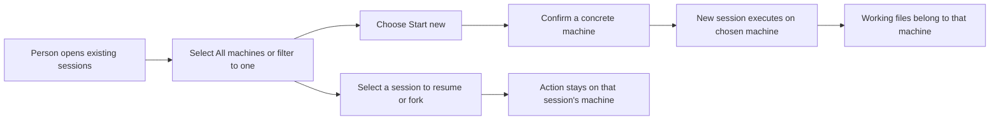

# Choose and filter machines; launch and fork on the session's machine

The owner wants a small named connection registry and a choice of which Router hosts a **new** session. Choosing a Router means the session executes on that Router's machine and filesystem. It does not mean a local session borrows that Router's model proxy.

The picker also lets the person select a machine or an **All machines** session view. Every session keeps its source machine visible. A machine filter guides NEW placement for that invocation; resume and fork follow the selected session's source, including in All machines. The owner suggested a control-key shortcut such as Ctrl+M. The picker uses Ctrl+G because its current terminal input mode cannot distinguish Ctrl+M from Enter; a visible machine control and F2 provide alternate access without accidental resume.

The additional fork UX keeps the existing shortcut and makes the source session and destination visible in a popup. A same-Router fork is supported in each selected machine context; a cross-machine fork is visibly unavailable until native state portability and transport are proved. “Popup” is the proposed interpretation of “pop,” not an accepted detailed layout.

The direct user is the person launching `agent-sessions`. The operator supplies already-exposed Router endpoints and existing credential references. The invoking checkout remains on Sunclaw; selecting another Router neither moves nor synchronizes it.

The current launcher's default is one locally discovered Router. Its hosted Codex launch uses that Router's public native Unix socket. A local stored-session catalog and that Router's runtime inventory feed the existing picker. The missing outcomes are explicit placement on another named Router and machine selection/filtering while retaining each session's routing identity.

## Authorized needs

All rows below are owner-authorized essentials; no relative priority between them was supplied. Authority is the initial selector commission, the 2026-10-03 owner-intent clarification, the Agent Sessions TUI refinement and the explicit fork/popup extension retained in the [coordination trace](../../wip/work-trails/2026-10-03-router-selector/main.md). The rows normalize those settled instructions; they add no implementation authority.

| Need | Desired outcome and why | Authority |
| --- | --- | --- |
| U1 | Configure named Tailscale Router connections in a simple JSONC file, whose names identify the configured machine choices in the Agent Sessions TUI. | Initial scope and TUI refinement; authorized |
| U2 | Choose Start new session, then confirm a concrete machine; a selected individual machine is preselected, while All machines requires a concrete destination. Execution, working directory and session state belong to that machine's Router. Enter on an existing session resumes it. | Clarified placement and 2026-10-05 machine/action refinement; authorized |
| U3 | Preserve existing defaults, session affinity, listing, resume, fork and last-session behavior; a placement choice must not redirect an existing session. | Initial scope and clarification; authorized |
| U4 | Validate stable Router service identity and reference existing credentials instead of copying secret values. | Initial scope; authorized |
| U5 | Preserve advertised provider capabilities; reaching a machine is not evidence that every provider operation or interactive attachment is supported. | Initial scope; authorized |
| U6 | Deliver the focused selector in the current repository through design, planning, implementation and verified PR delivery. Consume operator-supplied exposure; do not change network/auth/security/credentials, install providers, or replace production processes as a side effect. | Initial protected boundaries retained; later owner delivery direction supersedes design-only limit |
| U7 | Keep the fork shortcut usable consistently across machine contexts; show source/session affinity, destination, same-Router default, unavailable/provider states and cancellation/back/navigation. Cross-machine fork is unavailable without proved native state portability/transport. | Additional explicit fork UX refinement; authorized |
| U8 | Select/filter machines inside the picker, with All machines and individual machine choices, visible machine labels and a discoverable control. Provide a control-key shortcut and retain ordinary Enter; use Ctrl+G because the suggested Ctrl+M aliases Enter in the existing terminal mode. All existing-session actions use the selected row's actual machine and full route. | Direct 2026-10-05 machine/filter/shortcut/action refinement; authorized |

## Boundary

The feature consumes named connections. Router/provider owners still own sessions, accounts, execution and policy enforcement. Caller-requested policy/model settings cross the existing native boundary; remote Host defaults are not necessarily the requested values. The operator still owns network exposure and credential provisioning. Conceptual Tailscale reachability/exposure is assumed for design; it has not been measured and is not sufficient identity or capability evidence.

No replication, account fabric, file transfer, checkout cloning, remote path mapping, global default switching, persisted merged catalog, affinity database or recovery subsystem is requested. All machines combines read-only inventories only in the picker; selecting one machine filters that view and preselects NEW there without changing the saved/default Router. Known hosted session identities remain service/endpoint/session identities; existing unhosted local records keep their local source-home identity and are never assigned a remote Router by guess. Adding a client registry does not reshape stored session records.

Success is observable when the chosen machine creates the new session and its first execution uses that machine's working directory, while existing-session operations retain their original routing. A reachable HTTP endpoint, a matching label, successful model traffic or a launcher command alone does not prove that outcome.

Fork success additionally requires a new fork created on the actual source Router, with the source session preserved and no transfer/reinterpretation of its ID on another machine. Selecting an unsupported destination, canceling the popup or receiving a late result after cancellation creates no fork.

## Design assumptions and evidence limits

The owner-supplied endpoint exposure must include a usable creation/interactive surface for the desired provider and a way to verify the Router identity associated with it. The current repository provides owner-local control and loopback HTTP MCP; it does not implement the remote exposure assumed here. The design must name that external prerequisite rather than construct it inside the selector.

Three distinct prerequisites remain unestablished: remote MCP exposure/credential presentation/tool visibility; binding the actual native attachment to the expected Router service and endpoint; and compatibility of the native TUI's caller-side policy/profile projection with the selected remote Host's existing policy. No policy selection or security change is authorized by the placement clarification. Under the proposed eligibility contract, current source/evidence would reject every named remote NEW until these prerequisites are supplied; no such selector command is implemented today. That rejection is a safe boundary, not fulfillment of the desired remote-creation outcome. Real remote success and post-handoff-failure proof remain unavailable.

The machine-filter control and All machines view have **no current UI**. The existing session picker is the design-system reference: yellow selection, grey single-line borders, content-sized detail panels and separate bottom shortcuts. The retained illustration below covers the NEW destination choice only; it does not depict the newly required machine-filter control or prove runtime behavior.

*The person has activated Start new session and moved from Sunclaw.local (current/default) to the configured Sunbook entry. These are display-label examples, not verified remote identity. Enter selects; Esc returns to the existing session picker. Connection identity is still unchecked.*

*Alt+Enter remains the fork shortcut on an actual source session row. Both proposed popup examples preserve the source; they do not imply that state can be forked onto another machine. Layout and remote route eligibility are not accepted or measured by this illustration.*

Read the [Specification](2026-10-03-router-selector-specification.md) for observable obligations, then the [Program Design](2026-10-03-router-selector-program-design.md) for owners, connection shapes and proof boundaries.
