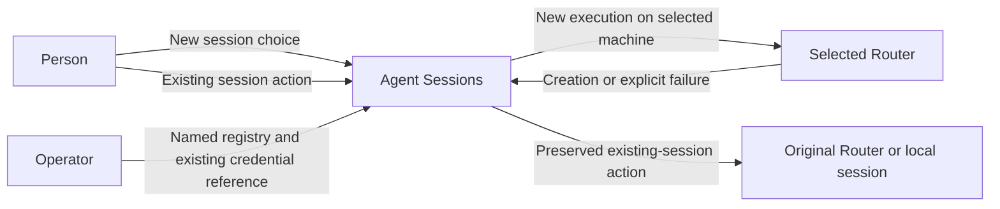
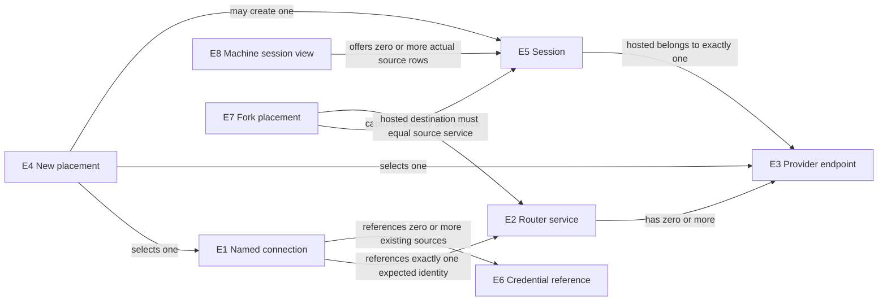

# Machine selection and source-affine fork contract

This contract derives from [U1–U8](2026-10-03-router-selector-requirements.md#authorized-needs). It specifies machine filtering, creation placement and source-affine actions; it does not authorize deployment of a remote exposure service or session migration.

## Entities

| Entity | Identity and relationships | Invariants and observable states | Basis |
| --- | --- | --- | --- |
| E1 Named Router connection | One name within one registry; refers to exactly one expected Router service. Names and addresses can change without making two services identical. | Configured, invalid, selected. A name is a locator alias, not service identity or capability authority. | U1, U4 |
| E2 Router service | Stable service identity; one service may have several connection names and provider endpoints. A restart changes its epoch, not its stable identity. | Unverified, verified, mismatched, unreachable. A connection is accepted only for its configured service identity. | U2, U4 |
| E3 Provider endpoint | A provider endpoint within exactly one Router service; identified by that service and endpoint identity. | Available, unavailable, or unverified; operations keep their advertised capability state. Creation and interactive attachment are different capabilities. | U5 |
| E4 New-session placement | One transient creation action selects one destination at a time, one provider endpoint and a working directory interpreted on that destination. Pre-handoff rejection may return to choice; destination becomes fixed at native handoff. | Choosing, canceled, rejected, handed to the native creation surface, finished, effect unknown. No existing session is the target of this action. | U2, U3 |
| E5 Session | Known hosted identity is its service/endpoint/session reference. An unhosted local record instead uses its source Codex home plus session ID; no original Router identity is invented for it. | Stored/loaded, absent, created, or creation outcome unknown. State belongs to its source machine/home. A locator change cannot transfer it; local IDs cannot be looked up on a different machine as a substitute source. | U2, U3, U7 |
| E6 Credential reference | A reference to an existing credential source, not the credential value. Several connections may use the same reference without sharing service identity. | Absent when not required, resolvable, missing, or unusable by the selected surface. It grants no inferred actor identity or new authorization. | U4, U6 |
| E7 Fork placement | One fork action captures exactly one E5 source and source routing context, then a destination. Supported destination equals the source Router/endpoint, or the same local source home for unhosted local Codex. | Choosing, verifying source, rejected, canceled, prepared, handed off, finished/effect unknown. Source is immutable; other machines are unsupported without portability proof. | U3,U5,U7 |
| E8 Machine session view | One transient picker view selecting the default source, one configured machine, or All machines across the configured sources. Each E5 retains its own source identity and each source has its own query/result state. | Default, choosing machines, loading, displaying, partially unavailable, unavailable. Rows show source machine; failed sources are not represented as empty. No saved/default-target write or session-state transfer. | U3,U7,U8 |

## Observable obligations

| Obligation | Required behavior, including negative case | Need / entities | Proof |
| --- | --- | --- | --- |
| R1 Named configuration | The registry MUST support human-named connections in JSONC. Invalid names, duplicate names, invalid identity/locator shapes or inline credentials MUST be rejected for a named new-session action. An invalid unused registry MUST NOT break existing-session commands. | U1, U3, U4; E1, E2, E6 | V1 config behavior and secret-safe diagnostics |
| R2 NEW choice | Start new MUST have a concrete destination before launch; without configured choices, the established default/local destination remains the direct path; an individual machine filter preselects that machine in the NEW chooser. All machines is never a launch destination. Enter on existing rows resumes on their source route; direct CLI listing/last/exact-session actions retain their current catalog/target. Canceling NEW creates nothing and returns to the retained picker view. | U2,U3,U8; E4,E5,E8 | V2 machine-filter/NEW interaction, Enter on existing vs NEW rows and no-effect cases |
| R3 Default preservation | Missing/valid-empty registry and direct unnamed NEW retain today's default/local/debug launch. An invalid registry may show its bounded TUI error but leaves the same default launcher available. Machine filtering changes only invocation-local view and NEW preselection; it MUST NOT write a saved/default Router or reroute existing sessions. | U3,U8; E1,E4,E5,E8 | V3 default/local/debug regressions and no persistent target change |
| R4 Remote execution and cwd | A selected remote NEW session MUST execute and store session state on the chosen machine. Its working directory MUST come from the connection's configured `defaultRemoteCwd`, never an inferred copy/map of the invoking checkout. The destination validates that path. Missing configured destination cwd MUST fail before creation; a caller-local existence test cannot reject a destination-only path. | U2, U3; E4, E5 | V4 real two-machine execution, cwd and state observation |
| R5 Identity and capabilities | Before creation, the client MUST verify the expected stable service identity and the selected endpoint's usable advertised operation. It MUST also establish that the creation/attachment surface belongs to that verified service. Wrong identity, missing binding evidence, unavailable/unverified required capability or unsupported launcher MUST fail without local fallback or creation. A provider's advertised create support MUST NOT be relabeled unsupported merely because this UI lacks its interactive carrier. | U4, U5; E2, E3, E4 | V5 wrong-service/epoch/channel and provider capability misuse cases; V4 real route |
| R6 Credential references | Configuration and diagnostics MUST carry only existing credential references. Missing required credentials MUST fail before creation. No token may appear in registry values, launch argv, diagnostics or design examples. The selector MUST NOT enroll users, infer remote actors, create credentials or weaken the existing surface's transport rules. | U4, U6; E1, E6 | V6 captured argv/config/output and failure behavior |
| R7 Creation uncertainty and affinity | After handing control to a creation surface, a lost connection or unsuccessful client exit MUST NOT be interpreted as proof that no session was created. The selector MUST NOT automatically retry NEW, switch Router, delete the possible session or create a substitute local session. Any returned identity MUST retain the verified service and endpoint. Existing remote session state is not copied into the local catalog by this feature. | U2, U3; E2, E3, E4, E5 | V7 post-handoff failure plus remote state and no duplicate effects |
| R8 Scope boundary | Implementation MUST consume supplied exposure without adding a fabric/recovery/exposure subsystem or changing credentials, network exposure, auth/security policy, installed providers, persisted session formats or production processes. Release publication and production replacement remain separate actions. | U6; E1–E8 | V8 write-set/architecture review and isolated runtime-state inspection |
| R9 Source-affine fork popup | Alt+Enter on a native session MUST open a popup with fixed source/session and explicit same-source destination. Provider rows show a bounded unavailable explanation when no qualified fork route exists. Other machines remain unsupported without portability proof. Wrong-service, absent-source, unavailable/unqualified route, disabled-row Enter, back/cancel or late results create no fork. The effective directory and origin MUST be visible: preserve current invoking-cwd semantics for default/local, use qualified source cwd for configured-source forks, and never map a caller path remotely. | U3,U5,U7,U8; E2,E3,E5,E7 | V9 real same-source fork, source preservation, cwd and cancellation/no-fork on each machine |
| R10 Machine selection and filter | The picker MUST expose a visible Machine control and shortcut access to All machines and individual configured sources. Each row MUST display its source machine and retain full identity through resume/fork. All machines is a transient read-only combination, not a persisted session catalog. Failed sources MUST be labeled unavailable, not empty; no local record may fill remote identity/metadata. Canceled/failed individual-source switching retains the previous view. Plain Enter MUST retain resume even when a terminal cannot distinguish Ctrl+M. | U3,U4,U5,U7,U8; E1,E2,E3,E5,E8 | V10 real source-scoped and All inventories, duplicate-ID isolation, partial failure, key compatibility and source-routed actions |

### Need-to-contract navigation

P1 is the current inability to select a configured remote machine in this launcher. P2 is the preservation risk of applying that choice to the shared existing-session target; it is a design risk, not a claimed production incident. P3 is the source-backed gap between endpoint reachability and verified execution identity/policy/capability. O1 is explicit NEW placement, O2 is preservation of the existing session journey, and O3 is truthful eligibility/effect reporting within the authorized boundary.

| Need | Entities | Problem | Outcome | Obligation | Observable contract | Evidence |
| --- | --- | --- | --- | --- | --- | --- |
| U1,U3,U4 | E1,E2,E6 | P1,P2,P3 | O1,O2,O3 | R1 | C1 named JSONC configuration | V1 |
| U2,U3,U8 | E4,E5,E8 | P1,P2 | O1,O2 | R2 | C2 NEW machine chooser and existing bindings | V2 |
| U3,U8 | E1,E4,E5,E8 | P2 | O2 | R3 | C2 current/default launch | V3 |
| U2,U3 | E4,E5 | P1,P3 | O1 | R4 | C3 destination execution/cwd | V4 |
| U4,U5 | E2,E3,E4 | P3 | O1,O3 | R5 | C3 service/endpoint/attachment eligibility | V5,V4 |
| U4,U6 | E1,E6 | P3 | O3 | R6 | C4 existing credential reference only | V6 |
| U2,U3 | E2,E3,E4,E5 | P2,P3 | O2,O3 | R7 | C5 post-handoff uncertainty and affinity | V7 |
| U6 | E1–E8 | P3 | O3 | R8 | C6 isolated delivery and external prerequisites | V8 |
| U3,U5,U7,U8 | E2,E3,E5,E7 | P2,P3 | O2,O3 | R9 | C7 source-affine fork popup and unsupported transfer | V9 |
| U3,U4,U5,U7,U8 | E1,E2,E3,E5,E8 | P2,P3 | O2,O3 | R10 | C8 machine-filtered and All session inventories | V10 |

## User-visible new-session surface

The existing Agent Sessions TUI remains the first screen. Current source binds Enter to the focused row's activation, Alt+Enter to fork, Ctrl+N to Start new, and click activation on the Start new row (`picker_component.rs:263–307`, `picker_list_view.rs:52–70`, `picker_model.rs:285–299`). Preserve those existing-row bindings. When configured remote names exist in hosted mode, activating **Start new session** opens a content-sized **Choose machine for new session** step; it does not yet launch a session. Ctrl+N/click activation enter the same NEW step. With no registry or a valid empty registry, default NEW remains the current direct launch. A missing registry therefore preserves defaults; an existing malformed/unreadable registry instead shows an error with only the default row available. In explicit `--local` mode, Start new always retains the direct local-Codex launch with no machine chooser; `--local` does not acquire a misleading default-Router label or remote option.

The hosted machine choices include the synthetic local/current default and JSONC names. In an individual configured-machine view, that machine is initially selected for NEW; in the default or All machines view, the current/default machine is initially selected and the person confirms a concrete destination. Concrete labels are **Sunclaw.local (current/default)** and **Sunbook (configured)** when those are the local and configured names. Sunbook is a display-name example, not an inferred hostname or verified identity; actual entries use configured names and the default uses the invoking machine's available local label (otherwise “This machine (current/default)”). A configured entry is marked **Not checked** until chosen.

Up/Down moves machine focus without credential resolution, network discovery or creation. Enter on the current/default row calls the existing default launcher. Enter on a configured name validates its configured destination cwd and performs that action's prerequisite/discovery checks. A configured entry without `defaultRemoteCwd` is rejected with a bounded missing-cwd reason before creation. Pre-handoff rejection keeps this chooser open with a bounded reason, so the person may explicitly choose again or go back; there is no automatic retry or local fallback. Esc returns to the same existing session-picker state, including its search/filter/focus. If the registry cannot be read, show its bounded error and retain the default choice. NEW verification probes only the chosen destination; inventory loading for All machines is a separate read-only operation.

While verification is pending, the chooser displays **Checking <configured name>**, locks machine focus and ignores repeated Enter. Esc abandons that attempt and returns to the retained main picker; its eventual result must not create a session. The machine stage owns input while visible: only its Up/Down, Enter, Esc and whole-picker Ctrl+C/Ctrl+D exit actions are active; main search/filter/reload/help keys, Ctrl+N and Alt+Enter are inert. Only a still-current attempt may complete NEW; canceled or superseded asynchronous results are ignored before creation handoff.

*Illustrative state after moving from the current/default Sunclaw.local choice to configured Sunbook. Enter chooses; it does not bypass identity/capability checks. Esc goes back to existing sessions. This is a proposed screen, not observed application behavior.*

The requested surface is the interactive Agent Sessions TUI: a plain invocation reaches the machine choice only through Start new. A configured connection supplies `defaultRemoteCwd`; if it is absent, named NEW is rejected before creation. The selected destination validates that path on its own machine. Named NEW must not let passthrough native address or auth selectors replace the verified destination, while the existing default launch behavior remains unchanged.

The chooser displays an unsupported-launcher reason separately from the endpoint's actual advertised create capability. This contract does not promise interactive carriers for all advertised providers. Native Codex attachment has documented upstream support; other remote provider launch routes remain an explicit design gap unless an existing supported route is demonstrated. Existing local Claude and other existing-session surfaces retain their current behavior.

## Machine-scoped sessions and the fork popup

The visible **Machine: <selection>** control opens the machine selector from the main picker. **Ctrl+G** opens the same control; **F2** is an alternative. The suggested Ctrl+M is not advertised or assigned because current input mode reports it as Enter. Tab/Shift+Tab moves focus between the Machine control and session list; Enter on the control opens it, and click activates it. Enter on a session still resumes. Function-key support is therefore not required. Legacy carriage return is Enter and MUST NOT be reinterpreted as a machine shortcut. Footer/help consistently show Ctrl+G, F2 and visible Machine access; they MUST NOT advertise Ctrl+M as a machine action.

Choices are **All machines**, **This machine (current/default)** and the configured machine names. Opening the picker preserves its current default-source view; selecting All is explicit. In a single-machine view the header reads **Viewing sessions on <machine>**; All reads **Viewing sessions on All machines**, with a machine label on every row and separate per-machine loading/unavailable indicators. A failed source is never reported as having no sessions. All collects only configured/default sources, never undiscovered computers. Aliases of one qualified service/endpoint share one inventory; Single retains the selected alias in its header and NEW preselection, while All labels it with the first validated registry name plus an “also: <aliases>” suffix; equal native session IDs on different services remain distinct rows. The combination is transient and transfers no session state.

Up/Down and Enter select a filter without creating a session. Esc closes the selector and retains the prior view/query/focus. Successful switching publishes the new selection and matching source rows together; a failed/canceled individual-source switch keeps the old view. In All, successful sources remain usable if another is unavailable; the header marks the view loading while reads are pending and partial when any source is unavailable or has unfinished pages; paging progress remains visible per source. An unsupported common filter/query has a source-specific explanation, never a silent unfiltered fallback. Refresh/query changes invalidate older results and source previews. While a selector or action popup owns input, main shortcuts are inert. Whole-picker Ctrl+C/D invalidates pending results and exits.

Main Esc retains the existing ladder: close help, then clear nonempty search, then return from a nondefault machine view to the retained default view; at the default view with empty search it exits. The visible Machine control always offers the default view as an explicit return path. Explicit `--local` stays local-only and shows that scope; remote choices are unavailable there. Missing/empty registry offers the default source only; malformed registry shows its bounded error and leaves default actions available.

The filter never writes a global/default Router. Start new under an individual configured-machine filter opens the NEW chooser with that machine preselected. Under All, NEW requires selection/confirmation of one destination. Resume/fork always use the focused row's service/endpoint/session identity, independently of the active filter. Remote scope/cwd is interpreted on the source machine; caller checkout/repository roots are never guessed remotely.
Alt+Enter on the focused session opens **Fork session** as a popup proposal. Enter on that session remains resume. The popup shows source machine/Router (or **Local Codex**), source session title and a fixed source identity behind that display. Its destination list begins with **Sunbook (source; same Router)** when browsing Sunbook, or **Sunclaw.local (source; same Router)** on that source. The opposite configured machine is **Cross-machine fork unavailable — history remains on the source Router**. For unhosted local Codex, only the same local source/home is supported; no hosting Router is invented. Default-attributed local rows retain current default resume/fork behavior and are never eligible for reinterpretation on a configured remote machine.

Up/Down may focus disabled rows to read their reason; Enter cannot activate them. An unavailable source machine shows **Source machine unavailable — no fork**; an unsupported/unverified launcher fork shows **Provider fork unavailable in this launcher**, distinctly from the provider's advertised create support or any unassessed provider-native fork feature. No background probing of all disabled destinations is required. Same-Router Enter revalidates the captured source and qualified fork route, then uses the existing native fork contract there. No local/default fallback occurs if that source is unavailable. Cross-machine state import/export, copying rollouts, migrations and remote-ID guessing are not designed or enabled.

Esc returns to the captured source view without changing query settings; restore the focused source identity if it is still present, otherwise show its absence using the existing focus fallback. The popup owns input; main keys are inert. Verifying source uses the same pending-attempt/cancellation rules as NEW. Ctrl+C/D exit the whole picker. Source/destination/policy/availability failures before handoff create no fork; after handoff, an unsuccessful client exit can leave a fork effect unknown and never triggers automatic re-fork or deletion. The popup follows the existing content-sized iocraft layout; the retained illustration is not runtime or visual acceptance evidence.

*Two hypothetical qualified Codex source contexts; same shortcut and popup rules on each. The retained image illustrates same-source fork destinations; it does not depict the new Machine control or effective-directory field. The picture proves neither remote availability nor state portability.*

V9 needs real same-Router fork evidence for at least two source-machine contexts: the new fork and untouched parent are on their source Router; disabled other-machine selection, unavailable/provider and cancel/late-result cases create nothing. V10 needs actual service-scoped inventory responses, each row/metadata bound to its own verified source, distinct duplicate IDs across machines, and resume/fork against the selected row's full source identity in individual and All views. These remote proofs remain conditional on the supplied exposure/identity/policy contracts; schema or mock inventory is insufficient.

The popup displays the effective fork directory and its origin before confirmation. Default/local retains the invoking cwd or existing explicit override; configured-source forks use qualified source directory metadata and reject missing/unqualified cwd. A provider row with no supported fork carrier opens an explanatory unavailable popup, without changing its advertised create capability. No unknown original Router provenance is inferred from a local row's default attribution. The current images omit the Machine filter and effective-directory field; both have **no current UI** and require updated visual proof when implemented.
## Failure boundary and proof

Before native handoff, registry/credential/identity/capability/cwd-input failures are rejected with no creation. After handoff, client exit and transport loss can leave an unknown effect; report that uncertainty and preserve the selected destination. There is no automatic compensation, replay, migration or alternate destination.

V1–V3 and V6 require automated command/config interaction evidence at the actual launcher boundary. V5 needs allowed/denied cases at discovery and launch eligibility boundaries. V4 requires a real selected remote machine and correlated session/execution evidence: a stand-in or matching model reply does not establish location. V7 requires failure after real handoff, observable remote state and no second creation. V8 uses source/write-set and isolated runtime-state inspection to verify the protected boundaries.

The assumed exposure must provide identity-bearing Router discovery and binding to the actual native/creation attachment. Existing repository HTTP MCP is loopback-only, and upstream native initialization does not report Router service identity or epoch. Remote MCP credential presentation/tool visibility and attachment-time binding are unestablished. Upstream remote NEW also forwards caller-side approval/sandbox/model settings; placement alone does not authorize a different policy or establish compatibility with the remote Host. These and non-Codex interactive routes remain explicit gaps for [Program Design](2026-10-03-router-selector-program-design.md). No remote success is claimed from rejection-only proof.
