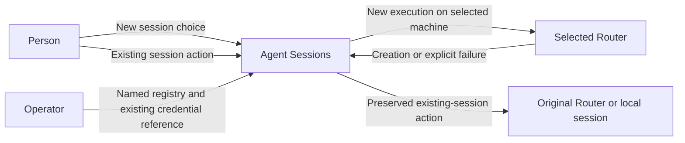
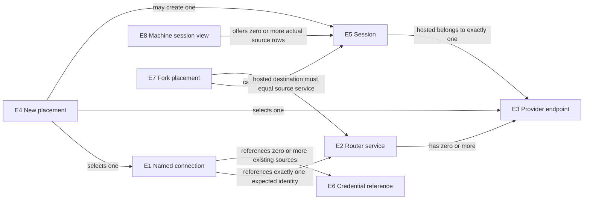
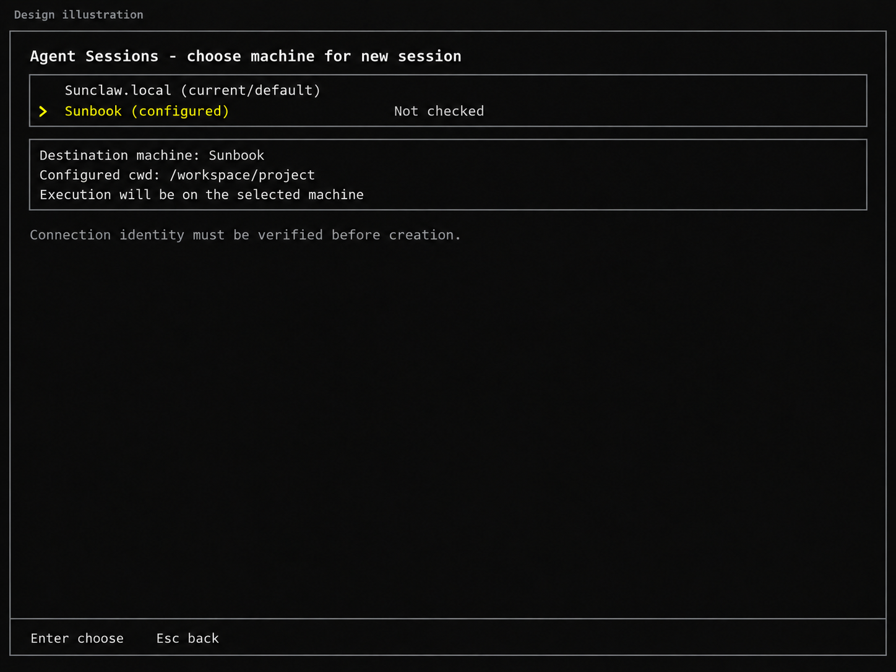
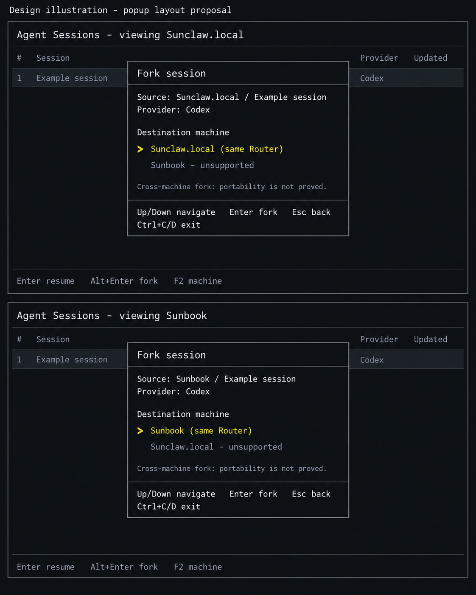

# Machine selection and source-affine fork contract

This contract derives from [U1–U7](2026-10-03-router-selector-requirements.md#authorized-needs). It specifies creation placement and the explicitly extended fork popup while preserving source affinity; it does not authorize deployment of a remote exposure service or session migration.

## Entities

| Entity | Identity and relationships | Invariants and observable states | Basis |
| --- | --- | --- | --- |
| E1 Named Router connection | One name within one registry; refers to exactly one expected Router service. Names and addresses can change without making two services identical. | Configured, invalid, selected. A name is a locator alias, not service identity or capability authority. | U1, U4 |
| E2 Router service | Stable service identity; one service may have several connection names and provider endpoints. A restart changes its epoch, not its stable identity. | Unverified, verified, mismatched, unreachable. A connection is accepted only for its configured service identity. | U2, U4 |
| E3 Provider endpoint | A provider endpoint within exactly one Router service; identified by that service and endpoint identity. | Available, unavailable, or unverified; operations keep their advertised capability state. Creation and interactive attachment are different capabilities. | U5 |
| E4 New-session placement | One transient creation action selects one destination at a time, one provider endpoint and a working directory interpreted on that destination. Pre-handoff rejection may return to choice; destination becomes fixed at native handoff. | Choosing, canceled, rejected, handed to the native creation surface, finished, effect unknown. No existing session is the target of this action. | U2, U3 |
| E5 Session | Known hosted identity is its service/endpoint/session reference. An unhosted local record instead uses its source Codex home plus session ID; no original Router identity is invented for it. | Stored/loaded, absent, created, or creation outcome unknown. State belongs to its source machine/home. A locator change cannot transfer it; local IDs cannot be looked up on a different machine as a substitute source. | U2, U3, U7 |
| E6 Credential reference | A reference to an existing credential source, not the credential value. Several connections may use the same reference without sharing service identity. | Absent when not required, resolvable, missing, or unusable by the selected surface. It grants no inferred actor identity or new authorization. | U4, U6 |
| E7 Fork placement | One fork action captures exactly one E5 source and source routing context, then a destination. Supported destination equals the source Router/endpoint, or the same local source home for unhosted local Codex. | Choosing, verifying source, rejected, canceled, prepared, handed off, finished/effect unknown. Source is immutable; other machines are unsupported without portability proof. | U3,U5,U7 |
| E8 Machine session view | One transient explicit browsing context within a picker invocation. It references one source machine/Router, or explicit local Codex, and one current query snapshot. | Default, choosing source, loading, displaying, unavailable. All displayed hosted rows belong to its verified service/endpoint; no mixed catalog or default-target write. | U3,U7 |

## Observable obligations

| Obligation | Required behavior, including negative case | Need / entities | Proof |
| --- | --- | --- | --- |
| R1 Named configuration | The registry MUST support human-named connections in JSONC. Invalid names, duplicate names, invalid identity/locator shapes or inline credentials MUST be rejected for a named new-session action. An invalid unused registry MUST NOT break existing-session commands. | U1, U3, U4; E1, E2, E6 | V1 config behavior and secret-safe diagnostics |
| R2 NEW choice | The configured NEW machine choice MUST follow Start new; it is separate from the fork popup. Enter on existing rows retains its current resume behavior and source route; default CLI listing/last/exact-session actions retain their current catalog/target. Canceling NEW selection creates nothing and returns to the existing session picker. | U2,U3; E4,E5,E8 | V2 command/picker interaction, Enter on existing vs NEW rows and no-effect cases |
| R3 Default preservation | Missing/valid-empty registry and direct unnamed NEW retain today's default/local/debug launch. An existing invalid registry may show its bounded error in the TUI but must leave the same default launcher available. No entry or source-view change automatically changes a global/default NEW Router or reroutes an existing session. | U3; E1,E4,E5,E8 | V3 default/local/debug regression behavior |
| R4 Remote execution and cwd | A selected remote NEW session MUST execute and store session state on the chosen machine. Its working directory MUST come from the connection's configured `defaultRemoteCwd`, never an inferred copy/map of the invoking checkout. The destination validates that path. Missing configured destination cwd MUST fail before creation; a caller-local existence test cannot reject a destination-only path. | U2, U3; E4, E5 | V4 real two-machine execution, cwd and state observation |
| R5 Identity and capabilities | Before creation, the client MUST verify the expected stable service identity and the selected endpoint's usable advertised operation. It MUST also establish that the creation/attachment surface belongs to that verified service. Wrong identity, missing binding evidence, unavailable/unverified required capability or unsupported launcher MUST fail without local fallback or creation. A provider's advertised create support MUST NOT be relabeled unsupported merely because this UI lacks its interactive carrier. | U4, U5; E2, E3, E4 | V5 wrong-service/epoch/channel and provider capability misuse cases; V4 real route |
| R6 Credential references | Configuration and diagnostics MUST carry only existing credential references. Missing required credentials MUST fail before creation. No token may appear in registry values, launch argv, diagnostics or design examples. The selector MUST NOT enroll users, infer remote actors, create credentials or weaken the existing surface's transport rules. | U4, U6; E1, E6 | V6 captured argv/config/output and failure behavior |
| R7 Creation uncertainty and affinity | After handing control to a creation surface, a lost connection or unsuccessful client exit MUST NOT be interpreted as proof that no session was created. The selector MUST NOT automatically retry NEW, switch Router, delete the possible session or create a substitute local session. Any returned identity MUST retain the verified service and endpoint. Existing remote session state is not copied into the local catalog by this feature. | U2, U3; E2, E3, E4, E5 | V7 post-handoff failure plus remote state and no duplicate effects |
| R8 Scope boundary | The delivered work MUST remain design artifacts and research/advice receipts. It MUST NOT change product code, credentials, network exposure, auth/security policy, installed providers, session storage, production process state or deployment. The proposed feature consumes independently supplied exposure rather than include a new fabric/recovery/exposure subsystem. | U6; E1–E8 | V8 write-set inspection and architecture review |
| R9 Source-affine fork popup | Alt+Enter on a forkable native session opens a proposed popup with fixed source/session context and explicit destination; provider-row popup behavior remains open. Same-source Router/home is the supported default. Other machines are visibly unsupported without portability/transport proof. Wrong-service, absent-source or unavailable/unqualified operation creates nothing; disabled-row Enter explains its reason. Back/canceled results create no fork. Effective fork directory must be visible; that field/default policy is incomplete in the current proposal. | U3,U5,U7; E2,E3,E5,E7 | V9 source-affine fork, disabled destinations, cwd and cancellation/no-fork evidence on each machine |
| R10 Proposed one-machine source view | A derived proposal for U7 is an explicit view of one configured machine's actual inventory. If adopted, it must not merge catalogs, change default NEW, erase returned source identities or fill remote IDs/metadata from local records. A canceled/failed source switch retains the previous view. This source-acquisition surface and its key are not yet owner-accepted; the all-machine source-affine fork goal remains obligatory. | U3,U4,U5,U7; E1,E2,E3,E5,E8 | V10 actual machine-scoped inventory, source identity and view-switch isolation; source-view decision open |

### Need-to-contract navigation

P1 is the current inability to select a configured remote machine in this launcher. P2 is the preservation risk of applying that choice to the shared existing-session target; it is a design risk, not a claimed production incident. P3 is the source-backed gap between endpoint reachability and verified execution identity/policy/capability. O1 is explicit NEW placement, O2 is preservation of the existing session journey, and O3 is truthful eligibility/effect reporting within the authorized boundary.

| Need | Entities | Problem | Outcome | Obligation | Observable contract | Evidence |
| --- | --- | --- | --- | --- | --- | --- |
| U1,U3,U4 | E1,E2,E6 | P1,P2,P3 | O1,O2,O3 | R1 | C1 named JSONC configuration | V1 |
| U2,U3 | E4,E5 | P1,P2 | O1,O2 | R2 | C2 NEW machine chooser and existing bindings | V2 |
| U3 | E1,E4,E5 | P2 | O2 | R3 | C2 current/default launch | V3 |
| U2,U3 | E4,E5 | P1,P3 | O1 | R4 | C3 destination execution/cwd | V4 |
| U4,U5 | E2,E3,E4 | P3 | O1,O3 | R5 | C3 service/endpoint/attachment eligibility | V5,V4 |
| U4,U6 | E1,E6 | P3 | O3 | R6 | C4 existing credential reference only | V6 |
| U2,U3 | E2,E3,E4,E5 | P2,P3 | O2,O3 | R7 | C5 post-handoff uncertainty and affinity | V7 |
| U6 | E1–E8 | P3 | O3 | R8 | C6 design-only delivery and external prerequisites | V8 |
| U3,U5,U7 | E2,E3,E5,E7 | P2,P3 | O2,O3 | R9 | C7 source-affine fork popup and unsupported transfer | V9 |
| U3,U4,U5,U7 | E1,E2,E3,E5,E8 | P2,P3 | O2,O3 | R10 | C8 explicit one-machine session inventory | V10 |

## User-visible new-session surface

The existing Agent Sessions TUI remains the first screen. Current source binds Enter to the focused row's activation, Alt+Enter to fork, Ctrl+N to Start new, and click activation on the Start new row (`picker_component.rs:263–307`, `picker_list_view.rs:52–70`, `picker_model.rs:285–299`). Preserve those existing-row bindings. When configured remote names exist in hosted mode, activating **Start new session** opens a content-sized **Choose machine for new session** step; it does not yet launch a session. Ctrl+N/click activation enter the same NEW step. With no registry or a valid empty registry, default NEW remains the current direct launch. A missing registry therefore preserves defaults; an existing malformed/unreadable registry instead shows an error with only the default row available. In explicit `--local` mode, Start new always retains the direct local-Codex launch with no machine chooser; `--local` does not acquire a misleading default-Router label or remote option.

The hosted machine choices begin with the synthetic local/current default selected, followed by JSONC names. Concrete labels are **Sunclaw.local (current/default)** and **Sunbook (configured)** when those are the local and configured names. Sunbook is a display-name example, not an inferred hostname or verified identity; actual entries use configured names and the default uses the invoking machine's available local label (otherwise “This machine (current/default)”). A configured entry is marked **Not checked** until chosen.

Up/Down moves machine focus without credential resolution, network discovery or creation. Enter on the current/default row calls the existing default launcher. Enter on a configured name validates its configured destination cwd and performs that action's prerequisite/discovery checks. A configured entry without `defaultRemoteCwd` is rejected with a bounded missing-cwd reason before creation. Pre-handoff rejection keeps this chooser open with a bounded reason, so the person may explicitly choose again or go back; there is no automatic retry or local fallback. Esc returns to the same existing session-picker state, including its search/filter/focus. If the registry cannot be read, show its bounded error and retain the default choice. No background probing of every Router or aggregated session list is required.

While verification is pending, the chooser displays **Checking <configured name>**, locks machine focus and ignores repeated Enter. Esc abandons that attempt and returns to the retained main picker; its eventual result must not create a session. The machine stage owns input while visible: only its Up/Down, Enter, Esc and whole-picker Ctrl+C/Ctrl+D exit actions are active; main search/filter/reload/help keys, Ctrl+N and Alt+Enter are inert. Only a still-current attempt may complete NEW; canceled or superseded asynchronous results are ignored before creation handoff.

*Illustrative state after moving from the current/default Sunclaw.local choice to configured Sunbook. Enter chooses; it does not bypass identity/capability checks. Esc goes back to existing sessions. This is a proposed screen, not observed application behavior.*

The requested surface is the interactive Agent Sessions TUI: a plain invocation reaches the machine choice only through Start new. A configured connection supplies `defaultRemoteCwd`; if it is absent, named NEW is rejected before creation. The selected destination validates that path on its own machine. Named NEW must not let passthrough native address or auth selectors replace the verified destination, while the existing default launch behavior remains unchanged.

The chooser displays an unsupported-launcher reason separately from the endpoint's actual advertised create capability. This contract does not promise interactive carriers for all advertised providers. Native Codex attachment has documented upstream support; other remote provider launch routes remain an explicit design gap unless an existing supported route is demonstrated. Existing local Claude and other existing-session surfaces retain their current behavior.

## Machine-scoped sessions and the fork popup

The proposed **F2 — Browse machine** action opens configured source-machine choices from the main hosted session view; F2 is currently unassigned in the inspected handler. This explicit source navigation serves the requested same-Router fork on each machine. It is not the NEW destination choice. The header says **Viewing sessions on Sunbook** after a successful source switch. Only that Router's actual read-only inventory supplies those rows. Default command listing remains unchanged; source switching never writes a global default. `--local` remains local-only and does not enable remote source browsing. Remote scope paths are interpreted on the selected source, never copied from the caller's checkout; unsupported/unestablished path scope stays unavailable rather than guessed. The default NEW row still identifies the caller's existing default Router, even when browsing a different source machine.

Alt+Enter on the focused session opens **Fork session** as a popup proposal. Enter on that session remains resume. The popup shows source machine/Router (or **Local Codex**), source session title and a fixed source identity behind that display. Its destination list begins with **Sunbook (source; same Router)** when browsing Sunbook, or **Sunclaw.local (source; same Router)** on that source. The opposite configured machine is **Cross-machine fork unavailable — history remains on the source Router**. For unhosted local Codex, only the same local source/home is supported; no hosting Router is invented.

Up/Down may focus disabled rows to read their reason; Enter cannot activate them. An unavailable source machine shows **Source machine unavailable — no fork**; an unsupported/unverified launcher fork shows **Provider fork unavailable in this launcher**, distinctly from the provider's advertised create support or any unassessed provider-native fork feature. No background probing of all disabled destinations is required. Same-Router Enter revalidates the captured source and qualified fork route, then uses the existing native fork contract there. No local/default fallback occurs if that source is unavailable. Cross-machine state import/export, copying rollouts, migrations and remote-ID guessing are not designed or enabled.

Esc returns to the captured source view without changing query settings; restore the focused source identity if it is still present, otherwise show its absence using the existing focus fallback. The popup owns input; main keys are inert. Verifying source uses the same pending-attempt/cancellation rules as NEW. Ctrl+C/D exit the whole picker. Source/destination/policy/availability failures before handoff create no fork; after handoff, an unsuccessful client exit can leave a fork effect unknown and never triggers automatic re-fork or deletion. Popup layout is proposed, not owner-accepted.

*Two hypothetical qualified Codex source contexts; same shortcut and popup rules on each. F2 is the proposed source-browse action, not a global target switch. The picture proves neither remote availability nor state portability.*

V9 needs real same-Router fork evidence for at least two source-machine contexts: the new fork and untouched parent are on their source Router; disabled other-machine selection, unavailable/provider and cancel/late-result cases create nothing. V10 needs actual service-scoped inventory responses, no mixed rows/metadata, and resume/fork against the selected row's full source identity. These remote proofs remain conditional on the supplied exposure/identity/policy contracts; schema or mock inventory is insufficient.

The fork proposal remains incomplete in this bounded pass. Open contract questions: whether Alt+Enter on a provider row opens an explanatory disabled popup or stays inert; popup/F2 behavior for missing/empty/invalid registry and explicit local mode; a visible route from a configured source back to the default view while preserving main Esc behavior; fallback access when F2 is unavailable; and showing effective fork cwd when existing default and remote-source directory policies differ. The current illustration is therefore a partial popup proposal. No unknown original Router provenance is inferred from a legacy local row's hosted-looking display identity.

## Failure boundary and proof

Before native handoff, registry/credential/identity/capability/cwd-input failures are rejected with no creation. After handoff, client exit and transport loss can leave an unknown effect; report that uncertainty and preserve the selected destination. There is no automatic compensation, replay, migration or alternate destination.

V1–V3 and V6 require automated command/config interaction evidence at the actual launcher boundary. V5 needs allowed/denied cases at discovery and launch eligibility boundaries. V4 requires a real selected remote machine and correlated session/execution evidence: a stand-in or matching model reply does not establish location. V7 requires failure after real handoff, observable remote state and no second creation. V8 uses source/write-set inspection; it is the applicable proof for this design-only delivery.

The assumed exposure must provide identity-bearing Router discovery and binding to the actual native/creation attachment. Existing repository HTTP MCP is loopback-only, and upstream native initialization does not report Router service identity or epoch. Remote MCP credential presentation/tool visibility and attachment-time binding are unestablished. Upstream remote NEW also forwards caller-side approval/sandbox/model settings; placement alone does not authorize a different policy or establish compatibility with the remote Host. These and non-Codex interactive routes remain explicit gaps for [Program Design](2026-10-03-router-selector-program-design.md). No remote success is claimed from rejection-only proof.
