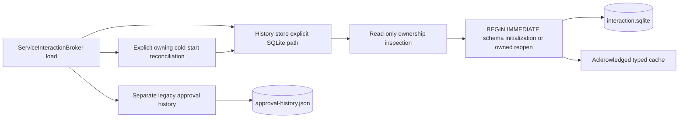

# Typed interaction SQLite program design

Governing contract: [specification.md](specification.md); authorized outcomes: [requirements.md](requirements.md).

The existing interaction broker remains the domain and response owner. Its private history store opens the explicit sibling interaction.sqlite path. No component opens interaction-history.json. SQLite-only history removes import/provenance/recovery coupling; the cost is that previous typed JSON data does not enter the new view. LegacyApprovalHistoryStore continues to own approval-history.json separately.

| Entity | Owner and home | Stored shape / interface |
|---|---|---|
| E1 typed interaction | interaction_history.rs domain; interaction_history_store.rs persistence | typed_interaction_history: request_id TEXT primary key NOT NULL, record_json TEXT NOT NULL. Serde tagged existing InteractionHistoryRecord enum, Rust semantic validation. |
| E2 creation instant | Store creation; interaction_history_database.rs row boundary | created_at TEXT NOT NULL, RFC3339 UTC ending Z, nanosecond precision. Only insertion sets it; settlement updates record_json. |
| E3 acknowledged view | Store mutex + HistoryDatabaseState | In-memory ordered records/creation instants plus last observed i64 revision. Existing infallible listings expose this view. |
| Transaction revision | interaction_history_database.rs | interaction_history_revision: metadata_id INTEGER primary key NOT NULL, revision INTEGER NOT NULL. Exactly one row id=1, nonnegative integer revision; validated in Rust. No import/source columns. |

The separate interaction-migrations SQLx bundle creates these tables and its migration lineage atomically in BEGIN IMMEDIATE. This is database schema initialization, not conversion of JSON data. Fresh initialization inserts revision 0 and no interactions. Existing database inspection first uses a noncreating read-only connection; admit only pristine files or the exact owned schema/SQLx checksums. Repeat inspection under the writer transaction. Reject other tables (including sqliteXforeign), changed columns/DDL, lineage, invalid revisions and corrupt rows without adoption or destructive recovery. The unmerged earlier prototype import schema is unsupported and fails closed; no converter is added.

Responsibility boundaries: interaction_history_schema.rs inspects ownership/lineage; interaction_history_codec.rs rejects duplicate stored JSON fields and validates domain values/timestamps; interaction_history_database.rs owns connections, checked SQL and deltas; interaction_history_store.rs serializes staging/cache publication. Long-lived SQLite connection uses WAL, synchronous FULL, foreign keys, bounded busy timeout and repository checked-query/offline metadata conventions. JSON inside record_json is the enum encoding within SQLite, not JSON file persistence.



Current-to-proposed path: ServiceInteractionBroker::load previously supplied interaction-history.json to a store that read/hashed/imported it into a sibling database. It now supplies interaction.sqlite directly; initialize_history admits/initializes that database and loads validated rows, with no source-file edge. Existing explicit reconcile_pending_on_startup follows successful store initialization before broker publication. The cold-start Host still owns exclusive receiver/lifecycle startup; opening a second storage connection does not authorize a second live broker. Future Host activation/quiescence is outside this storage change.

Every mutation and Question-response validation locks the store and begins BEGIN IMMEDIATE. Read the authoritative singleton revision; when it differs, load/validate rows before staging or actor/terminal checks. Compute and validate the whole delta first, check revision advancement without overflow, write only changed records and advance revision once for a nonempty change. Commit, then synchronously publish cache/revision under the same lock without another await. Observation-only validation can publish a refreshed baseline even when the requested action is rejected; it never replays effects.

```mermaid
sequenceDiagram
    participant Caller as Broker or retention
    participant Store as History store
    participant DB as SQLite
    Caller->>Store: mutation or response validation
    Store->>DB: BEGIN IMMEDIATE; read revision
    opt revision differs
        Store->>DB: read and validate authoritative rows
    end
    Store->>Store: validate and stage against baseline
    opt valid nonempty mutation
        Store->>DB: apply delta and checked revision increment
    end
    Store->>DB: COMMIT
    Store->>Store: publish acknowledged cache without await
    Store-->>Caller: existing result
```

| Failure / state boundary | Detection, containment and recovery |
|---|---|
| Invalid database/row | Private StorageUnavailable, InvalidSchema or InvalidStoredRecord reason diagnostic; existing public Unavailable. No bodies/answers/account data in logs; no clearing/fallback. Operator owns repair outside this change. |
| Error/drop before commit | SQLite transaction rolls back; acknowledged cache remains unchanged. No automatic retry. |
| Commit happened before caller abort/publication | Next refreshing operation observes revision and reloads authoritative rows. Listings/cache-only retry classification can remain stale until refresh. No callback recreation, acknowledgment claim or resend. |
| Competing settlement | Mutex + writer transaction validates current terminal state; exactly one winner. Separate connections cannot overwrite unrelated rows. |
| Question response | Existing validate → completion send → persistence. Failed send cancels requesterUnavailable; persistence failure after send remains partial success. U3 caller-work lifetime is separately owned. |
| Approval response | Existing persistence → completion send. Storage failure prevents choice send. |
| Owning restart | Explicit reconciliation changes pending state to hostRestarted transactionally. Low-level reopen only validates storage. |
| Retention | Strict creation-time age, oldest/id ordering, bounded row deletion. No JSON file cleanup or creation-time changes. |
| Downgrade | Older binaries see stale old typed JSON. No transparent rollback, history export or cross-version callback ownership. |

| Need / contract / entity | Owner and interface | State / failure | Proof seam |
|---|---|---|---|
| U1 R1 E1,E2 | Store creation/settlement; checked rows | Commit/cache; unavailable | Actual store creation and durable reopen |
| U2 R2 E1 | Broker load → explicit SQLite path | Empty fresh history; no JSON dependency | Public broker + ignored-file matrix and raw SQL count |
| U4 R3 E1,E2,E3 | Schema inspector/codec/revision reader | Valid only; fail closed | Corrupt row/class/schema/bytes matrices |
| U3 R4 E1 | Existing typed broker request/answer/decision | Single settlement, original ordering | Broker channel with real SQLite rejection |
| U3 R5 E1,E2 | Explicit startup reconciliation/prune | Pending → cancelled; expired → removed | Reconciliation failure and retention cutoff/reopen |
| U4 R6 E1,E3 | Transaction baseline/delta/cache | Validated refresh; no replay | Two writers, settlement race, abort after commit |
| U5 R7 E1,E2,E3 | Lead proof acceptance | Missing proof remains incomplete | Focused real MCP/storage, quality, independent review, native debug proof |

Source anchors: interaction_broker.rs (typed/legacy history composition); interaction_history_store.rs (mutation, reconciliation, retention); typed_interactions.rs (Question send-before-persist and approval persist-before-send); interaction_history_database.rs and interaction_history_schema.rs (SQLx and admission). No lifecycle, automation or provider response ordering owner moves.
