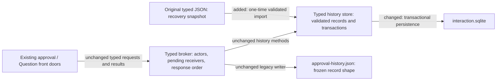
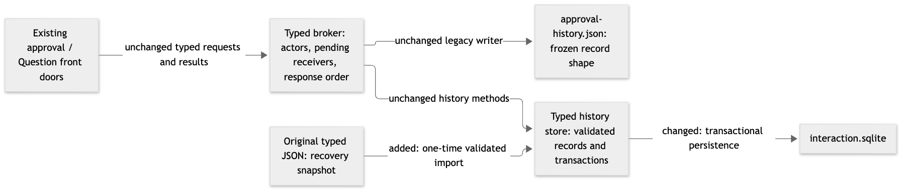
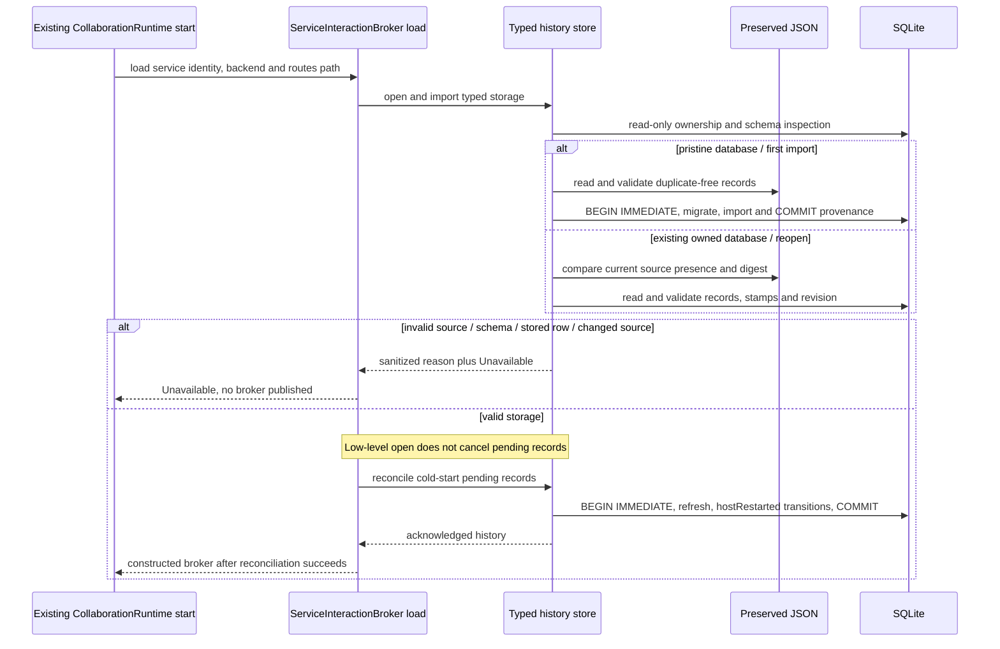
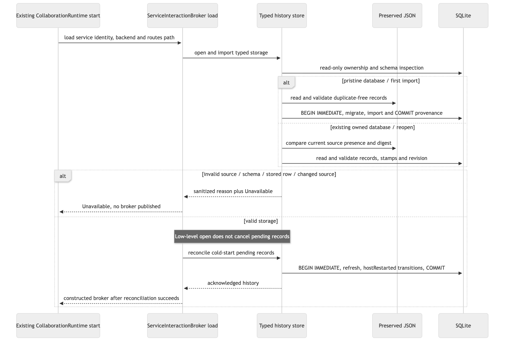
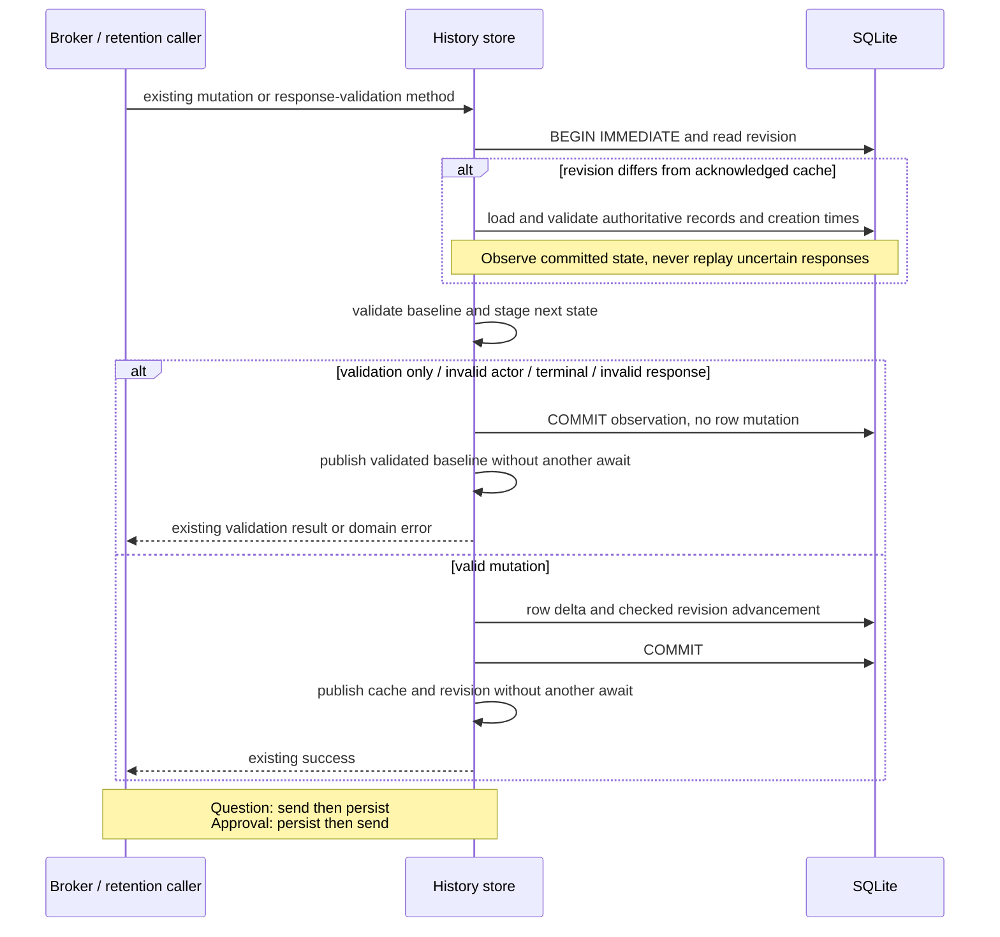
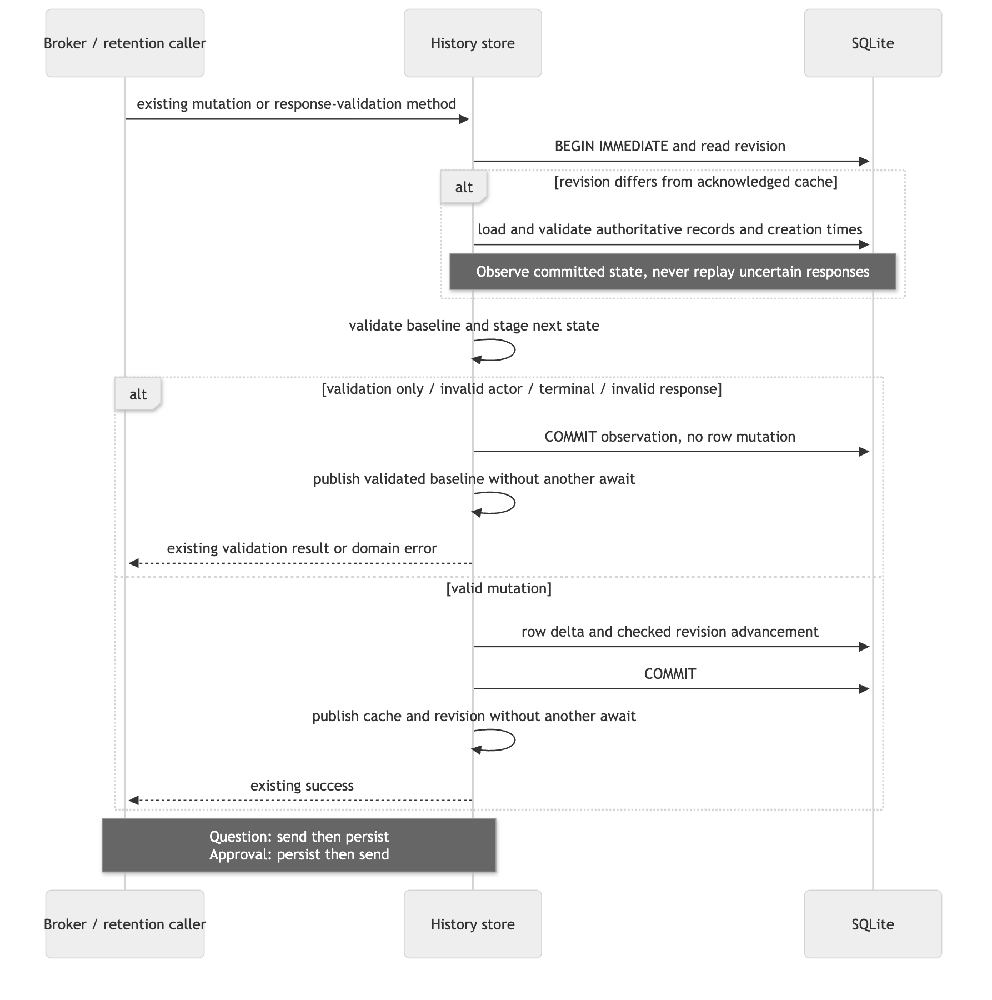

# Typed interaction SQLite owner

The [Specification](specification.md) keeps the typed broker as the sole semantic owner. Replace its persistence backend; keep legacy approval persistence and provider response ownership where they are.

## Bindings and shapes

| Entity | Owner and home | Boundary shape / disposition |
|---|---|---|
| E1 Typed interaction | Existing typed history store in `collaboration-service::interaction_broker`; existing domain vocabulary in `interaction_history.rs`. | Existing Serde-tagged `InteractionHistoryRecord`: approval `{requester,approver,request,state,legacy_metadata?}`, Question `{requester,approver,request,state}`, refused approval `{requester,approver,refusal}`. Private checked-query row `{request_id: String, created_at: String, record_json: String}`; validated decode. Persisted in a new `typed_interaction_history` table; cached under the existing store mutex. |
| E2 Creation time | Existing typed history store; modified SQLite representation. | UTC RFC3339 nanosecond text, ending `Z`, separate from E1 JSON. Rust timestamp validation on import/decode. Persisted; the cache retains `DateTime<Utc>`. |
| E3 Recovery source | Typed history store owns import; operator owns quiescence and recovery. | Original `interaction-history.json` bytes; private duplicate-rejecting map decoder. Nullable SHA-256 provenance (`None` means no source existed) in new singleton `interaction_history_import` metadata, with nonnegative revision. JSON remains a recovery copy, never a second writer. |

New tables belong to a separate `interaction-migrations/` bundle embedded with `sqlx::migrate!`; they do not enter the existing provider-operation database's migration lineage. Primary keys and NOT NULL enforce relational structure. Domain tags, timestamps, identifiers and revision validity are enforced in Rust, not SQL CHECK rules. No new public error variants or schema shape.

Checked-query preparation includes this bundle in the compilation-only schema used for `collaboration-service`; this does not combine production databases or their migration authorities. The owning crate tracks migration-directory changes for stable Rust recompilation, following the existing storage crates' build-script convention. The metadata preparation oracle must demonstrate that the interaction schema participates, rather than generating descriptions against a schema that omits it.

## Import and persistence

`ServiceInteractionBroker::load` in `collaboration-service` is the caller that sequences storage open/import, explicit pending reconciliation and broker construction. `CollaborationRuntime` continues calling that method unchanged; no new Host-crate call or owner is introduced. Current `CollaborationLifecycle::synchronize` also shuts down and starts its runtime when the schema digest changes; that existing in-process replacement still traverses broker load and retains today's `hostRestarted` behavior. A low-level database observer/reopen is not a broker startup and never performs reconciliation. Future hot handover remains a separate Host design.

On a new owned database, migration, valid import and import marker commit together in one owned transaction. If there is no JSON source, initialize an empty owned store with absent-source provenance. A rollback can leave the filesystem database artifact while removing every schema/import effect; this is not a completed import. Read-only inspection admits that pristine empty artifact for retry only when it has no schema objects or migration-history table and both `user_version` and `application_id` are zero. No file is deleted. Marker-only, partially populated, corrupt or unrelated databases fail closed rather than being guessed to be a failed import.

An already-initialized database is adopted only when its exact owned migration/schema proof is valid; reject unknown databases rather than registering them as this schema. Dirty, newer or checksum-invalid migration history is unavailable. Validate every record and creation instant before startup reconciliation. Reopen uses SQLite history; it never imports the recovery file a second time. Compare its bytes' digest with stored provenance, including presence/absence changes; reject divergence explicitly.

Migration history must be the exact successful ordered prefix of this bundle, with matching checksums, before any upgrade. A recognized version appearing after a missing predecessor is invalid, even when SQLx would otherwise recognize each version separately. At the current schema, validate the owned table/key/nullability definitions and reject unexpected schema objects before decoding rows. Require exactly one valid metadata row, an immutable source-provenance value and a nonnegative revision; validate revision advancement for overflow in Rust before writing. These checks prove ownership rather than silently adopting an unrelated database with similar table names.

Inspect a pre-existing database through a non-creating, read-only boundary before writable connection pragmas or migrations can alter it. A valid owned migration prefix can then be upgraded under the import/migration transaction; an unknown or invalid database remains untouched. The same read-only inspection boundary has no orphan-cancellation effect.

Import completion and cold-start reconciliation have separate transaction boundaries. Import commits schema, rows, creation instants and provenance atomically. Then the owning broker startup explicitly reconciles pending records in another transaction and publishes the broker only on success. If startup fails or is aborted between those commits, imported records and timestamps remain valid; the next owning startup reloads them, skips import and performs reconciliation. No connection-only reopen or independently stale writer test may perform cold-start cancellation.

Use a long-lived SQLx connection under the existing serialized store boundary, WAL, FULL synchronous durability and a bounded busy timeout consistent with repository stores. Use private checked-query rows with committed offline metadata. Preserve the acknowledged ordered cache and infallible listing methods; replace snapshot rewrites with transactional row deltas from the staged next state. Insert adds record and immutable creation stamp; update changes only `record_json`; deletion removes an explicitly selected expired record. Import is the initial bulk insert. The database revision advances once with each committed nonempty change set.

Every mutation, cold-start reconciliation and Question-response validation acquires the store mutex and begins a database transaction before validating cached state. Read the authoritative revision. When it differs from the cache, reload and validate current records and creation instants through the same decoder used on open, rather than persisting a stale snapshot or permanently rejecting later writes. Validation and staging use that authoritative baseline. A duplicate/terminal/actor error is returned according to that baseline; no old decision is re-executed or sent. Invalid rows or storage failures return unavailable. The next operation observes a processed-but-unacknowledged commit and can accept a new valid mutation without restarting the Host. Cache recovery is not callback recovery or provider-consumption proof.

After successful commit publish the validated next cache and observed revision synchronously under the same mutex, with no intervening await. On a commit error or caller drop, cache publication may not occur; listings retain the last acknowledged view until a successful validated refresh. Response-validation checks current database state before an answer is sent. A refresh performed by validation or a no-write operation commits its observation transaction and publishes the validated baseline without issuing new mutations, even when the incoming action is then rejected. The store never transparently retries an uncertain mutation. This stays inside the existing storage owner: no new runtime, background actor, write tracker, callback journal or Host task boundary. Cache-only `interaction()` reads used by the broker when there is no pending receiver also use the last acknowledged view. After an unacknowledged commit they may classify a retry as `NotPending` rather than `AlreadySettled` until a refreshing operation observes the terminal row. No result here claims that the cancelled call acknowledged success; no receiver is recreated or response resent. This is the same acknowledged-view limitation as listings, not a new public response or successful retry guarantee.

This preserves existing staging while reducing writes to O(changed records). Revision-mismatch refresh is O(n) but is skipped when the cache matches. Full snapshots are rejected because unrelated-row rewrites add no necessary behavior and make creation-time immutability depend on rewriting cached stamps correctly. A fully query-backed read API would introduce fallible public reads and stays out of scope. JSON dual-writing creates two authorities and is rejected.

## Operator diagnostics and non-destructive recovery

The private startup failure reason is one of `StorageUnavailable`, `InvalidImportSource`, `InvalidSchema`, `InvalidStoredRecord`, `RecoverySourceChanged`. Emit a structured `interaction_history_startup_failed` diagnostic with that reason at the storage/broker boundary before mapping to the existing public `Unavailable` error. Do not include record bodies, answers, actors, credential/account data or resolved configuration. Mutation failures use the same private classification where applicable; no new public response enum/code.

A recovery-source mismatch deliberately prevents startup. Preserve the owned database and divergent source for inspection. If provenance records a present original source and its exact bytes are available from the retained recovery copy or a trusted backup, restoring those bytes permits startup without reimporting or modifying SQLite. If provenance records no original source, preserving a newly appeared source under a different operator-selected name restores the expected absence without deleting its content. These are documented operator recovery conditions, not automatic importer actions. If the original bytes/expected absence cannot be restored safely, leave startup unavailable and report `RecoverySourceChanged`; merging/exporting histories needs separate authorization. Invalid owned data needs an intact backup or separately authorized repair, never clearing migration history or deleting records to manufacture readiness.

## Preserved lifecycle and failure boundaries

| Boundary | Behavior, containment and recovery owner |
|---|---|
| Import malformed / database corrupt / unknown schema | Return unavailable; preserve source and prior committed database. No quarantine, repair, delete or automatic fallback. Operator inspects copies. |
| Mutation error or transaction drop before commit | Owned transaction rolls back; keep acknowledged cache unchanged. No implicit retry of provider effects. |
| Commit response lost / caller abort | Commit may have happened. Next mutation/response-validation reloads validated authoritative state before staging if revisions differ; no permanent write outage or replay. Listings remain the acknowledged view until refresh. The fixes design's Question caller-work lifetime remains separate. |
| Concurrent same-store mutation / settlement | Store mutex and BEGIN IMMEDIATE serialize authoritative validation and row deltas; only one terminal transition succeeds. Independently loaded writers validate current database state and cannot overwrite unrelated records. |
| Question answer | Existing validation → completion send → history persistence remains. A failed send cancels as requesterUnavailable. A sent answer plus later persistence error remains partial success, never replayed. |
| Approval decision | Existing history decision commit → completion send remains. A write failure cannot send an approval choice. |
| Ordinary cold startup | Invoke orphan reconciliation explicitly after storage import/load, under the existing exclusive cold-start Host owner; pending approvals and Questions become hostRestarted in a transaction. A low-level store connection/reopen never claims that records are orphaned. Keep reconciliation separate from low-level connection/schema inspection for future Host integration. |
| Host replacement | No Prepare/Deactivate/Activate behavior is implemented here. Future Prepare must be non-mutating; import/migrate/reconcile only at Activate after the old writer barrier. SQLite is not evidence that all broker/drop writes have drained. |
| Retention | Keep strict creation-time cutoff, nanosecond precision, batch bounds and deterministic oldest-first deletion. Recovery copies remain protected by the explicit owner boundary; no policy for deleting them is invented. |
| Rollback / old JSON writer | Actual deployment requires all old writers stopped first, then one importer. Changed JSON after import rejects reopen; detection cannot stop an already-running old binary. Never start an older typed-JSON writer against a stale recovery snapshot as an automatic rollback. After SQLite writes, operator reconciliation/export is required and remains a separately authorized operation. |

Source evidence: `interaction_history_store.rs:58-128,594-624` (current decode/reconcile/persist), `typed_interactions.rs:266-304,536-553` (Question/approval order), `interaction_broker.rs:291-303` (separate histories), `provider_operation_store.rs:105-119` (SQLx transaction conventions), historical PR86 `d6a58e53` Program Design F9 (legacy JSON separation). Host's separate current design `95652af5`, §§6.1/6.5, requires non-mutating Prepare and all-writes barrier. This design introduces no Host implementation or acceptance.

The current production composition obtains `HostInstance` before starting collaboration (`host_singleton_authority.rs:25-46`, `lifecycle_owner.rs:202-212,331-346`). `CollaborationLifecycle` retains one runtime and awaits shutdown before replacing it (`lifecycle_owner/collaboration_lifecycle.rs:85-125`). This is the cold-start ownership precondition, not a new storage lock or evidence of the future hot-replacement write barrier. Independent SQLite connections for read/transaction tests do not invoke orphan reconciliation; proof must distinguish a low-level reopen from owning broker cold startup. The single-live-broker precondition prevents independently owned pending receivers from becoming orphaned: database refresh is not a cross-broker or cross-version callback ownership mechanism. It cannot distinguish an unacknowledged own commit from a different store commit. Tests may use independent database observers/writers to exercise storage consistency, but that does not admit a second live broker or prove the Host all-writes shutdown barrier. No arbitrary second broker startup is made safe by revision refresh.

## Realization and proof map

| U | R / observable contract | E | Owner | Interface | Shape and home | State | Failure | Proof seam |
|---|---|---|---|---|---|---|---|---|
| U1 | R1 durable mutation/reopen | E1,E2 | Typed history store | Existing mutation methods | Private SQLite row; history domain module | Commit then cache | Rollback/unavailable | Real store reopen and failed transaction |
| U2 | R2 atomic import / recovery copy | E1,E2,E3 | Typed history store | Import/load | Source bytes + import provenance; separate migration bundle | Unimported → imported once | Whole-import rollback | Populated import/retry and byte comparison |
| U2 | R3 invalid source / rows / schema | E1,E2,E3 | Typed history store | Validated decoder/schema inspector | Domain Serde + Rust guards; checked rows | Valid only | Unavailable, no coercion | Corrupt-row/database and malformed-source table |
| U3 | R4 approval / Question semantics | E1 | Typed broker | Existing request/decide/respond methods | Existing request/response enums | Single settlement; preserved ordering | Existing actor/option/unavailable errors | Broker response channels with actual SQLite failure |
| U3 | R5 startup / strict retention | E1,E2 | Typed history store; broker startup caller | ServiceInteractionBroker load → explicit reconciliation / prune | Existing cancellation enums + UTC instant | Pending → hostRestarted; expired → removed | No broker publication on reconciliation failure | Owning startup, observer reopen and nanosecond cutoff/batch reopen |
| U4 | R6 writers / recovery | E1,E3 | Typed history store; operator cutover | Revision refresh / provenance check / reason diagnostic | Metadata revision/digest; private reason enum; migration bundle | Authoritative baseline and acknowledged cache | Reason-specific unavailable, preserve database/source | Commit-before-cache next mutation, competing settlement, divergence diagnostic/recovery |
| U5 | R7 bounded proof/delivery | E1,E2,E3 | Lead acceptance; typed store | Existing proof and review boundary | Focused real SQLite and broker receipts | Reviewed local checkpoint | Failed gates remain incomplete | Required quality gates, independent review, explicit commit-signature evidence |

All E1/E2/E3 bindings and R1–R7 have named realizations. Invalid variants/identities/timestamps/answers are rejected at typed decode; duplicate ids are rejected at import and primary-key insertion; stale cached baselines are refreshed and validated inside the transaction before staging writes. Actual filesystem/SQLite must be real in proof. Provider transport may use existing broker fixtures because this migration does not change it. No stand-in can count as SQLite or write-failure evidence.
