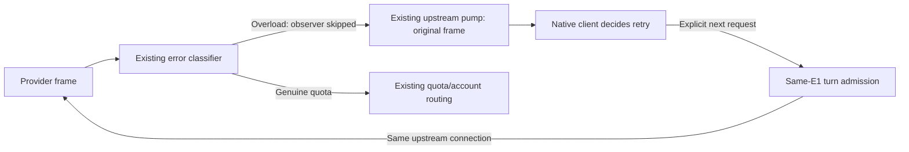

# Proxy overload forwarding design

This realizes [Specification](specification.md) under [Requirements](requirements.md). Current source basis is router-fixes `9a8d37d708e2a6dd8d400bf4b7434ca94be511b9`.

The existing upstream pump owns message forwarding and terminal-turn release. Its provider-signal boundary owns genuine quota/floor decisions. Remove the ModelCapacity special branch in `websocket/provider_signals.rs`; the existing non-quota return then forwards the original message without requesting Close. Preserve `ProviderErrorClassification::ModelCapacity` in `provider_error.rs` and its quota-exclusion use in `duplex_forwarding.rs` so capacity cannot be misclassified or persisted as quota.

Remove the now-unused `capacity_retry.rs` tracker, its module/imports, registry fields/methods/removal bookkeeping, async-tunnel thread-id extraction/registration and completed-response retry clearing. Do not remove unrelated header forwarding, session registry or account admission logic. No new retry owner, state store, preference or public protocol is introduced.

E1 maps to `forward_duplex_until_complete` and its two pumps. E2 maps to the actual tungstenite Message and provider classifier. E3 maps to the existing account/affinity context and observer. E4 maps to incoming client frames admitted by `AccountTurnAdmission`. A forwarded terminal error releases the active turn through existing terminal handling, allowing the next explicit request on the same socket. Account selection and cleanup owners are unchanged.

| Entity | Existing owner and representation | State boundary |
| --- | --- | --- |
| E1 connection pair | Existing WebSocket forwarding, two `WebSocketStream` instances and cancellation/registration context | Transient transport state; existing lifecycle only |
| E2 provider error frame | Existing `Message` forwarded by upstream pump; derived classification in `provider_error` | Transient original payload remains the client-facing source of truth |
| E3 selected account | Existing `WebSocketAffinityOwnerContext`, `AccountId`, quota observer | Existing persisted account/affinity state and transient selection; no overload state is persisted |
| E4 explicit client request | Existing local pump and `AccountTurnAdmission` | Transient admission/request state; no replay queue is introduced |

The smaller structure removes policy rather than relocating it. It costs Router-specific capacity retry guidance, which the owner has rejected; native clients retain control. No alternative retry implementation is needed to satisfy the authorized outcome.

Proof exercises the actual pumps through an isolated Router process and explicit WebSocket client. Replace capacity-policy tests with unchanged-frame/same-socket continuation proof. Present exactly one valid `thread-id` through the production handshake, paired with a no-header control: the same permanent test must fail before removal and pass afterward. Cover both recognized codes and both terminal envelopes, repeated overloads beyond the former ten-event limit, and absent/empty/duplicate/overlong thread-id carriers. Add NEW mixed code/type capacity-versus-quota classifier cases in both field directions and both normal-size envelopes, plus the oversized `error` prefix path. Keep existing pure-capacity classifier tests. The independent oracle is the literal original payload plus the next explicitly sent request observed upstream, with no extra proxy-created requests, quota-exhaustion mutation, alternative selection or account redirection. Do not derive expected frames from production formatting helpers.

The existing floor-switch write-readiness fixture has a `ParkedCapacity` trigger that relies solely on the policy being removed. Delete this dead-policy case and capacity-specific setup/assertion terms. Its supported parked-create/held-write cleanup shape is already proved by `ParkedQuota`; both completion orders and forced revocation/shutdown are proved by `HardFloor` cases. Preserve those existing tests and all pending poll_write, survivor retention, zero-byte-before-readiness, resource-release and peer/client Close assertions. No duplicate trigger or expanded test matrix is needed. The only unique late-cancellation branch belongs to the removed capacity policy, so deleting its test does not weaken proof of any remaining close path.

Claude 529 is not modified; retain its real server-pipeline regression. No provider inference, credential inspection, production restart or client retry modification is needed. Real provider behavior and native retry timing remain outside this repair's proof.

Existing installed-Codex fixtures in `codex-router-test-support/src/installed_codex/retry.rs` and `tests/codex_retry.rs` assume Router-driven capacity reconnects and exactly ten rewrites. Remove those dead-contract scenarios and capacity exports; remove the capacity delay environment hook in `installed_codex.rs`, preserving the separate quota hook and genuine quota scenarios. Replace the forwarding/account-preservation coverage with an isolated actual Router process, a loopback fixture upstream and an explicit WebSocket client. Seed an eligible spare account so reselection could occur if incorrectly introduced. Observe literal overload payloads, a separately submitted next request on the same upstream connection, no extra Router requests, no quota-exhaustion database/runtime mutation and no account redirection. Existing same-account previous-response owner recording and pin activity writes remain valid and must not be suppressed by the test or repair. No provider inference or owner credentials are involved; the fixture does not establish native client retry timing.

Current terminal bookkeeping recognizes `response.failed` or a non-success status on `error`. Same-socket next-turn proof must cover those actual terminal shapes. A missing-status error still needs unchanged forwarding characterization; do not expand this repair into a new generic error-recovery policy. If current bookkeeping blocks a valid terminal provider envelope required by S2, return the decisive protocol/source evidence to the Lead before changing that boundary.

| Obligation | Existing realization and permitted delta | Proof |
| --- | --- | --- |
| S1 | Remove only overload rewrite/tracker/wiring at existing provider-signal boundary | Real handshake carrying valid thread-id and no-header control; literal code/envelope matrix and repeated overloads |
| S2 | Existing terminal delivery/turn release and same connection forwarding | Explicit next client create and ordinary reply observed on the same upstream socket; no proxy-created request |
| S3 | Preserve ModelCapacity precedence and quota observer exclusion; existing same-account writes stay | New mixed-token classifier cases; real eligible spare account and quota-state/redirection checks |
| S4 | Existing quota/floor/admission/reservation/auth and Close supervisor unchanged | Keep ParkedQuota, all HardFloor readiness/forced cases, quota-frame, terminal, auth/reservation regressions |
| S5 | Existing Claude 529 pipeline unchanged | Existing long-error-body server-pipeline regression, one upstream request and preserved status/body/header |
