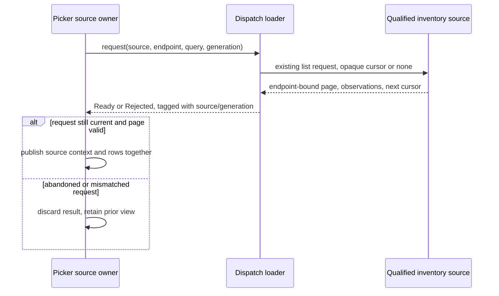

# Router selector A2 source-contract preparation

Status: bounded Program Design preparation; not a final structural decision, implementation plan, or implementation authorization. D1 source-view entry/return and D2 default provenance remain owner decisions.

## Current source facts

- `SessionsPickerRecordLoader` accepts only `SessionsPickerDataQuery`: `crates/agent-collaboration/src/session_picker/picker_request.rs:25-41`.
- Dispatch constructs one loader closure that captures one repository context and one service directory: `crates/agent-collaboration/src/session_command_dispatch.rs:324-358`.
- The picker owns a watch-channel reload worker, a local reload generation, and a three-second refresh loop: `crates/agent-collaboration/src/session_picker/picker_component.rs:76-115,185-203`.
- Stored inventory results have `generation: Option<CodexGeneration>`, and Stored cursors are based on stored time/id rather than live generation/native cursors: `crates/collaboration-protocol/src/native_session_catalog.rs:42-97`; `crates/collaboration-service/src/session_inventory_dispatch.rs:218-232,360-372,412-418`.
- The client validates that an inventory result and every row target the requested endpoint, but does not provide a source-view contract: `crates/collaboration-client/src/control_connection.rs:294-317`.
- Local stored rows begin as `LocalCodex`; runtime refresh can stamp them with a default endpoint and produce `HostedCodex(SessionRef)`: `crates/agent-collaboration/src/session_commands/session_catalog_records.rs:95-149`; `session_commands/picker_runtime_inventory.rs:320-345`.
- The protocol already defines full `SessionRef { endpoint: EndpointRef { service_id, endpoint_id }, session_id }` identity in `crates/collaboration-protocol/src/endpoint_identity.rs`. Picker rows already carry that identity as `SessionPickerIdentity::HostedCodex(SessionRef)` or `HostedProvider(SessionRef)`; the loss happens at `picker_actions.rs:21-26`, where resume/fork outcomes carry only `String`, and at dispatch where those strings are consumed.

These facts establish the missing boundaries. They do not choose the F2 key/return behavior, default provenance qualification, fork cwd, or remote transport.

Additional source observations for the 2026-10-05 refinement: the server validates `include_empty_sessions` as well as endpoint/view/scope/source/query when continuing a cursor (`session_inventory_dispatch.rs:198-230`). The client contract carries `cursor` and `next_cursor` as bounded opaque strings (`native_session_catalog.rs:42-61,87-99`). Each Stored request opens the read-only catalog and reads a keyset page; it does not retain a read transaction across requests (`session_inventory_dispatch.rs:285-326,410-417`; `stored_thread_catalog.rs:13-37`; `stored_thread_query.rs:53-127`). The resulting pages have endpoint/query consistency, not a frozen cross-page database snapshot.

## Proposed contract seams (to bind after D1/D2)

### 1. Source-aware request/result boundary

**Owner:** source-view picker owner creates requests; dispatch loader owner resolves and queries the selected source.

The current query must be extended conceptually with an invocation-local source context and attempt generation:

```text
SourceInventoryRequest {
  sourceContext: PickerSourceContext,
  endpointSelector: ConfiguredOrDefaultEndpointSelector,
  view: Stored | Loaded | Active,
  scope: SourceOwnedScope,
  sourceFilter: Interactive | Subagents | All,
  includeEmptySessions: bool,
  query: SearchExpression,
  cursor: SourceCursor | None,
  requestGeneration: SourceViewGeneration,
  cancellation: ReadOnlyRequestCancellation
}
```

The loader returns a closed result owned by the source-view owner:

```text
SourceInventoryResult =
  Ready { sourceContext, endpoint, page, progress: InventoryPageProgress, requestGeneration }
  | Rejected { sourceContext, requestGeneration, reason }
  | Canceled { sourceContext, requestGeneration }

InventoryPageProgress =
  Complete
  | MoreAvailable { continuation: SourceContinuation }
  | SuspendedWithContinuation { continuation: SourceContinuation }

SourceContinuation =
  Stored { envelope: StoredSourceContinuation }
  | Runtime { envelope: RuntimeSourceContinuation }

SourceInventoryRejection =
  SourceUnavailable | InvalidInventory | WrongEndpoint
  | UnsupportedViewOrScope | UnsupportedQuery
  | InvalidContinuation
  | StaleSnapshot | TransportFailure
```

`requestGeneration` is picker-local and prevents a stale source/query result from replacing the active view. A result cannot launch, change the default NEW target, or mutate a different source view. Cancellation is read-only best effort; stale-result rejection remains mandatory when cancellation races.

The existing three-second refresh loop must not be inherited automatically by a configured source. Refresh ownership and cadence remain a source-view design choice after D1; default/local refresh behavior remains unchanged.

### 2. Source-to-endpoint binding boundary

**Owner:** connection verifier; consumed by dispatch loader and source-view owner.

The registry's expected stable service identity is not itself an endpoint. The verifier must map one selected source to one currently advertised endpoint and return either:

```text
EndpointBinding =
  Bound { serviceIdentity, endpoint, generationOrStoredContext }
  | Rejected { reason: WrongService | EndpointUnavailable | EndpointUnqualified | AmbiguousEndpoint | StaleSnapshot }
```

Configured-source draft binding rule: retain the existing default endpoint resolver unchanged; within a configured source's qualified service inventory, require exactly one available native Codex endpoint for this native inventory consumer. No eligible endpoint rejects as `EndpointUnavailable` or `EndpointUnqualified`; more than one rejects as `AmbiguousEndpoint` rather than taking the first entry or inventing an endpoint ID. An exact endpoint reference already supplied by a qualified source context must match that inventory. This rule requires no new registry key and remains a draft structural proposal pending final Program Design review.

No machine label, UUID match, caller-local endpoint, or remote health result substitutes for service qualification. The endpoint tuple proves inventory routing only; it does not prove native creation/attachment binding or remote policy projection. The Stored context is invocation-local endpoint/query bookkeeping, not a new server snapshot or generation field. A changed observed service epoch invalidates the active request/cursor chain; epoch checking cannot establish a frozen Stored database or detect every later native attachment race.

### 3. Stored cursor and source consistency

**Owner:** inventory dispatch validates the cursor; source-view owner invalidates it on context changes.

A client must preserve the server's `next_cursor` without decoding or reconstructing its wire representation. The following is a client-local continuation envelope, not a new wire cursor or persisted schema:

```text
StoredSourceContinuation {
  opaqueServerCursor,
  endpoint,
  view: Stored,
  source,
  scope,
  query,
  includeEmptySessions,
  requestGeneration
}

RuntimeSourceContinuation {
  opaqueServerCursor,
  endpoint,
  view: Loaded | Active,
  observedGeneration: CodexGeneration,
  source,
  scope,
  query,
  includeEmptySessions,
  requestGeneration
}
```

The existing server wire cursor carries stored time/id and matching endpoint/view/source/scope/query/empty-session filter; it rejects a live `CodexGeneration`, native runtime cursor or expiration field for Stored. A client continuation is eligible only while its local envelope still matches the active request. The server separately validates the opaque cursor. Source switches, query/filter changes, cancellation and abandonment discard the pending continuation. The picker-local `SourceViewGeneration` guards UI freshness and does not become a server cursor field.

Loaded/Active progress uses the Runtime variant, preserving the observed native generation in its local envelope. The server's opaque runtime cursor also binds its generation and expiry and rejects Stored fields (`session_inventory_dispatch.rs:233-242`). A changed generation or server-reported expired/invalid cursor discards that chain with `InvalidContinuation`; any subsequent explicit fresh query starts without a cursor. The client does not decode or invent expiry, and never substitutes a Stored continuation for a runtime one. This keeps view-specific paging expressible without a new wire format or automatic retry.

Stored browsing is best-effort keyset pagination. Concurrent updates may move not-yet-read rows above the descending keyset boundary, omitting them until a fresh query; a cursor is not snapshot isolation, a liveness lease, or action-time existence proof. Row keys use full source identity. A repeated cursor is an invalid continuation, without silent source fallback. A rejected pending source switch does not erase the retained prior view.

Short or empty pages with `next_cursor` are valid: the server applies empty-session/repository predicates after the SQL limit and advances the cursor over filtered rows. The client follows the server's continuation, never treating returned-row count as exhaustion. A local work budget is measured by pages fetched, not displayed rows. The loader returns `Ready` with `Complete` only when the producer returns no next cursor; `MoreAvailable` carries a valid next cursor at a normal page boundary, and `SuspendedWithContinuation` carries it when local fetched-page work reaches its budget. Each continuation-bearing variant requires its source-bound envelope; a suspension never manufactures a cursor. The view reports incomplete browsing/more available instead of an error or false completeness. This is proposed draft result meaning, not existing UI or an owner-approved key. Protocol-overbound row counts/response shape reject as `InvalidInventory` and repeated/nonconverging cursors as `InvalidContinuation`; legitimate sparse pages or work-budget suspension do not trigger those failures.

The dispatch loader owns the proposed view-specific response checks after existing client endpoint/row-count validation. For Stored, it requires `generation: None` and Stored observations; for Loaded/Active, it requires matching real generation and Runtime observations. Current `ControlClient::list_sessions` does not perform these view-specific checks; this is named future loader work, not existing enforcement. No change to the public wire response is proposed.

Only a result for the still-active tuple `(sourceContext, endpoint, view, scope, sourceFilter, query, includeEmptySessions, requestGeneration)` can publish rows. Successful publication commits the source context and rows together; canceled, superseded, mixed-endpoint or wrong-observation results publish nothing. The pending source load cannot publish an action outcome. D1 still owns the visible transition/return contract, and D2 still owns the default-attributed action eligibility policy.



This view describes a draft load boundary, not selected F2/Esc semantics or a runnable path. Rendering and independent verification remain unproved.

Query capability remains source-specific: the existing Stored wire `query` applies name/title substring matching (`stored_thread_query.rs:75-86`), whereas the local picker uses `SessionSearchExpression`. Passing a local search expression verbatim cannot establish equivalent remote semantics. The loader must only project query/scope forms supported by that source contract; an unqualified mapping returns `UnsupportedQuery` or `UnsupportedViewOrScope` rather than silently using caller-local filtering or changing the remote query. No broader search syntax or server contract is introduced by this preparation.

Even plain projected text has existing view-specific case behavior: Stored uses SQLite `NOCASE` (ASCII folding), while runtime filtering uses Rust Unicode lowercase/substring matching (`session_inventory_dispatch.rs:490-494`). Cross-view equality for non-ASCII matching is not promised. This preparation preserves those contracts and does not add a normalization or search rewrite.

### 4. Observed versus attributed identity

**Owner:** inventory projection and fork/resume action owner.

The action boundary must distinguish the following closed source identity cases:

```text
SessionActionSelection =
  ObservedHosted { identity: SessionPickerIdentity::HostedCodex(SessionRef), sourceContext, metadata }
  | ObservedProvider { identity: SessionPickerIdentity::HostedProvider(SessionRef), sourceContext, metadata }
  | LocalHome { identity: SessionPickerIdentity::LocalCodex(sessionId), codexHome, metadata }
  | DefaultAttributed { identity: SessionPickerIdentity::LocalCodex(sessionId), defaultEndpointAttribution, metadata }
```

The source/action contract reuses these existing picker identities; it does not create a second SessionRef or persisted identity schema. `ObservedHosted` and `ObservedProvider` are permitted for configured-source actions and rows returned by a verified source inventory. `DefaultAttributed` preserves today's default catalog behavior but is not positive historical Router provenance; it must not be reinterpreted on a named remote source. `LocalHome` retains the unhosted local source. A fork/resume selection carries the existing identity plus source context instead of a bare `String` ID; dispatch must consume that typed selection and preserve its endpoint/session route. The final choice between qualifying default-attributed rows and preserving today's default fork behavior is D2.

## Proof seams

These scenarios are future proof obligations for the draft contract, not tests run in this design-only lane:

| Scenario | Expected result and source-based oracle |
| --- | --- |
| Change `includeEmptySessions` while reusing a cursor | Discard client continuation; server rejects a cursor whose empty-session filter differs (`session_inventory_dispatch.rs:208-217`). |
| Receive an empty or short Stored page with a next cursor | Follow the opaque continuation, bounded by fetched-page work budget; budget suspension retains more-available state, not exhaustion or error. |
| Receive a Stored page with live generation or Runtime observations | Reject as invalid inventory; the real Stored producer returns no generation and Stored observations, separately from Loaded/Active. |
| Cancel source B while its request runs, then return to source A | B's tagged result cannot replace A's context/rows or publish any action; the retained view remains authoritative. This is proposed owner behavior, not current runtime proof. |
| Configure a source with two eligible native endpoints | Draft verifier returns `AmbiguousEndpoint`; it does not choose by inventory order or caller-local endpoint. Final review must verify this rule. |
| Update a Stored row between page requests | No frozen-snapshot or liveness guarantee is reported; action qualification remains separate and the source page cannot establish native attachment identity. |
| Supply local `id:` search syntax to remote Stored inventory | No equivalence inferred from the string; supported query projection is required or the request is rejected as `UnsupportedQuery`. |
| Change view/scope or use non-ASCII case variants between requests | Invalidate the full request envelope; preserve each view's existing search semantics rather than promising identical matches. |

- Request/result unit seam: current source context, endpoint, cursor, and request generation remain paired; stale and canceled results cannot replace the active view.
- Endpoint binding seam: wrong-service, unavailable, multiple/unclear endpoint and changed snapshot reject before source rows become actionable.
- Stored pagination seam: matching endpoint/source/scope/query/empty-session filter continues using an opaque cursor; mismatched or generation-bearing Stored cursors reject; a source switch invalidates the pending continuation while failed switches retain the prior view. Concurrent writes do not gain an invented snapshot guarantee.
- Provenance seam: configured-source actions require `ObservedHosted`; default-attributed rows cannot be sent to another Router; local rows retain `LocalHome`.
- Refresh seam: configured source does not inherit default three-second polling without an explicit source-view contract.
- Cross-machine fork seam remains disabled until portability/transport proof; no state copy or fallback is introduced.

## Deferred owner choices and dependencies

- **D1:** source-view entry/return and Esc precedence; the existing brief recommends F2.
- **D2:** default-attributed provenance versus preserving today's default fork behavior; see the provenance brief.
- **D3:** effective fork cwd/policy and visible origin.
- **D4:** whether a rejection-only remote slice can be planned before external exposure/binding/policy prerequisites.

A2 can be integrated into Program Design only after D1 and D2 settle the source-view owner and default identity rule. This packet intentionally leaves those choices open and does not authorize implementation.
